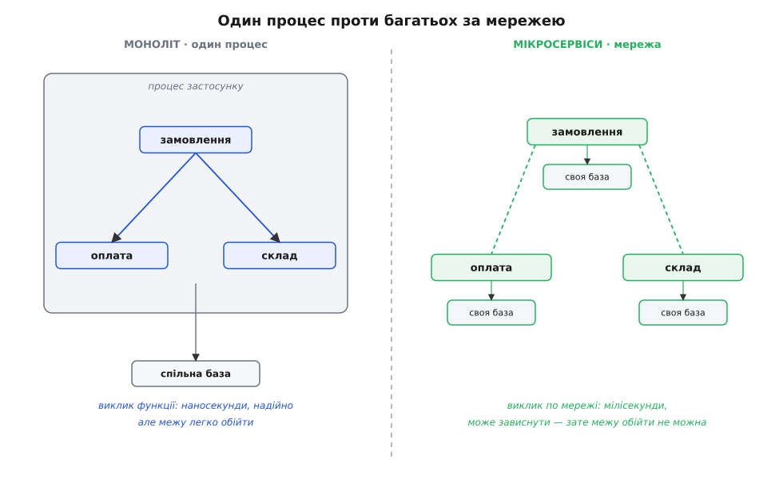
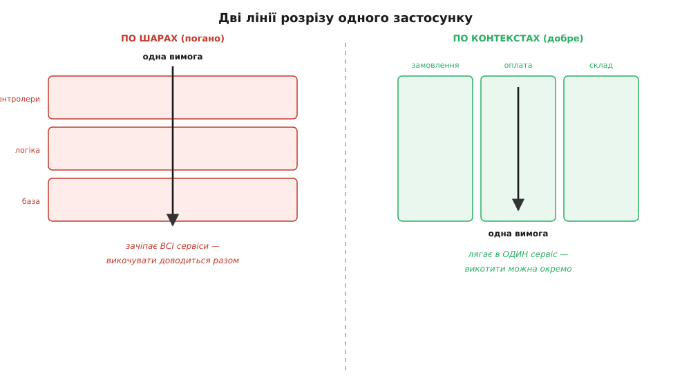

# Мікросервіси

<preknowlist>
- [Зчеплення і зв'язність](root:sf-apps/coupling-cohesion) — що таке зчеплення (наскільки один модуль знає про інший) і зв'язність (наскільки шматки всередині модуля стосуються однієї справи); уся ідея мікросервісів — це спроба керувати саме цими двома величинами через фізичну межу процесу.
- [Обмежений контекст](root:sf-apps/bounded-context) — межа, у якій одне слово має одне значення й одну модель; правильна лінія розрізу на сервіси йде саме по цих межах, а не абияк.
- [Подієва архітектура всередині застосунку](root:sf-apps/event-driven-architecture) — «оголоси факт, а хто зреагує — не твоя турбота»; той самий механізм розв'язки між модулями стає головним способом спілкування між сервісами.
- [Сервісний шар](root:sf-apps/service-layer) — тонкий шар, що збирає операцію застосунку («оформити замовлення») в один виклик; окремий сервіс — це, по суті, такий шар, винесений у власний процес за мережу.
</preknowlist>

Уяви крамницю, зібрану як один застосунок. Каталог товарів, кошик, оплата, склад, розсилка листів, звіти для бухгалтерії — усе в одному проєкті, компілюється в один виконуваний файл, ходить в одну базу даних. Спершу це чудово: усе поряд, виклик із каталогу в кошик — звичайна функція, жодних зайвих клопотів. Але команда росте. Уже не троє людей, а тридцять, поділені на п'ять груп: одні пораються з оплатою, інші зі складом, треті зі звітами. І тут виявляється неприємне.

Група оплати виправила дрібну помилку в обробці карток. Щоб ця правка потрапила до користувачів, треба **зібрати й викотити весь застосунок** — разом із каталогом, кошиком, звітами, яких вона й не торкалася. А викотити весь застосунок означає: дочекатися, поки група звітів **теж** доробить свій напівготовий код, бо він уже в тій самій гілці; прогнати всі тести всіх груп; узгодити вікно, коли можна зупинити систему. Одна крихітна правда однієї групи тягне за собою координацію з усіма. Що більше груп — то дорожче кожне викочування, і зрештою релізи стають рідкісною подією, до якої готуються тижнями.

Ось у цій точці й народжується сама причина мікросервісів. Вона не технічна, вона **організаційна**: коли багато незалежних команд змушені викочуватися разом, вони гальмують одна одну. І напрошується розв'язка — розрізати застосунок так, щоб кожна команда могла збирати, тестувати й викочувати **свій** шматок окремо, не питаючи дозволу в решти.

**Мікросервіс** (від гр. *mikrós* — «малий» + лат. *servīre* — «служити») — це маленький самостійний застосунок, який робить одну виразну ділянку роботи бізнесу, крутиться у власному процесі й спілкується з іншими такими застосунками через мережу (найчастіше HTTP або чергу повідомлень). Слово «маленький» тут збиває з пантелику — річ не в кількості рядків. Річ в іншій, куди важливішій властивості, заради якої усе й затівається.

> 🔧 **Навіщо це.** Головна валюта, яку купують мікросервісами, — **незалежне викочування** (independent deployability). Кожен сервіс збирається, тестується й котиться у продакшн **окремо** від інших. Група оплати випускає нову версію оплати щогодини, і жодна інша команда про це навіть не дізнається, поки контракт між сервісами не змінився. Ось за що платять усю ту ціну, про яку піде мова далі. Якщо ця властивість команді не потрібна — платити не варто.

## Одне слово, яке треба вимовляти обережно

Перш ніж рушити далі, розберімося з приставкою «мікро», бо саме через неї найбільше плутанини. Вона наштовхує на думку, що сервіс має бути крихітним — сто рядків, один клас, одна функція. Це хибний орієнтир, і він завів чимало команд у болото, де сервісів триста, а кожен — заглушка, і вся система тоне в мережевих викликах між ними.

Правильна міра розміру — не рядки, а **межа зміни**. Сервіс має бути таким, щоб одна осмислена вимога бізнесу («додати знижку постійним покупцям») лягала всередину **одного** сервісу, а не розповзалася по трьох. Тоді зміну можна зробити й викотити, не торкаючись сусідів. Скільки там вийде рядків — п'ятсот чи п'ять тисяч — байдуже. Правильний розмір сервісу диктує **бізнес**, а не лічильник рядків.

Звідки взагалі взялося це слово й ця приставка — окрема повчальна історія: [як народився термін «мікросервіси»](root:sf-apps/microservices/hist-microservices-term.md). Коротко: назву не вигадав один геній — її обрала група архітекторів на воркшопі під Венецією 2011 року, щоб позначити стиль, до якого багато хто дійшов незалежно; сама ж річ старша за назву. Це типова для нашого ремесла картина: практика визріває раніше, ніж їй дають ім'я.

## Чому саме мережа, а не просто модулі

Логічне заперечення напрошується одразу. Якщо мета — щоб команди не заважали одна одній, навіщо різати систему на окремі процеси й ставити між ними мережу? Хіба не можна лишити один застосунок, але поділити його на чіткі внутрішні модулі з ясними межами? Можна. Саме це й називають [модульним монолітом](root:sf-apps/modular-monolith) — один процес, одне викочування, але всередині — суворо розмежовані модулі, які спілкуються лише через оголошені інтерфейси. Для більшості систем це і є правильна відповідь, і чесна стаття про мікросервіси мусить це сказати першим.

Різниця в одному: у моноліті межу між модулями тримає **дисципліна**, а в мікросервісах — **фізика**. У спільному процесі ніщо не заважає програмісту зі звітів у поспіху смикнути напряму внутрішній клас складу — компілятор дозволить, воно скомпілюється, і межа тихенько протече. За рік таких протікань набереться сотня, і «чіткі модулі» перетворяться на суцільний клубок, де все знає про все. А коли модулі розведені по різних процесах, такий фокус **неможливий фізично**: зі звітів до складу немає прямого виклику, є лише мережа й оголошений контракт. Хочеш щось від складу — питай його по HTTP, через ту саму двері, що й усі. Межу тримає не добра воля, а неможливість її обійти.

Ось де справжня межа book-атома «зчеплення і зв'язність» стає видимою фізично: мережа перетворює логічну межу на непереборну.

Але за цю непереборність платять, і платять дорого. Виклик функції в одному процесі — це наносекунди, він або відбувся, або програма впала. Виклик по мережі — це мілісекунди (у мільйони разів повільніше), і він має **третій** результат, якого не буває в локального виклику: він міг **зависнути**. Не відповів «так», не відповів «ні» — просто мовчить, і ти не знаєш, чи запит дійшов, чи загубився, чи відповідь загубилася на зворотному шляху. Локальний виклик такого стану не має. Уся складність мікросервісів росте з цього одного факту: **мережа ненадійна, а межа тепер проходить по ній**.

*Ліворуч усе в одному процесі: виклик між модулями — звичайна функція, швидка й надійна, але й межу легко обійти. Праворуч кожен модуль — власний процес зі своєю базою; виклик іде по мережі, тож межу обійти не можна, зате кожен виклик повільний і може зависнути.*

## Правило, що вирішує все: своя база в кожного

Є одна риса, без якої «окремий процес» — це лише декорація, а не мікросервіс. Кожен сервіс володіє **своїми даними** й нікого до них не пускає напряму. Склад має свою базу, оплата — свою, каталог — свою. Ніхто, крім самого сервісу складу, не читає й не пише в базу складу. Хочеш знати залишок товару — питай сервіс складу по його інтерфейсу; лізти в його таблицю через SQL заборонено.

Це правило здається дріб'язковим, аж поки не побачиш, що станеться без нього. Уяви, що ми розрізали код на сервіси, але лишили одну спільну базу, куди ходять усі. Група складу вирішує перейменувати колонку `qty` на `quantity` у своїй таблиці. І тут з'ясовується, що в цю саму таблицю читає ще й сервіс звітів, і сервіс каталогу, і стара нічна вивантажувалка. Перейменування колонки ламає три чужі сервіси нараз. Ми повернулися рівно туди, звідки тікали: щоб змінити своє, треба узгодити з усіма. Спільна база — це прихований клубок зчеплення, тільки схований не в коді, а в схемі даних, і від того ще підступніший.

Тому правило залізне: **база даних — приватна власність сервісу**, частина його нутрощів, і назовні стирчить лише інтерфейс. Тоді склад може перейменовувати свої колонки, міняти рушій бази, робити що завгодно всередині — доки його **зовнішній контракт** не змінився, нікого це не обходить. Саме приватна база робить незалежне викочування насправді незалежним.

> 🔧 **Навіщо це.** Приватна база — це та сама інкапсуляція, що й `private`-поле в об'єкті, тільки піднята на рівень цілого застосунку. Об'єкт ховає поля за методами, щоб можна було міняти внутрішнє представлення, не ламаючи тих, хто ним користується. Сервіс ховає свою базу за інтерфейсом рівно з тієї ж причини й дає ту ж свободу — тільки ціна порушення тут не «зламався один клас», а «впало пів компанії».

## Розрізати не будь-як, а по швах предмета

Найважче й найдорожче рішення — **де провести лінії розрізу**. Зробиш неправильно — і жодна обіцяна вигода не спрацює, лишиться сама ціна. Спокуса — різати за технічними шарами: сервіс усіх контролерів, сервіс усієї бізнес-логіки, сервіс усіх звернень до бази. Це майже завжди помилка. Бо тоді кожна бізнес-вимога («оформити замовлення») проходить крізь **усі три** сервіси, і щоб її змінити, доведеться викочувати всі три узгоджено. Незалежне викочування щезло — ми відтворили моноліт, тільки повільніший і крихкіший, бо між шарами тепер мережа.

Різати треба по **предметних межах** — по тих самих обмежених контекстах, де живе своя модель і своя мова. «Оплата» — контекст: у ньому є картки, транзакції, повернення коштів, і слово «замовлення» означає «те, за що платять». «Доставка» — інший контекст: там є маршрути, кур'єри, адреси, а «замовлення» означає «те, що треба привезти». Це два різні погляди на одну річ, і межа між сервісами має пройти саме між ними. Тоді вимога, що стосується оплати, лягає всередину сервісу оплати, і викотити її можна окремо. Правильний розріз бере лінії з предмета, а не зі стеку технологій. Мистецтво знаходити ці шви — окрема глибока тема ([обмежений контекст](root:sf-apps/bounded-context) та [карта контекстів](root:sf-apps/context-mapping) розбирають, як їх шукати й як сервіси домовляються на межах).

І тут напрошується глибокий зв'язок, який спершу видається дивним. Виявляється, форма системи вперто повторює форму організації, що її будує. Якщо компанія поділена на команди «оплата», «склад», «доставка» — система природно розпадеться на сервіси з тими самими межами, бо люди пишуть код у межах свого спілкування. Це спостереження старе й напрочуд стійке — [закон Конвея](root:sf-apps/conways-law): архітектура повторює структуру команд. Досвідчені будівники користуються ним навмисне: спершу малюють, які команди мають бути незалежні, а тоді проводять межі сервісів по цих командах — і незалежне викочування стає природним, бо кожна команда володіє своїм сервісом цілком.

*Розріз по шарах (ліворуч) змушує кожну бізнес-зміну зачепити всі сервіси нараз — незалежність утрачено. Розріз по предметних контекстах (праворуч) замикає зміну в межах одного сервіса — саме цього ми й хотіли.*

## Як сервіси розмовляють: наказ проти факту

Коли межі проведено, постає питання спілкування. Сервіси мусять якось діяти спільно — оформлення замовлення чіпає й оплату, і склад, і доставку. Є два способи їх зв'язати, і вибір між ними визначає, наскільки міцно вони зчеплені.

Перший — **синхронний запит-відповідь**. Сервіс замовлень напряму кличе сервіс оплати по HTTP: «спиши гроші» — і **чекає** на відповідь, поки той не скаже «списав» чи «відмовлено». Просто й зрозуміло, потік видно як на долоні. Але сервіс замовлень тепер **залежить** від сервісу оплати: якщо оплата лежить чи гальмує, замовлення теж застрягає, чекаючи на неї. Зчеплення нікуди не поділося — воно лише переїхало в час виконання. Ланцюжок таких синхронних викликів крихкий: досить одній ланці впасти, і валиться весь ланцюг.

Другий — **асинхронна подія**. Сервіс замовлень робить своє й **оголошує факт**: «замовлення оформлено» — кидає подію в чергу й одразу повертається, ні на кого не чекаючи. А сервіс оплати сам підписаний на цей факт: побачив — списав гроші. Сервіс доставки теж підписаний — побачив, почав збирати посилку. Замовлення не знає ні про оплату, ні про доставку, і йому байдуже, чи вони зараз живі: подія полежить у черзі й дочекається, поки вони піднімуться. Це той самий механізм розв'язки, що й [подієва архітектура всередині застосунку](root:sf-apps/event-driven-architecture), тільки шина подій тепер справжня, мережева черга між процесами. Розгорнутий на весь ландшафт сервісів, він виростає в окремий стиль — [подієву архітектуру між сервісами](root:sf-apps/event-driven-architecture-distributed).

Різниця в наслідках. Синхронний виклик дає негайну відповідь, але сплітає долі: впав один — застряг інший. Подія розплітає долі, але забирає негайність: замовлення повернулося «прийнято», хоча гроші ще не списані — вони спишуться за мить, коли оплата дійде до події. Система стає **зрештою узгодженою** (eventually consistent): у кожну окрему мить різні сервіси можуть тимчасово не збігатися, і лише згодом усе сходиться. Для замовлень це зазвичай прийнятно — покупець не помітить зайвих ста мілісекунд. Але тримати це в голові доводиться постійно.

## Найгостріша ціна: одна дія, а межа посередині

Ось задача, яка чесно показує, що саме ускладнюється. У моноліті «оформити замовлення» — це списати товар зі складу й записати замовлення, і те, і те в одній базі, в одній **транзакції**. Транзакція дає чарівну гарантію: або відбулося все, або нічого. Списалося зі складу, але не записалося замовлення? Транзакція відкотить списання назад — база не лишиться в напівстані. Це властивість, яку ми звикли мати задарма.

Розкраяли на сервіси — і склад, і замовлення тепер у **різних базах**, у різних процесах. Спільної транзакції немає: одна транзакція не охоплює дві бази за мережею. І от сервіс замовлень попросив склад списати товар — склад списав, відповів «готово». Сервіс замовлень пішов записувати замовлення у свою базу — і в цю мить **упав**. Що маємо? Товар зі складу **списаний**, а замовлення **немає**. Гарантія «усе або нічого» щезла разом зі спільною транзакцією, і система лишилася в брехливому напівстані: одиниця товару зникла в нікуди.

Це не рідкісний виняток, а фундаментальний наслідок розрізу: **дія, що перетинає межу сервісів, більше не атомарна**. І з цим доводиться щось робити руками — компенсаціями (якщо замовлення не записалося, окремо повернути товар на склад), кроками, які можна безпечно повторити, відстеженням незавершених дій. Це ціла окрема дисципліна. Повний робочий приклад — як розрізати «оформлення замовлення» на два сервіси й **не втратити товар**, коли один із них падає посередині, — розібрано покроково у вставці-проєкті: [оформлення замовлення через межу сервісів](root:sf-apps/microservices/proj-order-across-services.md).

> 🔧 **Навіщо це.** Це і є та плата, про яку йшлося на самому початку. Локальна транзакція давала «все або нічого» безкоштовно; мережа її відбирає й повертає у вигляді ручної роботи — компенсацій, повторів, звірянь. Тому головне правило розрізу: веди межу так, щоб операції, яким конче потрібна атомарність, лишалися **всередині одного** сервісу, а не рвалися навпіл. Дію, яку не можна безпечно розрізати, — не розрізай.

## Що мікросервіси купують, а що забирають

Складімо баланс чесно, бо вся суть у ньому — це обмін, а не безумовне благо.

**Купуємо.** Незалежне викочування — кожна команда котить своє окремо, релізи частішають. Незалежне масштабування — якщо навантажена лише оплата, підняти можна тільки її копії, не чіпаючи решту. Ізоляцію відмов — коли доставка спроєктована на розв'язку через події, її падіння не валить приймання замовлень: події почекають у черзі. Свободу технологій — один сервіс на Go, інший на Python, бо їх ніщо не зв'язує, крім мережевого контракту. Чіткі межі, які **фізично** не протікають, — те, чого дисципліною в моноліті домогтися важко.

**Платимо.** Мережу замість виклику функції — повільно, і додається третій стан «зависло», якого не було. Втрату спільної транзакції — атомарність через межу доводиться ліпити руками. Зрештою узгодженість — стан різних сервісів тимчасово не збігається. Різко складнішу експлуатацію — замість одного процесу тепер їх двадцять, і кожен треба розгорнути, стежити за ним, знаходити, чому вся дія зламалася, коли впала одна ланка в глибині. Це коштує окремих інструментів і окремих людей. І найголовніше — **розподілену систему важче зрозуміти цілком**: жодного місця, де видно весь потік, він розмазаний по мережі й чергах.

Звідси єдиний практичний висновок. Мікросервіси — **не** початкова точка й **не** ознака зрілості. Це відповідь на конкретний біль: **багато команд гальмують одна одну на спільному викочуванні**. Немає цього болю — немає й приводу платити. Молодій системі з однією-двома командами куди корисніший добре поділений [модульний моноліт](root:sf-apps/modular-monolith): усі вигоди чітких меж, майже без мережевої ціни, а якщо межі проведено по контекстах — окремий шматок згодом можна винести в сервіс, коли (і якщо) біль справді настане. Мудрий шлях — **починати з моноліту й виносити сервіси за потребою**, а не навпаки. Розрізати завжди встигнеш; зшити назад — куди важче.

Тому й лінію розрізу вибирай так, щоб її не довелося переносити: це рішення дороге до відкату, майже незворотне, бо тягне за собою розділені бази й переписані контракти. А приймати такі рішення варто **якнайпізніше** — коли про систему вже відомо достатньо, щоб не вгадувати шви наосліп.
