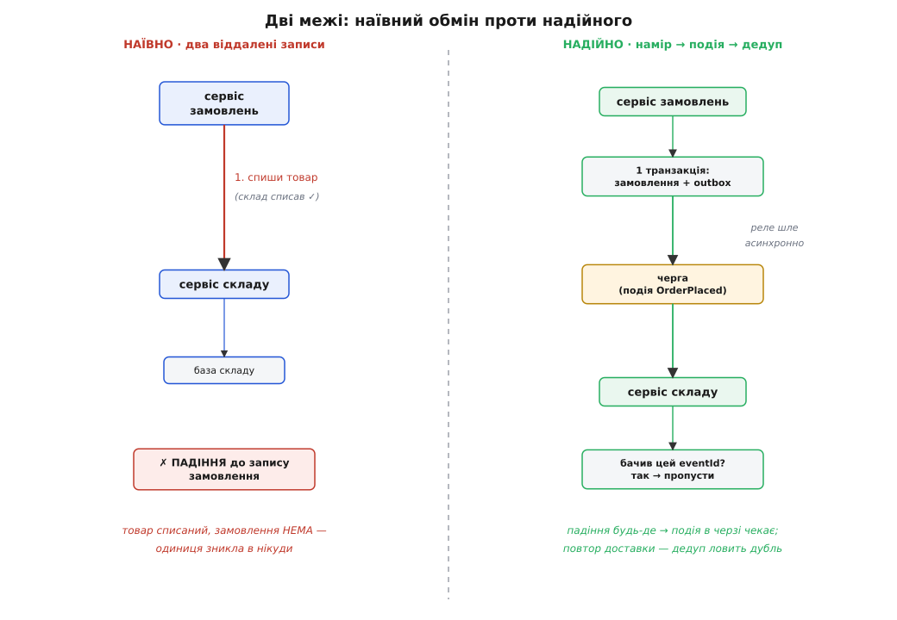

# ⚙️ Оформлення замовлення через межу сервісів

Ось задача, у якій ціна розрізу на сервіси перестає бути абстракцією й перетворюється на зниклий зі складу товар. Візьмемо найпростішу операцію крамниці — оформити замовлення. У ній рівно дві дії: **записати замовлення** й **списати куплений товар зі складу**. Поки все це живе в одному застосунку з однією базою, обидві дії лягають в одну транзакцію, і база дає безкоштовну гарантію «все або нічого»: або записалося замовлення й списався товар разом, або не сталося нічого. Напівстану не буває.

А тепер уявімо, що система виросла, і ми розрізали її на **сервіс замовлень** і **сервіс складу**, кожен зі своєю приватною базою. Тепер ці дві дії — у різних базах, у різних процесах, за мережею одна від одної. Спільної транзакції більше немає: одна транзакція не охоплює дві бази. І питання, яке в моноліті навіть не поставало, стає центральним: **як зробити так, щоб товар не зник, коли один із сервісів упаде посередині операції?**

Це не надумана рідкість. Процеси падають щодня — вичерпалась пам'ять, перезапустив контейнер, обірвалась мережа рівно між двома викликами. У моноліті таке падіння нешкідливе: незавершена транзакція просто відкотиться. У розподіленій системі те саме падіння лишає слід — і завдання інженера в тому, щоб цей слід не був брехнею.

> 🔧 **Навіщо це.** Уся ця вставка — про одну-єдину річ: як повернути гарантію «все або нічого», коли база більше не дає її задарма. У моноліті цілісність тримала транзакція. Тепер її доведеться зібрати руками з трьох деталей — надійного запису наміру, надійної доставки події й надійної (ідемпотентної) обробки. Кожна деталь латає одну конкретну діру, крізь яку витікає товар.

## Наївний варіант, який справді втрачає товар

Почнімо з коду, що напрошується сам собою. Оформлення замовлення робить сервіс замовлень. Він приймає запит, а далі — очевидна послідовність: спочатку сходити в сервіс складу й попросити списати товар, тоді записати замовлення в себе. Начебто нічого підозрілого.

:::tabs
```ts
// НАЇВНО — не робіть так. Два віддалені записи без спільної транзакції.
class OrderService {
  constructor(
    private orders: OrderRepository,   // приватна база замовлень
    private stock: StockClient,        // HTTP-клієнт до сервісу складу
  ) {}

  async placeOrder(cmd: PlaceOrder): Promise<string> {
    const order = Order.create(cmd.customerId, cmd.items);

    // КРОК 1: віддалений виклик — склад списує товар у СВОЇЙ базі
    await this.stock.reserve(order.items);   // склад списав ✓

    // ── ⟵ якщо процес упаде рівно ТУТ, товар уже списаний, а рядок нижче не виконається ──

    // КРОК 2: записуємо замовлення у ВЛАСНУ базу
    await this.orders.save(order);           // а сюди вже не дійшли ✗

    return order.id;
  }
}
```
```python
# НАЇВНО — не робіть так. Два віддалені записи без спільної транзакції.
class OrderService:
    def __init__(self, orders: OrderRepository, stock: StockClient) -> None:
        self._orders = orders   # приватна база замовлень
        self._stock = stock     # HTTP-клієнт до сервісу складу

    async def place_order(self, cmd: PlaceOrder) -> str:
        order = Order.create(cmd.customer_id, cmd.items)

        # КРОК 1: віддалений виклик — склад списує товар у СВОЇЙ базі
        await self._stock.reserve(order.items)   # склад списав ✓

        # ── ⟵ якщо процес упаде рівно ТУТ, товар списаний, а рядок нижче не виконається ──

        # КРОК 2: записуємо замовлення у ВЛАСНУ базу
        await self._orders.save(order)           # а сюди вже не дійшли ✗

        return order.id
```
:::

Прочитаймо, що станеться, коли процес сервісу замовлень помре в позначеній точці — між рядком «склад списав» і рядком «записуємо замовлення». Склад свою роботу вже зробив і **зафіксував** її у своїй базі: товару стало на одиницю менше. Сервіс замовлень до свого запису **не дійшов**: замовлення в його базі немає. Система лишилась у стані, якого не мало б бути: товар з обліку зник, а замовлення, яке б це пояснило, ніде не існує. Клієнт бачить помилку й повторює — і за другим разом усе спрацьовує, тільки товару вже списано **двічі**.

Спокуса — переставити кроки місцями: спершу записати замовлення, потім списати товар. Не рятує, лише пересуває діру. Тепер, якщо процес упаде після запису замовлення, але до виклику складу, буде замовлення **без** списаного товару — ми пообіцяли покупцеві річ, якої на складі вже може не бути. Хоч так, хоч сяк — між двома віддаленими записами зяє щілина, і рано чи пізно якесь падіння в неї провалиться.

Корінь лиха варто назвати прямо, бо він має ім'я й давню історію. Це **проблема подвійного запису** (dual-write problem): операція мусить надійно змінити **два** незалежні місця — свою базу й чужий сервіс (чи чергу) — а атомарного способу зробити обидва записи як один немає. Будь-яка спроба «просто зробити один виклик, потім другий» лишає вікно, у якому перший уже стався, а другий ще ні. З цього вікна й витікає товар.



*Ліва колонка — наївний обмін: між «склад списав» і «замовлення записане» зяє щілина, і падіння в ній лишає списаний товар без замовлення. Права — надійний потік: сервіс замовлень пише і замовлення, і намір (рядок outbox) в одній локальній транзакції, реле асинхронно шле подію в чергу, а склад споживає її ідемпотентно, впізнаючи дублі за eventId.*

## Ідея правильного розв'язку: намір, подія, дедупляція

Розв'язок збирається з трьох деталей, і кожна закриває свою діру наївного варіанта.

**Перша деталь — записати намір у власну транзакцію.** Сервіс замовлень не має права звертатися до складу прямо в ході оформлення, бо цей виклик — саме той другий запис, який може не статися. Натомість він робить дещо, що йому цілком підвладне: у **своїй** базі, у **тій самій** локальній транзакції, що зберігає замовлення, він додає ще один рядок — запис про намір «треба сповістити склад, що оформлено ось таке замовлення». Цей рядок кладеться в окрему таблицю, яку заведено називати **outbox** (англ. «скринька вихідних»). Ключове тут — обидва записи, і замовлення, і рядок outbox, тепер в **одній локальній транзакції однієї бази**. Тобто атомарні: або лягли обидва, або жоден. Проблема подвійного запису розчинилась — ми звели два записи в різні місця до одного запису в одне місце.

**Друга деталь — асинхронно доставити подію.** Рядок outbox — це ще не сповіщення складу, це лише надійно збережений намір його сповістити. Окремий тихий механізм — його називають **реле** (message relay) — раз у раз зазирає в таблицю outbox, бере нові рядки й перетворює кожен на **подію** в черзі повідомлень: `OrderPlaced` з переліком товарів. Відправив у чергу — позначив рядок як надісланий. Тепер подія живе в надійній черзі, а черга — це вже не наш процес: вона переживе падіння сервісу замовлень і терпляче триматиме подію, доки склад її не забере. Сам стиль спілкування через факти-події в черзі, а не прямі виклики між сервісами, — окрема велика тема: [подієва архітектура між сервісами](topic:sf-apps/event-driven-architecture-distributed) розбирає, як розв'язати долі сервісів через шину подій, чому «оголоси факт» міцніше за «накажи зробити» й де межі цього підходу.

**Третя деталь — споживати подію ідемпотентно.** Сервіс складу підписаний на `OrderPlaced`. Отримав подію — списав товар. Але тут чигає нова халепа, і вона неминуча: черги майже ніколи не гарантують доставку **рівно один раз**. Реальна гарантія майже завжди — **щонайменше один раз** (at-least-once): подія точно дійде, але може дійти й двічі, і тричі. Чому — розберемо нижче; поки що приймімо як факт. А коли «списати товар» може прийти двічі, наївний споживач спише товар двічі — і ми знову втратили одиницю, тепер уже з іншого боку. Тому склад мусить бути **ідемпотентним**: скільки б разів не прийшла та сама подія, ефект має бути такий, ніби вона прийшла раз. Досягається це найпростішим у світі способом — склад запам'ятовує **ідентифікатори** вже оброблених подій (`eventId`) у своїй таблиці й, побачивши знайомий, мовчки його пропускає.

> 🔧 **Навіщо це.** Три деталі — три різні гарантії, і плутати їх не можна. Outbox дає **атомарність наміру**: намір сповістити не загубиться, бо збережений разом із замовленням. Черга дає **надійну доставку**: подія не зникне, поки її не забрали. Ідемпотентність дає **безпеку повтору**: навіть подвійна доставка не подвоїть ефект. Прибери будь-яку — і повертається діра. Без outbox губиться намір; без черги губиться подія; без ідемпотентності подвоюється дія.

Цей триб — «зроби своє в локальній транзакції, а решту світу сповісти надійно доставленою подією, яку споживач обробляє ідемпотентно» — і є основою надійного обміну між сервісами. Зв'язку «запис у власну базу + рядок наміру в тій самій транзакції» описав і вніс до каталогу мікросервісних патернів Кріс Річардсон під назвою **transactional outbox**; вона й лікує проблему подвійного запису. А ширший малюнок «довга дія тягнеться через кілька сервісів кроками, і кожен крок має свій відкат» відомий як **сага** — і корінням сягає глибше за мікросервіси: поняття ввели Гектор Гарсія-Моліна й Кеннет Салем у праці «Sagas» (ACM SIGMOD, 1987) для довгих транзакцій усередині **однієї** бази, а світ мікросервісів позичив ідею через двадцять з гаком років. *(Обидва факти — усталені: outbox фігурує в каталозі microservices.io; стаття «Sagas» 1987 року — першоджерело терміна.)*

## Робочий код: outbox у сервісі замовлень

Тепер зберемо це в коді. Мова тут — загальний бекенд, тож дамо дві ідіоматичні реалізації поряд: TypeScript і Python. Регістрів і заліза нема, є звичайна серверна логіка, і обидва стеки лягають на неї природно.

Почнемо з сервісу замовлень. Уся суть — в одному: **замовлення й рядок outbox пишуться в одній транзакції**. Ніяких викликів складу тут немає й бути не може.

:::tabs
```ts
type PlaceOrder = { customerId: string; items: LineItem[] };

class OrderService {
  constructor(private db: Db) {}   // приватна база сервісу замовлень

  async placeOrder(cmd: PlaceOrder): Promise<string> {
    const order = Order.create(cmd.customerId, cmd.items);

    // ── ОДНА локальна транзакція: замовлення + намір сповістити склад ──
    await this.db.transaction(async (tx) => {
      await tx.insert("orders", {
        id: order.id,
        customer_id: order.customerId,
        status: "placed",
        total: order.total,
      });

      // рядок OUTBOX — намір, що поїде в чергу окремим реле.
      // eventId генеруємо ТУТ і кладемо в тіло — саме за ним споживач
      // упізнаватиме дублі. topic каже реле, у яку чергу це слати.
      await tx.insert("outbox", {
        event_id: crypto.randomUUID(),
        topic: "OrderPlaced",
        payload: JSON.stringify({ orderId: order.id, items: order.items }),
        sent: false,
        created_at: new Date(),
      });
    }); // ← коміт: або лягли ОБИДВА рядки, або жоден. Подвійного запису немає.

    return order.id;
  }
}
```
```python
from dataclasses import dataclass
import json, uuid
from datetime import datetime, timezone

@dataclass
class PlaceOrder:
    customer_id: str
    items: list[LineItem]

class OrderService:
    def __init__(self, db: Db) -> None:
        self._db = db   # приватна база сервісу замовлень

    async def place_order(self, cmd: PlaceOrder) -> str:
        order = Order.create(cmd.customer_id, cmd.items)

        # ── ОДНА локальна транзакція: замовлення + намір сповістити склад ──
        async with self._db.transaction() as tx:
            await tx.insert("orders", {
                "id": order.id,
                "customer_id": order.customer_id,
                "status": "placed",
                "total": order.total,
            })

            # рядок OUTBOX — намір, що поїде в чергу окремим реле.
            # event_id генеруємо ТУТ і кладемо в тіло — саме за ним споживач
            # упізнаватиме дублі. topic каже реле, у яку чергу це слати.
            await tx.insert("outbox", {
                "event_id": str(uuid.uuid4()),
                "topic": "OrderPlaced",
                "payload": json.dumps({"order_id": order.id, "items": order.items}),
                "sent": False,
                "created_at": datetime.now(timezone.utc),
            })
        # ← коміт: або лягли ОБИДВА рядки, або жоден. Подвійного запису немає.

        return order.id
```
:::

Зверніть увагу на дрібницю з великими наслідками: `eventId` народжується **тут**, у момент запису наміру, і їде в тілі події. Не в реле, не в момент відправки — саме тут. Завдяки цьому один намір має один сталий ідентифікатор на весь свій шлях, скільки б разів реле його потім не переслало. Це той якір, за який споживач ловитиме дублі.

Тепер реле. Це окрема тиха петля (у продакшні — власний фоновий процес або читання журналу змін бази; тут покажемо просту й чесну версію опитуванням таблиці). Вона бере ненадіслані рядки, шле кожен у чергу й позначає надісланим.

:::tabs
```ts
class OutboxRelay {
  constructor(private db: Db, private queue: Queue) {}

  // Викликається за розкладом (напр. кожні 200 мс) або петлею.
  async flush(): Promise<void> {
    const rows = await this.db.query(
      "SELECT * FROM outbox WHERE sent = false ORDER BY created_at LIMIT 100",
    );

    for (const row of rows) {
      // Публікуємо ПЕРЕД тим, як позначити sent. Якщо впадемо між
      // publish і update — рядок лишиться sent=false, і наступний
      // прохід надішле його ЩЕ раз. Дубль на боці споживача безпечний
      // (він ідемпотентний), а от ВТРАТА події — ні. Тому саме такий порядок.
      await this.queue.publish(row.topic, {
        eventId: row.event_id,      // той самий ключ дедуплікації
        payload: JSON.parse(row.payload),
      });
      await this.db.execute(
        "UPDATE outbox SET sent = true WHERE event_id = ?", [row.event_id],
      );
    }
  }
}
```
```python
class OutboxRelay:
    def __init__(self, db: Db, queue: Queue) -> None:
        self._db = db
        self._queue = queue

    # Викликається за розкладом (напр. кожні 200 мс) або петлею.
    async def flush(self) -> None:
        rows = await self._db.query(
            "SELECT * FROM outbox WHERE sent = false ORDER BY created_at LIMIT 100",
        )

        for row in rows:
            # Публікуємо ПЕРЕД тим, як позначити sent. Якщо впадемо між
            # publish і update — рядок лишиться sent=false, і наступний
            # прохід надішле його ЩЕ раз. Дубль на боці споживача безпечний
            # (він ідемпотентний), а от ВТРАТА події — ні. Тому саме такий порядок.
            await self._queue.publish(row["topic"], {
                "event_id": row["event_id"],   # той самий ключ дедуплікації
                "payload": json.loads(row["payload"]),
            })
            await self._db.execute(
                "UPDATE outbox SET sent = true WHERE event_id = ?", [row["event_id"]],
            )
```
:::

Тут захований тонкий, але принциповий вибір порядку. Ми **спершу публікуємо** подію, а **потім** позначаємо рядок надісланим. Якщо процес реле помре між цими двома діями, рядок лишиться `sent = false` — і наступний прохід реле надішле ту саму подію **ще раз**. Тобто ми свідомо обираємо ризик **дубля** замість ризику **втрати**. І це правильний вибір саме тому, що споживач у нас ідемпотентний: зайвий дубль він відкине без шкоди, а от загублену назавжди подію не відновить ніхто. Загальне правило доставки звучить так: **краще двічі, ніж жодного разу** — бо «двічі» лікується дедуплікацією, а «жодного разу» не лікується нічим.

## Робочий код: ідемпотентний споживач у сервісі складу

Друга половина — сервіс складу. Він слухає чергу, і на кожну подію `OrderPlaced` списує товар. Уся хитрість — зробити цю обробку такою, щоб повторна доставка тієї самої події нічого не зіпсувала.

Ключова ідея: **дедуплікацію й саму дію треба виконати в одній локальній транзакції складу**. Тоді «запам'ятати, що подію оброблено» і «списати товар» стають нероздільні — знову той самий фокус атомарності в межах однієї бази, тільки тепер у сервісі складу.

:::tabs
```ts
class StockConsumer {
  constructor(private db: Db) {}   // приватна база сервісу складу

  // Викликається чергою на кожну доставлену подію OrderPlaced.
  async onOrderPlaced(evt: { eventId: string; payload: OrderPlacedBody }): Promise<void> {
    await this.db.transaction(async (tx) => {
      // 1) ДЕДУП: пробуємо застовпити eventId. Первинний ключ на
      //    processed_events робить повторну вставку неможливою — другий
      //    прохід тієї самої події тут спіткнеться, і ми просто вийдемо.
      const fresh = await tx.tryInsert("processed_events", {
        event_id: evt.eventId,
        handled_at: new Date(),
      });
      if (!fresh) return;   // вже бачили цей eventId — дубль, тихо виходимо

      // 2) ДІЯ: списуємо товар. У ТІЙ САМІЙ транзакції, що й відмітка дедупу,
      //    тож «оброблено» і «списано» або сталися разом, або не сталися.
      for (const item of evt.payload.items) {
        await tx.execute(
          "UPDATE stock SET qty = qty - ? WHERE sku = ? AND qty >= ?",
          [item.qty, item.sku, item.qty],
        );
      }
    }); // ← коміт: дедуп і списання нероздільні
  }
}
```
```python
class StockConsumer:
    def __init__(self, db: Db) -> None:
        self._db = db   # приватна база сервісу складу

    # Викликається чергою на кожну доставлену подію OrderPlaced.
    async def on_order_placed(self, evt: OrderPlacedEvent) -> None:
        async with self._db.transaction() as tx:
            # 1) ДЕДУП: пробуємо застовпити event_id. Первинний ключ на
            #    processed_events робить повторну вставку неможливою — другий
            #    прохід тієї самої події тут спіткнеться, і ми просто вийдемо.
            fresh = await tx.try_insert("processed_events", {
                "event_id": evt.event_id,
                "handled_at": datetime.now(timezone.utc),
            })
            if not fresh:
                return   # вже бачили цей event_id — дубль, тихо виходимо

            # 2) ДІЯ: списуємо товар. У ТІЙ САМІЙ транзакції, що й відмітка
            #    дедупу, тож «оброблено» і «списано» або разом, або ніяк.
            for item in evt.payload.items:
                await tx.execute(
                    "UPDATE stock SET qty = qty - :q WHERE sku = :s AND qty >= :q",
                    {"q": item.qty, "s": item.sku},
                )
        # ← коміт: дедуп і списання нероздільні
```
:::

Чому дедуп і дію не можна рознести на дві транзакції? Уяви, що ми спершу окремо списали товар, а потім окремо записали `eventId` у таблицю оброблених — і між цими двома комітами впали. Товар списаний, а відмітки «оброблено» немає. Черга, не діставши підтвердження, доставляє подію знову; ми не бачимо `eventId` серед оброблених, вважаємо подію новою — і списуємо товар **вдруге**. Рознесені на дві транзакції, дедуп і дія відтворюють рівно ту саму щілину подвійного запису, з якою ми боролися. Зведені в одну — щілина зникає: відмітка й списання фіксуються одним комітом, тож не буває стану «списано, але не відмічено».

Приглянься ще до самого `UPDATE`: `qty = qty - ? WHERE ... AND qty >= ?`. Умова `qty >= ?` — це захист від списання в мінус, коли товару вже забракло. Якщо на складі менше, ніж просять, рядок не зміниться, і на це доведеться зреагувати окремо (наприклад, оголосити подію `StockInsufficient`, на яку сервіс замовлень скасує замовлення). Так у саги з'являється **гілка невдачі** — і природно підводить нас до компенсації.

## Компенсація: як повернути товар, коли крок відкотився

Досі ми лагодили технічні збої — падіння процесів, дублі доставки. Але є й інший клас невдач: **бізнесова** відмова кроку. Товару забракло. Оплата не пройшла. Покупець скасував замовлення за мить до відвантаження. Спільної транзакції немає, отже й звичного `ROLLBACK`, який відкотив би вже зроблене, теж немає: склад свій товар списав і зафіксував, база складу про жоден інший сервіс не знає й нічого відкочувати не буде.

Раз системного відкату нема, його доводиться зробити **бізнесово** — окремою дією, що логічно **скасовує** попередню. Списав товар — компенсація дописує його назад. Провів оплату — компенсація повертає кошти. Це і є **компенсаційна транзакція** саги: не машинний відкат стану, а нова свідома дія, що приводить систему до наслідку «ніби нічого й не було». Прикметно, що це рідко точна дзеркальна протилежність: повернення коштів лишає слід в історії операцій, скасоване бронювання може залишити позначку «було й знято» — компенсація вирівнює **наслідок**, а не стирає **історію**.

Покажемо компенсацію для нашого випадку. Сервіс замовлень отримав `StockInsufficient` (склад не зміг списати) і має скасувати замовлення. А сам склад, коли скасовується вже оплачене раніше замовлення, має **повернути** товар — і, звісно, теж ідемпотентно, бо подія скасування так само може прийти двічі.

:::tabs
```ts
// Компенсація на боці СКЛАДУ: повертаємо раніше списаний товар.
class StockConsumer {
  // ... onOrderPlaced як вище ...

  async onOrderCancelled(evt: { eventId: string; payload: OrderCancelledBody }): Promise<void> {
    await this.db.transaction(async (tx) => {
      // та сама дедуплікація — компенсація теж має бути безпечною до повтору
      const fresh = await tx.tryInsert("processed_events", {
        event_id: evt.eventId, handled_at: new Date(),
      });
      if (!fresh) return;

      // КОМПЕНСАЦІЯ: дописуємо товар назад — логічний антипод списання
      for (const item of evt.payload.items) {
        await tx.execute(
          "UPDATE stock SET qty = qty + ? WHERE sku = ?", [item.qty, item.sku],
        );
      }
    });
  }
}
```
```python
# Компенсація на боці СКЛАДУ: повертаємо раніше списаний товар.
class StockConsumer:
    # ... on_order_placed як вище ...

    async def on_order_cancelled(self, evt: OrderCancelledEvent) -> None:
        async with self._db.transaction() as tx:
            # та сама дедуплікація — компенсація теж має бути безпечною до повтору
            fresh = await tx.try_insert("processed_events", {
                "event_id": evt.event_id, "handled_at": datetime.now(timezone.utc),
            })
            if not fresh:
                return

            # КОМПЕНСАЦІЯ: дописуємо товар назад — логічний антипод списання
            for item in evt.payload.items:
                await tx.execute(
                    "UPDATE stock SET qty = qty + :q WHERE sku = :s",
                    {"q": item.qty, "s": item.sku},
                )
```
:::

Зверни увагу: компенсація — це такий самий ідемпотентний споживач, як і пряма дія. Ті самі три деталі повторюються й тут: подія `OrderCancelled` народжується через outbox сервісу замовлень (щоб намір скасувати не загубився), надійно доставляється чергою, ідемпотентно споживається складом (щоб не повернути товар двічі). Уся сага — це ланцюжок таких кроків, кожен зі своїм відкотом-компенсацією; коли якийсь крок остаточно провалюється, координатор запускає компенсації вже виконаних кроків у зворотному порядку, розмотуючи операцію назад до чистого стану.

## Складімо все докупи: покроковий розбір щасливого й нещасливого шляхів

Пройдімо цілий життєвий цикл повільно, крок за кроком, щоб побачити, як три деталі працюють разом.

**Щасливий шлях.**

```
1. Клієнт → сервіс замовлень: «оформити замовлення на 2×SKU-42».
2. Сервіс замовлень, ОДНА транзакція:
      insert orders  (замовлення, статус=placed)
      insert outbox  (eventId=E1, topic=OrderPlaced, items=[2×SKU-42])
   коміт ✓  → клієнту одразу відповідь «прийнято».
3. Реле бачить рядок E1 → publish OrderPlaced у чергу → outbox.sent=true.
4. Черга доставляє E1 сервісу складу.
5. Склад, ОДНА транзакція:
      insert processed_events (E1)       ← дедуп-відмітка
      update stock qty = qty - 2         ← списання
   коміт ✓
6. Товар списаний рівно раз, замовлення записане. Система узгоджена.
```

Головне спостереження про крок 2: клієнт дістає відповідь «прийнято» **до того**, як склад щось списав. У цю мить замовлення вже є, а товар ще на місці — система тимчасово **не збігається сама з собою**. За частку секунди реле й склад дожену́ть, і все зійдеться. Це і є **зрештою узгоджений** стан: не миттєва цілісність, як у моноліті, а цілісність, що настає **згодом**. Проміжок між кроком 2 і кроком 5 — те саме **вікно неузгодженості**, і жити з ним доводиться свідомо.

**Нещасливий шлях — падіння реле.**

```
2. ... коміт замовлення + outbox(E1) ✓
3. Реле впало ДО того, як надіслало E1. Рядок лишився sent=false.
   ── товар ще не списаний, але намір E1 НАДІЙНО лежить у базі ──
3'. Реле піднялося, побачило sent=false → publish E1 → sent=true.
   Далі як у щасливому шляху. Нічого не втрачено, лише затримка.
```

Ось де окупляється outbox: падіння реле не втрачає нічого, бо намір збережений разом із замовленням і терпляче чекає перезапуску. У наївному варіанті на цьому місці товар би вже зник.

**Нещасливий шлях — подвійна доставка.**

```
5.  Склад обробив E1: processed_events(E1) + qty-2, коміт ✓,
    але підтвердження чи́тання до черги не дійшло (мережа кліпнула).
5'. Черга вважає E1 недоставленим і шле E1 ЗНОВУ.
5''. Склад, транзакція: tryInsert processed_events(E1) → КОНФЛІКТ
     (E1 уже там) → return. Товар НЕ списується вдруге.
```

А ось де окупляється ідемпотентність: повторна доставка — не аварія, а очікуваний, штатний випадок, і дедуп-таблиця гасить його беззвучно.

## Складність і пастки

Патерн потужний, але не безкоштовний, і кілька його гострих кутів варто тримати перед очима.

**Пастка перша — подвійна обробка через рознесені транзакції.** Найпідступніша помилка — виконати дедуп-відмітку й саму дію в **двох** транзакціях замість однієї. Тоді між ними з'являється щілина, і падіння в ній лишає «дію зроблено, відмітку ні», після чого повтор доставки чесно зробить дію вдруге. Правило залізне: **відмітка про обробку й ефект події — в одному коміті**. Якщо база фізично не дозволяє покласти їх разом (наприклад, ефект іде в зовнішню систему, а не в ту саму базу) — це знак, що дедуп-таблицю треба тримати саме там, де живе ефект, або будувати ідемпотентність інакше (наприклад, робити саму зовнішню дію ідемпотентною за ключем).

**Пастка друга — повтор доставки як норма, а не виняток.** Інженер, що подумки розраховує на «рівно один раз», рано чи пізно обпечеться, бо черги дають **щонайменше один раз**. Дублі трапляються не через рідкісний баг, а через звичайний плин роботи: споживач обробив подію, але не встиг підтвердити читання — впав, мережа кліпнула, тайм-аут спрацював — і черга сумлінно шле подію знову. Тому кожен споживач, що має **побічний ефект** (списати товар, стягнути гроші, надіслати лист), мусить бути ідемпотентним **за замовчуванням**. Чисте читання ідемпотентне саме собою; усе, що щось **змінює** чи діє назовні, — ні, і його треба захищати дедупом.

**Пастка третя — вікно неузгодженості.** Проміжок «замовлення вже є, товар ще не списаний» — не помилка, а вбудована властивість асинхронного обміну. Небезпека не в самому вікні, а в тому, щоб **забути** про нього в місцях, де воно видиме. Показуєш покупцеві залишок товару? Він може на мить відставати від правди. Будуєш звіт? Він може зловити систему в напівстані між кроками. З цим працюють свідомо: або приховують вікно від ока (не показують ще не підтверджене), або проєктують екран так, щоб коротка розбіжність не бентежила. Головне — **знати**, де вікно відкрите, і не давати йому обманути користувача.

**Пастка четверта — таблиці, що ростуть без міри.** І outbox, і `processed_events` набивають рядки безупинно. Надіслані рядки outbox і давні дедуп-відмітки треба періодично прибирати — інакше вони роздують базу й сповільнять самі себе. Прибирати обережно: дедуп-відмітку можна видаляти лише тоді, коли черга гарантовано вже не доставить ту саму подію (за межами її вікна повтору), інакше видалена відмітка відкриє двері повторному списанню.

**Пастка п'ята — порядок подій.** Черга не завжди зберігає порядок: `OrderCancelled` може випередити `OrderPlaced`, якщо їх доставляли різними шляхами. Проєктуй споживачів так, щоб вони терпіли **позачерговість**, — або тримай події одного замовлення в одному розділі черги (за ключем `orderId`), де порядок збережено. Інакше компенсація прилетить раніше за дію, яку вона мала б скасувати, і залишить систему в чудернацькому стані.

Підсумок простий і трохи протверезний. Одну атомарну операцію моноліту ми відновили, але не задарма: замість одного `COMMIT` тепер outbox-таблиця, реле, черга, дедуп-таблиця, компенсаційні події й ціле вікно неузгодженості, у яке треба весь час зазирати. Це рівно та **ручна робота**, якою мережа повертає відібрану нею безкоштовну транзакцію. Тому найдешевша перемога — та, якої вдалося не грати: якщо дві дії конче потрібні атомарно, найкраще **не різати** межу між ними, а лишити їх в одному сервісі. Розрізати «оформлення замовлення» варто лише тоді, коли зиск від незалежних сервісів переважає всю цю машинерію — а вона, як бачиш, чимала.
