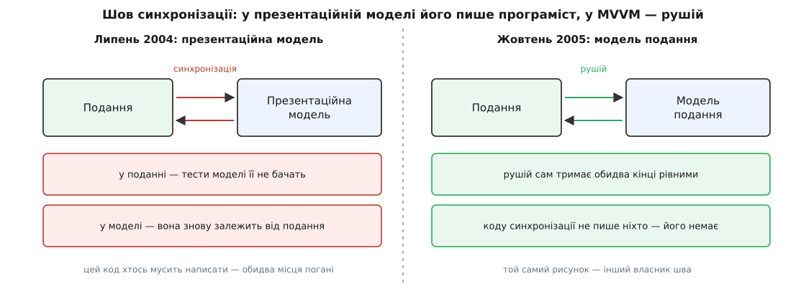

# 📜 Як MVVM дістав ім'я: допис у блозі 2005 року, редактор Sparkle і збуте бажання Фаулера

У назви MVVM є точна дата народження — **8 жовтня 2005 року**, коли архітектор Microsoft **Джон Ґоссман (John Gossman)** виклав у своєму блозі «Tales from the Smart Client» допис «Introduction to Model/View/ViewModel pattern for building WPF apps». *(Усталений факт: первинне джерело, дата в архіві Microsoft.)* Але сама ідея — дати екранові власний об'єкт зі станом — була на той час старша за це ім'я років на п'ятнадцять. Тож цікаве питання не «хто придумав», а що саме змінилося тієї осені. Змінилася одна річ, і вона того варта: **хто пише код, що тримає екран і дані рівними**.

## Подання перестало бути кодом

Щоб зрозуміти, що муляло восени 2005-го, треба глянути, ким тоді ставало подання. Ґоссман починає допис не з архітектури, а з дуже приземленого спостереження: інтерфейс тепер робить **дизайнер**, а не програміст. Він працює у WYSIWYG-редакторі, а на виході має декларативний опис — HTML або XAML. Це вже не код, який можна дописати: це файл розмітки, який людина без програмістських звичок перемальовує щодня.

З цього одного факту випливає все інше. Раніше логіку екрана клали в code-behind — кодовий файл-близнюк, пришитий до форми. Тепер такий файл став чужим: він належить не тому, хто малює вікно. А логіка нікуди не поділася — і мусила знайти собі нове місце.

Ґоссман називає в дописі два конкретні місця, де це припекло, і обидва варті уваги, бо вони не теоретичні.

Перше — **стан, якого розмітка не вміє виразити**. Екран має режими: «перегляд» і «редагування», у яких ті самі віджети поводяться по-різному. Він має виділення — і часто на одне виділення мусять узгоджено відгукнутися кілька віджетів одразу. Тримати таке в самій розмітці незручно, а часом і ніяк.

Друге — **моделі, які тобі не належать**. Панелі редактора, який будувала команда Ґоссмана, показували не власні класи застосунку, а сторонні: список збірок `System.Reflection.Assembly`, проєкт MSBuild. Такі об'єкти писали без жодної думки про екран, у них немає ні типів, зручних віджетам, ні дій, які потрібні кнопкам. Прив'язати до них поле вводу напряму просто не виходить.

Отже, між моделлю й розміткою потрібне було місце, куди складають і те, чого модель не має, і те, чого розмітка не вміє. Ґоссман дав цьому місцю назву й одразу її розшифрував: термін означає «Model of a View» — модель для подання. *(Первинне джерело, допис 8.10.2005.)*

І ще одну умову він виставив прямо в тексті, без якої вся конструкція не працює: патерн спирається на **загальний механізм [зв'язування даних](topic:sf-apps/data-binding)** — на рушій, що вміє за одним оголошенням «оце поле показує оцю властивість» сам переносити значення в обидва боки. Немає такого рушія — немає й патерна.

Заразом у тому ж дописі зникає літера, яку всі шукають. На питання, що сталося з контролером із [MVC](topic:sf-apps/mvc), Ґоссман відповідає майже недбало: той розчинився у тлі, віджети самі впоралися з мишею й клавішами, і думати про нього стільки, скільки думали 1979 року, більше не треба. Рік він назвав не випадково — саме тоді трійця й [дістала свої імена в Xerox PARC](topic:sf-apps/mvc/hist-mvc-birth.md), а слово «контролер» від початку означало координатора екрана, а не тонкий тлумач вводу. Саме ця недбала фраза й збурила найгарячішу суперечку під дописом.

## Sparkle: патерн, витягнутий із будови, а не з дошки

Найцікавіше в першому дописі — не означення, а приклади. Усі три взяті з одного живого продукту: панель бібліотеки, панель зовнішнього вигляду й панель проєкту в редакторі на ім'я **Sparkle**. Ґоссман пише, що весь інтерфейс Sparkle побудовано за цим патерном.

Sparkle — це кодова назва інструмента, який Microsoft показала на конференції PDC 14 вересня 2005 року як Expression Interactive Designer, у грудні 2006-го перейменувала на Expression Blend, а до продажу випустила аж 30 квітня 2007-го. *(Усталений факт: пресреліз Microsoft 14.09.2005; дати перейменування й випуску.)* Тобто на момент допису це був незавершений редактор.

І платформа під ним була незавершена так само. WPF (тоді ще під кодовою назвою Avalon) вийшла лише **21 листопада 2006 року** у складі .NET Framework 3.0 разом із Windows Vista. *(Усталений факт.)* Виходить проста, але важлива річ: **патерн описали за рік із гаком до того, як платформа, заради якої його описали, стала доступною**. Microsoft будувала свій дизайнерський інструмент на власному недобудованому рушії — і MVVM був не теорією з дошки, а звітом із того будівництва. **Джош Сміт (Josh Smith)**, який 2009 року напише про цей патерн найвпливовішу статтю, згадає це прямо: MVVM усередині компанії вживали, коли будували Expression Blend, а сама WPF ще була в роботі.

Звідси й особливий присмак патерна. Його форму задав дуже конкретний різновид застосунку: редактор, чиї панелі показують чужі об'єктні моделі, де половина стану — це виділення й режими. Саме тому в моделі подання так наголошено на виділенні, командах і перетворювачах типів — це не абстрактна краса, а те, чого щодня бракувало трьом панелям Sparkle.

## Бажання Фаулера, яке збулося за рік

Тепер про те, чого Ґоссман не винаходив. За рік і три місяці до нього, **19 липня 2004 року**, **Мартін Фаулер (Martin Fowler)** опублікував патерн **«презентаційна модель» (Presentation Model)** — витягнути стан і поведінку екрана в окремий клас, а подання лишити простим відображенням цього класу. *(Усталений факт: дата публікації на martinfowler.com.)*

Фаулер, до речі, і сам не оголошував себе автором ідеї: у тому ж тексті він каже, що користувачі VisualWorks Smalltalk звуть цю річ **ApplicationModel** — «модель застосунку». Це лінія, що тягнеться від Smalltalk-80 через компанію ParcPlace, яка наприкінці 1980-х відкрутилася від Xerox і випускала комерційний Smalltalk — спершу ObjectWorks, потім VisualWorks. *(Усталений факт щодо родоводу; точні роки конкретних випусків VisualWorks у джерелах різняться.)* Тож на 2004 рік ідея «дай екранові власний об'єкт» була вже старою доброю практикою зі світу Smalltalk, яку Фаулер акуратно назвав і записав для решти світу.

А от чого у Фаулера не було — так це відповіді на найпростіше питання. Модель і подання треба тримати рівними. **Хто пише цей код?** Фаулер чесно виклав обидва виходи й обидва забракував. Покласти синхронізацію в подання — і тести презентаційної моделі її не бачитимуть, бо в тестах подання немає. Покласти в презентаційну модель — і та знову залежить від подання, тобто рівно від того, від чого її щойно відв'язали. У тому ж тексті він висловив надію, що колись цю роботу візьме на себе каркас, і назвав як надію саме зв'язування даних у .NET.


*Рисунок той самий, змінився власник шва. У 2004-му код синхронізації писав програміст і не мав доброго місця, куди його покласти. У 2005-му цю роботу взяв рушій — і питання «куди класти» просто зникло разом із самим кодом.*

Через рік із чимось те, на що Фаулер сподівався, вийшло з майстерні як робочий рушій. Ось у чому річ: MVVM не додав до презентаційної моделі жодної нової коробочки на схемі. Він додав **платформу, здатну дотримати обіцянку**, — і саме тому вимагав окремого імені. Коли синхронізацію пише машина, модель подання перестає бути компромісом і стає тим, чим її малювали: звичайним об'єктом, який нічого не знає про екран.

Тут потрібне одне уточнення про докази, бо його зазвичай ковтають. У самому дописі 2005 року **Фаулера немає**: Ґоссман виводить свій патерн із MVC та його смолтоківського коріння й не посилається на презентаційну модель. Ланцюжок «презентаційна модель → MVVM» проклали пізніше інші: Джош Сміт у 2009-му назвав MVVM спеціалізацією загальнішого патерна Фаулера, а на сторінці самого Фаулера з часом з'явилася примітка, що його презентаційну модель дедалі частіше звуть MVVM. *(Статус: сам факт іменування 2005 року — усталений; «розвинув Фаулера» — правдиве про родовід ідеї й неправдиве, якщо читати це як посилання в тексті.)*

## Дві назви на одну річ під одним дахом

Ім'я перемогло не одразу — і навіть не всередині Microsoft.

Уже 2006 року **Ден Крев'є (Dan Crevier)** з команди застосунку Max веде в блозі цілу серію дописів про той самий підхід, але зве його **DataModel-View-ViewModel**, скорочено DM-V-VM: у них «модель даних» замість «моделі подання». *(Усталений факт: серія дописів у блозі MSDN, 2006.)* Дві команди однієї компанії, один патерн, дві назви.

Ще цікавіше з офіційним боком. У вересні 2008 року MSDN Magazine друкує статтю **Гленна Блока (Glenn Block)** про Prism — рекомендовану Microsoft збірку практик для складених застосунків на WPF. Слово ViewModel у ній не вживається жодного разу: абстракцію подання там звуть **презентаційною моделлю**, за Фаулером. Це прямо зафіксував Джош Сміт у лютому 2009-го, коли пояснював, чому в своїй статті все-таки вибирає «ViewModel»: бо саме це слово вживає спільнота WPF і Silverlight. *(Первинне джерело: MSDN Magazine, лютий 2009.)*

Ось так насправді перемагають терміни. Не наказом, не голосуванням і не тим, що назва точніша, — а тим, який варіант частіше вимовляє жива спільнота. Офіційні настанови користувалися однією назвою, форуми й блоги — іншою, і виграла та, яку люди казали вголос.

## «На якій ви планеті?»: суперечка просто під дописом

Найгостріше заперечення прилетіло Ґоссманові за три дні, і його досі видно в коментарях під тим самим дописом. Розробник зі світу Apple обурився саме фразою про контролер, що розчинився у тлі, і порадив авторові піти вивчити Cocoa — каркас Apple — разом із його зв'язуваннями, механізмами сповіщення й «шляхами до властивостей». Наступний коментатор миролюбно звів суперечку до непорозуміння в словах: те, що Ґоссман зве ViewModel, у Cocoa зветься view-controller — контролером подання. *(Первинне джерело: коментарі під дописом, жовтень 2005.)*

Обурення мало підстави. **Cocoa Bindings** з'явилися в Mac OS X 10.3 «Panther» ще в жовтні 2003-го — за два роки до допису. Там уже було все головне: декларативне зв'язування віджета з властивістю, родина класів-контролерів і механізм **KVO (key-value observing)**, тобто сповіщення про зміну властивості. *(Усталений факт.)* KVO — це той самий [спостерігач](topic:sf-apps/observer), піднятий із рівня «підпишись на об'єкт» до рівня «підпишись на шлях до властивості»: об'єкт повідомляє про зміну, не знаючи, хто слухає.

Тож підсумок чесний і не надто героїчний. Ані ідею окремої моделі екрана (Smalltalk), ані рушій декларативного зв'язування (Cocoa) в жовтні 2005-го не винаходили. Винайшли **назву й зручний спосіб говорити** — і додали до них платформу, де це працювало для мільйонів розробників на Windows. Так буває майже завжди: ідею придумують кілька разів у різних місцях, а мандрує світом та назва, яку підхопила велика спільнота.

## Ціна, яку назвав сам хрещений батько

За п'ять місяців після хрещення, **4 березня 2006 року**, Ґоссман друкує другий короткий допис — «Advantages and disadvantages of M-V-VM». *(Усталений факт.)* Це рідкісний випадок: людина, що дала патернові ім'я, майже одразу виписала на нього рахунок.

З плюсів він називає головним не красу поділу, а **перевірність**: модель подання, хоч і зветься по-екранному, поводиться радше як модель, тож її можна крутити тестами без марудної автоматизації інтерфейсу.

А далі — рахунок. Для простого інтерфейсу патерн надмірний. Для великого важко наперед угадати, наскільки загальною робити модель подання. Зв'язування декларативне, а тому його важче налагоджувати, ніж звичайний імперативний код, де просто ставиш точку зупину.

І окремо — плата продуктивністю, з реальними числами з їхнього проєкту. Команда тоді чіпляла зв'язування до кожного створеного об'єкта; на великому файлі таких набиралося близько п'ятдесяти тисяч, і кожне в тодішній збірці WPF важило майже два кілобайти.

**Скільки це коштувало пам'яті:**

```
прив'язок на великий файл:  50 000
на кожну прив'язку:         ≈ 2 КіБ
разом: 50 000 × 2 КіБ = 100 000 КіБ ≈ 97.7 МіБ
```

Сто мегабайтів — і це лише службова бухгалтерія рушія, не самі дані. Прив'язки виявилися важчими за об'єкти, які вони прив'язували; Ґоссман замінив їх усі одним статичним зворотним викликом і повернув ті сто мегабайтів застосунку. *(Первинне джерело: допис 4.03.2006.)*

> 🔧 **Навіщо це.** З цих двох дописів, написаних з інтервалом у п'ять місяців, випливає практичне правило вибору. MVVM — це не «поділити застосунок на три теки», а «віддати шов синхронізації рушієві». Немає рушія з коробки — і ти не отримуєш MVVM, ти отримуєш презентаційну модель Фаулера з ручним переписом і його ж дилемою, куди подіти код синхронізації. Тому перше питання при виборі патерна — не «як гарно назвати класи», а «чи вміє моя платформа тримати обидва кінці нитки сама, і чого це коштує на моїх обсягах».

## Ім'я, що пережило свою платформу

Далі назва почала мандрувати — і мандрувала далі, ніж платформа, яка її породила.

Масовою вона стала не з виходом WPF, а на зламі 2008–2009 років, коли Silverlight приніс той самий XAML і те саме зв'язування в браузер, а стаття Джоша Сміта в MSDN Magazine у лютому 2009-го дала цілому поколінню розібраний робочий приклад. Схоже, саме вона й закріпила «ViewModel» як єдине вживане слово: конкурента вже не чути. *(Оцінка за слідом у джерелах, а не задокументований факт.)*

**5 липня 2010 року** виходить **Knockout** — бібліотека **Стіва Сандерсона (Steve Sanderson)**, людини зі світу .NET, яка згодом працюватиме в команді ASP.NET. *(Усталений факт: дата першого випуску.)* Це і був канал, яким слово перебралося з Windows у браузер: Knockout прямо описував себе як реалізацію MVVM для JavaScript і в документації вчив саме поняттю «модель подання» — об'єкта, що тримає стан екрана окремо від HTML.

У лютому 2014-го з'являється **Vue** **Евана Ю (Evan You, 尤雨溪)**, тодішнього працівника Google, і перше ж його гасло — «JavaScript MVVM made simple». *(Усталений факт: анонс лютого 2014.)* У документації Vue довго стояло пояснення, що екземпляр Vue — це по суті модель подання з MVVM, тому змінну для нього традиційно звуть `vm`. Пізніші версії документації від згадок про MVVM відмовилися, а звичка називати змінну `vm` лишилася — типовий слід, який назва лишає в коді після себе.

Angular пішов третім шляхом — відмовився сперечатися. 2012 року **Ігор Мінар (Igor Minar)**, тодішній керівник AngularJS, оголосив каркас «MVW» — Model-View-Whatever, «модель-подання-будь-що», — прямо пояснивши, що краще писати добре розділені застосунки, ніж витрачати час на суперечки, яка з трьох літер тут правильна. *(Усталений факт: допис 2012 року.)*

А 2017-го слово пішло в четвертий бік. Google додає до **Android Architecture Components** клас із назвою `ViewModel` — оголошений на I/O у травні, стабільний у листопаді. *(Усталений факт.)* Тільки робота в нього інша: він тримає стан екрана живим, поки крутиться пристрій і перестворюється активність. Спільне з моделлю подання Ґоссмана — ідея «стан екрана окремим об'єктом»; несхоже — те, що жодного обов'язкового рушія зв'язування там від початку не було.


*Ідея старша за ім'я на півтора десятиліття, ім'я старше за свою платформу на рік, а розійшлося воно туди, де про WPF ніхто й не згадує. З кожним переїздом слово трохи змінювало зміст — точнісінько як колись «контролер».*

Ось чому варто знати цю історію, а не саму лише схему з трьох коробочок. Питання, на яке відповіли 8 жовтня 2005 року, звучало не «як поділити застосунок на три частини» — на нього відповіли ще 1979-го. Воно звучало так: **чи можна перестати писати код, що переписує дані на екран і назад?** До 2003–2006 років чесна відповідь була «ні, пиши руками й вибирай, де саме тобі муляє менше». Коли платформи навчилися відповідати «можна, не пиши», для цієї нової відповіді знадобилося ім'я — і його дав, між справою, чоловік, що якраз будував редактор інтерфейсів на ще недобудованому рушії.
