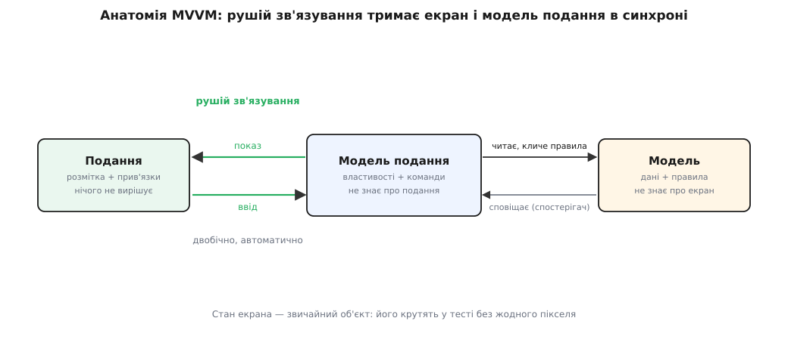
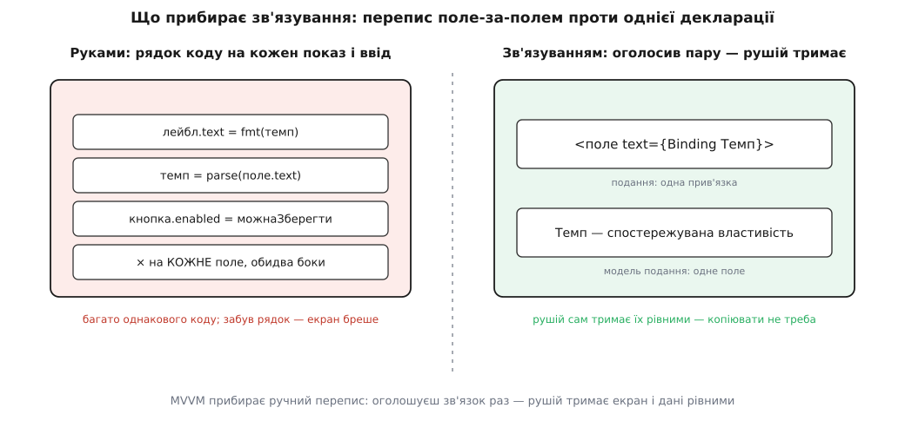

# Модель–подання–модель подання (MVVM)

<preknowlist>
- [Модель–подання–контролер (MVC)](root:sf-apps/mvc) — розділення застосунку на дані з правилами, показ і обробку вводу; MVVM — пізніший нащадок того самого роду.
- [Спостерігач](root:sf-apps/observer) — об'єкт сповіщає підписників про зміну, не знаючи, хто вони; на цьому сигналі стоїть автоматичне зв'язування.
- [Розділення відповідальностей](root:sf-apps/separation-of-concerns) — тримати нарізно те, що застосунок знає, і те, як він це показує; спільна мета всієї родини MV*.
</preknowlist>

Уяви форму, де користувач править бажану температуру термостата. На екрані поле вводу, поруч велика цифра, а кнопка «Зберегти» має світитися лише тоді, коли число в дозволених межах. Найпряміший спосіб оживити цю форму — писати перекладачів туди й назад, поле за полем. Щоб **показати** число: узяти його з даних, відформатувати, вписати в поле й у цифру. Щоб **прийняти** правку: узяти текст із поля, розібрати на число, покласти в дані, перевірити межу, засвітити чи згасити кнопку. І так на кожне поле, у кожен бік, після кожної зміни.

Цей код-перекладач нудний, його багато, і він однаковісінький від форми до форми: прочитати звідси — переписати туди. Він же й найкрихкіший: забув оновити цифру після правки поля — і екран показує одне, а дані всередині вже інші. MVVM виростає з одного зухвалого питання: а що, як цей ручний перепис доручити машині? Оголосити раз «оце поле показує оце число» — і хай хтось невидимий тримає їх рівними завжди, сам, без жодного рядка на копіювання.

## Модель подання: екран, виражений даними

Щоб машина могла це робити, дані спершу треба привести до форми, зручної екранові. Сирі дані застосунку — **модель** — живуть своїми поняттями: число «температура», правило «тримати в межах 5–30». Але екранові треба ще й те, чого в моделі немає: текст помилки, коли число вибилося за межу; ознака «чи можна зберегти», щоб знати, світити кнопку чи ні; сама дія «зберегти». Зносити це в модель не можна — вона про екран знати не повинна. Тож між моделлю й екраном ставлять проміжний об'єкт — **модель подання (viewmodel, від англ. viewmodel — модель для подання)**: форму даних, підігнану саме під цей екран. У ній властивість «температура», властивість «помилка», ознака «можна зберегти», команда «зберегти» — усе, що екран показує чи чим діє, і нічого зайвого.

Три частини стають на місця так:

- **Модель** — дані та правила предметної області; не знає, що десь є екран.
- **Модель подання** — стан екрана як звичайний об'єкт: властивості для показу й команди для дій. Читає модель, кличе її правила, готує з них те, що треба оку, — але сама не малює й, головне, **не знає, яке подання на неї дивиться**.
- **Подання** — сама розмітка: поля, цифри, кнопки. Нічого не рахує й не вирішує; воно лише **прив'язане** до властивостей моделі подання.


*Модель подання виставляє властивості й команди назовні, а рушій зв'язування сам переносить їх на екран і назад. Стрілки від моделі подання до подання немає — вона про екран не знає; тому той самий стан крутять у тесті без жодного пікселя.*

## Зв'язування: невидима нитка між полем і властивістю

Зшиває подання з моделлю подання **двобічне зв'язування** ([data binding](root:sf-apps/data-binding)). У розмітці подання пишуть один раз: «текст цього поля прив'язаний до властивості `температура`». Далі рушій зв'язування бере все на себе. Змінилася `температура` в моделі подання — поле на екрані оновилося саме собою; користувач надрукував у полі — властивість оновилася саме собою, у зворотний бік. Ніхто не пише `setText` чи `getText`: рушій тримає обидва кінці рівними, мов кінці однієї нитки.

Звідки рушій дізнається, що властивість змінилася? З того самого сигналу, що й у звичайному [спостерігачі](root:sf-apps/observer): модель подання сповіщає «моє поле `температура` стало іншим», не знаючи, хто це слухає, — а рушій, підписаний на сигнал, іде й переносить нове значення на екран. Зв'язування — це спостерігач, схований у каркас і піднятий до зручного рівня «поле ↔ властивість».

Ось як модель подання виглядає в коді — зверни увагу, що в ній немає ані слова про поля, кнопки чи піксели:

:::tabs
```csharp
// Модель подання: стан екрана звичайним класом, про подання не знає
class ThermostatVM : INotifyPropertyChanged {
    double _t = 22;
    public double Temperature {
        get => _t;
        set { _t = Math.Clamp(value, 5, 30);        // правило межі — тут
              Notify(nameof(Temperature)); Notify(nameof(CanSave)); }
    }
    public bool CanSave => _t is >= 5 and <= 30;     // ознака для кнопки
    public ICommand Save { get; }                    // дія-команда
    // Notify(...) підіймає подію PropertyChanged — сигнал спостерігача;
    // посилань на поле чи кнопку — жодного
}
```
```ts
// Модель подання: стан екрана звичайним об'єктом, про подання не знає
class ThermostatVM {
  private _t = 22;
  get temperature() { return this._t; }
  set temperature(v: number) {
    this._t = Math.min(30, Math.max(5, v));   // правило межі — тут
    this.changed();                           // сигнал рушієві зв'язування
  }
  get canSave() { return this._t >= 5 && this._t <= 30; }  // ознака для кнопки
  save = () => this.store.persist(this._t);   // дія-команда
  // changed() сповіщає підписників; посилань на поле чи кнопку — жодного
}
```
:::

А все зв'язування подання з цим об'єктом — кілька декларацій у розмітці, без жодного коду на копіювання:

```xml
<TextBox Text="{Binding Temperature}"/>
<Button  Content="Зберегти" Command="{Binding Save}" IsEnabled="{Binding CanSave}"/>
```

У вебі те саме роблять `v-model="temperature"` у Vue чи `[(ngModel)]` в Angular — синтаксис різний, задум один: назвати пару «віджет ↔ властивість», а решту лишити рушієві.


*Ліворуч — ручний перепис: рядок коду на кожен показ і кожен ввід, і легко забути один. Праворуч — одна прив'язка на пару, а тримати їх рівними далі вже клопіт рушія.*

> 🔧 **Навіщо це.** Головний виграш — навіть не менше коду, а **перевірність без екрана**. Модель подання — звичайний об'єкт: у тесті ставиш `temperature = 40`, читаєш `canSave` і чекаєш `false` — межу перевірено за мілісекунди, не піднявши жодного вікна. Уся логіка екрана — що активне, що показано, що дозволено — лежить у ньому й уся тестовна. Заразом дизайнер править розмітку подання, не чіпаючи код, а програміст — модель подання, не відкриваючи дизайнера: прив'язки лишаються єдиним швом між ними.

## Чим це різниться від сусідів і чого коштує

Саме зв'язуванням MVVM і відрізняється від старшого брата — [MVP](root:sf-apps/model-view-presenter). Там презентер **сам штовхає** дані в пасивне подання, рядок за рядком: `view.setTemperature(...)`. Тут ніхто нічого не штовхає — модель подання лише виставляє властивості назовні, а переносить їх рушій. Тому модель подання й не тримає посилання на подання: у MVP презентер знає екран в обличчя, у MVVM модель подання про нього навіть не чула. Це той самий рід, що й [MVC](root:sf-apps/mvc), лише посередник дедалі менше знає про екран.

За цю зручність платять **магією**. Коли зв'язування спрацювало — коду немає, і це чудово; коли воно мовчки не спрацювало — коду теж немає, а отже нема куди поставити точку зупину й нема чого прочитати очима. Друкуєш у полі, а властивість не оновлюється — і причина захована в нутрощах рушія: одрук в імені властивості, забутий сигнал про зміну, розбіжність типів. Що рушій робить усередині — насправді не магія: мінімальне двобічне зв'язування вкладається в кілька десятків рядків, і [зібрати його власноруч](root:sf-apps/model-view-viewmodel/proj-tiny-binding.md) — найкращий спосіб перестати його боятися.

Друга пастка — розбухання. До моделі подання спокусливо зносити все підряд, і вона з «форми під екран» помалу стає новим звалищем логіки. Межа та сама, що береже весь рід MV*: правила предметної області живуть у моделі, а модель подання їх **лише вкладає у форму, зручну оку**.

Термін народився в конкретному місці: [Джон Ґоссман, архітектор WPF у Microsoft, назвав MVVM 2005 року](root:sf-apps/model-view-viewmodel/hist-mvvm-birth.md), розвинувши ранішу «презентаційну модель» Мартіна Фаулера. Нова платформа вміла зв'язування вбудовано — і патерн ліг на неї як влитий. Відтоді MVVM оселився скрізь, де рушій зв'язування є з коробки: у настільних WPF і .NET MAUI, а в вебі — у Knockout, Angular, Vue.

Суть же вся в одному: **зробити стан екрана окремим, перевірним об'єктом і доручити його синхронізацію з екраном машині.** Модель подання — це весь екран, виражений даними, які можна крутити в тесті без жодного пікселя; зв'язування — та невидима нитка, що звільняє від ручного перепису. Купуєш перевірну логіку показу й вільні руки дизайнеру; платиш довірою до рушія, який, коли збоїть, мовчить. Там, де зв'язування є з коробки, обмін майже завжди вигідний — тому на нього й став увесь сучасний UI.
