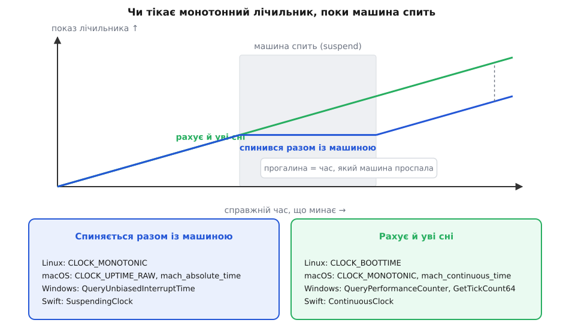

# ⏱️ Годинники платформ: який виклик дає календар, а який — тривалість

Це довідник на одну сторінку: у кожній мові й у кожній операційній системі — виклик, що повертає **настінний** час (момент за календарем), виклик, що повертає **монотонний** (лічильник, придатний для тривалостей і дедлайнів), і те, чого з назви не видно, — від якого нуля лічить, з якою роздільністю та чи рахує, поки машина спить. Остання властивість ловить найбільше людей: рядок `CLOCK_MONOTONIC` на Linux і на macOS означає протилежні речі.

## 1. Чотири властивості, за якими розрізняють виклики

**Хто може зсунути шкалу.** Настінний годинник мусить збігатися зі світом, тож його підводять ззовні: служба часу [NTP](root:com-protocol/ntp-sync) звіряє машину з еталонним сервером і або плавно міняє темп ходу (slew — годинник іде на частки відсотка швидше чи повільніше, поки не дожене), або різко переставляє показ (step, у тому числі назад). Те саме робить адміністратор командою й гіпервізор після міграції віртуалки. Монотонний не переставляють: у нього немає «правильного» значення, з яким його можна звірити. Але «не переставляють» ≠ «зовсім не чіпають»: `CLOCK_MONOTONIC` на Linux дістає ту саму плавну поправку темпу, що й настінний, і лише `CLOCK_MONOTONIC_RAW` іде рівно так, як цокає залізо.

**Що означає нуль.** У настінного нуль спільний для всього світу: 1970-01-01 UTC в Unix-родині, 1601-01-01 UTC у форматі Windows FILETIME. Тому його число щось означає і на іншій машині, і через рік — саме з такого лічильника секунд дістають рік, годину й хвилину ([мітки часу](root:sf-distributed/timestamps)). У монотонного нуль довільний і локальний: старт системи, старт процесу, момент початку навігації у вкладці. Один його показ не означає нічого; сенс має лише різниця двох показів **однієї машини й одного запуску**.

**Чи рахує, поки машина спить.** Монотонних лічильників у системі не один, а два різновиди, і плутають їх постійно. Один спиняється разом із машиною, коли та йде в suspend, і на пробудженні продовжує з того ж числа. Другий рахує весь час, бо його веде апаратний лічильник, який не вимикають. Різниця видна лише тоді, коли кришку ноутбука закрили на вісім годин, — і тоді вона коштує дорого.



*Обидві лінії — монотонні: жодна не йде назад. Але після пробудження вони розходяться рівно на час сну, і в кожної операційної системи своя пара імен для цих двох родин — причому `CLOCK_MONOTONIC` у Linux і в macOS потрапляє в **різні** колонки.*

> 🔧 **Навіщо це.** Колонка «уві сні» вирішує долю цілком буденного коду. Процес на ноутбуці розробника, віртуалка, яку призупинили, телефон, що заснув із відкритим застосунком: якщо таймаут на 30 секунд збудований на лічильнику, який спиняється разом із машиною, то після восьми годин сну і кеш токенів, і вікно обмеження швидкості, і пауза перед повтором вважатимуть, що не минуло нічого. Якщо ж навпаки, на лічильнику, що рахує уві сні, — дедлайн «за 30 с» спрацює **миттєво** на пробудженні, бо його давно перейдено. Обидві поведінки правильні; питання лише в тому, чи вибрано її свідомо.

**Роздільність і ціна виклику.** Роздільність — це крок, з яким показ узагалі змінюється, і він буває на п'ять порядків гірший за формат числа. `GetSystemTimeAsFileTime` рахує в тіках по 100 нс, але оновлюється раз на 10–16 мс, бо це просто змінна, яку переписує переривання таймера; тому в Windows є другий виклик із тим самим типом результату — `GetSystemTimePreciseAsFileTime` — і вже зі справжньою мікросекундною роздільністю. Ціна теж різна: на Linux `clock_gettime` зазвичай виконується у vDSO (сторінка коду ядра, відображена в пам'ять процесу), тож це звичайний виклик функції без переходу в ядро; `QueryPerformanceCounter` теж обходиться без системного виклику, поки під ним лежить лічильник тактів процесора (TSC). А коли платформа змушена взяти таймер на материнській платі (HPET чи ACPI PM), один замір коштує близько мікросекунди — у гарячому циклі це вже видно.

## 2. Мова → який виклик брати

| Середовище | Настінний: момент за календарем | Монотонний: тривалість і дедлайн | Що повертає монотонний |
|---|---|---|---|
| C (POSIX) | `clock_gettime(CLOCK_REALTIME, &ts)`, `time(NULL)` | `clock_gettime(CLOCK_MONOTONIC, &ts)` | `struct timespec` — секунди + наносекунди |
| C++ `<chrono>` | `system_clock::now()` | `steady_clock::now()` | `time_point`; різниця → `duration` |
| Rust | `SystemTime::now()` | `Instant::now()` | `Instant`; різниця → `Duration` |
| Go | `time.Now()` (настінна складова значення) | `time.Now()`, `time.Since(t)`, `time.Until(t)` | `time.Duration` — int64 наносекунд |
| Python | `time.time()`, `time.time_ns()` | `time.monotonic()`, `time.perf_counter()`, `*_ns()` | float секунд (у `_ns` — ціле наносекунд) |
| Java / Kotlin (JVM) | `System.currentTimeMillis()`, `Instant.now()` | `System.nanoTime()`; у Kotlin — `TimeSource.Monotonic.markNow()` | `long` наносекунд; у Kotlin — `TimeMark`/`Duration` |
| C# / .NET | `DateTime.UtcNow`, `DateTimeOffset.UtcNow` | `Stopwatch.GetTimestamp()`, `Environment.TickCount64` | тіки (`Stopwatch.Frequency` на секунду) / мс |
| JavaScript у браузері | `Date.now()`, `new Date()` | `performance.now()` | мс із дробовою частиною, від `performance.timeOrigin` |
| Node.js | `Date.now()` | `process.hrtime.bigint()`, `performance.now()` | `BigInt` наносекунд / дробові мс |
| Swift | `Date()` | `ContinuousClock`, `SuspendingClock`, `DispatchTime.now()` | `Instant`; різниця → `Duration` |
| Ruby | `Time.now` | `Process.clock_gettime(Process::CLOCK_MONOTONIC)` | Float секунд |
| PHP | `time()`, `microtime(true)` | `hrtime(true)` — з PHP 7.3 | ціле наносекунд (на 64-бітних) |
| PostgreSQL | `now()`, `statement_timestamp()`, `clock_timestamp()` | немає: монотонного годинника SQL не дає | — |

Останній рядок не помилка й не прогалина в PostgreSQL: у SQL узагалі немає поняття локального лічильника, тому будь-яка перевірка «чи спливло» всередині бази неминуче настінна. Самі ж три функції розрізняються не годинником, а моментом заміру: `now()` (він же `transaction_timestamp()`, він же `CURRENT_TIMESTAMP`) заморожений на початку транзакції й не міняється до її кінця, `statement_timestamp()` — на початку поточного оператора, і лише `clock_timestamp()` читає годинник щоразу, тож може дати різні значення в одному рядку запиту.

## 3. Один і той самий шматок у кожному середовищі

Замір тривалості, дедлайн і календарний момент — три речі, які потрібні майже завжди разом:

:::tabs
```cpp
#include <chrono>
using namespace std::chrono;

static_assert(steady_clock::is_steady, "потрібен сталий годинник");

auto t0 = steady_clock::now();
// ... робота ...
auto ms = duration_cast<milliseconds>(steady_clock::now() - t0).count();

auto deadline = steady_clock::now() + 30s;      // дедлайн усередині процесу
bool expired  = steady_clock::now() >= deadline;

auto stamp = system_clock::now();               // а це — момент за календарем
```
```py
import time

t0 = time.monotonic()
# ... робота ...
elapsed = time.monotonic() - t0                  # завжди ≥ 0

deadline = time.monotonic() + 30.0
left = max(0.0, deadline - time.monotonic())     # скільки лишилося

stamp = time.time()                              # момент за календарем
print(time.get_clock_info("monotonic"))          # який годинник під сподом
```
```js
const t0 = performance.now();                    // мс від timeOrigin
// ... робота ...
const elapsedMs = performance.now() - t0;

const deadline = performance.now() + 30_000;
const left = () => Math.max(0, deadline - performance.now());

const stamp = Date.now();                        // момент за календарем

// Node.js: цілі наносекунди, без утрати точності на float
const n0 = process.hrtime.bigint();
const elapsedNs = process.hrtime.bigint() - n0;
```
```go
start := time.Now()                  // несе обидва покази нараз
elapsed := time.Since(start)         // віднімання бере монотонний

deadline := start.Add(30 * time.Second)
if time.Now().After(deadline) {      // теж по монотонному
    // вийшов час
}

stamp := time.Now().Round(0)         // монотонний відлік зрізано, лишився календар
```
```rust
use std::time::{Duration, Instant, SystemTime, UNIX_EPOCH};

let t0 = Instant::now();
// ... робота ...
let elapsed: Duration = t0.elapsed();            // ніколи не від'ємний

let deadline = t0 + Duration::from_secs(30);
let left = deadline.saturating_duration_since(Instant::now());

let stamp = SystemTime::now().duration_since(UNIX_EPOCH).unwrap();
```
```java
long t0 = System.nanoTime();                     // довільний нуль
// ... робота ...
long elapsedNs = System.nanoTime() - t0;

long timeoutNs = TimeUnit.SECONDS.toNanos(30);
if (System.nanoTime() - t0 >= timeoutNs) {       // різниця, НЕ сума
    // вийшов час
}

Instant stamp = Instant.now();                   // момент за календарем
```
```csharp
long t0 = Stopwatch.GetTimestamp();              // монотонні тіки
// ... робота ...
TimeSpan elapsed = Stopwatch.GetElapsedTime(t0); // з .NET 7; без алокацій

long uptimeMs = Environment.TickCount64;         // мс від старту системи
DateTime stamp = DateTime.UtcNow;                // момент за календарем
```
```swift
let clock = ContinuousClock()                    // рахує й уві сні
let start = clock.now
// ... робота ...
let elapsed = start.duration(to: clock.now)

let deadline = start.advanced(by: .seconds(30))
let left = clock.now.duration(to: deadline)

let stamp = Date()                               // момент за календарем
```
:::

## 4. Що під сподом: системні годинники

### POSIX і Linux — `clock_gettime(clk_id, &ts)`

```c
#include <time.h>
#include <stdint.h>

static int64_t mono_ns(void) {
    struct timespec ts;
    if (clock_gettime(CLOCK_MONOTONIC, &ts) != 0) return -1;  // -1 і errno=EINVAL, якщо такого годинника нема
    return (int64_t)ts.tv_sec * 1000000000 + ts.tv_nsec;      // секунди й наносекунди — окремі поля
}
```

| Ідентифікатор | Що показує | Хто його зсуває | Рахує уві сні | Звідки |
|---|---|---|---|---|
| `CLOCK_REALTIME` | календарний час від 1970-01-01 UTC | ставить адмін; NTP і `adjtime()` тягнуть і крокують | після пробудження підхоплює справжню дату з апаратного RTC | POSIX |
| `CLOCK_REALTIME_COARSE` | те саме, дешевше й грубіше (крок таймера ядра) | так само | так само | Linux 2.6.32 |
| `CLOCK_MONOTONIC` | сталий лічильник від невизначеної точки | переставити не можна, але темп підганяють `adjtime()` і NTP | **ні** | POSIX |
| `CLOCK_MONOTONIC_RAW` | сирий апаратний темп | ніхто: без поправок NTP і `adjtime()` | **ні** | Linux 2.6.28 |
| `CLOCK_MONOTONIC_COARSE` | як `CLOCK_MONOTONIC`, дешевше й грубіше | темп підганяють | **ні** | Linux 2.6.32 |
| `CLOCK_BOOTTIME` | як `CLOCK_MONOTONIC`, **плюс** час сну | переставити не можна | **так** | Linux 2.6.39 |
| `CLOCK_TAI` | та сама календарна вісь, що й `CLOCK_REALTIME`, але за шкалою TAI — без високосних секунд, тож жодна секунда не повторюється двічі | напряму не переставляється, проте йде слідом за `CLOCK_REALTIME`, зсунутий на ціле число секунд | так само, як `CLOCK_REALTIME` | Linux 3.10 |
| `CLOCK_PROCESS_CPUTIME_ID` | процесорний час, спожитий процесом | — | не про справжній час узагалі | Linux 2.6.12 |
| `CLOCK_THREAD_CPUTIME_ID` | те саме на потік | — | не про справжній час узагалі | Linux 2.6.12 |

Дві останні позиції в довіднику стоять не даремно: «скільки процес рахував» і «скільки минуло» — різні питання, і на машині з десятком потоків процесорний час легко буває більший за настінний.

### macOS і решта Darwin — ті самі імена, інші правила

| Виклик | Що показує | Рахує уві сні |
|---|---|---|
| `clock_gettime(CLOCK_REALTIME)` | календарний час від 1970 | підхоплює справжню дату |
| `clock_gettime(CLOCK_MONOTONIC)` | сталий лічильник від довільної точки | **так** |
| `clock_gettime(CLOCK_MONOTONIC_RAW)` | те саме без поправок частоти й часу | так |
| `clock_gettime(CLOCK_UPTIME_RAW)` | як `CLOCK_MONOTONIC_RAW` | **ні** |
| `mach_absolute_time()` | тіки Mach; у наносекунди переводять через `mach_timebase_info()` | ні |
| `mach_continuous_time()` | те саме, але лічить і крізь сон | так |

Ось де ховається пастка перенесення коду: `CLOCK_MONOTONIC` у документації Apple прямо описаний як такий, що «продовжує рости, поки система спить», а в Linux — як такий, що «не рахує час, поки система призупинена». Один і той самий рядок у двох системах дає дві різні поведінки, і компілятор про це не скаже нічого.

### Windows

| Виклик | Одиниця й нуль | Рахує уві сні | Роздільність |
|---|---|---|---|
| `GetSystemTimeAsFileTime` | тіки по 100 нс від 1601-01-01 UTC | — (це календар) | 10–16 мс |
| `GetSystemTimePreciseAsFileTime` | той самий FILETIME | — (це календар) | ≤ 1 мкс (з Windows 8) |
| `GetTickCount64` | мс від старту системи | **так** (зміщений лічильник) | 10–16 мс |
| `QueryInterruptTime` | тіки по 100 нс від старту системи | **так** | крок переривання таймера |
| `QueryUnbiasedInterruptTime` | тіки по 100 нс, «незміщені» | **ні** | крок переривання таймера |
| `QueryPerformanceCounter` + `QueryPerformanceFrequency` | тіки апаратного лічильника від старту системи | **так** | ≤ 1 мкс |

Слово «зміщений» (biased) у назвах — це і є ознака сну: незміщений час відображає лише той період, коли система працювала. Сама Windows користується зміщеним для того, щоб відносні таймери, яким належало спрацювати уві сні, спрацювали одразу на пробудженні. Частоту `QueryPerformanceFrequency` система фіксує на завантаженні й не міняє, тож питати її досить один раз і закешувати; під гіпервізором вона часто дорівнює рівно 10 МГц і до частоти заліза стосунку не має.

## 5. Пастки, які видно лише в довіднику

- **C++: `high_resolution_clock` — це не годинник, а псевдонім.** У libstdc++ він визначений як `using high_resolution_clock = system_clock`, тобто **не сталий**, а в libc++ і в MSVC це псевдонім `steady_clock`. Вирішує стандартна бібліотека, а не компілятор: clang на Linux зазвичай теж бере libstdc++, тож той самий код міряє чесно на macOS і бреше на Linux. Для замірів беруть `steady_clock` прямо, а сумніви знімає `steady_clock::is_steady` (`true`) проти `high_resolution_clock::is_steady`.
- **Go: монотонний відлік можна непомітно зрізати.** `time.Now()` несе обидва покази, але `t.Round(0)`, `t.Truncate(d)`, `t.UTC()`, `t.Local()`, `t.In(loc)`, `t.AddDate(...)` і будь-яка серіалізація (`MarshalJSON`, `MarshalBinary`, `GobEncode`, `Format`) віддають значення **без** монотонної частини; так само її не мають `time.Unix()`, `time.Date()` і `time.Parse()`. І найтихіше: якщо в порівнянні чи відніманні монотонний показ має лише один операнд, Go мовчки переходить на настінний. Час, що зробив круг через JSON, більше не захищений.
- **Java: різниця, а не сума.** `System.nanoTime()` веде відлік від довільного нуля, який може бути й у майбутньому (значення бувають від'ємні), і в кожної віртуальної машини він свій — порівнювати покази двох JVM безглуздо. Документація прямо радить писати `System.nanoTime() - startTime >= timeoutNanos` замість `System.nanoTime() >= startTime + timeoutNanos`: на проміжках понад ~292 роки (2⁶³ нс) сума переповнюється, а різниця лишається правильною.
- **Rust: від'ємної тривалості не буде навіть при збої заліза.** `Instant` — монотонний, але не обов'язково рівномірний. Якщо через ваду гіпервізора чи процесора показ усе-таки поїде назад, `duration_since`, `elapsed` і `-` **осідають у нуль** (у старіших версіях Rust на цьому місці була паніка). Коли треба відрізнити «нуль часу» від «годинник збрехав», є `checked_duration_since`, що повертає `None`.
- **Windows: два «монотонні» лічильники з різною відповіддю про сон.** `QueryPerformanceCounter` рахує весь час, зокрема standby й hibernate; `QueryUnbiasedInterruptTime` — лише робочий стан. Оскільки .NET `Stopwatch` під Windows стоїть саме на `QueryPerformanceCounter`, замір, що охопив сон машини, покаже всі проспані години.
- **Python: назва функції відповіді про сон не дає.** З версії 3.13 `perf_counter()` читає той самий годинник, що й `monotonic()`, а який це годинник — вирішує система: `clock_gettime(CLOCK_MONOTONIC)` на Linux (сон не рахує), `mach_absolute_time()` на macOS (не рахує), `QueryPerformanceCounter()` на Windows (рахує). Те саме стосується `Instant` у Rust: Linux — `CLOCK_MONOTONIC`, macOS — `CLOCK_UPTIME_RAW`, Windows — `QueryPerformanceCounter`.
- **Браузер: `performance.now()` навмисно загрублений.** Щоб таймером не міряли чужі секрети через кеш процесора, роздільність обмежують: 5 мкс у контексті з ізоляцією за походженням (`crossOriginIsolated === true`) і 100 мкс без неї. Нуль відліку — `performance.timeOrigin`, момент початку навігації (у воркері — момент його запуску), тому покази з двох вкладок непорівнянні.
- **Swift: обидві родини мають імена, і вибір явний.** `ContinuousClock` іде й тоді, коли машина спить, `SuspendingClock` — ні; на Darwin і на Linux вони лягають на різні системні годинники, але семантика лишається однаковою, і саме тому цим двом іменам можна вірити більше, ніж імені `CLOCK_MONOTONIC`.

## 6. Як перевірити, що саме в тебе під руками

Python сам розкаже про свій годинник: яку системну функцію він викликає під сподом, чи можна той годинник переставити і з яким кроком він іде:

```py
>>> import time; time.get_clock_info("monotonic")
namespace(adjustable=False, implementation='clock_gettime(CLOCK_MONOTONIC)',
          monotonic=True, resolution=1e-09)
```

У C++ те саме питання — до типу, а не до значення, тож відповідь приходить ще на компіляції:

```cpp
static_assert(std::chrono::steady_clock::is_steady);           // завжди true
std::cout << std::chrono::high_resolution_clock::is_steady;    // 0 під GCC/libstdc++
std::cout << std::chrono::system_clock::is_steady;             // 0 всюди
```

У .NET видно, чи взято апаратний лічильник, і з якою частотою він цокає:

```csharp
Console.WriteLine(Stopwatch.IsHighResolution);   // True → під сподом QueryPerformanceCounter
Console.WriteLine(Stopwatch.Frequency);          // тіків на секунду, часто 10 000 000
```

І найпростіша перевірка, яка ловить сплутані годинники ще на своїй машині, працює скрізь однаково: зняти показ, зсунути системний час назад на хвилину (`timedatectl set-time`, `date -s`, панель керування Windows), зняти другий показ — і подивитися, котрий із двох замірів вийшов від'ємним.
