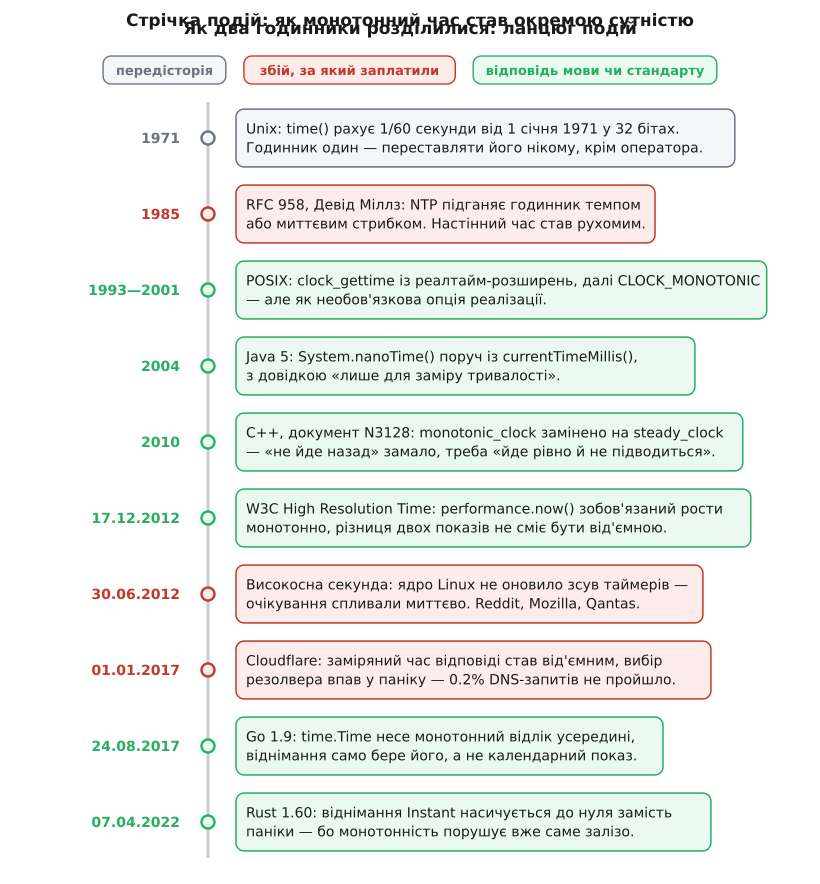

# 📜 Як індустрія намацувала різницю між двома годинниками

Те, що машині потрібні два різні годинники — календарний і той, який просто рівно рахує, — індустрія зрозуміла не з теорії, а з рахунків за аварії: нижче видно, хто зробив настінний час рухомим, скільки років стандарт пропонував нерухому альтернативу як необов'язкову, і які саме падіння змусили мови програмування перестати перекладати вибір годинника на програміста.



*Червоні позначки — те, за що заплатили збитками; зелені — відповідь мови чи стандарту. Між появою рухомого настінного часу й появою стандартного нерухомого минуло шістнадцять років, а між нею та обов'язковістю — ще двадцять три.*

Спочатку розділяти не було чого.

## Годинник, якого не було кому підводити

Перше видання довідника Unix, датоване 3 листопада 1971 року, описує системний виклик `time` буденно: він повертає час від опівночі 1 січня 1971 року, поміряний у шістдесятих частках секунди. Третє видання, березень 1972-го, додає до опису тверезу примітку: час зберігається у 32 бітах, і це «guarantees a crisis every 2.26 years» (*Unix Programmer's Manual*, 3-тє вид., 1972).

Примітка не була фігурою мови — це проста арифметика.

**Скільки живе 32-бітний лічильник, що цокає 60 разів на секунду:**

```
2³² = 4 294 967 296 тиків
4 294 967 296 тиків ÷ 60 тиків/с = 71 582 788 с
71 582 788 с ÷ 86 400 с/добу      = 828.5 доби
828.5 доби ÷ 365.25 доби/рік      ≈ 2.27 року
```

Кризу відсунули просто: епоху пересунули на 1 січня 1970 року, а цокати змусили раз на секунду замість шістдесяти разів — і той самий лічильник дожив аж до 2038-го. Але цікаве тут інше. У ту пору різниця двох показів `time()` була **чесною** мірою тривалості. Кварц у машині повз — поспішав або відставав на секунди за добу, — проте нікуди не стрибав, бо переставляти годинник не було кому й нащо: машина стояла сама, і її календар нікого поза нею не обходив. Одного годинника вистачало, бо на обидва питання — «котра зараз» і «скільки минуло» — він відповідав однаково приблизно й однаково передбачувано.

## NTP зробив настінний час рухомим

Усе змінив документ RFC 958, вересень 1985 року, автор — Девід Л. Міллз (тоді M/A-COM Linkabit, згодом Делаверський університет). Він описав протокол, який звіряє годинник машини з мережею серверів і виправляє розбіжність. І тут-таки, у першому ж описі, закладено те, чим цей протокол назавжди поділив час навпіл: виправлення, каже специфікація, або змушує локальний годинник іти трохи швидше чи повільніше, поки не зійдеться з правильним значенням, або переставляє його миттєво — залежно від того, наскільки велика розбіжність.

Два режими. Перший — підганяння темпу: секунда на короткий час стає трохи довшою або коротшою за справжню, а хід лишається неперервним. Другий — стрибок; і стрибок цей буває **назад**. Обидва режими живуть у фоновій службі [синхронізації часу мережею](topic:com-protocol/ntp-sync): вона періодично питає час у серверів-еталонів, оцінює затримку каналу й виправляє локальний годинник — дрібні розбіжності розтягує темпом, великі переставляє одразу, бо розтягувати їх довелося б годинами.

І ось головне: жоден рядок прикладного коду при цьому не змінився. Виклик `time()` виглядав так само й повертав таке саме число — але з 1985 року різниця двох його показів перестала бути тривалістю. Вона стала тривалістю плюс тим, що встиг зробити демон синхронізації. Помилка з'явилася в мільйонах програм одночасно й ніяк себе не виявляла, бо крок годинника трапляється рідко.

## Стандарт запропонував другий годинник — і зробив його необов'язковим

Відповідь POSIX прийшла з боку систем реального часу, де тривалість важить більше за календар. Виклик `clock_gettime` уперше з'явився в п'ятій редакції стандарту, узгоджено з реалтайм-розширенням IEEE 1003.1b-1993; годинники стали не окремими функціями, а іменованими константами, і календарний дістав ім'я `CLOCK_REALTIME`.

`CLOCK_MONOTONIC` з'явився наступною редакцією, шостою (2001). Не в базовій частині — як **опція** з окремою назвою «Monotonic Clock». Реалізація мала повне право її не мати; переносний код мусив питати `sysconf(_SC_MONOTONIC_CLOCK)` і тримати запасну гілку на випадок «немає». Обов'язковим монотонний годинник став аж у восьмій редакції стандарту (2024) — журнал змін відзначає це одним сухим рядком про дефект Austin Group під номером 1346.

Арифметика виходить незатишна. 1985-й: настінний годинник дістав право стрибати. 2001-й: з'явився стандартний годинник, що стрибати не вміє. 2024-й: на нього нарешті можна покластися, не питаючи дозволу. Шістнадцять років код не мав переносного способу поміряти тривалість — і ще двадцять три роки мусив цей спосіб щоразу перевіряти.

## Пастка, вбудована в самий інтерфейс очікування

Найнеприємніше в цій історії те, що деякі інтерфейси не просто дозволяли взяти не той годинник — вони його **вимагали**. Канонічний приклад — очікування з таймаутом на умовній змінній.

[Умовна змінна](topic:sf-tasks/monitor-sync) — це місце, де потік засинає під м'ютексом, поки інший потік не повідомить, що чекана умова настала; очікування з таймаутом потрібне, щоб не заснути назавжди, якщо повідомлення не прийде. Виклик `pthread_cond_timedwait` приймає не «почекай 30 секунд», а **абсолютний момент**, до якого чекати. Причина поважна й прописана в самому стандарті: відносний таймаут поверх абсолютного інтерфейсу будується легко, а абсолютний поверх відносного має гонитву — між тим, як ви порахували «скільки лишилося», і тим, як ви лягли чекати, потік можуть витіснити, і чекання почнеться вже з іншої точки.

Але абсолютний момент треба відлічувати за якимось годинником — і за замовчуванням це `CLOCK_REALTIME`. Тобто дедлайн очікування прив'язаний до календаря. NTP крокнув годинник на хвилину вперед — очікування спливає негайно, хоч чекати мало ще пів години. Крокнув назад — потік лежить зайву хвилину поверх свого таймауту.

Шоста редакція дала латку: годинник умовної змінної можна вибрати наперед. Латка часткова — годинник фіксується один раз, коли змінну створюють, тож бібліотека, що дістала умовну змінну від викликача, не знає, за чим саме її очікування відлічується. Назвати годинник прямо в місці очікування дозволив лише `pthread_cond_clockwait`, який спершу жив як розширення бібліотек, а до стандарту потрапив аж у восьмій редакції.

```c
pthread_condattr_t attr;
pthread_condattr_init(&attr);
pthread_condattr_setclock(&attr, CLOCK_MONOTONIC);  /* редакція 6: годинник — на змінну */
pthread_cond_init(&cv, &attr);

struct timespec deadline;
clock_gettime(CLOCK_MONOTONIC, &deadline);
deadline.tv_sec += 30;                              /* абсолютний момент за СТАЛИМ годинником */
pthread_cond_timedwait(&cv, &m, &deadline);

/* редакція 8: годинник називають у самому очікуванні */
pthread_cond_clockwait(&cv, &m, CLOCK_MONOTONIC, &deadline);
```

## Windows: сталий лічильник, який переповнюється

На іншій платформі та сама наука прийшла з іншого боку. `GetTickCount` рахує мілісекунди від старту системи: календаря за ним немає, адміністратор його не переставляє, служба синхронізації не торкається. Здавалося б, готовий вимірювач тривалості. Одна деталь: результат — 32-бітне число, і документація Microsoft прямо попереджає, що на машині, яка пропрацювала без перезавантаження 49.7 доби, лічильник обертається через нуль.

Це та сама арифметика 2³², лише вже по мілісекунді:

```
2³² = 4 294 967 296 мс
4 294 967 296 мс ÷ 86 400 000 мс/добу ≈ 49.7 доби
```

[Переповнення беззнакового лічильника](topic:sf-lang/overflow-wraparound) саме собою ще не аварія: різниця «кінець мінус початок» у беззнаковій арифметиці лишається правильною й через оберт, якщо проміжок коротший за період лічильника. Ламається саме **порівняння** «кінець більший за початок», яке після оберту дає неправду, — а на ньому тримається кожен наївний таймаут.

Наскільки поширеною була ця помилка, найкраще каже одна деталь із тієї ж документації: у налагоджувальних збірках Windows лічильник тиків стартує не з нуля, а вже зсунутим приблизно на 49 діб — навмисно, щоб переповнення сталося на першому ж дні тестів, а не в клієнта через півтора місяця безперервної роботи. Операційна система їде з наперед зведеною пасткою саме на цей клас помилок. Ширину полагодив `GetTickCount64`.

Зі сталістю другого лічильника, `QueryPerformanceCounter`, було складніше, і впиралося вже не в число, а в залізо. Документація описує це відверто: на системах до Windows Vista траплялися процесори, чий лічильник тактів міняв темп разом із частотою ядра, а BIOS про це не повідомляв; на багатоядерних машинах лічильники різних ядер не завжди вдавалося звести до спільного значення — і два покази, зняті на сусідніх ядрах, могли розійтися. Пізніші версії Windows навчилися це виявляти на старті й підкладати під `QueryPerformanceCounter` окремий платформний таймер замість процесорного лічильника. Сучасний різновид тієї самої біди — [апаратна віртуалізація](topic:hw-arch/hardware-virtualization), яка дозволяє переносити запущену гостьову машину між фізичними хостами, не спиняючи її: лічильник тактів — властивість конкретного процесора, і після переїзду він може цокати з іншою частотою прямо під ногами гостя.

Скільки разів про це питали, видно з того, що в списку типових питань документації окремим рядком стоїть відповідь: на `QueryPerformanceCounter` не впливають ані переведення на літній час, ані високосні секунди, ані часові пояси, ані переставляння годинника адміністратором. Такі рядки в довідники не потрапляють, поки питання не поставлять сотні разів.

## Java: окремий виклик саме для тривалостей

До п'ятої версії (2004) у Java був рівно один спосіб спитати час — `System.currentTimeMillis()`, календарний. `System.nanoTime()` з'явився як другий інструмент, і документація описує його так, що переплутати важко: початок відліку довільний і може лежати навіть у майбутньому, тож значення бувають від'ємні; кожна віртуальна машина має свій початок; сенс мають лише різниці двох показів у межах однієї машини. Окремо сказано, що виклик годиться лише для заміру тривалості й ні до якого поняття системного чи настінного часу стосунку не має.

Мова навмисно зробила число **беззмістовним** поза відніманням — і цим унеможливила найгіршу з можливих помилок: покласти його в базу або відправити в мережу як мітку моменту. Заразом довідка радить порівнювати покази як `t1 - t0 < 0`, а не `t1 < t0`: початок відліку довільний, отже значення можуть лежати біля межі 64-бітного знакового діапазону, і різниця переживе оберт, а пряме порівняння — ні. Той самий урок, що й на Windows, тільки записаний одразу в документацію, а не здобутий полем.

## C++: перейменування, яке пояснює суть

У чернетках C++0x монотонний годинник спершу так і звався — `monotonic_clock`. Змінив це документ N3128 «C++ Timeout Specification», Лоуренс Кроул, 19 серпня 2010 року, і зробив це з дуже конкретного міркування.

Монотонність, каже документ, обіцяє єдине: покази не спадають, коли фізичний час іде вперед. Але монотонний годинник цілком може бути **підведеним** — його темп дозволено тягнути. А таймаут за визначенням означає «чекати не менше ніж T», і таку обіцянку можна виконати лише на годиннику, темп якого ніхто не змінює. Тому в стандарт увійшов `steady_clock` — «сталий»: не просто не йде назад, а йде **рівно**. Маючи такий годинник, доводить документ, окремий монотонний уже майже ні до чого, тож його прибрали зовсім.

```cpp
// чернетка C++0x до 2010 року:
std::chrono::monotonic_clock::now();   // обіцянка: покази не спадають
// C++11 після N3128:
std::chrono::steady_clock::now();      // обіцянка сильніша: темп сталий, годинник не підводять
```

> 🔧 **Навіщо це.** Розрізнення не буквоїдство, і Linux — жива йому ілюстрація. Тамтешній `CLOCK_MONOTONIC` справді ніколи не спадає, але службі синхронізації дозволено тягнути його **частоту**: коли демон вирішує, що кварц поспішає, він повільно виправляє темп, і секунда монотонного годинника певний час трохи довша або коротша за справжню. На замірі в мілісекунди цього не видно; на добовому вимірі — уже так. Для випадків, де темп важить над усе, Linux у версії 2.6.28 додав окремий `CLOCK_MONOTONIC_RAW`, якого підганяння частоти не торкається. Тобто іменем `steady_clock` C++ назвав рівно ту властивість, яку в POSIX довелося виносити в третю константу.

## Браузер: монотонність як вимога специфікації

У вебі другий годинник з'явився одразу як обов'язок. Специфікація W3C «High Resolution Time» (рекомендація від 17 грудня 2012 року, редактор Джатіндер Манн, Microsoft) вимагає, щоб `performance.now()` зростав монотонно й не залежав ані від підводок системного годинника, ані від його розбіжності з еталоном; окремим реченням сказано, що різниця двох послідовно знятих показів не сміє бути від'ємною. Специфікації, у яких доводиться писати «не сміє бути від'ємною», пишуть після повідомлень про помилки, а не до них.

А далі стався поворот, якого ніхто не планував: точний монотонний годинник виявився зброєю. Кількох мікросекунд роздільності досить, щоб поміряти, скільки часу зайняв доступ до пам'яті, — а з цього будують [атаки за часом](topic:sf-security/timing-attack): вимірюючи тривалість операції, нападник дізнається про дані, до яких прямого доступу не має, — чи потрапив потрібний рядок у кеш, чи збіглася перша половина секрету. Тому браузери свідомо **зіпсували** власний годинник: за нинішніми вимогами `performance.now()` огрублюють до 5 мікросекунд у сторінці з ізоляцією походжень і до 100 мікросекунд без неї. Єдиний епізод у цій історії, де монотонний годинник навмисно зробили гіршим.

## 30 червня 2012: секунда, якої не було в розкладі

[Високосна секунда](topic:hw-sensing/leap-second) — це вставка зайвої секунди у шкалу UTC, якою обертання Землі час від часу підганяють до атомних годинників: доба стає 86401-секундною, і момент 23:59:60 існує насправді. Про вставку оголошують за місяці наперед, а операційні системи здебільшого реалізують її найпростіше — кроком настінного годинника на секунду назад. Тобто це рідкісний випадок, коли годинник переставляють не одній машині, а всім одразу й за розкладом.

30 червня 2012 року такий крок зустрівся з помилкою в ядрі Linux, яка тихо жила там років п'ять. Ядро перевело `CLOCK_REALTIME` назад, але не оновило зсув, що його підсистема високоточних таймерів тримає окремо від основного відліку. Наслідок описав Джон Стульц, автор виправлення: усі абсолютні таймери на `CLOCK_REALTIME` із проміжком менше секунди почали спливати негайно, а оскільки такі таймери майже завжди стоять усередині циклу очікування, цикл закрутився на повній швидкості. Машини не падали — вони раптом починали палити процесор ні на що. Про збої після тієї секунди повідомили Reddit (через Cassandra), Mozilla (через Hadoop), система бронювання Qantas і чимало інших.

Придивіться до форми: це рівно той інтерфейс із попереднього розділу — абсолютний дедлайн на календарному годиннику всередині циклу очікування, — тільки замість повільного кроку демона синхронізації по ньому вдарила секунда, вставлена всьому світу одночасно.

Google вибрав інший шлях ще до того: з 2008 року він не робить кроку, а **розмазує** зайву секунду — лінійно, добовим вікном від полудня до полудня UTC, так що жоден годинник ніколи не стрибає, лише певний час іде трохи інакше. Згодом той самий підхід узяв AWS. А 18 листопада 2022 року 27-ма Генеральна конференція з мір і ваг резолюцією 4 ухвалила збільшити допустиму розбіжність між UT1 і UTC — у 2035 році або раніше, тобто фактично прибрати високосну секунду з ужитку. Читати це можна прямо: навчити кожну програму розрізняти два годинники виявилося дорожче, ніж перестати рухати один із них.

## 1 січня 2017: мінус секунда в продакшені

Наступна високосна секунда, опівночі 1 січня 2017 року за UTC, зловила Cloudflare. Її система резолвінгу DNS міряла, як швидко відповідають зовнішні резолвери, звичайним відніманням календарних показів — і на тій секунді час пішов назад, а заміряна тривалість вийшла від'ємною.

Далі найцікавіше: від'ємне число не впало на місці. Воно протекло крізь згладжування оцінок швидкості й дійшло аж до вибору наступного резолвера — а вибір робився через генератор випадкових чисел, який на недодатному аргументі панікує. На піку не проходило близько 0.2% DNS-запитів; повністю розібралися до 06:45 UTC. Саме виправлення виявилося мізерним — перевірка, що тривалість не від'ємна.

**Форма помилки (реконструкція за розбором Cloudflare):**

```go
rtt := time.Now().Sub(start)                     // під час високосної секунди — від'ємна
srv.avgRTT = 0.9*srv.avgRTT + 0.1*float64(rtt)   // від'ємне протікає в оцінку
pick := rand.Int63n(totalWeight(upstreams))      // panic: invalid argument
```

Ця форма — головний урок усієї історії. Помилка була не в роботі з часом. У тому рядку, де писалося «взяти час зараз», ніхто не помилявся; аварія сталася трьома шарами далі, у виклику, який просто отримав те, чого не буває. Порада «будьмо уважні з часом» тут не рятує, бо неуважність і падіння розведені по різних файлах.

## Go 1.9: вибір годинника прибрали з рук програміста

Проєктний документ під номером 12914, автор Расс Кокс, востаннє правлений 26 січня 2017 року — за три тижні після тієї аварії. Cloudflare названо в ньому прямо, поряд із переліком інших зламаних замірів.

Рішення виявилося нетиповим. Замість того щоб додати другий інтерфейс і роз'яснювати, коли ним користуватися, Go зробив правильним **уже написаний** код: значення `time.Time` понесло, крім обов'язкового календарного показу, ще й необов'язковий монотонний, а віднімання почало брати монотонний щоразу, коли він є в обох операндах. Правило документа коротке: настінний годинник — щоб казати, котра година; монотонний — щоб міряти час. Go 1.9 вийшов 24 серпня 2017 року.

Ціна в цього рішення є, і вона виписана чесно: `time.Time` перестало бути простим значенням. Монотонна частина не переживає серіалізацію, порівняння через `==` враховує і її, а `Round`, `Truncate` й `UTC` її знімають; у текстовому поданні з'явилося додаткове поле `m=±значення`. Мова взяла складність на себе, щоб не брати її з користувача, — і саме тому цю зміну варто читати як визнання: якщо ціле покоління програмістів помиляється однаково, проблема вже не в програмістах, а в інтерфейсі.

## Rust: монотонність — обіцянка заліза, а не мови

Rust розділив час на два типи від початку: `SystemTime` — календарний, `Instant` — монотонний (стабільний із версії 1.8, 2016 рік). Обіцянка була сильна: `Instant` не йде назад. Реальність виявилася слабшою, і документація тепер каже це прямо — на всіх основних платформах бібліотека бере системний інтерфейс, який монотонність гарантує, але саму гарантію зрідка ламають помилки заліза, віртуалізації або операційної системи.

Спершу Rust на таке падав: віднімання двох `Instant`, що розійшлися «назад», викликало паніку. Версія 1.60.0 від 7 квітня 2022 року цю паніку прибрала — `duration_since`, `elapsed` і звичайне віднімання тепер **насичуються до нуля**, а хто хоче відрізнити зламану монотонність від власної помилки в порядку аргументів, бере `checked_duration_since`.

Крок цікавий тим, що визнає межу відповідальності. Мова не може зробити годинник монотонним — вона може лише вирішити, що робити, коли обіцянка, дана нижче, не справдилася. Впасти — чесно, але падає при цьому програма, яка сама нічого не порушила. Насичення бреше на нуль — зате бреше передбачувано й дешево.

## Далі розділився і сам монотонний

Словом «монотонний» історія не закінчилася. Linux 2.6.28 додав `CLOCK_MONOTONIC_RAW` — для тих, кому заважає навіть повільне підтягування частоти службою синхронізації. Linux 2.6.39 додав `CLOCK_BOOTTIME` — бо з'ясувалося, що `CLOCK_MONOTONIC` **не рахує час, поки машина спить**: ноутбук згорнули на годину, а таймер, поставлений на пів години, не спрацював, бо для лічильника ця година не минала.

Кожна така константа — датований слід чужої аварії, і поява кожної означає те саме, що й уся ця історія: властивість, яку вважали однією, під навантаженням розпалася на кілька незалежних. Тому питання «який годинник» не має відповіді «один із двох». Годинників родина, вона й далі росте, і чергова гілка з'являється тоді, коли попередньої комусь не вистачило — зазвичай уже після того, як полічили збитки.
