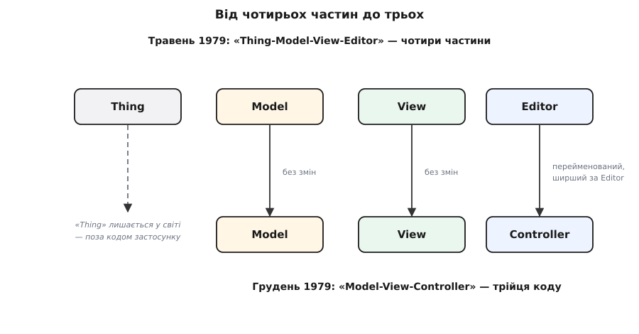
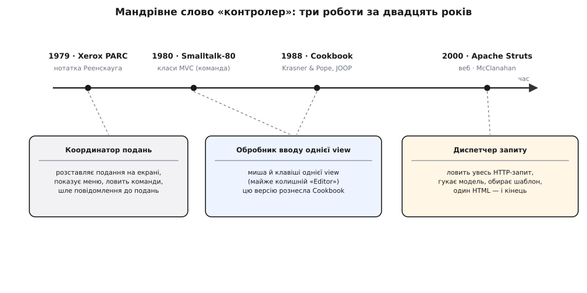

# 📜 Народження MVC: інженер-суднобудівник, Smalltalk і мандрівне слово «контролер»

Три літери, які сьогодні першими злітають з язика в будь-якій розмові про інтерфейси, придумав чоловік, що взагалі не полював на графічні екрани. Він проектував кораблі. І найдивніше в цій історії ось що: з трьох слів — модель, подання, контролер — два перші протримали свій зміст майже незмінним сорок років, а третє, «контролер», за ті самі роки змінило роботу **тричі**. Кожна суперечка «що ж класти в контролер» — це насправді сварка трьох його привидів, які ділять одне ім'я. Щоб зрозуміти, звідки взялися ці привиди, треба почати не з коду, а з людини та її давнього болю.

## Інженер, що будував кораблі даними

Автор MVC — **Трюгве Реенскауг (Trygve Reenskaug)**, норвезький інженер і згодом професор Університету Осло. *(Усталений факт: народився 1930, помер 2024.)* Він не приходив у програмування через мови чи теорію — він прийшов у нього через залізо й сталь. Диплом інженера-будівельника він здобув 1953 року в Тронгеймі, а перші програми написав уже 1957-го на «Nusse», першому норвезькому комп'ютері. *(Усталений факт.)*

Головна праця його життя до Xerox — система **Autokon**, яку з 1960 року розробляли в Центральному інституті промислових досліджень (Sentralinstitutt for industriell forskning) в Осло. Це була одна з найраніших у світі систем автоматизованого проектування для суднобудування: вона тримала модель майбутнього корабля в базі даних, давала інженерам мову, якою вони самі описували деталі, і десятиліттями працювала на верфях по всьому світу. *(Усталений факт: перший ужиток 1963, у роботі понад 30 років.)*

За цією біографією ховається одна наскрізна одержимість, і саме вона — справжнє насіння MVC. Усе життя Реенскауг бився над однією задачею: **як дати людині втримати в голові щось велетенське й заплутане** — цілий корабель, увесь план будівництва — дивлячись на екран, і при цьому відчувати, що вона торкається самої речі, а не комп'ютерної бухгалтерії про неї. Щоб інженер бачив не таблицю чисел, а корпус судна; щоб те, що на склі, один-до-одного відповідало тому, як людина уявляє реальний предмет. Ця вимога вірної відповідності між зображенням і думкою користувача — не про кнопки й не про пікселі. Вона про те, **що застосунок знає** і як зробити це знання видимим, не сплутавши його з тим, як його показано. З цього болю за двадцять років і виросла трійця.

## Xerox PARC: машина, що нарешті вміла показати

Насіння лежало в Реенскаузі давно — бракувало ґрунту. Ґрунтом став Xerox PARC (Пало-Альто), куди він приїхав запрошеним науковцем і пробув із літа 1978-го до літа 1979-го, у групі Learning Research (дослідження навчання). *(Усталений факт.)* Це було одне з найдивовижніших місць в історії обчислень. Групу вів **Алан Кей (Alan Kay)** зі своєю мрією про **Dynabook** — персональний комп'ютер завбільшки з книжку, з яким дитина гралася б, як із зошитом. Заради цієї мрії там будували мову **Smalltalk**, а разом із нею — перші справжні растрові інтерфейси: вікна, що перекривають одне одне, вказівник миші, який ловить клік у будь-якій точці екрана.

Отут і криється, чому MVC народився саме тоді й саме там. Уперше в руках програміста опинилася машина, що вміла **намалювати будь-що** й **упіймати клік будь-де** — сира, приголомшлива сила. І разом із нею — жодної дисципліни, куди що класти. Можна було намалювати корабель прямо в обробнику миші, вписати туди ж правило міцності й запис на диск — усе в одну купу. Реенскауг приїхав із задачею, яку носив роками, і вперше зустрів залізо, здатне цю задачу показати. Проблема людини зустріла машину — і треба було лише дати їй форму.

## Спершу їх було четверо

Форма прийшла не одразу трійцею. **12 травня 1979 року** Реенскауг пише в PARC технічну нотатку з назвою «Thing-Model-View-Editor — an Example from a planningsystem». *(Усталений факт: точна назва й дата, первинний документ.)* Частин у ній **чотири**, і кожна відповідає на своє питання.

**Thing (річ)** — це реальний об'єкт у світі: сам корабель, сам план, те, що людину насправді обходить. Він живе не в комп'ютері, а поза ним.

**Model (модель)** — це знання про цю річ усередині машини. Тут ключова вимога, яку Реенскауг проніс іще з Autokon: між моделлю та річчю має бути **відповідність один-до-одного** — вузли моделі відбивають частини задачі так, як їх бачить власник моделі, і не змішують поняття предметної області з дрібницями реалізації.

**View (подання)** — це видиме зображення моделі. Воно, за нотаткою, діє як **фільтр показу**: одні риси моделі підкреслює, інші глушить, питає в моделі потрібні дані її ж мовою.

**Editor (редактор)** — найтонша й найефемерніша частина. Це те, що подання породжує на час, аби людина могла **змінити** побачене — узяти мишу й клавіші, попрацювати, а тоді зникнути.

Навіщо було виносити «Thing» у саму назву? Щоб забити цвях: **там, у світі, є справжня річ, і модель мусить бути її чесним дзеркалом.** Уся конструкція будувалася заради того, щоб людина відчувала, ніби бачить і крутить сам предмет, а не його бліду тінь у пам'яті комп'ютера.

## Довгі суперечки й слово, що народилося

Чотири частини прожили недовго. Реенскауг обговорював їх із командою Smalltalk, і — за його власним свідченням — **особливо з Адель Голдберг (Adele Goldberg)**, однією з головних постатей групи. *(Усталений факт: Реенскауг сам називає Голдберг ключовою співрозмовницею в цьому.)* Після довгих розмов чотири звелися до трьох. **10 грудня 1979 року** з'являється друга нотатка з новою назвою: «MODELS — VIEWS — CONTROLLERS». *(Усталений факт: точна назва й дата, первинний документ.)*

Що сталося з частинами? «Thing» випало — бо реальна річ живе у світі, а не в коді, і немає сенсу тримати для неї програмний клас. «Editor» осіло як особливий випадок. А на місце вхідної частини стало нове слово — **Controller (контролер)**.

*За пів року чотири частини стали трьома. Модель і подання переходять без змін; «річ» відпадає у світ; вхідна частина міняє ім'я з «редактора» на «контролер» — і саме тут почнеться сорокарічна плутанина.*

І ось тут — найголовніший сюрприз усієї історії, який мало хто знає, бо мало хто читав первинну нотатку. Той **грудневий контролер зовсім не був** тим тоненьким перекладачем вводу, яким його малюють у підручниках. Реенскауг означив його так: `A controller is the link between a user and the system` («контролер — це зв'язок між користувачем і системою»). *(Первинне джерело, нотатка 10.12.1979.)* За тим означенням контролер робив несподівано багато: **сам розставляв подання по екрану**, показував користувачеві меню й команди, приймав його дії — і **перекладав їх у повідомлення, які слав поданням**. Зверни увагу: не моделі, а **поданням**. А «редактор» вижив як «особливий контролер», що на час редагування вклинюється в шлях між контролером і поданням, а по завершенні витягується й відкидається.

Отже початковий контролер був **координатором екрана й вводу** — товщим і куди більше повернутим до подань, ніж звичний нам «тонкий тлумач, що смикає модель». Слово щойно народилося — і вже означало не те, що означатиме за рік.

## Перше перевтілення: контролер за рік уже інший

Бо саму реалізацію MVC у бібліотеці класів Smalltalk-80 писав уже не Реенскауг. Це була колективна праця команди Smalltalk; конкретну реалізацію зазвичай приписують **Джимові Алтхоффу (Jim Althoff)**. *(Поширена атрибуція; точний авторський внесок в колективну бібліотеку класів — м'якший за одне ім'я.)* І там слово «контролер» тихо змінило зміст. У Smalltalk-80 кожне подання діставало власний парний контролер, чия робота — **обробляти мишу й клавіатуру для цього одного подання**. А це, якщо придивитися, куди ближче до Реенскаугового **редактора**, ніж до його ж контролера-координатора.

Тобто протягом одного року, у стінах тієї самої лабораторії, «контролер» уже означав інше, ніж написав його винахідник. І — гірка іронія — саме **ця**, а не грудневих нотаток версія, стане тим MVC, який вивчить увесь світ.

Що втримало трійцю вкупі — це механізм, вбудований у сам Smalltalk-80: кожен об'єкт міг вести список **залежних (dependents)**. Коли модель мінялася, вона гукала `changed`, і всі залежні діставали `update:` — жодного з них не називаючи. Подання підписувалося на цей сигнал і, почувши його, само йшло перечитати модель. Це і є механізм [спостерігача](root:sf-apps/observer): об'єкт сповіщає невідомих йому підписників про зміну, а хто вони — його не обходить. Без цієї непомітної шестерні гасло «модель не знає про свої подання» лишалося б красивими словами; саме `dependents` робив його правдою в коді.

## Кулінарна книга, що винесла MVC зі Smalltalk

Майже десять років MVC жив як усна традиція всередині світу Smalltalk — його важко було пояснити чужинцеві, бо він був сплетений із самою мовою. Це змінила одна публікація. **1988 року** в журналі JOOP (Journal of Object-Oriented Programming) **Гленн Краснер (Glenn Krasner)** і **Стівен Поуп (Stephen Pope)** друкують працю з промовистою назвою «A Cookbook for Using the Model-View-Controller User Interface Paradigm in Smalltalk-80» — «кулінарна книга» з використання MVC. *(Усталений факт: JOOP, том 1, число 3, серпень–вересень 1988, с. 26–49.)*

Назва не випадкова: це справді був **збірник рецептів**. Автори чітко, без езотерики, розклали триєдиний поділ — хто відповідає за предметну область, хто за показ, хто за взаємодію — і докладно описали механізм залежності, що зшиває модель із поданнями. Саме звідси MVC вийшов зі Smalltalk-субкультури в загальну свідомість об'єктних програмістів; наступні покоління дізнавалися про патерн переважно **з цієї книги, а не з нотаток Реенскауга**. А отже й контролер, що закарбувався в головах, був контролером Smalltalk-80 — обробником вводу одного подання. Реенскаугів координатор екрана на той час був уже забутою першою чернеткою.

## Двадцять років потому: контролер прокидається на сервері

А далі стався розрив, якого ніхто не планував. Наприкінці 1990-х центр ваги програмування переповз у веб, і там усе було влаштовано протилежно до живих екранів Smalltalk. Немає подання, що висить і слухає модель. Є **запит і одна відповідь**: браузер щось просить, сервер один раз віддає сторінку — і все; наступна зміна буде вже окремим запитом.

У цей світ MVC приніс несподіваний хрещений батько — **специфікація JavaServer Pages (JSP) версії 0.92 від Sun Microsystems, 1998 рік**. *(Усталений факт.)* Вона описала два способи будувати сторінки. Перший — уся логіка просто в самій JSP-сторінці. Другий — сервлет (серверна програма) ловить запит, кладе дані в об'єкт-бін і передає їх JSP лише на показ. І тут криється маленька, майже кумедна правда про назву: **«Model 2» — це буквально просто другий пункт зі списку**, другий за порядком у документі, без жодного наміру говорити про MVC. *(Усталений факт: назва — суто порядковий номер у специфікації.)*

Зшив «Model 2» із MVC уже інший чоловік. **У грудні 1999 року** **Ґовінд Сешадрі (Govind Seshadri)** друкує в JavaWorld статтю «Understanding JavaServer Pages Model 2 architecture», де прямо накладає одне на одне: JSP — це подання, сервлет — це контролер, а модель — то вже ваші власні об'єкти. *(Усталений факт.)* А **у березні 2000 року** **Крейг Макклаханан (Craig McClanahan)** випускає **Apache Struts** — каркас, що перетворив цю ідею на інструмент, яким почали користуватися всі; того ж року його передали фундації Apache. *(Усталений факт.)*

І ось третє перевтілення слова. Оскільки в вебі немає живого екрана, що слухає модель, контролер мусив стати чимось геть новим: **фронтальним диспетчером-сервлетом**, що ловить **увесь запит**, розбирає маршрут, гукає модель, обирає шаблон-подання й один раз віддає готовий HTML. Жодного спостерігача, жодного живого подання, жодного сповіщення. З «обробляй кліки цього подання» контролер розрісся до «володій усім циклом запиту». А що він тепер сидить на шляху геть усього, у нього тихо стікають правила бізнесу — славнозвісний **«товстий контролер»** вбудований у саму цю форму.

## Одне слово, три роботи

Складімо тепер усе докупи — і плутанина, що мучить кожного, хто вчить MVC, розсиплеться сама.

*Модель і подання пронесли свій зміст крізь двадцять років майже недоторканим. Контролер не спинявся ні на мить: координатор екрана → обробник вводу одного подання → диспетчер цілого запиту. Одне ім'я — три різні роботи.*

Простеж слово крізь три його служби. **1979, Xerox PARC:** контролер — зв'язок користувача із системою, що розставляє подання, показує меню й шле їм команди. **1980-ті, Smalltalk-80 і кулінарна книга:** контролер — обробник миші й клавіш **одного** подання, майже колишній «редактор». **2000, веб і Struts:** контролер — диспетчер, що тримає весь запит від маршруту до шаблону. Три різні звірі під одним іменем.

Ось чому суперечки «що належить контролеру» такі безкінечні: сперечальники, самі того не знаючи, махають трьома різними означеннями, у яких спільне лише слово. Не було жодного єдиного, застиглого контролера, якому треба лишатися вірним, — він **від самого народження був частиною, що мінялася**. А от що витримало все — це два інші кути: тримати нарізно те, що застосунок **знає**, і те, як він це **показує**; і берегти модель чесним дзеркалом реальної речі. Це і є тривка серцевина, заради якої Реенскауг усе затіяв.

Бо, зрештою, він гнався не за трьома теками з гарними назвами. Він, суднобудівник, хотів, щоб людина по той бік скла відчувала, ніби торкається самого корабля. Модель і подання втримали цей задум незмінним. А слово на вхідному боці мінялося щоразу, бо саме вхідний бік — те місце, де кожна нова машина своєї доби лишає свій відбиток: миша Smalltalk, курсор і клавіші, HTTP-запит вебу. Знати цю мандрівку означає перестати шукати «правильний» контролер — і побачити натомість, що правильним весь час був сам поділ.
