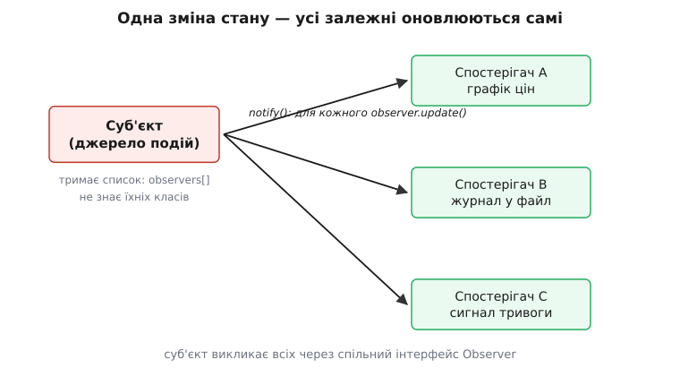
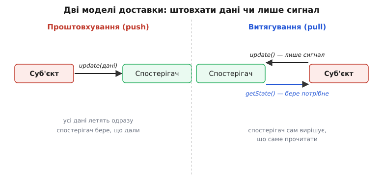

# Спостерігач

<preknowlist>
- [Інтерфейс проти реалізації](root:sf-apps/interface-vs-implementation) — різниця між тим, ЩО тип обіцяє назовні, і тим, ЯК він це робить; суб'єкт знатиме про спостерігачів лише їхній інтерфейс, а не класи.
- [Поліморфізм і динамічне зв'язування](root:sf-lang/polymorphism) — виклик через абстрактний тип, що в рантаймі йде в потрібну реалізацію; суб'єкт кличе один метод `update()`, а виконується код кожного конкретного спостерігача.
- [Зв'язність і зчеплення](root:sf-apps/coupling-cohesion) — чому слабке зчеплення між частинами робить систему гнучкою; уся мета спостерігача — розчепити того, хто змінюється, і тих, кого це обходить.
- [Принцип відкритості-закритості](root:sf-apps/open-closed) — код відкритий для розширення, закритий для правок; новий спостерігач має додаватися збоку, не чіпаючи суб'єкт.
</preknowlist>

Уяви клітинку в електронній таблиці з формулою `=A1+B1`. Ти міняєш `A1` — і сума миттєво перераховується, хоча ти пальцем її не чіпав. Тепер спитай себе: звідки клітинка з сумою *дізналася*, що `A1` змінилася? Є два способи це влаштувати, і різниця між ними — це, по суті, вся суть цієї статті.

Спосіб перший, наївний: клітинка-сума раз на мілісекунду сама заглядає в `A1` — «ну що, змінилося? а тепер? а тепер?». Це називається **опитування (англ. *polling*)**, і воно жахливе. Більшість разів відповідь «ні, нічого не змінилося», тобто ти палиш процесор на порожні перевірки. А ще ти мусиш вирішити, *як часто* заглядати: рідко — сума відстає від правди; часто — марнуєш ресурси. І хто взагалі має організувати це опитування — таблиця? кожна клітинка окремо? Кошмар росте з кожним питанням.

Спосіб другий, правильний: перевернути напрям. Хай не сума ганяється за `A1`, а **`A1` сама повідомляє всіх, кого це стосується**, у ту саму мить, коли змінюється. `A1` тримає список «хто на мене підписаний» — і при зміні проходить по ньому й кожному каже «я оновилася, перерахуйся». Ніяких порожніх перевірок: сигнал іде рівно тоді, коли є про що сигналити, і рівно тим, кому це потрібно.

Оцей другий спосіб і є **спостерігач (англ. *Observer*)** — один з поведінкових патернів «банди чотирьох». Його однорядкове означення звучить сухо: *«визначає залежність один-до-багатьох між об'єктами так, що коли один об'єкт змінює стан, усі залежні від нього сповіщаються й оновлюються автоматично»*. Але за цією фразою — саме та перевернутість напряму, яку ми щойно намацали на таблиці. Розберімо, з чого вона складається й де ховаються її пастки.

## Два учасники і чому вони не знають один одного

У патерні дві ролі. **Суб'єкт (англ. *Subject*)** — той, чий стан змінюється й на кого варто зважати (наша клітинка `A1`, «джерело подій»). **Спостерігач (англ. *Observer*)** — той, кого зміни суб'єкта обходять і хто хоче реагувати (клітинка-сума, графік, лог).

Ключ до всього — **у який бік дивиться знання**. Суб'єкт тримає список спостерігачів, тож він знає, що вони існують. Але — і це головне — він знає їх **лише як спільний інтерфейс**, а не як конкретні класи. Для суб'єкта всі підписники однакові: у кожного є метод `update()`, який можна викликати, і більше суб'єктові знати нічого не треба. Він не в курсі, що спостерігач A малює графік, спостерігач B пише у файл, а спостерігач C б'є на сполох. Він просто проходить списком і кожному каже `update()`.



*Одна зміна стану суб'єкта розходиться по всіх залежних сама. Суб'єкт тримає лише список інтерфейсів Observer — він не знає, що конкретно робить кожен підписник.*

Чому це так важливо, що суб'єкт не знає типів? Бо саме це дає йому **свободу від тих, хто на нього дивиться**. Додай завтра четвертого спостерігача — суб'єкт не зміниться ні на рядок: він і далі проходить списком і кличе `update()`, а що в списку тепер на один елемент більше, йому байдуже. Це прямий вияв [принципу відкритості-закритості](root:sf-apps/open-closed): нова реакція на подію додається **новим класом збоку**, а не правкою джерела події.

> 🔧 **Навіщо це.** Уяви модуль, що завантажує файл, і три речі, які мають статися по завершенні: сховати спінер, показати сповіщення, оновити лічильник у профілі. Найгірше — вшити всі три прямо в завантажувач: тепер модуль звантаження *знає* про спінер, про сповіщення й про профіль, і будь-яка нова реакція («ще запиши в аналітику») лізе в його код. Зі спостерігачем завантажувач лише кричить «готово!» у порожнечу, а хто на це підписаний — його не обходить. Модуль, що робить одну справу, лишається при одній справі — це те саме [слабке зчеплення](root:sf-apps/coupling-cohesion), тільки в дії.

## Найменший робочий кістяк

Зберемо патерн у найпростішому вигляді. Суб'єктові потрібні три вміння: **підписати** спостерігача, **відписати** його й **сповістити** всіх. Спостерігачеві — одне: метод, який суб'єкт викличе, коли настане подія.

:::tabs
```ts
interface Observer {
  update(subject: WeatherStation): void;   // суб'єкт викличе це при зміні
}

class WeatherStation {                      // СУБ'ЄКТ
  private observers = new Set<Observer>();  // список підписників
  private _temp = 0;

  subscribe(o: Observer)   { this.observers.add(o); }
  unsubscribe(o: Observer) { this.observers.delete(o); }

  private notify() {                        // серце патерна
    for (const o of this.observers) o.update(this);
  }

  setTemp(t: number) {                      // ось тут стан змінюється
    this._temp = t;
    this.notify();                          // ...і одразу летить сигнал
  }
  get temp() { return this._temp; }
}

class Display implements Observer {         // конкретний СПОСТЕРІГАЧ
  update(station: WeatherStation) {
    console.log(`Табло: ${station.temp}°C`);
  }
}
```
```py
from typing import Protocol

class Observer(Protocol):
    def update(self, subject: "WeatherStation") -> None: ...

class WeatherStation:                        # СУБ'ЄКТ
    def __init__(self) -> None:
        self._observers: set[Observer] = set()   # список підписників
        self._temp = 0.0

    def subscribe(self, o: Observer) -> None:   self._observers.add(o)
    def unsubscribe(self, o: Observer) -> None: self._observers.discard(o)

    def _notify(self) -> None:                # серце патерна
        for o in self._observers:
            o.update(self)

    def set_temp(self, t: float) -> None:     # ось тут стан змінюється
        self._temp = t
        self._notify()                        # ...і одразу летить сигнал

    @property
    def temp(self) -> float:
        return self._temp

class Display:                                # конкретний СПОСТЕРІГАЧ
    def update(self, station: "WeatherStation") -> None:
        print(f"Табло: {station.temp}°C")
```
:::

Тепер сам сценарій вживання. Створюємо станцію, чіпляємо до неї табло — і з цієї миті кожна зміна температури сама тече на табло, а станція про табло нічого не «знає» понад те, що це якийсь `Observer`:

:::tabs
```ts
const station = new WeatherStation();
const display = new Display();

station.subscribe(display);   // табло підписалося
station.setTemp(21);          // → "Табло: 21°C"
station.setTemp(23);          // → "Табло: 23°C"

station.unsubscribe(display); // табло відписалося
station.setTemp(25);          // тиша — більше нікого не сповіщає
```
```py
station = WeatherStation()
display = Display()

station.subscribe(display)    # табло підписалося
station.set_temp(21)          # → "Табло: 21°C"
station.set_temp(23)          # → "Табло: 23°C"

station.unsubscribe(display)  # табло відписалося
station.set_temp(25)          # тиша — більше нікого не сповіщає
```
:::

Уся конструкція тримається на одному: `notify()` кличе `o.update(this)` **через інтерфейс**, тож у рантаймі виконується код того класу, що реально стоїть за `o` — це звичайне [динамічне зв'язування](root:sf-lang/polymorphism). Станція компілювалася, коли `Display` міг ще й не існувати, і однаково працюватиме з ним.

## Що передавати спостерігачеві: штовхати чи давати витягти

Помітив у коді вище дрібницю з великими наслідками? Метод `update(this)` передає спостерігачеві **сам суб'єкт**, а не готове число. Спостерігач далі сам питає `station.temp`. Це не випадковість — це вибір між двома моделями доставки, і кожна має свою ціну.

**Проштовхування (англ. *push*):** суб'єкт кладе змінені дані просто в аргументи виклику — `o.update(23.0)`. Спостерігач одразу має все, нічого допитувати не треба. Зручно, поки всіх підписників цікавить те саме й воно невелике. Але щойно даних багато або різним спостерігачам потрібні різні шматки — суб'єкт мусить пхати всім усе, і сигнатура `update()` роздувається під найпримхливішого підписника.

**Витягування (англ. *pull*):** суб'єкт штовхає лише *сигнал* «щось змінилося» плюс посилання на себе, а спостерігач **сам витягує** рівно те, що йому треба — хтось прочитає температуру, хтось іще й вологість, хтось нічого й просто перемалюється. Суб'єкт тоді не мусить угадувати, кому що цікаво.



*Push кладе дані в сам виклик — просто, поки даних мало й вони всім потрібні. Pull штовхає тільки сигнал, а спостерігач витягує потрібне сам — гнучкіше, коли стан суб'єкта великий чи різним підписникам треба різне.*

Практичне правило просте. Мало даних, і всім потрібне одне — **push**, він коротший. Стан суб'єкта великий або підписники різнорідні — **pull**, він не змушує суб'єкт знати смаки кожного. Часто беруть середину: штовхають малий «конверт події» (що саме сталося), а по важкі деталі спостерігач іде сам.

## Три пастки, через які патерн кусає

Спостерігач оманливо простий, і саме тому в реальному коді на ньому підриваються. Три граблі трапляються найчастіше — і всі три не видно на іграшковому прикладі.

**Витік пам'яті через «застряглого» підписника.** Це найвідоміша біда, у неї навіть є ім'я — [проблема застряглого слухача (англ. *lapsed listener*)](root:sf-apps/observer/hist-observer-origins.md). Суть така: суб'єкт тримає спостерігачів у своєму списку, тобто **сильно на них посилається**. Спостерігач тобі вже не потрібен, ти всюди його викинув — але забув **відписати** від суб'єкта. І поки суб'єкт живий, він тримає посилання на цей мертвий, по суті, об'єкт, а збирач сміття не може прибрати того, на кого хтось посилається. Об'єкт висить у пам'яті скільки завгодно довго — та ще й далі отримує `update()` і марно щось робить. Правило звідси залізне: **хто підписався, той відповідає за відписку**; у мовах з ручним чи напівручним керуванням життям об'єктів під це роблять окрему дисципліну (парні subscribe/unsubscribe, зняття підписки при знищенні, слабкі посилання).

**Лавина оновлень.** Один спостерігач у своєму `update()` міняє інший суб'єкт, той сповіщає своїх підписників, а серед них — знову хтось, хто зачіпає перший. Одна зовні невинна зміна породжує каскад сповіщень, який іноді ще й **зациклюється**: A будить B, B будить A. Ти дивишся на код і не бачиш циклу — його немає в жодному місці, він виникає *між* об'єктами під час виконання. Це зворотний бік розчеплення: суб'єкт не знає, кого сповіщає, тож не знає й **у що це виллється**. Тому в системах з багатьма взаємними підписками ставлять запобіжники: прапорець «я вже сповіщаю, повторно не входь», або збір змін у пачку й одне сповіщення в кінці.

**Порядок і винятки.** Спостерігачі в списку — множина або масив, і **порядок їх виклику нічого не гарантує**. Якщо твоя логіка мовчки припускає, що табло оновиться раніше за лог, — вона крихка: зміниться порядок підписки, і все попливе. Гірше з винятками: якщо один `update()` кине помилку посеред обходу списку, решта підписників її **не отримає** — сповіщення обірветься на півдорозі. Тому в надійному `notify()` кожен виклик спостерігача часто загортають так, щоб чужа помилка не зривала розсилку всім іншим.

> 🔧 **Навіщо це.** Ці три пастки — не теорія, вони і є причина, чому мова чи фреймворк дають готовий механізм подій замість «напиши спостерігача сам». Браузерний `addEventListener` веде список слухачів за тебе, але й лишає тобі `removeEventListener` — бо застряглий слухач на DOM-вузлі, який давно прибрали, це класичний витік у довгих односторінкових застосунках. Знаючи механізм зсередини, ти розумієш, *чому* ці парні виклики існують, і не дивуєшся, коли профайлер показує пам'ять, що тихо росте.

## Де він уже вбудований і як його не плутати

Спостерігач — мабуть, найпоширеніший з усіх патернів GoF, бо він розчинений у самих інструментах. Кнопка в інтерфейсі, що кличе твій обробник кліку; підписка на подію в мові (`event`/`delegate`, `EventEmitter`, сигнали); реактивні потоки, де ти описуєш, *що робити* з майбутніми значеннями, а доставку бере на себе бібліотека, — усе це спостерігач тим чи іншим одягом. Тому головна практична навичка тут — **упізнавати** його в чужому коді, а не щоразу писати список підписників руками: у 90% випадків рідна подієва машина мови вже все зробила, тільки з кращим керуванням життям об'єктів.

Одну межу варто провести чітко, бо її постійно розмивають — між спостерігачем і **видавцем-передплатником (англ. *publish-subscribe*, *pub/sub*)**. У спостерігачі суб'єкт **сам тримає список** своїх підписників і **сам** їх кличе — вони прямо знайомі через його ж методи `subscribe`. У pub/sub між ними стоїть **посередник — шина подій**: видавець кидає повідомлення в шину й **гадки не має**, хто його забере, а передплатники слухають шину, не знаючи, хто видавець. Спостерігач — це прямий, внутрішньопроцесний зв'язок «один об'єкт → його підписники»; pub/sub — розв'язаний через брокера, часто через мережу й між процесами. Плутати їх — значить брати важку інфраструктуру шини там, де вистачило б простого списку, або навпаки.

Не сплутай спостерігача і з [посередником (англ. *Mediator*)](root:sf-apps/mediator): посередник теж розчіплює об'єкти, але його мета — звести **багато-до-багатьох** зв'язків у зірку через один центр координації, тоді як спостерігач — це саме потік сповіщень **один-до-багатьох** в одну сторону. Робочий приклад з повним кодом — списком підписників, надійним `notify()` із запобіжниками від лавини й винятків та розбором push проти pull на живій задачі — винесено в [окремий проєкт](root:sf-apps/observer/proj-observer-eventbus.md).

## Коли спостерігач зайвий

Патерн, що всюди пасує, легко тулять і туди, де він шкодить. Якщо залежність між двома об'єктами **пряма, стала й одна** — А завжди й лише повідомляє Б, іншого підписника не буде, — то список спостерігачів це надмір: простіше, щоб А просто викликало метод Б. Ти нічого не виграв на гнучкості, а натомість заплатив розчепленням, через яке тепер важче простежити, *хто кого* врешті зачіпає: у налагоджувачі видно виклик `notify()`, а куди він піде — треба ще з'ясувати, бо в коді суб'єкта відповіді немає.

Оце і є справжня ціна спостерігача, і сказати про неї чесно важливіше за похвали. Розчеплюючи суб'єкт від підписників, ти водночас **розчіплюєш причину від наслідку в тексті програми**: місце, де стан змінився, і місце, де на це зреагували, більше не стоять поруч і не поєднані видимим викликом. За це платять ясністю потоку керування. Тому бери спостерігача там, де підписників **справді багато або їх число заздалегідь невідоме**, а джерело не має про них знати — тоді розчеплення окупає туману; і не бери, коли зв'язок один і прямий — там простий виклик чесніший.

## Звідки він узявся

Спостерігач — не кабінетний винахід 1994 року, а узагальнення того, що вже десятиліттям працювало в графічних інтерфейсах. Його прабатько — архітектура **модель-вид-контролер (англ. *Model-View-Controller*, MVC)**, яку сформулював норвезький інженер **Трюгве Реенскауг (Trygve Reenskaug, 1930–2024)** 1979 року під час візиту в дослідницький центр Xerox PARC, працюючи над Smalltalk-80. Там вид мусив показувати модель і оновлюватися щоразу, коли модель змінюється, — але модель при цьому не мала знати про жоден конкретний вид. Розв'язок і був спостерігачем: модель тримає механізм сповіщення, а види до неї підписуються. Як ця ідея дозріла до однорядкового патерна GoF і як із неї потім виросло ціле реактивне програмування (від Rx Еріка Меєра в Microsoft, 2009, до сьогоднішніх сигналів у фреймворках) — розгорнуто в [нотатці про народження патерна](root:sf-apps/observer/hist-observer-origins.md).
