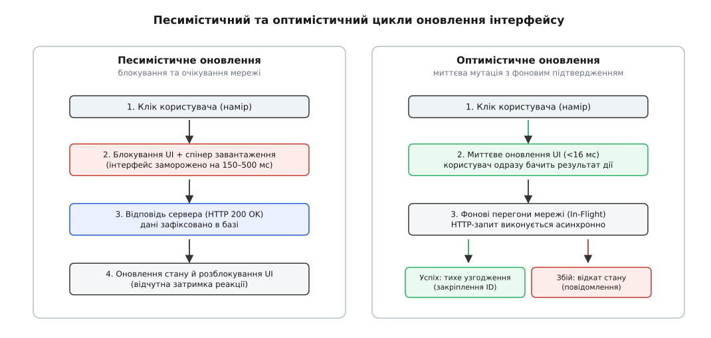
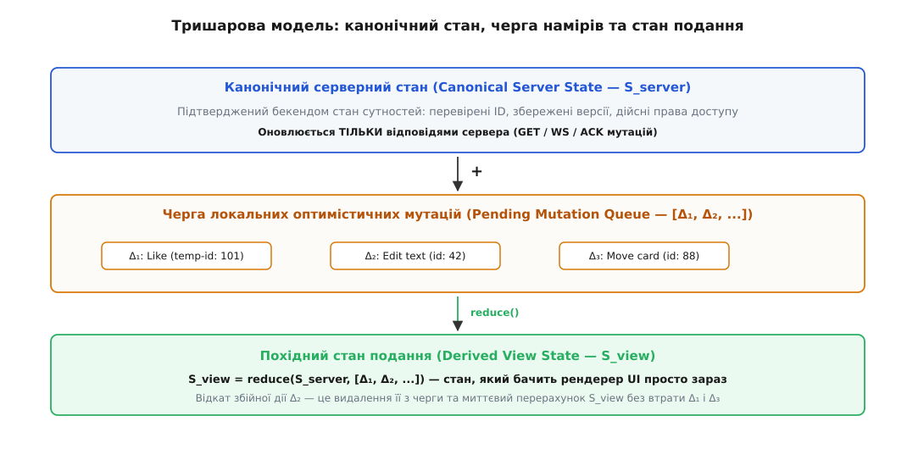
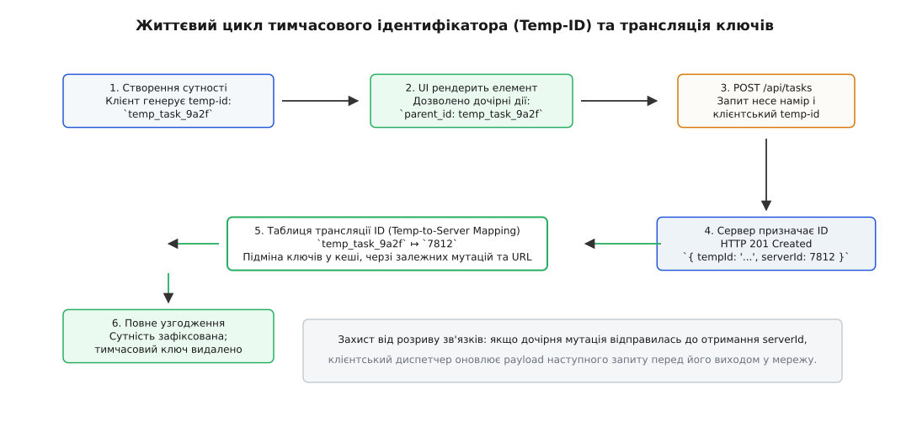
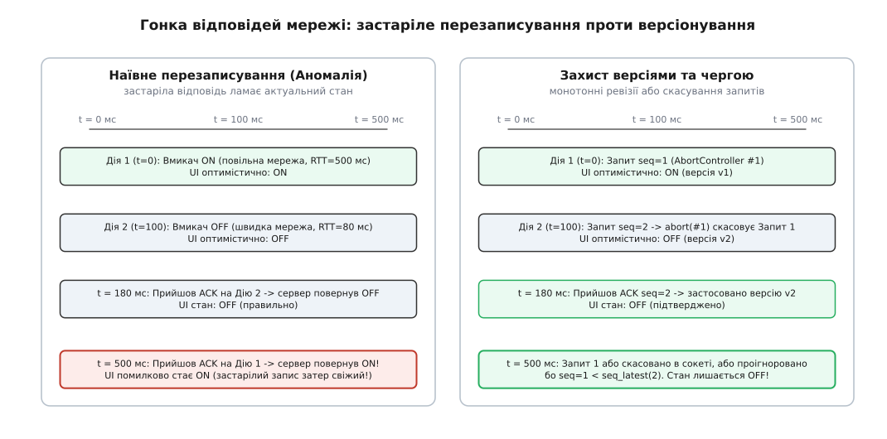
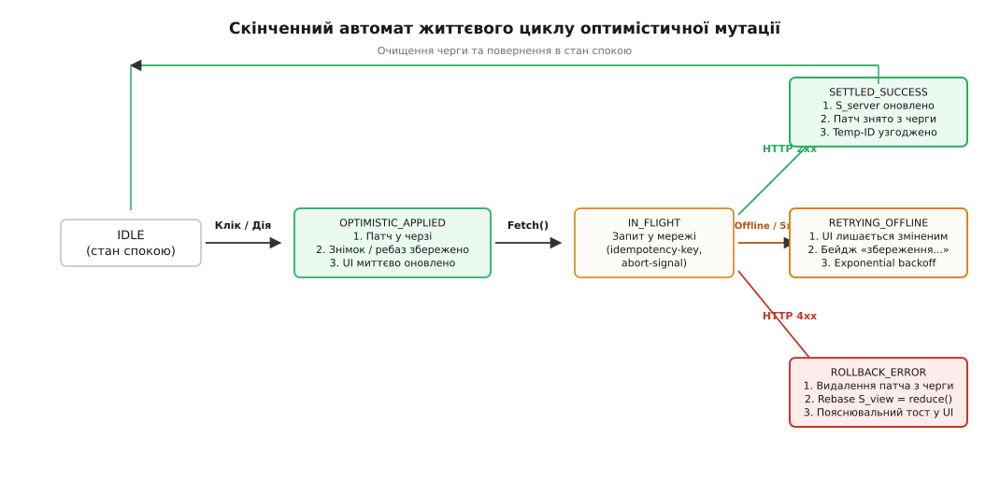

# Оптимістичне оновлення інтерфейсу й відкат невдалої зміни

<preknowlist>
- [Асинхронність і цикл подій](topic:sf-tasks/event-loop) — як неблоківні виклики повертають керування й виконуються в наступних тактах.
- [Односпрямований потік даних](topic:sf-apps/unidirectional-data-flow) — події породжують наміри, стан змінюється в одній точці, подання відображає результат.
- [Ідемпотентність API](topic:com-protocol/api-idempotency) — повторне надсилання того самого запиту дає той самий результат без дублювання ефектів.
- [Незмінність стану](topic:sf-apps/immutability) — заміна значення новим об'єктом замість мутації на місці для безпечного порівняння й відкату.
- [Узгодженість у кінцевому підсумку](topic:sf-distributed/eventual-consistency) — модель, де локальний стан тимчасово розходиться з сервером і сходиться пізніше.
</preknowlist>

Людина за екраном очікує, що перемикач клацне в ту саму мить, коли палець торкнувся скла, а викреслений рядок у списку завдань згасне негайно. Фізіологія людського зору та моторної реакції встановлює жорсткий поріг: затримка до 100 мілісекунд сприймається як миттєва дія самої системи. Якщо інтерфейс реагує довше ніж 300 мілісекунд, виникає відчуття застрягання, а затримка понад 1000 мілісекунд повністю руйнує неперервний потік думок користувача.

Тим часом пакет у мобільній мережі 4G або Wi-Fi з перевантаженою точкою доступу долає шлях до сервера й назад за 150–600 мілісекунд. Якщо додати до цього час обробки запиту базою даних, кожен клік на іконку серця, перетягування картки в канбан-дошці або введення символу в текстове поле змушує клієнтський застосунок завмирати в очікуванні відповіді бекенда. Традиційний інтерфейс у цей час показує анімований спінер або блокує форму, перетворюючи кожну буденну операцію на випробування терпіння.

## Пастка песимістичного очікування

Звичайний підхід до взаємодії з віддаленим сервером спирається на сувору послідовність кроків. Його називають **песимістичним оновленням** (англ. *pessimistic update*), оскільки система за замовчуванням припускає, що операція може завершитися збоєм, і відмовляється змінювати екран доти, доки віддалений сервер явно не підтвердить запис у базу даних.

Ланцюжок подій у песимістичній моделі виглядає так:

```
Подія кліку
  → Блокування кнопки / показ спінера
  → Формування HTTP POST / PUT
  → Проходження пакета крізь мережу (RTT)
  → Транзакція в базі даних на сервері
  → HTTP 200 OK із тілом відповіді
  → Оновлення локального сховища
  → Рендеринг нового стану / зняття блокування
```

За цієї схеми користувач змушений постійно платити власним часом за фізичну відстань до сервера. Якщо людина швидко ставить п'ять позначок у списку покупок, інтерфейс смикається, блокує чекбокси один за одним, а порядок їхнього згасання залежить від випадкових коливань мережевого трафіку.


*Песимістичний цикл блокує взаємодію на час мережевого запиту, тоді як оптимістичний оновлює екран миттєво й підтверджує зміну у фоновому режимі.*

Альтернативою є **оптимістичне оновлення інтерфейсу** (англ. *optimistic UI update*). Воно змінює порядок операцій на протилежний: клієнтський застосунок припускає, що в переважній більшості випадків (зазвичай понад 99%) запит на сервері виконається успішно. Тому екран оновлюється негайно — у межах одного кадру анімації (до 16 мілісекунд), а мережевий запит вирушає на бекенд у фоні як підтвердження наміру.

[Сама ідея виконання дій до авторитетної перевірки виникла задовго до появи сучасного вебу в теорії розподілених баз даних та платформах спільної роботи](topic:sf-apps/optimistic-ui-update/hist-optimistic-ui.md): якщо конфлікти трапляються рідко, постійне блокування на кожному кроці коштує значно дорожче за періодичний відкат помилок.

Проте за миттєву плавність доводиться платити архітектурною складністю. Щойно застосунок показує стан, якого на сервері ще фізично не існує, він входить у зону ризику: сервер може відхилити запит через порушення бізнес-правил, мережа може обірватися, а паралельні запити від того самого користувача можуть перегнати один одного й повернутися в хаотичному порядку.

## Тришарова модель стану: де живе правда до підтвердження

Головна помилка наївних реалізацій оптимістичного інтерфейсу полягає у прямій мутації єдиного глобального об'єкта стану. Якщо після кліку на кнопку «Поставити лайк» код просто записує `post.likesCount += 1` у локальне сховище, програма втрачає здатність розрізняти, які дані вже зафіксовані в базі даних, а які є лише тимчасовою локальною гіпотезою.

Якщо наступний фоновий запит завершиться помилкою, програма не зможе відновити істинний стан без повного перезавантаження сторінки або повторного важкого HTTP-запиту `GET`. Ба більше: якщо в цей самий момент з вебсокета надійде оновлення від іншого користувача, пряма мутація або зітре чужі правки, або змішає їх із непідтвердженими локальними змінами.

Щоб оптимістичне оновлення було керованим, клієнтський стан поділяють на три окремі шари:

1. **Канонічний серверний стан (`S_server`):** точна копія даних, гарантована й підтверджена сервером. Вона оновлюється *виключно* тоді, коли від бекенда приходить підтверджена HTTP-відповідь або подія через WebSocket.
2. **Черга очікуючих мутацій (`[Δ₁, Δ₂, ..., Δₙ]`):** впорядкований список локальних дій-намірів, які вже виконані на клієнті, але ще перебувають у стані польоту (*in-flight*) мережею або чекають відправлення.
3. **Похідний стан відображення (`S_view`):** значення, яке бачить рендерер інтерфейсу в поточну мілісекунду. Воно не зберігається як незалежне джерело правди, а **обчислюється як чиста згортка** (англ. *reduction*) черги мутацій поверх канонічного стану сервера:

```
S_view = reduce(S_server, [Δ₁, Δ₂, ..., Δₙ])
```


*Стан подання є результатом накладання черги незавершених мутацій на підтверджений стан сервера. Відкат однієї збійної дії полягає у її вилученні з черги та миттєвому перерахунку стану подання.*

Коли користувач натискає кнопку:
1. Генерується дельта `Δ_new` (наприклад, `{ type: 'INCREMENT_LIKE', postId: 42 }`).
2. `Δ_new` додається в кінець черги очікуючих мутацій.
3. Функція згортки миттєво обчислює новий `S_view`, і компонент перемальовується.
4. Мережевий транспорт надсилає запит на сервер.

Коли сервер повертає успішну відповідь `HTTP 200 OK`:
1. Канонічний стан `S_server` оновлюється підтвердженими даними.
2. Відповідна мутація `Δ` видаляється з черги очікування.
3. Стан відображення `S_view` перераховується наново. Оскільки зміна вже перейшла з черги `Δ` у базу `S_server`, візуально для користувача на екрані нічого не змінюється — перехід відбувається абсолютно безшовно.

Якщо ж запит зазнає краху, дельта `Δ` просто викидається з черги. Наступне обчислення `S_view = reduce(S_server, [...])` автоматично повертає інтерфейс до правильного вигляду без жодних залишкових артефактів.

### Обробка зовнішніх серверних оновлень (WebSocket / Server-Sent Events)

Критична перевага тришарової архітектури розкривається тоді, коли під час перебування локальної мутації в мережі застосунок отримує стороннє серверне оновлення через WebSocket (наприклад, інший користувач змінив опис того самого завдання).

У наївній змінюваній моделі серверне оновлення або затре локальну правку, яка ще чекає відповіді, або буде відкинуте клієнтом. У тришаровій моделі поведінка природна й детермінована:

1. Вхідне повідомлення WebSocket оновлює канонічний стан `S_server`.
2. Черга локальних незавершених мутацій `[Δ₁, Δ₂]` залишається недоторканою.
3. Функція `getViewState()` негайно перераховує `S_view = reduce(S_server_new, [Δ₁, Δ₂])`.

Інтерфейс відображає свіжі серверні дані від інших користувачів і одночасно зберігає всі локальні оптимістичні правки поточного користувача поверх них.

## Три стратегії відкату: знімок, компенсація та перебазування

Коли сервер відхиляє намір користувача, застосунок зобов'язаний повернути інтерфейс до узгодженого стану. Залежно від складності моделі даних і кількості одночасних дій у клієнтській архітектурі застосовують три різні механізми відкату.

### 1. Відкат за знімком (Snapshot Rollback)

Найпростіший підхід полягає в тому, що безпосередньо перед застосуванням оптимістичної зміни застосунок робить копію поточного стану або того піддерева даних, яке зазнає змін. Цей знімок зберігається в контексті виконуваної мутації:

```ts
// Псевдокод знімка мутації
const previousState = clone(store.getState().todos);

try {
  store.setState(applyOptimisticUpdate(previousState, action));
  await api.saveTodo(action.payload);
} catch (error) {
  // Відкат: тупе відновлення знімка
  store.setState(previousState);
  showToast("Не вдалося зберегти завдання");
}
```

Цей спосіб надійний і простий, доки користувач виконує дії суворо по одній з великими паузами. Проте він катастрофічно ламається за наявності кількох паралельних дій.

Уявімо послідовність:
1. Користувач вмикає чекбокс на завданні A. Створюється знімок `Snap_0`, інтерфейс показує A виконаним. Запит A іде в мережу.
2. Через 50 мілісекунд користувач вмикає чекбокс на завданні B. Створюється знімок `Snap_1` (де A вже виконано), інтерфейс показує A і B виконаними. Запит B іде в мережу.
3. Запит A повертає помилку `HTTP 403 Forbidden`.
4. Обробник помилки мутації A сліпо відновлює збережений знімок `Snap_0`.

У результаті стан інтерфейсу відкочується до точки `Snap_0`, де завдання B було *невиконаним*. Оптимістична зміна B безслідно зникає з екрана, хоча її мережевий запит ще летить до сервера й незабаром успішно виконається. Виникає так звана **аномалія втраченого оновлення** (англ. *lost update anomaly*).

### 2. Компенсаційні дії та зворотні дельти (Inverse Actions / Compensation Patches)

Замість збереження важких знімків усього стану кожна дія може породжувати строго визначену математично зворотну дію. Якщо пряма дія описується як `+1`, то зворотна дія є `-1`. Якщо пряма дія додала елемент у масив, зворотна дія видаляє його за індексом або ідентифікатором.

У вебстандартах такий підхід формалізується за допомогою специфікації JSON Patch (RFC 6902):

```json
// Пряма операція (намір)
[
  { "op": "replace", "path": "/todos/42/completed", "value": true }
]

// Автоматично згенерована зворотна компенсаційна дія
[
  { "op": "replace", "path": "/todos/42/completed", "value": false }
]
```

Компенсаційні дії ощадливо використовують пам'ять, оскільки зберігають лише дельту зміни, а не весь об'єкт. Проте вони вимагають, щоб операції над станом були **комутативними** (порядок їх застосування не повинен впливати на результат) або щоб кожна зворотна дія точно знала контекст, у якому її застосовують.

Якщо дія полягала у вставці елемента за позицією 3, а наступна дія вставила елемент за позицією 1, наївне застосування зворотної дії «видалити елемент за позицією 3» видалить зовсім інший об'єкт через зсув індексів у списку.

### 3. Перебазування журналу намірів (Log Rebase and Replay)

Найбільш математично бездоганним і стійким до паралелізму способом є **перебазування** (англ. *rebase*), аналогічне до однойменної операції в розподілених системах контролю версій.

Коли мутація `Δ_k` зазнає збою:
1. Диспетчер вилучає `Δ_k` з черги очікуючих мутацій. У черзі залишаються тільки живі мутації `[Δ₁, ..., Δ_{k-1}, Δ_{k+1}, ..., Δₙ]`.
2. Диспетчер бере актуальний канонічний стан сервера `S_server`.
3. Диспетчер заново послідовно застосовує всі мутації, що залишилися в черзі, до `S_server`.

```
Початковий стан:
S_server = { A: off, B: off }
Черга: [ Δ₁(A: on), Δ₂(B: on) ]
S_view = { A: on, B: on }

Збій запиту Δ₁:
Видаляємо Δ₁ із черги.
Черга: [ Δ₂(B: on) ]
Новий S_view = reduce(S_server, [ Δ₂(B: on) ])
Підсумок: S_view = { A: off, B: on }
```

Зміна B залишається на екрані цілою й неушкодженою. Інтерфейс плавно прибирає тільки ту зміну, яка справді зазнала збою. Завдяки використанню незмінних структур даних (структурного спільного використання пам'яті) повний перерахунок згортки з десятка мутацій займає менше ніж 0.1 мілісекунди процесорного часу.

## Тимчасові ідентифікатори (Temp-ID) та узгодження сутностей

Оптимістичне оновлення властивостей уже існуючих об'єктів (лайк, редагування заголовка, зміна прапорця) є відносно простим, оскільки в об'єкта вже є постійний первинний ключ, відомий і клієнту, і серверу (наприклад, `id: 4091`).

Справжня інженерна головоломка виникає тоді, коли користувач **створює нову сутність** — публікує коментар, створює картку в списку або додає новий документ.

Щоб показати новий коментар у DOM-дереві негайно, йому потрібен унікальний ідентифікатор просто зараз. Без ID неможливо призначити ключ рендерингу (наприклад, `key` у віртуальному DOM), неможливо підсвітити елемент, виділити його, а головне — неможливо дозволити користувачеві взаємодіяти з ним далі (наприклад, одразу видалити щойно створений коментар або прикріпити до нього файл до того, як сервер поверне відповідь).


*Трансляція ідентифікаторів замінює клієнтський тимчасовий ключ канонічним серверним ID у кеші та в черзі очікуючих мутацій.*

Для вирішення цієї проблеми застосовують протокол **тимчасових ідентифікаторів** (англ. *temporary ID / temp-id*).

### Протокол трансляції Temp-ID

Процес створення сутності з тимчасовим ID розгортається у шість послідовних кроків:

1. **Генерація клієнтського ключа:** Клієнт створює тимчасовий ідентифікатор з унікальним префіксом або форматом:
   ```ts
   const tempId = `temp_${Date.now()}_${Math.random().toString(36).slice(2, 9)}`;
   // Наприклад: "temp_1719248100_a8f9b2c"
   ```
2. **Миттєве монтування в UI:** Сутність із цим `tempId` додається в локальне сховище. Рендерер відображає картку в загальному списку. Поруч із нею може відображатися напівпрозорий індикатор «збереження...».
3. **Зв'язування залежних дій:** Якщо користувач негайно створює підзавдання для цієї картки, підзавдання формується з посиланням на тимчасовий батьківський ID:
   ```json
   {
     "type": "CREATE_SUBTASK",
     "parentId": "temp_1719248100_a8f9b2c",
     "title": "Купити хліб"
   }
   ```
4. **Відправка HTTP-запиту:** Клієнт надсилає запит на створення, передаючи `tempId` у спеціальному заголовку або в тілі запиту:
   ```http
   POST /api/tasks HTTP/1.1
   Content-Type: application/json
   X-Client-Temp-ID: temp_1719248100_a8f9b2c

   { "title": "Нове завдання" }
   ```
5. **Серверна відповідь:** Бекенд створює запис у базі даних, генерує постійний автоінкрементний або канонічний ID (наприклад, `84102`) і повертає мапінг у відповіді:
   ```json
   HTTP/1.1 201 Created
   Content-Type: application/json

   {
     "tempId": "temp_1719248100_a8f9b2c",
     "serverId": "84102",
     "title": "Нове завдання",
     "createdAt": "2026-08-20T19:22:00Z"
   }
   ```
6. **Узгодження в карті ідентичностей (Identity Map Reconciliation):**
   Клієнтський диспетчер записує відповідність `temp_1719248100_a8f9b2c ↦ 84102` у глобальну таблицю трансляції (*Identity Map*). Після цього диспетчер виконує три операції:
   - Підміняє ключ об'єкта в локальному кеші сутностей з `temp-id` на `serverId`.
   - Проходить по всій черзі очікуючих мутацій і замінює всі входження старого `tempId` (наприклад, у полі `parentId` підзавдання) на справжній `84102` *до того*, як наступний запит вирушить у мережу.
   - Оновлює URL у адресному рядку браузера (якщо відкрита сторінка новоствореного документа) через `history.replaceState` без перезавантаження сторінки.

### Альтернатива: клієнтські UUID як канонічні ключі

Найчистішим архітектурним рішенням, яке повністю позбавляє від необхідності складної трансляції `temp-id ↦ server-id`, є відмова від серверної генерації автоінкрементних цілочисельних ключів на користь клієнтських [UUID версії 4 або 7](topic:sf-data/uuid-and-guid).

Якщо первинним ключем сутності є 128-бітний UUID або сортований за часом ULID, клієнт генерує повноцінний фінальний ідентифікатор у момент створення об'єкта:

```ts
const id = crypto.randomUUID(); // "f81d4fae-7dec-11d0-a765-00a0c91e6bf6"
```

Оскільки ймовірність колізії двох випадкових UUID v4 становить мізерні частки відсотка у масштабах усього людства, цей ID є одночасно і локальним ключем для миттєвого рендерингу, і постійним первинним ключем у базі даних сервера. Сервер просто приймає наданий клієнтом UUID і записує його в таблицю. Таблиця трансляції стає непотрібною.

## Аномалії часу: гонки відповідей та неупорядковані запити

Коли користувач швидко взаємодіє з одним і тим самим елементом (наприклад, кілька разів поспіль вмикає та вимикає прапорець «Зробити профіль публічним»), мережа перетворюється на джерело гонок (*race conditions*).

Мережа Інтернет не гарантує порядок доставки пакетів: перший надісланий HTTP-запит може піти довшим маршрутом або затриматися на маршрутизаторі, тоді як другий запит дійде за 50 мілісекунд.


*Застаріла відповідь на перший запит надходить пізніше за відповідь на другий і ламає стан, якщо система не контролює версії або не скасовує старі сокети.*

Розглянемо хрестоматійну катастрофу неупорядкованого виконання:

1. **t = 0 мс:** Користувач вмикає прапорець.
   - Оптимістичний UI: `active = true`.
   - Запит 1 (`POST /toggle { active: true }`) іде в мережу. Через затримку радіоканалу його RTT становить 600 мс.
2. **t = 100 мс:** Користувач передумав і вимикає прапорець.
   - Оптимістичний UI: `active = false`.
   - Запит 2 (`POST /toggle { active: false }`) іде в мережу. Його RTT становить лише 80 мс.
3. **t = 180 мс:** Сервер повертає успіх на Запит 2 (`{ active: false }`).
   - Клієнт оновлює канонічний стан: `active = false`. UI відображає `active = false`. Все правильно.
4. **t = 600 мс:** Нарешті доходить запізніла відповідь на Запит 1 (`{ active: true }`).
   - Якщо клієнтський обробник просто записує відповідь у стан, він перезаписує стан значенням `active = true`.

На очах у користувача перемикач сам собою повертається у положення «Увімкнено» через пів секунди після того, як його вимкнули. Це грубий дефект інтерфейсу, породжений невірною моделлю узгодження.

### Механізми захисту від гонок відповідей

Для запобігання гонкам відповідей застосовують три обов'язкові інженерні бар'єри:

#### 1. Монотонні лічильники ревізій (Sequence Tokens)
Кожна мутація для конкретної сутності отримує локальний монотонно зростаючий номер версії (`seq = 1, 2, 3, ...`). Клієнт запам'ятовує останній застосований номер:

```ts
class EntityStateHolder {
  private latestSeq = 0;
  private value = false;

  public applyServerResponse(seq: number, serverValue: boolean) {
    // Якщо прийшла відповідь на старіший запит, ніж той, що ми вже врахували — відкидаємо
    if (seq < this.latestSeq) {
      console.warn(`Застаріла відповідь seq=${seq} проігнорована (поточна seq=${this.latestSeq})`);
      return;
    }
    this.latestSeq = seq;
    this.value = serverValue;
  }
}
```

#### 2. Примусове скасування сокетів через AbortController
Якщо користувач ініціює нову мутацію над сутністю, для якої в мережі вже перебуває попередній незавершений запит, попередній HTTP-запит повинен бути негайно анульований на рівні браузерного API:

```ts
let currentAbortController: AbortController | null = null;

async function updateStatus(newStatus: boolean) {
  // 1. Скасовуємо попередній запит у польоті
  if (currentAbortController) {
    currentAbortController.abort();
  }
  currentAbortController = new AbortController();

  // 2. Оптимістично оновлюємо UI
  setOptimisticStatus(newStatus);

  try {
    const response = await fetch('/api/status', {
      method: 'POST',
      body: JSON.stringify({ status: newStatus }),
      signal: currentAbortController.signal // прив'язка сигналу скасування
    });
    const data = await response.json();
    setCanonicalStatus(data.status);
  } catch (err: any) {
    if (err.name === 'AbortError') {
      // Запит було правомірно перервано новішою дією — нічого не відкочуємо!
      return;
    }
    // Справжній збій мережі — виконуємо відкат
    rollbackStatus();
  }
}
```

#### 3. Серіалізація черги запитів (Per-Entity FIFO Pipeline)
Для критичних операцій (наприклад, зміна прав доступу чи переміщення позицій списку) запити для однієї сутності шикуються у суворо послідовну чергу: наступний HTTP-запит не виходить у мережу доти, доки попередній не завершився або не був скасований.

## Класифікація помилок і поведінка інтерфейсу

Не всі помилки однакові. Найгірше, що може зробити застосунок у разі помилки — це повестися однаково при обриві Wi-Fi та при спробі відредагувати чужий захищений документ.

Помилки поділяються на три принципові категорії, кожна з яких диктує власну поведінку інтерфейсу:

| Категорія помилки | Приклади HTTP-кодів | Причина | Дія над станом | Поведінка інтерфейсу |
| :--- | :--- | :--- | :--- | :--- |
| **Тимчасовий збій мережі** | Network Timeout, Offline, `502 Bad Gateway`, `503 Service Unavailable`, `504 Gateway Timeout` | Обрив зв'язку, перевантаження шлюзу, перезавантаження сервера | **НЕ відкочувати.** Залишити дію в черзі pending / outbox | Показати ненав'язливий бейдж «Збереження офлайн...». Автоматичні повторні спроби (*exponential backoff*) з ключем ідемпотентності. |
| **Фатальна бізнес-помилка** | `400 Bad Request`, `401 Unauthorized`, `403 Forbidden`, `422 Unprocessable Entity` | Недостатньо прав, недійсний формат, порушення обмежень цілісності | **Негайний відкат** (Rebase Rollback) | Плавне повернення елемента на місце (анімація відкату), спливаюче сповіщення (*toast*) із поясненням причини. Збереження чернетки введеного тексту. |
| **Конфлікт версій** | `409 Conflict`, `412 Precondition Failed` (ETag / `If-Match` mismatch) | Інший користувач уже змінив цей документ паралельно | Застосування стратегії вирішення конфліктів | Оновлення свіжими даними сервера або діалог порівняння змін (3-way merge). |

### Оптимістичні блокування та умовні заголовки HTTP (ETag / If-Match)

Коли кілька клієнтів одночасно редагують один ресурс, класичним захистом від взаємного затирання є [оптимістичне блокування](topic:sf-data/transactions-acid).

Клієнт отримує документ разом із версією або хешем у заголовку `ETag`:

```http
HTTP/1.1 200 OK
ETag: "v3-9f8a12"
Content-Type: application/json

{ "id": "doc_42", "title": "План робіт", "version": 3 }
```

Коли користувач вносить правку, клієнт застосовує її локально й надсилає оновлення із заголовком `If-Match`:

```http
PUT /api/documents/doc_42 HTTP/1.1
If-Match: "v3-9f8a12"
Content-Type: application/json

{ "title": "Оновлений план робіт", "version": 4 }
```

Якщо інший користувач уже встиг оновити документ і підняти версію до `v4`, сервер поверне статус `412 Precondition Failed` або `409 Conflict`. У цей момент клієнтський диспетчер виконує відкат локальної мутації та пропонує користувачеві інтерфейс тристороннього злиття (*3-way merge*), підсвічуючи відмінності між його локальною чернеткою та свіжим станом документа на сервері.

### Протокол синхронізації офлайн-черги (Offline Outbox)

Коли пристрій втрачає доступ до мережі під час активної роботи користувача, оптимістичний інтерфейс перетворюється на [офлайн-клієнт](topic:sf-distributed/eventual-consistency).

Усі виконані дії складаються в локальну чергу вихідних повідомлень (*Offline Outbox*), яка персиститься в надійне сховище (IndexedDB або SQLite):

1. **Ідемпотентні заголовки:** Кожна мутація в черзі отримує унікальний заголовок `Idempotency-Key: <UUID>`. Якщо запит насправді дійшов до сервера в момент обриву зв'язку, але клієнт не отримав відповіді, повторна відправка з цим самим ключем не створить дубліката в базі даних.
2. **Експоненційне зростання пауз із джитером (Exponential Backoff with Jitter):** Повторні запити плануються за формулою:
   ```
   delay = min(max_delay, base_delay · 2ⁿ) + rand(0, jitter)
   ```
   Це захищає бекенд від одночасного напливу тисяч запитів, коли велика група клієнтів одночасно повертається в онлайн після аварії мережі.
3. **Пул обмеження конкурентності (Concurrency Throttling):** Запити з офлайн-черги відправляються пачками по 2–3 одночасні з'єднання, гарантуючи збереження причинно-наслідкового порядку залежних дій.

### UX відкату: як не налякати користувача

Коли виникає фатальна помилка (наприклад, користувач написав довгий коментар і натиснув «Опублікувати», але сервер повернув `422: Текст містить заборонені посилання`), миттєве зникнення коментаря з екрана без сліду сприймається людиною як знищення її праці.

Правила проектування інтерфейсу під час відкату:
1. **Збереження чернеток (Draft Preservation):** якщо відкочується створення або редагування тексту, введений текст *ніколи* не стирається з пам'яті. Форма повертається у відкритий стан редагування, поле заповнюється текстом користувача, а поруч виводиться точне пояснення помилки валідації.
2. **Анімований перехід замість кліпання:** якщо відкочується перетягування картки в канбан-дошці, картка не повинна миттєво зникати й з'являтися на старій колонці. Застосовують зворотну анімацію ковзання на початкове місце.
3. **Контекстні сповіщення замість блокуючих модальних вікон:** помилка відображається безпосередньо біля проблемного елемента (inline error) або у вигляді ненав'язливого тосту з кнопкою «Спробувати знову».

## Повний життєвий цикл оптимістичної мутації

Кожна окрема операція в оптимістичній системі проходить крізь суворо детермінований скінченний автомат станів.


*Стани оптимістичної мутації від початкового наміру до остаточного підтвердження або відкату.*

Автомат містить п'ять ключових станів:

1. **`IDLE` (Спокій):** мутація ще не ініційована, черга порожня, стан подання збігається з сервером.
2. **`OPTIMISTIC_APPLIED` (Локально застосовано):**
   - Згенеровано унікальний ідентифікатор мутації та ключ ідемпотентності (`Idempotency-Key: uuid`).
   - Якщо це створення — згенеровано `temp-id`.
   - Дельта операції додана до черги очікування.
   - Стан подання перераховано й оновлено в інтерфейсі (<16 мс).
3. **`IN_FLIGHT` (У польоті):**
   - Запит передано мережевому клієнту (`fetch` / `WebSocket`).
   - Створено `AbortController` для можливості переривання.
4. **Гілка завершення (Branching):**
   - **Успіх (`SETTLED_SUCCESS`):** відповідь `2xx`. Оновлюється `S_server`, мутація видаляється з черги, мапінг `temp-id ↦ server-id` фіксується в таблиці трансляції, стан подання узгоджується без візуальних змін. Повернення в `IDLE`.
   - **Тимчасова помилка (`RETRYING_OFFLINE`):** відповідь `5xx` або обрив сокета. Мутація *залишається* в черзі, UI відображає індикатор відкладеної синхронізації. Диспетчер планує повторні спроби з експоненційним зростанням пауз (1с → 2с → 4с → 8с) із додаванням випадкового шуму (джитеру).
   - **Фатальна помилка (`ROLLBACK_ERROR`):** відповідь `4xx`. Мутація видаляється з черги, виконується перебазування журналу, стан подання відкочується, користувач отримує сповіщення та збережену чернетку. Повернення в `IDLE`.

[Повну промислову реалізацію диспетчера мутацій з підтримкою черги, перебазування, трансляції ідентифікаторів та скасування запитів розібрано у відповідному практичному проекті](topic:sf-apps/optimistic-ui-update/proj-optimistic-mutation-pipeline.md).

## Архітектурна ціна й межі застосування

Оптимістичне оновлення — це потужний інструмент проектування інтерфейсів, але він не є універсальним рішенням для будь-якої взаємодії з бекендом. Його застосування має чіткі інженерні межі та вимагає свідомого компромісу між швидкістю реакції та ризиком дезорієнтації користувача.

> 🔧 **Навіщо це.** Оптимістичний підхід перетворює вебзастосунок із повільного віддаленого термінала на відчутно локальну програму. Людина взаємодіє з інтерфейсом без тертя й мережевого опору, що кардинально підвищує суб'єктивне задоволення від роботи. Проте кожна оптимістична мутація — це кредит довіри, взятий у бекенда. Якщо бекенд часто відхиляє такі кредити, інтерфейс починає жити власним хаотичним життям, смикатися й відкочувати дії, руйнуючи довіру користувача.

### Де оптимістичні оновлення є обов'язковими
* **Двійкові перемикачі та вподобання (Likes / Toggles / Bookmarks):** ймовірність серверної відмови прямує до нуля, операція ідемпотентна, а затримка реакції виглядає для користувача як дефект програми.
* **Перетягування елементів (Drag-and-Drop, Kanban, Reordering):** переміщення картки між колонками мусить відбуватися плавно під пальцем чи курсором миші; очікування сервера тут повністю ламає фізику жесту.
* **Створення повідомлень у чаті та нотаток:** текст негайно з'являється у стрічці зі статусом «відправка...» (іконка годинника), дозволяючи користувачеві писати наступне речення без паузи.
* **Офлайн-орієнтовані застосунки (Offline-First):** локальний клієнт є головним робочим середовищем, а синхронізація з сервером виступає вторинним фоновим процесом.

### Де оптимістичні оновлення заборонені або небезпечні
* **Фінансові транзакції та списання коштів:** операції переказу грошей, оплати замовлення чи зміни балансу рахунку *ніколи* не виконують оптимістично. Клієнт не має права показувати успішне списання коштів до того, як транзакцію зафіксує банківський процесинг та [ACID-транзакція в базі даних](topic:sf-data/transactions-acid). Тут доречна виключно песимістична модель із чітким індикатором очікування.
* **Бронювання обмежених ресурсів з високою конкуренцією:** купівля останніх квитків на концерт або вибір місця в літаку, де сотні користувачів одночасно претендують на один об'єкт. Оптимістичне підтвердження місця з 90% ймовірністю завершиться прикрим відкатом і розчаруванням клієнта.
* **Необоротні руйнівні операції:** видалення облікового запису, форматування хмарного диска або скидання налаштувань безпеки. Такі дії вимагають явного підтвердження бекенда перед зміною інтерфейсу.
* **Операції з високою ймовірністю відхилення (>5% збоїв):** якщо валідація на сервері спирається на складні приховані правила, які клієнт не здатен перевірити локально, частий відкат дій користувача дратуватиме сильніше, ніж чесний попередній спінер завантаження.
