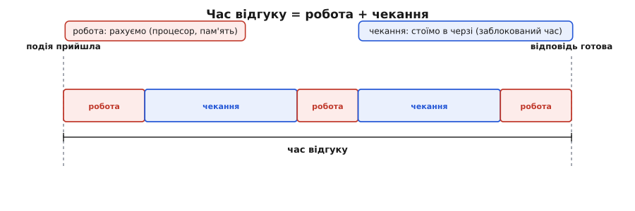
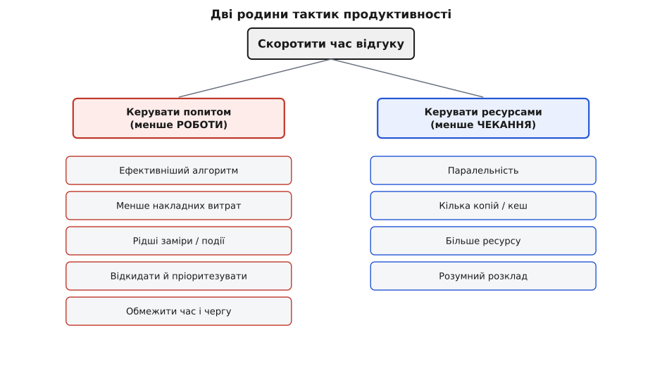

# Тактики продуктивності

<preknowlist>
- [Якісні атрибути («-ilities»)](topic:sf-apps/quality-attributes) — що таке нефункціональна властивість системи й чому «швидкість» — окрема турбота від того, що система робить.
- [Сценарії атрибутів](topic:sf-apps/attribute-scenarios) — як розмита вимога («має бути швидким») стає перевірним реченням: стимул → артефакт → реакція → **вимірна** міра.
- [Тактика проти патерна](topic:sf-apps/architectural-tactics) — тактика як одне точкове рішення на один атрибут, на відміну від патерна як готового пакета структур із зашитим компромісом.
- [Trade-off-аналіз](topic:sf-apps/tradeoff-analysis) — будь-яке рішення платить одним атрибутом за інший; як цю ціну помічати й називати.
</preknowlist>

«Зроби швидше» — найпоширеніша й найпорожніша вимога до системи. Порожня вона тому, що не каже головного: швидше **що**, за **скільки** і коли саме. Продуктивність (лат. *productivus* — той, що дає плід; тут — скільки роботи система встигає й за який час) стає інженерною турботою лише тоді, коли ти назвеш конкретну подію й час, у який на неї треба відповісти. «Натиснув кнопку — результат за 200 мс». «Прийшов замір із давача — оброблено до наступного заміру». «Тисяча запитів за секунду — жоден не чекає довше секунди». Ось тепер є що покращувати, бо є що **виміряти**.

І тут відкривається головне питання цієї статті: коли ти хочеш скоротити цей час, **де саме** він проводиться? Відповідь, з якої виростає весь словник тактик продуктивності, напрочуд проста. Час від події до відповіді складається рівно з двох частин. Перша — система **щось рахує**: крутить процесор, читає з пам'яті, гризе диск, жене байти по мережі. Друга — система **нічого не рахує, а чекає**: чекає на зайнятий ресурс, на відповідь сусіда, на звільнення блокування. Перше — це *робота*, друге — це *простій*. І кожна тактика продуктивності б'є рівно по одній із цих двох частин: або зменшує роботу, або скорочує простій.



*Час відгуку розкладається на дві природні частини — коли система рахує і коли вона лише чекає. Це і є вся мапа тактик продуктивності: одні коротшають роботу, інші вигризають чекання.*

Цей поділ — не наша вигадка, а канонічна основа теми з книги Лена Басса, Пола Клементса й Ріка Казмана «Software Architecture in Practice» (усталене джерело словника тактик, 3-тє видання, 2012, розділ про продуктивність): два внески в час відгуку — **споживання ресурсів** (resource consumption, активна робота) і **заблокований час** (blocked time, вимушений простій). Далі всі тактики групуються у дві великі родини — **керувати попитом на ресурс** (менше й рідше вимагати роботи) і **керувати самими ресурсами** (щоб роботи вистачало, а чекання не було). Розберімо обидві не як список для запам'ятовування, а як два способи вкоротити ту саму смугу часу.

## Звідки береться заблокований час

Спершу — про простій, бо він найменш очевидний. Здається, що коли система «гальмує», вона просто багато рахує. Насправді дуже часто вона рахує мало, але **стоїть у черзі**. Заблокований час народжується з трьох причин, і всі три варто відчувати окремо.

Перша — **конкуренція** (лат. *concurrere* — збігатися разом): на один ресурс претендує кілька обчислень одночасно. Десять запитів хочуть той самий рядок бази, але замок пускає по одному — дев'ять чекають. Процесор один, а готових до роботи потоків двадцять — дев'ятнадцять стоять. Друга — **недоступність ресурсу**: те, що потрібно, зараз офлайн або відмовило, і доводиться чекати, поки повернеться. Третя, найпідступніша — **залежність від чужого результату**: обчислення не може йти далі, доки сусіднє не віддасть свою відповідь. Викликав платіжний шлюз — сидиш і чекаєш його два кроки, хоч сам процесор у цей час порожній.

Чому це важливо відрізняти від «багато рахуємо»? Бо ліки різні. Якщо система повільна через **роботу** — треба зменшити роботу (швидший алгоритм, менше даних). Якщо через **чекання** — жодне пришвидшення алгоритму не поможе: ти оптимізуєш ту частину смуги, якої майже немає. Класична пастка початківця — годинами вилизувати функцію, що займає 5% часу, поки решта 95% система стоїть у черзі до бази. Тому перший хід архітектора над продуктивністю — не «що пришвидшити», а «**де** проводиться час»: у роботі чи в чеканні.

> 🔧 **Навіщо це.** Коли на рев'ю кажуть «в нас усе тормозить, треба переписати на швидшій мові» — питай, який відсоток часу йде на процесор, а який на очікування вводу-виводу й мережі. Дуже часто виявляється, що система 90% часу **чекає** на диск чи сусідній сервіс, і тоді швидша мова не дасть нічого — там простій, а не робота. Мова тактик змушує спершу поділити час на дві ділянки, а вже тоді цілитись.

## Родина перша: керувати попитом на ресурс

Найпряміший спосіб скоротити роботу — **менше її вимагати**. Ця родина зменшує ту ділянку смуги, де процесор реально працює: або роблячи кожну одиницю роботи дешевшою, або взагалі не даючи їй виникнути. Тактики тут природно діляться на кілька ходів.

**Підвищити ефективність обчислення.** Той самий результат, але меншим коштом: кращий алгоритм замість переборного, менше зайвих копіювань, кеш-дружній прохід по пам'яті. Це найочевидніший хід — і часто найдешевший, бо не додає нової структури, лише прибирає марнотратство. Але межа в нього жорстка: коли алгоритм уже близький до оптимального, вичавлювати далі майже нема чого.

**Зменшити накладні витрати.** Часто система витрачає не на корисну роботу, а на **обгортку** довкола неї: серіалізацію, зайві шари посередників, копіювання даних між рівнями. Прибрати проміжну ланку, злити два виклики в один, не перепаковувати те саме двічі — усе це зменшує роботу, не чіпаючи самої задачі. Тут ховається прямий компроміс зі [змінюваністю](topic:sf-apps/modifiability-tactics): шар непрямості, що робить код гнучким, коштує процесорного часу — прибираючи його заради швидкості, ти платиш гнучкістю.

**Керувати частотою подій і замірів.** Якщо потік подій сам по собі завеликий — обробляй **рідше**. Давач шле 1000 замірів на секунду, а тобі досить 50 — бери кожен двадцятий (керувати частотою замірів). Подій приходить більше, ніж система встигає, — частину **відкинь** або постав у чергу (обмежити відгук на події), а найменш важливі просто **ігноруй** (пріоритезувати події). Це вже не «швидше рахувати», а «рахувати менше того, що не критичне» — і на перевантаженні саме ця тактика рятує систему від захлинання.

**Обмежити час обчислення й розмір черги.** Постав жорстку стелю: «на цей крок не більше 10 мс, далі — обірвати й віддати наближену відповідь»; «черга не довша за 1000, зайве відкидаємо». Такі межі не дають одному запиту з'їсти весь ресурс і не дають черзі рости нескінченно, забиваючи пам'ять. Ціна очевидна: інколи віддаєш гірший результат заради того, щоб узагалі вкластися в час.

## Родина друга: керувати самими ресурсами

Друга родина працює з іншого боку смуги — вона б'є по **чеканню**. Ідея не в тому, щоб зменшити роботу, а в тому, щоб роботі **вистачало ресурсу** й ніхто не стояв у черзі дарма.

**Ввести паралельність.** Це головна тактика проти заблокованого часу. Якщо обчислення чекає на зайнятий ресурс, а поряд є вільний процесор — хай працюють **одночасно**. Поки один потік чекає на відповідь диска, інший рахує наступний запит; замість черги з одного вікна — кілька вікон паралельно. Паралельність прямо вигризає простій від конкуренції: більше готових виконавців — менше тих, хто стоїть.

Ось найпростіший приклад того, як паралельність скорочує сумарне чекання. Було — обробляємо запити строго по черзі, кожен чекає, поки звільниться попередній:

**Послідовна обробка: кожен запит чекає на всіх попередніх.**
:::tabs
```c
// Один робітник тягне чергу по одному. Поки він зайнятий запитом,
// решта СТОЇТЬ — це і є заблокований час від конкуренції за єдиний ресурс.
void serve_all(queue_t *q) {
    request_t req;
    while (dequeue(q, &req)) {
        handle_request(&req);   // ~40 мс на запит; наступний чекає весь цей час
    }
}
```
```go
// Один робітник тягне чергу по одному. Поки він зайнятий запитом,
// решта СТОЇТЬ — це і є заблокований час від конкуренції за єдиний ресурс.
func serveAll(q <-chan Request) {
    for req := range q {
        handleRequest(req) // ~40 мс на запит; наступний чекає весь цей час
    }
}
```
```python
# Один робітник тягне чергу по одному. Поки він зайнятий запитом,
# решта СТОЇТЬ — це і є заблокований час від конкуренції за єдиний ресурс.
def serve_all(q: "queue.Queue[Request]") -> None:
    while (req := q.get()) is not None:
        handle_request(req)  # ~40 мс на запит; наступний чекає весь цей час
```
:::

Стало — кілька робітників тягнуть ту саму чергу паралельно:

**Паралельна обробка: N робітників, черга спорожняється у N разів швидше.**
:::tabs
```c
// Пул із N потоків тягне спільну чергу. Тепер водночас
// обробляється N запитів — чекання в черзі падає приблизно в N разів.
#define WORKERS 4

void *worker_loop(void *arg) {
    queue_t *q = (queue_t *)arg;
    request_t req;
    while (dequeue_blocking(q, &req)) {   // безпечний забір із черги
        handle_request(&req);             // чотири такі йдуть ОДНОЧАСНО
    }
    return NULL;
}

void serve_all_parallel(queue_t *q) {
    pthread_t th[WORKERS];
    for (int i = 0; i < WORKERS; i++)
        pthread_create(&th[i], NULL, worker_loop, q);
    for (int i = 0; i < WORKERS; i++)
        pthread_join(th[i], NULL);
}
```
```go
// Пул із N горутин тягне спільний канал. Тепер водночас
// обробляється N запитів — чекання в черзі падає приблизно в N разів.
const workers = 4

func workerLoop(q <-chan Request, wg *sync.WaitGroup) {
    defer wg.Done()
    for req := range q { // безпечний забір із каналу
        handleRequest(req) // чотири такі йдуть ОДНОЧАСНО
    }
}

func serveAllParallel(q <-chan Request) {
    var wg sync.WaitGroup
    for i := 0; i < workers; i++ {
        wg.Add(1)
        go workerLoop(q, &wg)
    }
    wg.Wait()
}
```
```python
# Пул із N потоків тягне спільну чергу. Тепер водночас
# обробляється N запитів — чекання в черзі падає приблизно в N разів.
WORKERS = 4

def worker_loop(q: "queue.Queue[Request]") -> None:
    while (req := q.get()) is not None:  # безпечний забір із черги
        handle_request(req)              # чотири такі йдуть ОДНОЧАСНО

def serve_all_parallel(q: "queue.Queue[Request]") -> None:
    threads = [threading.Thread(target=worker_loop, args=(q,))
               for _ in range(WORKERS)]
    for t in threads:
        t.start()
    for t in threads:
        t.join()
```
:::

Чотири робітники замість одного — і черга, що росла, починає спорожнятися. Але тут і засідає найважливіший урок про паралельність: **вона не безкоштовна й не безмежна**. По-перше, `dequeue_blocking` мусить бути захищений від гонитви — сам замок на черзі знову породжує конкуренцію, і якщо робити його грубо, чотири потоки битимуться за один мьютекс так, що виграшу не буде. По-друге, прискорення впирається у **частку роботи, яку взагалі можна розпаралелити**: якщо третина обробки послідовна за своєю природою (усі пишуть в один лог, оновлюють один лічильник), то скільки б робітників ти не додав, швидше за цю третину система не поїде. Цю стелю строго описує [закон Амдала](topic:sf-apps/performance-tactics/math-amdahl-little.md) — межа прискорення від паралельності, задана саме послідовною часткою; вона й пояснює, чому подвоєння ядер рідко дає подвоєння швидкості.

> 🔧 **Навіщо це.** Перш ніж додавати потоки, спитай: яка частка роботи справді незалежна? Якщо всі запити наприкінці впираються в один спільний ресурс (єдине з'єднання з базою, один глобальний замок), паралельність лише перенесе чергу з одного місця в інше — і ти отримаєш ту саму швидкість плюс купу складності від синхронізації. Паралельність окуповується там, де робота **справді ділиться**, а спільних вузьких місць мало.

**Тримати кілька копій.** Якщо на один ресурс завелика черга — постав **кілька однакових** і розподіляй навантаження між ними. Дві репліки бази для читання замість однієї; кеш, що тримає копію часто потрібних даних ближче до споживача, щоб не бігати щоразу до першоджерела. Копії розсмоктують конкуренцію: замість однієї черги — кілька коротших. Ціна — узгодженість (гр. *syn* + лат. *consistere* — тримати разом): щойно копій кілька, вони можуть розійтися в даних, і доводиться вирішувати, наскільки свіжою мусить бути кожна.

**Збільшити наявний ресурс.** Найгрубіший, але часом найдешевший хід: дати системі **більше заліза** — швидший процесор, більше пам'яті, товщий канал. Це не потребує перепроєктування й діє негайно. Але масштабується лінійно лише до певної межі й прямо коштує грошей — тому [вартість тут сама стає архітектурним атрибутом](topic:sf-apps/cost-as-attribute): іноді дешевше докупити пам'яті, ніж три тижні оптимізувати код, а іноді навпаки.

**Розумно планувати доступ до ресурсу.** Коли на ресурс претендує багато охочих, важить не лише *скільки* його, а й *у якому порядку* пускати. Проста черга «хто перший прийшов»; пріоритети, де важливе йде поперед фонового; жорсткий розклад у системах реального часу. Правильне планування скорочує чекання саме для того, кому воно критичне — ціною того, що менш важливе почекає довше.



*Дві родини тактик — не довільний список, а дві сторони однієї смуги: ліва зменшує роботу, права вигризає чекання. Кожна тактика під ними — конкретний важіль, який архітектор обирає під записаний сценарій.*

## Ціна є завжди — і саме тут працює архітектор

Тепер видно спільну рису всіх цих тактик, і вона та сама, що й у будь-якому [trade-off-аналізі](topic:sf-apps/tradeoff-analysis): **кожна щось купує ціною іншого**. Кеш купує швидкість ціною свіжості даних. Паралельність купує пропускність ціною складності й ризику гонитв. Відкидання подій купує виживання під навантаженням ціною повноти обробки. Більше заліза купує запас ціною грошей. Тактика без названої ціни — не рішення, а самообман: якби швидкість була безкоштовна, її не було б сенсу обговорювати.

Ба більше — тактики продуктивності часто б'ються **між собою**, і в цьому головна тонкість. Кеш пришвидшує читання, але кожна копія — це ще один шар, який треба узгоджувати, тобто удар по свіжості й по [змінюваності](topic:sf-apps/modifiability-tactics). Паралельність пришвидшує обробку, але спільні замки, які вона потребує, самі створюють нову конкуренцію — тобто новий заблокований час. Ти можеш вигризти простій в одному місці й непомітно насадити його в іншому. Тому мало «застосувати тактику» — треба **виміряти на реальному сценарії**, що вона купила і що при цьому зіпсувала.

І звідси — практичне правило, яким тактики продуктивності вмикаються в проєкт. Їх чіпляють не до абстрактного «хай буде швидко», а до **записаного сценарію** з числом: «сторінка каталогу вантажиться за 300 мс при 500 одночасних користувачах». Такий сценарій одразу підказує і де шукати час (робота чи чекання?), і яку родину брати (попит чи ресурси?), і головне — **міру успіху**, за якою видно, спрацювала тактика чи ні. Без числа продуктивність перетворюється на нескінченне «а давай ще трохи пришвидшимо», де ніхто не знає, коли зупинитись.

А щоб дійти до цих чисел ще до першого рядка коду, архітектор рахує наперед — [прикидкою «на серветці»](topic:sf-apps/back-of-envelope): скільки запитів на секунду, скільки байтів на запит, чи влізе це в один сервер. Тут допомагає ще одне усталене співвідношення — [закон Літтла](topic:sf-apps/performance-tactics/math-amdahl-little.md), що зв'язує довжину черги, темп приходу й час очікування простою формулою й дозволяє прикинути затримку, не запускаючи системи. Ці два числові важелі — Амдала для паралельності й Літтла для черг — і роблять розмову про продуктивність інженерною, а не гаданням; [історія їхньої появи](topic:sf-apps/performance-tactics/hist-amdahl-little.md) показує, як обидва прийшли зовсім не з програмування — один із суперечки про суперкомп'ютери, другий із теорії черг.

Зрештою, тактики продуктивності — це два питання, поставлені до однієї смуги часу. Де система проводить час — рахуючи чи чекаючи? Якщо рахуючи — зменш роботу: ефективніший алгоритм, менше накладних витрат, рідші заміри, обрізана черга. Якщо чекаючи — прибери простій: паралельність, копії, більше ресурсу, розумний розклад. І над кожним таким ходом — та сама тверда рука: назви, що ця тактика купує, назви, чим платить, і перевір це на сценарії з реальним числом. Продуктивність — не про те, щоб усе було якомога швидшим; вона про те, щоб система вкладалася саме в той час, який хтось назвав важливим, і не платила за це більше, ніж він вартий.
