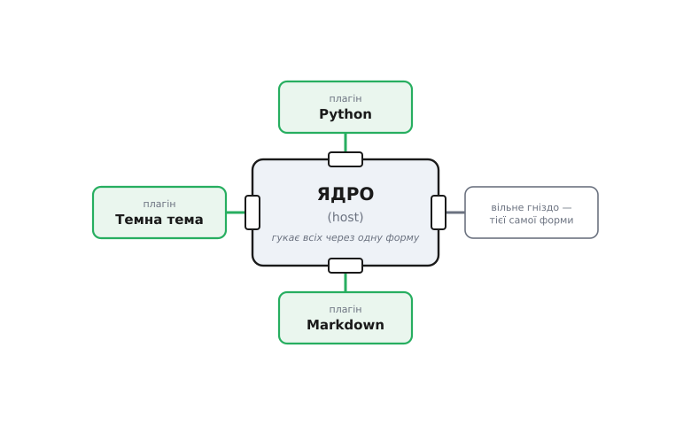

# Плагіни / точки розширення

<preknowlist>
- [Принцип відкритості-закритості (OCP)](root:sf-apps/open-closed) — код закритий для правок, але відкритий для нових можливостей через заздалегідь передбачену вісь; плагіни — це OCP, розкручений до масштабу цілого застосунку.
- [Принцип інверсії залежностей (DIP)](root:sf-apps/dependency-inversion) — ядро й деталь обоє спираються на абстракцію-обіцянку, а не одне на одне; контракт плагіна — саме така обіцянка.
- [Інтерфейс проти реалізації](root:sf-apps/interface-vs-implementation) — поділ на те, ЩО модуль обіцяє зовні, і ЯК він це робить усередині; плагін бачить лише контракт, ядро не бачить нутрощів плагіна.
- [Поліморфізм](root:sf-lang/polymorphism) — один виклик через спільний тип дає різну поведінку залежно від конкретного об'єкта за ним; механізм, яким ядро гукає будь-який плагін однаково.
- [Зчеплення і зв'язність](root:sf-apps/coupling-cohesion) — наскільки одна частина коду залежить від іншої; мета плагінної межі — звести зчеплення ядра з розширенням до єдиного тонкого контракту.
</preknowlist>

Уяви редактор коду. Люди пишуть різними мовами, тож редактор мусить підсвічувати синтаксис Python, і Rust, і мови, якої ще навіть не існує. Один шлях — вписати кожну мову всередину редактора: гілка на Python, гілка на Rust, і так далі. Але тоді щоразу, коли світ вигадує нову мову, ти мусиш відкрити вихідний код редактора, дописати гілку, зібрати нову версію й розіслати її всім користувачам. Автор редактора стає вузьким горлом для всього, що люди захочуть у нього додати. Гірше: він **фізично не може** передбачити всі мови, усі теми оформлення, усі формати, які знадобляться за десять років.

Тепер придивись до іншого шляху. Що, як редактор не знатиме про Python нічого — а натомість матиме **дірку правильної форми**, куди хтось збоку вставить шматок, що вміє Python? Автор редактора пише лише саму дірку — її форму, її краї, правила, як у неї щось вставляти. А підтримку Python пише хтось інший, коли завгодно, не чіпаючи ані рядка редактора й не перезбираючи його. Це і є **плагінна архітектура (англ. *plug-in* — те, що вставляють у гніздо, як штекер у розетку)**: застосунок будують не як суцільну брилу, а як **ядро з гніздами**, у які код ззовні доточує можливості.

Слово прийшло буквально з електрики. Розетка не знає, що ти в неї увімкнеш — лампу, чайник, зарядку; вона знає лише **форму штекера й напругу на контактах**. Будь-який прилад, що дотримується цієї форми, працює; розетку заради нового приладу ніхто не переробляє. Плагінна архітектура переносить цю саму ідею в код: ядро визначає форму гнізда (контракт), а що саме туди ввімкнуть — його не обходить.

## Дві частини, між ними — тонка межа

Розберімо анатомію. У плагінному застосунку рівно дві породи коду, і сплутати їх не можна.

Перша — **ядро (host, англ. — той, хто приймає гостей)**. Це те, що є завжди, незалежно від плагінів: у редакторі — вікно, буфер тексту, курсор, механізм відкрити-зберегти файл. Ядро самодостатнє й корисне навіть без жодного плагіна. Головне — воно **не знає імен** конкретних плагінів. Ядро редактора ніде не згадує слова «Python»; воно оперує лише поняттям «підсвічувач синтаксису», байдуже якої мови.

Друга — **плагіни**: окремі, самодостатні шматки, кожен додає одну можливість. Плагін «Python» вміє розібрати Python на токени й пофарбувати їх. Плагін «темна тема» вміє віддати кольори. Кожен плагін **знає про ядро** (він до нього під'єднується), але плагіни **не знають одне про одного** — можеш поставити Python без Rust, і навпаки.

А між цими двома породами лежить те, заради чого все й затіяно, — **контракт (точка розширення, англ. *extension point*)**. Це рівно та «форма гнізда»: інтерфейс, який ядро оголошує й обіцяє викликати, а плагін реалізує. Уся домовленість між ядром і плагіном стиснута в цей контракт і **тільки в нього**. Ядро не знає про плагін нічого, крім того, що той виконує контракт; плагін не знає про ядро нічого, крім того, що воно цей контракт викличе.



*Ядро самодостатнє й тримає лише контракт-гніздо; кожен плагін під'єднується до гнізда збоку, і додати новий можна, не чіпаючи ядра.*

> 🔧 **Навіщо це.** Цей поділ — не академічна краса, а межа відповідальності між різними людьми в різному часі. Команда редактора пише й супроводжує ядро та форму гнізда — і більше нічого. Підтримку сотні мов пишуть сотні сторонніх авторів, кожен у своєму темпі, ніколи не питаючи дозволу й не тривожачи чужий код. Без цієї межі кожна нова мова була б задачею команди редактора; з нею — задачею того, кому та мова потрібна.

## Це той самий OCP, тільки більший

Якщо здається, що ти вже десь це бачив, — так і є. Плагінна архітектура — це [принцип відкритості-закритості](root:sf-apps/open-closed), піднятий з рівня одного класу на рівень цілого застосунку. OCP каже: постав абстракцію на осі змін, спирайся згори на неї, а реалізації підвішуй знизу — і додавай нові, не чіпаючи верху. Плагінна архітектура робить рівно це, але «верх» — то весь застосунок, «низ» — окремі модулі, а «вісь змін» стає офіційно оголошеною **точкою розширення**.

Так само й [інверсія залежностей](root:sf-apps/dependency-inversion) тут проступає буквально. Природна стрілка була б «ядро редактора → код Python»: важливе спирається на конкретну деталь. Плагінна межа її розвертає. Ядро залежить лише від абстрактного контракту `SyntaxHighlighter`; плагін Python залежить від того самого контракту, реалізуючи його. Обидві стрілки сходяться до контракту посередині — ядро вгору до нього більше не тягнеться до жодної мови, а кожна мова знизу підлаштовується під нього. Знайома фраза «не дзвоніть нам — ми подзвонимо вам» тут описує саму суть: плагін не запускає себе сам, у потрібну мить його гукає ядро.

Різниця з простим OCP — не в ідеї, а в **масштабі й наслідках цього масштабу**. Коли реалізацій-нащадків три і всі вони у твоєму ж репозиторії, «додати нову» означає дописати клас і перезібрати проєкт. Коли ж розширення — це плагін, він часто лежить в **окремому репозиторії, окремо збирається, окремо постачається** і під'єднується до вже встановленого застосунку без його перезбирання. Ось ця повна відокремленість — і в коді, і в часі, і в тому, хто автор, — робить плагінну архітектуру якісно іншою, а не просто «OCP на стероїдах».

## Мінімальний плагінний рушій

Подивімося, з чого це складено насправді. Три деталі — і жодної магії: контракт, реєстр і момент виклику.

Спершу **контракт** — форма гнізда. Хай ядро вміє експортувати документ у різні формати, і кожен формат — плагін. Контракт каже: «дай мені розширення файлу, яке ти обслуговуєш, і вмій перетворити документ на байти».

:::tabs
```ts
// Контракт — форма гнізда. Ядро знає ЛИШЕ це, жодного конкретного формату.
interface Exporter {
  readonly extension: string;               // "pdf", "html", "md" — що обслуговує
  export(doc: Document): Uint8Array;        // як перетворити документ на байти
}
```
```python
from typing import Protocol

# Контракт — форма гнізда. Ядро знає ЛИШЕ це, жодного конкретного формату.
class Exporter(Protocol):
    extension: str                          # "pdf", "html", "md" — що обслуговує
    def export(self, doc: "Document") -> bytes: ...   # документ → байти
```
```go
// Контракт — форма гнізда. Ядро знає ЛИШЕ це, жодного конкретного формату.
type Exporter interface {
    Extension() string             // "pdf", "html", "md" — що обслуговує
    Export(doc Document) []byte    // документ → байти
}
```
:::

Далі **реєстр** — те місце, куди плагіни складають себе, а ядро потім там їх бере. Це серце рушія: ядро не створює плагіни (інакше знало б їхні імена), воно лише **перебирає те, що само зареєструвалося**. Реєстр — звичайний словник «розширення → плагін».

:::tabs
```ts
class ExportRegistry {
  private byExt = new Map<string, Exporter>();

  register(e: Exporter): void {             // сюди плагін кладе себе
    this.byExt.set(e.extension, e);
  }

  exportAs(ext: string, doc: Document): Uint8Array {
    const e = this.byExt.get(ext);          // ядро бере плагін за ключем
    if (!e) throw new Error(`немає плагіна для .${ext}`);
    return e.export(doc);                    // і гукає через контракт
  }
}
```
```python
class ExportRegistry:
    def __init__(self) -> None:
        self._by_ext: dict[str, Exporter] = {}

    def register(self, e: Exporter) -> None:   # сюди плагін кладе себе
        self._by_ext[e.extension] = e

    def export_as(self, ext: str, doc: "Document") -> bytes:
        e = self._by_ext.get(ext)              # ядро бере плагін за ключем
        if e is None:
            raise KeyError(f"немає плагіна для .{ext}")
        return e.export(doc)                    # і гукає через контракт
```
```go
type ExportRegistry struct {
    byExt map[string]Exporter
}

func NewExportRegistry() *ExportRegistry {
    return &ExportRegistry{byExt: map[string]Exporter{}}
}

func (r *ExportRegistry) Register(e Exporter) { // сюди плагін кладе себе
    r.byExt[e.Extension()] = e
}

func (r *ExportRegistry) ExportAs(ext string, doc Document) ([]byte, error) {
    e, ok := r.byExt[ext]                       // ядро бере плагін за ключем
    if !ok {
        return nil, fmt.Errorf("немає плагіна для .%s", ext)
    }
    return e.Export(doc), nil                    // і гукає через контракт
}
```
:::

Тепер **окремий плагін** — цілком незалежний файл, що знає тільки контракт, а не нутрощі ядра:

:::tabs
```ts
// Плагін: реалізує контракт і більше нічого про ядро не знає.
class MarkdownExporter implements Exporter {
  readonly extension = "md";
  export(doc: Document): Uint8Array {
    const text = doc.blocks.map(b => `# ${b.title}\n\n${b.body}`).join("\n\n");
    return new TextEncoder().encode(text);
  }
}
```
```python
# Плагін: реалізує контракт і більше нічого про ядро не знає.
class MarkdownExporter:
    extension = "md"
    def export(self, doc: "Document") -> bytes:
        text = "\n\n".join(f"# {b.title}\n\n{b.body}" for b in doc.blocks)
        return text.encode("utf-8")
```
```go
// Плагін: реалізує контракт і більше нічого про ядро не знає.
type MarkdownExporter struct{}

func (MarkdownExporter) Extension() string { return "md" }
func (MarkdownExporter) Export(doc Document) []byte {
    var b strings.Builder
    for _, bl := range doc.Blocks {
        fmt.Fprintf(&b, "# %s\n\n%s\n\n", bl.Title, bl.Body)
    }
    return []byte(b.String())
}
```
:::

І, нарешті, **точка збірки** — єдине місце в програмі, де ще все дозволено знати. Тут плагіни знайомлять із реєстром, і лише тут згадуються їхні конкретні імена. Це той самий «зовнішній збирач» на верхівці застосунку, куди DIP зсуває всі рішення про конкретику:

:::tabs
```ts
const registry = new ExportRegistry();
registry.register(new MarkdownExporter());    // імена плагінів — ЛИШЕ тут
registry.register(new HtmlExporter());
// далі ядро працює, знаючи тільки .export(ext), а не жоден клас-експортер
const bytes = registry.exportAs("md", doc);
```
```python
registry = ExportRegistry()
registry.register(MarkdownExporter())         # імена плагінів — ЛИШЕ тут
registry.register(HtmlExporter())
# далі ядро працює, знаючи тільки export_as(ext), а не жоден клас-експортер
data = registry.export_as("md", doc)
```
```go
registry := NewExportRegistry()
registry.Register(MarkdownExporter{})         // імена плагінів — ЛИШЕ тут
registry.Register(HtmlExporter{})
// далі ядро працює, знаючи тільки ExportAs(ext), а не жоден клас-експортер
data, _ := registry.ExportAs("md", doc)
```
:::

Ось і весь кістяк. Щоб додати експорт у PDF, ти пишеш **новий клас** `PdfExporter`, реалізуєш той самий контракт і дописуєш **один рядок** реєстрації. Ядро — `ExportRegistry` і все, що ним користується, — не міняється жодним символом. Це літерально та обіцянка OCP: розширення прибудовою, старий код недоторканий.

Механізм, яким `register` збирає обробники в таблицю, а `exportAs` по ній ходить, — це та сама **таблиця диспетчеризації** «ключ → функція», що стоїть за багатьма розширюваними системами. [Робочий приклад такого рушія на чистому C — таблиця знижок, куди новий вид знижки додається реєстрацією, а не правкою циклу](root:sf-apps/open-closed/proj-extensible-dispatch.md) показує ту саму ідею там, де класів і віртуальних методів немає взагалі.

## Хто кого гукає: два напрями розширення

Досі плагін лише **віддавав** щось на запит ядра: «дай байти для .md». Але точки розширення бувають двох різних смаків, і плутати їх — джерело кривих архітектур.

Перший смак — **ядро гукає плагін** (обробник). Ядро в потрібну мить питає: «хто вміє .md? — виконай». Плагін тут пасивний, чекає виклику. Так влаштований щойно показаний експортер, так само — підсвічувачі синтаксису, валідатори, конвертери. Це найчистіша, найбезпечніша форма: ядро тримає керування, кличе плагін вузько й контрольовано, а між викликами плагіна ніби й немає.

Другий смак — **плагін гукає ядро** (розширює його дію). Тут плагін хоче не просто відповісти на запит, а **вклинитися** в те, що ядро й так робить: додати пункт у меню, кнопку на панель, крок у конвеєр збірки, реакцію на подію «файл збережено». Ядро мусить наперед оголосити ці **зачіпки (англ. *hooks* — гачки, за які чіпляються)**: місця у своєму ході, де воно спиниться й спитає плагіни «хочете щось тут додати?». Redis дозволяє дописати нові команди модулем; браузер дає розширенню втрутитися в мережеві запити; система збірки дає плагіну вставити свій крок. Це потужніше — і небезпечніше, бо тепер плагін впливає на сам перебіг ядра, а не лише відповідає збоку.

Різниця вирішує форму контракту. Для першого смаку контракт — це «вмій зробити X на запит» (інтерфейс з методом, що ядро викличе). Для другого — це «ось події/фази, на які можеш підписатися» (ядро оголошує набір зачіпок, плагін реєструє на них свої реакції). Багато систем дають обидва: підписуйся на «застосунок стартував», а на запит «намалюй панель» — віддай віджет.

> 🔧 **Навіщо це.** Плутанина цих двох напрямів народжує найгидкіші баги розширюваних систем. Якщо ти дозволив плагінам активно гукати ядро й міняти його стан (другий смак), а сам розраховуєш, що керуєш ходом (перший смак), — плагін смикне ядро в невдалу мить, посеред напівзробленої операції, і зламає інваріант, про який ти навіть не думав. Спочатку чесно вирішуй: цей плагін **відповідає на запит** чи **втручається в дію**? — і лише тоді проєктуй контракт під потрібний напрям.

## Що ядро винне плагінам — і чого не винне

Ключова, найтонша частина плагінної архітектури — **межа**: що саме перетинає контракт, а що лишається по свій бік. Помилки тут коштують найдорожче, бо межу, оголошену публічно й реалізовану чужими людьми, потім майже неможливо змінити, не зламавши всім усе.

Правило одне, і воно жорстке: **через контракт проходить рівно те, що плагінам справді потрібно, — і нічого більше**. Кожна дрібниця нутрощів ядра, що просочилася в контракт, стає обіцянкою, яку ти більше не можеш порушити: щойно плагіни на неї сперлися, зміна нутрощів ламає їх усіх. Якщо контракт експортера віддає плагіну весь внутрішній об'єкт документа з усіма приватними полями, то будь-яке перейменування поля всередині ядра поб'є кожен сторонній експортер у світі. Тому плагіну дають **вузький, спеціально скроєний вигляд** — рівно ті дані, без яких він не зробить свою роботу. Це прямо продовжує [поділ інтерфейсу й реалізації](root:sf-apps/interface-vs-implementation): плагін бачить контракт, нутрощі лишаються приховані й вільні мінятися.

Друга частина межі — **версія контракту**. Плагіни, написані сторонніми людьми, живуть довше за будь-який реліз ядра. Плагін, зібраний торік, має або й далі працювати з новим ядром, або чесно й зрозуміло відмовитися, а не впасти з невиразною помилкою. Тому зрілі плагінні системи **нумерують контракт** і перевіряють сумісність, коли плагін під'єднується: «я вмію API версії 3; ти вмієш яку?». Це та сама відповідальність, що й у [дизайні API як публічної обіцянки](root:sf-apps/api-design) — щойно контракт назовні, він твій пасив назавжди, і кожна зміна коштує сумісності.

## Динамічне: коли плагін — окремий файл

У прикладі вище всі плагіни реєструвалися вручну в точці збірки — тобто були частиною того самого зібраного застосунку. Але справжня сила плагінів проявляється, коли ядро підбирає їх **у момент запуску**, з файлів, яких при його збірці ще не існувало.

Тоді плагін постачають окремо — файлом у теці `plugins/`, пакунком, розширенням із крамниці. Ядро при старті **сканує цю теку, завантажує кожен знайдений модуль і дає йому зареєструватися**. Автор ядра ніколи не бачив цих файлів; користувач додає й прибирає можливості, просто кидаючи або видаляючи файл, без перезбирання й навіть без згоди автора. Саме так живуть браузерні розширення, теми оформлення, драйвери пристроїв в операційній системі.

Це коштує **можливості завантажити код під час виконання** — механізму, що відрізняється від мови до мови. У мовах із динамічним завантаженням ядро явно каже «підвантаж отой файл і дай мені його точку входу»: у C/C++ це `dlopen`/`LoadLibrary` над спільною бібліотекою, у Python — `importlib`, у JVM — `ClassLoader`, у .NET — `Assembly.Load`. Кожен плагін-файл виставляє одну умовлену функцію на кшталт `register(host)`, яку ядро гукне одразу після завантаження, щоб плагін вписав себе в реєстр. Форма гнізда лишається тією самою — міняється лише те, що плагін тепер **приходить ззовні готовим бінарником чи скриптом**, а не компілюється разом із ядром.

Ця динамічність відкриває двері, які варто зачиняти свідомо. Чужий код, завантажений у процес ядра, працює **з усіма його правами**: може читати ті самі файли, ту саму мережу, ту саму пам'ять. Плагін-експортер, якому ти дав увесь документ, теоретично може й надіслати його кудись. Тому системи, що приймають плагіни від невідомих авторів (браузери, магазини розширень), або **ізолюють** плагін у пісочниці з обрізаними правами, або вимагають від нього декларувати, які саме дозволи йому потрібні, і показують це користувачеві. Зважений розбір цих механізмів завантаження й ізоляції — [окремий проєкт-приклад: як ядро сканує теку плагінів, завантажує модулі, звіряє версію контракту й дає кожному зареєструватися, з обробкою збійного плагіна](root:sf-apps/plugin-architecture/proj-plugin-loader.md).

## Ціна гнізда: коли НЕ треба

Плагінна межа — потужна, і саме тому спокуслива понад міру. Легко почати проєктувати кожну частину застосунку як плагін «про всяк випадок»; це помилка, і дорога.

Кожна точка розширення — це **публічний контракт**, який хтось пише, документує й **не може вільно міняти**, щойно на нього сперлися ззовні. Це прямо суперечить [YAGNI](root:sf-apps/dry-kiss-yagni): гнучкість, якою ніхто не користується, — не запас, а борг. Ти платиш за неї щодня — зайвим шаром непрямування, важчим для читання кодом (замість прямого виклику — стрибок через реєстр до невідомої наперед реалізації), скутістю рефакторингу (внутрішнє вже не переінакшиш, бо воно протекло в контракт). А віддачі — нуль, поки реального другого учасника з того боку немає.

Є проста перевірка, чи гніздо доречне: **чи існує вже або чесно очікується другий незалежний автор по той бік межі?** Плагіни виправдані там, де розширення пише **хтось інший, у іншому часі, не питаючи тебе**: сторонні автори мов для редактора, спільнота тем, команда, що постачає модулі окремо від ядра. Якщо ж усі «плагіни» пише та сама команда в тому самому репозиторії й вони завжди релізяться разом із ядром — тобі, найпевніше, потрібні не плагіни, а звичайні внутрішні модулі за інтерфейсом. Це дасть ту саму замінність без тягаря публічного, замороженого, версіонованого контракту.

Тому й тримаймося того, з чого почали: розетка має сенс там, де прилади робить не той, хто робить будинок. Плагінна архітектура — це свідоме рішення **винести край свого застосунку назовні** й віддати його чужим рукам там, де ти наперед знаєш, що ці руки прийдуть. Постав гніздо точної форми саме на тій осі, де зростання йтиме ззовні, — і твій застосунок навчиться робити те, чого його автор ніколи не програмував.
