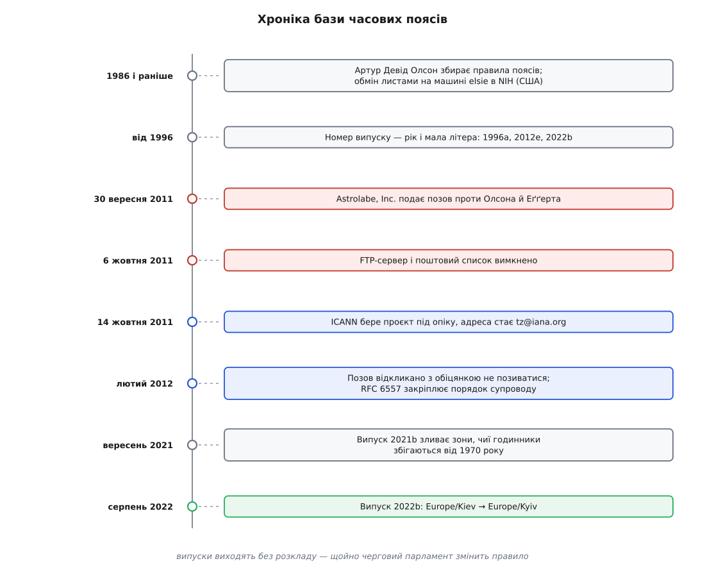
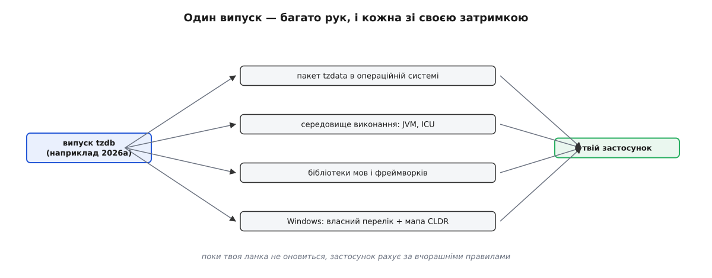

# 📜 База часових поясів: як народилася tzdb і чому вона ніколи не буде готовою

Якій миті на світовій осі часу відповідає «3 травня 1986 року, дев'ята ранку в Києві»? Машина не відповість без окремого довідника: одного сьогоднішнього відступу замало, потрібна вся історія рішень про те, коли в цьому місці переводили годинники й на скільки. Такий довідник існує — його звуть **tzdb** (*time zone database*), — і ця вставка про те, як він виріс із приватного листування однієї людини, як його ледь не вимкнув судовий позов і чому кілька разів на рік доводиться забирати новий випуск.

---

## Що взагалі мусить знати довідник

Спокуслива картина така: у світі є пояси, кожному місцю приписане число — і по всьому. Насправді запис про місце — це **історія переходів**: перелік митей, коли місцевий відступ від UTC мінявся, і на що саме він мінявся щоразу, плюс правило на майбутнє на кшталт «остання неділя березня, о третій ночі, вперед на годину».

Довідник відповідає на одне питання: який відступ діяв у цьому місці цієї миті. Що таке UTC і чим абсолютна мить відрізняється від настінного часу — окрема розмова про [прикладний час](topic:sf-apps/time-and-scheduling); тут досить того, що відступ — величина місцева й змінна, а змінює її не астрономія, а рішення влади.

Саме тому це не формула й не таблиця, яку можна вивести з географії. Правило переходу ухвалює парламент чи уряд конкретної країни, ухвалює будь-коли й скасовує так само раптово. Єдине джерело таких знань — люди, які читають рішення своєї держави й переказують їх у спільний файл. Довідник часових поясів — не обчислення, а **пам'ять**, і як усяку пам'ять її треба комусь поповнювати.

## Машина на ім'я elsie

RFC 6557 — документ, яким IETF 2012 року закріпив порядок супроводу бази, — переказує передісторію коротко й сухо: від початку 1980-х і до 2011 року база жила в Національних інститутах здоров'я США (NIH), а **Артур Девід Олсон** (Arthur David Olson) від самого початку вів її, координував поштовий список і давав платформу для випусків. Список мав адресу `tz@elsie.nci.nih.gov` — за іменем машини, на якій стояв. Про дату народження проєкту сама спільнота обережно каже «1986 рік або раніше»: чіткого першого випуску не було, бо не було й проєкту в звичному сенсі — було листування.

Механізм, який тоді склався, працює й досі і пояснює все інше. Ніхто в центрі не знає, що ухвалили цього тижня в Йорданії чи Чилі. Знають ті, хто там живе. Тому база — це потік листів з усього світу: посилання на постанову, дата, новий відступ; редактор звіряє, вносить, випускає. Друга людина, без якої історії не буде, — **Пол Еґґерт** (Paul Eggert) з Каліфорнійського університету в Лос-Анджелесі: багаторічний редактор бази, автор більшої частини коментарів у файлах даних і той, хто підписує випуски дотепер.

## Ім'я, яке має пережити державу

Еґґертові належить і схема імен, яку ти щодня набираєш у конфігах: **область/місце** — `Europe/Kyiv`, `America/New_York`, `Asia/Tokyo`. Вибір міста замість країни виглядає химерно, поки не спитаєш, що буде з цим ідентифікатором через тридцять років. Документація бази відповідає прямо: назв країн у схемі уникають, бо вони ненадійні — держави міняють назви й кордони. Місто теж не вічність, але воно куди стійкіше; беруть зазвичай найлюдніше місце регіону, щоб ім'я легше впізнавалося.

З цього випливає властивість, заради якої ідентифікатор і зберігають: він **ключ, а не опис**. Запис `+02:00` описує сьогоднішній стан і застаріває від першого ж рішення парламенту. `Europe/Kyiv` лишається тим самим ключем і після зміни правила — міняється тільки те, що за цим ключем лежить.

Рідкісні перейменування база теж переживає без розривів: старі імена не зникають, а лишаються посиланнями на нові у файлі `backward`. Найпомітніше для нас сталося у випуску **2022b** (серпень 2022): `Europe/Kiev` перейменували на `Europe/Kyiv`, і причина в примітках до випуску названа буденно — «as 'Kyiv' is more common in English now» (примітки до випуску tzdb 2022b). Старе ім'я лишилося посиланням, тому нічий конфіг не зламався: обидва рядки й далі показують на ті самі правила.

> 🔧 **Навіщо це.** Старе ім'я в конфізі чи в базі даних (`Europe/Kiev`, `Pacific/Enderbury`) — не помилка й не аварія: воно лишилося посиланням і веде до тих самих правил. Тому масово переписувати збережені ідентифікатори по всіх рядках немає потреби — це міграція з ризиком заради косметики. Перевіряти варто інше: чи взагалі твоє середовище отримує нові випуски.

## Астрологічні атласи й позов, що вимкнув базу

Тепер про те, звідки в базі бралися старі дані, — бо саме воно ледь не поховало проєкт. Правила 1930-х чи 1950-х лежать у підшивках місцевих законів, до яких волонтерові з іншої півкулі не дістатися. Зате цю роботу колись зробили укладачі астрологічних атласів: астрології потрібен точний місцевий час народження, тому такі довідники десятиліттями збирали, коли й де скільки показував годинник. Документація самої бази оцінює цей спадок без сентиментів: більшість записів до 1970 року походить із ненадійних джерел, часто з астрологічних книжок без посилань, укладачі яких, судячи з усього, вигадували запис там, де правди не знали.

30 вересня 2011 року компанія Astrolabe, Inc. — видавець астрологічного програмного забезпечення — подала до суду на Олсона й Еґґерта, стверджуючи, що база спирається на атлас, права на який належать їй. 6 жовтня FTP-сервер і поштовий список вимкнули. Ось момент, який варто затримати в голові: залежність, на якій трималися операційні системи, банки, авіаквитки й календарі всієї планети, вели двоє людей на службовій машині — і вона просто згасла.

Далі події пішли швидко. Захист узяв на себе Фонд електронних рубежів (Electronic Frontier Foundation, EFF): зажадав відкликати позов і подав клопотання про санкції проти позивача. 22 лютого 2012 року Astrolabe позов відкликала, вибачилася й підписала зобов'язання надалі не позиватися. Паралельно проєкт дістав те, чого йому бракувало все життя, — установу за спиною: 14 жовтня 2011 року опіку над ним узяла ICANN, база переїхала до IANA, а список став `tz@iana.org`. У лютому 2012-го IETF видав **RFC 6557** (автори — Еліот Лір з Cisco та Пол Еґґерт з UCLA; статус BCP 175), де записано порядок супроводу: координатор бази діє як призначений експерт IANA, обговорення — у відкритому списку, а самі дані були й лишаються **суспільним надбанням** (public domain).

*Три тижні восени 2011-го вирішили долю довідника: позов, тиша, нова опіка — а далі життя пішло далі звичним потоком випусків.*

## Суперечка про те, чого база не обіцяє

Друга гучна колотнеча була вже не з чужими, а всередині спільноти, і теж навколо історичних даних. База відкрито обмежує свою обіцянку: вона намагається бути правильною від 1 січня 1970 року (початок відліку UNIX) і для того конкретного місця, чиє ім'я стоїть в ідентифікаторі, — а не для всієї країни. Якщо годинники двох місць збігаються від 1970-го, з погляду цієї обіцянки це один запис із двома іменами.

Так і вирішили. Випуск **2021b** (вересень 2021) злив низку зон, чиї миті збігаються від 1970 року: дані найлюднішого місця лишили в основному файлі, решту перенесли у файл `backzone`, а старі імена зробили посиланнями. Під це потрапили, зокрема, `Africa/Accra`, `America/Nassau`, `America/Port_of_Spain`, `America/Curacao`, `Antarctica/Syowa`; заразом `Pacific/Enderbury` перейменували на `Pacific/Kanton`. Випуск 2022b пішов далі й вимів у `backzone` решту зон, що дублюються від 1970 року.

Обурення було помітне, і причина його не технічна. Для супровідника два ідентифікатори з однаковими даними — надлишок: менше рядків означає менше місць помилитися. Для людини в тій країні ідентифікатор — ще й **впізнаваність**: власне ім'я у світовому переліку. Обидва прочитання справжні, але записана політика — перша: tzdb є технічним реєстром із оголошеною межею, а не переліком держав. Практичний висновок звідси теж є: якщо тобі справді потрібен місцевий час до 1970 року, ти маєш свідомо взяти дані з `backzone` — і так само свідомо знати, що вони хиткі.

## Чому база жива

Нумерація випусків нічого не приховує: від 1996 року номер — це чотири цифри року й мала літера (`2012e`, `2022b`; після `z` ідуть `za`, `zb` і далі). Розкладу випусків нема — вони виходять, коли треба, звичайно раз на кілька місяців.

Це навмисне **не** [семантична версія](topic:sf-release/semantic-versioning): там номер обіцяє сумісність, і старша цифра попереджає, що інтерфейс змінився. Тут інтерфейс не змінюється взагалі — змінюється світ. Тому номер каже інше: **станом на яку дату довідник знає про світ**. Порівнювати два випуски має сенс лише як «чий знімок свіжіший».

А ось чому цих знімків стільки. Кілька історій, після яких слово «політичні» стає відчутним.

**Україна, 2011.** 20 вересня Верховна Рада проголосувала лишитися на літньому часі цілорічно. 18 жовтня — за чотири тижні — рішення скасувала, і країна повернулася на зимовий час у визначений строк. Дві протилежні ухвали за місяць означали два кола правок у базі й у всьому, що з неї живиться.

**Україна, 2024.** 16 липня парламент ухвалив закон про відмову від переведення годинників; президент його не підписав, пославшись на економічні міркування, — переведення лишилося. Це добре показує, що саме база записує: не те, як проголосували, а те, що справді чинне.

**Ліван, березень 2023.** 23 березня уряд оголосив, що перехід на літній час переносять з 25 березня на 20 квітня. До призначеної дати лишалося два дні, і пристрої з уже оновленою базою перевелися за старим планом. Частина телеканалів відмовилася коритися перенесенню, різні громади перейшли по-різному — і кілька днів у країні фактично діяли дві години одночасно. 27 березня прем'єр оголосив компроміс: літній час від 29 березня.

**Самоа, кінець 2011.** Країна перейшла на інший бік лінії зміни дат — і після четверга, 29 грудня 2011 року, там настала одразу субота, 31 грудня. П'ятниці 30 грудня в Самоа не існує; те саме зробило Токелау.

Дрібніші правки з тих самих випусків того ж штибу: Йорданія перенесла початок літнього часу на останній четвер лютого, Самоа взагалі відмовилося від літнього часу, Чилі 2022 року відсунуло перехід на тиждень, Іран після 2022-го припинив свій постійний літній час.

Спільне в усіх історіях одне: рішення оголошують за тижні, а часом за дні. Жоден алгоритм не вгадає їх наперед — можна лише мати звичку оновлювати довідник.

## Дорога від випуску до твоєї програми

Випуск — це архів із текстовими файлами правил і кодом, що компілює їх у двійковий формат. До застосунку він доходить не прямо, а через кілька рук, і кожна має власну затримку. Операційна система везе його пакетом `tzdata`. Середовища виконання часто носять власну копію: JVM оновлюють окремим інструментом, чимало платформ бере дані через ICU й CLDR. Бібліотеки мов використовують або системну базу, або свою. Windows узагалі тримає власний перелік ідентифікаторів (`FLE Standard Time` і подібні), а відповідність між ним та іменами IANA веде CLDR у файлі `windowsZones.xml`.

*Ланок кілька, і кожна оновлюється у своєму темпі — тому «яка в нас версія бази» насправді питання про найповільнішу ланку.*

Наслідок буденний і неприємний: два сервіси з однаковим правилом і однаковим поясом розійдуться в даті, якщо в одного база старша. Довідник приходить у застосунок як звичайна залежність, тож питання «хто і коли його оновлює» — те саме питання [ланцюга постачання](topic:sf-security/supply-chain-security): у збірку потрапляють чужий код і чужі дані, і кожна ланка між джерелом та твоїм артефактом — місце, де можна тихо відстати.

Найкорисніше, що дає ця історія, — інше формулювання питання. Не «яка в нас часова зона», а «якого числа наш довідник востаннє дізнався про світ»: перше має відповідь у конфізі, друге — у даті випуску tzdb, яку везе твоя збірка.
