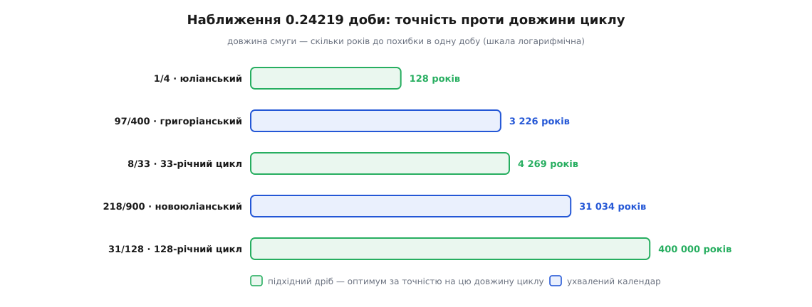
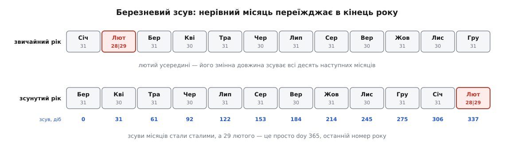
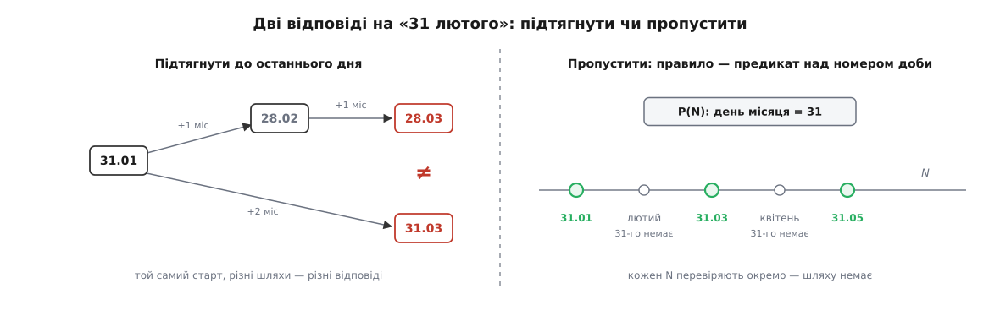

# 🧮 Математика календаря: високос, номер доби й точна арифметика дат

Календарна арифметика перестає бути купою крайових умов рівно тоді, коли дату замінюють одним цілим числом — порядковим номером доби. Тут — сама математика цієї заміни: звідки взявся дріб у правилі високосу, як замкнена формула переводить трійку «рік, місяць, день» у номер і назад, що після цього стає простим відніманням — і що не стає ним ніколи.

## Дріб, який довелося наближати

Тропічний рік — проміжок, за який Сонце вертається в ту саму точку відносно пір року — триває 365.24219 доби (середнє значення на епоху 2000 року; величина усталена, але повільно змінна). Календар лічить цілими добами. Отже, дробову частину 0.24219 доводиться наближати раціональним дробом p/q: вставляти p зайвих діб на кожні q років. **Будь-яке правило високосу — це такий дріб і нічого більше.**

Юліанське правило бере найпростіший з можливих:

```
1/4 = 0.25
похибка = 0.25 − 0.24219 = 0.00781 доби/рік
одна зайва доба назбирається за 1 / 0.00781 ≈ 128 років
```

Григоріанське правило лишає ту саму четвірку, але викидає вікові роки й вертає кожен четвертий з них. Порахуймо цикл:

```
високосів за 400 років:  400/4 − 400/100 + 400/400 = 100 − 4 + 1 = 97
діб у циклі:             400·365 + 97 = 146097
середній рік:            146097 / 400 = 365.2425 (рівно)
похибка:                 365.2425 − 365.24219 = 0.00031 доби/рік
одна доба за:            1 / 0.00031 ≈ 3226 років
```

Звідси й замкнена формула, на якій тримається все далі: **скільки високосних років минуло від початку ери до року y включно** —

```
L(y) = ⌊y/4⌋ − ⌊y/100⌋ + ⌊y/400⌋
L(400) = 100 − 4 + 1 = 97 ✓
```

Три ділення з підлогою замість перебирання років. Кутові дужки ⌊ ⌋ означають округлення вниз, і саме вниз, а не «до нуля»: різниця вилазить на від'ємних роках і на від'ємних остачах, і в обох випадках вона змінює відповідь. Коротко: [ділення з підлогою](root:math-number-theory/floor-division) — це та операція, де ⌊−7/4⌋ = −2, тоді як обтинання в бік нуля дає −1; у C, C++ і JavaScript оператор ділення обтинає, у Python `//` — підлога.

Тепер природне питання: чи 97/400 — найкраще наближення? Ні. Найкращі раціональні наближення дійсного числа дає розклад у [ланцюговий дріб](root:math-number-theory/continued-fractions) — послідовне «ціла частина, а решту перевернути»; підхідні дроби цього розкладу мінімізують похибку серед усіх дробів зі знаменником не більшим за їхній. Для 0.24219 розклад починається так:

```
0.24219 = 1/(4 + 1/(7 + 1/(1 + 1/(3 + 1/(24 + …)))))

підхідні дроби:   1/4    7/29     8/33      31/128
десятково:      0.2500  0.24138  0.242424  0.2421875
похибка/рік:   +0.00781 −0.00081 +0.000234 −0.0000025
одна доба за:    128 р    1234 р   4269 р    ≈400000 р
```

Дві речі впадають в око.

Перша: **8/33 точніше за 97/400**, хоч цикл коротший у дванадцять разів — 4269 років проти 3226. Підцикли по 33 роки справді трапляються в арифметичних схемах іранського сонячного календаря (це задокументовано; поширену прив'язку саме до Омара Хаяма подають як традицію, а не як перевірений факт).

Друга: 31/128 має похибку майже в сто разів меншу за григоріанську, а перевіряється двома масками, бо 128 = 2⁷:

```c
bool leap128(int y) { return (y & 3) == 0 && (y & 127) != 0; }
```

І ще одна дрібничка, яка пояснює збіг чисел вище. Різниця першого підхідного дробу й четвертого — точна:

```
1/4 − 31/128 = 32/128 − 31/128 = 1/128
```

Юліанський рік «біжить» рівно на 1/128 доби за рік швидше за 31/128 — тому одна доба набігає рівно за 128 років, і знаменник кращого наближення та період юліанського дрейфу — те саме число. Не збіг, а та сама рівність, прочитана двічі.



*Григоріанське 97/400 програє в точності 8/33 із циклом у дванадцять разів коротшим — обирали не найточніше, а найзручніше лічити.*

Чому ж тоді 97/400? Не через точність, а через читність у десятковій лічбі століть: «вікові роки високосні, коли діляться на 400» переказується словами й перевіряється в думці, а «крім кожного 128-го» — ні. Новоюліанський календар, який запропонував сербський науковець Мілутін Міланкович і ухвалив Константинопольський собор 1923 року, обрав 218/900 — 1 доба за ≈31 000 років, і цикл теж кратний сотні.

Про «400 000 років» варто сказати чесно: це арифметика, а не астрономія. Сам тропічний рік коротшає приблизно на 0.53 секунди за століття, тож будь-яка обіцянка точності далі за кілька тисяч років — про формулу, а не про Сонце.

> 🔧 **Навіщо це.** Правило `y mod 4 = 0 ∧ (y mod 100 ≠ 0 ∨ y mod 400 = 0)` не «майже щочотири роки», а точно щочотири — крім трьох вікових меж із чотирьох. Для щорічної дати 29 лютого це видно негайно:
>
> ```
> N(29.02.2028) − N(29.02.2024) = 1461 = 4·365 + 1
> N(29.02.2104) − N(29.02.2096) = 2921 = 8·365 + 1
> ```
>
> Бо 2100 ділиться на 100 й не ділиться на 400. Тест, який ганяє чотирирічний крок і не переступає 2100, 2200 та 2300, пройде — і збреше.

## Номер доби: як зробити календар лінійним

Мета — взаємно однозначна відповідність між датами й цілими числами: кожній даті рівно одне число, кожному числу рівно одна дата. Початок відліку обираємо довільно; візьмімо 1 січня 1970 року ↦ 0.

Заважає один місяць — лютий. Його змінна довжина стоїть **усередині** року, тож накопичений зсув кожного місяця від 1 січня залежить від високосності для всіх місяців з березня по грудень. Кожна формула обростає розгалуженням.

Хитрість, яка знімає розгалуження цілком: **почати рік з 1 березня**. Тоді додаткова доба стає останнім днем зсунутого року, зсуви всіх місяців перестають залежати від високосності, а високосність вирішує лише одне — чи є в році номер 365 понад номери 0…364.



*Та сама дюжина місяців, але нерівний з них — у кінці: тепер зсуви сталі, а 29 лютого — просто найбільший номер дня в році.*

Тепер самі зсуви. Від березня довжини йдуть так:

```
Бер 31  Кві 30  Тра 31  Чер 30  Лип 31 │ Сер 31  Вер 30  Жов 31  Лис 30  Гру 31 │ Січ 31  Лют 28/29
```

Дві п'ятірки місяців, і кожна дає рівно 31+30+31+30+31 = **153** доби. Тому зсуви березня, серпня й січня — 0, 153, 306, точні кратні 153. А всередині п'ятірки зсуви 0, 31, 61, 92, 122 — і це рівно ⌊(153k + 2)/5⌋:

```
k=0  ⌊  2/5⌋ =   0
k=1  ⌊155/5⌋ =  31
k=2  ⌊308/5⌋ =  61
k=3  ⌊461/5⌋ =  92
k=4  ⌊614/5⌋ = 122
```

Далі формула тягнеться сама, бо 153·5/5 = 153 — ціле, і воно виїжджає з-під підлоги:

```
⌊(153(k+5) + 2)/5⌋ = ⌊(153k + 2)/5⌋ + 153
```

П'ять перевірок плюс одна тотожність доводять формулу для всіх дванадцяти місяців — таблиця довжин більше не потрібна ніде. Ось що вона дає, з k = 0 для березня:

```
Бер   0   Кві  31   Тра  61   Чер  92
Лип 122   Сер 153   Вер 184   Жов 214
Лис 245   Гру 275   Січ 306   Лют 337
```

Лишилося зібрати номер. Оскільки 400 років — це рівно 146097 діб, рік розкладаємо на **еру** (номер чотирисотрічного циклу) і залишок усередині неї:

```
k    = m − 3, якщо m ≥ 3;  m + 9, якщо m ≤ 2
y    = y − 1, якщо m ≤ 2          (січень і лютий — кінець попереднього зсунутого року)
era  = ⌊y/400⌋
yoe  = y − 400·era                                     ∈ [0, 399]
doy  = ⌊(153k + 2)/5⌋ + d − 1                          ∈ [0, 365]
doe  = 365·yoe + ⌊yoe/4⌋ − ⌊yoe/100⌋ + doy             ∈ [0, 146096]
N    = 146097·era + doe − 719468
```

Стала 719468 нізвідки не впала — вона випадає з умови «1 січня 1970 має дати нуль»:

```
m = 1 ≤ 2  →  y = 1969,  k = 1 + 9 = 10
era = ⌊1969/400⌋ = 4          yoe = 1969 − 1600 = 369
doy = ⌊(153·10 + 2)/5⌋ + 0 = ⌊1532/5⌋ = 306
doe = 365·369 + ⌊369/4⌋ − ⌊369/100⌋ + 306
    = 134685 + 92 − 3 + 306 = 135080
N   = 146097·4 + 135080 = 584388 + 135080 = 719468
```

Тобто 719468 — це номер епохи в координатах ери; віднімання просто переносить початок відліку туди, куди нам зручно.

**Приклад: номери доби для 28 лютого й 1 березня 2026 року**

```
28.02.2026:  m = 2 ≤ 2  →  y = 2025,  k = 2 + 9 = 11
  era = ⌊2025/400⌋ = 5           yoe = 2025 − 2000 = 25
  doy = ⌊(153·11 + 2)/5⌋ + 27 = ⌊1685/5⌋ + 27 = 337 + 27 = 364
  doe = 365·25 + 6 − 0 + 364 = 9125 + 6 + 364 = 9495
  N   = 146097·5 + 9495 − 719468 = 730485 + 9495 − 719468 = 20512

01.03.2026:  m = 3 > 2  →  y = 2026,  k = 0
  era = 5                        yoe = 26
  doy = ⌊2/5⌋ + 0 = 0
  doe = 365·26 + 6 − 0 + 0 = 9490 + 6 = 9496
  N   = 730485 + 9496 − 719468 = 20513
```

Різниця — одиниця: дні сусідні, бо 2026 не високосний. Та сама формула для 29 лютого 2024 дає `doy = 337 + 28 = 365` — найбільший можливий номер у зсунутому році, точно як обіцяв березневий зсув.

Ось те саме кодом. Різниця між мовами тут не косметична: вона рівно в тому, як кожна робить цілочислове ділення.

:::tabs

```cpp
// C++: '/' обтинає в бік нуля, тож від'ємні роки треба зміщувати вручну
constexpr int days_from_civil(int y, int m, int d) noexcept {
    const int k = (m > 2) ? m - 3 : m + 9;          // Бер→0 … Гру→9, Січ→10, Лют→11
    y -= (m <= 2);                                  // січень і лютий — кінець попереднього року
    const int era = (y >= 0 ? y : y - 399) / 400;   // зсув −399 імітує підлогу
    const int yoe = y - era * 400;                  // [0, 399]
    const int doy = (153 * k + 2) / 5 + d - 1;      // [0, 365]
    const int doe = yoe * 365 + yoe / 4 - yoe / 100 + doy;   // [0, 146096]
    return era * 146097 + doe - 719468;
}
```

```python
def days_from_civil(y: int, m: int, d: int) -> int:
    k = m - 3 if m > 2 else m + 9
    y -= m <= 2
    era = y // 400              # '//' у Python — уже підлога, зсув не потрібен
    yoe = y - era * 400
    doy = (153 * k + 2) // 5 + d - 1
    doe = yoe * 365 + yoe // 4 - yoe // 100 + doy
    return era * 146097 + doe - 719468
```

```ts
function daysFromCivil(y: number, m: number, d: number): number {
  const k = m > 2 ? m - 3 : m + 9;
  if (m <= 2) y -= 1;
  const era = Math.floor(y / 400);   // цілочислового ділення немає — підлога явно
  const yoe = y - era * 400;
  const doy = Math.floor((153 * k + 2) / 5) + d - 1;
  const doe = yoe * 365 + Math.floor(yoe / 4) - Math.floor(yoe / 100) + doy;
  return era * 146097 + doe - 719468;
}
```

:::

Зворотне перетворення — та сама алгебра, прочитана навспак:

```python
def civil_from_days(n: int) -> tuple[int, int, int]:
    n += 719468
    era = n // 146097
    doe = n - era * 146097                                      # [0, 146096]
    yoe = (doe - doe//1460 + doe//36524 - doe//146096) // 365    # [0, 399]
    y   = yoe + era * 400
    doy = doe - (365*yoe + yoe//4 - yoe//100)                   # [0, 365]
    k   = (5*doy + 2) // 153                                    # [0, 11]
    d   = doy - (153*k + 2)//5 + 1                              # [1, 31]
    m   = k + 3 if k < 10 else k - 9
    return (y + (m <= 2), m, d)
```

Три поправки в рядку з `yoe` віднімають назад ті доби, що їх вставили ⌊yoe/4⌋, ⌊yoe/100⌋ і ⌊yoe/400⌋. Сталі 1460 = 4·365, 36524 = 100·365 + 24 і 146096 = 400·365 + 96 — це довжини чотирирічного, столітнього й чотирисотрічного пробігів **без тієї високосної доби, що їх замикає**; саме через це ділення на межі падає на потрібний бік, а не на сусідній рік. Рядок `k = (5·doy + 2)/153` обертає формулу зсуву: множник 5 і дільник 153 просто міняються місцями.

Перевіряти таку пару найпростіше повним обходом: пройти всі дати з 1800 по 2400 рік — 219 145 діб, частка секунди — і переконатися, що `civil_from_days(days_from_civil(y, m, d))` вертає початкову трійку, а сам номер збігається з різницею дат, яку рахує стандартна бібліотека. Ця пара такий обхід проходить без жодної розбіжності.

## Що дає лінійність

Коли дата — ціле число, чотири операції стають безумовними.

**Різниця дат** — віднімання. Скільки діб між 28 лютого й 1 березня 2026 року? 20513 − 20512 = 1. Жодного циклу по місяцях, жодної перевірки високосності.

**Додати n діб** — додавання. І воно чесне на межах: 19782 + 365 дає 20147, тобто 29 лютого 2024 плюс 365 діб — це 28 лютого 2025, а не «29 лютого 2025».

**Порівняння** — звичайне порівняння цілих.

**День тижня** — остача. Ось де номер доби окупається найдужче: тижневий цикл рівний, а нерівним був лише календар — тепер він розпрямлений, і день тижня падає з [модульної арифметики](root:math-number-theory/modular-arithmetic), тобто зі звичайної остачі від ділення, без жодної таблиці:

```
wd(N) = (N + 4) mod 7,    0 = неділя, 1 = понеділок, … 6 = субота
```

Четвірка стоїть тому, що 1 січня 1970 (N = 0) припадало на четвер, а четвер — четвертий, якщо лічити від неділі.

> 🔧 **Навіщо це.** Тримати дату цілим числом діб, а не дробовою кількістю секунд, — не про економію пам'яті, а про точність. Число [з рухомою комою](root:hw-arch/floating-point) зберігає скінченну кількість значущих цифр, тож на великих значеннях сусідні секунди перестають розрізнятися, а сума кількох додавань залежить від порядку. Ціле число діб таких сюрпризів не має взагалі: скільки не додавай і в якому порядку, результат один. Тому календарну частину задачі свідомо відрізають від годинникової — номер доби не несе в собі жодної інформації про час доби, і саме тому лишається точним.

Тепер порахуймо щось справжнє. **Останній день місяця** без таблиці довжин:

```
L(y, m) = N(y, m+1, 1) − 1
```

Для грудня це працює без окремої гілки: у березневій координаті m = 13 дає k = 10, тобто зсув січня в тому самому зсунутому році — а це і є січень наступного цивільного року. Підстановка підтверджує: N(2026, 13, 1) = N(2027, 1, 1) = 20819. Березневий зсув оплатив ще й це.

**Остання п'ятниця місяця** — замкнена формула, без обходу днів назад:

```
остання_W(y, m) = L − ((wd(L) − W) mod 7)
```

**Приклад: остання п'ятниця березня 2026 року**

```
L      = N(01.04.2026) − 1 = 20544 − 1 = 20543        (31.03.2026)
wd(L)  = (20543 + 4) mod 7 = 20547 mod 7 = 2          (вівторок)
W      = 5                                            (п'ятниця)
зсув   = (2 − 5) mod 7 = (−3) mod 7 = 4
відповідь = 20543 − 4 = 20539                          →  27.03.2026
```

Тут і вилазить друга зустріч із підлогою: `mod` у формулі — математична остача, невід'ємна завжди. Оператор `%` у C, C++ і JavaScript дає для −3 саме −3, тож писати доводиться `((a % 7) + 7) % 7`, інакше остання п'ятниця з'їде на чотири дні вперед — у наступний місяць.

Дзеркальна задача, «k-та п'ятниця від початку», теж замикається:

```
F       = N(y, m, 1)
перша_W = F + ((W − wd(F)) mod 7)
k-та_W  = перша_W + 7·(k − 1),     існує ⟺ k-та_W ≤ L
```

Умова існування — не формальність, а відповідь на живе питання «а буває п'ята п'ятниця?». Розкрий її: п'ята є тоді й лише тоді, коли перша припадає не пізніше ніж на (довжина місяця − 28)-ме число.

```
довжина місяця 31  →  перша п'ятниця 1, 2 або 3 числа
довжина місяця 30  →  перша п'ятниця 1 або 2 числа
довжина місяця 29  →  лише 1 числа
довжина місяця 28  →  ніколи
```

Останній рядок — не окремий випадок, а тотожність: 28 = 4·7, тож у невисокосному лютому кожен день тижня трапляється рівно чотири рази, і п'ятого не буває в принципі.

## Чому «плюс місяць» — не додавання

Місяці мають власну пряму, і на ній усе так само добре:

```
k = 12y + (m − 1)        обернено:  y = ⌊k/12⌋,  m = (k mod 12) + 1
```

Додати n місяців до пари «рік, місяць» — точне додавання, без крайових випадків. Лихо приходить із третьою складовою: відображення (y, m, d) ↦ (y′, m′, d) **часткове** — d може перевищити довжину нового місяця. Полагодити це можна двома способами, і лише один з них не ламає алгебру.

**Спосіб перший — підтягнути.** Кладемо d′ = min(d, довжина(m′)). Відображення стало всюди визначеним — і втратило дві властивості, без яких повторення не має сенсу.

Воно перестало бути **взаємно однозначним**:

```
28.01 + 1 міс = 28.02
30.01 + 1 міс = 28.02
31.01 + 1 міс = 28.02        ← три різні дати злилися в одну
```

І кроки в ньому перестали **додаватися**: крок, повторений двічі, не дорівнює подвійному кроку.

```
(31.01.2025 + 1 міс) + 1 міс = 28.02 + 1 міс = 28.03.2025
 31.01.2025 + 2 міс                         = 31.03.2025
```

Тобто відповідь залежить від того, **як ішли**, а не тільки звідки й куди. Правило повторення, чий n-й член залежить від маршруту, не має визначеного n-го члена взагалі: одна реалізація, що крокує по місяцю, і друга, що стрибає одразу, побудують з одного рядка правила два різні календарі.



*Ліворуч — операція, що залежить від маршруту; праворуч — умова, у якої маршруту немає.*

**Спосіб другий — пропустити.** Не лагодити відображення, а замінити його на предикат над прямою номерів:

```
S = { N ∈ ℤ : P(civil(N)) }
```

де P — умова правила. Для «31-го числа» це P(y, m, d) ⟺ d = 31. Кожен N перевіряють незалежно від решти, тож маршруту не існує в принципі; S — підмножина впорядкованої множини, її n-й елемент визначений однозначно, і будь-які дві реалізації, що збігаються в P, збігаються в S. **Ось математична причина, чому стандарт велить пропускати, а не підтягувати: підтягування — не коректно визначена операція над повторенням, а пропускання — коректна.**

Потужності рахуються негайно:

```
d = 31   →  7 спрацювань на рік   (місяці 1, 3, 5, 7, 8, 10, 12)
d = 30   →  11 спрацювань на рік  (усі, крім лютого)
d = 29 при m = 2  →  одне на високосний рік
```

А «останній день місяця» — теж предикат, не латка: P(N) ⟺ N = L(y, m). Він не пропускає ніколи, бо останній день є в кожному місяці. Дві різні на вигляд вимоги — «31-го» й «в кінці місяця» — це два різні предикати, і плутати їх нічого не змушує.

## Період у 400 років

У числа 146097 є ще одна властивість, і вона теж робить роботу:

```
146097 = 7 · 20871      (остача 0)
```

Довжина григоріанського циклу націло ділиться на сім. Отже, зсув дати на 400 років зсуває її номер на 146097 ≡ 0 (mod 7) — і день тижня не змінюється. Календар повторюється точно кожні 400 років разом із днями тижня; різних місяців у циклі рівно 400·12 = 4800, тож будь-яке питання виду «як часто 13-те число припадає на п'ятницю» має точну скінченну відповідь, яку дістають лічбою, а не статистикою.

Обхід повного циклу дає:

```
неділя 687 · понеділок 685 · вівторок 685 · середа 687
четвер 684 · п'ятниця 688 · субота 684          (разом 4800)
```

Тринадцяте справді трапляється в п'ятницю трохи частіше, ніж будь-якого іншого дня — 688 проти 684. Це теорема про розподіл остач у періодичній послідовності, а не забобон; результат відтворюється прямим перебором циклу й збігається з опублікованими таблицями розподілу.

З тієї самої сталої випадає корисне число — середній місяць:

```
146097 / 4800 = 30.436875 доби
```

Через це звичне «місяць — це 30 днів» бреше на 1.44 %, тобто на 12 · 0.436875 = 5.24 доби за рік. Наближення нешкідливе, поки його не підставляють у повторення: тридцятиденний крок, повторений дванадцять разів, від'їжджає від тієї самої календарної дати більш ніж на п'ять діб.

Уся календарна математика зводиться, отже, до двох сталих — 146097 і 7 — та однієї формули з п'ятьма цілочисловими діленнями. Дата вкладається в 32-бітове ціле з дикунським запасом: 2³¹ діб — це близько 5.9 мільйона років в обидва боки, тоді як сама григоріанська арифметика має сенс на кілька тисяч років довкола нас, поки тропічний рік не поїде. Точність обчислення й точність моделі — різні речі, і тут довший запас має саме обчислення.
