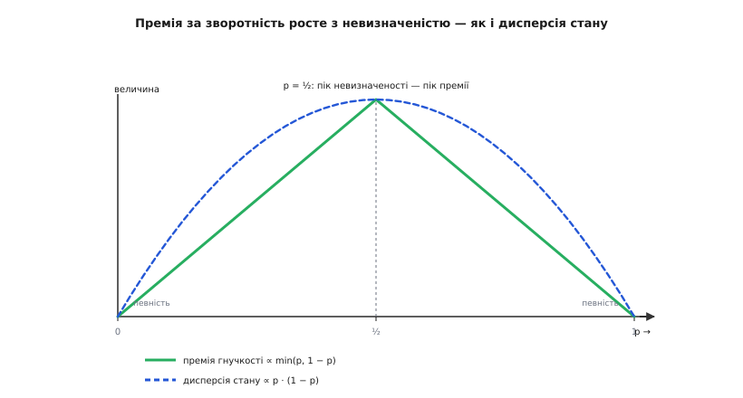

# 🧮 Математика реальних опціонів

Зворотність рішення — не просто зручність і не риса вдачі обережного архітектора. Вона має **ціну в грошах**, і ту ціну можна вивести з першопринципів, а не відчути на дотик. Корінь її — в **опціоні** (від лат. *optio* — вільний вибір): у праві, але не обов'язку, зробити вибір згодом, коли туман розвіється. Тримати двері двобічними означає володіти таким опціоном; продавити незворотне — означає його спалити. А будь-який опціон, фінансовий він чи архітектурний, має вимірну вартість — і зараз ми її обчислимо.

Мета цього розбору — провести один ланцюжок до самого дна. Спершу показати, чому «почекати й обрати» ніколи не гірше за «обрати наперед». Тоді — чому цей розрив дорівнює саме тому, що математики звуть розривом Єнсена на опуклій функції, і як він росте з невизначеністю й з часом. І нарешті — як із цієї єдиної премії строго випадають два робочі правила: знамените «вирішуй десь на 70%» і поріг, за яким варто ставити шов, `p > C/(R−r)`. Наприкінці все зійдеться на одному числовому прикладі — оцінці відкладеного вибору сховища.

## Дві політики під невизначеністю

Зведімо будь-яке архітектурне рішення до голого кістяка. Є набір **дій** *A*, з яких треба вибрати одну (побудувати просто чи масштабовано; узяти реляційну базу чи документну). Є **стан світу** *s*, який поки невідомий і проясниться згодом (попит виявиться низьким чи вибухне; доступ до даних ляже реляційно чи документно). І є **виграш** — функція `v(a, s)`, що каже, скільки цінності дасть дія *a*, якщо світ обернеться станом *s*.

Тепер — дві політики, і вся різниця між зворотним і незворотним рішенням саме в тому, яка з них тобі доступна.

**Політика «вирішити зараз»** (жорстка, незворотні двері): ти мусиш обрати дію **до** того, як побачив стан. Найкраще, на що можна розраховувати, — узяти ту дію, що в середньому по всіх можливих світах дає найбільше:

```
V_жорстко = max  E[ v(a, s) ]        ← спершу усереднюємо, потім вибираємо
             a    s
```

**Політика «почекати й обрати»** (гнучка, зворотні двері): ти ставиш дешеву тимчасову форму, дочікуєшся, поки стан проявиться, і аж тоді береш дію — вже знаючи, який світ настав. У кожному світі візьмеш найкраще для нього:

```
V_гнучко = E [ max  v(a, s) ]        ← спершу вибираємо в кожному світі, потім усереднюємо
            s   a
```

Різниця цих двох чисел і є та величина, заради якої написана вся стаття-власник, — **премія за зворотність**, грошова цінність права вирішувати пізніше:

```
Π = V_гнучко − V_жорстко = E[ max v(a,s) ] − max E[ v(a,s) ]
                             s    a            a    s
```

Зверніть увагу, що обидві формули складені з тих самих `v(a,s)` і тієї самої невизначеності — відрізняються **лише порядком** двох операцій: усереднення `E` та вибору `max`. Уся цінність гнучкості захована в тому, що ці дві операції **не переставні**. Розберімо, чому переставити їх не можна, і в який бік завжди хилиться нерівність.

## Чому гнучкість ніколи не коштує від'ємно: E[max] ≥ max[E]

Почнімо з найпростішого й найсильнішого твердження, з якого виросте все інше. **Обрати після того, як побачив, ніколи не гірше, ніж обрати наперед.** Формально:

```
E[ max v(a,s) ]  ≥  max E[ v(a,s) ]
 s    a               a   s
```

Доведення коротке й не потребує жодних припущень про розподіл станів чи форму виграшу — саме тому воно таке надійне. Візьмімо будь-яку одну фіксовану дію *b* — хоч ту, яку обрала б жорстка політика. Для **кожного** окремого стану *s* правдиве очевидне:

```
max v(a,s)  ≥  v(b,s)        ← максимум по діях не менший за будь-яку одну дію
 a
```

Це просто означення максимуму. А тепер головний крок: **усереднення зберігає нерівність** — якщо ліве не менше правого в кожному стані, то й середнє лівого не менше середнього правого:

```
E[ max v(a,s) ]  ≥  E[ v(b,s) ]
 s    a              s
```

Але *b* тут — будь-яка дія. Нерівність тримається для всіх *b* одразу, зокрема й для тієї, що дає найбільше праворуч. Візьмімо саме її — і дістанемо те, що хотіли:

```
E[ max v(a,s) ]  ≥  max E[ v(b,s) ]           ∎
 s    a               b   s
```

Інтуїція за цими рядками така: **поточкова перевага переживає усереднення**. Гнучка політика в кожному окремому світі бере рівно те, що взяла б жорстка, або краще — ніколи не гірше. Тому і в середньому вона не програє. А от вигравати вона починає рівно тоді, коли **найкраща дія в різних світах різна**: якщо в світі L найкраще одне, а в світі H — інше, жорсткий вибір мусить застрягти в одному рядку на всі випадки, а гнучкий щоразу знімає верхівку. Якщо ж найкраща дія та сама в усіх світах, невизначеність ні на що не впливає, `Π = 0`, і зворотність не варта нічого. **Премія народжується не з невизначеності самої собою, а з невизначеності, що змінює правильну відповідь.**

## Опуклість: премія — це розрив Єнсена

Нерівність `E[max] ≥ max[E]` каже, що премія невід'ємна, але не каже, скільки вона. Щоб дійти до «скільки», треба побачити за нею геометрію — і тут з'являється опуклість.

Означмо **функцію цінності** — те, що дасть гнучка політика, якщо світ виявиться станом *s*:

```
V(s) = max v(a, s)        ← верхня обгортка виграшів усіх дій
        a
```

Кожна окрема дія — це своя крива `v(a, ·)` над віссю станів. У найпростішому й найчастішому випадку кожна з них — **пряма** (виграш лінійно залежить від попиту, навантаження, обсягу). А `V(s)` бере в кожній точці найвищу з них. І тут ключове спостереження: **максимум прямих — це опукла ламана**. Візьміть дві прямі, що перетинаються; їхня верхня обгортка йде вниз по одній до перетину, тоді вгору по другій — виходить «галочка» ∨, що завжди прогинається донизу. Ніколи навпаки. Строго: для будь-яких `s₁, s₂` і `θ ∈ [0,1]`

```
V(θs₁ + (1−θ)s₂) = max v(a, ·) ≤ max [θ·v(a,s₁) + (1−θ)·v(a,s₂)]
                    a            a
                                 ≤ θ·V(s₁) + (1−θ)·V(s₂)
```

— значення в середній точці не вище за хорду, а це і є означення опуклості. Опуклість тут не випадкова: вона — **математичний відбиток самого права вибору**. Опціон завжди має опуклий, зламаний виграш, бо ти береш верх кожного світу й відрізаєш низ, перемкнувшись на іншу дію. Злам — це і є свобода вибору.

Тепер — теорема, що перетворює опуклість на число. **Нерівність Єнсена**: для опуклої функції *V* і випадкового стану *s* середнє від функції не менше за функцію від середнього:

```
E[ V(s) ]  ≥  V( E[s] )
```

Її 1906 року довів данський математик **Йоган Єнсен** (Johan Jensen) у праці «Sur les fonctions convexes et les inégalités entre les valeurs moyennes» (*Acta Mathematica*); там-таки він увів і сучасне означення опуклої функції. Окремий випадок для двічі-диференційовних функцій ще 1889-го дав німець **Отто Гельдер** (Otto Hölder) — статус: усталений математичний факт, не спірне авторство.

Лишилося з'єднати Єнсена з нашою премією — і тут криється точна тотожність. Коли виграш **лінійний** по стану, усереднити його все одно, що підставити середній стан: `E[v(a,s)] = v(a, E[s])`. Тоді жорстка політика дає рівно значення функції цінності в середній точці:

```
V_жорстко = max E[v(a,s)] = max v(a, E[s]) = V( E[s] )
             a               a
```

А гнучка політика — це просто `V_гнучко = E[V(s)]`. Підставмо обидва в означення премії:

```
Π = V_гнучко − V_жорстко = E[ V(s) ] − V( E[s] )
                            └──────────────────┘
                              розрив Єнсена
```

Ось воно. **Грошова цінність зворотності дорівнює рівно тому розриву, який опуклість відкриває між середнім від виграшу й виграшем від середнього.** Не «схожа на», не «поводиться як» — дорівнює. Премія за гнучкість, вартість реального опціону й розрив Єнсена — це три імені одного числа.

![Дві дії як прямі над віссю стану: «просте» спадає, «масштабоване» зростає; їхня верхня обгортка — опукла галочка V(s). Хорда між крайніми станами лежить на рівні E[V]=9, а прогин обгортки в середній точці — це V(E[s])=6. Вертикальний розрив між ними, Π=3, і є премія за зворотність](img/jensen-gap.svg)
*Хорда, що з'єднує виграші в крайніх станах, лежить над прогнутою обгорткою; її висота над кривою в середній точці — це рівно розрив Єнсена. Жорстка політика застрягає внизу, на кривій; гнучка піднімається на хорду, бо усереднює вже готові максимуми. Проміжок між ними — премія за право обрати після того, як дізнався.*

> 🔧 **Навіщо це.** Коли хтось каже «а нащо нам ця гнучкість, порахуй», у нього тепер є що порахувати. Цінність зворотності — не відчуття, а конкретне число: настільки, наскільки «обрати найкраще в кожному світі» перевищує «обрати одне на всі світи наперед». Якщо правильна дія однакова, хоч як обернеться майбутнє, — розрив нульовий, і платити за оборотність немає за що. Якщо ж різні світи вимагають різних дій, а майбутнє туманне — розрив додатний, і саме він каже, скільки максимум варто витратити, щоб залишити двері двобічними.

## Скільки саме: премія росте з дисперсією

Розрив Єнсена невід'ємний — це ми довели. Але наскільки він великий? Відповідь керує всім практичним: чи варто взагалі морочитися зі зворотністю в цьому конкретному місці.

Візьмімо гладку опуклу *V* і розкладімо її біля середнього стану `μ = E[s]` у ряд Тейлора до другого порядку:

```
V(s) ≈ V(μ) + V′(μ)·(s − μ) + ½·V″(μ)·(s − μ)²
```

Усереднимо по *s*. Лінійний доданок зникає, бо `E[s − μ] = 0` (відхилення від середнього в середньому нульове). Квадратичний дає дисперсію, бо `E[(s − μ)²] = Var(s) = σ²`. Лишається:

```
Π ≈ ½ · V″(μ) · σ²
```

Проста й багата формула. Читаймо її по множниках. По-перше, `V″ ≥ 0` (функція опукла) — премія знову невід'ємна, тепер з іншого боку. По-друге, `Π ∝ σ²`: **премія за зворотність прямо пропорційна дисперсії стану**. Немає невизначеності (`σ = 0`) — немає й премії: коли майбутнє відоме напевно, право почекати не варте нічого, вирішуй зараз. Що ширший розкид можливих майбутніх, то дорожча гнучкість. По-третє, множник `V″` — це **кривина**, гострота зламу: наскільки різко найкраща дія перемикається між світами. Гострий злам (світи вимагають геть різного) — велика премія; пологий (дії майже байдужі до світу) — мала.

Той самий висновок видно й на дискретному, двоточковому світі — без похідних. Хай стан набуває двох значень: H з імовірністю *p* і L з імовірністю `1 − p`, а дві дії симетрично міняються місцями (у L перемагає одна на величину «розкид», у H — друга на ту саму величину). Пряма арифметика дає красиву формулу:

```
Π = розкид · min(p, 1 − p)
```

Розберімо її. Множник `min(p, 1−p)` дорівнює нулю на краях (`p = 0` або `p = 1` — світ визначений наперед, премія зникає) і максимальний рівно посередині, при `p = ½` — на піку невизначеності. Це та сама історія, що й `½·V″·σ²`, лише мовою монетки: адже й дисперсія самої монетки, `p(1−p)`, поводиться так само — нуль на краях, максимум при `p = ½`. Обидві криві — і премія, і дисперсія — горбами тягнуться до середини й гаснуть на певності.


*Премія за зворотність і дисперсія стану ростуть разом: обидві найбільші під найгострішою невизначеністю (50 на 50) і згасають до нуля, щойно майбутнє стає певним. Реальний опціон найдорожчий саме там, де ти найменше знаєш, — і нічого не вартий там, де все зрозуміло наперед.*

Практичний висновок із цього розділу один, зате твердий: **шукати зворотність варто там, де дисперсія висока** — де справді не знаєш, як обернеться, і де різні розв'язки світу вимагають різних архітектур. Де майбутнє прозоре, оборотність — викинуті гроші.

## Вимір часу: горизонт і option value of waiting

Дисперсія — не застигла величина; вона **набігає з часом**, і це додає премії другий вимір. Якщо стан блукає випадково (модель, звична для попиту, навантаження, цін), його дисперсія росте лінійно з горизонтом: стандартне відхилення тягнеться як `σ√t`, а отже дисперсія — як `σ²·t`. Підставмо в нашу оцінку премії:

```
Π(t) ≈ ½ · V″ · σ² · t        ← що довший горизонт очікування, то більший опціон
```

Що далі в майбутнє ти можеш зазирнути, перш ніж зобов'язатися, то більше невизначеності встигне розв'язатися й то цінніший опціон почекати. Саме цей механізм першими системно розробили економісти **Авінаш Діксіт** (Avinash Dixit) і **Роберт Піндайк** (Robert Pindyck) у книзі «Investment under Uncertainty» (Princeton University Press, 1994). Їхній центральний результат — **цінність очікування** (option value of waiting): якщо інвестиція **незворотна**, майбутні віддачі **непевні**, а невизначеність із часом проясняється, то очікувана цінність можливості почекати завжди більша за цінність рішення, ухваленого негайно. Сам термін «реальний опціон» (real option) увів іще раніше **Стюарт Маєрс** (Stewart Myers) у праці «Determinants of Corporate Borrowing» (*Journal of Financial Economics*, 1977): багато активів фірми — не гроші тут і тепер, а право зробити вибір потім, і воно має ціну. Архітектурне рішення — рівно такий реальний опціон. І це формальний корінь спостереження економіста **Енріко Заніното** (Enrico Zaninotto), що незворотність — джерело складності: продавити незворотне означає спалити опціон, а отже втратити право дочекатися прояснення й натомість мусити **наперед** прорахувати всі майбутні стани, жоден з яких уже не переграєш. Опціонний розрив `Π` — це рівно та цінність, яку спалює незворотність.

Але якби очікування лише додавало, оптимальна стратегія була б «чекати вічно» — а це безглуздя. Отже, у чекання є й ціна, що теж росте з часом: дисконтування (гроші завтра дешевші за гроші сьогодні), проґавлена цінність, ерозія конкурентної переваги. Оптимальний момент — там, де ці дві сили врівноважуються. Саме цей баланс архітектори звуть [останнім відповідальним моментом](topic:sf-apps/last-responsible-moment) — миттю, після якої зволікання вже саме нищить важливу альтернативу, і тягнути далі дорожче, ніж вирішити. Виведімо його точно — і побачимо, звідки береться загадкове число 70%.

## Правило 70%, виведене строго

Змоделюймо дві сили чисто. Хай **залишковий жаль** — очікувана шкода від того, що ти вирішуєш уже зараз, наосліп, — з часом тане в міру накопичення знання:

```
ρ(t) = ρ₀ · e^(−λt)        ρ₀ — жаль на старті, λ — швидкість, з якою вчишся
```

Тоді **виграш від очікування** до моменту *t* (проти рішення в нульовий момент) — це весь жаль, який ти встиг здихатися:

```
G(t) = ρ₀ − ρ(t) = ρ₀·(1 − e^(−λt))
```

А його гранична (за одиницю часу) вигода — похідна, і вона **спадає**: легке й велике ти дізнаєшся першим, останні крихти певності здобуваються найповільніше:

```
G′(t) = ρ₀·λ·e^(−λt)        ← гранична цінність зачекати ще трохи (спадає з часом)
```

**Ціна зволікання** росте; у найпростішому вигляді — лінійно, з постійною граничною ставкою `k` (дисконт плюс усе проґавлене за одиницю часу):

```
D(t) = k·t        →        D′(t) = k        ← гранична ціна зволікання (стала)
```

Чистий зиск від очікування до *t* — це `N(t) = G(t) − D(t)`. Максимізуймо: прирівняймо граничну вигоду до граничної ціни, `N′(t*) = 0`:

```
ρ₀·λ·e^(−λt*) = k
        e^(−λt*) = k / (ρ₀·λ)
              t* = (1/λ)·ln( ρ₀·λ / k )
```

(Друга похідна `N″ < 0` — це справді максимум, а не мінімум.) Ось він, **останній відповідальний момент**, виведений із першопринципів: чекай, доки гранична цінність знання перевищує граничну ціну зволікання; щойно вони зрівнялися — вирішуй, бо далі очікування вже коштує більше, ніж дає.

Тепер — головний фокус. Спитаймо не «коли», а «скільки знання ти вже маєш» у цей момент. Повнота знання — це частка збутого жалю:

```
I(t) = 1 − e^(−λt) = 1 − ρ(t)/ρ₀
```

Підставмо `e^(−λt*) = k/(ρ₀λ)`:

```
I(t*) = 1 − k / (ρ₀·λ)
```

**Оце й є правило 70% — і воно не магічне число, а конкретна формула.** Частка знання, з якою слід діяти, дорівнює одиниці мінус відношення граничної ціни зволікання до початкової швидкості навчання. Візьміть реалістичне `k/(ρ₀λ) = 0.30` (ціна зачекати добу — десь третина того, що дає перша доба навчання) — і дістанете `I(t*) = 0.70`, рівно 70%. Це не підгонка: 70% — типове значення виразу `1 − k/(ρ₀λ)` за звичайних для незворотних рішень співвідношень.

А чому не 90%? Бо 90% вимагало б `k/(ρ₀λ) = 0.10` — щоб зволікання було вдесятеро дешевше за початкове навчання. Для незворотного, але **пекучого** рішення так не буває: остання десятина певності лежить на пласкому хвості кривої `I(t)`, де кожен новий відсоток знання коштує все дорожчого очікування. Полювати за ним — платити багато за майже нічого.


*Останній відповідальний момент — перетин спадної граничної цінності знання зі сталою граничною ціною зволікання. У цій точці ти вже здихався ~70% залишкового жалю; решта 10% до дев'яноста лежать на пласкому хвості, де знання додається повільно, а очікування коштує дорого. «70%» — це рівно `1 − (ціна зволікання)/(швидкість навчання)`.*

І остання нитка, що зв'язує це із зворотністю. Уся ця арифметика очікування має сенс **лише перед однобічними дверима**. Якщо двері двобічні, `ρ₀ ≈ 0` — здихуватися нема чого, бо помилку однаково виправиш дешево, — і тоді `N′(0) < 0`, тобто `t* = 0`: вирішуй **негайно**, не чекай ні хвилини. Правило 70% — це напучення для незворотних рішень під невизначеністю, що проясняється. Для зворотних правило інше й простіше: не думай, просто зроби й, якщо треба, переграй.

## Ціна купити зворотність: поріг шва p > C/(R−r)

Досі ми рахували, скільки зворотність **варта**. Але зворотність рідко дається задарма — її здебільшого доводиться **виробляти**, і в неї є своя ціна. Найпоширеніший інструмент виробництва — **шов** (англ. *seam*): тонкий інтерфейс на кшталт [портів і адаптерів](topic:sf-apps/hexagonal-architecture), за яким сховано конкретний незворотний вибір, так що поміняти його означає переписати лише те, що за швом. Шов — це буквально куплений опціон. Порахуймо, коли його варто купувати.

Порівняймо два світи; у кожному ймовірність, що згодом доведеться передумати й міняти вибір, дорівнює *p*.

```
без шва:  очікувані витрати = p·R          R — дорогий відкат (правити скрізь)
зі швом:  очікувані витрати = C + p·r       C — постійна ціна шва, r — дешевий відкат (r « R)
```

Шов вигідний, коли зі швом дешевше. Розв'яжімо нерівність:

```
C + p·r  <  p·R
C        <  p·R − p·r
C        <  p·(R − r)
p        >  C / (R − r)          ← поріг імовірності передумати
```

Це той самий поріг, що фігурує в темі-власнику, — але тепер видно, що він **не постульований, а виведений**, і бачити його треба саме як умову покупки опціону. Ліва частина, `p·(R − r)`, — це **премія зворотності від шва**: очікувана економія на відкаті, той самий розрив Єнсена, лише прикладений до конкретного вибору. Права, `C`, — **ціна опціону**: скільки коштує його виготовити й тримати. Правило зводиться до одного речення, що об'єднує всю статтю: **купуй зворотність, коли її премія перевищує її ціну.** Не «завжди роби шви» й не «ніколи», а рівно там, де `p·(R − r) > C`.

Звідси й розуміння, де шви окупаються, а де ні. Дорогий відкат `R` (велика гравітація даних, широкий радіус) і відчутна ймовірність передумати `p` (висока дисперсія майбутнього) штовхають ліву частину вгору — шов легко окупається: сховище, зовнішній платіжний провайдер, конкретна хмарна служба. А якщо `R` мале (рішення й так локальне, стану не накопичує) або `p` мізерне (майбутнє тут прозоре) — ліва частина падає нижче `C`, і шов лише додає ваги задарма. Естетика «гарної архітектури» тут ні до чого; вирішує нерівність.

## Числовий приклад: відкладений вибір сховища

Зберімо все на одному живому рішенні — найтвердіших, за гравітацією даних, дверях. Ми будуємо систему й не знаємо наперед, яка форма доступу до даних переможе: чи ляже все реляційно (складні з'єднання, транзакції — тоді Postgres), чи документно (денормалізовані записи, високий потік — тоді документна база). Обрати треба вже, а правда з'ясується лише за кілька місяців роботи на живому. Це класичний реальний опціон.

**Умова.** Міграція живих даних із помилково обраного сховища в правильне коштує `R = 40` людино-днів (дані мають вагу — це не правка коду, а перекладання всього накопиченого стану без утрати рядка). Якщо заздалегідь просунути [шов](topic:sf-apps/hexagonal-architecture) — репозиторій-інтерфейс, за яким конкретна база захована, — та ще й покатати [walking skeleton](topic:sf-apps/walking-skeleton) (тонкий наскрізний зріз, що вже працює від краю до краю на тимчасовому сховищі, поки визрівають справжні патерни доступу), то навіть переїзд коштуватиме лише `r = 3` людино-дні. Сам шов плюс скелет — постійні `C = 5` людино-днів. Невизначеність щира: `p = 0.5`, шанси вгадати форму — рівно 50 на 50.

```py
def seam_worth_it(p, R, r, C):
    cost_no_seam = p * R          # очікуваний відкат без шва
    cost_seam    = C + p * r      # шов коштує C завжди + дешевий відкат r
    premium      = p * (R - r)    # премія зворотності від шва (розрив Єнсена тут)
    threshold    = C / (R - r)    # поріг імовірності передумати
    return cost_seam < cost_no_seam, threshold, premium, cost_no_seam - cost_seam

# сховище: R=40, r=3, C=5 (людино-дні), p=0.5 — 50/50, що форма доступу вгадана
worth, p_star, premium, saving = seam_worth_it(0.5, 40, 3, 5)
#   без шва      = 0.5 · 40          = 20.0 людино-дня очікуваного відкату
#   зі швом      = 5 + 0.5 · 3       =  6.5 людино-дня
#   премія       = 0.5 · (40 − 3)    = 18.5 людино-дня (стільки зворотність тут варта)
#   поріг p*     = 5 / (40 − 3)      ≈ 0.135 = 13.5%
#   worth = True,  економія = 20.0 − 6.5 = 13.5 людино-дня
```

**Висновок.** Премія зворотності тут — 18.5 людино-дня; ціна опціону — 5. Оскільки `18.5 > 5` (а рівнозначно `p = 0.5` набагато більше за поріг `p* ≈ 0.135`), шов однозначно окупається: чиста економія 13.5 людино-дня проти того, щоб зашити конкретну базу в логіку й молитися, що вгадав. Відкладений, оборотний вибір сховища виграє в жорсткого не тому, що «так правильніше», а на конкретні 13.5 людино-дня очікуваної вартості.

Тепер — найважливіше: **як рішення повзе з невизначеністю**. Прогнавши той самий розрахунок для різних *p*, дістаємо поріг у дії:

```
p       премія p·(R−r)    ціна C    рішення
─────   ──────────────    ──────    ───────────────────────────────
0.05        1.85            5        НЕ став шов (премія < ціна)
0.135       5.00            5        байдуже — точка беззбитковості
0.30       11.10            5        став шов (чистий зиск +6.1)
0.50       18.50            5        став шов (чистий зиск +13.5)
```

Читається прямо: коли ти майже певний форми доступу (`p = 0.05`), премія падає нижче ціни шва — не мороч голови, візьми базу прямо й локально. Коли невизначеність щира (`p = 0.30` і вище) — шов окупається з запасом. Це та сама залежність від дисперсії, що й у формулі `Π ≈ ½·V″·σ²`, лише в грошах і на конкретному рішенні: **під певністю оборотність — викинуті гроші, під невизначеністю — вигідна покупка.**

І остання перевірка — на гравітацію даних. Якби сховище було майже без стану (скажімо, короткий кеш, що переїжджає за `R = 8` людино-днів замість 40), поріг стрибнув би до `p* = C/(R−r) = 5/5 = 1.0` — тобто шов не окупається **ніколи**, бо його ціна з'їдає всю можливу економію. Ось чому шви ставлять довкола баз, а не довкола кешів: **саме гравітація даних, що роздуває `R`, робить зворотність сховища вартою своєї ціни.** Прибери вагу даних — і опціон знецінюється сам собою.

## Що з цього виносити

Один розрахунок пройшов крізь усю статтю. Ми почали з двох політик, що відрізняються лише порядком `E` і `max`, і довели, що переставити їх на користь гнучкості — `E[max] ≥ max[E]` — можна завжди й задарма. Побачили, що функція цінності опукла, бо право вибору — це злам, і що премія за зворотність **дорівнює** розриву Єнсена на цій опуклій кривій. Виміряли розрив: він росте з дисперсією (`½·V″·σ²`) і з горизонтом (`σ²·t`), а гасне до нуля під певністю. З балансу цінності очікування проти ціни зволікання строго вивели останній відповідальний момент — і з нього число 70% як `1 − (ціна зволікання)/(швидкість навчання)`. А з погляду на шов як на куплений опціон дістали поріг `p > C/(R−r)`.

Усі ці результати — одна думка в різних одежах: **зворотність — це реальний опціон, у якого є вимірна премія й вимірна ціна, і купувати його треба рівно там, де премія перевищує ціну.** Премію роздуває невизначеність і гравітація стану; ціну задає складність шва. Порахувати обидві — і є та дисципліна, що відрізняє архітектора, який відчуває, «тут щось незворотне», від того, хто може сказати, скільки саме коштуватиме залишити двері прочиненими й чи варто за це платити.

Джерела: [Стюарт Маєрс, «Determinants of Corporate Borrowing» (1977)](https://www.sciencedirect.com/science/article/abs/pii/0304405X77900150) — походження терміна «реальний опціон»; [Авінаш Діксіт і Роберт Піндайк, «Investment under Uncertainty» (Princeton UP, 1994)](https://press.princeton.edu/books/hardcover/9780691034102/investment-under-uncertainty) — цінність очікування під незворотністю; [нерівність Єнсена (Johan Jensen, 1906; передвісник — Otto Hölder, 1889)](https://en.wikipedia.org/wiki/Jensen%27s_inequality); [лист Джефа Безоса акціонерам Amazon (2016)](https://www.aboutamazon.com/news/company-news/2016-letter-to-shareholders) — правило 70%.
