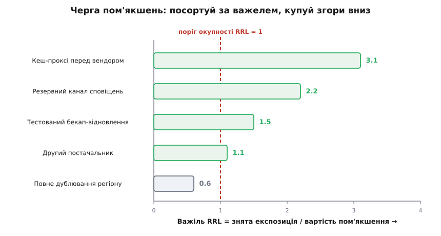
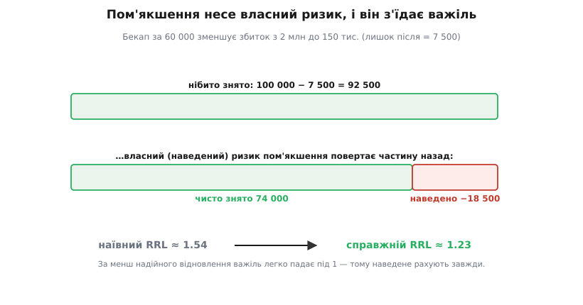

# 🧮 Економіка рішень над ризиком: важіль і ціна правди

<preknowlist>
- [Ризик-мислення](topic:sf-apps/risk-thinking) — експозиція як наслідок, помножений на ймовірність (p·L): скільки ризик коштує в середньому. Уся економіка тут оперує саме цією величиною.
- [Рішення під невизначеністю](topic:sf-apps/deciding-under-uncertainty) — робити ставку дешевою й зворотною, купувати знання, поки воно дешеве; EVPI ставить під цю настанову число.
</preknowlist>

Реєстр уміє назвати ризик і призначити власника. Але далі власник упирається в рішення, якого таблиця сама не ухвалить: **платити за захист чи ні?** Кеш-проксі перед капризним вендором, дубль-постачальник, зайвий раунд тестів — усе це гроші й час наперед проти біди, яка, може, й не прийде. І поряд ховається друге, тонше рішення: а що, як замість боронитися — **дізнатися**? Заплатити не за щит, а за правду: чи справді база не витягне, чи справді вендор підведе. Обидва — рішення «гроші проти невизначеності», й обидва зазвичай ухвалюють настроєм: «ну, про всяк випадок зробімо».

Ця вставка дає кожному по числу. Перше — **важіль зниження ризику (RRL)**: чи варте пом'якшення своєї ціни й котре купувати першим. Друге — **сподівана цінність досконалої інформації (EVPI)**: скільки щонайбільше розумно заплатити, щоб перестати гадати. А наприкінці ці двоє зійдуться в одну думку, задля якої все й пишеться: **інформація — це теж пом'якшення, і майже завжди з найбільшим важелем.** Ось чому дешева проба так часто б'є будь-який щит. Усе тримається на одній величині — експозиції p·L, середньому збитку ([ризик-мислення](topic:sf-apps/risk-thinking)); домовмося, що вона в нас у гривнях, які можна складати й ділити.

## Важіль: скільки ризику знімає кожна вкладена гривня

Пом'якшення бере ризик з експозицією_до = p·L і робить із ним щось: збиває ймовірність p, або зменшує удар L, або те й те. Коштує це C. Що ми купили за C? Не «спокій» — купили конкретну річ: **зниження сподіваного збитку** з експозиції_до до меншої експозиції_після. Різниця — те, що знято:

```
знято = експозиція_до − експозиція_після
```

Сама по собі ця різниця нічого не вирішує, бо мовчить про ціну. Зняти 100 тис. очікуваного збитку за 5 тис. і зняти ті самі 100 тис. за 90 тис. — дві геть різні угоди, хоч «знято» однакове. Щоб угоди стали порівнянними, поділи здобуток на ціну — і дістанеш **важіль**: скільки гривень збитку знімає кожна вкладена гривня.

```
RRL = (експозиція_до − експозиція_після) / вартість пом'якшення
```

Це, по суті, віддача на вкладене — тільки вкладаєш у запобігання, а «прибуток» — недоотриманий збиток. Демарко й Лістер у «Вальсі з ведмедями» (Dorset House, 2003) дали цій мірі ім'я — *risk reduction leverage* — і нею перевели розмову «давайте про всяк випадок» в арифметику; відтоді це усталена міра в керуванні програмними ризиками.

Поріг очевидний із самого дробу. **RRL > 1** — знімаєш більше збитку, ніж платиш: угода в плюс. **RRL = 1** — виходиш у нуль (у середньому). **RRL < 1** — дешевше просто **прийняти** ризик і лишити гроші на щось із важелем більшим, ніж боронитися. Одиниця тут не умовність, а точка, де здобуток зрівнявся з ціною.

**Умова.** Ризик утрати даних: диск зі сховищем гине з ймовірністю 0.05 за рік, а втрата незворотна — L = 2 млн (відбудова з нуля + простій + репутація). Пом'якшення — офсайтні бекапи з тестованим відновленням, 60 тис. на рік; диск від них не перестає гинути (p той самий), зате втрата з катастрофи стає впорядкованим відновленням: L падає до 150 тис.
```
експозиція_до    = 0.05 × 2 000 000 = 100 000
експозиція_після = 0.05 ×   150 000 =   7 500
знято            = 100 000 − 7 500  =  92 500
RRL              = 92 500 / 60 000  ≈  1.54
```
1.54 > 1: бекап вартий грошей. Зверни увагу, що пом'якшення тут діяло не на **ймовірність**, а на **удар** — не завадило диску вмерти, а зробило смерть дешевою. Важелю байдуже, за яку вісь тягнути: він міряє результат — зняту експозицію на гривню.

### Черга вкладень: купуй згори вниз

Один важіль — це вирок одному пом'якшенню. Але ризиків і пом'якшень — десятки, а бюджет один. Тут RRL робить головну свою роботу: перетворює реєстр на **чергу вкладень**. Порахуй важіль кожного можливого пом'якшення, посортуй за ним спадно — і купуй згори вниз, доки важіль тримається над одиницею або доки не скінчився бюджет.

Чому саме згори вниз, а не якось інакше? Бо кожна гривня має йти туди, де знімає найбільше збитку. Якщо бюджет не обмежений — бери геть усе з RRL > 1: кожне таке пом'якшення само по собі в плюс, відмовитися від нього — лишити гроші на столі. Якщо бюджет обмежений сумою B — жадібний вибір за важелем і є оптимальний розподіл: важіль — це «цінність на одиницю ціни», а брати найщільніше першим — точний розв'язок задачі про наплічник у її дробовому варіанті.


*Реєстр як черга вкладень: кожне пом'якшення — смуга завдовжки у свій важіль, відсортована спадно. Купують згори вниз, доки важіль тримається над порогом окупності (RRL = 1); усе, що лівіше межі, дешевше прийняти, ніж боронити. Червона лінія — не колір настрою, а точка, де здобуток зрівнявся з ціною.*

Чесно про межу цієї жадібності. Дробовий наплічник має точний жадібний розв'язок; реальні пом'якшення — грудки, які не розріжеш навпіл, тож згори-вниз стає доброю евристикою, а не теоремою — зазвичай близькою до найкращого, бо грудки малі проти бюджету. Є й пастка залежності: якщо два пом'якшення накривають **той самий** ризик, їхні зняті експозиції не додаються — купивши перше, ти вже змінив експозицію_до для другого. Тому після кожної покупки чергу **перераховують**: важелі решти могли просісти. RRL — не разовий вирок, а знімок, який оновлюють.

### Дві сліпі плями важеля

RRL підкупає простотою, і саме через неї легко забути, чого він **не бачить**. Дві діри варті того, щоб їх назвати, бо кожна регулярно дурить команди.

**Перша — час.** Чисельник «експозиція_до − експозиція_після» — це знімок; він не питає **коли**. Пом'якшення, що подіє за півроку, і те, що діє завтра, дістають однаковий RRL — а вони не однакові. Якщо небезпечне вікно ризику — найближчі три місяці, то захист, що стане до ладу аж на шостому, знімає за це вікно **нуль** реальної експозиції: він спізнився на власну пожежу. Експозиція — це потік у часі, і знімаєш ти лише той її шмат, що припадає на час, коли пом'якшення вже стоїть, а ризик ще живий. Звідси правило: пом'якшення мусить встати **до** вікна ризику, його час підготовки має бути меншим за час до удару. А коли здобуток лежить далеко в майбутньому, його ще й **дисконтують** — гривня збитку, відвернена через рік, сьогодні варта менше за гривню, відвернену цього тижня. RRL без поправки на час **завищує** повільні пом'якшення.

**Друга — власний ризик пом'якшення.** Наївний важіль припускає, що пом'якшення чисто переносить експозицію_до в експозицію_після й більше нічого не додає. Але кожне пом'якшення — це нова річ, яка теж може зламатися. Кеш-проксі — новий компонент, що й сам падає. Другий постачальник — подвоєна поверхня інтеграції. Бекап, який ніхто не пробував відновити, — обіцянка, а не гарантія. Це **наведений** (власний) ризик пом'якшення: він доробляє в реєстр **новий рядок** із власною експозицією. Чесний важіль віднімає його з чисельника:

```
RRL_справжній = (експозиція_до − експозиція_після − наведена_експозиція) / вартість
```

**Умова.** Той самий бекап знімав 92 500. Та відновлення ніхто не тестував, і за реальної біди воно провалюється, скажімо, у 20% випадків — тоді ти лишаєшся майже з повною втратою попри «бекап».
```
наведена_експозиція = 0.05 × 0.20 × (2 000 000 − 150 000) ≈ 18 500
чисто знято          = 92 500 − 18 500 = 74 000
RRL_справжній        = 74 000 / 60 000 ≈ 1.23
```
Важіль просів з 1.54 до 1.23 — пом'якшення досі варте грошей, але запас з'їдено. А підніми частоту провалу відновлення до 50% — і RRL пірне під одиницю: «захист» став дорожчим за ризик, від якого боронить. Ось чому «тестоване відновлення» — не педантизм: тест обвалює наведену експозицію майже до нуля й повертає важелю повну висоту.


*Наївний важіль бачить лише світлу частину — 92 500 нібито знятого. Та власний ризик пом'якшення (неперевірене відновлення) повертає 18 500 назад, і чисто знято лишається 74 000. Важіль просідає з 1.54 до 1.23; за менш надійного відновлення він пірнув би під одиницю — і «захист» став би дорожчим за ризик.*

> 🔧 **Навіщо це.** Найнебезпечніші пом'якшення — саме ті, чий наведений ризик ніхто не порахував: бекап, який жодного разу не відновлювали, резервний перемикач, на який жодного разу не перемикалися. Наївний RRL лестить рівно їм — показує гарну цифру за захист, який у день біди сам і підведе. Питання, що рятує: «а це пом'якшення ми **пробували** ввімкнути по-справжньому?»

## Ціна правди: EVPI

RRL судить пом'якшення, що **діють** на ризик — збивають p, зменшують L. Але є цілий клас ризиків, проти яких пряма дія — марнотратство, бо сам ризик насправді не загроза, а **незнання**. Ми не знаємо, чи витримає база, чи ляже протокол, чи потягне вендор наш профіль. Боронитися від того, чого, можливо, й немає, — це щит проти привида. Розумніший хід — спершу **дізнатися**, чи привид справжній: замість щита купити пробу — навантажувальний тест, прототип, спайк, — яка скаже правду наперед. Але й проба коштує; скільки за неї розумно віддати?

Стеля є, і зветься вона **сподівана цінність досконалої інформації** (англ. *expected value of perfect information*, EVPI): наскільки кращими стали б твої рішення, якби хтось наперед прошепотів тобі щиру правду про майбутнє. Дві її властивості вирішують усе на практиці. Перша: EVPI дорівнює **нулю**, коли правда не змінила б твоєї дії, — за знання, після якого ти вчиниш те саме, не варто платити ні копійки. Друга: EVPI — стеля не тільки для всезнайка, а й для **будь-якої** реальної, недосконалої проби, бо ніщо не буває корисніше за саму істину. Як дістати EVPI числом — деревом рішень, переставивши місцями «вибір» і «долю», — і чому недосконала проба ніколи не переганяє досконалу, виведено в [цінності інформації](topic:math-probability/value-of-information); тут беремо результат готовим і прикладаємо його до реєстру.

**Умова.** Реєстр тримає гарячий ризик: база, можливо, не витягне піку — а можливо, витягне. **Щит** — одразу поставити резервний кластер за 120 тис. і не думати. **Проба** — за 15 тис. прогнати бойовий профіль по кандидатах і аж тоді вирішувати. Нехай стеля цього рішення, EVPI, виходить 100 тис.:
```
щит:   120 тис. напевно — проти ризику, який, може, й несправжній
проба:  15 тис.,  а вигода від неї обмежена стелею EVPI = 100 тис.
15 ≪ 100:  проба окупається з колосальним запасом
```

Щит рятує лише в одному зі світів — там, де база таки падає; за свої 120 тис. він нічого не купує у світі, де вона й так тягне. Проба ж коштує копійки, а готує тебе до **обох** результатів — і саме ця асиметрія робить її пом'якшенням особливого роду.

### Синтез: інформація — це пом'якшення з найбільшим важелем

Тепер зведімо обидві половини в одну. Проба — це теж пом'якшення; просто його «дія» особлива: **зняти невизначеність і аж тоді вчинити оптимально**. Знята нею експозиція обмежена зверху величиною EVPI. Отже, проба стає в **ту саму чергу за важелем**, що й кеш-проксі та дубль-постачальник:

```
RRL_проби = (виграш від дії за правдою) / ціна проби  ≤  EVPI / ціна проби
```

І майже завжди вона очолює цю чергу — з двох причин.

Перша: пряме пом'якшення платить свою ціну C **напевно** й знімає експозицію **одного** ризику. Проба ж за копійки **відмикає оптимальну дію в усіх станах** — і ловить виграш **з обох боків**: часто вона каже «ризик несправжній, розслабся» (і рятує від щита, за який ти дарма б заплатив), а часом — «ризик справжній, борони зараз» (і рятує від збитку). Ти виграєш, хай куди впаде правда.

Друга: проби **дешеві** (спайк, не система), а EVPI буває **великим** (помилитися дорого). Малий знаменник під EVPI-стелею дає велетенський важіль.

Ось чому [walking skeleton](topic:sf-apps/walking-skeleton) — тонкий наскрізний зріз, що вже качає дані від краю до краю, — і відкладання рішення до [останнього відповідального моменту](topic:sf-apps/last-responsible-moment) — не окремі трюки, а прямі наслідки цього самого рахунку. Скелет — це проба, що купує майже досконалу інформацію за копійки. Відкласти рішення — значить відмовитися платити за вибір, поки правда ще дешева на купівлю: ти чекаєш рівно доти, доки проба (або сам світ) не розв'яже невизначеність, і аж тоді ходиш. Реєстр тут — те, що тримає рядок відкритим із тригером «коли треба вирішувати», щоб момент не проґавити. Це той самий дух дешевої зворотної ставки з [рішень під невизначеністю](topic:sf-apps/deciding-under-uncertainty): найкращий хід проти незнання — зробити знання дешевим.

> 🔧 **Навіщо це.** Коли команда третій тиждень поспіль на нараді сперечається «витягне база чи ні», вона палить на зарплатах більше за будь-який спайк. EVPI перекладає суперечку в дію: якщо ціна дізнатися менша за стелю, спір закривають не найгучнішим аргументом, а вимірюванням. Найкорисніше питання над гарячим ризиком — не «хто має рацію», а «скільки коштує перестати гадати».

## Що з цього тримає реєстр живим

Обидва прилади роблять одне: перетворюють стовпець реєстру зі слова на число, яке можна покласти на стіл і захистити. **RRL** відповідає, котрі пом'якшення фінансувати й у якому порядку: посортуй за важелем, купуй згори вниз, зупинись на одиниці — і не забудь відняти час та власний ризик пом'якшення, бо наївний важіль лестить повільному й неперевіреному. **EVPI** ставить стелю на ціну правди й нагадує, що проти незнання дешевше не боронитися, а дізнатися — і, оскільки інформація сама є пом'якшенням, вона зазвичай очолює чергу важеля. Реєстр, який під колонкою «пом'якшення» тримає ці два розрахунки, перестає бути списком добрих намірів і стає тим, чим має бути: щотижневим рішенням, куди покласти наступну гривню — у щит чи в правду.
