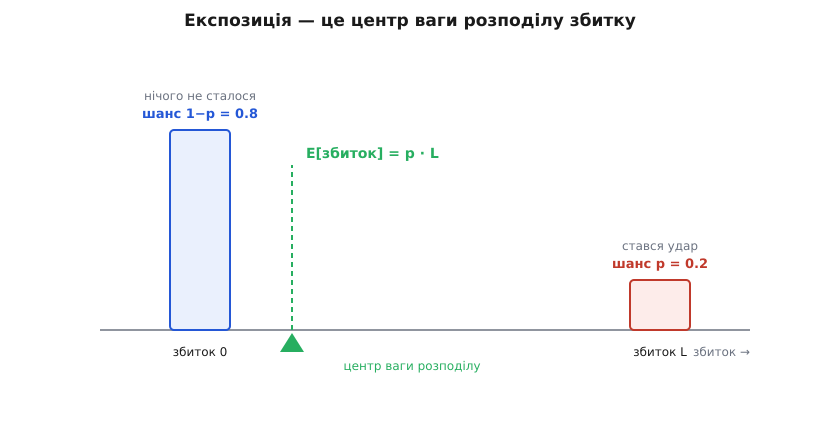
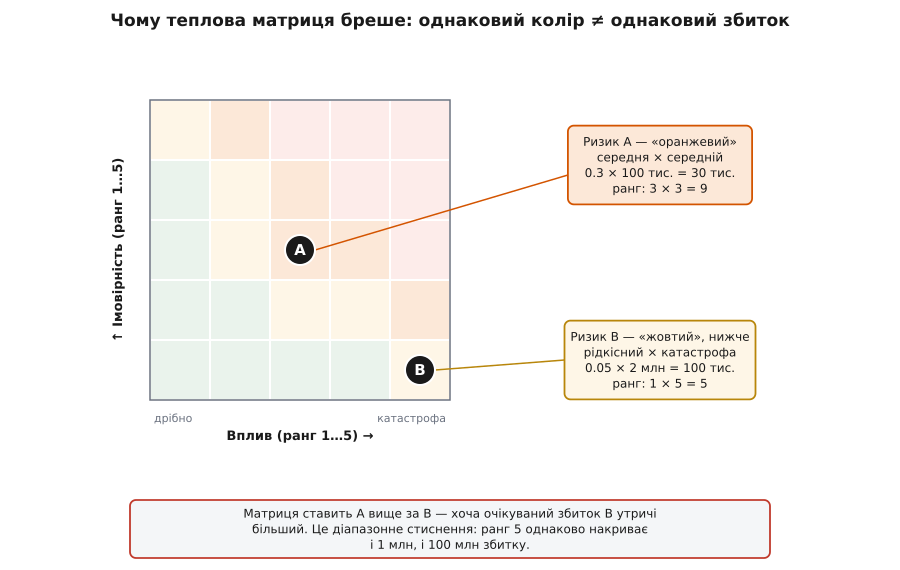
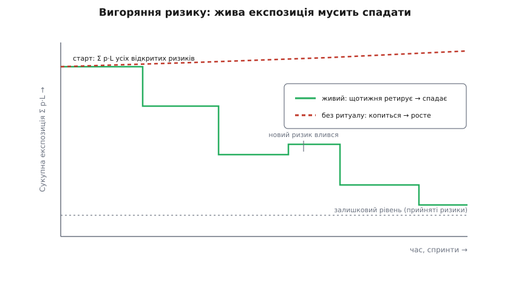

# Ризик-реєстр як живий артефакт

<preknowlist>
- [Ризик-мислення](root:sf-apps/risk-thinking) — ризик як добуток «наскільки ймовірно» на «наскільки боляче»; увага йде туди, де цей добуток найбільший.
- [Архітектурні драйвери](root:sf-apps/architectural-drivers) — ключові вимоги, обмеження й найгостріші місця системи, з яких і народжуються перші рядки реєстру.
- [Рішення під невизначеністю](root:sf-apps/deciding-under-uncertainty) — як діяти без повних фактів: робити ставку дешевою й зворотною, купувати знання, поки воно ще дешеве.
</preknowlist>

Скласти список того, що може піти не так, уміє кожен. Важче — і саме про це вся річ — зробити з того списку **інструмент**: таблицю, яка не просто перелічує страхи, а *міряє* їх у порівнянних одиницях, *ранжирує* без самообману, *підказує*, скільки платити за захист, *керує* архітектурними зусиллями й при цьому не вмирає за місяць. Різниця між списком і інструментом — та сама, що між намальованим термометром і справжнім: обидва схожі на прилад, лише один нічого не міряє. Реєстр (лат. *registrum* — перелік) стає **артефактом** (лат. *arte factum* — зроблене вміло), а не мертвим документом, рівно тоді, коли за кожним його стовпцем стоїть механізм, а не слово.

За «ймовірністю» стоїть випадкова величина. За «впливом» — розподіл збитку. За їхнім добутком — сподіване значення. За «пріоритетом» — чесне ранжирування, а не кольорова клітинка, що бреше. За «пом'якшенням» — економіка, яка каже, чи варте воно грошей. За «власником» — жива людина з важелем впливу й правом бити на сполох. Розберімо ці механізми по черзі, бо доки вони приховані, реєстр лишається малюнком приладу — схожим на роботу, але без користі.

## Що насправді стоїть за клітинкою «ймовірність × вплив»

Візьмімо один рядок і подивімося, що означає його оцінка, коли її сприймати серйозно. Ризик — це подія, яка або станеться, або ні. Отже, рядок описує **випадкову величину** (величину, чиє значення залежить від випадку) з двома значеннями: збиток 0, якщо пронесло, і збиток L, якщо вдарило. Ймовірність удару — p; ймовірність, що пронесе, — рівно (1 − p), бо третього не дано.

Коли хочемо стиснути цю двозначну картину в одне число, природний вибір — **середнє**: скільки цей ризик коштуватиме в середньому, якби той самий квартал повторився безліч разів. Середнє випадкової величини — це сума її значень, зважених на їхні ймовірності:

```
E[збиток] = (1 − p) · 0  +  p · L  =  p · L
```

Ось звідки береться «ймовірність × вплив». Це не мнемоніка й не умовність — це **сподіване значення** збитку, його середнє за багатьма можливими світами. У страхуванні цю величину звуть **експозицією** (лат. *expositio* — виставлення напоказ): наскільки ти виставлений під удар, скільки втрачаєш у середньому.

**Умова.** Ризик витоку через невчасний патч: ймовірність за квартал 0.1, збиток (штраф плюс реагування) 800 тис.
```
Експозиція = p × L = 0.10 × 800 000 = 80 000
```
Вісімдесят тисяч — це **не те, що ти втратиш**. Втратиш ти або 0, або 800 тисяч; проміжного результату не буває. Вісімдесят тисяч — це середнє, і воно корисне рівно для одного: **скласти й порівняти** різні ризики між собою в однакових одиницях. Саме тому важливо, щоб і ймовірність, і вплив колись перетворилися на числа з розмірністю (гроші, дні), а не лишалися «високий/середній»: додати два «високий» не можна, а додати 80 тис. і 25 тис. — можна.


*Ризик — це вага, розкладена на дві позиції осі збитку: велика на нулі (шанс, що пронесе) і мала на L (шанс удару). Експозиція p·L — точка рівноваги цих ваг, центр мас розподілу. Вона тягнеться до важчої позиції, тож за малого p сидить близько до нуля — навіть коли L величезне.*

Але середнє — підступне число, бо воно **однакове для геть різних ризиків**. Рідкісна катастрофа (p = 0.01, L = 8 млн) і буденна прикрість (p = 0.8, L = 100 тис.) мають майже однакову експозицію — близько 80 тисяч, — а поводитися з ними треба протилежно. Перша або не станеться зовсім, або знесе половину компанії; друга майже напевно станеться й майже напевно переживеться. Стискати ризик в одне число зручно для сортування, але небезпечно, коли за ним ховається довгий хвіст. Через це ймовірність і вплив тримають **окремими осями**, а не лише в добутку: добуток каже, куди дивитися першими; окремі осі кажуть, *яка це біда* — часта-дрібна чи рідкісна-смертельна. Повне виведення — від двоточкової величини до випадку, коли сам збиток L розподілений, а не фіксований, — винесено в [математику експозиції](root:sf-apps/risk-register/math-risk-exposure.md).

> 🔧 **Навіщо це.** Коли керівник питає «то який у нас ризик?» і чує «вісімдесят тисяч», за цим числом має стояти чесне «це середнє; реально буде або нуль, або вісімсот». Команди, які плутають експозицію з передбаченням («втратимо вісімдесят»), закладають у бюджет середнє й лишаються без резерву в той єдиний квартал, коли ризик спрацював на всю L. Експозиція — для ранжирування портфеля, а не для планування однієї ставки.

## Портфель ризиків: скласти суму можна, а покладатися на неї — ні

Реєстр — не один рядок, а десятки. Природно спитати: яка сукупна загроза? Тут працює гарна властивість середнього, яку варто назвати прямо. **Сподіване значення суми дорівнює сумі сподіваних значень** — завжди, за будь-якої залежності між ризиками:

```
E[загальний збиток] = Σ pᵢ · Lᵢ
```

Це **лінійність сподівання**, і вона напрочуд поблажлива: щоб додати очікувані збитки, не треба знати, пов'язані ризики між собою чи ні. Тож «сукупна експозиція реєстру» — легітимне число: просто просумуй p·L по всіх відкритих рядках, і матимеш чесну міру загальної загрози.

Пастка в тому, що на цю суму **не можна покладатися як на найгірший випадок** — а саме це роблять, коли закладають її в резерв. Сума середніх нічого не каже про **розкид** суми, а розкид залежить від того, чи б'ють ризики разом. Уяви два ризики з одним корінням: обидва зав'язані на того самого вендора. Якщо вендор упаде, спрацюють **обидва** — їхні збитки складуться в один злий день. Такі **корельовані** (лат. *correlatio* — взаємозв'язок) ризики дають набагато товщий хвіст, ніж та сама пара незалежних, у яких шанс одночасного удару — добуток двох малих ймовірностей, тобто дрібниця. Лінійність сподівання приховує цю різницю: суми середніх у корельованого й незалежного портфелів однакові, а от їхні найгірші дні — ні.

Звідси практичний висновок про **резерв** (лат. *reservare* — берегти) — запас часу й грошей на випадок, що ризики спрацюють. Скільки його закладати?

- Сума середніх (Σ p·L) — **замало**: у поганий квартал реальний збиток легко перестрибне середнє.
- Сума найгірших випадків (Σ Lᵢ) — **забагато**: вона припускає, що всі біди прийдуть одночасно, а так не буває, коли ризики незалежні.
- Правильна відповідь — **перцентиль сукупного розподілу**: така сума, якої вистачить, скажімо, у 80% можливих світів. Обчислити її аналітично важко, бо ризиків багато й вони по-різному пов'язані, тому її **симулюють**: тисячі разів «розігрують» реєстр (кожен ризик кидає свою монету за своїм p), сумують збитки й дивляться, де лягає 80-й перцентиль.

Це метод Монте-Карло; робочий код і його пастки — в [проєкті-калькуляторі реєстру](root:sf-apps/risk-register/proj-risk-register-tool.md), а математику агрегації, зокрема як кореляція роздуває хвіст, — в [математиці експозиції](root:sf-apps/risk-register/math-risk-exposure.md).

## Кольорова сітка, якій не можна вірити на слово

Найпопулярніший спосіб зобразити реєстр — **теплова матриця**: сітка «ймовірність проти впливу», де клітини пофарбовані від зеленого (спокійно) до червоного (гаряче), а кожен ризик — крапка у своїй клітині. Вона чудова для одного: показати очима, де скупчилися загрози, і завести спільну розмову. Але щойно за її кольором починають **ранжирувати** — «червоне важливіше за жовте», — вона починає брехати, і це доведено строго.

Корінь брехні в тому, що щаблі «низька / середня / висока» — це **ранги, а не числа**. Ранг каже «більше-менше», але не каже «на скільки». А коли ранги перемножують (типова матриця дає ризику оцінку «ранг ймовірності × ранг впливу»), виходять три біди.

**Перша — діапазонне стиснення.** Один щабель впливу — скажімо, «катастрофічний, ранг 5» — накриває все від 1 млн до 100 млн збитку. Два ризики, що відрізняються в сто разів, попадають в одну клітину й отримують один колір. Матриця *не бачить* різниці, бо в її грубій шкалі тієї різниці не існує.

**Друга — переставляння порядку.** Ось де стає по-справжньому погано: матриця здатна поставити менший ризик **вище** за більший.

**Умова.** Два ризики на множинній матриці 5×5.
```
Ризик A: ймовірність середня (ранг 3), вплив середній (ранг 3)
   оцінка матриці = 3 × 3 = 9      → оранжевий
   насправді: 0.30 × 100 000   =  30 000  очікуваного збитку
Ризик B: ймовірність низька (ранг 1), вплив катастрофа (ранг 5)
   оцінка матриці = 1 × 5 = 5      → жовтий, НИЖЧЕ за A
   насправді: 0.05 × 2 000 000  = 100 000  очікуваного збитку
```
Матриця поставила A **вище** за B. А чесна експозиція каже протилежне: B утричі загрозливіший. Ранжирування за кольором дало б перевернуту відповідь — і команда кинула б сили не туди.


*Множинна матриця присвоює ризикам ранги 9 і 5, тож фарбує A гарячіше за B. Але справжні очікувані збитки — 30 тис. і 100 тис.: B утричі більший. Ранг перемножує щаблі, а щаблі стиснули величезний діапазон впливу в одне число — і порядок перевернувся.*

**Третя — сліпота на кореляції.** Коли ймовірність і збиток пов'язані **оберненою** залежністю (часте зазвичай дрібне, а рідкісне — руйнівне, що трапляється дуже часто), матриця не просто неточна — вона активно веде не туди, ставлячи однакові оцінки речам, які треба розводити по різних кутах.

Ці вади — не буркотіння скептика. Їх системно розібрав **Ентоні (Тоні) Кокс** у статті «What's Wrong with Risk Matrices?» (журнал *Risk Analysis*, 2008), показавши, зокрема, що типова матриця здатна правильно й однозначно порівняти лише малу частку пар ризиків (у його прикладах — менше десятої), а для ризиків із оберненим зв'язком ймовірності й тяжкості буває «гіршою за марну». Статус тут — **усталений факт**: це рецензована праця, яку відтоді багато разів перевіряли й підтверджували.

Висновок не «викиньте сітку», а **знайте її межу**. Сітка — чудовий інструмент **тріажу** (фр. *triage* — сортування): грубо розкидати десятки ризиків по кутах, побачити скупчення, завести розмову. Вона погана як **точні терези**: коли двоє ризиків в одному кольорі чи по сусідству, не вирішуй їхній порядок за клітиною — постав поруч справжні числа (гроші, дні) і порівняй експозиції. Той самий сюжет розгортається в [trade-off-аналізі](root:sf-apps/tradeoff-analysis) архітектурних рішень: грубу шкалу беруть, щоб не потонути, але остаточний вибір роблять на числах, а не на кольорі.

> 🔧 **Навіщо це.** Найнебезпечніший наслідок довіри до кольору — «зелена сліпота»: рідкісний катастрофічний ризик матриця чесно фарбує в спокійний колір (бо ймовірність низька), і його тихо викидають з поля зору — саме той, що одного дня зносить проєкт. Коли бачиш ризик у «безпечній» клітині, але з катастрофічним L, не заспокоюйся кольором: порахуй експозицію числом і, якщо хвіст злий, тримай рядок живим попри низьку ймовірність.

## Коли p і L не назвати числом: три точки й симуляція

Досі ми вдавали, що ймовірність і збиток відомі. Часто — ні, надто для ризиків **термінів і кошторису**: ніхто чесно не скаже «міграція займе десять днів з ймовірністю 0.7». Зате майже кожен інженер здатен назвати **три** оцінки: оптимістичну (якщо все складеться), найімовірнішу (як зазвичай) і песимістичну (якщо поліземо в багно). З цих трьох виходить оцінка, яка не вдає точності, якої нема.

Класичний рецепт — **PERT** (англ. *Program Evaluation and Review Technique* — техніка оцінки й перегляду програм), народжений 1958 року в Бюро спецпроєктів ВМС США разом із консультантами Booz Allen Hamilton для графіка ракетної програми «Полярис» (**усталений факт**). Він бере три точки — оптимістичну o, найімовірнішу (моду) m, песимістичну p — і зважує їх так, щоб мода важила вчетверо:

```
E(тривалість) = (o + 4m + p) / 6
σ ≈ (p − o) / 6
```

Четвірка перед модою — не магія: вона наближує середнє **скошеного** розподілу (бета-розподілу), у якого довгий хвіст тягнеться в бік песимістичної оцінки; а стандартне відхилення взято як шосту частину розмаху (o…p) — те саме припущення, що «майже все» лягає в шість сигм. Повне виведення — чому саме бета, звідки «÷6» і як воно зв'язане з нормальним хвостом — у [математиці експозиції](root:sf-apps/risk-register/math-risk-exposure.md).

**Умова.** Скільки закладати на міграцію даних? Оцінки: оптимістично 6 днів, найімовірніше 10, песимістично 24 (рідкісний, але злий хвіст — брудні дані).
```
E = (6 + 4·10 + 24) / 6 = 70 / 6 ≈ 11.7 дня
σ ≈ (24 − 6) / 6        = 18 / 6 = 3 дні
```
Планувати варто не 10 (моду), а ~11.7: хвіст справа зсуває середнє вправо. А обіцянку з ~80-відсотковим запасом дають як E + 0.84σ ≈ 11.7 + 2.5 ≈ 14 днів (0.84 — скільки σ треба відкласти вправо, щоб накрити 80% результатів). Різниця між «10» і «14» — це і є той резерв, який без трьох точок узагалі невидимий.

Тепер головне про **портфель**. Спокуса — на кожен ризик узяти песимістичну оцінку й скласти. Це роздуває план до абсурду, бо припускає, що **всі** ризики вистрелять по-найгіршому одночасно, — а незалежні ризики так не роблять. Правильно — **Монте-Карло**: тисячі разів розіграти кожну задачу за її трьома точками, скласти в підсумок і взяти перцентиль. Тоді резерв виходить чесний — менший за суму песимістичних, більший за суму мод. Реєстр, у якому ризики термінів записані трьома точками, а не одним оптимістичним числом, автоматично лікує найпоширенішу хворобу планів — систематичний недооблік хвоста. Код симуляції — у [проєкті-калькуляторі](root:sf-apps/risk-register/proj-risk-register-tool.md).

## Пом'якшення теж коштує: коли воно себе виправдовує

Назвати ризик і призначити власника — половина справи. Друга половина: власник має **щось зробити**, і майже завжди це «щось» коштує грошей або часу. Кеш-проксі перед капризним вендором, дубль-постачальник, додаткове тестування, резервний канал — усе це ціна. Питання, на яке реєстр мусить уміти відповідати холодно: **чи варте пом'якшення своєї ціни?**

Демарко й Лістер у «Вальсі з ведмедями» дали на це просту й чесну міру — **важіль зниження ризику** (*risk reduction leverage*, RRL): скільки експозиції ти прибираєш на кожну вкладену гривню.

```
RRL = (експозиція_до − експозиція_після) / вартість пом'якшення
```

Чисельник — скільки середнього збитку пом'якшення знімає; знаменник — скільки воно коштує. RRL більше за 1 означає, що вкладення прибирає більше ризику, ніж коштує саме; менше за 1 — що дешевше просто прийняти ризик, ніж від нього боронитися.

**Умова.** Ризик «vendor-API не витягне пік»: ймовірність 0.3, збиток від зриву 500 тис. Пропоноване пом'якшення — власний кеш-проксі за 40 тис., що зіб'є ймовірність до 0.05.
```
експозиція_до    = 0.30 × 500 000 = 150 000
експозиція_після = 0.05 × 500 000 =  25 000
знято            = 150 000 − 25 000 = 125 000
RRL              = 125 000 / 40 000 ≈ 3.1
```
3.1 > 1: кожна гривня в проксі знімає близько трьох гривень очікуваного збитку. Пом'якшення варте грошей і йде вгору списку. Якби той самий проксі коштував 200 тис., RRL = 125 000 / 200 000 ≈ 0.6 — і чесніше було б прийняти ризик, а гроші лишити на щось із важелем більше одиниці.

RRL перетворює реєстр на **чергу вкладень**: посортуй можливі пом'якшення за важелем і купуй згори вниз, доки важіль більший за одиницю або доки не скінчився бюджет. Але знай і його межі: RRL — миттєвий знімок; він не бачить **часу** (пом'якшення, що подіє через півроку, і те, що діє завтра, він оцінює однаково) і не бачить, що саме пом'якшення **несе власний ризик** (новий проксі — це новий компонент, який теж може впасти й додати рядок у реєстр). Тонше — в [економіці пом'якшення](root:sf-apps/risk-register/math-mitigation-economics.md). Спорідненість із [технічним боргом](root:sf-apps/technical-debt) тут пряма: борг — це відкладений ризик зміни, а його «відсоток» — та сама експозиція, яку RRL зважує проти ціни виплати.

## Найдешевша зброя проти ризику — купити правду

Є хід проти ризику, дешевший за будь-яке пом'якшення, і реєстр існує великою мірою заради нього. Багато технічних ризиків — це насправді **незнання**: ми не знаємо, чи витримає база, чи ляже цей протокол, чи потягне вендор наш профіль навантаження. Проти незнання найкраще не боронитися, а **дізнатися** — і зробити це, поки ставка ще дешева й зворотна.

Скільки коштує дізнатися правду? Є стеля, і в неї є ім'я — **сподівана цінність досконалої інформації** (*expected value of perfect information*, EVPI): наскільки кращим стало б рішення, якби хтось наперед сказав тобі істину. Її означили ще Райффа й Шлайфер (1961), а Рональд Говард (1966) назвав таку уявну підказку «ясновидінням». Рахують так: беруть найкраще рішення, яке ти ухвалиш **без** знання, і найкраще середнє, якого досяг би **зі** знанням, і різниця — стеля ціни правди.

**Умова.** Обрати вендора A чи B. A дешевший на 200 тис., але є 40% шанс, що він не потягне наш профіль — тоді екстрена міграція на B коштуватиме 600 тис. Спайк — двотижневий навантажувальний зріз за 25 тис. — скаже правду наперед.
```
Рішення «наосліп беремо A»:
   очікуваний зайвий збиток = 0.40 × 600 000 = 240 000
Рішення «беремо B одразу» (уникаємо ризику, платимо більше):
   зайвий збиток = 200 000  (переплата за B, певна)
Найкраще БЕЗ інформації = min(240 000, 200 000) = 200 000  → беремо B
З досконалою інформацією (знали б наперед):
   60%: A підходить → беремо A, переплата 0
   40%: A не тягне → беремо B, переплата 200 000
   очікуваний збиток = 0.6·0 + 0.4·200 000 = 80 000
EVPI = 200 000 − 80 000 = 120 000     (стеля ціни правди)
```
Двадцять п'ять тисяч ≪ сто двадцять тисяч: розвідка окупається з колосальним запасом. І зверни увагу, що спайк — це **майже** досконала інформація (він прямо міряє те, що нас лякає), тож його реальна цінність близька до стелі; а платити за будь-яку інформацію більше за EVPI — безглуздо за означенням. Ось чому [walking skeleton](root:sf-apps/walking-skeleton) — тонкий наскрізний зріз системи, що вже качає дані від краю до краю, — і відкладання рішення до [останнього відповідального моменту](root:sf-apps/last-responsible-moment), коли знання побільшало, а ціна зволікання ще не перевищила зиску, — не окремі трюки, а прямі вияви того самого розрахунку. Реєстр тут — те, що тримає ризик відкритим саме доти, доки проба не перетворить здогад на факт: рядок висить із тригером «коли треба вирішувати», щоб момент не проґавили. Виведення EVPI через дерево рішень і межа між досконалою й недосконалою інформацією — у [цінності інформації](root:math-probability/value-of-information).

> 🔧 **Навіщо це.** Коли команда сперечається «витягне база чи ні» на нараді третій тиждень поспіль, вона палить гроші дорожче за будь-який спайк. EVPI перекладає суперечку в дію: якщо ціна дізнатися правду менша за стелю, суперечку закривають не аргументом, а вимірюванням. Найкорисніше запитання над гарячим ризиком — не «хто має рацію», а «скільки коштує перестати гадати».

## Ознака-тригер: провідна, а не запізніла

Тригер (англ. *trigger* — спусковий гачок) — спостережна прикмета, за якою видно, що ризик перестає бути гіпотезою й починає ставатися. І саме тут ховається різниця між реєстром, який рятує, і реєстром, який лише документує пожежу.

Ключова властивість доброго тригера — **час випередження**. Між миттю, коли ти *міг би* побачити ознаку, і миттю, коли ризик уже вдарив на всю L, має лишатися досить часу, щоб устигнути щось зробити. Розкладемо це на ланцюжок затримок:

```
затримка виявлення  +  затримка реакції   <   час до удару
(поки ознака дозріє     (поки власник устигне       (поки збиток
 й хтось її помітить)     втрутитися)                  ще не стався)
```

Якщо нерівність не виконується — тригер марний: ти дізнаєшся про біду тоді, коли вже нічого не вдієш. Звідси поділ ознак на **провідні** (leading) і **запізнілі** (lagging). Запізніла ознака спалахує *після* того, як шкода сталася: «сервіс упав», «клієнт поскаржився», «рахунок від вендора виріс утричі». Вона годиться, щоб зафіксувати інцидент, але не годиться як тригер ризику, бо не лишає часу на випередження. Провідна ознака сидить **вище за течією** причинності — там, звідки шкода тільки народжується: не «сервіс упав», а «p95 затримки повзе до 800 мс і росте», не «диск переповнився», а «вільного місця лишилося на три дні за поточним темпом».

Добрий тригер, отже, конструюють свідомо. Обери метрику, **причинно** розташовану перед шкодою, а не саму шкоду. Постав поріг **із запасом** на час реакції — і бажано з невеликим коридором (гістерезисом), щоб ознака не тремтіла на межі, породжуючи хибні тривоги, які команда швидко навчиться ігнорувати. І — найважливіше — **привʼяжи тригер до приладу**, а не до людської пам'яті: метрику, що сама піднімає сповіщення, коли перетне поріг. Ризик, чий тригер — «хтось помітить», насправді без тригера: людина забуде подивитися рівно в той тиждень, коли треба було.

Коли тригер спрацював, ризик перетинає важливу межу, про яку — трохи згодом: він перестає бути ризиком (загрозою в майбутньому) і стає **проблемою** (бідою в теперішньому). Добрий тригер робить цей перехід **раннім і видимим**, поки з нього ще можна вийти дешево.

## Реєстр як стан-машина: гілки, тригер і межа «ризик → проблема»

Реєстр видно як таблицю, але живе він як **стан-машина**: кожен рядок рухається визначеними станами, і рух — це і є життя. Груба картина «відкритий → закритий» надто бідна, щоб керувати; розгорнімо її повністю.

Ризик **народжується виявленим** — хтось назвав загрозу. Далі його **оцінюють**: приписують ймовірність і збиток, ставлять у кут сітки, призначають власника й тригер. Оцінений ризик розходиться на **три гілки**, і вибір гілки — це вже рішення, а не облік:

- **Прийнятий** — «так, може статися, переживемо». Свідомо приймають і більше не витрачають на нього уваги. Прийняти — теж дія: це знімає ризик із гарячого списку, лишаючи слід, що рішення було обдумане.
- **Під наглядом** — ймовірність не збивають зараз, але тримають тригер зведеним, щоб не проґавити початок. Так поводяться з рідкісним, але руйнівним: діяти передчасно дорого, а проґавити — смертельно.
- **Пом'якшується** — власник діє **наперед**: збиває ймовірність або пом'якшує удар, поки ризик ще гіпотеза (сюди лягають і вкладення з добрим важелем, і дешеві проби-розвідки).

З гілок «під наглядом» і «пом'якшується» ведуть два виходи. Або тригер **спрацював** — і ризик **матеріалізується** (лат. *materia* — речовина): загроза стала явою. Тут — та сама важлива межа: матеріалізований ризик виходить **за межі реєстру ризиків** у журнал поточних проблем, бо він більше не про майбутнє, а про теперішнє, і гаситься вже як пожежа (у кращому разі — за готовим планом, який власник склав, поки ризик був іще гіпотезою). Або небезпечний період **минув** — і ризик **закривається** спокійно.


*Ризик не просто «відкритий → закритий». Оцінений, він розходиться на три гілки; спрацьований тригер виштовхує його за межу реєстру ризиків у журнал проблем (він став теперішнім), а не спрацьований веде до закриття. І прийнятий, і закритий, і розв'язана проблема осідають в архіві з уроком — це й є пам'ять команди. Дуга ліворуч — щотижнева переоцінка кута, без якої стани застигають.*

Ця межа «ризик → проблема» — частина ширшої родини артефактів, яку менеджери десятиліттями тримали разом під зручною абревіатурою RAID: **R**isks (ризики — загрози в майбутньому), **A**ssumptions (припущення — взяте на віру), **I**ssues (проблеми — те, що вже болить), **D**ependencies (залежності — чого чекаємо ззовні). Вони не окремі списки, а **сполучені посудини**: несправджене припущення народжує ризик; спрацьований ризик стає проблемою; чужа залежність, що ковзає, — джерело нового ризику. Історію самої цієї родини — як практика склалася без єдиного автора й як програмна інженерія отримала свою мову ризику через «Вальс із ведмедями» — винесено в [окрему розповідь](root:sf-apps/risk-register/hist-risk-register.md).

Ще одна дуга стан-машини — **переоцінка**. Ризик — це не факт, а оцінка майбутнього, а майбутнє щотижня стає іншим: вендор оголосив про поглинання (ймовірність підскочила), навантаження виявилося вдесятеро меншим (можна закривати), з'явилася нова інтеграція (цілий новий рядок). Тому кожен рядок раз на цикл повертається на переоцінку кута — і саме ця дуга робить реєстр живим. Ознака здоров'я елементарна: **у реєстрі щотижня щось міняється** — рядки закриваються, оцінки зсуваються, тригери уточнюються. Незмінний два місяці реєстр не заспокоює, а тривожить: ризиків не поменшало, просто зупинився прилад, що за ними стежить.

Найпростіше побачити це здоров'я на графіку **вигоряння** — сукупної експозиції реєстру в часі. Живий реєстр щоспринту ретирує ризики, і сума Σ p·L повзе вниз сходинками до залишкового рівня — тих загроз, які свідомо прийняли й не гасять. Реєстр без ритуалу не спадає: нові ризики надходять, старих ніхто не збиває, і крива тихо росте, хоч на вигляд «нічого не змінюється».


*Сукупна експозиція реєстру в часі. Живий реєстр щоспринту ретирує ризики — лінія спадає сходинками до залишкового рівня прийнятих загроз; поодинокий підйом — новий ризик, що влився. Без ритуалу експозиція не падає, а тихо росте. Незмінна лінія — не спокій, а зупинений прилад.*

І останнє про архів. Закритий ризик **не викидають** — його лишають із коротким записом, чим скінчилося: справдився чи ні, скільки коштував. Це і є **пам'ять команди**: наступного разу, зустрівши схожу загрозу, ти вже знаєш її ціну не з книжки, а з власних синців. Реєстр, що зберігає закриті ризики з їхньою долею, з часом стає найчеснішим підручником саме цієї команди.

Коли ризик матеріалізується й доводиться ухвалювати важке рішення, як із ним бути, це рішення не лишають у чиїйсь голові, а записують у [журнал архітектурних рішень (ADR)](root:sf-apps/architecture-decision-records) разом із причиною й ціною — щоб через рік було ясно, чому вчинили саме так, а не інакше.

## Ризик як кермо архітектури

Досі реєстр виглядав як інструмент проєктного менеджера. Але в руках архітектора він — щось глибше: **кермо, яким скеровують саме проєктування**. Ідея, яку найчіткіше сформулював Джордж Фербенкс у «Just Enough Software Architecture: A Risk-Driven Approach» (2010), проста й звільняльна: **обсяг архітектурної роботи має бути пропорційний ризику**. Немає потреби в ретельних діаграмах там, де ризик малий; немає виправдання неохайності там, де ризик загрожує успіху. Реєстр — це рівно той вхід, що каже, **куди** вкладати архітектурне зусилля: до найгарячіших рядків, а не рівним шаром по всьому.

Це замикає гарну петлю. Звідки беруться перші рядки? З **драйверів**. Коли команда розбирає [архітектурні драйвери](root:sf-apps/architectural-drivers) — ключові вимоги, обмеження й найгостріші місця, — найризикованіші з них природно перетікають у реєстр. Драйвер «мусимо витримати десятикратний піковий наплив» відразу народжує ризик «а раптом не витримаємо» з конкретним тригером. Реєстр — це, по суті, зворотний бік драйверів: там, де драйвер каже «це важливо», реєстр питає «а що, як не вийде».

Точніше рядки народжуються, коли драйвери перетворюють на **сценарії якісних атрибутів** і піддають оцінюванню. [Якісні атрибути](root:sf-apps/quality-attributes) — це «-ilities» системи (продуктивність, доступність, змінюваність, безпека): те, наскільки *добре* система робить своє, а не *що* вона робить. Оцінювання архітектури ATAM-класу (від *Architecture Tradeoff Analysis Method*) прямо **виробляє матеріал для реєстру**: серед його виходів — **ризики**, **не-ризики**, **точки чутливості** (де маленька зміна архітектури сильно б'є по якомусь атрибуті) і **точки компромісу** (де покращення одного атрибута псує інший). Точки чутливості й компромісу — це, по суті, ризики ще до того, як вони визріли: місця, де архітектура крихка. Легша, командна версія такого оцінювання розібрана в [ATAM-лайт](root:sf-apps/atam-lite); її природний вихід — свіжі, добре названі рядки реєстру, а самі компроміси зважують у [trade-off-аналізі](root:sf-apps/tradeoff-analysis).

Далі петля замикається дією. Найгарячіші рядки збивають архітектурно — і найчастіше не гаданням, а **дешевою перевіркою**: тонким наскрізним зрізом ([walking skeleton](root:sf-apps/walking-skeleton)), спайком, прототипом — тим, що перетворює «а раптом не витягне» на факт, поки з обраного шляху ще легко зійти. Це прямий вияв ставлення до [рішень під невизначеністю](root:sf-apps/deciding-under-uncertainty): найкращий хід проти архітектурного ризику — зробити знання дешевим, а ставку зворотною. Ризик збили — переоцінили — оновили реєстр — знову вклали зусилля туди, де тепер найгарячіше. Драйвери → сценарії → оцінювання → ризики → пом'якшення → переоцінка: реєстр — це та ланка, що робить цю петлю замкненою, а не разовим ритуалом на старті.

> 🔧 **Навіщо це.** Питання «чи достатньо ми спроєктували?» не має відповіді в порожнечі — лише проти ризику. Команда, що креслить UML на систему, де все й так відоме, марнує час; команда, що ліпить на живу нитку систему з незнаним навантаженням і новим протоколом, грає в рулетку. Реєстр — це те, що робить питання відповідальним: спроєктовано достатньо тоді, коли найгарячіші рядки збиті до прийнятної експозиції, і жодним рядком більше.

## Чому реєстри вмирають: соціотехнічний шар

Усе досі сказане — про механізми: числа, петлі, стани. Але реєстри вмирають не від поганої математики. Вони вмирають від **людей**, і доки не бачиш цього шару, найкраще збудований реєстр однаково згниє. Дві звичні смерті реєстру мають соціальне, а не технічне коріння.

Перша — **мертва таблиця**: реєстр завели для галочки, наповнили раз і кинули. Вона шкідливіша за відсутність реєстру, бо створює оманливе відчуття, ніби ризики під контролем. Друга, дзеркальна, — **театр ризиків**: реєстр ведуть ретельно, він розпух до сотні рядків, усе задокументовано до відсотків — і саме тому ним неможливо користуватися, бо головні ризики губляться серед дрібних. Обидві родом з однієї помилки — сплутати артефакт із документом: документ пишуть, щоб він **був**; артефакт ведуть, щоб він **працював**. Але *чому* цю помилку роблять так уперто? Тут — коріння глибше.

**Проблема гінця.** Назвати ризик — значить уголос сказати, що щось може провалитися, і часто — що провалитися може чужа улюблена ідея або власне рішення начальника. У багатьох командах це відчувається як зрада, песимізм, «накаркування». Тому погані новини **не піднімаються нагору**: люди відчувають загрозу, але мовчать — «якось не дійшли руки сказати», «здавалося, всі й так знають». Реєстр працює рівно настільки, наскільки в команді **безпечно вимовляти неприємне**. Без психологічної безпеки таблиця наповнюється зручними, беззубими ризиками, а справжні — ті, що потоплять, — лишаються невисловленими до першого вибуху.

**Нормалізація відхилення.** Соціологиня Даян Вон (Diane Vaughan) у праці «The Challenger Launch Decision» (1996) описала механізм, від якого гине найбільше реєстрів: коли небезпечна ознака повторюється **без катастрофи**, її поступово починають вважати нормою. Ризик, що місяць за місяцем «майже спрацював» і не спрацював, тихо переоцінюють униз і зрештою викидають — рівно перед тим, як він спрацює по-справжньому. Це підступно, бо виглядає як навчання на досвіді («бачите, обійшлося ж»), а насправді — сліпота, що наростає. Протиотрута — в самому ритуалі переоцінки: ознака-тригер, привʼязана до числа, а не до відчуття, не дає тихо «звикнути» до небезпеки, бо число або перетнуло поріг, або ні.

**Невидимість запобігання.** Найглибша несправедливість керування ризиком: коли власник добре зробив свою роботу, **нічого не сталося** — і його ніхто не подякує, бо відвернену катастрофу не видно. Зате того, хто гасив гучну пожежу, вважають героєм. Стимули перевернуті: винагороджують реакцію, а не запобігання. Тому в командах, де немає свідомого зусилля цінувати тихих людей, чиї ризики *не* справдилися, реєстр природно занепадає — вести його невигідно.

Звідси й ліки — вони соціальні, не технічні. **Живий власник із важелем**: не «команда стежить» (розмазана на всіх відповідальність не лежить ні на кому), а одна людина з іменем — і, що важливо, із **правом і владою** щось із ризиком зробити; якщо власник не може вплинути, ризик **ескалюють** до того, хто може, за межу його повноважень. **Легкий ритуал**: коротка щотижнева чи щоспринтова зустріч, де проходять рядки й питають три речі — чи зсунулись оцінки, чи не спрацював тригер, чи не з'явилося нове. **Жорсткий короткий список**: у реєстрі живуть лише ті ризики, за якими справді хтось стежитиме; короткий реєстр, який читають щотижня, у сто разів цінніший за вичерпний, який не читає ніхто. І **безпека вимовляти**: назвати ризик має бути актом лояльності, а не зради.

Реєстр — це, врешті, не таблиця, а **дзеркало чесності команди**. Різні [стейкхолдери](root:sf-apps/stakeholders) бачать різні загрози: технічний дріб'язок для розробника — щоденний біль для підтримки й репутаційна катастрофа для бізнесу; добрий реєстр збирає ризики з усіх поглядів, бо жоден окремий не бачить усієї картини. І саме тому реєстр — природна пожива для [рев'ю архітектури](root:sf-apps/architecture-review): найкорисніше питання на будь-якому рев'ю — «які тут головні ризики й що з ними робиться» — це рівно те, на що чесно ведений реєстр має готову відповідь, а ведений для галочки — не має жодної.

## Що робить реєстр живим

Складімо все докупи. Реєстр ризиків стає інструментом, а не малюнком інструмента, коли під кожним його стовпцем працює механізм. Він **міряє** — бо за клітиною «ймовірність × вплив» стоїть експозиція, середнє реального розподілу збитку, у гривнях, які можна складати. Він **ранжирує чесно** — бо знає, що кольорова сітка добра для тріажу й бреше як точні терези, тож гарячі рядки зважує числом. Він **оцінює під туманом** — бо там, де p і L не назвати, бере три точки й симуляцію, а не одне оптимістичне число. Він **вирішує, скільки платити** — бо важіль RRL відділяє пом'якшення, варте грошей, від дорогої перестраховки, а стеля EVPI каже, що найдешевша зброя проти багатьох ризиків — не боронитися, а купити правду, поки вона дешева. Він **керує архітектурою** — бо скеровує зусилля туди, де ризик найбільший, замикаючи петлю драйвери → оцінювання → ризики → проби → переоцінка. І він **виживає** — рівно доти, доки соціальна тканина команди дозволяє вимовляти неприємне, тримає живого власника з важелем і повертається до рядків щотижня.

Прибери будь-який із цих механізмів — і лишиться таблиця пилюки. Тримай їх усі живими — і реєстр перестає бути списком того, чого ви колись боялися, а стає щотижневою чесною розмовою про те, чого варто боятися **зараз**, і що ви з цим робите **сьогодні**.
