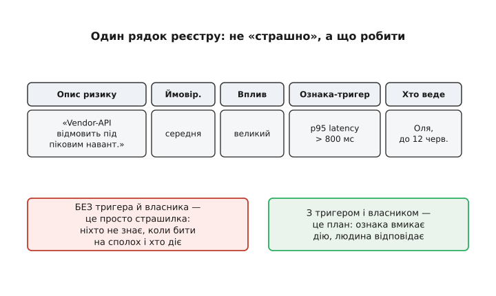
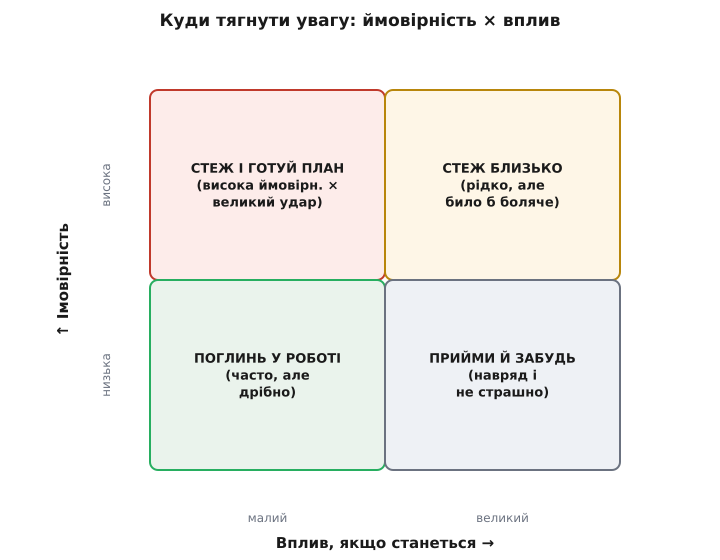

# Ризик-реєстр як живий артефакт

<preknowlist>
- [Ризик-мислення](root:sf-apps/risk-thinking) — ризик як добуток «наскільки ймовірно» на «наскільки боляче»; головні ризики — там, де найбільше незнаємо.
- [Архітектурні драйвери](root:sf-apps/architectural-drivers) — те, що справді формує систему: ключові вимоги, обмеження й найризикованіші місця, з яких і виростають записи реєстру.
- [Рішення під невизначеністю](root:sf-apps/deciding-under-uncertainty) — як діяти, коли фактів бракує: робити ставку дешевою й зворотною, щоб дізнатися правду до того, як стане пізно.
</preknowlist>

Майже кожна команда, яку добряче припекло провалом, потім заводить у себе «реєстр ризиків» — таблицю з переліком того, що може піти не так. Її урочисто наповнюють на старті проєкту, показують керівництву, вкладають у теку з документами — і більше не відкривають ніколи. За півроку той самий проєкт розбивається рівно об ту загрозу, що акуратно записана рядком сім у тій самій таблиці, до якої ніхто не повертався. Реєстр був — а користі не було. І це не окремий випадок недбалості: це типова доля документа, який плутають із артефактом.

Щоб зрозуміти, чому так, треба спершу побачити, у чому взагалі сенс такого реєстру — і чому цей сенс живе не в самому списку.

## Навіщо взагалі виписувати ризики

Голова архітектора й без реєстру повна тривог: «а якщо ця база не витягне навантаження», «а якщо той вендор підніме ціни втричі», «а якщо ключова людина звільниться посеред міграції». Ці тривоги крутяться в думках, спливають уночі, псують настрій — і **нічого не міняють**, поки лишаються в голові. Бо в голові вони живуть у найгіршій із можливих форм: розмите відчуття загрози без чіткого «наскільки ймовірно», «наскільки боляче» й «що я з цим роблю».

Виписати ризик — значить витягти його з туману й змусити набути форми. Щойно ти пишеш рядок, доводиться відповісти на конкретні питання: що саме може статися, як часто таке трапляється, скільки коштуватиме удар, за якою ознакою я побачу, що воно вже почалося, і хто цим займається. Розмита тривога, яку не вхопиш, перетворюється на керовану річ, з якою можна щось робити. Це головний фокус реєстру: він **виводить страх на світло**, де страх стає слабшим і зрозумілішим.

> 🔧 **Навіщо це.** Найдорожчі провали проєктів — рідко від того, чого ніхто не міг передбачити. Куди частіше — від того, що хтось таки відчував загрозу, але вона так і лишилася невисловленою: «якось не дійшли руки сказати», «здавалося, всі й так знають». Реєстр — це механізм, що змушує вимовити вголос. І вже сам акт вимовляння часто важливіший за таблицю: команда, яка раз на тиждень чесно проговорює свої страхи, помиляється рідше за ту, що ховає їх у мовчанні до першого вибуху.

## Що робить рядок реєстру справжнім

Найпоширеніша хиба — думати, що записати ризик означає записати **страшилку**. «Система може впасти під навантаженням». «Вендор може підвести». Такі рядки виглядають як робота, а насправді нічого не дають: вони не кажуть ні коли бити на сполох, ні хто за це відповідає, ні що робити. Це просто оформлена тривога.

Справжній рядок несе п'ять речей, і кожна робить його придатним до дії:

```
Ризик           Ймовірність   Вплив     Ознака-тригер        Хто веде
──────────────  ────────────  ────────  ───────────────────  ──────────
Vendor-API      середня       великий   p95 latency          Оля,
відмовить під                           > 800 мс              до 12 черв.
піком
```

**Опис** — конкретна подія, не абстракція: не «проблеми з вендором», а «vendor-API відмовить під піковим навантаженням». **Ймовірність** і **вплив** — щоб знати, куди тягнути увагу (до цього повернемося). Але два останні поля — те, що відрізняє живий рядок від мертвого.

**Ознака-тригер** — спостережна прикмета, за якою видно, що ризик перестає бути гіпотезою й починає ставатися. Не «раптом впаде», а «p95 latency перевалила за 800 мс» — конкретне число, яке хтось міряє. Без тригера рядок марний: ти дізнаєшся про біду тоді, коли вона вже сталася, а не коли її ще можна відвернути.

**Власник** — жива людина з іменем, а не «команда» й не порожнеча. «Команда стежить» означає, що не стежить ніхто: відповідальність, розмазана на всіх, не лежить ні на кому. У кожного рядка має бути одна людина, яка прокидається з думкою про цей конкретний ризик.


*Різниця між страшилкою й керованим ризиком — це два останні стовпці. Без ознаки-тригера ніхто не знає, коли вмикати дію; без власника ніхто не діє. З ними рядок перестає лякати й починає працювати.*

## Куди тягнути увагу: ймовірність × вплив

Ризиків у будь-якому серйозному проєкті десятки. Приділити кожному однакову увагу неможливо й безглуздо: більшість із них або майже не станеться, або майже не зачепить. Тому реєстр треба вміти **сортувати за загрозою**, а не за порядком, у якому їх згадали.

Груба, але напрочуд робоча міра загрози — добуток двох оцінок:

```
Загроза (експозиція) ≈ Ймовірність × Вплив
```

Це не точна формула, а спосіб думання. Ймовірність і вплив зазвичай беруть не числами, а трьома щаблями — низька / середня / висока, — бо точних чисел на ранньому проєкті все одно нема, а трьох щаблів досить, щоб розкласти ризики по кутах. Термін «експозиція» (лат. *expositio* — виставлення напоказ) прийшов зі страхування: наскільки ти виставлений під удар, скільки втратиш у середньому, якщо помножити розмір біди на її шанс.

Найзручніше розкласти ризики на сітці два на два — ймовірність проти впливу — і за кутом, у який ризик потрапив, вибрати спосіб поводження:


*Кожен ризик потрапляє в один із чотирьох кутів, і кут диктує дію. Часто-й-боляче забирає майже всю увагу; рідко-й-дрібно приймають і забувають; два проміжні тримають під наглядом на різній дистанції. Сортувати за цим — значить не потонути в дрібних тривогах, проґавивши головну.*

Верхній правий кут — часто й боляче — це ті кілька ризиків, заради яких реєстр і ведуть: сюди йдуть план дій, гроші й безсонні думки. Нижній лівий — рідко й дрібно — приймають («так, може статися, переживемо») і більше не витрачають на нього енергії. Два проміжні тримають під наглядом: рідкісний, але руйнівний удар вартий готового плану на випадок, навіть якщо шанс малий; частий, але дрібний найчастіше просто гасять по ходу роботи.

Головна користь сітки — не сама класифікація, а те, що вона **звільняє увагу**. Без неї команда однаково тривожиться про все підряд і найгостріше — про те, що згадали останнім чи що найгучніше прозвучало на нараді. Сітка змушує спитати про кожен ризик холодно: наскільки ймовірно й наскільки боляче — і за відповіддю розподілити сили. Ці дві осі — той самий кістяк, що й у ширшому [ризик-мисленні](root:sf-apps/risk-thinking): реєстр лише дає йому таблицю, у якій воно живе.

## Головне слово: живий

Тепер — до слова, задля якого вся стаття. Реєстр приносить користь **лише доти, доки він живий**, і мертвіє тієї ж миті, коли перестає змінюватися.

Причина проста, і вона в самій природі ризику. Ризик — це не факт, а **оцінка майбутнього**, а майбутнє щотижня стає іншим. Той вендор, що півроку тому здавався надійним, оголосив про поглинання — ймовірність його відмови підскочила. Навантаження, якого боялися, виявилося вдесятеро меншим — ризик можна закривати. З'явилася нова інтеграція, якої на старті й не планували, — це цілий новий рядок. Реєстр, написаний одного разу, описує світ, якого вже нема; він застаріває не повільно, а майже одразу, бо застаріває сама реальність під ним.

Тому реєстр — не документ, а **процес**. Його цінність не в тому файлі, що лежить у теці, а в **ритуалі**, який регулярно його перечитує: щотижнева чи щоспринтова коротка зустріч, де команда проходить рядки й питає про кожен три речі. Чи зсунулися оцінки — може, те, що було «низькою ймовірністю», стало «високою? Чи не спрацював уже якийсь тригер, поки ми не дивилися? Чи не з'явилося нове, чого тут ще нема? Без цього ритуалу таблиця миттю перетворюється на музейний експонат — правильний на день створення й хибний на кожен наступний.


*Живий реєстр — це коловорот: ризики надходять, рухаються станами, закриваються з уроком, а вся таблиця щотижня звіряється з реальністю. Мертвий — разова таблиця, до якої не повернулися. Однакові на вигляд у день народження, за місяць вони — протилежності.*

Ознака здоров'я реєстру елементарна: **у ньому щотижня щось міняється**. Рядки закриваються, оцінки зсуваються, з'являються нові пункти, хтось дописує в тригер конкретніше число. Якщо реєстр два місяці стоїть незмінним, справа не в тому, що ризиків не лишилося, — їх стало більше, просто ніхто вже не дивиться. Незмінний реєстр не заспокоює, а тривожить: він означає, що механізм спостереження зупинився.

## Життєвий шлях одного ризику

Придивімося, як окремий ризик живе в реєстрі, бо саме тут видно різницю між списком і артефактом.

Ризик **народжується** відкритим — хтось назвав загрозу, команда оцінила ймовірність і вплив, поставила в кут сітки, призначила власника й тригер. Далі, якщо він у небезпечному куті, ризик переходить **у роботу**: власник не чекає, поки станеться, а робить щось, аби збити ймовірність або пом'якшити удар наперед. Тут реєстр змикається з рештою ремесла — бо збивати ризик означає діяти архітектурно.

Найчастіший спосіб збити технічний ризик — не гадати, а **дешево перевірити**. Замість сперечатися, чи витягне обрана база навантаження, зроби тонкий наскрізний зріз системи, що вже качає дані від краю до краю, — [walking skeleton](root:sf-apps/walking-skeleton), — і зміряй на живому. Ризик «а раптом не витягне» з гіпотези стає фактом, поки з обраного шляху ще легко зійти. Це прямий вияв підходу до [рішень під невизначеністю](root:sf-apps/deciding-under-uncertainty): найкращий хід проти ризику — зробити знання дешевим, а ставку зворотною.

Інший ризик збивають не перевіркою, а **відкладанням**. Якщо загроза в тому, що ми ухвалимо незворотне рішення не з тим вендором, найдешевший хід — не ухвалювати його зараз, а дотягнути до [останнього відповідального моменту](root:sf-apps/last-responsible-moment), коли знання побільшає, а ціна зволікання ще не перевищила зиску від чекання. Реєстр тут — те, що не дає забути про відкладений ризик: рядок висить із тригером «коли треба вирішувати», щоб момент не проґавили.

Нарешті ризик **закривається** — і закривається двома різними способами, які легко переплутати. Або він **минув**: небезпечний період пройшов, загроза більше не актуальна — рядок закривають зі спокоєм. Або він **стався**: тригер спрацював, біда прийшла — і тут ризик перетворюється на **проблему**, якою вже займаються не в реєстрі ризиків, а в журналі поточних проблем, гасячи пожежу за готовим (у кращому разі) планом. Різниця принципова: ризик — це про майбутнє, проблема — про теперішнє; сплутати їх означає або панікувати завчасно, або проґавити перехід.

Закритий ризик не викидають — його лишають в архіві з коротким записом, чим скінчилося. Це і є **пам'ять команди**: наступного разу, зустрівши схожу загрозу, ти вже знаєш, справдилася вона торік чи ні й скільки коштувала. Реєстр, який зберігає закриті ризики з їхньою долею, з часом стає найчеснішим підручником саме цієї команди — не з книжки, а з власних синців.

## Ризик-реєстр і решта ремесла

Реєстр не висить у порожнечі — він змикається з кількома сусідніми практиками, і разом вони тримають систему.

Звідки взагалі беруться перші рядки? З **драйверів**. Коли команда розбирає [архітектурні драйвери](root:sf-apps/architectural-drivers) — ключові вимоги, обмеження й найгостріші місця системи, — найризикованіші з них природно перетікають у реєстр. Драйвер «мусимо витримати десятикратний піковий наплив» відразу народжує ризик «а раптом не витримаємо» з конкретним тригером. Реєстр — це, по суті, зворотний бік драйверів: там, де драйвер каже «це важливо», реєстр питає «а що, як не вийде».

Реєстр також живиться від людей навколо системи. Різні [стейкхолдери](root:sf-apps/stakeholders) бачать різні загрози: те, що для розробника дрібний технічний ризик, для служби підтримки — щоденний біль, а для бізнесу — репутаційна катастрофа. Добрий реєстр збирає ризики з усіх поглядів, бо жоден окремий погляд не бачить усієї картини загроз.

Коли ризик матеріалізується й доводиться ухвалювати важке рішення, як із ним бути, — це рішення не лишають у чиїйсь голові, а записують у [журнал архітектурних рішень (ADR)](root:sf-apps/architecture-decision-records) разом із причиною й ціною. А сам реєстр — природна пожива для [рев'ю архітектури](root:sf-apps/architecture-review): найкорисніше питання на будь-якому рев'ю — «які тут головні ризики й що з ними робиться» — це рівно те, на що реєстр і має готову відповідь. Реєстр, який ведуть чесно, перетворює рев'ю з формального обряду на розмову по суті.

Історія самого інструмента — як спроби керувати проєктними ризиками перетворилися на стандартну практику з реєстрами й журналами RAID, і як програмна інженерія отримала свій погляд на ризик через книгу [«Вальс із ведмедями» Тома Демарко й Тіма Лістера](root:sf-apps/risk-register/hist-risk-register.md) — винесена окремо.

## Дві пастки, дзеркальні одна одній

Наприкінці — про два способи змарнувати реєстр, і вони протилежні.

Перша пастка — **мертва таблиця**, з якої ми почали: реєстр завели для галочки, наповнили раз і кинули. Він шкідливіший за відсутність реєстру взагалі, бо створює оманливе відчуття, ніби ризики під контролем, — а насправді ніхто за ними не дивиться. Ліки одні: прив'язати реєстр до **регулярного ритуалу**. Немає щотижневого перегляду — немає й реєстру, є лише файл.

Друга пастка тонша — **театр ризиків**: реєстр ведуть ретельно, він розпух до сотні рядків, усе задокументовано, оцінки розписані до відсотків — і саме тому ним неможливо користуватися. Коли в реєстрі сто пунктів, головні губляться серед дрібних, а перегляд перетворюється на виснажливе читання, яке всі ненавидять і потай саботують. Реєстр, у якому все, — це реєстр, у якому нічого: якщо не виділено кілька справді небезпечних ризиків, увага розпорошується рівним шаром по всьому й не тримається ні на чому. Ліки — жорсткість: у реєстрі живуть лише ті ризики, за якими справді хтось стежитиме; решту або приймають і забувають, або взагалі не заводять. Короткий реєстр, який читають щотижня, у сто разів цінніший за вичерпний, який не читає ніхто.

Обидві пастки родом з однієї помилки — сплутати артефакт із документом. Документ пишуть, щоб він був. Артефакт ведуть, щоб він працював. Реєстр ризиків приносить користь рівно настільки, наскільки він живий: не як список того, чого ви колись боялися, а як щотижнева чесна розмова про те, чого варто боятися **зараз** — і що ви з цим робите сьогодні.
