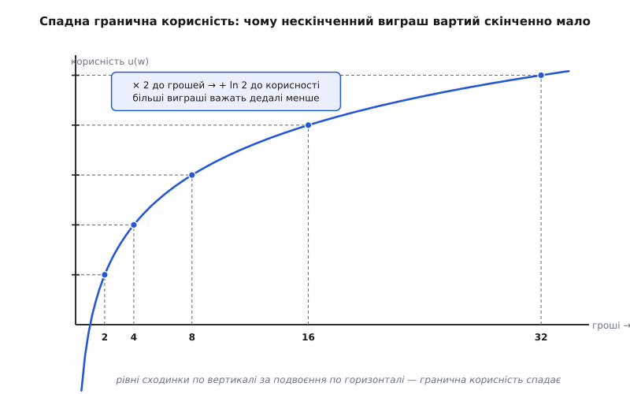

# 📜 Як народилася наука про рішення під невизначеністю

Формула, за якою інженер о третій ночі рангує свої страхи — «експозиція = ймовірність × втрата», — виглядає такою самоочевидною, що здається, ніби вона була завжди. Насправді в неї довга й доволі драматична біографія. Вона народилася з азартної гри, якої понад три століття тому ніхто не міг як слід оцінити; пережила поділ світу на «ризик» і «невизначеність»; була закута в аксіоми двома вигнанцями воєнної Європи; мало не розвалилася під простим питанням французького економіста — і аж наприкінці цього шляху потрапила в керування софтверними проєктами. Пройти цей шлях варто, бо кожна його зупинка досі жива в тому, як ми міркуємо про ризик сьогодні: коли ви пишете множення «ймовірність на втрату», ви несвідомо повторюєте думку, якій майже триста років.


*Родовід ідеї: спершу — здогад, що вартість не дорівнює грошам (Бернуллі); потім — поняття, що ризик буває вимірний і невимірний (Найт); тоді — аксіоми, які роблять із здогаду теорему (фон Нейман і Морґенштерн); за ними — виклики, що показали межі теорії (Алле, Севідж); і нарешті — перенос усього цього в інженерне ремесло (Бем, Демарко й Лістер).*

## Гра, яку не можна було оцінити

Почнемо з задачі, що збила з пантелику найкращих математиків Європи. Уявіть, що вам пропонують таку гру: підкидаємо чесну монету, доки не випаде «орел». Якщо «орел» уперше випав на першому кидку — ви отримуєте 2 дукати; якщо на другому — 4; на третьому — 8, і так далі, подвоюючи за кожен «решт», що передував. Питання одне: скільки ви готові **заплатити** за право зіграти?

Відповідь того часу здавалася очевидною. Розумна ціна — це середній виграш, тобто сподіване значення. Порахуймо його:

```
виграш, коли перший «орел» випав на кидку n:   2ⁿ дукатів
ймовірність цього (n−1 «рештів», тоді «орел»): (1/2)ⁿ
внесок випадку n у середній виграш:  (1/2)ⁿ · 2ⁿ = 1

E = 1 + 1 + 1 + 1 + …  →  ∞
```

Кожен можливий результат додає до середнього рівно одиницю, а результатів нескінченно багато — тож сподіваний виграш **нескінченний**. За правилом «плати стільки, скільки становить середній виграш» ви мали б віддати за цю гру геть усе, що маєте, і ще позичити. А тепер чесно: скільки б ви заплатили насправді? Дукатів вісім, від сили десять. Ніхто при здоровому глузді не поставить статок за гру, де майже завжди виграєш копійки, а величезний куш ховається за ймовірністю, меншою за пилинку. Правило, якому всі довіряли, дало відповідь, яку всі одностайно відкидали. Ось це й називають **петербурзьким парадоксом**.

Поставив задачу швейцарський математик **Нікола Бернуллі** (Nicolaus Bernoulli) з базельської математичної династії — у листі до французького математика **П'єра Ремона де Монмора** (Pierre Rémond de Montmort) від 9 вересня 1713 року; Монмор згодом надрукував це листування, і задача пішла гуляти вченим світом. *(Дата й авторство — усталений, добре задокументований факт.)* Понад двадцять років вона стояла як докір: улюблений інструмент математиків — сподіване значення — на простісінькій грі видавав нісенітницю.

## Корисність: перша тріщина в «середньому»

Розв'язок прийшов не з математики ймовірностей, а зі зміни питання. Що, як гроші вартують не самі по собі, а лише тим, **що вони для тебе означають**? Перша тисяча для голодного — це порятунок; та сама тисяча, додана до мільйона, — майже ніщо. Виходить, подвоєння суми не подвоює її **цінності для людини**. А якщо так, то рахувати треба не середні гроші, а середню цінність — і нескінченність може зникнути.

Першим це записав женевський математик **Ґабріель Крамер** (Gabriel Cramer) — у листі 1728 року, за десять років до знаменитої публікації. Він припустив, що цінність грошей росте як квадратний корінь із суми (√w), тож дедалі більші виграші важать дедалі менше. *(Документований факт; пріоритет Крамера визнав сам Бернуллі.)* А довів справу до пуття двоюрідний брат Ніколи — **Даніель Бернуллі** (Daniel Bernoulli). У праці «Specimen theoriae novae de mensura sortis» («Виклад нової теорії вимірювання жеребу»), надрукованій 1738 року в записках Петербурзької імператорської академії наук (*Commentarii Academiae Scientiarum Imperialis Petropolitanae*), він запропонував точнішу форму: корисність статку росте як його **логарифм**, тобто гранична корисність кожного наступного дуката спадає обернено до вже наявного багатства.

Тут варто зупинитися на назві, бо вона оманлива. «Петербурзьким» парадокс зветься лише тому, що Даніель Бернуллі надрукував свій розбір у журналі тамтешньої академії, членом якої тоді був. Сам він — **швейцарець** із базельського роду, народжений у Ґронінгені; у молоду Петербурзьку академію, яку Петро I щойно заснував і навмисне наповнював запрошеними західними вченими (там-таки працював друг Даніеля, швейцарець Леонард Ейлер), Бернуллі приїхав 1725 року й поїхав 1733-го, невдоволений платнею та цензурою. *(Усталений факт.)* Тож це відкриття швейцарського математика, а не російське — місто дало лише сторінки, на яких воно вийшло.

Ось як логарифм гасить нескінченність. Замість грошей 2ⁿ підставляємо їхню корисність ln(2ⁿ):

```
корисність виграшу 2ⁿ:   u = ln(2ⁿ) = n · ln 2
сподівана КОРИСНІСТЬ гри:
E[u] = Σ (1/2)ⁿ · n·ln 2 = ln 2 · Σ n/2ⁿ = ln 2 · 2 = 2·ln 2 ≈ 1.386

рівноцінний певний виграш:  w* = e^(2·ln 2) = 4 дукати
```

Сума, що в грошах розліталася в нескінченність, у корисності **збігається** — до скромних двох натуральних логарифмів двійки. А переклавши цю корисність назад у гроші, дістаємо: гра варта певного виграшу десь **чотири дукати** (у спрощенні, коли рахувати корисність самого призу). Раптом математика погодилася зі здоровим глуздом. Нескінченність була ілюзією одиниці виміру: ми міряли гру в дукатах, а треба було — у тому, чого ці дукати варті для гравця.


*Логарифмічна корисність. По горизонталі гроші множаться (× 2 щоразу), а по вертикалі корисність додається однаковими сходинками (+ ln 2) — крива вигинається донизу. Саме через цей вигин нескінченна низка дедалі більших виграшів дає скінченну, ще й невелику сподівану корисність.*

Народилася **ідея**, на якій згодом стоятиме все: розумний гравець максимізує не сподівані **гроші**, а сподівану **корисність**. Підкреслю слово «ідея» — це ще не теорія з фундаментом, а геніальний здогад, підпертий однією вдало дібраною функцією. Чому саме логарифм, а не корінь Крамера чи щось третє? На це в 1738 році відповіді не було.

> 🔧 **Навіщо це.** Та сама увігнутість живе в осі втрат вашого ризику. Збій, що коштує години простою, і збій, що коштує доби, різняться не в 24 рази: перший — прикрість, а другий може перетнути поріг, за яким клієнти йдуть назавжди й компанії кінець. Втрата, як і виграш, нелінійна — тому «втрата» в експозиції міряється не голими грошима чи хвилинами, а тим, **що вона робить із системою й бізнесом**. Дрібні часті збитки та рідкісна катастрофа з однаковим «середнім» — зовсім різні звірі, і корисність — перший інструмент, що це побачив.

## Ризик проти невизначеності: Френк Найт розводить два тумани

Наступний крок — не нова формула, а нове розрізнення, без якого сьогодні не обходиться жодна розмова про ризик. Американський економіст **Френк Найт** (Frank Knight) у книжці «Risk, Uncertainty and Profit» (1921), що виросла з його докторської дисертації в Корнелльському університеті (захищеної 1916 року), провів межу, яку доти всі змішували. Є два зовсім різні різновиди незнання майбутнього:

```
РИЗИК          — наслідок невідомий, але розподіл імовірностей ВІДОМИЙ
                 (як гральна кістка: не знаєш, що випаде, та знаєш шанси)
НЕВИЗНАЧЕНІСТЬ  — невідомий навіть розподіл; сама модель шансів невідома
                 (як новий ринок: не знаєш ні наслідків, ні їхніх ймовірностей)
```

Різниця не academic. Вимірний ризик можна порахувати, застрахувати, закласти в ціну — з ним працює вся машинерія сподіваної корисності. Справжня ж невизначеність (її й досі звуть **найтівською**) опирається будь-якому розрахунку, бо немає чисел, які можна перемножити. Найт зробив із цього економічний висновок: прибуток підприємця береться саме з невизначеності, а не з ризику, — бо вимірний ризик конкуренти вже врахували й розібрали. *(Авторство розрізнення за Найтом — усталене; варто чесно додати, що думка носилася в повітрі: того ж 1921 року Джон Мейнард Кейнс у «Treatise on Probability» теж наполягав, що не всяка ймовірність піддається числу. Це паралельний хід, а не одинока вигадка.)*

Для інженера це розрізнення — рідне, тільки під іншими іменами: **відоме невідоме** (named risk, який можна оцінити й занести в реєстр) проти **невідомого невідомого** (те, чого й уявити не можеш). І висновок той самий: проти вимірного ризику працює розрахунок, а проти найтівської невизначеності — ні. Єдина відповідь на неї не обчислювальна, а конструктивна: тримати [двері зворотними](topic:sf-apps/reversible-irreversible-decisions) й закладати запас, щоб коли невідоме таки виринуло, систему можна було дешево перекроїти. Найт першим строго пояснив, **чому** формула тут безсила, — і тим окреслив кордон, за яким ремесло переходить від калькуляції до гнучкості.

## Аксіоми: фон Нейман і Морґенштерн роблять із здогаду теорему

Ідея корисності була потужна, але хитка. Лишалося головне питання, на яке Бернуллі відповіді не дав: **чому** раціональна людина взагалі мусить максимізувати сподівану корисність? Чому не якесь інше правило? Доки на це немає відповіді, корисність — лише вдалий трюк, а не закон.

Відповідь дали двоє емігрантів у Прінстоні. **Джон фон Нейман** (John von Neumann) — угорсько-американський математик, народжений у Будапешті, один із найгостріших умів століття, — і **Оскар Морґенштерн** (Oskar Morgenstern) — економіст родом із Ґерліца, який виріс у Відні й також перебрався за океан, — у книжці «Theory of Games and Economic Behavior» (Прінстон, перше видання 1944). Строгий аксіоматичний висновок сподіваної корисності з'явився в додатку до **другого видання (1947)**. *(Датування 1944/1947 — задокументований факт; ця книжка заодно заснувала теорію ігор.)*

Що вони довели, варто сформулювати точно, бо тут — стрибок від здогаду до теореми. Вони не постулювали корисність, а вивели її. Візьміть будь-яку людину й попросіть лише, щоб її вподобання щодо лотерей корилися кільком очевидно розумним правилам:

```
повнота       — з двох лотерей ти завжди можеш сказати, яку волієш
                (або що вони для тебе рівні)
транзитивність — якщо A краще за B, а B краще за C, то A краще за C
неперервність — між дуже доброю і дуже поганою є така ймовірнісна
                суміш, що вона тобі рівноцінна проміжній
незалежність  — домішавши до двох лотерей ОДНУ Й ТУ САМУ третю з
                однаковим шансом, ти не міняєш, котру з двох волієш
```

**Теорема:** якщо вподобання людини задовольняють ці аксіоми, то існує функція корисності, для якої людина воліє саме ту лотерею, у якої вища сподівана корисність, — і воліє її **неминуче**, під страхом суперечити власним аксіомам. Максимізація сподіваної корисності перестала бути порадою й стала теоремою про внутрішню несуперечність: хочеш бути послідовним — мусиш поводитися так, наче в тебе є корисність, яку ти максимізуєш. Ось де закінчується «ідея Бернуллі» й починається **аксіоматизація**: не «спробуйте логарифм», а «ось мінімальний набір умов розумності, який **змушує** корисність існувати».

## Виклик: люди раціонально порушують аксіоми

Аксіоми виглядали незламно — кожна ж бо очевидна. І тут французький економіст **Моріс Алле** (Maurice Allais, згодом нобелівський лауреат 1988 року) наставив пастку просто в лігві теорії. На паризькому колоквіумі Національного центру наукових досліджень «Fondements et applications de la théorie du risque en économétrie» (12–17 травня 1952 року) він роздав учасникам — тим самим людям, що будували теорію сподіваної корисності, — анкету з кількох пар простих лотерей і попросив вибрати. Їхні відповіді **систематично порушували аксіому незалежності**. Не через дурість чи неуважність: розумні, треновані в теорії ймовірностей люди раз за разом вибирали так, як аксіоми забороняли, і, дізнавшись про це, здебільшого не вважали свій вибір помилкою. Опубліковано пастку 1953 року в «Econometrica». *(Дата й суть — усталений факт історії економічної думки.)*

Найгостріший епізод стосується **Леонарда Джиммі Севіджа** (Leonard Jimmie Savage), американського статистика, який на тому ж таки паризькому зібранні доповідав власну теорію — ту, що стане книжкою «The Foundations of Statistics» (1954). Севідж узяв анкету Алле — і сам **упав у пастку**, вибравши всупереч аксіомам, які обстоював. Його реакція й розвела назавжди дві гілки науки про рішення. Поміркувавши, Севідж вирішив, що помилився **він**, а не аксіоми, і переглянув свій вибір. Тобто аксіоми він лишив як **нормативні** — припис, як мусить чинити послідовний розум; а те, що люди їх порушують, визнав фактом **описовим** — про те, як розум чинить насправді. Ця розколина — між «як слід» і «як є» — жива й досі.

Внесок самого Севіджа теж лягає в наш родовід, і його теж не варто приписувати одній людині. Він дав **суб'єктивну ймовірність**: число не як частоту в довгій серії, а як міру особистої **певності** — саме те, чого бракувало, щоб бодай якось узятися за найтівську невизначеність, де об'єктивних шансів немає. Але спирався він на попередників — англійця **Френка Ремзі** (Frank Ramsey, «Truth and Probability», 1926) й італійця **Бруно де Фінетті** (Bruno de Finetti, 1937), — а власним внеском поєднав їхню суб'єктивну ймовірність з корисністю фон Неймана й Морґенштерна в єдину **суб'єктивну сподівану корисність**. Знову корисно розрізняти: ідею суб'єктивної ймовірності подали Ремзі й де Фінетті, а Севідж її **аксіоматизував і об'єднав**.

Тріщина, яку лишив Алле, з роками розрослася у власну наукову галузь. З неї виросла поведінкова економіка — теорія перспектив **Даніеля Канемана** (Daniel Kahneman) і **Амоса Тверскі** (Amos Tversky), опублікована в «Econometrica» 1979 року, за яку Канеман дістав нобелівську премію 2002-го. Але це вже інша, пізніша історія; для нас важливо, що класична теорія вийшла з паризької зали 1952 року і зміцнілою (аксіоми встояли як норма), і надламаною (вони перестали бути описом людини).

## Від дуката до дедлайну: ризик приходить в інженерію

Двісті п'ятдесят років усе це жило в математиці, економіці та статистиці — про софт ніхто й не думав, бо софту не було. Аж тоді програмні проєкти, що хронічно зривали строки й бюджети, зажадали власної дисципліни ризику, — і теорія перекочувала до інженерів майже без змін, лише з новою термінологією.

Ключове перенесення зробив американський інженер **Баррі Бем** (Barry Boehm) у праці «Software Risk Management: Principles and Practices» (IEEE Software, том 8, № 1, січень 1991). Він увів величину **експозиції ризику**:

```
Експозиція = Ймовірність(подія станеться) × Втрата(якщо станеться)
```

Придивіться, і впізнаєте стару машинерію. Це те саме сподіване значення, яким намагалися оцінити петербурзьку гру, тільки повернуте не до виграшу, а до **збитку** — сподівана втрата. Логарифмічна корисність Бернуллі підказує, що «втрату» тут треба міряти в тому, чого вона справді варта, а не в голих одиницях; найтівський поділ нагадує, що множення чесне лише там, де ймовірність узагалі є. Уся класична теорія стоїть за цим коротким рядком, який архітектор пише, майже не думаючи про його трьохсотлітнє коріння. *(Бем ще раніше, у «Software Engineering Economics» 1981 року, приніс у софт економічний спосіб мислення — експозиція 1991-го була природним продовженням.)*

Останній штрих — від розрахунку до **настанови**. Том **Демарко** (Tom DeMarco) і Тімоті **Лістер** (Timothy Lister) у книжці «Waltzing with Bears: Managing Risk on Software Projects» (2003) перевернули інстинкт: не тікати від ризику, а **йти на найризикованіше першим**, поки це дешево. Їхня теза — пряма спадкоємиця Найта: більший ризик несе й більшу винагороду, тож проєкт, що уникає будь-якого ризику, приречений відстати від сміливіших. Це вже не про те, як оцінити ставку, а про те, коли її робити, — і практично воно веде до [дешевих дослідів на живому](topic:sf-apps/deciding-under-uncertainty), якими збивають невизначеність рано, поки з рішення ще легко зійти.

Отут коло й замикається. Інженер, що множить «ймовірність на втрату», запускає здогад **Даніеля Бернуллі** 1738 року (цінність — не гроші), доведений до теореми аксіомами **фон Неймана й Морґенштерна** 1947-го, стриманий нагадуванням **Алле** й **Севіджа**, що людина й справжня невизначеність опираються охайній формулі, і врешті вручений йому у формі проєктного строку **Бемом**. Кожен пласт досі живий у звичці. А знати цей родовід — значить розуміти, **де** формулі можна вірити (вимірний ризик) і **де** вона тихо ламається (найтівське невідоме невідоме) — рівно там, де ремесло архітектора повертає від розрахунку до зворотності й запасу міцності.

І якщо стиснути весь шлях в один рядок, вийде послідовність, яку варто тримати в голові щоразу, малюючи прямокутник експозиції:

```
ідея (Крамер·Бернуллі, 1728·1738) → поняття (Найт, 1921)
→ аксіоматизація (фон Нейман·Морґенштерн, 1944·1947)
→ виклики (Алле·Севідж, 1953·1954)
→ інженерна реалізація (Бем·Демарко·Лістер, 1991·2003)
```
