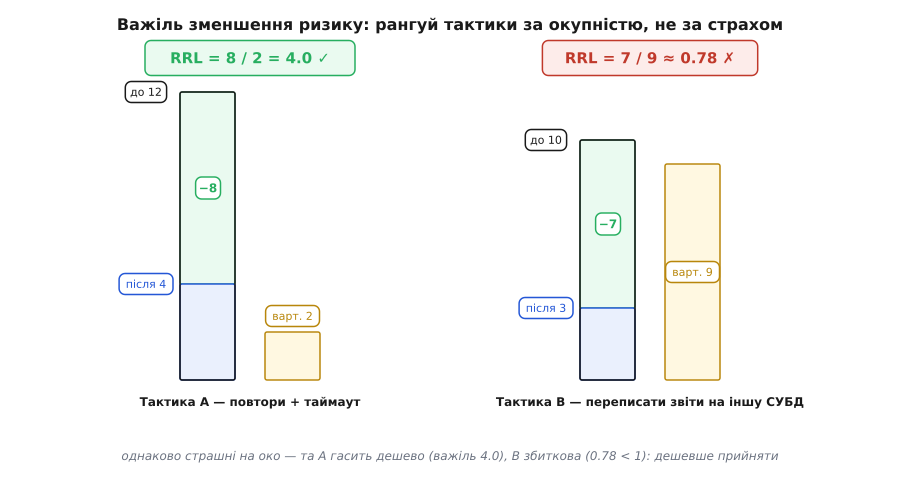

# Ризик-мислення

<preknowlist>
- [Архітектурні драйвери](root:sf-apps/architectural-drivers) — те, що справді формує систему: ключові вимоги, обмеження й найнебезпечніші місця; ризик — один із драйверів.
- [Trade-off-аналіз](root:sf-apps/tradeoff-analysis) — кожне рішення щось віддає за щось; ризик-мислення зважує ці ставки під невизначеністю.
- [Зворотні й незворотні рішення](root:sf-apps/reversible-irreversible-decisions) — вартість відкоту; головна зброя проти ризику, якого не передбачити.
- [Якісні атрибути](root:sf-apps/quality-attributes) — «-ilities» системи (доступність, продуктивність, змінюваність); саме їх ризик ставить під загрозу.
- [Прикидка «на серветці»](root:sf-apps/back-of-envelope) — груба, але корисна оцінка порядку величини; ризиком орудують такими самими грубими числами.
</preknowlist>

Ризик (італ. *risco* — підводна скеля) — це не «щось погане взагалі», а конкретна прихована скеля на курсі: її ще не видно з палуби, але вона там, і вона розпорює днище тому, хто на неї налетить. Ремесло архітектора понад усіма механізмами й патернами зводиться до однієї здатності — бачити ці скелі, поки до них ще далеко, оцінювати, наскільки котрась із них небезпечна, і завертати стерно, поки поворот коштує легкого руху руки, а не корабля. Уся решта дисципліни — якісні атрибути, тактики, аналіз компромісів, в'ю і рев'ю — це різні прилади в одному наборі штурмана, і всі вони служать цьому одному: провести систему повз те, що ще не сталося.

Це означає, що ризик-мислення — за своєю природою не список порад, а прикладна **теорія рішень під невизначеністю**. І щойно ми беремося за неї всерйоз, стає видно, що за простою формулою «ймовірність × втрата» ховається несподівано глибокий механізм: він каже, коли множення дає правильну відповідь, а коли підступно бреше; чому обережна фірма платить за страховку більше, ніж «чесна ціна» ризику; скільки насправді варто витратити на зменшення небезпеки; і — найтонше — чому числа, які ми підставляємо у формулу, приносить жива людина, а людина міряє власне майбутнє криво й передбачувано криво. Розберемо це до дна.

## Дві породи невідомого: ризик і невизначеність

Перше, що треба вловити, — що слово «невідоме» вкриває дві геть різні речі, і плутати їх коштує дорого. Різницю чітко провів економіст **Френк Найт** (Frank Knight) у книжці «Risk, Uncertainty and Profit» (1921), і відтоді її називають найтівською.

**Ризик** у строгому сенсі — це коли ти не знаєш, що саме випаде, але **знаєш шанси**. Гральна кість: який бік ляже — невідомо, та ймовірність кожного точно ⅙. Тут невідоме **вимірне**. Ти можеш узяти розподіл ймовірностей, помножити на наслідки й дістати число, яким орудувати.

**Невизначеність** (лат. *incertus* — непевний) — це коли ти не знаєш навіть шансів, **і не можеш їх знати**, бо ситуація нова й неповторна. Найт наголошував це різко: «вимірна невизначеність настільки відмінна від невимірної, що по суті взагалі не є невизначеністю». Скільки користувачів прийде на продукт, якого ще ніхто не бачив? Чи злетить конкурент через рік? Чи виявиться нова база даних пасткою під нашим саме навантаженням? Тут немає кості з відомими гранями — є один-єдиний неповторний кидок, і його розподіл не написаний ніде.

І ось головне, чого зазвичай не помічають: **майже вся розробка живе в найтівській невизначеності, лише прикидаючись, що живе в ризику.** Ми виставляємо «ймовірність 0.3», ніби вона справжня, — але за цим числом не стоїть жодного розподілу, лише судження інженера. Це не робить оцінку марною: груба цифра однаково впорядковує наші страхи краще, ніж їхня відсутність. Але це визначає, **яка зброя тут узагалі працює**.


*Три режими незнання й зброя кожного. Де відомий розподіл — рахуй експозицію. Де розподілу нема — арифметика оманлива, працюють сценарії, запас і судження. Де небезпеку годі й назвати — лишається тільки структурна відповідь: зворотність рішень і надлишковість. Помилка режиму — рахувати там, де рахувати нема чого, — одна з найдорожчих.*

Ця карта — не академічна тонкість, а робочий сортувальник. У зоні **ризику** доречні розрахунок експозиції, важіль зменшення, порівняння варіантів числами. У зоні **невизначеності** число лишається грубим орієнтиром, але провідними стають сценарії («а що, як навантаження виявиться вдесятеро більшим?»), запас міцності й перевірка припущень на живому якомога раніше. А в найглибшій зоні — тій, де небезпеку неможливо ні назвати, ні порахувати, бо про неї ще й гадки нема, — числа безсилі повністю, і єдине, що працює, це **структура**: зробити систему такою, щоб коли невідоме таки виринуло скелею з-під води, її можна було дешево перекроїти.

> 🔧 **Навіщо це.** Найпоширеніша інженерна помилка з ризиком — не проґавити його, а **порахувати там, де рахувати нема чого**. Красива табличка з ймовірностями «0.2 / 0.5 / 0.8» на новий, небачений сценарій створює ілюзію контролю: ми ніби зважили ризик, а насправді вигадали розподіл, якого не існує. Знати, у якому ти режимі, — значить знати, чи твоє число щось важить, чи це самозаспокоєння. У режимі справжньої невизначеності чесніше не уточнювати третій знак ймовірності, а купувати [зворотність](root:sf-apps/reversible-irreversible-decisions) — можливість передумати, коли реальність покаже свої грані.

## Звідки береться добуток: експозиція як сподівана втрата

Тепер спустімося в зону, де рахувати таки можна, і виведемо саму формулу від першопричини — бо доти, доки «ймовірність × втрата» лишається заклинанням, ним не можна користуватися розумно.

Величину, якою рангують ризики, ввів **Баррі Бем** (Barry Boehm) у праці «Software Risk Management: Principles and Practices» (IEEE Software, том 8, № 1, січень 1991, с. 32–41) — вона зветься **експозицією** (лат. *expositio*, від *exponere* — виставляти назовні; тут — «підставленість» під удар). А походить вона не з нізвідки: це просто **математичне сподівання втрати**. Розгорнімо.

Один ризик — це найпростіша лотерея рівно з двома висліди:

```
подія стається     — ймовірність p,       втрата L
подія не стається   — ймовірність (1 − p),  втрата 0
```

Математичне сподівання випадкової величини — це сума її значень, зважених на ймовірності. Підставмо наші два висліди:

```
E[втрата] = p · L + (1 − p) · 0
          = p · L
```

Ось і вся таємниця «добутку»: експозиція **RE = p · L** — це не метафора площі й не довільне правило, а **сподівана втрата** цього ризику: скільки він коштує в середньому, якби цю саму лотерею розігрували безліч разів. Інакше кажучи, це **чесна ціна** ризику — рівно стільки взяв би за нього ідеальний страховик, якому байдуже до розкиду. Множення тут не тому, що «так придумали», а тому, що сподівання лінійне за значеннями й зважує їх ймовірностями; нульовий вислід зникає, лишаючи `p · L`.

Тепер найкорисніший наслідок — **портфель ризиків**. Реєстр проєкту — це багато незалежних лотерей одразу, і повна втрата є сумою окремих:

```
Втрата = L₁ + L₂ + … + Lₙ     (кожне Lᵢ дорівнює 0 або справжній втраті)

E[Втрата] = E[L₁] + E[L₂] + … + E[Lₙ]     ← лінійність сподівання
          = p₁·L₁ + p₂·L₂ + … + pₙ·Lₙ
```

Сподівання суми **завжди** дорівнює сумі сподівань — і ось тонкість, яку майже всі проминають: **це справедливо незалежно від того, пов'язані ризики чи ні.** Кореляція між ризиками не чіпає середнього; вона роздуває **розкид** і **хвіст** — ймовірність, що кілька лих ударять разом. Тобто просте додавання експозицій дає правильну **очікувану** сумарну втрату навіть за зчеплених ризиків; воно бреше лише про те, наскільки **погано може бути в найгірший день**. Саме тому груба сума експозицій — законний перший рангувальник, а вся морока з кореляцією й катастрофічним хвостом стосується не середнього, а варіації навколо нього. (Як це рахувати на живому — з подвійним обліком зчеплених ризиків, вилкою оптимізм/песимізм і винесеним хвостом — [показано наскрізним прикладом](root:sf-apps/risk-thinking/proj-exposure-decision.md).)

**Груба оцінка експозиції одного ризику.**
```
Ризик: «пікове навантаження перевищить, і база ляже».
  ймовірність за реліз-горизонт  p ≈ 0.3
  втрата на усунення в проді      L ≈ 20 людино-днів
  експозиція  RE = 0.3 · 20 = 6 людино-днів
```
Число `6` саме собою нічого не значить — воно набуває сенсу лише **поряд з іншими**: ризик із експозицією 6 вартий уваги раніше за ризик із експозицією 1 і пізніше за ризик із експозицією 15. Точність тут другорядна; важить **порядок**, а не третій знак — той самий дух, що й у [прикидці «на серветці»](root:sf-apps/back-of-envelope).

Але тут, на самій вершині простоти, ховаються дві тріщини, крізь які лінійне сподівання провалюється. Обидві варто знати точно, бо кожна — це місце, де наївне «множ і додавай» веде до катастрофічно неправильного рішення.

## Перша тріщина: у тебе один рейс, а не тисяча

Сподівана втрата — це середнє **за багатьма розіграшами**. `E[втрата] = p · L` каже: якби ти зіграв у цю лотерею тисячу разів, у середньому втрачав би `p · L` за гру. Формула мовчки припускає, що розіграшів багато й що поодинокі провали розчиняються в морі спроб.

А тепер придивись до реального проєкту чи компанії: у них **один рейс**. Не тисяча паралельних всесвітів, а одна-єдина траєкторія в часі. І якщо котрийсь провал **завершує гру** — вичерпує бюджет, вбиває компанію, знищує дані без резервної копії, — то ти **ніколи не доживеш до середнього**, бо середнє рахується по тих траєкторіях, яких у тебе не буде. Усереднювати по всесвітах, у яких ти вже банкрут, — безглуздо.

Найгостріше це видно на **мультиплікативній** грі — коли наслідок не додається, а множить те, що маєш (капітал, репутацію, довіру):

```
Щокроку капітал множиться на випадковий множник:
  ×1.5  з імовірністю 0.5   (пощастило: +50%)
  ×0.6  з імовірністю 0.5   (не пощастило: −40%)

Ансамблеве середнє — багато ПАРАЛЕЛЬНИХ гравців, один крок:
  E[множник] = 0.5·1.5 + 0.5·0.6 = 1.05     → нібито «+5% за крок», виграшна гра!

Часове середнє — ОДИН гравець, багато кроків ПІДРЯД:
  типовий множник за крок = √(1.5 · 0.6) = √0.9 ≈ 0.949   → −5.1% щокроку
```

Ці два числа розходяться в різні боки — і в цьому вся суть. Гравець, що дивиться на **ансамблеве** середнє (`1.05`), бачить виграшну гру й радо грає. Той самий гравець, проживаючи цю гру **в часі** крок за кроком, поволі банкрутує, бо його капітал щоразу множиться на геометричне середнє `0.949 < 1`. Причина проста: після виграшу `+50%` і програшу `−40%` капітал не повертається на місце — `1 × 1.5 × 0.6 = 0.9`, тобто мінус 10% за пару кроків. Множення несиметричне: щоб відіграти падіння на 40%, треба зрости не на 40%, а на 67%.

Що арифметичне середнє множників завищує довгострокову долю окремого гравця, а правильною мірою є **геометричне** зростання, першим строго показав **Джон Келлі** (John L. Kelly) у статті «A New Interpretation of Information Rate» (Bell System Technical Journal, 1956) — звідси й «критерій Келлі» для розміру ставки. Пізніше цю прірву між середнім-по-ансамблю і середнім-у-часі підняли під ім'ям **ергодичності** (гр. *érgon* — робота + *hodós* — шлях; термін із фізики Больцмана) — зокрема у працях Оле Петерса. Ширші претензії ергодичної економіки на перегляд усієї теорії корисності лишаються дискусійними, тож спиратися варто на тверде ядро, якому вже понад пів століття й яке ніхто не оскаржує: **коли динаміка мультиплікативна й можлива руїна, середнє по паралельних всесвітах не описує твою єдину траєкторію.**

> 🔧 **Навіщо це.** Практичний висновок безжальний і простий: **ніколи не став на кін те, чого не можеш дозволити собі втратити, — хоч би яка приваблива була очікувана вигода.** Ризик, що з малою ймовірністю **завершує гру** (втрата всіх даних, витік, який убиває компанію, каскадна відмова, з якої нема виходу), не можна кидати в спільний казан із рештою і всереднювати. Його виносять окремо й трактують як **бар'єр, а не доданок**: спершу гарантують, що гра триватиме (резервні копії, ізоляція вибуху, [перебірки](root:sf-apps/architectural-tactics)), і лише потім оптимізують середнє. Саме тому досвідчений архітектор радше пожертвує кількома відсотками очікуваної продуктивності, ніж лишить один-єдиний шлях до незворотної руїни.

## Друга тріщина: втрата болить нелінійно

Друга тріщина тонша. Навіть коли рейсів багато й руїна не загрожує, лінійне сподівання приховано припускає ще одну річ: що **втрата болить рівно пропорційно своєму розміру** — що втратити 200 удвічі гірше, ніж втратити 100, і рівно вдесятеро гірше, ніж втратити 20. Для дрібних сум це майже правда. Для великих — ні, і кожен це відчуває нутром.

Це помітили давно, і привід був кумедний. Ще 1713 року **Нікола Бернуллі** (Nicolas Bernoulli) сформулював задачку, яка згодом дістала ім'я **Петербурзького парадокса**: підкидаємо монету, доки не випаде «орел»; виграш подвоюється з кожним кидком — 1, 2, 4, 8 дукатів… Порахуй очікуваний виграш чесно — і вийде **нескінченність**. А проте жодна розсудлива людина не віддасть за таку гру навіть скромної суми. Розв'язок дав двоюрідний брат Ніколи, **Даніель Бернуллі**, у праці, опублікованій 1738 року в записках Петербурзької академії наук (звідси й назва): важить не сама сума грошей, а її **корисність**, а корисність кожного наступного дуката **спадає** — «тисяча дукатів значить для жебрака більше, ніж для багача». Даніель запропонував міряти корисність логарифмом статку; загальну теорію вибору за такою зваженою на корисність очікуваністю пізніше аксіоматизували **фон Нейман і Морґенштерн** у «Theory of Games and Economic Behavior» (1944). Уся ця дорога — як людство поступово навчилося рахувати невідоме, від Петербурзького парадокса через найтів поділ ризику й невизначеності до аксіом корисності й переносу цих ідей у інженерне керування ризиком, — [окрема історія](root:sf-apps/risk-thinking/hist-decision-theory.md).

Для нас важлива сама форма: крива корисності **увігнута** — росте, але дедалі повільніше. І з цієї увігнутості автоматично випливає **несхильність до ризику**, а з неї — конкретне число, яке пояснює, чому обережні платять за страховку. Виведімо його.

Візьмімо для прикладу увігнуту корисність `U(w) = √w` (гроші тим менше важать, чим їх більше) і ставку 50/50: або лишишся з `w₁ = 4`, або з `w₂ = 100`.

```
Сподіване БАГАТСТВО:    E[w] = 0.5·4 + 0.5·100 = 52
Сподівана КОРИСНІСТЬ:   E[U] = 0.5·√4 + 0.5·√100
                             = 0.5·2 + 0.5·10 = 6

Певний еквівалент CE — сума БЕЗ ризику, що дає ту саму корисність:
  √CE = E[U] = 6   →   CE = 36

Премія за ризик = E[w] − CE = 52 − 36 = 16
```

Прочитаймо результат. Сподіване багатство ставки — `52`. Але через увігнутість корисності певний еквівалент — сума, яку гравець за відчуттям цінує **так само**, як цю ставку, — лише `36`. Різниця, **премія за ризик** (лат. *praemium* — плата, нагорода) `= 16`, — це рівно стільки, скільки несхильний до ризику гравець **готовий віддати**, аби проміняти хитку ставку на певну суму. Це не ірраціональність — це прямий наслідок того, що падіння вниз болить сильніше, ніж тішить симетричний підйом угору.

![Увігнута крива корисності U(w). Два висліди w₁ і w₂ на кривій, хорда між ними; на середині хорди — сподівана корисність E[U], нижча за корисність сподіваного багатства U(E[w]) на самій кривій. Певний еквівалент CE ліворуч від E[w]; проміжок CE…E[w] на осі підписаний «премія за ризик»](img/risk-premium.svg)
*Чому увігнута корисність породжує премію за ризик. Середня корисність двох вислідів (точка на хорді) завжди нижча за корисність їхнього середнього (точка на кривій) — це геометрія опуклості. Тому певний еквівалент CE лежить ЛІВОРУЧ від сподіваного багатства E[w], а проміжок між ними — це максимум, який розсудливий гравець доплатить, щоб позбутися розкиду. Саме цей проміжок і є економічним підґрунтям страхування й передавання ризику.*

Ось де ця математика змикається з однією з інженерних відповідей на ризик — **передаванням**. Передати ризик (купити хмару з гарантією рівня послуги, застрахувати, віддати платежі провайдерові) майже завжди означає заплатити комусь **більше** за чисту очікувану вартість ризику: страховик бере `p · L` плюс свою маржу. Наївне лінійне мислення тут волає, що це збитково — «навіщо платити 8, коли очікувана втрата лише 6?». Крива корисності відповідає: тому що **позбутися розкиду коштовно само собою**. Ти купуєш не очікувану вартість — ти купуєш **певність**, а вона для несхильного до ризику варта тих 16 премії. Тим-то передавання ризику раціональне саме для катастрофічних, рідкісних, «вузьких і високих» ризиків, де розкид великий, — і безглузде для частих дрібниць, де розкид мізерний і премія не варта заходу.

> 🔧 **Навіщо це.** Коли постає вибір «зробити самим чи купити керований сервіс», не порівнюй лише очікувані вартості — порівнюй **розкид**. Власний кластер баз даних може мати нижчу очікувану вартість, ніж керована хмара, і все одно програвати: у нього товщий хвіст катастрофи (падіння о третій ночі, коли нема кому підняти), а хмара цей хвіст **зрізає** за фіксовану премію. Ти купуєш вужчий розподіл, а не нижче середнє. Це та сама причина, з якої люди страхують дім, хоча страхова компанія в середньому заробляє: премія за спокій — не дурість, а ціна вужчого хвоста.

## Скільки коштує зменшити ризик: важіль

Гаразд, ризики названо й проранговано за експозицією. Постає найпрактичніше питання, на яке лінійна формула сама по собі не відповідає: **куди подіти обмежені гроші й час на зменшення?** Інтуїція тягне гасити той ризик, що **найстрашніший**. Це помилка — бо страшний ризик може бути таким, що зменшити його майже неможливо або запаморочливо дорого, а поряд стоїть менш страшний, але такий, що одна дешева тактика збиває його майже до нуля.

Правильна міра — не сам ризик, а **віддача від вкладеного в його зменшення**. Бем у тій самій праці 1991 року ввів для цього величину — **важіль зменшення ризику** (Risk Reduction Leverage, RRL):

```
        RE_до − RE_після
RRL =  ──────────────────
        Вартість_зменшення

RE_до      — експозиція БЕЗ тактики
RE_після   — експозиція, що ЛИШИЛАСЬ після тактики
Вартість   — чого коштує сама тактика (у тих самих одиницях)
```

RRL — це чистий коефіцієнт **окупності зменшення ризику**: скільки одиниць експозиції ти гасиш за кожну вкладену одиницю. Читається він одним порогом:

```
RRL > 1  → тактика повертає БІЛЬШЕ експозиції, ніж коштує  → варта заходу
RRL < 1  → тактика коштує більше, ніж рятує                → дешевше ПРИЙНЯТИ ризик
RRL = 1  → байдуже: зусилля точно окупається, без виграшу
```

І тепер рангуємо не ризики за страхом, а **тактики за важелем**:

**Порівняння двох тактик за важелем.**
```
Тактика A — «додати повтори й таймаут на платіжний виклик»:
  RE_до = 12,  RE_після = 4,  вартість = 2
  RRL_A = (12 − 4) / 2 = 8 / 2 = 4.0

Тактика B — «переписати підсистему звітів на іншу СУБД»:
  RE_до = 10,  RE_після = 3,  вартість = 9
  RRL_B = (10 − 3) / 9 = 7 / 9 ≈ 0.78

Вирок: спершу A. Кожна вкладена одиниця в A гасить 4 одиниці
експозиції; B узагалі не варта — 0.78 < 1, дешевше прийняти ризик,
ніж платити за його зменшення.
```

Зверни увагу на протиінтуїтивність: ризик B (`RE = 10`) майже такий самий страшний, як A (`RE = 12`), — але A треба гасити **першим і беззастережно**, а B **не гасити взагалі**, бо його зменшення збиткове. Страх бреше про пріоритет; важіль каже правду.


*Важіль зменшення ризику розкладає дві однаково страшні на око тактики на «варту» й «збиткову». A гасить велику експозицію дешево (важіль 4.0) — брати першою. B гасить майже стільки ж, але дорого (важіль 0.78 < 1) — дешевше прийняти ризик, ніж платити за тактику. Пріоритет диктує не висота стовпця «до», а відношення купленого зниження до ціни.*

Той самий важіль, до речі, пояснює, чому **більшість архітектурних тактик** — це по суті машини з високим RRL. Реплікація, повтори з відступом, кеш, ізоляція збою — кожна з них дешево збиває або ймовірність `p` (тестами, репетиціями, ранньою перевіркою), або втрату `L` (надлишковістю, швами, плавною деградацією). А оскільки експозиція — це **добуток**, збити достатньо **будь-який** із двох множників, і тактика окупається. Повне виведення важеля, зв'язку RRL із премією за ризик і того, чому увігнута корисність робить дорогі тактики проти катастрофічного хвоста вигіднішими, ніж каже їхній лінійний RRL, — [зібрано окремим апаратом](root:sf-apps/risk-thinking/math-decision-under-risk.md).

## Зворотність — це куплений опціон

Досі ми були в зоні ризику, де є числа. Та найбільші небезпеки живуть у зоні невизначеності й глибше — там, де розподілу нема, а отже, нема ні `p`, ні `L`, ні експозиції, ні важеля. Проти цілої цієї зони працює одна-єдина зброя, і варто зрозуміти її економіку точно, бо інтуїтивно її щоразу недооцінюють.

Зброя ця — **зворотність рішення**. А її економіка — це економіка **опціону** (лат. *optio* — вибір). Термін «реальний опціон» увів **Стюарт Маєрс** (Stewart Myers) 1977 року, перенісши на матеріальні рішення логіку фінансових опціонів: право, але не обов'язок, зробити щось у майбутньому. Двобічні двері — рішення, яке можна відкотити, — це і є куплений опціон: ти лишаєш собі **право передумати**, коли надійде нова інформація.

Ключова властивість опціону, задля якої все й затівається, звучить так:

```
Вартість опціону (можливості передумати) тим ВИЩА,
чим ширший розкид майбутнього.

Груба інтуїція:
  цінність зворотності ≈ P(доведеться передумати) · (втрата, якби застряг)
```

Читаймо повільно. Чим **невизначеніше** майбутнє — чим ширший розподіл того, як усе обернеться, — тим імовірніше, що нова інформація змусить тебе передумати, і тим дорожче обійшлося б застрягти в незворотному рішенні, яке виявилося хибним. Тобто **волатильність не знищує вартість гнучкості, а роздуває її**. Це прямо суперечить побутовому відчуттю «навколо туман, треба міцніше зафіксувати курс». Навпаки: що густіший туман, то дорожче коштує кожне вікно, крізь яке можна ще раз глянути й підправити курс.

Звідси — точний припис для найглибшої зони незнання, де числа не працюють: **не намагайся вгадати невгадуване, а купуй зворотність.** Тримай постачальника за швом-адаптером, щоб замінити його коштувало годин, а не місяців. Не хорони рішення під горою коду, поки не мусиш. Обирай формати даних, з яких є вихід. Кожен такий крок — це опціон, куплений проти невідомого невідомого; і що більша невизначеність проєкту, то щедріше за ці опціони варто платити. Формально момент, коли опціон вигідніше нарешті виконати (ухвалити незворотне рішення), настає тоді, коли ціна далі чекати перевищує цінність гнучкості, — це [останній відповідальний момент](root:sf-apps/last-responsible-moment): відкладай незворотне до останку, коли інформації вже найбільше, але ще не пізно.

> 🔧 **Навіщо це.** Ось чому «зробімо просто й тимчасово, зате зможемо легко переграти» часто б'є «зробімо одразу правильно й назавжди» — не через лінь, а через математику опціону. У невизначеному проєкті рішення, яке легко відкотити, коштовне саме тим, що лишає тобі право на нову інформацію. Тому шов, абстракція, прапорець функції, гілка-за-абстракцією — це не «зайва інженерія», а куплені опціони; їхня ціна (трохи більше коду сьогодні) окуповується щоразу, коли реальність показує грань, якої ти не передбачив. Що туманніше попереду — то дорожчі ці опціони, то більше їх варто мати.

## Чому рано дешевше: крива вартості зміни

Уся стратегія ризик-мислення — «йди на найризикованіше першим, поки дешево» — тримається на одному твердженні, яке варто не проголосити, а **вивести**: чому усунути ризик коштує тим дорожче, чим пізніше за нього взятися.

Механізм суто причинний, без містики. Кожне ухвалене рішення стає **опорою** для наступних: на нього спираються схеми даних, код, тести, документація, звички команди, обіцянки клієнтам. Що довше рішення живе, то більше всього на нього налягає — і то дорожче його висмикнути, бо разом із ним доведеться переробити все, що на ньому стоїть. Вартість відкоту приблизно пропорційна **обсягу збудованого зверху**, а той росте з часом. Звідси й крива.

**Барі Бем** зібрав на це числа ще в «Software Engineering Economics» (1981): на даних waterfall-проєктів TRW та IBM 1970-х вартість виправлення дефекту круто росла від фази до фази — від вимог до дизайну, коду, тестів і продакшену, — часом на порядки. Це дало класичну **експоненційну криву вартості зміни**.

Але тут треба бути чесним, а не переказувати гасло. **Кент Бек** у «Extreme Programming Explained» (1999) кинув криві виклик: мовляв, добрі практики — тести, безперервна інтеграція, модульність, проста конструкція — **сплощують** її, і різкого зростання можна уникнути; це він назвав «технічною передумовою XP». Строгих досліджень, які підтвердили б чи то експоненту, чи то її сплощення, обмаль — і показово, що з другого видання книжки Бек цю тезу про криву прибрав. Отже, правда лежить не в котромусь із таборів, а **між** ними, і вона глибша за обидва гасла:

**Крива вартості зміни — не закон природи, а наслідок того, наскільки зворотними ти зробив свої рішення.** Незворотне рішення (жорстко вшитий постачальник, схема без міграцій, монолітна залежність усього від усього) дає круту експоненту Бема: відкотити його пізно — катастрофа. Зворотне рішення (шов, тест, модуль, міграція) сплощує криву рівно тим, що зменшує «обсяг збудованого зверху», який доведеться чіпати. Тобто це знову економіка опціону з попереднього розділу, лише в профіль: платячи за зворотність, ти буквально **згинаєш криву вартості зміни донизу**.


*Вартість відкоту рішення росте з часом, бо на рішення налягає дедалі більше збудованого зверху. Крутість кривої — не фатум, а вибір: незворотні рішення дають експоненту (верхня крива), зворотні її сплощують (нижня). Звідси дві злиті в одне поради: атакуй найризикованіше першим, поки обидві криві ще низько й майже зливаються, — і паралельно тримай рішення зворотними, щоб згинати саму криву.*

Із цієї кривої й випливає стратегія, яку сформулювали **Том Демарко й Тімоті Лістер** у «Waltzing with Bears» (2003): не тікати від ризику, а йти на найтуманніше **першим** — тонким наскрізним зрізом, [walking skeleton](root:sf-apps/walking-skeleton), що проходить систему від краю до краю й перевіряє найризикованіше припущення на живому, поки з нього ще легко зійти. Класична ж помилка — лишити «найважче» на потім, збудувати навколо гору коду, а тоді виявити, що воно взагалі не працює: на той момент крива вже злетіла, і відкотити нема як. **Ризик, залишений дозрівати, стає найдорожчою проблемою.** Демарко й Лістер додали й другий бік тієї самої монети — виражати оцінки не точкою, а **розподілом** («термін — від… до… з такими шансами»), бо точкова оцінка ховає саме той розкид, який і є ризиком.

## Де ризик згущується: точки чутливості й компромісу

Ризик не розмазаний по системі рівно — він **згущується** у певних місцях, і майстерність почасти в тому, щоб ці місця знаходити перш, ніж вони знайдуть тебе. Строгий спосіб їх шукати дає аналіз [ATAM-класу](root:sf-apps/atam-lite) (Architecture Tradeoff Analysis Method), і його осердя — два види «гарячих» точок.

**Точка чутливості** — це рішення, від якого **сильно залежить один** якісний атрибут. Наприклад, кількість реплік бази прямо визначає доступність: змінив число реплік — доступність стрибнула. Чутливість сама по собі ще не біда; вона просто позначає важіль, за який система реагує різко.

**Точка компромісу** — це рішення, що є точкою чутливості **водночас для кількох** атрибутів, які тягне в **різні** боки. Той самий приклад із репліками: більше реплік — вища доступність, але й вища вартість, і повільніший запис (бо синхронна реплікація чекає підтверджень). Одне рішення — три атрибути, і покращити один означає погіршити інші.

І ось чому це прямо про ризик: **точка компромісу — це місце найгустішої концентрації ризику**, бо один хибний поворот тут б'є одразу по кількох «-ilities». Помилився з рівнем реплікації — і не просто просів десь один, а розбалансував доступність, вартість і затримку разом, і будь-яке виправлення одного знову зачепить решту. Тому строге рев'ю архітектури — це, по суті, полювання на точки компромісу: знайти їх, назвати явно, приписати кожній сценарій-перевірку й вирішити свідомо, куди хилити ваги, — замість того щоб дати перекосу статися самому й потім розбиратися з наслідками в проді. У цьому світлі [сценарій якісного атрибута](root:sf-apps/attribute-scenarios) («за навантаження 10⁴ запитів затримка ≤ 200 мс») — це не просто вимога, а **названий ризик** у формі, яку можна перевірити: він каже, чого саме ми боїмося й за яким порогом вважатимемо, що скеля таки нас дістала.

## Числа приносить людина — і людина ж їх криво міряє

Тепер — найважливіше й найчастіше проґавлене. Уся машина з попередніх розділів — експозиція, важіль, премія за ризик — працює на **вхідних числах**: `p` і `L`. А ці числа не падають з неба; їх **оцінює жива людина**. І тут криється фатальна вразливість: людина міряє власне майбутнє не просто неточно, а **систематично криво, і завжди в той самий бік**. Найдосконаліша формула, згодована упередженими оцінками, дає впевнено-неправильну відповідь.

Розберемо три викривлення, бо кожне б'є по формулі в конкретне місце.

**Оптимізм і хиба планування.** Люди систематично занижують і ймовірність поганого, і його наслідки, коли йдеться про власні плани. **Канеман і Тверскі** назвали це **хибою планування** (planning fallacy) ще 1979 року: оцінюючи «зсередини» (дивлячись на деталі саме цього плану), ми малюємо гладкий сценарій, де все йде добре, і майже завжди виходимо надто оптимістично. Ліки — **погляд ззовні** (outside view): не питати «скільки це займе в нас», а дивитися, **скільки насправді займали схожі проєкти в інших**. Формалізацію цього як **прогнозування за референтним класом** (reference-class forecasting) розвинув **Бент Флівбʼєрг**: бери базову статистику схожих випадків замість власного натхнення. Для формули це означає: `p` і `L`, узяті «зсередини», майже напевно занижені — калібруй їх зовнішньою базою.

**Доступність.** Ми оцінюємо ймовірність тим вищою, чим легше пригадати приклад (**евристика доступності**). Свіжа гучна аварія лякає надмірно (`p` роздутий), а тиха хронічна небезпека, якої давно не траплялося, недооцінюється (`p` занижений) — хоч її справжня експозиція може бути більшою. Тому реєстр ризиків, зіпертий лише на пам'ять команди, завжди перекошений у бік недавнього й яскравого.

**Нормалізація відхилення.** Найпідступніше. Соціологиня **Даян Воґан** (Diane Vaughan), розбираючи катастрофу «Челленджера» у книжці «The Challenger Launch Decision» (1996), описала процес, який назвала **нормалізацією відхилення** (normalization of deviance): коли небезпечне відхилення від норми **не спричиняє одразу катастрофи**, воно поступово починає вважатися прийнятним. Ущільнювачі прогоряли на попередніх запусках, але шатл щоразу повертався — і «прогоряння» тихо переповзло з «тривоги» в «так буває, нормально». Кожен успішний обхід правила знижує **відчуту** ймовірність біди, хоч **справжня** не міняється ні на йоту. У коді це впізнається миттєво: «цей запит іноді таймаутить, але ретрай рятує, живемо так уже пів року» — і команда викреслює зі свого внутрішнього реєстру ризик, який нікуди не подівся, а лише накопичує до першого по-справжньому поганого дня.


*Нормалізація відхилення: як мовчазне «поки що проносить» переписує відчуту ймовірність. Фактична небезпека (нижня лінія) тримається чи навіть росте, але щоразу, коли обхід норми минається без біди, поріг «прийнятного» (верхня лінія) підтягується до неї — доки відчуття «усе гаразд» і реальність не розходяться настільки, що ризик реалізується. Проти цього дрейфу працює лише зовнішнє, регулярне промовляння ризику вголос.*

> 🔧 **Навіщо це.** Із цього випливає жорстке інженерне правило: **ніколи не довіряй `p` і `L`, узятим з голови однієї людини «на око».** Калібруй їх зовнішньою базою (скільки насправді падали схожі сервіси, скільки тривали схожі міграції), а не внутрішнім відчуттям. І пильнуй мову тихого дрейфу — «та воно завжди так», «ретрай же рятує», «жодного разу ще не впало»: це не докази безпеки, це симптоми нормалізованого відхилення. Ризик, який команда перестала **відчувати**, — найнебезпечніший, бо його викреслено з реєстру, а зі світу ні.

## Змусити скелю заговорити: премортем і рев'ю

Є ще одна клітина, яку жодна формула не бере, бо проблема в ній не обчислювальна, а **соціальна**. Часто-густо хтось у команді **вже знає** про скелю — досвідчений інженер нутром чує, що «цей сторонній сервіс має звичку падати під новорічний пік», — але це знання **не вимовлене вголос**, тож для команди в цілому його наче й нема. Знання є, а ризику в реєстрі нема: воно застрягло німим у чиїйсь голові. Проти цієї «невідомої відомості» безсилі розрахунки; тут потрібен **механізм, що змушує мовчазне знання заговорити**.

Найгрубіший механізм — пряме запитання на [рев'ю архітектури](root:sf-apps/architecture-review): «а що тебе тут непокоїть?» Але є тонший і напрочуд дієвий прийом — **премортем** (від лат. *prae* — перед + *mortem* — смерть; на противагу постмортему, розбору **після** смерті). Його описав **Гері Клейн** (Gary Klein) у Harvard Business Review (вересень 2007, «Performing a Project Premortem»). Замість питати «які можуть бути ризики?» — питання, на яке команда мляво видушує кілька дежурних відповідей, — ведучий каже: **«Уявіть, що минув рік. Проєкт з тріском провалився. Напишіть історію, чому саме.»**

Різниця не косметична, а психологічна, і в неї є ім'я — **проспективна ретроспекція** (prospective hindsight): коли ми уявляємо подію як таку, що вже **сталася**, а не як гіпотетичну, мозок генерує **конкретні причини** значно легше. Дослідження Мітчелла, Руссо й Пеннінгтона (1989), на яке спирається Клейн, показало, що такий погляд «з майбутнього назад» помітно (у їхніх даних — десь на третину) підвищує кількість і якість названих причин. Крім того, премортем знімає соціальний бар'єр: сказати «я боюся, що ми провалимося» — значить видатися нелояльним; а от у грі «уявімо, що ми **вже** провалилися» назвати причину не лише дозволено, а й заохочено. Мовчазне знання нарешті отримує безпечний привід прозвучати.

Це і є практична відповідь на те, чого не бере арифметика: премортем і рев'ю — інструменти не **обчислення** ризику, а його **виявлення й промовляння**, витягання з німоти на світло, де його вже можна записати, оцінити й розподілити відповідальність.

## Рішення, що лишає слід

Назвати ризик, зважити його експозицію, порахувати важіль, витягти німе знання рев'ю — усе це випарується без сліду, якщо не перетворити його на **записане, спільне рішення**. Тут ризик-мислення змикається з дисципліною документування, і замикати його треба з двох боків.

По-перше, **живий реєстр**. Названі ризики не тримають у голові — голова забуває, а люди йдуть. Їх заносять у [ризик-реєстр](root:sf-apps/risk-register): кожен ризик разом зі своєю ймовірністю, втратою, обраною відповіддю (уникнути / зменшити / передати / прийняти) і — обов'язково — **власником**, бо ризик без відповідального нічий, а нічий ризик не гаситься. Реєстр дихає разом із проєктом: одні ризики закриваються, коли їх усунуто, інші виринають, коли світ змінюється.

По-друге — і це та тонкість, яку найлегше проґавити, — навіть рішення **нічого не робити** мусить лишити слід. Серед відповідей на ризик є й така — **прийняти** його: цілком законний, часто наймудріший вибір, **за однієї умови**: він має бути **свідомим і записаним**. Бо тут ховається головна пастка всього ремесла:

**За замовчуванням, коли про ризик не думати зовсім, він теж «приймається» — але наосліп.** Різниця між «ми зважили цей ризик і свідомо вирішили прийняти, бо його експозиція мала» і «ми про нього просто не подумали» — це прірва між зрілістю й недбальством, хоча **зовні обидва виглядають однаково**: ніхто нічого не зробив. Єдине, що їх розрізняє, — **слід**: записаний свідомий вибір проти мовчазної порожнечі. Саме тому свідоме «приймаємо» варто фіксувати нарівні з активними діями — у реєстрі або в [журналі архітектурних рішень](root:sf-apps/architecture-decision-records) з причиною: «прийнято, бо експозиція мала, а важіль зменшення < 1». Записане рішення можна згодом переглянути, коли світ зміниться; непроговорене мовчання переглянути нема як — його ніхто не пам'ятає.

Так замикається коло. Ризик-мислення починається з уміння бачити скелю, якої ще не видно з палуби; проходить крізь чесну арифметику там, де є числа, і крізь структурну зброю там, де чисел нема; враховує, що виміряти скелю доручено упередженому людському оку, і тому змушує знання прозвучати вголос; і завершується слідом — записаним рішенням, за яке хтось відповідає. Не окремий ритуал на початку проєкту, а **постійна лінза**, крізь яку архітектор дивиться на кожне рішення: яку приховану скелю додає цей вибір, скільки вона коштуватиме, у якому я режимі незнання й чим тут узагалі можна зарадити. Мислення без сліду випаровується; слід без мислення стає мертвим формуляром. Разом же вони й дають те, заради чого все затівалося: здатність спокійно провести систему повз скелі, яких іще не видно, — нанісши їх на карту, поки до них ще далеко.
</invoke>
