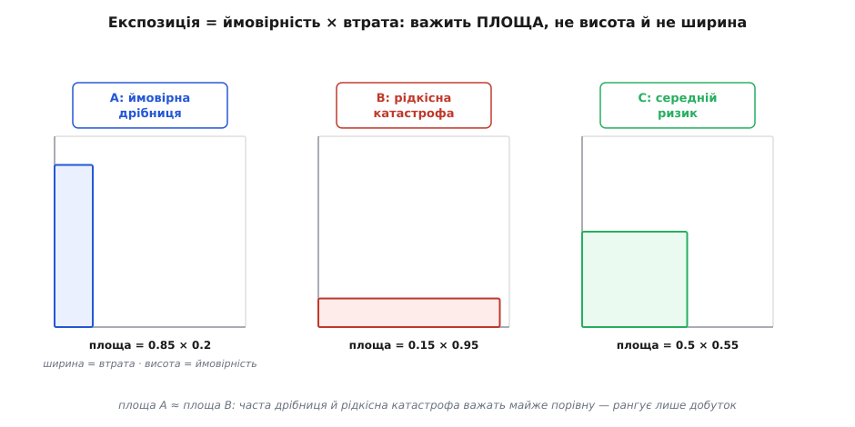
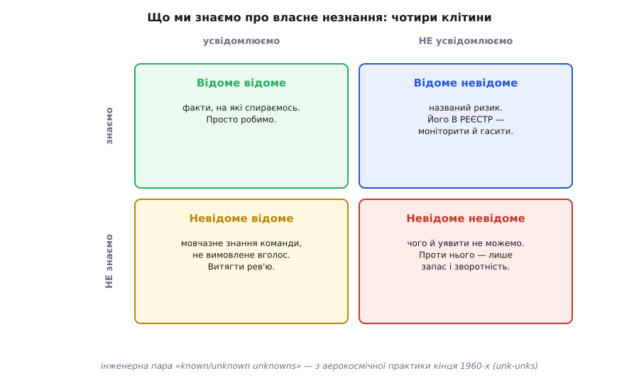
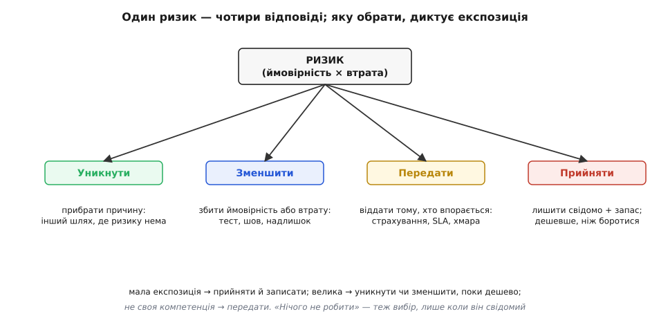

# Ризик-мислення

<preknowlist>
- [Архітектурні драйвери](topic:sf-apps/architectural-drivers) — те, що справді формує систему: ключові вимоги, обмеження й найризикованіші місця. Ризик — один з драйверів.
- [Trade-off-аналіз](topic:sf-apps/tradeoff-analysis) — кожне рішення щось віддає за щось; ризик-мислення зважує ці ставки під невизначеністю.
- [Зворотні й незворотні рішення](topic:sf-apps/reversible-irreversible-decisions) — вартість відкоту рішення; головна зброя проти ризику, якого не передбачити.
- [Якісні атрибути](topic:sf-apps/quality-attributes) — «-ilities» системи (доступність, продуктивність, змінюваність); саме їх ризик ставить під загрозу.
</preknowlist>

Попросіть двох архітекторів спроєктувати ту саму систему — і ви, найпевніше, отримаєте два різні креслення, обидва розумні. А тепер попросіть їх сказати, **що в цій системі найімовірніше піде не так і скільки це коштуватиме**, — і ось тут різниця між новачком і майстром стає прірвою. Бо гарну діаграму намалює багато хто. А от побачити наперед, де саме тонко й де порветься, поки ще нічого не сталося й усе виглядає добре, — це вже окреме ремесло. Воно й називається ризик-мисленням.

Слово тут не випадкове, і його корінь багато пояснює. «Ризик» (італ. *risco*, *rischio* — стрімчак, скеля) прийшов з мови середземноморських мореплавців: risco — то підводна скеля, якої не видно з поверхні, але яка розпорює днище, коли на неї налетіти. Купці північноіталійських міст-держав ще у XIV столітті вживали це слово, страхуючи морські перевезення (пізніший зв'язок із грецьким *rhíza* — корінь — і арабським *risq* — доля — етимологи вважають спірним). І це рівно та картина, з якої треба почати: ризик — не «щось погане взагалі», а **конкретна прихована скеля на твоєму курсі**. Її ще не видно. Але вона там, і твоя робота — не заплющувати очі, а нанести її на карту, поки не пізно завернути.

## Ризик — це не проблема; це проблема, якої ще нема

Найперше треба розвести два поняття, які повсякчас плутають, і плутанина ця дорого коштує. **Проблема** (гр. *próblēma* — те, що кинуто попереду) — те, що вже сталося: сервіс лежить, дані втрачено, дедлайн зірвано. З проблемою розбираються реактивно — гасять пожежу. **Ризик** — те, що ще **не** сталося, але може: подія в майбутньому з ненульовою ймовірністю й ненульовою шкодою. І вся сила ризик-мислення в тому, що ризиком можна займатися **зараз**, коли він ще дешевий, — а проблемою доводиться займатися потім, коли вона вже дорога.

Різниця в ціні тут не лінійна, а обвальна. Скеля, помічена на карті за милю, коштує легкого повороту стерна. Та сама скеля, у яку вже врізалися, коштує корабля. Тому досвідчений інженер витрачає непропорційно багато уваги на те, чого ще нема, — саме тому, що це найдешевша можлива точка втручання. Ризик-мислення — це звичка систематично дивитися вперед і питати «а що, як?» тоді, коли всі навколо дивляться на поточний стан і кажуть «поки все працює».

> 🔧 **Навіщо це.** Коли ви обираєте базу даних, чергу повідомлень чи спосіб автентифікації, ви не просто обираєте технологію — ви робите **ставку** про майбутнє, якого ще не знаєте. Ризик-мислення — це дисципліна називати ці ставки вголос: «якщо навантаження зросте вдесятеро, ця черга захлинеться»; «якщо цей зовнішній сервіс упаде, ми впадемо разом з ним». Назване можна зважити й підстрахувати. Неназване чекає, поки саме нагадає про себе — о третій ночі, у проді, найгіршого дня.

## Ранг ризику — це площа, а не висота

Щойно ви навчилися бачити ризики, з'являється нова біда: їх видно **забагато**. Впаде мережа, звільниться ключовий розробник, замовник передумає, лібу закинуть, дані витечуть, навантаження стрибне… Якщо ставитися до всіх однаково, ви або паралізуєте себе страхом, або, що ймовірніше, махнете рукою на все. Потрібен спосіб **рангувати** — вирішувати, який ризик вартий уваги першим.

Спокуса — судити за одним із двох вимірів. Хтось міряє **ймовірністю** («це майже напевно станеться!»), хтось — **шкодою** («якщо це станеться, нам кінець!»). Обидва помиляються поодинці, бо жоден вимір сам собою рангу не дає. Подія, що станеться майже напевно, але коштує дрібниць, — це прикра дрібниця, не катастрофа. Подія, що знищить компанію, але має ймовірність один на мільярд, — не варта того, щоб через неї не спати. Ранг дає лише **добуток** цих двох.

Цю думку формально закріпив **Баррі Бем** (Barry Boehm) у праці «Software Risk Management: Principles and Practices» (IEEE Software, том 8, № 1, січень 1991) — одному з наріжних текстів дисципліни. Він увів величину **експозиції ризику** (англ. *risk exposure* — букв. «підставленість» під ризик):

```
Експозиція = Ймовірність(подія станеться) × Втрата(якщо станеться)
```

Ключове тут — що це **множення**, тобто **площа** прямокутника, а не висота стовпчика. Прямокутник зі сторонами «ймовірність» і «втрата»: часта дрібниця — низький і широкий; рідкісна катастрофа — високий і вузький; а площа в них може вийти однакова. І саме площа каже, куди дивитися першим.


*Експозиція — це площа прямокутника «ймовірність × втрата», а не одна з його сторін. Часта дрібниця (A) і рідкісна катастрофа (B) можуть мати майже рівну площу — і тому заслуговують порівнянної уваги, хоча інтуїція кричить, що вони «зовсім різні». Рангує лише добуток.*

На практиці ні ймовірність, ні втрату точно ви не знаєте — і не треба. Досить грубих оцінок: ймовірність як «низька / середня / висока» (скажімо, 0.1 / 0.5 / 0.9), втрата — у людино-днях на усунення чи в прямих грошах. Помножили — дістали одне число, за яким ризики шикуються від найтовщого до найтоншого. Точність тут другорядна: важить **порядок**, а не третій знак. Це той самий дух, що й у [прикидці «на серветці»](topic:sf-apps/back-of-envelope) — груба оцінка, якої досить, щоб ухвалити рішення, коштує копійки, а зволікання заради точності — дорого.

Порахувати експозицію двох конкурентних варіантів наскрізним прикладом — від грубих цифр до вироку, яку архітектуру обрати, — [показано окремо](topic:sf-apps/risk-thinking/proj-exposure-decision.md).

## Чотири клітини: що ми знаємо про власне незнання

Дотепер ми говорили про ризики, які **можна назвати**. Але найнебезпечніші — ті, яких назвати не можна, бо про них ще й гадки нема. Щоб не осліпнути на цю категорію, інженери користуються простою, але глибокою картою, що ділить усе знання на чотири клітини за двома осями: **чи знаємо ми факт** і **чи усвідомлюємо, що знаємо (або не знаємо) його**.

Ця пара термінів — «відоме невідоме» (*known unknowns*) і «невідоме невідоме» (*unknown unknowns*) — прийшла не з філософії й не з політики, попри гучну промову Дональда Рамсфелда 2002 року, яку часто згадують. Її виточила **аерокосмічна інженерна практика кінця 1960-х**: у 1968 році і Гадсон Дрейк з North American Rockwell, і генерал Вільям Банкер уживали цей поділ, обговорюючи розробку складних систем, а серед інженерів NASA невідоме-невідоме навіть скоротили до жаргонного «unk-unks». Тобто це від початку **інженерний** інструмент керування ризиком, і саме так ми його й беремо.


*Чотири клітини знання про власне незнання. Кожна вимагає іншого поводження: відоме відоме — просто робимо; відоме невідоме — заносимо в реєстр і моніторимо; невідоме відоме — витягуємо назовні рев'ю; невідоме невідоме — не назвемо, тож проти нього працює лише запас міцності й зворотність рішень.*

Розберемо клітини, бо кожна диктує іншу зброю.

**Відоме відоме** — факти, на які ми свідомо спираємося: знаємо пропускну здатність мережі, знаємо формат даних. Тут ризику нема, просто працюємо.

**Відоме невідоме** — це **названий ризик**: ми усвідомлюємо, що чогось не знаємо. «Не знаємо, чи витримає база пікове навантаження.» «Не знаємо, коли постачальник закриє цей API.» Оце — головний хліб ризик-мислення: такий ризик можна записати, оцінити його експозицію й вирішити, що з ним робити. Місце, де такі ризики живуть, називають [ризик-реєстром](topic:sf-apps/risk-register) — живим списком, який ведуть від початку проєкту до кінця.

**Невідоме відоме** — підступна клітина: хтось у команді **знає** про небезпеку, але вона не вимовлена вголос, тож для команди в цілому її наче й нема. Досвідчений інженер нутром чує, що «цей сторонній сервіс має звичку падати під новорічне навантаження», — але якщо він цього не сказав, а решта не спитала, знання лишається німим. Проти цієї клітини працює одне: **рев'ю** й розмова — [рев'ю архітектури](topic:sf-apps/architecture-review), спільний розбір, пряме запитання «а що тебе тут непокоїть?». Мовчазне знання витягують назовні лише тим, що змушують його промовити.

**Невідоме невідоме** — найглибша й найчесніша клітина: те, чого ми не лише не знаємо, а й **уявити не можемо**, що воно існує. Новий вид атаки, якого ще не винайшли; фізичний ефект, про який ніхто не подумав; вимога, що з'явиться через два роки. За визначенням, такий ризик неможливо ні назвати, ні оцінити — тож проти нього безсилі будь-які реєстри й розрахунки. Єдина зброя тут — не передбачення, а **стійкість**: запас міцності, надлишковість, і головне — **зворотність рішень**, щоб коли невідоме таки виринуло скелею з-під води, систему можна було дешево перекроїти. Саме тому вміння тримати [двері двобічними](topic:sf-apps/reversible-irreversible-decisions) — не окрема примха, а пряма відповідь на цілу клітину ризиків, які інакше нічим не взяти.

## Чотири речі, які можна зробити з ризиком

Назвати ризик і зважити його експозицію — це діагноз. Далі потрібне лікування, і варіантів рівно чотири. Ця класифікація стара, перевірена й вичерпна: будь-яка ваша дія з ризиком зводиться до одного з цих чотирьох, і плутати їх — значить робити не те.


*Чотири відповіді на будь-який ризик. Що з них обрати — диктує експозиція: малу приймають і записують; велику уникають або зменшують, поки це дешево; не свою компетенцію передають тому, хто впорається. «Нічого не робити» — теж вибір, але правильний лише тоді, коли він свідомий, а не за замовчуванням.*

**Уникнути** (*avoid*) — прибрати саму причину ризику, обравши шлях, де його немає. Боїтеся, що екзотична база підведе під навантаженням? Візьміть перевірену — ризик випарувався разом з екзотикою. Це найрадикальніша й часто найдешевша відповідь, але вона завжди щось коштує: уникаючи ризику, ви зазвичай відмовляєтеся й від вигоди, заради якої ризикований шлях узагалі розглядали.

**Зменшити** (*mitigate*, лат. *mitigare* — пом'якшувати) — збити або ймовірність, або втрату, не прибираючи ризик цілком. Оскільки експозиція — це добуток, зменшити досить **будь-який** із множників. Ймовірність збивають тестами, репетиціями, ранньою перевіркою. Втрату — надлишковістю (впав один вузол — підхопить другий), швами й ізоляцією ([перебірками](topic:sf-distributed/bulkhead-isolation), що не дають одній відмові потягти за собою всю систему). Це найчастіша інженерна відповідь: більшість архітектурних тактик — доступності, продуктивності, тестовності — це по суті машини зменшення експозиції.

**Передати** (*transfer*) — лишити ризик як є, але перекласти його наслідки на того, хто впорається краще. Страхування — класична форма; у нашому ремеслі це купівля хмарного сервісу з гарантією рівня послуги ([SLA](topic:sf-release/slo-sli-sla)), делегування платежів провайдеру, чужа відповідальність за безвідмовність. Ви не прибрали ризик — ви заплатили комусь, хто вміє його нести. Важлива чесність: передати можна наслідки, але не завжди **відповідальність** перед вашим користувачем; якщо чужий сервіс усе ж упаде, ваш клієнт спитає з вас.

**Прийняти** (*accept*) — свідомо вирішити нічого не робити, бо боротьба дорожча за сам ризик. Це цілком законна, часто наймудріша відповідь — **за однієї умови**: рішення має бути **свідомим і записаним**, а не наслідком того, що ризик просто проґавили. Різниця між «ми зважили цей ризик і вирішили прийняти його, бо експозиція мала» і «ми про нього не подумали» — це різниця між зрілістю й недбальством, хоча зовні обидва виглядають однаково: ніхто нічого не зробив.

І тут ховається головна пастка. **За замовчуванням, коли не думати про ризик зовсім, він теж «приймається» — але наосліп.** Ось чому називати ризики так важливо: доки ризик не названий, ви вже його прийняли, самі того не відаючи. Ризик-мислення перетворює цей мовчазний, випадковий вибір на явний і зважений.

## Займатися ризиком треба рано — бо потім він дорожчає

Є одна властивість ризику, яка визначає всю стратегію поводження з ним: **вартість усунення ризику росте з часом, а вартість помилки — тим паче.** На початку проєкту, коли ще нічого не збудовано, змінити напрям майже безкоштовно. Що далі, то більше коду, даних і людей спираються на кожне рішення, і то дорожче його переграти — рівно так, як росте вартість відкоту в незворотних рішеннях.

Звідси випливає стратегія, яку добре сформулювали **Том Демарко й Тімоті Лістер** у книжці «Waltzing with Bears» (2003), присвяченій ризику в софтверних проєктах: не тікати від ризику й не заплющувати очі, а **йти на найризикованіше першим, поки це дешево**. Їхня теза перевертає інтуїцію: проєкт, який утікає від будь-якого ризику, приречений відстати від сміливіших, бо більший ризик несе й більшу винагороду. Мистецтво не в тому, щоб ризику уникати, а в тому, щоб **брати варті ризики свідомо й рано**.

Практично це означає: найстрашніший, найтуманніший шматок системи роблять **не наостанок, а першим** — тонким наскрізним зрізом, [walking skeleton](topic:sf-apps/walking-skeleton), що проходить систему від краю до краю й перевіряє найризикованіше припущення на живому, поки з нього ще легко зійти. Класична помилка — лишити «найважче» на потім, збудувати навколо нього гору коду, а тоді виявити, що воно взагалі не працює. На той момент відкотити вже нема як. Ризик, залишений дозрівати, стає найдорожчою проблемою.

Розберемо це на коді. Уявіть систему, що покладається на зовнішній платіжний сервіс, — джерело серйозного ризику (він може бути повільним, впасти, змінити відповідь). Наївний код зшиває цей ризик намертво з логікою:

:::tabs
```cpp
// РИЗИК ВШИТО: зовнішній виклик прямо в бізнес-логіці, без страховки
double charge_customer(int customer_id, double amount) {
    // прямий синхронний виклик чужого сервісу — якщо він ляже, ляжемо ми
    HttpResponse r = http_post("https://pay.example.com/charge",
                               customer_id, amount);
    return r.body_as_double();   // а якщо таймаут? а якщо 500? а якщо повільно?
}
```
```py
# РИЗИК ВШИТО: зовнішній виклик прямо в бізнес-логіці, без страховки
def charge_customer(customer_id: int, amount: float) -> float:
    # прямий синхронний виклик чужого сервісу — якщо він ляже, ляжемо ми
    r = requests.post("https://pay.example.com/charge",
                      json={"customer_id": customer_id, "amount": amount})
    return float(r.text)   # а якщо таймаут? а якщо 500? а якщо повільно?
```
```go
// РИЗИК ВШИТО: зовнішній виклик прямо в бізнес-логіці, без страховки
func chargeCustomer(customerID int, amount float64) float64 {
	// прямий синхронний виклик чужого сервісу — якщо він ляже, ляжемо ми
	resp, _ := http.PostForm("https://pay.example.com/charge",
		url.Values{"customer_id": {strconv.Itoa(customerID)},
			"amount": {fmt.Sprint(amount)}})
	body, _ := io.ReadAll(resp.Body) // а якщо таймаут? а якщо 500? а якщо повільно?
	v, _ := strconv.ParseFloat(string(body), 64)
	return v
}
```
```ts
// РИЗИК ВШИТО: зовнішній виклик прямо в бізнес-логіці, без страховки
async function chargeCustomer(customerId: number, amount: number): Promise<number> {
  // прямий синхронний виклик чужого сервісу — якщо він ляже, ляжемо ми
  const r = await fetch("https://pay.example.com/charge", {
    method: "POST",
    body: JSON.stringify({ customerId, amount }),
  });
  return Number(await r.text()); // а якщо таймаут? а якщо 500? а якщо повільно?
}
```
:::

Тут ризик прийнято наосліп: жодної відповіді на нього не закладено. Тепер той самий виклик, але з **явними** відповідями на ризик — зменшенням (таймаут, повтори, запасний хід) і зворотністю (виклик за швом, щоб постачальника можна було замінити):

:::tabs
```cpp
// РИЗИК НАЗВАНО Й ЗМЕНШЕНО: таймаут + повтор + запасний хід, і все за швом
struct PaymentGateway {                 // шов: логіка знає лише інтерфейс
    virtual PayResult charge(int customer_id, double amount) = 0;
    virtual ~PaymentGateway() = default;
};

PayResult charge_customer(PaymentGateway& gw, int customer_id, double amount) {
    for (int attempt = 0; attempt < 3; ++attempt) {   // зменшуємо ЙМОВІРНІСТЬ збою
        PayResult r = gw.charge(customer_id, amount);  // (таймаут — усередині адаптера)
        if (r.ok) return r;
    }
    // запасний хід зменшує ВТРАТУ: не валимо все, а ставимо платіж у чергу
    return PayResult::queued_for_retry(customer_id, amount);
}
// Постачальник за швом → якщо цей сервіс виявиться поганим, міняємо адаптер,
// а charge_customer і виклики не чіпаємо. Це відповідь на «невідоме невідоме».
```
```py
from typing import Protocol

# РИЗИК НАЗВАНО Й ЗМЕНШЕНО: таймаут + повтор + запасний хід, і все за швом
class PaymentGateway(Protocol):         # шов: логіка знає лише інтерфейс
    def charge(self, customer_id: int, amount: float) -> PayResult: ...

def charge_customer(gw: PaymentGateway, customer_id: int, amount: float) -> PayResult:
    for _attempt in range(3):                # зменшуємо ЙМОВІРНІСТЬ збою
        r = gw.charge(customer_id, amount)   # (таймаут — усередині адаптера)
        if r.ok:
            return r
    # запасний хід зменшує ВТРАТУ: не валимо все, а ставимо платіж у чергу
    return PayResult.queued_for_retry(customer_id, amount)
# Постачальник за швом → якщо цей сервіс виявиться поганим, міняємо адаптер,
# а charge_customer і виклики не чіпаємо. Це відповідь на «невідоме невідоме».
```
```go
// РИЗИК НАЗВАНО Й ЗМЕНШЕНО: таймаут + повтор + запасний хід, і все за швом
type PaymentGateway interface { // шов: логіка знає лише інтерфейс
	Charge(customerID int, amount float64) PayResult
}

func chargeCustomer(gw PaymentGateway, customerID int, amount float64) PayResult {
	for attempt := 0; attempt < 3; attempt++ { // зменшуємо ЙМОВІРНІСТЬ збою
		r := gw.Charge(customerID, amount) // (таймаут — усередині адаптера)
		if r.OK {
			return r
		}
	}
	// запасний хід зменшує ВТРАТУ: не валимо все, а ставимо платіж у чергу
	return QueuedForRetry(customerID, amount)
}

// Постачальник за швом → якщо цей сервіс виявиться поганим, міняємо адаптер,
// а chargeCustomer і виклики не чіпаємо. Це відповідь на «невідоме невідоме».
```
```ts
// РИЗИК НАЗВАНО Й ЗМЕНШЕНО: таймаут + повтор + запасний хід, і все за швом
interface PaymentGateway {              // шов: логіка знає лише інтерфейс
  charge(customerId: number, amount: number): Promise<PayResult>;
}

async function chargeCustomer(
  gw: PaymentGateway, customerId: number, amount: number,
): Promise<PayResult> {
  for (let attempt = 0; attempt < 3; attempt++) { // зменшуємо ЙМОВІРНІСТЬ збою
    const r = await gw.charge(customerId, amount); // (таймаут — усередині адаптера)
    if (r.ok) return r;
  }
  // запасний хід зменшує ВТРАТУ: не валимо все, а ставимо платіж у чергу
  return PayResult.queuedForRetry(customerId, amount);
}
// Постачальник за швом → якщо цей сервіс виявиться поганим, міняємо адаптер,
// а chargeCustomer і виклики не чіпаємо. Це відповідь на «невідоме невідоме».
```
:::

Другий варіант довший — і в цьому вся суть. Ця зайва довжина є не ускладненням заради ускладнення, а **матеріалізованою відповіддю на ризик**: кожен зайвий рядок гасить конкретну приховану скелю. Перший варіант коротший рівно тому, що всі скелі в ньому просто проігноровано.

## Ризик-мислення — це наскрізна лінза, а не окремий етап

Найпоширеніше непорозуміння — думати, що керування ризиком це якийсь окремий ритуал: сіли раз на початку, склали список страхів, поставили галочку, забули. Насправді ризик-мислення — це **постійна лінза**, крізь яку архітектор дивиться на кожне рішення, повсякчас.

Ця лінза непомітно вплетена в усе ремесло. Коли ви робите [trade-off-аналіз](topic:sf-apps/tradeoff-analysis), ви по суті питаєте: «яких ризиків додає кожен варіант?» Коли розрізняєте [зворотні й незворотні двері](topic:sf-apps/reversible-irreversible-decisions), ви керуєте ризиком помилки: незворотне рішення небезпечне саме тим, що помилку в ньому не виправити. Коли пишете [сценарій якісного атрибута](topic:sf-apps/attribute-scenarios) — «за навантаження 10⁴ запитів затримка ≤ 200 мс» — ви називаєте ризик того, що система цього не витягне, у формі, яку можна перевірити. Коли робите строгий аналіз архітектури [ATAM-класу](topic:sf-apps/atam-lite), ви систематично полюєте на **точки чутливості** й **точки компромісу** — а це рівно ті місця, де ризик концентрується найгустіше. Ризик — спільний знаменник усієї дисципліни архітектора; він не поруч із рештою, а **всередині** кожного її прийому.

Але щоб названі ризики не губилися, їх треба десь **тримати** — і не в голові, бо голова забуває, а люди йдуть. Тут ризик-мислення переходить у конкретний артефакт: [ризик-реєстр](topic:sf-apps/risk-register), живий список, де кожен ризик записаний разом зі своєю ймовірністю, втратою, обраною відповіддю й тим, хто за нього відповідає. Він ведеться від першого дня до останнього, дихає разом із проєктом: одні ризики закриваються, коли їх усунуто, інші виринають, коли світ змінюється. Мислення без такого артефакту випаровується; артефакт без мислення стає мертвим формуляром. Разом же вони й дають те, заради чого все затівалося: здатність провести систему повз скелі, яких іще не видно з палуби, — спокійно нанісши їх на карту, поки до них ще далеко.
