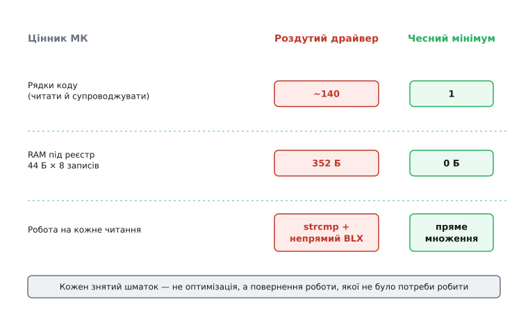

# ⚙️ Приборкати другу систему: роздутий драйвер давача — назад до чесного мінімуму

На столі лежить драйвер, який писала впевнена рука. Продукт читає **один** температурний давач, але код зроблено «на майбутнє»: реєстр драйверів, диспетчеризація за іменем, поля калібрування, масштабу, фільтра й CRC — усе про запас. Він компілюється, він працює, він навіть виглядає солідно. І кожен його рядок — податок, який прошивка платить щодня Flash-ом, RAM-ом і тактами, а користі з нього нуль, поки другий давач не прийшов (а може, й не прийде).

Мета цієї роботи — не поліпшити цю конструкцію ще однією опцією, а **звести її назад** до однієї чесної функції під той єдиний давач, що реально є, — і зробити це так, щоб байти на шині й число на виході лишилися ті самі. А тоді показати, як правильно вивести абстракцію, коли (і якщо) з'явиться **другий реальний** давач — не уявний. Головне слово тут — **не зламати**: наприкінці кожного кроку прошивка має читати ту саму температуру тим самим способом, що й на початку.

Різати наосліп страшно, бо не знаєш, який шматок машинерії насправді тримає поведінку, а який — оздоба. Тому спершу поставимо запобіжник, який відрізнить одне від одного, а тоді підемо кроками, і на кожному кроці цей запобіжник лишатиметься зеленим.

## Що саме лежить на столі

Ось повна форма роздутого драйвера — не ескіз, а те, що реально скомпілюється й займе місце. Читай його як список рішень, кожне з яких колись здавалося розумним.

```c
// --- sensor.h: "гнучкий" драйвер під один реальний давач ---
#include <stdint.h>
#include <stdbool.h>
#include <string.h>

#define MAX_DRIVERS   8      // "раптом буде вісім давачів"

typedef struct {
    const char *name;                       // ім'я для пошуку в реєстрі
    int  (*read_raw)(void *ctx, int32_t *out);  // вказівник на функцію читання
    void  *ctx;                             // контекст конкретного давача
    float  offset_cal;      // калібрування зсуву — "раптом знадобиться"
    float  scale_cal;       // калібрування масштабу — теж про запас
    uint16_t sample_rate_hz;// налаштовна частота — "а раптом"
    uint8_t  filter_order;  // порядок ковзного середнього — "на майбутнє"
    bool     enable_crc;    // перевірка цілісності по шині — "про всяк"
    int32_t  hist[8];       // буфер під фільтр — вісім відліків на кожен давач
    uint8_t  hist_pos;      // курсор кільцевого буфера
} sensor_driver_t;

static sensor_driver_t g_drivers[MAX_DRIVERS];
static uint8_t         g_driver_count;

int   sensor_register(const sensor_driver_t *d);
int   sensor_read_by_name(const char *name, float *celsius);
void  sensor_set_calibration(const char *name, float off, float scale);
void  sensor_set_filter(const char *name, uint8_t order);
```

І реалізація — теж повна, бо саме в ній ховається ціна:

```c
// --- sensor.c ---
static sensor_driver_t *find(const char *name) {
    for (uint8_t i = 0; i < g_driver_count; i++)          // лінійний пошук
        if (strcmp(g_drivers[i].name, name) == 0)         // порівняння рядків
            return &g_drivers[i];
    return 0;
}

int sensor_register(const sensor_driver_t *d) {
    if (g_driver_count >= MAX_DRIVERS) return -1;
    g_drivers[g_driver_count++] = *d;                     // копія 40+ байтів
    return 0;
}

void sensor_set_calibration(const char *name, float off, float scale) {
    sensor_driver_t *d = find(name);
    if (d) { d->offset_cal = off; d->scale_cal = scale; }
}

void sensor_set_filter(const char *name, uint8_t order) {
    sensor_driver_t *d = find(name);
    if (d && order <= 8) d->filter_order = order;
}

int sensor_read_by_name(const char *name, float *celsius) {
    sensor_driver_t *d = find(name);                      // пошук на КОЖНЕ читання
    if (!d) return -1;

    int32_t raw;
    if (d->read_raw(d->ctx, &raw) != 0) return -2;        // непрямий виклик

    if (d->filter_order > 1) {                            // ковзне середнє
        d->hist[d->hist_pos++ % 8] = raw;
        int32_t sum = 0;
        for (uint8_t i = 0; i < d->filter_order; i++)
            sum += d->hist[i];
        raw = sum / d->filter_order;
    }
    float t = (float)raw * 0.01f;                         // сирі 0.01 °C
    t = t * d->scale_cal + d->offset_cal;                 // калібрування
    *celsius = t;
    return 0;
}
```

І точка, де цим усім користуються — рівно один раз, під єдиний реальний давач:

```c
// --- main.c: як воно насправді викликається ---
static int bmp280_read(void *ctx, int32_t *out) {
    (void)ctx;
    *out = bmp280_read_centi_celsius();   // сотні градуса від мікросхеми
    return 0;
}

void app_init(void) {
    sensor_driver_t d = {
        .name = "bmp280",
        .read_raw = bmp280_read,
        .ctx = 0,
        .offset_cal = 0.0f,
        .scale_cal = 1.0f,          // калібрування = "нічого не робити"
        .filter_order = 1,          // фільтр = "нічого не робити"
        .enable_crc = false,
    };
    sensor_register(&d);
}

float read_temperature(void) {
    float t;
    sensor_read_by_name("bmp280", &t);   // пошук за рядком "bmp280"
    return t;
}
```

Придивись до ініціалізації: `scale_cal = 1.0f`, `offset_cal = 0.0f`, `filter_order = 1`. Це означає, що **вся** машинерія калібрування й фільтра на кожному читанні виконує тотожність — множить на одиницю, додає нуль, усереднює один відлік сам із собою. Реєстр має рівно один запис, а пошук за рядком `"bmp280"` щоразу проходить `strcmp` заради того, щоб знайти єдиний елемент. Гнучкість присутня в коді, у Flash і в RAM — і відсутня в роботі. Це і є друга система в чистому вигляді: [YAGNI](root:sf-apps/dry-kiss-yagni)-порушення, помножене на впевненість.

> 🔧 **Навіщо це.** На мікроконтролері ця «безкоштовна гнучкість» має цілком конкретний цінник. Структура `sensor_driver_t` — це 44 байти RAM на кожен запис (вказівники, три float-и, буфер `hist[8]` — 32 байти самого лише буфера), помножені на `MAX_DRIVERS = 8`, тобто 352 байти RAM зарезервовано під давачі, яких немає. `strcmp` на кожне читання — це цикл по байтах рядка. Непрямий виклик через `read_raw` — це `BLX` замість `BL`: компілятор не може вбудувати (inline) тіло, бо не знає його на етапі складання, і платить зайвим перезаповненням конвеєра. На STM32 з 20 КБ RAM 352 змарнованих байти — це майже два відсотки всієї пам'яті, віддані за ніщо.

## Спершу — запобіжник, без якого різати сліпо

Звести драйвер до мінімуму — це рефакторинг: за визначенням змінюємо **форму** коду, не **поведінку**. Але «не поведінку» треба чимось довести, інакше ми просто прибираємо рядки з надією, що нічого не відпало. Доказ дає **характеризувальний тест** (англ. *characterization test* — «тест, що фіксує наявну поведінку»): він не звіряє код зі специфікацією, а закарбовує те, що код робить **зараз**, разом з усіма дрібницями, і потім стежить, щоб після кожного кроку відповідь не зрушила.

Щоб зафіксувати поведінку, треба відрізати драйвер від справжнього заліза — реальний давач у тесті ми не смикаємо. Замінимо `bmp280_read_centi_celsius` детермінованим джерелом: хай видає наперед відому послідовність сирих значень. Тоді на вхід — та сама послідовність, на виході — те саме число, і будь-яке відхилення після кроку рефакторингу одразу видно.

```c
// --- test_harness.c: детерміноване джерело замість давача ---
static const int32_t FAKE[] = { 2510, 2515, 2500, 2530, 2495 };  // сотні °C
static uint8_t fake_pos;

int32_t bmp280_read_centi_celsius(void) {   // підміна на час тесту
    return FAKE[fake_pos++ % 5];
}

int main(void) {
    app_init();                              // реєструє "bmp280"
    for (int i = 0; i < 5; i++) {
        float t = read_temperature();
        print_float("t", t);                 // друкуємо еталон
    }
    return 0;
}
```

Перший прогін дає, скажімо, такі рядки (числа умовні, важливий сам факт фіксації):

```
t = 25.10
t = 25.15
t = 25.00
t = 25.30
t = 24.95
```

Це — **еталон** (англ. *golden* — «золотий зразок»). Після кожного кроку той самий прогін має дати ці самі п'ять чисел. Тепер, коли поведінка прибита цвяхом, різати вже не сліпо: якщо еталон зелений, шматок, який ми зняли, поведінки не тримав — отже, це була оздоба, а не спільність. Саме так запобіжник і відрізняє одне від одного.

## Крок 1 — прибрати те, що виконує тотожність

Почнемо з найдешевшого й найбезпечнішого: код, який на реальних даних не робить нічого. Калібрування зі `scale = 1`, `offset = 0` — це `t*1 + 0`, тобто `t`. Фільтр із `filter_order = 1` — це середнє одного значення, тобто саме значення. Приберемо обидва блоки з `sensor_read_by_name` і одразу проженемо тест.

```c
// Крок 1: викинуто гілки фільтра й калібрування (вони робили тотожність)
int sensor_read_by_name(const char *name, float *celsius) {
    sensor_driver_t *d = find(name);
    if (!d) return -1;

    int32_t raw;
    if (d->read_raw(d->ctx, &raw) != 0) return -2;

    *celsius = (float)raw * 0.01f;   // сирі сотні °C → градуси
    return 0;
}
```

Еталон зелений: ті самі п'ять чисел. Це доводить, що гілки калібрування й фільтра поведінки **не** тримали — на цих даних вони були порожні. А раз ми викинули їхнє **використання**, то поля `offset_cal`, `scale_cal`, `filter_order`, `hist[8]`, `hist_pos` більше ніхто не читає. І функції `sensor_set_calibration`, `sensor_set_filter` теж повисли в повітрі — їх ніхто не кличе. Компілятор із увімкненим `-ffunction-sections -Wl,--gc-sections` викине мертвий код сам, але **нам** треба прибрати його з вихідного тексту, бо ціна другої системи — не лише в байтах, а в очах, що це читають, і в руках, що це супроводжують.

```c
// Крок 1 (продовження): структура схудла — зникли поля-мерці
typedef struct {
    const char *name;
    int  (*read_raw)(void *ctx, int32_t *out);
    void  *ctx;
} sensor_driver_t;
```

Було 44 байти на запис — стало 12 (три вказівники на 32-бітній машині). Реєстр із восьми таких — 96 байтів замість 352. Функції-сетери зникли повністю. Еталон досі зелений — ми не торкнулися жодного шляху, яким тече реальне число.

## Крок 2 — прибрати диспетчеризацію за іменем

Тепер придивімося до `find`. Він шукає в реєстрі рядок `"bmp280"`. Але в реєстрі рівно один запис, і ім'я, за яким шукають, — константа, вкладена в код виклику. Пошук, що завжди знаходить нульовий елемент за наперед відомим ключем, — це складна відповідь на питання, якого ніхто не ставив. Приберемо реєстр і пошук; хай `sensor_read` кличе єдиний давач прямо.

```c
// Крок 2: жодного реєстру, жодного strcmp — прямий виклик davача
static int bmp280_read(int32_t *out) {
    *out = bmp280_read_centi_celsius();
    return 0;
}

int sensor_read(float *celsius) {
    int32_t raw;
    if (bmp280_read(&raw) != 0) return -2;
    *celsius = (float)raw * 0.01f;
    return 0;
}
```

Точка виклику спрощується дзеркально — більше нема рядка `"bmp280"`, який треба пам'ятати й ні з чим не переплутати:

```c
float read_temperature(void) {
    float t;
    sensor_read(&t);
    return t;
}
```

Оновимо підміну в тесті (тепер джерело кличеться напряму, без реєстрації) — і проженемо. Еталон зелений: ті самі п'ять чисел. А тепер подивись, що зникло разом із реєстром: масив `g_drivers`, лічильник `g_driver_count`, функції `find`, `sensor_register`, тип `sensor_driver_t` цілком, `#include <string.h>` заради `strcmp`, константа `MAX_DRIVERS`. Непрямий виклик через вказівник `read_raw` теж зник — тепер компілятор бачить, що `sensor_read` кличе саме `bmp280_read`, і може вбудувати його тіло, перетворивши `BLX` на пряме звертання або й зовсім прибравши виклик. Пошук за рядком на кожне читання — зник. Ми не пришвидшували код; ми **прибрали роботу, якої не було потреби робити**.

## Крок 3 — злити останні перегородки

Лишилися два тонкі шари, які колись були потрібні реєстрові, а тепер просто передають число з рук у руки: `bmp280_read` (обгортка над мікросхемою) і `sensor_read` (обгортка над обгорткою). Коли давач один, ця драбина з двох сходинок нічого не тримає — злиймо її в одну чесну функцію.

```c
// Крок 3: чесний мінімум — одна функція робить рівно одне
float read_temperature(void) {
    return (float)bmp280_read_centi_celsius() * 0.01f;
}
```

Це — та сама функція, з якої все мало починатися. Еталон зелений уп'яте: ті самі п'ять чисел, той самий шлях від мікросхеми до градусів. Ми пройшли від сорока-з-гаком рядків заголовка й ста рядків реалізації до одного виразу — і жодного байта поведінки не втратили, бо поведінки в тому всьому й не було. Уся різниця між першим станом і цим — чиста ціна другої системи, яку тепер видно як віднятий залишок.

## Що саме ми зняли — і скільки воно коштувало

Варто зупинитися й полічити, бо саме невидимість ціни живить ефект. Ось що коштував роздутий драйвер супроти чесного мінімуму на типовому Cortex-M.



*Три цінники, які роздутий драйвер списував із мікроконтролера щодня, а чесний мінімум — ні. Рядки коду (що читати й супроводжувати), RAM під реєстр на вісім неіснуючих давачів, і робота на кожне читання: пошук за рядком плюс непрямий виклик проти прямого множення. Кожен знятий шматок був не оптимізацією, а поверненням роботи, якої не було потреби робити.*

Розберімо цифри по черзі, бо кожна — окремий урок.

**RAM.** `sensor_driver_t` роздутої версії — 44 байти (вирівняні): вказівник `name` (4), вказівник `read_raw` (4), `ctx` (4), три `float` (12), `sample_rate_hz` + `filter_order` + `enable_crc` з вирівнюванням (4), `hist[8]` (32), `hist_pos` з вирівнюванням (4). Помножимо на `MAX_DRIVERS = 8` — і статичний масив `g_drivers` займає:

```
44 байти × 8 = 352 байти RAM
```

Ці 352 байти зарезервовано на етапі складання й вони зайняті весь час роботи, хоч використано лише один запис із восьми. Чесний мінімум не має жодного статичного стану — 0 байтів. На МК із 20 КБ RAM це різниця між 1.8 % пам'яті, відданими за ніщо, і нулем.

**Flash.** Реєстр, `strcmp`, три сетери, гілки фільтра й калібрування, таблиця імен у `.rodata` — усе це код і константи, що лягають у Flash. Точна цифра залежить від компілятора й прапорців, але порядок — сотні байтів проти десятків. Важливіша не сама величина, а те, що вона **не поодинока**: у другій системі таких «гнучких» драйверів зазвичай не один, і кожен списує свою частку Flash, якого на МК буває 64 чи 128 КБ на все.

**Такти на читання.** Тут різниця не в разах, а в **природі роботи**. Роздута версія на кожне `read_temperature`:

```
strcmp("bmp280", "bmp280")   → цикл по 7 байтах рядка
непрямий виклик d->read_raw  → BLX + перезаповнення конвеєра (не вбудовується)
множення float               → корисна робота
```

Чесна версія:

```
bmp280_read_centi_celsius()  → може вбудуватися (компілятор бачить ціль)
множення float               → корисна робота
```

На Cortex-M пряме звертання `BL` коштує один такт плюс перезаповнення конвеєра на 1–3 такти; непряме `BLX` через вказівник функції не дає компіляторові вбудувати тіло й додає своє перезаповнення, бо ціль відома лише під час виконання. Пошук за рядком — це зайвий цикл на кожне читання. Жодна з цих витрат не робить нічого корисного: вони обслуговують гнучкість, якою ніхто не користується. Прибравши їх, ми не «оптимізували» — ми **перестали платити за те, чого не замовляли**.

## Як відрізнити виправдане узагальнення від оздоби

Ключове питання всієї цієї роботи — не «як прибрати складність», а «як **упізнати**, що це складність зайва, а не корисна». Різати корисне так само небезпечно, як лишати зайве. Ось три перевірки, які я застосовував на кожному кроці; вони працюють не лише для драйвера.

**Перша перевірка — чи є хоч один реальний виклик, який цим користується?** Не уявний, не «раптом хтось», а справжній рядок у справжньому коді, що передає в цю гнучкість щось, відмінне від тотожності. Калібрування зі `scale = 1, offset = 0` цю перевірку провалює: усі виклики передають одиницю й нуль. Фільтр із `order = 1` — провалює. Реєстр з одним записом — провалює. Якщо **кожен** наявний виклик користується узагальненням у режимі «нічого не роби», узагальнення служить нікому.

**Друга перевірка — чи ціна цього шматка видима тому, хто його додає?** Друга система росте саме тому, що «ще одне поле в структурі» звучить безкоштовно. Дай кожному узагальненню цінник — байти RAM, байти Flash, такти на виклик, рядки на супровід — і більшість «на майбутнє» відпаде сама, бо ціна стане на очах. `hist[8]` — це не «буфер під фільтр», це 32 байти RAM на кожен давач; сказане так, воно вже не звучить безкоштовно.

**Третя перевірка — чи узагальнення виведене з двох реальних випадків, чи вгадане з одного?** Це найтонше. Абстракція, зведена з двох справжніх давачів, знає, чим вони різняться, бо бачила обидва. Абстракція, вигадана під один давач «щоб було гнучко», вгадує, чим **міг би** різнитися другий, — і майже завжди вгадує не те. `sensor_driver_t` роздутої версії передбачив, що давачі різнитимуться калібруванням, масштабом і фільтром. Реальний другий давач цілком може різнитися зовсім іншим — протоколом шини, форматом сирого значення, способом обробки помилок, — а закладена гнучкість під ці осі мовчатиме, зате під свої три осі стоятиме стіною.

> 🔧 **Навіщо це.** Ці три перевірки — дешевий фільтр на вході, поки код ще пишеться. Найдорожче в другій системі не те, що складність важко прибрати (ми щойно прибрали її за три кроки з зеленим тестом), а те, що вона встигає обрости викликами, тестами, документацією й чужими очікуваннями, поки її ніхто не спинив. Питання «чи є реальний виклик, чи видна ціна, чи виведено це з двох випадків» коштує секунду на етапі рев'ю — і рятує від тижнів розплутування пізніше. Це той самий важіль, що [принцип абстракції](root:sf-apps/abstraction-principle): узагальнюй **фактичну** спільність, а не передбачувану.

## Коли справді приходить другий давач

Тепер найважливіше — те, заради чого вся дисципліна. Дисциплінований шлях **не** означає «ніколи не узагальнюй». Він означає «узагальнюй, коли з'явився другий **реальний** випадок, і виводь абстракцію з обох, а не вгадуй її з одного».

Уяви, що продукт розрісся й тепер справді читає два давачі: той самий `bmp280` по I²C і термопару через підсилювач `max31855` по SPI. Тепер спільність — не вгадана, а **видима**: обидва повертають температуру, обидва можуть дати помилку читання, але роблять це по-різному. Ось тепер абстракція виправдана — і вона виходить чесною, бо стоїть на двох фактах.

```c
// Дві чесні функції спершу — кожна робить рівно своє
static bool read_bmp280(float *celsius) {
    int32_t raw = bmp280_read_centi_celsius();
    *celsius = (float)raw * 0.01f;
    return true;
}

static bool read_max31855(float *celsius) {
    int32_t raw;
    if (!max31855_read_raw(&raw)) return false;  // термопара сигналить обрив
    *celsius = (float)raw * 0.25f;               // інша ціна молодшого біта
    return true;
}
```

Придивись, чим вони насправді різняться: у `bmp280` ціна молодшого біта 0.01 °C і читання не дає збою, у `max31855` — 0.25 °C і читання **може** повідомити про обрив термопари. Оце і є справжні осі відмінності — і жодну з них не передбачила роздута перша спроба. Тепер, коли обидві функції перед очима, спільне видно точно: підпис `bool read(float *out)`, що повертає успіх і кладе градуси. Витягуємо рівно це — і нічого зверх.

```c
// Абстракція, ВИВЕДЕНА з двох реальних випадків, а не вгадана з одного
typedef bool (*temp_read_fn)(float *celsius);

// Один запис — одна функція. Жодних полів "про запас":
// калібрування, фільтр, ім'я з'являться ЛИШЕ коли їх попросить реальний давач.
static const temp_read_fn SENSORS[] = { read_bmp280, read_max31855 };
#define SENSOR_COUNT (sizeof SENSORS / sizeof SENSORS[0])

bool read_temperature_n(uint8_t idx, float *celsius) {
    if (idx >= SENSOR_COUNT) return false;
    return SENSORS[idx](celsius);
}
```

Порівняй це з роздутою версією, з якої ми починали. Обидві мають масив і виклик через вказівник — але різниця принципова. Тут масив містить **рівно два** записи під два **реальні** давачі; там — вісім комірок під давачі, яких нема. Тут запис — це один вказівник (4 байти) на функцію, що робить свою справу; там — 44 байти полів, більшість яких стоять у режимі «нічого не роби». Тут індекс — просте ціле `0`/`1`, відоме на етапі складання; там — рядок `"bmp280"`, який шукається `strcmp`-ом на кожне читання. Абстракція та сама на вигляд (таблиця функцій), але одна виросла з факту, друга — з гадки, і це видно в кожному байті.

І калібрування? Якщо `max31855` таки потребуватиме поправки на холодний спай, воно додасться **тоді** — в `read_max31855`, де воно справді працює, а не порожнім полем у кожному записі. Абстракція росте за реальною потребою, а не випереджає її. Саме тому друга спроба виходить кращою за першу: вона спирається на два факти, а не на один факт і жменю здогадів.

## Пастки

**Не плутай прибирання оздоби з утратою потрібного.** Головна небезпека зворотного шляху — зрізати щось, що на **цих** даних мовчить, але насправді тримає поведінку на інших. Саме тому запобіжник — характеризувальний тест — має ганяти **всі осмислені входи**, а не один щасливий. Якби давач іноді повертав від'ємне значення чи помилку, а тест цього не пробував, ми могли б викинути обробку, яка на п'яти зразках не спрацювала жодного разу, — і зламати десятий випадок. Розшир еталон до граничних входів **перед** тим, як різати.

**Мертвий код, який компілятор прибере, усе одно прибери руками.** Спокуса лишити поля-мерці в структурі, бо «лінкер із `--gc-sections` їх викине з бінарника». Викине — але ціна другої системи не лише в байтах прошивки. Поле, яке ніхто не читає, усе одно збиває з пантелику наступного, хто відкриє заголовок: він мусить з'ясувати, чи це справді мертве, чи він просто не бачить, хто його читає. Складність, яку прибрав компілятор, **не** прибрана з голів. Тримай вихідний текст таким же чесним, як бінарник.

**Не переростай назад під час рефакторингу.** Тонка пастка: розбираючи роздуту версію, легко піддатися й «поки я тут, зроблю правильну абстракцію одразу». Ні. Зворотний шлях веде до **чесного мінімуму під те, що є**, — крапка. Правильну абстракцію виводять із другого реального випадку, а не з процесу прибирання першого. Якщо під час рефакторингу з'явилася спокуса узагальнити, це та сама впевненість, що роздула систему спершу, — впізнай її й зупинись на мінімумі.

**Один давач у режимі «нічого не роби» — це не «майже два».** Найпідступніший самообман: «реєстр з одним записом майже готовий до двох, лишити його — крок назустріч майбутньому». Насправді реєстр з одним записом — це повна ціна реєстру за нульову користь, і, що гірше, він **фіксує** форму, під яку другий давач майже напевно не ляже. Порожня гнучкість не наближає до другого випадку — вона віддаляє, бо коли він прийде, доведеться спершу знести неправильний каркас, а тоді будувати правильний. Дешевше почати з чесного мінімуму й вивести абстракцію з нуля, коли буде з чого.

**Прямий виклик — не «жорстко зашито погано».** Інженер, отруєний ідеєю гнучкості, дивиться на `return bmp280_read_centi_celsius() * 0.01f` і бачить «жорстко прив'язано до однієї мікросхеми — це ж погано». Ні: це чесно прив'язано до єдиної мікросхеми, яка **справді є**. Пряма залежність під один реальний випадок — не борг і не гріх; це найпростіша правильна відповідь. Абстракція стає правильною відповіддю рівно тоді, коли реальних випадків стало два, — ні хвилиною раніше.
