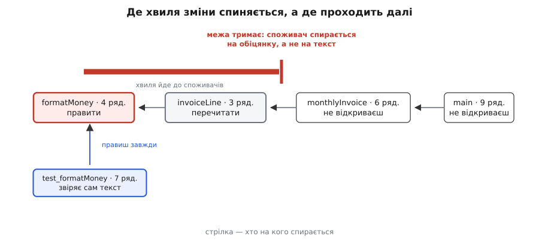
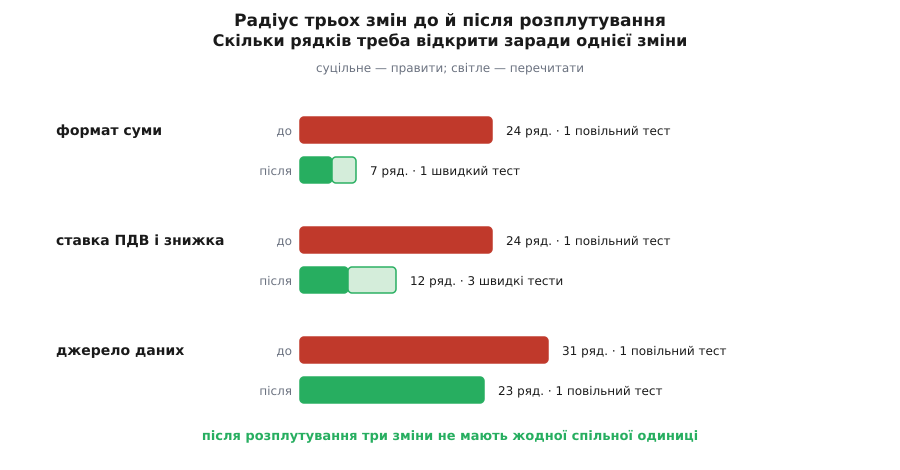

# ⚙️ Розплутати й порахувати: скільки рядків коштує одна зміна

Це проєкт на робочому коді: беремо сплетену функцію звіту, ріжемо її за три кроки — і після кожного кроку окремою програмою міряємо, скільки рядків доводиться відкрити заради однієї конкретної зміни. Числа виявляються впертішими за враження: один розріз збиває свій радіус утричі одразу, другий майже нічого не дає, поки не дорізано ланцюг споживачів, а на третьому число не рухається взагалі — і саме на ньому видно, чого рядки не міряють.

## Спершу — чим міряти

Спокуса взяти мірку, що лежить під рукою: скільки файлів зачепив коміт. Вона бреше саме там, де питання найгостріше. Поки правило, формат і доступ до бази живуть в одному тілі, будь-яка зміна чіпає рівно один файл — найкращий можливий показник за найгіршого розкладу. Рахувати треба не те, що ти надрукував, а те, що довелося відкрити й тримати в голові, поки друкував.

Звідси три валюти, які не зводяться в одну суму.

**Правити.** Одиниці, які відкриваєш і в яких міняєш рядки. Одиниця тут — не файл, а найменший іменований шматок із власною обіцянкою: функція, метод, клас. Ціна одиниці — усі її рядки, а не лише змінені: щоб безпечно виправити два рядки в двадцятичотирирядковій функції, треба прочитати всі двадцять чотири й переконатися, що решта не спиралася на те, що ти зрушив.

**Перечитати.** Одиниці, які самі не міняються, але спираються на змінене й тому можуть тихо поїхати. Їх не пишеш — переглядаєш очима, поки не переконаєшся, що вони й далі праві.

**Перевірити.** Тести, які доведеться перезапустити, і — головне — які саме: чисті, що біжать мілісекунди, чи ті, що піднімають базу й ловлять вивід.

Перші дві валюти — час твоєї голови, третя — довжина зворотного зв'язку. Розділення відповідальностей платить у всіх трьох, але в різних місцях і різними темпами, тож змішувати їх в одне число означає втратити саме те, що хотілося побачити.

Дві останні валюти рахуються механічно, якщо описати код графом: вузол — одиниця, ребро «А спирається на Б» — А викликає Б, читає її дані чи імпортує її. Хвиля зміни йде ребрами **проти** стрілок: змінилося Б — під питанням усі, хто на Б спирався. Множина, до якої хвиля дістає, — це [обхід графа вшир](topic:sf-algorithms/breadth-first-search) від насінин по обернених ребрах.

Просте досяжне замикання дало б безглуздо велике число: у зв'язній програмі від низу дістаєш до самого верху, і кожна зміна «чіпає все». Хвиля має гаснути — і гасне вона там, де споживач спирається на **обіцянку**, а не на нинішню поведінку. Якщо `invoiceLine` обіцяє «рядок рахунку», а той, хто його друкує, не розбирає цей рядок на частини, зміна тексту всередині до нього не доходить. Це [приховування рішення за інтерфейсом](topic:sf-apps/information-hiding) у чистому вигляді, а в графі — позначка на вузлі: `hidden`.

У позначки є рівно один законний виняток — тест. Тест на те й тест, щоб дивитися на поведінку, а не на обіцянку: перевірка `formatMoney` звіряє сам текст і мусить поїхати разом із ним. Тому хвиля, згасаючи на межі, все одно позначає тести, що висять просто на ній.



*Змінили `formatMoney`. Хвиля позначає прямого споживача й спиняється на межі, чиєї обіцянки вона не порушує: `monthlyInvoice` і `main` не відкривають узагалі. Тест — виняток: він навмисне звіряє сам текст, тому бачить крізь будь-яку межу.*

> 🔧 **Навіщо це.** Позначка `hidden` — заява, а не факт, і саме тому мірка корисна. Щойно ти кажеш «тут межа тримає», ти береш на себе зобов'язання: жоден споживач не спирається на те, що ти збираєшся міняти. Числа перетворюють суперечку «мені здається, так чистіше» на перевірне твердження, а після кожного розрізу видно, чи він окупився взагалі. Нижче двічі трапиться крок, який виглядав як очевидне поліпшення, а мірка показала нуль.

## Підопічний

Звіт про місячний рахунок: дістати оплачені замовлення, порахувати суму зі знижкою й ПДВ, скласти рядок, надрукувати його й записати в журнал.

```ts
// billing.ts — доступ до бази, правило, формат, вивід і журнал в одному тілі
import { Db } from "./db";

export async function printMonthlyInvoice(db: Db, userId: number, month: string) {
  const rows = await db.query<{ amount: number; kind: string }>(
    "select amount, kind from orders where user_id = ? and month = ? and status = 'paid'",
    [userId, month],
  );
  if (rows.length === 0) {
    console.log("Замовлень за місяць немає");
    return;
  }
  let net = 0;
  for (const r of rows) {
    if (r.kind === "refund") net -= r.amount;
    else net += r.amount;
  }
  if (net < 0) net = 0;
  if (net > 5000) net = Math.round(net * 0.95 * 100) / 100;  // знижка постійним
  const total = Math.round(net * 1.2 * 100) / 100;           // ПДВ 20 %
  const line = `Разом до сплати: ${total.toFixed(2)} грн`;
  console.log(line);
  await db.exec(
    "insert into invoice_log (user_id, month, total) values (?, ?, ?)",
    [userId, month, total],
  );
}
```

Двадцять чотири рядки без порожніх і коментарів. Викликає її семирядковий `main`: відкрити базу, передати виклик, закрити. Перевіряє все це єдиний тест — і йому потрібен справжній Postgres, бо інакше до правила не дістатися:

```ts
// billing.test.ts — єдиний спосіб перевірити правило, поки все сплетено
test("рахунок за місяць", async () => {
  const db = await openTestDb();                 // контейнер із Postgres
  await db.exec("delete from orders where user_id = 7");
  await db.exec("delete from invoice_log where user_id = 7");
  await db.exec("insert into orders values (7, '2026-06', 5000, 'sale', 'paid')");
  await db.exec("insert into orders values (7, '2026-06', 900, 'sale', 'paid')");
  const out = await captureStdout(() => printMonthlyInvoice(db, 7, "2026-06"));
  expect(out.trim()).toBe("Разом до сплати: 6726.00 грн");
  const log = await db.query("select total from invoice_log where user_id = 7");
  expect(log[0].total).toBeCloseTo(6726.0);
  await db.close();
});
```

**Умова прикладу: два оплачені замовлення того самого користувача — 5000 і 900 грн; знижка 5 % від 5000 грн обороту; ПДВ 20 %.**

```
чиста сума = 5000 + 900   = 5900.00
знижка     = 5900 · 0.95  = 5605.00      5900 > 5000, знижка діє
до сплати  = 5605 · 1.20  = 6726.00
рядок      = "Разом до сплати: 6726.00 грн"
```

Шість тисяч сімсот двадцять шість — число, за яким далі буде видно кожну зміну.

## Три замовлення на зміну

Мірка без конкретних змін безглузда: радіус вимірюють не «взагалі», а для того, що справді просять зробити. Беремо три замовлення, які в житті приходять від трьох різних людей.

- **Формат суми.** Замість `6726.00 грн` писати `6 726,00 ₴` — нерозривний пробіл на тисячі, кома як роздільник, символ гривні.
- **Ставка ПДВ і знижка.** ПДВ 20 % → 21 %, поріг знижки 5000 → 4000 грн, сама знижка 5 % → 7 %.
- **Джерело даних.** Замовлення приходять уже не з бази, а з HTTP-служби замовлень.

У сплетеному коді всі три падають в одну функцію. Формат — це рядки з `line` і `console.log`, ставка — два рядки з множниками, джерело — виклики `db.query` і `db.exec`. Заради двох рядків формату доводиться відкрити двадцять чотири й тримати в голові і правило, і схему таблиці.

## Інструмент

Модель коду — простий текстовий файл: оголошення одиниць із розміром і позначками, ребра залежності, замовлення на зміну з переліком одиниць, які доведеться правити.

```
# крок 0 — сплетено
unit main            7
unit printInvoice   24  hidden
unit dbClient       44  hidden
unit test_invoice   12  slow

dep main printInvoice
dep main dbClient
dep printInvoice dbClient
dep test_invoice printInvoice

change формат   printInvoice
change ставка   printInvoice
change джерело  printInvoice main
```

Розміри — це `wc -l` кожної одиниці без порожніх рядків і коментарів; для сторонніх (`dbClient`) береться оцінка, бо всередину них ти не заглядаєш. `printInvoice` позначено `hidden` навмисно: `main` лише передає їй виклик і не спирається на її нутрощі, тож розклад не підіграє «після» — та сама поблажка дана й сплетеній версії.

Далі — сама програма. Робота тут графова й одноразова на кожен запит, тож C++ бере її природно: обхід по векторах суміжності без жодних алокацій у гарячому циклі, і той самий код витримає граф із десятків тисяч вузлів, куди руками вже не заглянеш.

```cpp
// ripple.cpp — радіус вибуху зміни за графом одиниць коду.
// Збірка: g++ -std=c++17 -O2 -o ripple ripple.cpp
// Запуск: ./ripple model.units

#include <algorithm>
#include <cstdio>
#include <cstdlib>
#include <fstream>
#include <iterator>
#include <map>
#include <queue>
#include <sstream>
#include <string>
#include <vector>

struct Unit {
    std::string name;
    int  lines  = 0;
    bool hidden = false;   // споживачі спираються на обіцянку, а не на нутрощі
    bool test   = false;   // тест звіряє поведінку, тому бачить крізь межу
    bool slow   = false;   // потребує бази чи мережі
};

struct Change {
    std::string name;
    std::vector<int> seeds;            // одиниці, які відкриваєш і правиш
};

struct Model {
    std::vector<Unit> unit;
    std::vector<std::vector<int>> users;   // users[v] — хто спирається на v
    std::map<std::string, int> byName;
    std::vector<Change> change;

    int id(const std::string& name) {
        auto [it, fresh] = byName.emplace(name, static_cast<int>(unit.size()));
        if (fresh) {
            unit.push_back(Unit{name});
            users.emplace_back();
        }
        return it->second;
    }
};

static Model load(const char* path) {
    std::ifstream in(path);
    if (!in) { std::fprintf(stderr, "не відкрити %s\n", path); std::exit(1); }

    Model m;
    for (std::string raw; std::getline(in, raw); ) {
        if (auto hash = raw.find('#'); hash != std::string::npos) raw.erase(hash);
        std::istringstream ls(raw);
        std::string kind;
        if (!(ls >> kind)) continue;

        if (kind == "unit") {
            std::string name;
            int lines = 0;
            ls >> name >> lines;
            Unit& u = m.unit[m.id(name)];
            u.lines = lines;
            for (std::string flag; ls >> flag; ) {
                if      (flag == "hidden") u.hidden = true;
                else if (flag == "test")   u.test   = true;
                else if (flag == "slow")   u.test = u.slow = true;
            }
        } else if (kind == "dep") {
            std::string from, to;
            ls >> from >> to;
            const int t = m.id(to), f = m.id(from);   // id() може посунути вектор,
            m.users[t].push_back(f);                  // тож спершу індекси, потім доступ
        } else if (kind == "change") {
            Change c;
            ls >> c.name;
            for (std::string s; ls >> s; ) c.seeds.push_back(m.id(s));
            m.change.push_back(std::move(c));
        }
    }
    return m;
}

struct Blast {
    std::vector<int> edit, reread, fast, slow;
};

static Blast blastOf(const Model& m, const Change& c) {
    std::vector<char> seen(m.unit.size(), 0);
    std::queue<int> q;
    Blast b;

    for (int s : c.seeds)
        if (!seen[s]) { seen[s] = 1; b.edit.push_back(s); q.push(s); }

    while (!q.empty()) {
        const int v = q.front();
        q.pop();
        const bool holds = m.unit[v].hidden;            // межа тримає обіцянку
        for (int w : m.users[v]) {
            if (seen[w]) continue;
            if (holds && !m.unit[w].test) continue;     // споживач бачить лише обіцянку
            seen[w] = 1;
            if (m.unit[w].test) (m.unit[w].slow ? b.slow : b.fast).push_back(w);
            else                b.reread.push_back(w);
            q.push(w);
        }
    }
    return b;
}

static int linesOf(const Model& m, const std::vector<int>& v) {
    int s = 0;
    for (int i : v) s += m.unit[i].lines;
    return s;
}

// Вартість поширення: частка пар (А, Б), де А хоч якимось шляхом дістає до Б.
// Рахуємо лише на коді — тести до розкладу системи не належать.
static void propagationCost(const Model& m) {
    const int n = static_cast<int>(m.unit.size());
    std::vector<std::vector<int>> deps(n);
    int code = 0;
    for (int v = 0; v < n; ++v) {
        if (m.unit[v].test) continue;
        ++code;
        for (int u : m.users[v])
            if (!m.unit[u].test) deps[u].push_back(v);
    }

    long long reach = 0;
    for (int s = 0; s < n; ++s) {
        if (m.unit[s].test) continue;
        std::vector<char> seen(n, 0);
        std::queue<int> q;
        seen[s] = 1;
        q.push(s);
        while (!q.empty()) {
            const int v = q.front();
            q.pop();
            ++reach;
            for (int w : deps[v]) if (!seen[w]) { seen[w] = 1; q.push(w); }
        }
    }

    const double sq = 1.0 * code * code;
    std::printf("вартість поширення: %.1f %% (без діагоналі %.1f %%)\n",
                100.0 * reach / sq,
                code > 1 ? 100.0 * (reach - code) / (sq - code) : 0.0);
}

int main(int argc, char** argv) {
    if (argc < 2) { std::fprintf(stderr, "вжиток: ripple <модель.units>\n"); return 1; }
    const Model m = load(argv[1]);

    int codeUnits = 0, codeLines = 0, testUnits = 0, testLines = 0;
    for (const Unit& u : m.unit) {
        if (u.test) { ++testUnits; testLines += u.lines; }
        else        { ++codeUnits; codeLines += u.lines; }
    }
    std::printf("модель: код %d од. / %d ряд.; тести %d од. / %d ряд.\n",
                codeUnits, codeLines, testUnits, testLines);
    propagationCost(m);

    for (const Change& c : m.change) {
        const Blast b = blastOf(m, c);
        const int edit = linesOf(m, b.edit), reread = linesOf(m, b.reread);
        std::printf("\n%s: правити %zu од. / %d ряд.; перечитати %zu од. / %d ряд.\n",
                    c.name.c_str(), b.edit.size(), edit, b.reread.size(), reread);
        std::printf("  у голові разом: %d ряд.; тести: швидких %zu, повільних %zu\n",
                    edit + reread, b.fast.size(), b.slow.size());
    }

    for (size_t i = 0; i < m.change.size(); ++i)
        for (size_t j = i + 1; j < m.change.size(); ++j) {
            std::vector<int> a = m.change[i].seeds, b = m.change[j].seeds, both;
            std::sort(a.begin(), a.end());
            std::sort(b.begin(), b.end());
            std::set_intersection(a.begin(), a.end(), b.begin(), b.end(),
                                  std::back_inserter(both));
            if (!both.empty())
                std::printf("\nспільні одиниці «%s» і «%s»: %zu — паралельно не зробити\n",
                            m.change[i].name.c_str(), m.change[j].name.c_str(), both.size());
        }
    return 0;
}
```

Модель тут написана руками, бо в ній тринадцять рядків. Для справжнього дерева її будує [статичний аналіз](topic:sf-release/static-analysis): для C і C++ список залежностей дає сам компілятор (`g++ -MM`), для TypeScript чи Go — обхід імпортів, для точності на рівні функцій — розбір дерева розбору. Формат навмисне тупий саме тому, що його має вміти виплюнути будь-який скрипт.

## Крок 0: заміри сплетеного

```
$ ./ripple step0.units
модель: код 3 од. / 75 ряд.; тести 1 од. / 12 ряд.
вартість поширення: 66.7 % (без діагоналі 50.0 %)

формат: правити 1 од. / 24 ряд.; перечитати 0 од. / 0 ряд.
  у голові разом: 24 ряд.; тести: швидких 0, повільних 1
ставка: правити 1 од. / 24 ряд.; перечитати 0 од. / 0 ряд.
  у голові разом: 24 ряд.; тести: швидких 0, повільних 1
джерело: правити 2 од. / 31 ряд.; перечитати 0 од. / 0 ряд.
  у голові разом: 31 ряд.; тести: швидких 0, повільних 1

спільні одиниці «формат» і «ставка»: 1 — паралельно не зробити
спільні одиниці «формат» і «джерело»: 1 — паралельно не зробити
спільні одиниці «ставка» і «джерело»: 1 — паралельно не зробити
```

Найважливіше в цьому виводі — не самі числа, а те, що вони **однакові**. Сплетений код не розрізняє змін: чи ти правиш кому в сумі, чи ставку податку, чи джерело даних — ціна та сама, бо одиниця, яку доводиться відкрити, та сама. Три різні наміри, три різні голови, той самий шматок екрана. І три останні рядки виводу кажуть просто: паралельно ці три завдання не зробити, будь-які двоє з трьох зіткнуться в одному тілі.

## Крок 1: витягти правило

Перший розріз очевидний: правило рахування нічого не потребує від світу, отже, може стати [чистою функцією без побічних дій](topic:sf-apps/pure-functions-side-effects).

```ts
// rules.ts — самі правила, жодного доступу назовні
export type Order = { amount: number; kind: "sale" | "refund" };

const round2 = (v: number) => Math.round(v * 100) / 100;

export function netAmount(orders: Order[]): number {
  let net = 0;
  for (const o of orders) net += o.kind === "refund" ? -o.amount : o.amount;
  return Math.max(0, round2(net));
}

export function discounted(net: number): number {
  return net > 5000 ? round2(net * 0.95) : net;
}

export function totalDue(orders: Order[]): number {
  return round2(discounted(netAmount(orders)) * 1.2);   // ПДВ 20 %
}
```

У сплетеній функції лишилося шістнадцять рядків: підпис, чотири на запит, чотири на порожній випадок, виклик правила, рядок формату з виводом, чотири на журнал і закривна дужка. Зате ставку тепер можна перевірити за мілісекунди — без бази, без перехоплення виводу:

```ts
test("ставка й знижка", () => {
  const orders: Order[] = [
    { amount: 5000, kind: "sale" },
    { amount: 900, kind: "sale" },
  ];
  expect(totalDue(orders)).toBeCloseTo(6726.0);
  expect(totalDue([{ amount: 100, kind: "sale" }])).toBeCloseTo(120.0);
});
```

Заміри (вивід стисло):

```
формат: правити 1 од. / 16 ряд.; у голові 16; тести: швидких 0, повільних 1
ставка: правити 2 од. /  6 ряд.; перечитати 1 од. / 16 ряд.
        у голові 22; тести: швидких 1, повільних 1
джерело: правити 2 од. / 23 ряд.; у голові 23; тести: швидких 0, повільних 1
вартість поширення без діагоналі: 38.1 %
```

Ось перша несподіванка. Ставка — саме те, заради чого правило виносили, — майже не подешевшала: 24 рядки перетворилися на 22. Правити стало треба всього шість рядків замість двадцяти чотирьох, але хвиля з `totalDue` доходить до `printInvoice`, бо той друкує суму, а більше її ніхто не ховає, — і всі шістнадцять рядків, які лишилися сплетеними, доводиться перечитувати. Виніс правило — а споживач правила лишився там само.

Другий бік того самого: формат і джерело досі стикаються на `printInvoice`, тож паралельно їх не зробити — з трьох пар змін одна лишилася зчепленою.

## Крок 2: витягти формат

Формат — це два рядки, які треба відокремити не заради розміру, а заради того, щоб вони мали власне ім'я й власний тест.

```ts
// money.ts — лише подання грошей рядком
export function formatMoney(v: number): string {
  const rounded = Math.round(v * 100) / 100;
  return `${rounded.toFixed(2)} грн`;
}

// invoice.ts — що саме пишемо користувачеві
export function invoiceLine(total: number): string {
  return `Разом до сплати: ${formatMoney(total)}`;
}
```

Сама сплетена функція від цього не покоротшала — рядок `const line = …; console.log(line)` просто став `console.log(invoiceLine(total))`, ті самі шістнадцять рядків. Переїхав не обсяг, а клопіт. `invoiceLine` дістає в моделі позначку `hidden`, і це не подарунок собі: той, хто його друкує, справді не розбирає рядок на частини. Заміри (вивід стисло):

```
формат: правити 1 од. / 4 ряд.; перечитати 1 од. / 3 ряд.
        у голові 7; тести: швидких 1, повільних 0
ставка: у голові 22; тести: швидких 1, повільних 1
джерело: у голові 23; тести: швидких 0, повільних 1
вартість поширення без діагоналі: 29.2 %
```

Зміна формату впала з двадцяти чотирьох рядків до семи, і — важливіше за рядки — повільний тест із базою вийшов із її кола: тепер кому й символ гривні перевіряє чиста функція за мілісекунди.

```ts
// формат після зміни: 6726 → "6 726,00 ₴"
export function formatMoney(v: number): string {
  const [whole, cents] = (Math.round(v * 100) / 100).toFixed(2).split(".");
  const grouped = whole.replace(/\B(?=(\d{3})+(?!\d))/g, " ");
  return `${grouped},${cents} ₴`;
}
```

## Крок 3: відрізати джерело

Лишилося найцікавіше — і найменш вдячне за мірилом рядків. Сценарій звіту досі сам ходить у базу. Розрізаємо це [інверсією залежності](topic:sf-apps/dependency-inversion): сценарій оголошує, чого хоче від світу, а хто це дасть — вирішують зовні.

```ts
// ports.ts — що звіт вимагає від світу, без згадки про базу
export interface OrdersSource {
  ordersOf(userId: number, month: string): Promise<Order[]>;
}

// sqlOrders.ts — один із можливих постачальників замовлень
export class SqlOrders implements OrdersSource {
  constructor(private db: Db) {}

  async ordersOf(userId: number, month: string): Promise<Order[]> {
    const rows = await this.db.query<{ amount: number; kind: string }>(
      "select amount, kind from orders where user_id = ? and month = ? and status = 'paid'",
      [userId, month],
    );
    return rows.map((r) => ({
      amount: r.amount,
      kind: r.kind === "refund" ? "refund" : "sale",
    }));
  }
}

// report.ts — сценарій: узяти замовлення, порахувати, скласти рядок
export async function monthlyInvoice(src: OrdersSource, userId: number, month: string) {
  const orders = await src.ordersOf(userId, month);
  if (orders.length === 0) return { total: 0, line: "Замовлень за місяць немає" };
  const total = totalDue(orders);
  return { total, line: invoiceLine(total) };
}

// main.ts — композиційний корінь: тут і тільки тут вибирають реалізації
async function main() {
  const db = await openDb(process.env.DB_URL!);
  const src = new SqlOrders(db);
  const [userId, month] = [Number(process.argv[2]), process.argv[3]];
  const { total, line } = await monthlyInvoice(src, userId, month);
  console.log(line);
  await logInvoice(db, userId, month, total);
  await db.close();
}
main();
```

Це знайомий розклад [портів і адаптерів](topic:sf-apps/hexagonal-architecture), але тут він цікавий не назвою, а тим, що з ним робить мірка. Модель тепер така:

```
# крок 3 — розділено
unit formatMoney       4
unit invoiceLine       3  hidden      # обіцяє «рядок рахунку», не його текст
unit round2            1
unit netAmount         5
unit discounted        3
unit totalDue          3
unit OrdersSource      3  hidden      # порт: контракт, а не реалізація
unit SqlOrders        13  hidden      # адаптер за портом
unit monthlyInvoice    6  hidden      # сценарій віддає рядок і суму
unit logInvoice        6  hidden
unit main             10
unit dbClient         44  hidden

unit test_formatMoney     7  test
unit test_discounted      6  test
unit test_totalDue        8  test
unit test_monthlyInvoice 11  test
unit test_e2e            12  slow

dep invoiceLine formatMoney
dep netAmount round2
dep discounted round2
dep totalDue round2
dep totalDue discounted
dep totalDue netAmount
dep monthlyInvoice OrdersSource
dep monthlyInvoice totalDue
dep monthlyInvoice invoiceLine
dep SqlOrders OrdersSource
dep SqlOrders dbClient
dep logInvoice dbClient
dep main monthlyInvoice
dep main SqlOrders
dep main logInvoice
dep main dbClient
dep test_formatMoney formatMoney
dep test_discounted discounted
dep test_totalDue totalDue
dep test_monthlyInvoice monthlyInvoice
dep test_e2e main

change формат   formatMoney
change ставка   discounted totalDue
change джерело  SqlOrders main
```

`totalDue` навмисне лишилося без `hidden`, хоч і виглядає такою самою межею, як `invoiceLine`. Різниця в тому, що звідти витікає: рядок рахунку споживач далі не розбирає, а суму — бере й кладе у власний результат, тож зміна ставки крізь нього проходить. Межа ховає не «те, що всередині», а лише те, на що ніхто нагорі не спирається.

```
$ ./ripple step3.units
модель: код 12 од. / 101 ряд.; тести 5 од. / 44 ряд.
вартість поширення: 27.1 % (без діагоналі 20.5 %)

формат: правити 1 од. / 4 ряд.; перечитати 1 од. / 3 ряд.
  у голові разом: 7 ряд.; тести: швидких 1, повільних 0
ставка: правити 2 од. / 6 ряд.; перечитати 1 од. / 6 ряд.
  у голові разом: 12 ряд.; тести: швидких 3, повільних 0
джерело: правити 2 од. / 23 ряд.; перечитати 0 од. / 0 ряд.
  у голові разом: 23 ряд.; тести: швидких 0, повільних 1
```

Ставка нарешті зрушила: 22 → 12, і повільний тест зник із її кола — сценарій тепер перевіряється підставним `OrdersSource` за мілісекунди, база потрібна лише наскрізному тесту. Хвиля від `totalDue` доходить до сценарію (сума справді змінилася, і його тест теж треба поправити) і гасне там: `main` уже не відкривають.

А от джерело даних у рядках не подешевшало взагалі: 31 → 23 → 23 → 23. І це найповчальніший рядок таблиці. Мірка каже правду: обсяг роботи справді не змінився — новий адаптер треба написати, і він приблизно такий самий завдовжки, як старий. Змінилося те, чого ця мірка не показує: серед цих двадцяти трьох рядків **немає жодного рядка правила чи формату**. На кроці 0 усі вони були перед очима, бо жили в тому самому тілі; тепер новий адаптер пишуть проти трирядкового інтерфейсу, а `monthlyInvoice`, `totalDue`, `invoiceLine` навіть не відкривають. Радіус не став меншим — він став **чужим для сусідів**.

Заразом мірка показує те, чого ми не дорізали. Додай четверте замовлення — «змінити формулювання „Замовлень за місяць немає“» — і інструмент відповість: шість рядків, `monthlyInvoice`. Формулювання для користувача досі живе в сценарії, а не поряд із `invoiceLine`, де на нього пішло б три. Витік малий, оком його не видно серед чистого на вигляд коду, а число називає його одразу — і разом із ним називає ціну: подвійне місце, куди дивитися, коли редактор попросить змінити слово.



*Довжина смуги — скільки рядків доводиться відкрити заради однієї зміни. Формат і ставка стискаються втричі й удвічі й переходять на швидкі тести; джерело не стискається зовсім — але після розрізу в його радіус не потрапляє жоден рядок правила чи формату.*

## Уся картина в числах

| що міряли | крок 0 | крок 1: правило | крок 2: формат | крок 3: джерело |
|---|---|---|---|---|
| формат, рядків у голові | 24 | 16 | 7 | 7 |
| ставка, рядків у голові | 24 | 22 | 22 | 12 |
| джерело, рядків у голові | 31 | 23 | 23 | 23 |
| повільних тестів: формат · ставка · джерело | 1 · 1 · 1 | 1 · 1 · 1 | 0 · 1 · 1 | 0 · 0 · 1 |
| пар змін зі спільною одиницею | 3 з 3 | 1 з 3 | 0 з 3 | 0 з 3 |
| вартість поширення | 50.0 % | 38.1 % | 29.2 % | 20.5 % |
| рядків коду всього | 75 | 79 | 86 | 101 |

Останній рядок — чесна ціна. Коду стало на третину більше: інтерфейс, адаптер, композиційний корінь, окремі файли — це все треба написати й тримати. Розділення купують за цю сполучну тканину, і купують лише там, де зміни справді приходять окремо; там, де не приходять, ти заплатив і не отримав нічого.

Рядок «вартість поширення» — не власна вигадка, а стандартне мірило [зчеплення](topic:sf-apps/coupling-cohesion) з дослідницької практики. Алан Маккормак, Джон Руснак і Карлісс Болдвін у праці 2006 року в *Management Science* описали розклад системи [матрицею залежностей](topic:sf-apps/design-structure-matrix), узяли її транзитивне замикання й назвали щільність цієї матриці вартістю поширення — часткою пар файлів, де зміна одного має шанс дійти до іншого. Порівнюючи Linux і Mozilla, вони показали, що навмисна перебудова Mozilla заради модульності справді дала розклад, модульніший і за попередню версію, і за Linux; системи в їхній вибірці різнилися за цим показником у п'ять разів. Числа рахують так:

```
вартість поширення = Σ V[i][j] / n²          V[i][j] = 1, якщо i дістає до j
без діагоналі      = (Σ V[i][j] − n) / (n² − n)

крок 0:  6 / 3²   = 66.7 %      (6 − 3)  / (9 − 3)     = 50.0 %
крок 3: 39 / 12²  = 27.1 %      (39 − 12) / (144 − 12) = 20.5 %
```

Діагональ (кожна одиниця дістає сама до себе) на малих графах з'їдає весь показник: при n = 3 вона сама дає 33 %. Тому в таблиці стоїть варіант без діагоналі, і навіть його на дванадцяти вузлах треба читати як напрямок, а не як оцінку — це мірило створене для тисяч файлів. Для порівняння масштабу: незалежний аналіз кодової бази Firefox дає середню вартість поширення близько 17 % на двадцяти трьох випусках, тобто зміна випадкового файлу потенційно дістає приблизно до кожного шостого.

## Складність

Обхід на одне замовлення — `O(V + E)` за часом і `O(V)` за пам'яттю: кожен вузол потрапляє в чергу щонайбільше раз. Це дешево навіть на десятках тисяч одиниць, тож радіус можна рахувати на кожен коміт.

Вартість поширення в цьому коді рахується наївно — обхід із кожного вузла, `O(V · (V + E))`. На тисячі вузлів це мить, на сотні тисяч — уже хвилини. Класична заміна: тримати рядок досяжності бітовою маскою й збирати його знизу вгору — `reach[v] = {v} ∪ ⋃ reach[w]` по всіх `w`, на які `v` спирається, — обходячи вузли у зворотному [топологічному порядку](topic:sf-algorithms/topological-sort), тобто починаючи з тих, хто вже ні на кого не спирається. Тоді робота падає до `O(V · E / 64)`, бо об'єднання множин стає одним `|=` на кожні 64 вузли.

Топологічний порядок існує лише без циклів, а в реальному коді цикли є. Усередині циклу кожен дістає до кожного, отже радіус будь-якого його учасника — увесь цикл цілком. Тому граф спершу згортають за [сильно зв'язними компонентами](topic:sf-algorithms/strongly-connected-components): компонента стає одним вузлом, і далі все працює як на дереві. Заразом це діагноз: велика сильно зв'язна компонента — це те місце, де жодна межа не тримає, і мірка покаже там однакове число для будь-якої зміни, як на кроці 0.

## Підводні камені

**Ребра, яких не бачить парсер.** Граф містить лише те, що видно в тексті: виклики та імпорти. Спільна схема таблиці, спільний формат JSON на дроті, глобальна змінна, порядок викликів («спершу `init()`»), впорскування залежностей за рядковим ключем, віддзеркалення — усе це справжні залежності без жодного ребра. Тому виміряний радіус — нижня межа, а не істина. Дешева контрольна перевірка приходить з іншого боку: історія комітів. Гаральд Ґалль, Карін Гаєк і Мехді Джазаєрі в праці 1998 року (ICSM, Віденський технічний університет) запропонували шукати **логічне зчеплення** — модулі, що систематично змінюються разом, хоч у коді не посилаються одне на одного. Якщо два файли в історії їздять парою, а в графі між ними порожньо — там невидиме ребро.

**`hidden` без контракту — самообман.** Позначка каже: жоден споживач не спирається на те, що я міняю. Обґрунтувати її може лише написана обіцянка й тест на неї. Якщо тест поверхом вище звіряє точний текст, який ти вважав внутрішньою справою, межі там уже немає. Це [закон Гайрама](topic:sf-release/hyrums-law) у мініатюрі: за достатньої кількості споживачів кожна помітна властивість стає чиїмось контрактом — і саме про це попереджає рядок «перечитати», коли не хоче падати до нуля.

**Мірку легко надурити.** Поріж систему на двісті однорядкових функцій — радіус кожної зміни впаде, вартість поширення впаде, а працювати стане гірше: щоб знайти потрібний рядок, доведеться пройти десять переходів. Джон Остергаут у «A Philosophy of Software Design» (2018) назвав множення змін по багатьох місцях **посиленням зміни** й поставив поруч дві інші прикмети складності — пізнавальне навантаження й невідомі невідомі; дрібнесеньке дроблення збиває першу, а другу піднімає. Тому число має сенс лише як порівняння **тієї самої системи до й після**, а не двох різних систем між собою, і читати його треба разом із кількістю одиниць.

**Одиниця обліку вирішує все.** «Файлів у коміті» на кроці 0 давало одиницю — найкращий бал за найгіршого розкладу. Радіус у рядках, які треба прочитати, показав двадцять чотири. Будь-яку мірку варто спершу пропустити через сплетений код: якщо на ньому вона виглядає добре, вона міряє не те.

**Тести теж в одиницях.** Повільний тест у радіусі — податок на кожну зміну, яка туди попадає, і платиться він щоразу. У цьому проєкті найбільший виграш дав не рядок «правити», а перехід повільних перевірок у швидкі: формат і ставка вийшли з кола, де треба піднімати базу. Це видно тільки тому, що тести описані в тій самій моделі, що й код.

**Модель груба навмисне.** Рахувати поширення змін уміли й точніше, і давно: Стівен Яу, Джеймс Коллофелло й Т. Макґреґор описали аналіз ефекту брижів (*ripple effect*) на COMPSAC 1978, а через два роки Яу й Коллофелло вивели з нього мірила стійкості коду до змін (IEEE TSE, 1980). Вони йшли не від викликів, а від означень змінних: кожне змінене означення — джерело, від якого неузгодженість тече далі по програмі, поки не вичерпається. Це точніше за граф одиниць — і дорожче: потрібен повний аналіз потоків даних, а не список імпортів. Практика зупинилася приблизно там, де ця вставка: грубий граф, названі вголос припущення й порівняння однієї системи із собою вчорашньою. Груба мірка, яку рахують щодня, змінює рішення частіше за точну, яку не рахують ніколи.
