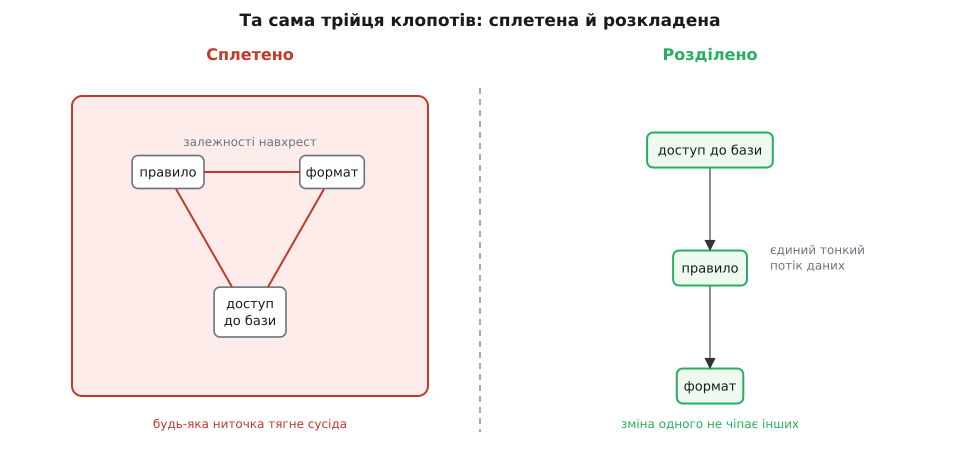
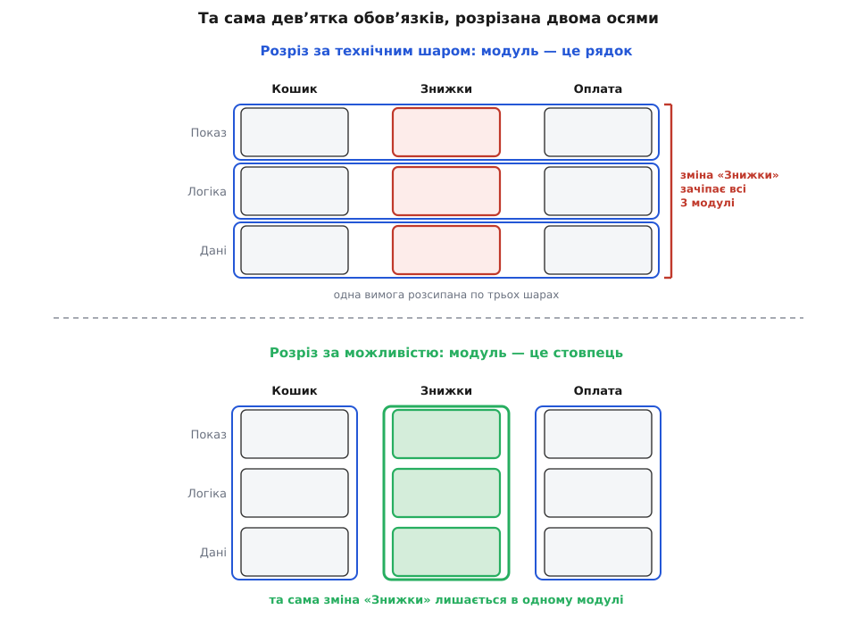

# Розділення відповідальностей

<preknowlist>
- [Інкапсуляція](topic:sf-apps/encapsulation) — приховування внутрішніх деталей за інтерфейсом; саме воно тримає відділений аспект відділеним, коли межу вже проведено.
- [Інтерфейс проти реалізації](topic:sf-apps/interface-vs-implementation) — різниця між тим, що частина обіцяє зовні, і тим, як вона це робить усередині.
</preknowlist>

Візьми будь-яку функцію, що вже трохи пожила. Вона витягує дані з бази, рахує за ними якесь ділове правило, складає з результату текст і виводить його на екран — усе в одному тілі, на спільних змінних. Приходить дрібна вимога: змінити формат виводу. Ти правиш рядок із форматуванням — і раптом ламається розрахунок, бо він спирався на ту саму проміжну змінну, яку ти щойно переназвав. Крихітна зміна вдарила там, де її ніхто не чекав.

Річ не в неуважності. Питання глибше: чому зміна формату взагалі здатна зачепити розрахунок? Тому що в цьому коді формат і правило — не сусіди, а одне сплетене ціле. Вони діляться змінними, порядком рядків, мовчазними припущеннями одне про одного. Щоб торкнутися одного, доводиться тримати в голові й друге.

Ліки видно, щойно названо причину: тримати кожен окремий клопіт у своєму окремому місці. Тоді зміна формату відкриває лише код формату, а правило лежить поряд недоторканим. Це і є **розділення відповідальностей** (англ. *separation of concerns*, дослівно — розділення клопотів: *concern* — те, чим ти заклопотаний у цю мить: правило, формат, доступ до бази). Суть — розкласти систему так, щоб кожен її аспект жив осібно й ним можна було займатися, не завантажуючи в голову решту.

Чому це аж таке важливе, а не просто охайність? Причина — у межах людської голови: у ній одночасно вміщається лічена кількість рухомих деталей. Поки правило, формат і доступ до бази сплетені, ти не можеш думати про жодне з них окремо — мусиш тримати всі три разом, і кожна думка спотикається об дві сусідні. Едсґер Дейкстра, нідерландський інформатик, який і дав цьому назву 1974 року, бачив у розділенні клопотів не стиль, а єдиний доступний спосіб узагалі впорядкувати думки про складну річ: [зосередитися на одному аспекті за раз](topic:sf-apps/separation-of-concerns/hist-soc-origins.md), вивчати його як цілість, знаючи, що інші аспекти дочекаються свого дня. Тож розділення відповідальностей — це передумова **локального міркування**: зрозуміти й змінити частину, не заряджаючи в голову весь застосунок.

> 🔧 **Навіщо це.** Локальне міркування — те, за що платять щодня. Новачок, який тиждень як у команді, має полагодити ваду у форматуванні звіту; якщо формат відділено, він читає один невеликий файл і не ризикує зачепити нарахування, якого навіть не бачив. Рев'ю такої правки коротке — рецензент бачить, що зміна фізично не дотягнеться до чужого коду. Ось справжня винагорода за межу: не краса, а те, що зміну можна внести, не боячись, що вона розповзеться системою.

Щоб рознести клопоти, треба зробити дві речі водночас: зібрати все про один клопіт докупи, щоб він був цілим, і розрізати ниті між різними, щоб зміна одного не тягла за собою інший. Ці дві дії мають імена й міри — [зв'язність і зчеплення](topic:sf-apps/coupling-cohesion): висока зв'язність (усе в частині служить одній справі) і низьке зчеплення (частини мало знають одна про одну). Розділення відповідальностей — це мета; зв'язність і зчеплення — дві шкали, якими видно, наскільки її досягнуто.



*Зліва правило, формат і доступ сплетені в одній частині: кожна ниточка залежності означає, що зміна одного може смикнути інше. Справа той самий код розкладено на цілі, майже незалежні частини — зв'язок звівся до тонкого потоку даних.*

Найсильніше в цій ідеї те, що та сама дія повторюється на кожному масштабі. Розділити правило й формат у двох функціях — це той самий крок, що розкласти систему на [класи з однією причиною для зміни](topic:sf-apps/single-responsibility), згрупувати класи в [шари від показу до даних](topic:sf-apps/layered-architecture), обвести піддомен [межею з власною мовою](topic:sf-apps/bounded-context) чи винести шматок у [сервіс, що розгортається окремо](topic:sf-apps/microservices). Це не різні принципи, які треба вчити нарізно, — це одне розділення відповідальностей, застосоване на різній висоті. Хто зрозумів його на рівні двох функцій, той упізнає його й на рівні цілої архітектури.

Ось той самий приклад у коді. Сплетено:

```python
def report(user_id):
    rows = db.query("select amount from orders where user=?", user_id)
    total = sum(r.amount for r in rows) * 1.2          # правило: +20% ПДВ
    print(f"Разом до сплати: {total:.2f} грн")          # формат + вивід
```

Розділено — правило стає [чистою функцією без побічних дій](topic:sf-apps/functional-core-imperative-shell), а доступ до бази й вивід лишаються на краю:

```python
def total_due(orders):                 # лише правило
    return sum(o.amount for o in orders) * 1.2

def format_due(total):                 # лише формат
    return f"Разом до сплати: {total:.2f} грн"
```

Тепер зміна формату чіпає тільки `format_due`, а `total_due` можна перевірити наодинці, без бази й екрана. [Покроковий розбір такого розплутування, з виміром, скільки місць зачіпає зміна до й після](topic:sf-apps/separation-of-concerns/proj-untangle-ripple.md), показує це на робочому коді.

Складне ховається не в тому, що клопоти треба розділяти, а в тому, **де проходить межа клопоту**. Принцип сам не каже, які саме шматки — окремі клопоти. Класична помилка — різати за технічним шаром: усі контролери в одну купу, уся робота з базою в іншу. Виглядає впорядковано, та коли приходить одна ділова вимога — «додати знижку», — вона розмазується по всіх шарах одразу, і кожна зміна знову чіпає всю систему. Девід Парнас ще 1972 року дав критерій, який рятує: [різати треба вздовж ліній, де зміни ймовірні незалежно](topic:sf-apps/separation-of-concerns/hist-soc-origins.md), ховаючи кожне хистке рішення за інтерфейсом, — а не за формальними кроками обробки. Добра межа та, за якою ймовірна зміна лишається з одного боку.



*Один набір обов'язків (три можливості × три технічні шари), розрізаний двома способами. Розріз за шаром робить кожну можливість наскрізною: зміна «Знижки» зачіпає всі три модулі. Розріз за можливістю тримає ту саму зміну в одному модулі.*

Не кожен клопіт узагалі піддається чистому розрізу. Журналювання, безпека, транзакції потрібні майже в кожній частині — вони [проходять наскрізь через усі модулі](topic:sf-apps/cross-cutting-concerns) й опираються тому, щоб їх замкнути в одному місці; для них є свої прийоми. І сама межа не безкоштовна: кожна додає непрямоту, окремий контракт, який треба тримати, і робить систему трохи важчою для огляду загалом. Тому клопоти розділяють там, де вони справді змінюються незалежно, а не всюди, де можна провести лінію заради самої лінії. Розділення відповідальностей — це не «більше частин», а правильно вибрані межі, кожна з яких утримує майбутню зміну на одному боці.
