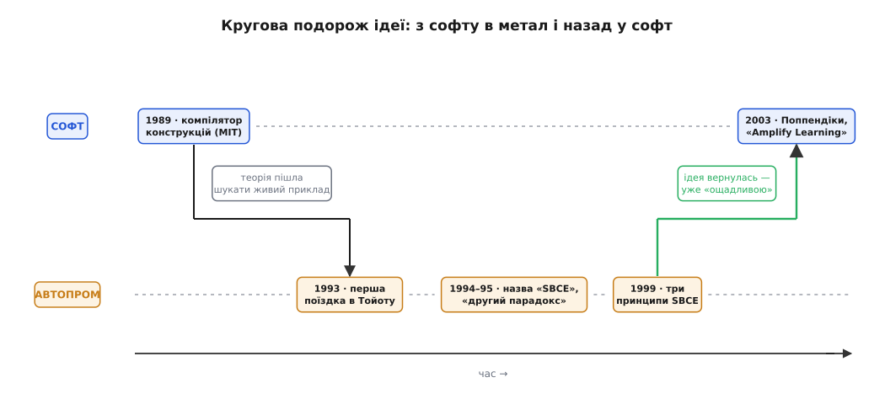

# 📜 Як народився другий парадокс Тойоти

Історію зазвичай переказують так: дослідники поїхали до Тойоти, побачили дивне й назвали це парадоксом. Насправді все сталося навпаки, і саме через це вона варта уваги. Чоловік, який привіз із Японії цю розгадку, знав відповідь ще до того, як уперше ступив на Тойотин поріг. Він не шукав, що там роблять. Він шукав підтвердження — бо кілька років перед тим уже змусив множинне проєктування працювати. У програмі.

## Компілятор, що мислив наборами

Академічний шлях Аллена Ворда (Allen C. Ward) починався якнайдалі від машинобудування — з диплома історика в Орегонському університеті. Далі десять років в армії США: школа рейнджерів у Форт-Беннінгу, служба в Кореї, звання капітана. Уже на Гаваях він здобув другий бакалаврат, цього разу з механічної інженерії, звільнився з війська і пішов до MIT.

Там він прибився до групи в лабораторії штучного інтелекту, яка робила інструменти для автоматизації конструкторської праці. У січні 1989 року Ворд захистив дисертацію «A Theory of Quantitative Inference for Artifact Sets, Applied to a Mechanical Design Compiler» — ступінь доктора наук (ScD) на кафедрі механічної інженерії; та сама робота вийшла технічним звітом лабораторії ШІ за номером 1089. Науковий співавтор цієї лінії робіт — Воррен Сірінг (Warren P. Seering); згодом вони разом друкували «Quantitative Inference in a Mechanical Design Compiler» (ASME *Journal of Mechanical Design*, березень 1993).

Назва в дисертації довга, а річ проста. Ворд написав **компілятор конструкцій**: на вході — схема механічної чи гідравлічної передачі, вимоги й функція вигоди; на виході — каталожні номери деталей, які цю схему втілюють найкраще. Не «порадник» і не «оптимізатор однієї деталі», а саме компілятор: інженер пише високорівневий опис, машина видає добірку.

І от ключове. Щоб таке працювало, всередині не можна перебирати варіанти по одному — комбінацій надто багато. Тому компілятор оперував **множинами** деталей і режимів роботи, а не однією деталлю в одному режимі, і звужував **об'єми** простору конструкцій замість того, щоб мандрувати ним від точки до точки. Формально це були правила поширення «мічених інтервалів» (labeled interval calculus) крізь рівняння схеми. Цю власну теорію Ворд і назвав *set-based design* — множинним проєктуванням. Назва народилася тут, за клавіатурою, а не в Японії.

> 🔧 **Навіщо це.** Тут ховається вся розгадка майбутнього парадокса, і вона обчислювальна, а не управлінська. Набір **не коштує** стільки, скільки коштували б його члени поодинці. Якщо тримати десять кандидатів означає десять разів зробити роботу — тоді набір і справді розкіш. Але якщо міркувати про **область**, одне обмеження викидає цілий шмат простору за один хід, і десять кандидатів обходяться дешевше за одного, знайденого перебором. Парадокс — це парадокс лише доти, доки ти певен, що множина з десяти дорожча за точку в десять разів.

Ось той самий фокус у мініатюрі: підібрати пару «мотор + редуктор», щоб момент на виході вклався в [120, 130] Н·м. Перебір міряє кожну пару. Звуження переносить вимогу **назад** крізь рівняння схеми й торкається лише тих редукторів, які взагалі можуть підійти:

```python
from bisect import bisect_left, bisect_right

MOTORS = [round(0.1 * i, 1) for i in range(1, 201)]   # каталог моторів: 0.1 … 20.0 Н·м
GEARS  = [5 * i for i in range(1, 61)]                # каталог редукторів: 5 … 300
LO, HI = 120.0, 130.0                                 # треба на виході, Н·м
# рівняння схеми:  T_вих = T_мотора · n

def enumerate_pairs():
    """Точка за точкою: помацати КОЖНУ пару."""
    hits, touched = [], 0
    for t in MOTORS:
        for n in GEARS:
            touched += 1
            if LO <= t * n <= HI:
                hits.append((t, n))
    return hits, touched

def narrow():
    """Наборами: вимогу переносимо назад крізь рівняння й ріжемо каталог."""
    hits, touched = [], 0
    g_lo, g_hi = GEARS[0], GEARS[-1]
    for t in MOTORS:
        touched += 1
        need_lo, need_hi = LO / t, HI / t      # яке n узагалі рятує цей мотор
        if need_hi < g_lo or need_lo > g_hi:
            continue                            # жоден редуктор — мінус УВЕСЬ ряд за один хід
        i = bisect_left(GEARS, need_lo)         # вікно придатних редукторів —
        j = bisect_right(GEARS, need_hi)        # двійковим пошуком, не переглядом
        for n in GEARS[i:j]:                    # торкаємось лише вікна
            touched += 1
            if LO <= t * n <= HI:
                hits.append((t, n))
    return hits, touched

e_hits, e_touched = enumerate_pairs()
n_hits, n_touched = narrow()

assert sorted(e_hits) == sorted(n_hits)   # ТІ САМІ відповіді — жодної не загублено
print(len(e_hits), e_touched, n_touched)  # 84 придатні пари; 12000 дотиків проти 284
```

Вісімдесят чотири придатні конструкції — і звуження знайшло всі до одної, зробивши в сорок два рази менше роботи, ніж перебір. Придивись, у чому саме тут виграш: перебір після дванадцяти тисяч дотиків віддає **набір**, а звуження віддає **той самий набір** — тільки за 284 дотики. Тримати всіх живими не було витратою. Витратою був перебір.

## Людина, яка шукала фірму

З цієї теорії Ворд зробив висновок, більший за неї саму: якщо машина розв'язує конструкторську задачу, звужуючи набори, то звичний спосіб вести розробку — обрати рано й довго крутити обране — хибний **у самій основі**, а не в деталях виконання. Він вважав, що знає і в чому хиба, і як її лікувати.

Муляло одне. За словами Джона Шука (John Shook) і Дерварда Собека (Durward K. Sobek II), які писали про Ворда згодом, він так і не знайшов жодної живої організації, що працювала б за його міркуванням. Він шукав фірму — бодай одну, — яка робить це правильно. Звичний порядок речей вивернувся навиворіт: не практика чекала на теорію, а теорія роками чекала, щоб десь у світі знайшовся хоч один її живий приклад.

Так Ворд опинився в Мічиганському університеті — уже асистент-професором механічної інженерії — і почав розпитувати, чи не практикує хтось із людей те, що вміла його програма. Цей інтерес і привів його до Тойоти.

## Енн-Арбор, Японія і татамі

Обставини склалися вдало. Професор Джон Кемпбелл (John Campbell) дістав від Управління наукових досліджень Повітряних сил США (AFOSR) гроші на університетську програму з управління японськими технологіями, і навколо неї зібралася дослідницька команда. Джон Шук на той час був генеральним менеджером з планування й адміністрування в Toyota Technical Center у США — тобто дверима всередину. У групі був Джеффрі Лайкер (Jeffrey K. Liker), професор промислової та операційної інженерії, чиї дослідження згодом виллються в книжку «The Toyota Way»; були аспіранти — Джон Крістіано (John J. Cristiano) і Дервард Собек.

Шук і Собек згадують, що дослідники навколо Тойоти ділилися на два табори: одні хотіли видобути з фірми нові поняття й чесно її описати, інші не надто цікавилися Тойотою, зате бачили добре джерело фінансування. Ворд не належав до жодного: він приїхав з готовою теорією й одним питанням — чи є вона тут.

Перша поїздка Ворда до штаб-квартири Тойоти в Японії відбулася **1993 року**. Перекладала його дружина Ясуко Ворд (Yasuko Ward) — інженерка Ford. Собек тим часом півтора року інтенсивно вчив японську, а тоді півроку прожив у Японії, розпитуючи тойотівських інженерів і менеджерів про всі закутки їхньої розробки. Наприкінці того перебування Ворд приїхав ще раз і, щоб заощадити, спав на татамі в Собековій квартирі — з несподіваним побічним зиском: обговорення денних інтерв'ю тривало до глибокої ночі. Потім були розмови з американськими та японськими інженерами тойотівських підрозділів в Енн-Арборі (Мічиган) і Ерлангері (Кентуккі).

Тут варто спинитися на тому, **чому цю систему взагалі довелося відкривати чужинцям**. Виробнича система Тойоти на той час уже гриміла на весь світ як TPS. А от система розробки не була описана ніде — навіть усередині фірми. Інженери й менеджери чудово знали, як вона працює й як нею керувати, але викласти її просто й цілісно — то інша річ. Автори статті 1995 року сказали про це найточніше: на відміну від виробництва, у розробки Тойоти не було свого Сігео Сінго (Shigeo Shingo), щоб її формалізувати й розрекламувати, ані свого Тайіті Оно (Taiichi Ohno), щоб її насаджувати; вона росла поволі й органічно. Практика без проповідника лишається невидимою — навіть для тих, хто нею живе.

## Гіпотеза, яка не справдилася

Дослідження було нормальним дослідженням, з гіпотезою, яку можна спростувати, — і вона спростувалася. Команда сподівалася, що японські автовиробники загалом виявляться і паралельнішими, і множиннішими за американських, і що саме цим пояснюються їхні швидкі цикли та якість. Тому об'їздили американські автозаводи з їхніми постачальниками — і Nissan, Mazda й Toyota з їхніми.

Вийшло не так. Американські та інші японські фірми виглядали доволі схожими між собою — і разюче іншими, ніж Тойота. Тобто вісь була не «Японія проти Америки», як усі гадали, а «Тойота проти решти», включно з японцями. Під поняття множинної паралельної інженерії підпадали тільки Тойота та її постачальники. Перші інтерв'ю в Тойоті так спантеличили дослідників, що вони двічі верталися до Японії — перевіряти, чи не привиділося.

Автори чесно тримали й межі того, що бачили: збіг був ані ідеальний, ані рівномірний, бо тойотівська культура — це багато фірм і багато людей. І пояснювали Тойотину відрубність історично: Nissan традиційно наслідував американську практику, а Тойота, географічно (і, можливо, культурно) відлюдна навіть у самій Японії, вирощувала свої власні звичаї.

## Цифри, від яких стало ніяково

Ось що саме побачили — з таблиці статті 1995 року, де Тойоту з постачальниками поставлено проти інших:

**Умова:** ті самі рядки витрат, дві колонки — «інші» й «Тойота».

```
конструкцій випускної системи, що йдуть у прототип
    інший японський постачальник ....  1
    постачальник Тойоти ............. 10 … 50        → у 10–50 разів БІЛЬШЕ

глиняних макетів 1/4–1/5 масштабу
    інший японський автовиробник ....  3 … 5
    Тойота ..........................  5 … 20        → удвічі-вчетверо БІЛЬШЕ

вентиляторів охолодження в прототипах
    інший японський автовиробник ....  2 … 3
    постачальник Тойоти .............  4 … 5  (до 30) → більше

від «затвердження концепції» до старту виробництва
    Chrysler LH ..................... 37 місяців
    Nissan .......................... 29 місяців
    Тойота .......................... 27 місяців      → на 10 місяців МЕНШЕ за LH

команда на піку
    Chrysler LH ..................... ~750 осіб
    Тойота .......................... ~500 осіб       → на третину МЕНШЕ

людино-роки на програму
    Тойота ≈ 50 % від Chrysler LH                     → удвічі МЕНШЕ

Звести це в одну пару чисел:
    локально (випускна система):  10…50 прототипів проти 1   = ×10…50 БІЛЬШЕ роботи
    глобально (уся програма):     ≈ 0.5 людино-років          = ×0.5   МЕНШЕ роботи
```

**Висновок:** одна фірма примудрялася робити вдесятеро більше прототипів на вузол — і водночас удвічі менше людино-років на всю машину. Якщо набір коштує стільки, скільки здається, така пара чисел неможлива. Саме об цю неможливість і спіткнулися всі, крім Ворда: він уже знав з компілятора, що дотиків може бути в сорок разів менше, ніж пар.

Додай сюди тодішній контекст: частка Тойоти на світовому ринку за десятиліття зросла на чверть, а в опитуванні J.D. Power і 1993, і 1994 року з десятки найякісніших авто шість були тойотівські. Іронія в тому, що успіх не пояснювався механізмами, які американські фірми вважали за обов'язкові: Тойота не тримала виділених команд в одному приміщенні — більшість розробників сиділа у звичайній «димарній» функційній структурі, а головний інженер (яп. 主査, *shusa*) домовлявся з керівниками функційних груп про людей у міру потреби.

## Як це назвали

Тут треба бути точним, бо саме на цьому місці історію найчастіше плутають.

Термін **set-based concurrent engineering** — стосовно вже Тойотиної практики — з'явився 1994 року в доповіді Ворда, Лайкера, Собека й Крістіано «Set-based concurrent engineering and Toyota» на конференції ASME з теорії й методології проєктування (Міннеаполіс). Славу ж принесла наступного року стаття тих самих чотирьох авторів — «The Second Toyota Paradox: How Delaying Decisions Can Make Better Cars Faster», *Sloan Management Review*, весна 1995, том 36, № 3, с. 43–61. Вона й дала парадоксові його ім'я.

Чому «другий»? Бо першим парадоксом Тойоти автори вважали її **виробничу** систему: постачання точно вчасно, партії, менші за «мінімальну економічну», перевірка попереднього робітника наступним замість окремих контролерів, право будь-кого спинити конвеєр. Колись і це здавалося безглуздям — а виявилося основою ефективності. Другий парадокс — та сама фігура думки, тільки перенесена з цеху в конструкторське бюро.

І найважливіше для чесної атрибуції: **стаття прямо каже, що формальне поняття множинної паралельної інженерії — не Тойотине**. Його розробили Ворд і Сірінг, автоматизуючи проєктування; а от цілісну, наскрізну множинну філософію в живій фірмі автори знайшли тільки в Тойоті. Тож ролі розкладаються так, і жодну не варто зливати з іншою:

- **теорія й перша реалізація** — Ворд і Сірінг, MIT, 1989: назва *set-based design*, працює як програма;
- **практика** — Тойота, десятиліттями, органічно, без назви й без теорії; вона не «винайшла метод», вона ним жила;
- **опис, назва й розголос** — четвірка з Мічигану, 1994–95;
- **зведення в три принципи** — Собек, Ворд і Лайкер, «Toyota's Principles of Set-Based Concurrent Engineering», *Sloan Management Review*, зима 1999, том 40, № 2, с. 67–84; саме ця стаття закріпила ту трійцю опор, яку відтоді переказують усі;
- **кількісна перевірка** — Лайкер, Собек, Ворд і Крістіано опитали 92 японські та 119 американських автокомпонентних постачальників (*IEEE Transactions on Engineering Management*, 1996) і показали, що множинне спілкування таки поширеніше серед японських.

Варто знати й те, що Ворд не був самотній у своєму пориві. Того самого 1989 року Айріс Томмелейн (Iris D. Tommelein) захистила в Стенфорді дисертацію про SightPlan — експертну систему, що компонувала будівельні майданчики, міркуючи про просторові обмеження між множинами прямокутників і показуючи розв'язки, що проступають, **не прив'язуючись до жодного конкретного**. Ідея носилася в повітрі там, де люди програмували міркування про обмеження; Ворд просто протягнув її найдалі — аж у конструкторське бюро в Японії.

## Дорога назад у софт



*Що видно: ідея народилася в софті як компілятор, пішла в метал по живий приклад — і вернулася в софт аж через чотирнадцять років, уже під чужим прапором «ощадливості», привезеним з автопрому.*

У світ програмування множинне проєктування прийшло 2003 року — книжкою Мері й Тома Поппендіків (Mary, Tom Poppendieck) «Lean Software Development: An Agile Toolkit», з передмовами Джима Гайсміта (Jim Highsmith) і Кена Швабера (Ken Schwaber), тобто з благословенням тодішнього аджайл-істеблішменту. Серед двадцяти двох «інструментів мислення» там є **Tool 6: Set-Based Development**, з розділами «Set-Based Versus Point-Based» і «Set-Based Software Development» (розвивай кілька варіантів; повідомляй обмеження; дай розв'язку проступити).

І от деталь, у якій сховано більше змісту, ніж у самому переліку: цей інструмент стоїть у **розділі 2 «Amplify Learning»** — «підсилюй навчання». А не в розділі 3 «Decide as Late as Possible», де живе Tool 8: The Last Responsible Moment. Поппендіки поклали набір до інструментів **навчання**, а не до інструментів **відкладання** — і цим сказали головне про метод раніше, ніж узялися його пояснювати. Набір — це прилад, яким збивають невизначеність, а не дозвіл тягнути з рішенням.

> 🔧 **Що варто знати про [останній відповідальний момент](topic:sf-apps/last-responsible-moment).** Це правило про **час**: тримай рішення відкритим рівно доти, доки відкритість дає більше, ніж коштує, і закрий його рішуче в мить, коли зволікати далі означало б утратити щось важливе. Воно каже, **коли** закривати, і нічого не каже про те, чим наповнювати очікування. Саме тому Поппендіки й розвели ці дві речі по різних розділах: одна відповідає за момент, друга — за роботу до нього.

Далі ідея розповзлася швидко. У Scaled Agile Framework вона стала принципом № 3 — «Assume variability; preserve options» — з окремою настановою про Set-Based Design, що посилається на Ворда й Собека. Того ж 2003-го Майкл Кеннеді (Michael N. Kennedy) видав «Product Development for the Lean Enterprise» — діловий роман про те, чому Тойотина система вчетверо продуктивніша. А з 2009-го метод узялися вкорінювати корабели: Девід Сінґер (David J. Singer), Норберт Доррі (Norbert Doerry) і Майкл Баклі (Michael E. Buckley) друкують «What Is Set-Based Design?» у *Naval Engineers Journal*, і множинне проєктування заходить у практику кораблебудування ВМС США.

Коло замкнулося — і замкнулося кумедно. Ідея пішла з програмування (компілятор, 1989), чотирнадцять років подорожувала автопромом і вернулася до програмістів як «ощадлива практика з Тойоти». Кумедно тому, що софт увесь цей час не переставав міркувати наборами, просто називав це інакше: виведення типів звужує множини можливих типів, поширення обмежень у SAT-розв'язувачі одиничною імплікацією викошує пів куба присвоєнь за раз, планувальник запитів відкидає цілі класи планів, не міряючи їх, а метод гілок і меж на тому й стоїть. Те, що приголомшило Детройт, — буденна арифметика будь-якого компілятора. Ворд не приніс у програмування нічого чужого; він повернув позичене.

## Літак над Заходом

Кінець історії гіркий. Собек під керівництвом Ворда й Лайкера захистив дисертацію, у якій порівняв розробку Тойоти й тодішнього Chrysler — широко, з описом організації, стилю керівництва, комунікації, процесів. Ворд лишився невдоволений: на пробному захисті він відрубав, що це не тягне на докторську. Собек захистився за кілька днів і став професором інженерії в Університеті штату Монтана — але згодом визнав, що Ворд мав рацію: роботі бракувало саме глибини розуміння.

Ворд пішов з академії, заснував Ward Synthesis — консультування й проєктування спеціальних машин — і опинився там, де міг випробувати свої ідеї на чужих фірмах. Рукопис книжки він завершив у серпні 2001-го. Щоб не залежати від розкладу авіаліній між клієнтами (і заразом віддатися давній любові до польотів), купив легкий літак. **31 травня 2004 року**, летячи проводити семінар у клієнта на Західному узбережжі, Аллен Ворд загинув у авіакатастрофі разом з двома пасажирами.

Книжку «Lean Product and Process Development» довели до ладу й видали посмертно — Шук і Собек, 2007 року, у Lean Enterprise Institute; друге видання вийшло 2014-го. У передмові вони пояснили, чому не мали права мовчати: якщо ідеї не оприлюднити, світ утратить саму можливість про них посперечатися — і це була б друга трагедія, яка робить першу ще гіршою.

## Що з цього доведено, а що ні

Історію варто закрити чесно, розділивши тверде й хитке.

**Тверде.** Дисертація 1989 року, її зміст і назва методу; авторство теорії за Вордом і Сірінгом — це стверджує сама стаття 1995 року; дати поїздок, склад команди, обставини смерті — усе це з першоджерел, зокрема з тексту Шука й Собека, які були поруч. Опис Тойотиної практики теж добре задокументовано: інтерв'ю в Японії та США, повторні поїздки на перевірку, згодом опитування 211 постачальників.

**Хитке.** Причинний зв'язок «множинне → швидше» — не доведений, і автори перші про це сказали. Їхнє дослідження стояло на кейсах, а кейси за своєю природою кепсько доводять причинність; вони прямо застерегли, що не робили поправки ані на складність автомобіля, ані на глибину переробки моделі, ані на якість результату, ані на міру участі постачальників. Тобто «Тойота була множинна» і «Тойота була швидка» задокументовано міцно, а стрілка між цими двома фактами лишається правдоподібною, а не доведеною.

**А тепер найнезручніше.** Оглядова праця Бориса Тоша, Робера Пеллрена й Клемана Фортена «Set-based design: a review and new directions» (*Design Science*, 2020) переглянула поле з 1987 по 2017 рік і винесла тверезий присуд: теоретичного розвитку в SBCE мало, публікацій у журналах небагато, а література рясніє методиками й настановами, під якими бракує моделі. Дійшло до курйозу: «базову модель» упровадження SBCE саму розкритикували за те, що вона… точкова (Раудберґет, 2015). Та найгостріше інше. Дослідження зрілості ощадливої розробки в промисловості показують низький рівень упровадження — і **не вдалося знайти фірми, яка цілісно поєднала б усі складники** в робоче ціле.

Вчитайся в цю фразу ще раз, згадавши, з чого починалася історія. Ворд шукав бодай одну фірму, що робить це правильно, і знайшов Тойоту. Через двадцять п'ять років після його поїздки поле шукає другу таку — і досі не знайшло.

Що з цього випливає для того, хто пише код? Не «метод не працює» — компілятор 1989 року працював, і 84 придатні конструкції за 284 дотики нікуди не поділися. Радше те, що множинне проєктування дешеве там, де набір можна **представити** й **перевірити** машинно, і дороге всюди, де його доводиться носити в головах і домовлятися про нього голосом. Ворд це знав з самого початку: його програма мала каталоги й рівняння, тому звужувала набір за мілісекунди. Тойота платила за ту саму розкіш десятиліттями накопичених знань. А фірма, у якої нема ні першого, ні другого, отримує з набору переважно накладні витрати — і потім щиро дивується, чому парадокс не спрацював.
