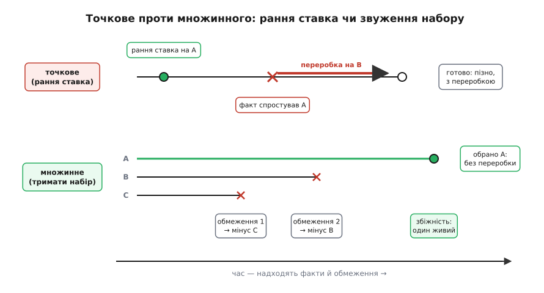
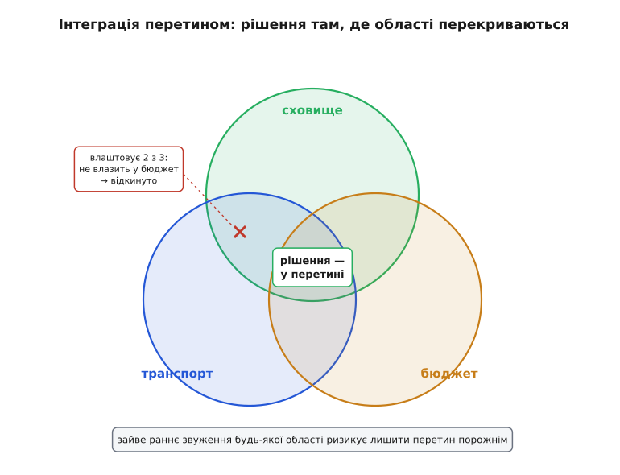
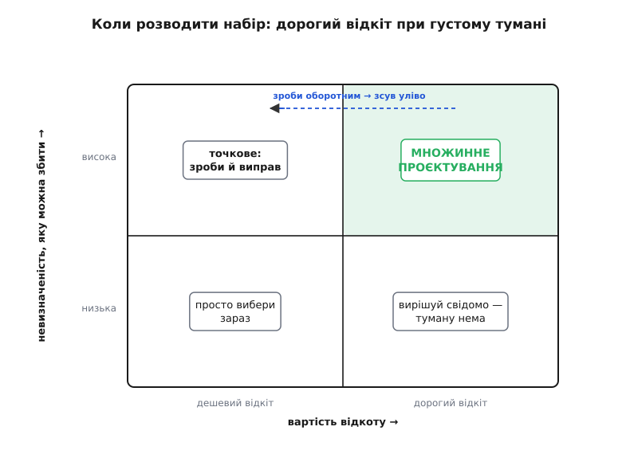

# Множинне (set-based) проєктування

<preknowlist>
- [Рішення під невизначеністю](topic:sf-apps/deciding-under-uncertainty) — як діяти, коли фактів бракує, а вибір робити мусиш; ціна помилкового раннього припущення.
- [Зворотні й незворотні рішення](topic:sf-apps/reversible-irreversible-decisions) — чому одні рішення дешево відкотити, а інші «замуровують» систему; вартість відкоту як головна вісь.
- [Останній відповідальний момент](topic:sf-apps/last-responsible-moment) — тримати рішення відкритим рівно доти, доки відкритість дає більше, ніж коштує.
</preknowlist>

Перед тобою складне архітектурне рішення, а фактів обмаль. Яку базу під нову систему — реляційну чи документну? Який транспорт для фонових задач — черга в пам'яті, керована хмарна черга чи Kafka? Природний хід інженера: обери найкраще на вигляд **зараз**, закрий питання й будуй далі. Обрав документну, написав код, схему, звіти — а через місяць з'ясувалося, що звітність вимагає складних з'єднань, у яких документна база захлинається. Тепер зривай усе, що на ній стоїть, і переробляй. Це не тому, що задача була важка. Це тому, що ставку зробили тоді, коли знали найменше.

Множинне проєктування (англ. *set-based design*, від *set* — «набір, множина»; повна назва — *set-based concurrent engineering*) відповідає на це інакше. Замість обрати одну точку в просторі рішень і крутити її, воно тримає **набір** життєздатних варіантів живими паралельно — і **звужує** цей набір у міру того, як надходять факти, викидаючи варіант лише тоді, коли доказ показав його гіршим або непридатним. Рішення не вгадують наперед — до нього **сходяться**, коли обмеження перетнулися й лишили один живий варіант.

## Точкове проти множинного

Звичний спосіб має ім'я — **точкове проєктування** (англ. *point-based*): обрати одну точку простору рішень рано й далі її допрацьовувати. Швидко стартувати, але кожна ітерація — повний виток, а зіткнення з обмеженням, про яке не знали спочатку, дороге: до нього вже прив'язано код, дані, чужі очікування. Коли обране рішення врізається в реальність, ти повертаєшся до початку — і часто не раз.

Множинне натомість не ставить на точку. Воно окреслює **області** простору, де рішення ще може лежати, говорить про ці області («транспорт має тягти від 20 до 200 тисяч повідомлень на секунду й коштувати команді не більш як 5 годин експлуатації на тиждень»), і дає відповіді проступити там, де сумісні області перекриваються. Варіанти вибувають по одному, кожен — за доведеною причиною, а не за здогадом.

Ось точна аналогія. Дві бригади прокладають тунель назустріч із двох боків гори. Точковий підхід: обидві націлюються в одну домовлену точку в товщі — і якщо геодезія бодай трохи схибила, забої розминаються, доводиться довбати збійку. Множинний підхід: кожна веде дещо ширший хід — «набір» можливих трас, — і бригади цілять не в точку, а в **перетин** своїх ходів; поки області перекриваються, вони зустрінуться напевно. Аналогія ламається там, де в програмах «набори» абстрактніші за геометрію: це діапазони конфігурації, форми інтерфейсу, кандидати технологій, — а «перетин» означає рішення, сумісне з усіма обмеженнями, а не буквальну зустріч у камені.



*Що видно: точкове платить витками переробки, коли рання ставка врізається в пізній факт; множинне front-loading'ом — тримає набір і викидає доведено гірше, доки лишиться один, без відкоту.*

## Другий парадокс Тойоти

Звідки взялася впевненість, що тримати більше варіантів **швидше**, а не повільніше? З несподіваного відкриття. Досліджуючи, як Тойота розробляє автомобілі, інженери-дослідники побачили дивне: Тойота розглядала **ширший** діапазон конструкцій і відкладала частину рішень **довше** за конкурентів — і при цьому мала чи не найшвидший і найощадливіший цикл розробки в галузі. Це назвали «другим парадоксом Тойоти»: як зволікання з рішеннями робить кращі авто швидше.

Розгадка в тому, що точковий цикл ховає свою головну ціну — **витки переробки**. Обрав вузол рано, усі суміжні команди вибудували роботу навколо нього, а тоді він зіткнувся з обмеженням з іншого краю системи — і півкоманди повертається на крок назад. Таких витків трапляється кілька, і кожен дорогий, бо на момент зіткнення вже багато зроблено. Множинне переносить дослідження **наперед**, поки воно ще дешеве й паралельне, — і тим гасить витки. Ти платиш за розвідку кількох варіантів раз, замість платити за переробку багато разів. [Як усе це народилося](topic:sf-apps/set-based-design/hist-toyota-paradox.md) — від відкриття Аллена Ворда до перенесення ідеї в софт — окрема повчальна історія.

> 🔧 **Навіщо це.** Найдорожчі переробки в архітектурі — не там, де задача важка, а там, де ставку зробили зарано. Обрали формат подій, поки споживачів не було; винесли мікросервіс раніше, ніж проступила межа; прибили схему БД до форми даних, якої ще не бачили. Множинне проєктування — це дисципліна не витрачати важке рішення, доки набір живих варіантів сам не звузиться до одного під вагою фактів. Розвідка кількох варіантів наперед майже завжди дешевша за один зрив збудованого.

## Три опори методу

Коли Тойотину практику розібрали на принципи, вийшло три опори — і кожна відповідає на своє питання «як саме».

**Окреслити простір.** Не стрибай у точку — спершу познач, де рішення взагалі може лежати. Для кожної підзадачі визнач **придатну область**: не «беремо PostgreSQL», а «сховище має витримати такий обсяг, дати такі гарантії, влізти в такий бюджет». Спілкуйся наборами й діапазонами, а не передчасними точками. Це дає суміжним командам працювати паралельно, не чекаючи на твій єдиний вибір: їм досить знати **межі**, у яких ти лишишся.

**Інтегрувати перетином.** Відповідь живе там, де придатні області різних підзадач **перекриваються**. Тому шукай перетин, а не нав'язуй зайвих обмежень: що вужче ти прибиваєш кожну область без потреби, то більший ризик, що спільного перетину не лишиться зовсім. Обирай рішення, **стійкі** через увесь набір, — такі, що працюють у широкій частині області, а не балансують на її вістрі.

**Довести придатність, тоді фіксувати.** Звужуй набір **поступово**, у міру того як деталізація й знання ростуть; варіант викидай, коли доказ показав його гіршим. А **зафіксувавши** — не відкривай знову без вагомої нової причини: інакше збіжність не настане ніколи. Порядок саме такий: спершу впевнитися, що варіант придатний, і лише тоді на нього стати.



*Що видно: кожна підзадача дає придатну область; сумісне рішення — у перетині всіх; зайве раннє звуження будь-якої з областей ризикує лишити перетин порожнім.*

## Як це виглядає в коді

Візьмімо той самий вибір транспорту для фонових задач під невизначеністю: справжнього піку навантаження ще не виміряли, бюджет команди на експлуатацію теж пливе. Точковий хід — прибити Kafka першого дня, «бо стандарт», і потім виявити, що обсяг крихітний, а експлуатація з'їдає команду. Множинний — тримати три кандидати живими за вузьким інтерфейсом, задати **вимірювані** критерії вибуття, і дати фактам звузити набір.

Ключ — не «обрати», а «лишити тих, хто витримав факт». Кожен новий факт — жорсткий предикат; множина звужується сама:

:::tabs
```python
from dataclasses import dataclass
from collections.abc import Callable

@dataclass(frozen=True)
class Option:
    name: str
    max_throughput: int    # повідомлень/с без болю
    ops_cost_week: int     # людино-годин експлуатації на тиждень
    exactly_once: bool     # чи дає доставку «точно раз»

# Набір кандидатів — тримаємо ЖИВИМИ, поки факт не спростує
CANDIDATES = [
    Option("in-process",    max_throughput=2_000,     ops_cost_week=1,  exactly_once=False),
    Option("managed-queue", max_throughput=50_000,    ops_cost_week=3,  exactly_once=False),
    Option("kafka",         max_throughput=1_000_000, ops_cost_week=12, exactly_once=True),
]

Constraint = Callable[[Option], bool]  # факт = предикат: лишаємо тих, хто ВИТРИМАВ

def survivors(options: list[Option], facts: list[Constraint]) -> list[Option]:
    return [o for o in options if all(f(o) for f in facts)]

facts: list[Constraint] = []

facts.append(lambda o: o.max_throughput >= 20_000)   # виміряний пік навантаження
# лишились: managed-queue, kafka   (in-process відпав — доведено, не вгадано)

facts.append(lambda o: o.ops_cost_week <= 5)          # реальний бюджет експлуатації
# лишився: managed-queue          (kafka відпав — зайві витрати не окупились)

alive = survivors(CANDIDATES, facts)
assert [o.name for o in alive] == ["managed-queue"]
# один живий → рішення визріло саме, без ранньої ставки й переробки
```
```ts
interface Option {
  name: string;
  maxThroughput: number;   // повідомлень/с без болю
  opsCostWeek: number;     // людино-годин експлуатації на тиждень
  exactlyOnce: boolean;    // доставка «точно раз»
}

// Набір кандидатів — тримаємо ЖИВИМИ, поки факт не спростує
const CANDIDATES: Option[] = [
  { name: "in-process",    maxThroughput: 2_000,     opsCostWeek: 1,  exactlyOnce: false },
  { name: "managed-queue", maxThroughput: 50_000,    opsCostWeek: 3,  exactlyOnce: false },
  { name: "kafka",         maxThroughput: 1_000_000, opsCostWeek: 12, exactlyOnce: true  },
];

type Constraint = (o: Option) => boolean;  // факт = предикат: лишаємо, хто ВИТРИМАВ

const survivors = (opts: Option[], facts: Constraint[]): Option[] =>
  opts.filter((o) => facts.every((f) => f(o)));

const facts: Constraint[] = [];

facts.push((o) => o.maxThroughput >= 20_000);  // виміряний пік навантаження
// лишились: managed-queue, kafka   (in-process відпав — доведено, не вгадано)

facts.push((o) => o.opsCostWeek <= 5);         // реальний бюджет експлуатації
// лишився: managed-queue          (kafka відпав — зайві витрати не окупились)

const alive = survivors(CANDIDATES, facts);
console.assert(alive.map((o) => o.name).join() === "managed-queue");
// один живий → рішення визріло саме, без ранньої ставки й переробки
```
:::

Суть коду не в цифрах — вони в кожного проєкту свої. Суть у тому, що жодного варіанта не відкинуто «на око»: кожен вибув, коли **виміряний** факт довів його непридатність, а рішення проступило, коли лишився один живий. Три кандидати весь цей час стояли за вузьким інтерфейсом, тож тримати їх живими коштувало дешево — код, що кладе задачу в чергу, не знав, яка черга під ним. Ту саму механіку — але з журналом вибуття, захистом від передчасного сходження й від застряглого набору — розгортає [робочий трекер збіжності](topic:sf-apps/set-based-design/proj-convergence-tracker.md).

## Коли метод вартий заходу — а коли ні

Множинне проєктування не безкоштовне. Тримати кілька варіантів живими коштує: паралельні прототипи, абстрактні шви, узгодження між командами, дисципліна звуження. Тому його не сиплють на всі рішення — його бережуть для **небагатьох** вагомих.

Дві осі кажуть, коли метод окупається. Перша — наскільки **дорого відкотити** помилку: рішення, яке дешево переграти (назва, внутрішня межа, формат логів), не варте жодних множинних роздумів — обери будь-яке розумне зараз і виправ, коли взнаєш краще. Друга — скільки в рішенні **невизначеності, яку можна збити** дешевим дослідом: якщо факти вже на столі, набір ні до чого — вирішуй. Множинне світить лише там, де сходяться обидві осі: відкат **дорогий**, а туман **густий і розсіюваний**.



*Що видно: множинне належить лише куту «дорогий відкат + густий туман»; для дешевих-до-відкоту рішень воно марнує зусилля, а при малій невизначеності набір нічого не додає.*

> 🔧 **Навіщо це.** Перш ніж розводити набір варіантів, спитай дві речі: наскільки дорого це відкотити й що я взнаю, як зачекаю. Дешево відкотити — вирішуй зараз, точково. Нічого нового не взнаєш — теж вирішуй зараз. Множинне заслуговують лічені рішення на проєкт: вибір моделі даних, публічний контракт, поділ на сервіси. Решту веди точково — інакше сам метод стане накладними, які він мав економити.

Цей поділ прямо спирається на [зворотність рішень](topic:sf-apps/reversible-irreversible-decisions): дешеві-до-відкоту бери швидко, дорогі-до-відкоту — тримай набором. І часто перший, найдешевший хід — не «який варіант обрати», а «як зробити вибір оборотним»: сховати рішення за інтерфейсом, звузити те, що назовні, — і тоді потреба в множинному наборі відпадає сама.

## Множинне й відкладання — не одне й те саме

Легко сплутати множинне проєктування з простим відкладанням рішення, але це різні речі, і вони доповнюють одна одну. [Останній відповідальний момент](topic:sf-apps/last-responsible-moment) каже, **коли** закрити рішення: тримай його відкритим рівно доти, доки відкритість платить, і закрий рішуче в мить, коли зволікати далі означало б втратити щось важливе. Множинне проєктування каже, **що робити** з рішенням, поки воно відкрите: не сидіти в тумані, а тримати живим звужуваний набір і активно збивати невизначеність.

Головний спосіб збивати її дешево — не суперечки, а виміри. [Ходячий кістяк](topic:sf-apps/walking-skeleton) — тонка наскрізна версія, що вже працює від краю до краю, — дає прогнати кандидатів на реальному навантаженні й отримати цифри замість здогадів; кожен такий факт викидає з набору ще один варіант. А критерії вибуття — це не смак, а [аналіз компромісів](topic:sf-apps/tradeoff-analysis): кожен варіант зважують за тими самими якісними атрибутами, і програє той, хто доведено гірший там, де це важить.

## Де метод ламається

Найпоширеніше зловживання — сховати за «множинним проєктуванням» звичайну нерішучість. «Тримаємо всі варіанти відкритими» звучить мудро, але без **критеріїв вибуття** й **дедлайну збіжності** це не метод, а параліч: набір, що ніколи не звужується, — це не set-based, а страх вирішувати. Чесне множинне вимагає назвати наперед, який факт уб'є який варіант і коли набір **мусить** стягнутися до одного.

Друга межа — ціна паралельності. Вести п'ять живих прототипів на кожну дрібницю неможливо; саме тому метод беруть для небагатьох вагомих рішень, а не для всіх. Розводити набори всюди — це вже не ощадливість, а марнотратство навпаки.

І третя, найтонша. Тойота могла дозволити собі широкі набори, бо десятиліттями накопичувала **бібліотеку знань** — криві компромісів, за якими одразу видно, яка область придатна, а яка ні. Молода команда такої бібліотеки не має, тож її «набори» грубіші, а звуження — дорожче, бо кожну область доводиться промацувати з нуля. Це не привід відкидати метод — це причина розводити набір **вужче** там, де знань бракує, і дбати, щоб кожне звуження лишало по собі записаний факт, який згодом і стане такою бібліотекою.

Тож ціле правило тримається просто. Для дорогого-до-відкоту рішення в густому тумані не став на точку — окресли придатні області, тримай набір живих варіантів за дешевим швом, викидай кожен лише за доведеним фактом, і дай відповіді проступити в перетині, коли лишиться один. Не можеш назвати, який факт уб'є який варіант, — ти не проєктуєш множинно, ти зволікаєш, і рішення варто ухвалити зараз.
