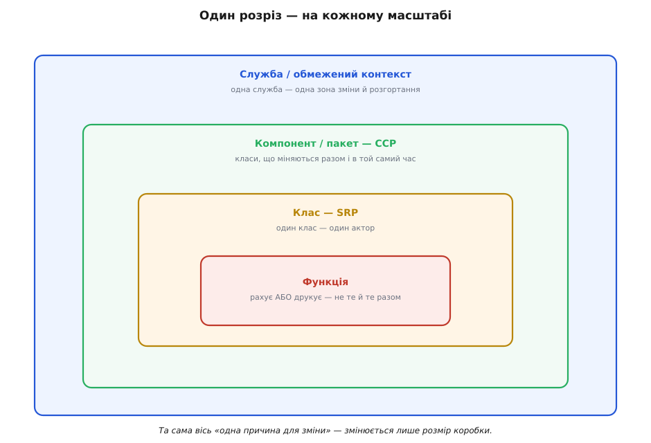

# Принцип єдиної відповідальності (SRP)

<preknowlist>
- [Зчеплення і зв'язність](root:sf-apps/coupling-cohesion) — дві осі якості дизайну; SRP цілить у вершину зв'язності (усе в модулі служить одній справі) і в низьке зчеплення між модулями.
- [Інтерфейс проти реалізації](root:sf-apps/interface-vs-implementation) — різниця між обіцянкою модуля зовні й тим, як він її виконує; на цьому поділі тримається розчеплення обов'язків.
- [YAGNI, DRY, KISS](root:sf-apps/dry-kiss-yagni) — коли **не** розбивати наперед; SRP ріже за причинами зміни, а не заради дроблення, і мириться з DRY через питання «однаковий код — з однієї причини?».
</preknowlist>

Про SRP найчастіше говорять так, ніби це правило про сам код: класи хай будуть маленькі, метод хай «робить одну річ». Але жодну з цих настанов не можна перевірити, дивлячись на текст програми, бо в тексті немає поділки, за якою одну «річ» відрізнити від двох. Метод `save()` відкриває з'єднання, будує запит, шле його, читає відповідь, закриває з'єднання — п'ять речей чи одна? Під будь-яким кутом можна нарізати як завгодно дрібно й довести що завгодно. Отже, правило, сформульоване через «річ» або через «розмір», нічого не забороняє.

Сила SRP розкривається, лише коли помічаєш, що це взагалі **не твердження про код у теперішньому часі**. Це твердження про майбутнє: про те, **як до цього коду прийде зміна** — з якого боку, від кого й чому. Код не псується сам; він лежить у файлі роками нерухомо, аж поки ззовні не прийде нова вимога. Тому одиниця виміру SRP — не рядок і не метод, а **сила, що штовхає код мінятися**. І щойно ти дивишся під цим кутом, розпливчасте «одна відповідальність» стає чимось, що можна означити точно, побачити двома незалежними способами й навіть поміряти. Розберімо це до дна: спершу зробимо «відповідальність» математично різкою, тоді знайдемо дві її тіні — у структурі коду й в історії його правок, — тоді проженемо той самий розріз крізь усі масштаби від функції до служби, і, нарешті, чесно розберемо два місця, де принцип тріщить: наскрізні турботи й спокусу різати передчасно.

## Відповідальність — це клас майбутніх змін

Почнімо з означення, якого зазвичай бракує. Роберт Мартин, який дав принципу назву, у розборі 2014 року звів «причину для зміни» до майже фізичної речі: **актор** (лат. *actor* — виконавець, діяч) — група людей, роль чи відділ, від яких надходить запит на зміну. Історію того, як формулювання визрівало тридцять років — від драбини зв'язності Константина до слова «актор» — розібрано окремо в [нарисі про походження SRP](root:sf-apps/single-responsibility/hist-srp-origin.md); тут нас цікавить не хронологія, а **механіка**: що саме означає «одна відповідальність», якщо взяти це слово серйозно.

Спробуймо означити його точно. Уяви всю сукупність **ймовірних майбутніх запитів на зміну** до системи — назвімо її R. Кожен запит r, коли його втілюють, торкається якогось набору елементів коду (методів, полів, функцій) — позначмо цей набір `touched(r)`. Тепер для кожного елемента коду `e` подивімося з іншого боку: у яких саме запитах він фігурує. Цей набір запитів — назвімо його **підписом зміни** елемента — і є справжня характеристика елемента з погляду SRP:

```other
R           — множина ймовірних майбутніх запитів на зміну
touched(r)  — елементи коду, яких торкнеться запит r ∈ R
sig(e)      = { r ∈ R : e ∈ touched(r) }     — «підпис зміни» елемента e
e₁ ~ e₂     ⟺   sig(e₁) = sig(e₂)            — однаковий підпис = «завжди разом»
```

Відношення `~` («мають однаковий підпис зміни») — це рівність множин, а рівність множин має три властивості: кожен елемент подібний сам до себе, подібність симетрична, і якщо перший подібний до другого, а другий до третього, то й перший до третього. Такі три властивості означають, що `~` — **відношення еквівалентності**, а будь-яке відношення еквівалентності робить одну строгу річ: воно **розбиває** всю множину елементів на **класи, що не перетинаються**. Кожен клас — це група елементів, які загоряються рівно в тих самих запитах і мовчать у тих самих запитах. Ось точне означення того, що інтуїція називає відповідальністю:

> **Відповідальність — це клас еквівалентності відношення «мають однаковий підпис зміни».** Модуль за SRP — це рівно один такий клас: усе, що завжди міняється вкупі, зібрано разом, і нічого стороннього не приліплено.

Це не гра в символи — це різко переставляє те, як бачиш дизайн. Тепер обидві типові помилки виводяться з означення, а не постулюються.

**Недорозділ (God-модуль).** Нехай модуль M склеїв два різні класи-відповідальності, A і B. Візьмімо запит r, що торкається лише A (`sig` елементів A містить r, елементів B — ні). Формально він про A, але фізично він змушує перезбирати, перетестовувати й перерозгортати **весь** M, бо B живе в тій самій одиниці. B платить за зміну, якої не просив. А тепер найтонше: якщо всередині M є елемент, який насправді торкається і A-запитів, і B-запитів (класичний спільний прихований хелпер обліку годин), то його підпис — це **об'єднання** підписів A і B, тобто підпис, не рівний ні A, ні B. За означенням це **окремий, третій клас еквівалентності**. Модель сама, без жодних порад, каже: цей спільний елемент — не «частина A» і не «частина B», а власна маленька відповідальність, яку треба витягти на світло з явним контрактом. Саме це — і саме тому — робить рефакторинг у [розборі-проєкті про поділ `Employee`](root:sf-apps/single-responsibility/proj-employee-split.md), де прихована `regularHours()` стає названою `HoursPolicy`: не «бо так гарніше», а бо її підпис зміни відрізняється від обох сусідів.

**Передрозділ (анемічне дроблення).** Дзеркальна помилка: один клас-відповідальність C розмазали по двох модулях, M₁ і M₂. Тоді **кожен** запит із `sig(C)` торкається обох модулів одразу — вони приречені мінятися разом, розгортатися разом, тестуватися разом. Ти отримав два файли, які насправді один, плюс шов між ними, який доводиться тримати в голові при кожній зміні; а неповна правка (зачепив M₁, забув M₂) ламає інваріант, який колись був захищений тим, що весь C був в одному місці.

> 🔧 **Навіщо це.** Це означення — робочий інструмент прийняття рішень, а не прикраса. Воно дає два різні присуди там, де «клас робить одну річ» лише знизує плечима. Питання «ділити цей клас чи ні?» стає перевірним: чи існує запит, що торкнеться **частини** класу й не торкнеться решти? Якщо так — усередині живуть два підписи, тут шов. Чи існує запит, що змусить мінятися обидва «різні» класи одразу й завжди? Якщо так — ти розрізав те, що було одним, зший назад. І окремо: елемент, у який тягнуться дві різні сили, — не привід «вибрати, чий він», а сигнал, що це **третя** річ, яку треба виокремити з власним ім'ям і власником.

Залишається чесно сказати, де модель ідеалізує. У живому коді підписи рідко рівні **точно** — два методи можуть збігатися в дев'яти запитах із десяти й розійтися в десятому. Строга рівність `sig(e₁) = sig(e₂)` перетворюється на «підписи **майже** однакові», а розбиття на класи — на **кластеризацію** елементів за схожістю підписів. І це не поразка означення, а місток до практики: якщо відповідальність — це кластер елементів зі схожим підписом зміни, то постає інженерне питання — **як цей підпис побачити**, не маючи машини часу, що покаже всі майбутні запити?

## Дві тіні однієї істини: граф полів і історія комітів

Тут криється те, що робить SRP і глибоким, і слизьким водночас. Справжнє розбиття на відповідальності — це факт **не про код, а про твою організацію**: скільки в ній незалежних джерел вимог і що кожне з них смикає. Цей факт живе поза репозиторієм — у структурі відділів, ролей, регуляторів, замовників. Код лише **відкидає тінь** цього факту, і побачити його прямо не можна. Зате можна побачити дві його тіні, здобуті двома незалежними способами, і саме на їхньому зіставленні тримається практичне застосування принципу.

**Перша тінь — статична, у структурі коду.** Її дає давня спроба поміряти зв'язність числом. Погляньмо на клас як на граф: вершини — методи, ребро між двома методами проводимо, якщо вони торкаються спільного поля (або один кличе одного). Метод, що читає й пише поле `balance`, і метод, що теж читає `balance`, — з'єднані: вони, найпевніше, служать одній справі. А метод, який працює лише з `logStream`, ні з ким із них поля не ділить — він в окремій компоненті графа. Кількість **зв'язних компонент** цього графа — це, по суті, кількість незалежних груп у класі. Якщо компонента одна — клас однорідний; якщо їх три — усередині сидять три класи, які лише вдають одне ціле.

Саме це число й формалізує метрика з незграбною назвою **LCOM** (англ. *Lack of Cohesion of Methods* — брак зв'язності методів). Її ввели Чідамбер і Кемерер 1994 року; пізніша, найясніша версія (LCOM4 Гітца й Монтазері) — це буквально «кількість зв'язних компонент» того графа, і ідеал для класу з однією відповідальністю — **одиниця**. Повне виведення — від першої формули (пари методів без спільних полів мінус пари зі спільними) до графової версії з підрахунком зв'язних компонент, а поряд показовий випадок, де спільний об'єкт даних обманює метрику в «одиницю» попри трьох різних акторів, — винесено в [окремий розбір метрики](root:sf-apps/single-responsibility/math-lcom-cohesion.md), бо там є що вивести й порахувати руками.

**Друга тінь — історична, у слідах правок.** Актор лишає відбитки не в структурі полів, а в журналі системи контролю версій. Якщо два методи раз за разом з'являються в тих самих комітах — їх смикає одна сила; якщо два методи за всю історію жодного разу не змінилися в одному коміті — вони, хоч би як тісно лежали в одному класі, служать **різним** причинам. Це і є прямий, майже буквальний спосіб побачити той самий підпис зміни `sig(e)`: замість гіпотетичної множини майбутніх запитів беремо **справжню** множину минулих комітів і дивимося, які елементи в ній загоралися разом.


*Стовпці — коміти в часі, пофарбовані за актором, що їх замовив; рядки — елементи коду; клітина заповнена, якщо той коміт торкнувся того елемента. Коли елементи впорядкувати за схожістю підпису, чисті блоки-відповідальності проступають самі. Рядок, у який б'ють правки з обох боків (`regularHours`), не лягає в жоден блок — це той самий елемент із «подвійним підписом», шов, що тече.*

Ця друга тінь має практичну перевагу над першою: вона бачить зв'язки, яких у полях класу немає взагалі. Два модулі можуть не ділити жодного поля — і все одно змінюватися завжди разом, бо їх тримає спільна бізнес-причина (те, що метрики звуть **логічним**, а не структурним зчепленням). Граф полів такого не помітить; історія комітів помітить одразу. Тому аналіз сумісної зміни (англ. *change coupling*) — сильний детектор швів SRP на великій, зрослій кодовій базі, де очима вже не охопиш. Як його зробити руками — витягти з `git log` пари файлів, що часто міняються разом, відсіяти шумові коміти-переформатування (де «змінилося все», але це нічого не означає) і прочитати результат як карту прихованих відповідальностей — розписано з робочим скриптом у [окремому проєкті-аналізі](root:sf-apps/single-responsibility/proj-cochange-analysis.md).

> 🔧 **Навіщо це.** Дві тіні дають дві незалежні думки про той самий шов — і найцінніші вони, коли **не збігаються**. LCOM каже «клас зв'язний» (усі методи торкаються спільного об'єкта даних), а історія комітів показує, що два відділи місяцями правлять цей клас у різні коміти й у різні дати релізів — вір історії: спільне поле тут випадкове, актори різні. І навпаки: метрика кричить «низька зв'язність!» на класі, методи якого не ділять полів, але кожна правка все одно зачіпає їх разом — метрика бреше, бо міряє поля, а не причини. Жодна тінь не є істиною; істина — це відповідь на питання «хто прийде й попросить це змінити». Метрики й `git log` лише підказують, **де** його поставити.

Отже, ані статична метрика, ані історія правок не **визначають** відповідальність — вони її оцінюють. Означення лишається за актором: відповідальність — це те, що міняється з волі однієї сили. Метрики — консервативні детектори диму: висока LCOM чи сильне сумісне зчеплення — привід придивитися, а не автоматичний вирок різати.

## Наскрізні турботи: випадок, де принцип найважче тримати

Поки відповідальності лежать поряд у бізнес-логіці, SRP розводить їх чисто. Але існує клас турбот, об які принцип у наївному прочитанні розбивається, і чесна глибока розмова про SRP мусить його назвати. Це **наскрізні турботи** (англ. *cross-cutting concerns*): журналювання, заміри часу, транзакції, авторизація, кешування, повтори при збої. У кожної з них — свій актор (журнал править команда експлуатації, транзакційні межі — архітектор даних, авторизацію — безпека), тобто за буквою SRP кожна заслуговує на власне місце. Але спробуй «покласти журналювання в одне місце» — і впираєшся в стіну: воно потрібне **скрізь**, у кожному обробнику запиту, у кожній операції. Турбота, що має одного актора, фізично розсіяна по всій системі. Ось де «збери докупи те, що міняється з однієї причини» стикається з «але воно потрібне в сотні місць».


*Наскрізна турбота має одного актора, але лежить у кожному модулі (ліворуч) — журнал, транзакція й авторизація повторюються в Замовленні, Оплаті й Доставці. Прибрати її з ядра можна не «в один модуль», а в один **шар, що обгортає** модулі (праворуч): кожен концерн — рівно один раз, а ядро про нього не знає.*

Наївна відповідь — вписати журнал і заміри прямо в кожен метод — і дає ту саму хворобу, від якої SRP лікує: тепер клас `PlaceOrder` міняється і коли міняється правило замовлення (актор — власник домену), і коли міняється формат журналу (актор — експлуатація). Дві причини для зміни в одному тілі, помножені на кожен обробник у системі. Розв'язок у тому, щоб помітити: наскрізну турботу не обов'язково класти **всередину** — її можна винести в **шар, що обгортає**. Ядро лишається з єдиним актором, а турбота живе рівно в одному місці й **накладається ззовні**. Класичний прийом — **декоратор** (об'єкт, що має той самий інтерфейс, що й ядро, тримає ядро всередині й додає своє до або після виклику). Ось той самий обробник замовлення з чистим ядром і двома наскрізними турботами, накинутими декораторами; це загальна бекенд-логіка, тож показано двома звичними для неї мовами:

:::tabs
```python
import time

# Ядро: тільки бізнес-правило замовлення. Єдиний актор — власник домену.
class PlaceOrder:
    def __init__(self, repo):
        self.repo = repo

    def __call__(self, order):
        self.repo.save(order)
        return order.id

# Кожна наскрізна турбота — окремий декоратор, що ОБГОРТАЄ будь-який обробник.
def with_logging(handler):
    def wrapped(order):
        log.info("place order %s", order.id)
        result = handler(order)
        log.info("order placed: %s", result)
        return result
    return wrapped

def with_timing(handler):
    def wrapped(order):
        started = time.perf_counter()
        try:
            return handler(order)
        finally:
            metrics.observe("place_order", time.perf_counter() - started)
    return wrapped

# Збірка: ядро загорнуте в шари; саме воно про журнал і заміри не знає.
handler = with_logging(with_timing(PlaceOrder(repo)))
order_id = handler(order)
```
```ts
type Handler = (order: Order) => string;

// Ядро: тільки бізнес-правило замовлення.
const placeOrder = (repo: Repo): Handler => (order) => {
  repo.save(order);
  return order.id;
};

// Кожна наскрізна турбота — обгортка над Handler.
const withLogging = (next: Handler): Handler => (order) => {
  log.info(`place order ${order.id}`);
  const result = next(order);
  log.info(`order placed: ${result}`);
  return result;
};

const withTiming = (next: Handler): Handler => (order) => {
  const started = performance.now();
  try {
    return next(order);
  } finally {
    metrics.observe("place_order", performance.now() - started);
  }
};

// Збірка ланцюга: ядро не знає ні про журнал, ні про заміри.
const handler = withLogging(withTiming(placeOrder(repo)));
const orderId = handler(order);
```
:::

Придивися, що дало обгортання. Правило замовлення живе в `PlaceOrder` і має рівно одного актора. Формат журналу живе в `with_logging` — один раз, для будь-якого обробника; коли експлуатація попросить інший формат, правиться одна функція, а не сотня методів. Заміри часу — так само один раз. Кожна причина для зміни знову лягла в одне місце; просто це «місце» — не всередині ядра, а шаром зовні. Той самий прийом у різних вбраннях — це `middleware` у веб-фреймворках, перехоплювачі (interceptors) у застосунках, проксі в мережах: скрізь наскрізна турбота піднята з тіла операції в обгортку.

Ця стіна свого часу породила цілий напрям. Наприкінці 1990-х команда під проводом Ґреґора Кічалеса в дослідному центрі Xerox PARC (стаття на ECOOP 1997) назвала проблему **наскрізних турбот** і запропонувала радикальний засіб — **аспектно-орієнтоване програмування** (англ. *aspect-oriented programming*; аспект — від лат. *aspectus*, погляд, сторона). Ідея була сміливою: винести журнал, транзакції, безпеку в окремі «аспекти», а спеціальний інструмент («ткач», weaver) автоматично **вплітав** би їхній код у потрібні місця — без жодного рядка обгортки в ядрі. Інструмент AspectJ для Java це втілив. Статус долі цієї ідеї варто назвати чесно: сам AOP у мейнстрімі радше **згас** — власне вплітання виявилося надто «магічним», код ставало важко читати, бо поведінка методу залежала від невидимих аспектів. Виграла легша форма тієї самої думки: явні декоратори, middleware й перехоплювачі, де обгортка **видима** в місці збірки. Але сам діагноз Кічалеса — що деякі турботи наскрізні за природою й не піддаються звичайному модульному поділу — лишився правильним, і саме він пояснює, чому SRP тут вимагає не «поділити всередині», а «підняти назовні».

> 🔧 **Навіщо це.** Межу декоратора треба тримати так само чесно, як межу класу, інакше він переродиться на смітник. Правило: декоратором піднімають **інфраструктурну наскрізну турботу** (журнал, заміри, транзакція, повтор) — те, що однакове для багатьох операцій і має власного технічного актора. Але **бізнес-правило декоратором не виносять**: якщо в обгортку заповзає ставка податку чи умова знижки, це вже не наскрізна турбота, а домен, і його місце — в ядрі, у свого актора. Ознака зради проста: декоратор перестав бути однаковим для різних операцій і почав знати щось про конкретну предметну область. Тоді він набув другого актора — і став тим самим God-об'єктом, лише вивернутим назовні.

## Той самий розріз — на кожному поверсі

У назві принципу стоїть «клас», але це історична випадковість, а не межа застосування. Вісь «одна причина для зміни» ріже код на **будь-якому** масштабі, і на кожному в неї є власне ім'я — що видає: це не чотири різні правила, а одне, побачене з різної відстані.



*Один і той самий розріз «одна причина для зміни» повторюється на кожному поверсі — змінюється лише розмір коробки. Функція, клас, компонент, служба: та сама вісь, різна відстань погляду.*

На рівні **функції** SRP каже: функція, що і рахує результат, і друкує його, має дві причини мінятися — зміну обрахунку й зміну виводу — тож ці дві причини треба розвести на дві функції. Поряд тут живе інший, схожий, але **не той самий** принцип, який зі SRP постійно плутають, — єдиний рівень абстракції в тілі функції (не змішувати високорівневі кроки з низькорівневою марудою). Він теж каже «не міш докупи», але міряє іншим: рівнем абстракції, а не причиною зміни. Функція може бути на одному рівні абстракції й усе одно тягнути дві причини — і навпаки; тримай їх різними в голові.

На рівні **класу** — власне SRP, канонічний `Employee`, розведений за акторами CFO / COO / CTO.

На рівні **компонента чи пакета** вісь дістає окрему назву — **принцип спільного закриття** (англ. *Common Closure Principle*, CCP), який Мартин прямо називає «SRP для пакетів». Формулювання показове: «збери в один компонент класи, що міняються **з тих самих причин і в той самий час**; розведи ті, що міняються з різних причин і в різний час». Зверни увагу на додану вимогу — **«в той самий час»**. На рівні класу її не було, а тут вона з'являється не випадково: компонент — це одиниця **випуску й розгортання**, і сенс межі в тому, щоб одна зміна вимагала перевипустити рівно один компонент. Дві причини можуть бути «різні за джерелом», але якщо вони завжди спрацьовують синхронно (той самий реліз), тримати їх разом вигідно — менше компонентів перевипускати; і навпаки, дві споріднені речі, що релізяться в різному темпі, варто рознести, щоб зміна однієї не смикала випуск іншої. Часовий вимір — це те, що додає масштаб пакета до чистого SRP. Хто хоче побачити всю трійку принципів зчеплення компонентів (спільне закриття, спільне повторне використання, еквівалентність випуску й повторного використання) — їй присвячено [окрему тему про принцип спільного закриття](root:sf-apps/common-closure-principle).

На найбільшому масштабі та сама вісь визначає межі **служб**. Мікросервіс, який варто виокремити, — це той, що має одну причину для зміни й одне джерело вимог; інакше два незалежні напрями застрягнуть у спільному розкладі релізів. Тут SRP зливається з поняттям [обмеженого контексту](root:sf-apps/bounded-context) з предметно-орієнтованого проєктування: контекст окреслює зону, всередині якої мова й модель узгоджені й міняються разом, — тобто рівно одну відповідальність архітектурного масштабу.

Через цю наскрізність — той самий розріз на функції, класі, пакеті й службі — SRP і стоїть першою літерою в наборі SOLID: не тому, що найважливіший, а тому, що задає **спосіб думати про межі**, на який спираються інші. Решта того набору — це той самий SRP, застосований до конкретніших ситуацій. [Принцип відкритості/закритості](root:sf-apps/open-closed) каже, як додавати нову поведінку по той бік межі відповідальності, не переписуючи стару. [Принцип розділення інтерфейсів](root:sf-apps/interface-segregation) — це буквально SRP, застосований до інтерфейсу: клієнт не повинен залежати від методів, потрібних іншому клієнтові, тобто інтерфейс теж має одного «актора-клієнта». [Інверсія залежностей](root:sf-apps/dependency-inversion) розчіплює напрямок, у якому одна відповідальність спирається на іншу, щоб межу можна було тримати стабільною. А сам корінь усього цього — старша й ширша ідея **розділення турбот** (англ. *separation of concerns*), яку ще 1974 року назвав Едсґер Дейкстра в есе «On the role of scientific thought»: розглядати одну турботу за раз — «єдина доступна нам техніка впорядкування думок». SRP — це різкий, вимірний окремий випадок тієї давньої мудрості: турбота, яку слід розглядати окремо, — це та, що міняється зі своєї причини.

## Коли шов не варто різати: вартість передчасного розколу

Найтонше в SRP — не навчитися бачити шви, а навчитися **не різати ті, яких ще немає**. Бо кожен розкол не безкоштовний, і глибоке володіння принципом — це вміння зважити його ціну, а не механічно дробити на кожен «різний» дієслово.

Порахуймо обидві сторони. Розділення коштує: з'являється зайва непрямість (там, де був один виклик, тепер об'єкт, який його делегує), більше файлів, більша поверхня збірки (кого з ким з'єднати), і — найдорожче — **розмазаність цілого**: щоб зрозуміти просту поведінку, доводиться стрибати між кількома одиницями й тримати їхню взаємодію в голові. Це і є та ціна, яку сплачує анемічне дроблення, коли просту цілісну дію ріжуть на `Validator`, `Calculator`, `Formatter`, `Coordinator` лише тому, що це різні дієслова, — а всі чотири міняються завжди разом, від одного актора. Тут порушено не букву SRP, а його **мету**: принцип мав **зменшити** те, що тримаєш у голові при зміні, а надмірний розкол це збільшив.

Нерозділення теж коштує — але **інакше**: ризиком тихої поломки, коли зміна від одного актора дотягнеться до коду іншого через випадково спільний шматок. Ключове слово — **ризик**: ця ціна не сплачується щодня, вона стріляє лише коли дві сили справді розійдуться. Тому рішення «різати чи ні» — це зважування:

```other
різати варто, коли   ризик · імовірність(актори розійдуться) · частота_змін
                     помітно більший за
                     ціну непрямості + координації тепер
```

Практичний висновок із цієї нерівності однозначний: **ріж на доказах, а не на здогадах**. Доказ — це коли другий актор уже існує й уже попросив зміну, що тягне код в інший бік, ніж перший. Поки другий актор гіпотетичний («а раптом колись знадобиться інший формат»), розкол наперед — це сплата непрямістю й розмазаністю за гнучкість, якою, можливо, ніхто не скористається; це та сама передчасна абстракція, від якої застерігає [YAGNI](root:sf-apps/dry-kiss-yagni). Тому здорове правило звучить не «ділити завжди», а: **тримай разом, поки не побачив, що дві сили тягнуть у різні боки, — тоді розводь по цьому шву, який уже проступив.**

Тут-то й змикаються всі нитки цього розбору. Звідки взяти доказ, що актори розійшлися, а не здаються різними? З тіней, про які йшлося: якщо історія комітів показує, що два методи ніколи не мінялися в одному коміті й тягнуться правками з різних дат і від різних людей — доказ є, ріж. Якщо ж вони раз за разом з'являються в спільних комітах — це один підпис зміни, тримай разом, хай навіть код виглядає «мішаним». А коли текст двох шматків однаковий, але причини їхньої зміни різні (той самий поріг годин для звіту й для оплати, що досі випадково збігався), — це **випадкова однаковість**, і склеювати її в один хелпер заради DRY означає власноруч закладати міну. Правило, що мирить SRP із DRY, коротке: збіг **тексту** — привід винести спільне; збіг **причини зміни** — привід лишити спільним.

> 🔧 **Навіщо це.** Передчасний розкол помиляється так само дорого, як передчасне склеювання, — просто симетрично, і його важче помітити, бо він виглядає як «чистий код». Дешевий тест перед тим, як розділяти: назви другого актора вголос. Якщо можеш показати конкретний відділ, роль чи регулятора, який уже сьогодні просить свого й тягне в інший бік, — шов реальний, ріж. Якщо доводиться вигадувати гіпотетичного майбутнього замовника — шва ще немає, і розкол зараз лише додасть складності, яку доведеться утримувати роками задарма.

Тому останнє, найважливіше, що варто винести про SRP: це не правило про красу коду й не про те, щоб класи були маленькі. Це твердження про майбутнє — про те, що код доведеться міняти, і що кожна зовнішня вимога має зачіпати рівно одне місце. Перевірити його, дивлячись на текст, не можна: у тексті немає майбутнього. Але можна назвати сили, що штовхатимуть код мінятися — часто це просто відділ чи роль, — можна побачити їхні тіні в структурі полів і в журналі правок, і можна провести межу впоперек осі зміни так, щоб з одного боку жило все, що одна сила смикає разом, а з іншого — те, до чого вона не має діла. Зробиш це чесно — і завтрашня зміна впаде туди, куди має, а не розповзеться по половині системи.
