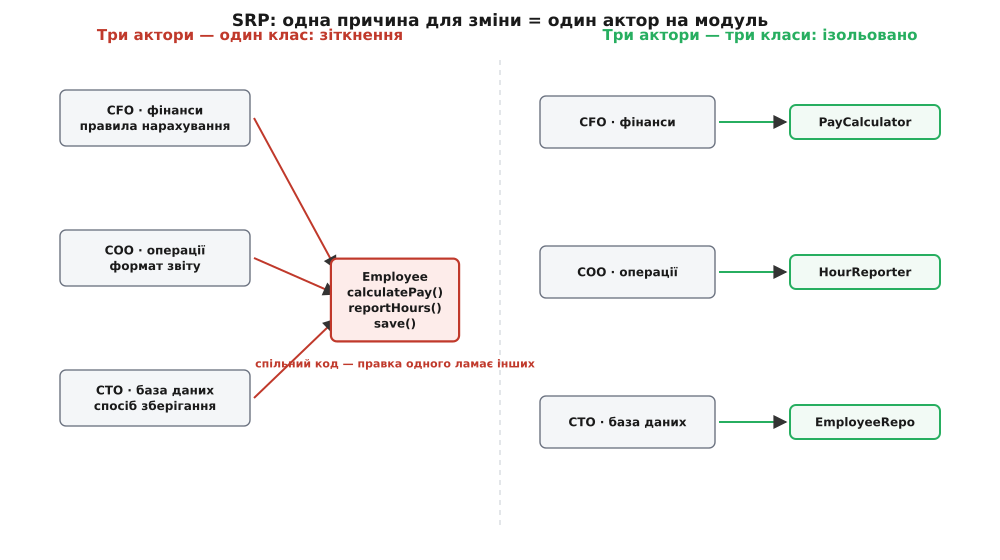
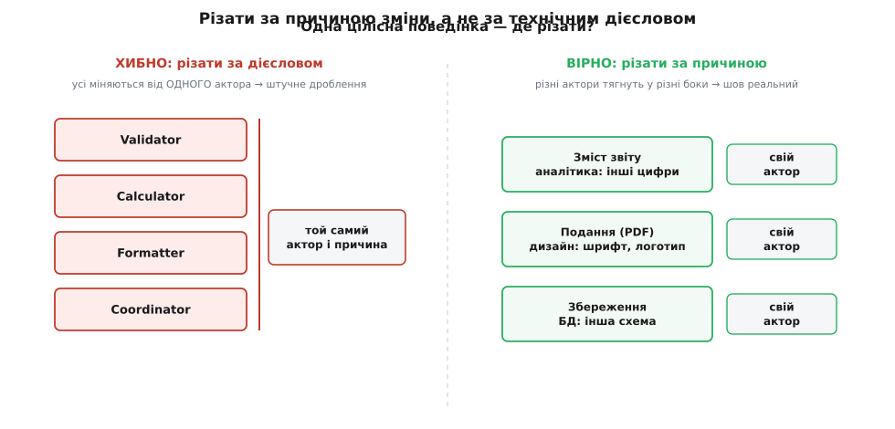

# Принцип єдиної відповідальності (SRP)

<preknowlist>
- [Зчеплення і зв'язність](topic:sf-apps/coupling-cohesion) — дві осі якості дизайну; SRP — це практичне ядро **функційної зв'язності**: усе в модулі служить одній справі.
- [Інтерфейс проти реалізації](topic:sf-apps/interface-vs-implementation) — різниця між тим, що модуль обіцяє зовні, і тим, як він це робить; поділ, на якому тримається розчеплення обов'язків.
- [YAGNI, DRY, KISS](topic:sf-apps/dry-kiss-yagni) — коли **не** розбивати наперед; SRP каже різати за причинами зміни, а не заради самого дроблення.
</preknowlist>

Назва звучить оманливо просто — «один клас, один обов'язок» — і саме через цю простоту принцип найчастіше розуміють хибно. Здається, ніби йдеться про розмір: клас має бути маленький, метод — робити «одну річ». Але спробуй провести цю межу на живому коді, і вона попливе. Метод `save()` робить одну річ? Він відкриває з'єднання, формує запит, шле його, читає відповідь, закриває з'єднання — це п'ять речей чи одна? Лінійка «одна річ» не має поділок: під будь-яким кутом можна нарізати як завгодно дрібно й довести, що кожен шматок робить «щось одне». Принцип, сформульований так, нічого не забороняє — а отже, нічого не важить.

Тому питання, з якого треба почати, не «скільки речей робить цей клас», а зовсім інше: **чому цей код доведеться колись переписати?**

## Одиниця виміру — причина для зміни

Роберт Мартин, який дав принципу назву й місце в наборі SOLID, сформулював його так: **у класу має бути рівно одна причина для зміни** ([англ. *a class should have only one reason to change*](topic:sf-apps/single-responsibility/hist-srp-origin.md)). Ось де ховається справжня одиниця виміру. Не «річ», яку робить код, а **сила, що штовхає його мінятися**. Код сам собою не псується — він лежить у файлі роками без жодного руху. Його зачіпають лише тоді, коли ззовні приходить нова вимога: бухгалтерія міняє формулу нарахування, регулятор вимагає інший звіт, команда переїжджає з однієї бази даних на іншу. Кожна така вимога — окрема причина для зміни, і в неї своє джерело.

Придивись, що це переставляє. «Одна річ» — властивість самого коду, її видно в тексті. «Одна причина для зміни» — властивість **світу навколо коду**: хто і чому попросить його переробити. Двох методів, які виглядають однаково — обидва щось форматують, обидва повертають рядок, — може стосуватися дві зовсім різні сили: один міняється, коли дизайнер хоче інший вигляд екрана, другий — коли аудитор хоче інший формат звіту. За текстом вони близнюки; за причиною зміни — чужі. SRP каже тримати їх **нарізно**, хоч код і схожий, бо їх смикатимуть у різні боки й у різний час.

> 🔧 **Навіщо це.** Це прямий важіль вартості супроводу. Коли дві незалежні причини для зміни живуть в одному класі, кожна правка від однієї сили ризикує зачепити код, від якого залежить інша. Змінив формат звіту для аудитора — і несподівано поламав розрахунок зарплати, бо вони ділили один файл і одні внутрішні поля. Розвівши причини по різних класах, ти робиш так, що одна зовнішня вимога лягає в одне місце й ніде більше не аукається. Це і є те, заради чого пишуть «чистий» код: не краса, а те, що зміну можна внести, не боячись, що вона розповзеться.

## Причина для зміни — це людина

Слово «причина» все ще розпливчасте, і сам Мартин згодом (у розборі 2014 року) уточнив його до майже фізичної точності: **причина для зміни — це група людей, що вимагає цієї зміни**. Не абстрактне «функціональність», а конкретний **актор** (англ. *actor* — той, хто діє) — відділ, роль, зацікавлена сторона, від якої надходить запит. Перефразовано: **збери докупи те, що міняється з тих самих причин; розведи те, що міняється з різних**.

Канонічний приклад, на якому це видно миттєво, — клас `Employee` з трьома методами:

:::tabs
```cpp
class Employee {
public:
    double calculatePay();   // рахує зарплату
    void   reportHours();    // формує звіт про години
    void   save();           // зберігає в базу
};
```
```python
class Employee:
    def calculate_pay(self):   # рахує зарплату
        ...
    def report_hours(self):    # формує звіт про години
        ...
    def save(self):            # зберігає в базу
        ...
```
:::

Виглядає охайно: усе про працівника — в одному класі. Але спитаймо про кожен метод не «що він робить», а **хто попросить його змінити**:

```other
calculatePay()  →  фінансовий відділ (CFO): правила нарахування
reportHours()   →  операційний відділ (COO): формат звітності для аудиту
save()          →  технічний відділ (CTO/DBA): схема бази, спосіб зберігання
```

Три методи — три різні актори, три незалежні джерела змін, зшиті в один клас. Пастка не теоретична, вона реальна й підступна. Скажімо, `calculatePay` і `reportHours` обидва рахують відпрацьовані години й тому кличуть одну спільну приховану функцію `regularHours()`. Аудитор просить CFO змінити спосіб обліку годин у **звіті** — програміст править `regularHours`, звіт стає правильним. Але цю ж функцію мовчки використовує `calculatePay`, і тепер **зарплата** порахована за новим правилом, хоча її ніхто не просив чіпати. Два актори конфліктують через код, який опинився спільним випадково. Саме таких зіткнень і уникає SRP: розділивши обов'язки за акторами, ти гарантуєш, що запит одного актора фізично не може дотягнутися до коду іншого.



*Один клас, у який тягнуть три різні сили, — місце зіткнення змін: правка від одного актора ламає код, потрібний іншому. Розведені за акторами класи роблять кожну лінію зміни ізольованою.*

Розкладемо клас за акторами — по одному класу на джерело зміни:

:::tabs
```cpp
// Кожен клас відповідає рівно одному акторові
class PayCalculator { public: double calculatePay(const Employee&); };  // CFO
class HourReporter  { public: void   reportHours(const Employee&);   };  // COO
class EmployeeRepo  { public: void   save(const Employee&);          };  // CTO/DBA
```
```python
# Кожен клас відповідає рівно одному акторові
class PayCalculator:            # CFO
    def calculate_pay(self, emp): ...

class HourReporter:             # COO
    def report_hours(self, emp): ...

class EmployeeRepo:             # CTO/DBA
    def save(self, emp): ...
```
:::

Тепер зміна правил нарахування живе тільки в `PayCalculator`, зміна формату звіту — тільки в `HourReporter`, зміна бази — тільки в `EmployeeRepo`. Спільної логіки годин, яку колись поділяли навпомацки, більше нема — якщо вона потрібна обом, її виносять у явну окрему одиницю, і кожен клас залежить від неї **свідомо**, а не випадково. Повний покроковий розбір цього рефакторингу з робочим кодом, спільною залежністю й пасткою повторного склеювання винесено в окремий [розбір-проєкт](topic:sf-apps/single-responsibility/proj-employee-split.md).

## Чому «одна причина», а не «один метод»

Тепер видно, чому наївне читання «клас робить одну річ» збиває з курсу, а «одна причина для зміни» — ні. Клас `EmployeeRepo` вміє і `save`, і `load`, і `delete` — за наївним рахунком це вже три речі, ділити далі. Але всіх трьох стосується **один** актор (команда бази даних) і **одна** причина для зміни (змінилася схема чи СУБД). Розбивати їх — робити гірше: ти розкидаєш по трьох файлах те, що завжди міняється разом, і будь-яка правка схеми тепер тягне тебе в усі три. Це та сама помилка, лише дзеркальна: замість забагато в одному класі — забагато класів на одну причину.

SRP не про кількість методів і не про рядки. Один клас може мати десяток методів і чесно тримати одну відповідальність, якщо всі десять служать одному акторові й міняються з одного джерела. Інший клас із двома методами вже порушує принцип, якщо ці два методи смикають дві незалежні сили. Тому правильне запитання завжди про **вісь зміни**: скільки різних причин можуть змусити цей код переписати. Одна — принцип дотримано. Дві й більше — тут шов, по якому колись боляче розірветься, і краще розвести зараз.

Ця ідея — не винахід на порожньому місці. Вона виросла з давнішого поняття **зв'язності** (англ. *cohesion*): наскільки все в модулі рідне одне одному. SRP — це, по суті, найгостріше формулювання найвищого щабля зв'язності: модуль тримається купи не тому, що шматки схожі чи виконуються поряд, а тому, що вони служать **одній справі одного замовника**. Тому SRP і [зв'язність](topic:sf-apps/coupling-cohesion) — про те саме, лише зайдені з різних боків: зв'язність описує **стан** («усе тут рідне?»), а SRP дає **критерій різання** («рідне — те, що міняється разом»).

## Де проходить справжня межа

Найтонше в застосуванні SRP — не розколоти те, що виглядає різним, а насправді єдине, і не злити те, що виглядає схожим, а насправді роздільне. Обидві помилки трапляються постійно, і обидві коштують.

Розглянь звичний клас, що готує звіт:

:::tabs
```cpp
class Report {
public:
    std::string content();   // ЩО в звіті: які дані, як пораховані
    void        printPdf();  // ЯК показати: верстка, шрифти, PDF
};
```
```python
class Report:
    def content(self) -> str:   # ЩО в звіті: які дані, як пораховані
        ...
    def print_pdf(self):        # ЯК показати: верстка, шрифти, PDF
        ...
```
:::

Тут два різні актори сховалися під одним словом «звіт». `content()` міняється, коли бізнес хоче іншого **змісту** — інші цифри, інша логіка підрахунку; за це відповідає фінансова чи аналітична сторона. `printPdf()` міняється, коли хочуть інший **вигляд** — інший шрифт, логотип, поля сторінки; за це відповідає дизайн чи маркетинг. Дві незалежні сили. Коли маркетинг просить пересунути логотип, чіпати клас, що містить логіку підрахунку виторгу, — це напрошуватися на випадкову поломку цифр. Тому зміст і подання розводять: один клас знає, **що** в звіті, інший — **як** його показати. Ту саму лінію проводить [OCP](topic:sf-apps/open-closed), коли треба додати ще й формат HTML чи CSV, не переписуючи наявний.

Але той самий інструмент легко обернути на шкоду, якщо забути, що причина зміни — про **людей**, а не про технічні дієслова. Класичний перегин — так звана «анемічна» розбивка, коли беруть просту, цілісну поведінку й ріжуть її на `Validator`, `Calculator`, `Formatter`, `Coordinator` лише тому, що це різні дієслова. Але якщо всі чотири міняються завжди разом, від одного й того ж актора з однієї й тієї ж причини, — це **не** чотири відповідальності. Це одна відповідальність, штучно розмазана по чотирьох файлах, і тепер найпростіша зміна вимагає стрибати між усіма чотирма й тримати їхню взаємодію в голові. Порушено не букву, а мету: SRP мав **зменшити** те, що доводиться тримати в голові при зміні, а надмірне дроблення його **збільшило**.



*Різати за дієсловом (ліворуч) — дробити те, що завжди міняється разом від одного актора: чотири файли на одну причину. Різати за причиною зміни (праворуч) — межа лягає лише там, де різні актори справді тягнуть у різні боки.*

Ось де SRP впирається в [YAGNI](topic:sf-apps/dry-kiss-yagni) і вимагає чесності. Розбивати варто там, де дві причини для зміни **справді існують** і вже тягнуть код у різні боки, — а не там, де вони гіпотетичні. Розводити код заради двох акторів, з яких другий поки що уявний, — це платити зчепленням і складністю за гнучкість, якою, можливо, ніхто не скористається. Тому практичне правило звучить не «ділити завжди», а: **тримай разом, поки не побачив, що дві сили тягнуть у різні боки, — тоді розводь по цьому шву**.

## Той самий принцип на всіх поверхах

Хоч у назві стоїть «клас», сила SRP у тому, що вісь «одна причина для зміни» різатиме код на будь-якому масштабі — і скрізь працює однаково.

На рівні **функції** SRP каже: функція, що і рахує, і друкує результат, має дві причини мінятися — зміна розрахунку й зміна виводу. Розділи — і кожну можна міняти, тестувати й перевикористовувати окремо. На рівні **класу** — той приклад із `Employee`. На рівні **модуля чи пакета** SRP стає межею: код, що обслуговує одну бізнес-здатність, лежить в одному модулі, і той модуль має одну причину для перескладання. А на найбільшому масштабі та сама вісь визначає межі [обмежених контекстів](topic:sf-apps/bounded-context) і, зрештою, розбиття системи на служби — кожна служба володіє однією зоною відповідальності, щоб її можна було міняти й розгортати, не смикаючи сусідів. Це той самий принцип: знайти вісь, уздовж якої приходить зміна, і провести межу впоперек неї, а не абияк.

Через цю наскрізність SRP і стоїть першою літерою в SOLID — не тому, що найважливіший, а тому, що задає **спосіб думати**, на який спираються решта. [OCP](topic:sf-apps/open-closed) каже, як додавати нове, не ламаючи старе; [принцип розділення інтерфейсів](topic:sf-apps/interface-segregation) — це SRP, застосований до інтерфейсів (клієнт не має залежати від методів, потрібних іншому клієнтові); [інверсія залежностей](topic:sf-apps/dependency-inversion) розчіпляє напрямок, у якому одна відповідальність спирається на іншу. Усі вони — про те, як провести й утримати межі між відповідальностями, які першою знаходить SRP.

Тому насамкінець варто повернутися до того, з чого почали. SRP — не про те, щоб класи були маленькі, і не про кількість методів. Він про єдину, дуже практичну річ: **код доведеться міняти, і треба, щоб кожна зовнішня вимога зачіпала рівно одне місце**. Знайди силу, що штовхає код мінятися, дай їй ім'я — часто це просто відділ чи роль, — і проведи межу так, щоб з одного боку від неї жило все, що ця сила смикає, а з іншого — те, до чого вона не має діла. Зробиш це чесно — і завтрашня зміна впаде туди, куди має, а не розповзеться по половині системи.
