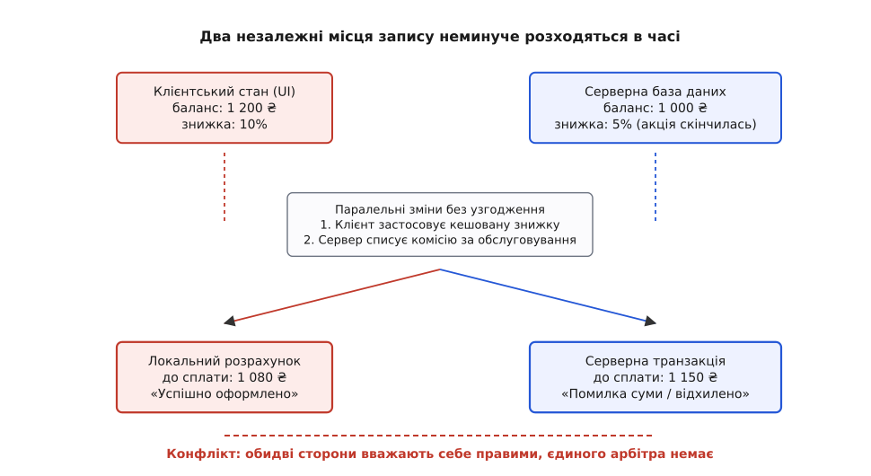
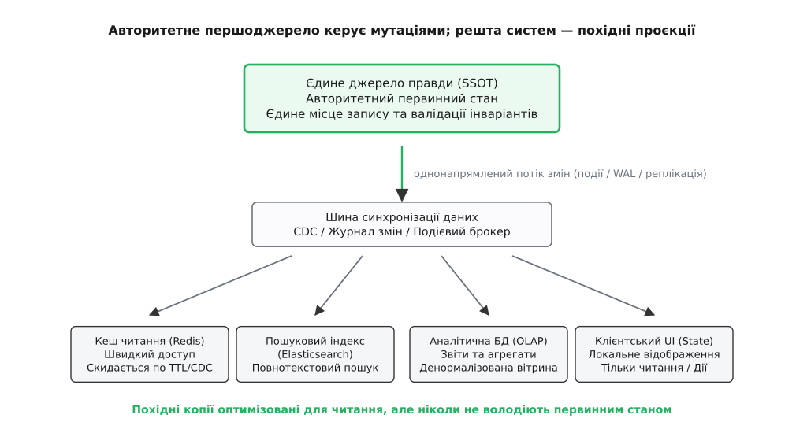
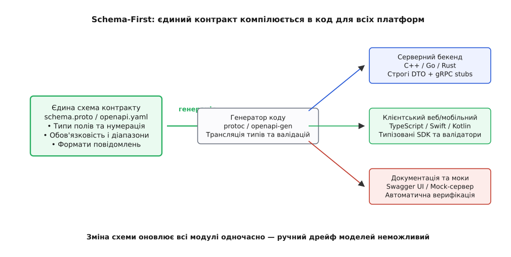
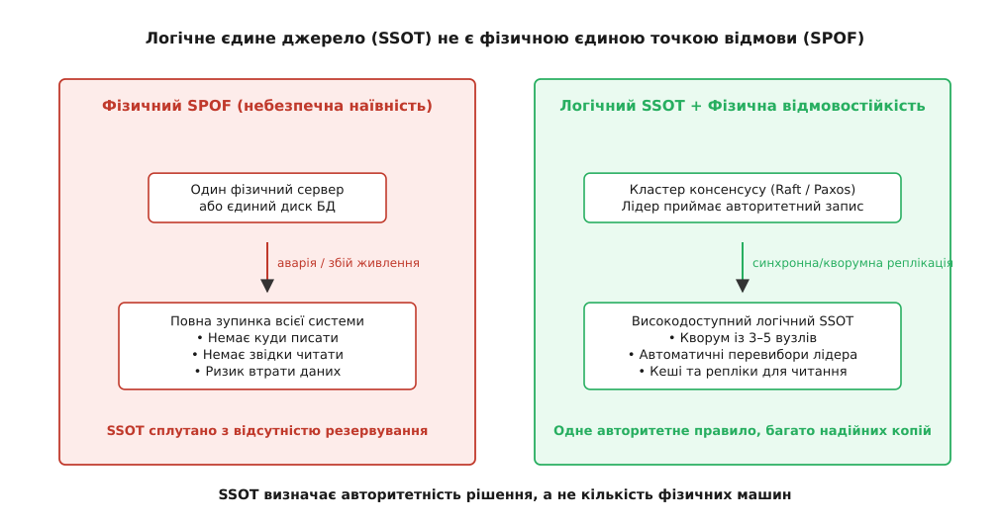

# Єдине джерело правди

<preknowlist>
- [Зчеплення і зв'язність](root:sf-apps/coupling-cohesion) — як залежності між модулями впливають на стійкість системи до змін.
- [Інкапсуляція](root:sf-apps/encapsulation) — приховування внутрішнього стану за контрактом доступу.
- [Інваріант програми](root:sf-apps/invariants) — умова цілісності, що має залишатися істинною впродовж усього життєвого циклу даних.
- [DTO](root:sf-apps/dto) — передача структурованих даних через межі підсистем та мережу.
- [Однонапрямлений потік даних](root:sf-apps/unidirectional-data-flow) — поширення оновлень від авторитетного стану до похідних подань.
</preknowlist>

## Розкол балансу між двома вікнами

Клієнт інтернет-магазину має на рахунку 1 200 ₴ і додає в кошик товар вартістю 1 000 ₴. Веб-інтерфейс у браузері застосовує локальне правило лояльності: обчислює знижку 1 000 ₴ - 10% = 900 ₴, одразу виводить на екран залишок 300 ₴ і надсилає запит на оформлення замовлення. У ту саму секунду фонова служба підписок на сервері списує щомісячну плату за користування сервісом у розмірі 250 ₴, і в серверній базі даних баланс зменшується: 1 200 - 250 = 950 ₴.

Коли замовлення доходить до черги обробки, серверний модуль тарифів застосовує власну логіку: акційна знижка 10% діяла до опівночі, тому зараз діє базова ставка 5%, і товар коштує 950 ₴. Сервер списує залишок: 950 - 950 = 0 ₴, замовлення успішно проводиться, але на рахунку клієнта залишається рівно нуль.

У цей момент у системі виникає розкол. Веб-сторінка покупця показує залишок 300 ₴. Мобільний застосунок, який відкриває той самий клієнт зі смартфона, прочитав локальну базу даних SQLite, оновлену п'ять хвилин тому, і стверджує, що на рахунку 1 200 ₴. Серверна база даних зберігає 0 ₴. А поштовий сервіс надсилає квитанцію на суму 900 ₴, оскільки прочитав знімок кошика, переданий браузером під час першого кліку.

Чотири підсистеми одного програмного комплексу оперують чотирма різними значеннями однієї сутності. Жоден вузол не припустився помилки у власних обчисленнях — кожен чесно виконав закладений у нього алгоритм над тими даними, які мав у своєму розпорядженні. Помилка полягає в самій організації системи: право визначати дійсний стан речей було розпорошене між кількома незалежними модулями.

*Два незалежні місця запису неминуче розходяться в часі. Клієнтський розрахунок і серверна транзакція діють на основі власних копій даних, через що система потрапляє в стан розколу правди.*

Коли будь-який факт або бізнес-правило зберігається чи обчислюється у двох місцях одночасно, вони неминуче розійдуться. Питання полягає лише в тому, коли саме це станеться — під час мережевої затримки, чергового оновлення коду клієнта чи паралельного запису.

## Механізм розходження: чому дві копії завжди починають брехати

Дублювання даних у програмах майже ніколи не з'являється через недбалість. Його майже завжди вводять із добрими намірами — заради швидкодії, автономності або зручності розробки.

Перша причина — оптимізація швидкості доступу. Звернення по мережі до центральної бази даних займає від десятків до сотень мілісекунд. Читання з локальної пам'яті процесу або з кешу на тому самому сервері триває мікросекунди. Інженер створює локальну копію запису, сподіваючись інвалідувати її пізніше.

Друга причина — чутливість інтерфейсу користувача. Мобільний застосунок не може чекати відповіді сервера під час кожного натискання кнопки: екран повинен реагувати миттєво, підтримувати роботу в режимі оффлайн та плавно оновлювати анімації. Для цього клієнтський застосунок створює власну локальну модель світу, розраховує знижки та валідує поля вводу безпосередньо в браузері чи на телефоні.

Третя причина — незалежність команд і мікросервісна архітектура. Команда білінгу створює свій об'єкт користувача, команда доставки — свій, команда каталогу товарів — денормалізований кеш із цінами та залишками на складі. Кожен сервіс прагне бути автономним і зберігає у власній базі даних потрібні поля сусідніх доменів.

Четверта причина — пастка подвійного запису (*Dual-Write Hazard*). Коли бізнес-операція повинна одночасно оновити реляційну базу даних і надіслати подію в брокер повідомлень Kafka або оновити запис у кеші Redis, інженер пише два послідовні виклики: db.save(user) та kafka.publish(event). Якщо між цими двома рядками сервер перезавантажиться, відмовив драйвер мережі або вичерпався пул з'єднань, база даних отримає нове значення, а черга подій — ні. Зовнішні споживачі назавжди залишаться зі старими даними.

Щойно з'являються дві копії одного значення, у гру вступають фундаментальні закони розподілених систем:

1. **Мережева асинхронність і затримка поширення.** Зміна, внесена в першу копію, потрапляє в другу через деякий час Δt. Протягом цього вікна будь-який читач другої копії бачить застарілі дані й приймає рішення на основі ілюзії.
2. **Часткові відмови та збої транспорту.** Повідомлення про оновлення може загубитися в черзі, впасти через тайм-аут мережі або бути відхиленим через перезавантаження вузла-отримувача. Якщо немає механізму гарантованої узгодженості, дві копії залишаються розсинхронізованими назавжди.
3. **Дрейф логіки валідації (software skew).** Якщо бізнес-правило записане двічі — наприклад, перевірка коректності податкового номера реалізована на TypeScript у веб-клієнті та на C++ у ядрі бекенду, — вони гарантовано розійдуться під час наступного релізу. Клієнтської версії ще не оновили в магазині застосунків, а сервер уже запровадив нові обмеження довжини поля.
4. **Конкурентні мутації (split-brain).** Якщо запис дозволено виконувати в обидві копії без блокування або алгоритму консенсусу, два паралельні запити одночасно змінять обидві сторони. Спроба об'єднати результати пізніше перетворюється на нерозв'язний конфлікт: кожна сторона вважає свою версію канонічною.

Якщо система допускає існування двох незалежних джерел інформації про один і той самий факт, вона не має жодного способу дізнатися, яке з них є істинним.

## Принцип SSOT: одне авторитетне першоджерело

Принцип єдиного джерела правди (*Single Source of Truth*, скорочено *SSOT*) вимагає, щоб для кожного елемента даних, стану сутності або бізнес-правила в системі існувало **рівно одне безапеляційне першоджерело**, яке володіє монопольним правом на зміну та визначення істинного значення цього елемента.

Слово «авторитетне» (англ. *authoritative*) тут є ключовим. Це не просто місце, де дані лежать фізично. Це архітектурний арбітр, який вирішує, чи є запропонована мутація валідною, і фіксує перехід системи з одного стану в інший.

Принцип SSOT базується на трьох непорушних правилах:

1. **Єдине володіння (Single Ownership).** У будь-якої сутності є рівно один компонент-власник. Жодна інша частина системи не має права змінювати стан сутності в обхід її власника.
2. **Єдиний маршрут запису (Single Write Path).** Усі запити на зміну спрямовуються виключно до авторитетного джерела. Будь-які спроби локального виправлення вважаються лише пропозиціями (намірами), які набувають статусу факту лише після підтвердження першоджерелом.
3. **Однозначне походження похідних даних (Traceability of Derivation).** Будь-яке вторинне значення, кеш, індекс чи екранна форма є детермінованою проєкцією першоджерела. Якщо вторинне значення розходиться з першоджерелом, помилковим завжди визнається вторинне значення.

Історично ця вимога виросла з реляційної нормалізації баз даних Едгара Кодда та принципу DRY у програмуванні, де детальний аналіз еволюції концепції розібрано в історичному нарисі [як реляційна нормалізація Кодда та принцип DRY сформували сучасний підхід до єдиного джерела](root:sf-apps/single-source-of-truth/hist-codd-to-dry.md).

SSOT усуває неоднозначність за визначенням: у системі більше немає суперечок про те, чий стан є правильним. Правильним є той стан, який зафіксований в авторитетному джерелі.

## Первинний стан проти похідних проєкцій

Найбільша помилка під час впровадження SSOT — це спроба заборонити будь-яке копіювання даних або кешування. Спроба змусити кожен компонент читати виключно одну центральну таблицю реляційної бази даних призводить до перевантаження диска, гігантських затримок і повної деградації системи під навантаженням.

SSOT не забороняє існування кількох копій інформації. Він встановлює строгу ієрархію між **первинним (авторитетним) станом** та **похідними проєкціями**.

`
Первинний стан (SSOT) ──[ Однонапрямлений потік подій / CDC ]──► Похідні проєкції
(Єдине право запису)                                             (Тільки читання)
`

Первинний стан (*Authoritative State*) — це мінімальний, нормалізований набір даних, необхідний для однозначного відновлення повної картини системи. Він володіє такими властивостями:
- Зберігається в надійному сховищі з гарантіями транзакційності (ACID або консенсусний журнал).
- Перевіряє всі бізнес-інваріанти перед фіксацією мутації.
- Є джерелом сповіщень про зміни для всього зовнішнього світу.

Похідний стан (*Derived State / Projections*) — це оптимізовані для читання представлення первинного стану:
- **Кеші швидкого доступу** (Redis, Memcached, локальні LRU-кеші в оперативній пам'яті).
- **Пошукові індекси** (Elasticsearch, Meilisearch), де дані денормалізовані для повнотекстового пошуку.
- **Аналітичні вітрини даних** (OLAP-сховища, ClickHouse, BigQuery), згруповані за часовими інтервалами.
- **Моделі подання в інтерфейсі (UI ViewModels)**, які перетворюють числові коди на локалізовані рядки та кольори кнопок.

*Авторитетне першоджерело керує мутаціями й валідує інваріанти, а всі інші вузли отримують зміни однонапрямленим потоком подій і слугують виключно оптимізованими вітринами для читання.*

Золоте правило архітектури: **похідні проєкції є суворо односпрямованими та доступними лише для читання**. Жоден клієнт не має права писати безпосередньо в Redis або Elasticsearch, вважаючи їх самостійними базами даних. Похідна проєкція формується автоматично внаслідок слухання журналу змін (*Change Data Capture, CDC*) або подій від першоджерела.

Для безпечного поширення змін без ризику подвійного запису застосовують патерн **Transactional Outbox (транзакційна вихідна скринька)**:
1. Бізнес-мутація та запис події в службову таблицю outbox_events виконуються в межах **однієї локальної транзакції бази даних**.
2. Якщо транзакція відкотилася — не збереглися ні дані, ні подія.
3. Окремий фоновий релей (Debezium або опитувальний процес) читає журнал транзакцій бази даних (*Write-Ahead Log, WAL*) і гарантовано доставляє подію в брокер повідомлень.
4. Похідні проєкції оновлюються асинхронно, знаючи, що першоджерело зафіксувало зміну надійно.

Якщо кеш у Redis зламався або десинхронізувався, його можна повністю видалити: система не втратить жодного факту, оскільки кеш за лічені секунди регенерується з первинного джерела правди.

## Schema-First: єдиний контракт між сервером, клієнтом і базою

У розподілених сервісах найчастіше джерело розсинхронізації — це людський фактор під час передачі структур даних через межі процесів і мов програмування.

Традиційний підхід «код-перш-за-все» (*Code-First*) виглядає так: бекенд-інженер пише клас мовою C++ або Java, серіалізує його в JSON і відправляє по HTTP. Фронтенд-розробник дивиться на відповідь через мережевий інспектор браузера і руками створює відповідний інтерфейс на TypeScript. Мобільний розробник на Swift робить те саме для iOS. Через місяць бекенд-інженер перейменовує поле user_id на account_id або робить обов'язкове раніше поле опціональним. Фронтенд ламається під час виконання з помилкою TypeError: cannot read property of undefined, а компілятор мовчав, бо типи були продубльовані вручну.

Парадигма **Schema-First** робить файл опису контракту єдиним джерелом правди про інтерфейс взаємодії.

Замість написання коду вручну, розробники спершу фіксують схему у формалізованій мові опису інтерфейсів (*IDL — Interface Definition Language*):
- **Protocol Buffers (.proto)** — для високопродуктивних бінарних gRPC-викликів.
- **OpenAPI (openapi.yaml)** — для публічних HTTP REST API.
- **GraphQL Schema (schema.graphql)** — для гнучких клієнтських запитів.

*Єдиний файл схеми транслюється генератором у строгі типи для всіх цільових мов, що унеможливлює розсинхронізацію моделей даних між сервером і клієнтом.*

Схема підключається до автоматизованого конвеєра компіляції (protoc, openapi-generator, graphql-codegen). Генератор коду створює з єдиного файла схеми:
1. Серверні структури даних (C++, Go, Rust, Java) із методами парсингу та серіалізації.
2. Клієнтські типи (TypeScript, Swift, Kotlin) із захистом на етапі статичної типізації.
3. Модулі валідації діапазонів значень, регулярних виразів та обов'язковості полів.
4. Документацію API, яка завжди на 100% відповідає дійсному стану коду, бо генерується з того самого джерела.

Для запобігання несумісним змінам схеми використовують централізовані реєстри схем (*Schema Registry*, наприклад Confluent Schema Registry або Buf Schema Registry). Реєстр контролює правила еволюції контракту:
- **Зворотна сумісність (Backward Compatibility):** новий сервер зобов'язаний коректно парсити повідомлення, сформовані старими клієнтами.
- **Пряма сумісність (Forward Compatibility):** старий сервер не повинен падати, якщо отримує повідомлення від оновленого клієнта з новими невідомими полями.
- **Заборона перепризначення числових тегів:** у Protobuf числовий ідентифікатор поля фіксується назавжди. Якщо поле застаріло, його позначають як 
eserved, а не віддають іншому типу.

Практичну реалізацію такого підходу, механізми генерації коду для C++ та TypeScript, а також автоматичний захист від дрейфу моделей у системі неперервної інтеграції наведено у вставці [як налаштувати Schema-First конвеєр із запобіганням дрейфу контрактів на етапі збірки](root:sf-apps/single-source-of-truth/proj-schema-codegen.md).

Завдяки Schema-First розсинхронізація клієнта й сервера стає неможливою: будь-яка невідповідність викликає помилку компіляції ще до того, як код потрапить у репозиторій.

## Управління станом у користувацькому інтерфейсі: єдине сховище (Single Store)

Проблема розсинхронізації виникає не лише між комп'ютерами по мережі, а й усередині одного процесу — зокрема, у структурі інтерфейсу користувача.

У ранніх графічних інтерфейсах кожен віджет або компонент володів власним шматочком стану: кнопка кошика зберігала лічильник покупок, список товарів зберігав прапорці вибору, а бічна панель — підсумкову вартість. Зміна в одному віджеті вимагала надсилання подій усім суміжним віджетам. Коли компонентів ставало понад сотню, граф оновлень перетворювався на хаотичну павутину зворотних викликів. З'являлися типові помилки: товар із кошика видалено, у списку його немає, але у шапці сайту біля іконки кошика все ще горить цифра 1.

Розв'язанням цієї проблеми стала архітектура єдиного сховища (*Single Store*), популяризована мовою Elm та бібліотекою Redux:

`
[ Подія / Дія ] ──► [ Редюсер / Чиста функція ] ──► [ Єдине сховище (Store) ] ──► [ Подання View = f(State) ]
`

Принципи організації UI за схемою SSOT:
1. **Єдине дерево стану.** Увесь динамічний стан програми зберігається в одному централізованому об'єкті (Store). Жоден візуальний компонент не має власного ізольованого стану бізнес-рівня.
2. **Стан доступний лише для читання.** Інтерфейс ніколи не мутує поля об'єкта напряму (state.user.balance = 500 суворо заборонено).
3. **Зміни через чисті функції (Reducers).** Єдиний спосіб змінити стан — відправити повідомлення (*Action / Event*), яке описує, що саме відбулося. Чиста функція переходу приймає поточний стан і дію, повертаючи абсолютно новий об'єкт стану.
4. **Подання як чиста проєкція.** Візуальний інтерфейс є чистою функцією стану: View = f(State). Щойно сховище оновлюється, усі залежні компоненти перераховуються з єдиного авторитетного джерела.

Розкол стану всередині вікна стає неможливим: віджет шапки та сторінка кошика читають одне й те саме поле state.cart.items.length. Якщо значення змінилося в сховищі, воно одночасно змінюється в усіх точках екрана за один кадр рендерингу.

## Event Sourcing: події як абсолютна правда про минуле

У класичних реляційних архітектурах стан зберігається методом перезапису на місці (*CRUD — Create, Read, Update, Delete*). Якщо користувач поповнив рахунок на 500 ₴, програма виконує команду UPDATE accounts SET balance = 1500 WHERE id = 42.

Операція UPDATE безповоротно знищує попередній стан. Вона залишає системі лише кінцевий результат, стираючи історію того, як цей результат було отримано. Якщо через годину баланс виявиться неправильним, база даних не зможе відповісти, чому саме це сталося: чи це був подвійний клік користувача, чи помилка перерахунку курсу, чи збій транзакції.

Патерн **Event Sourcing (подієве походження стану)** підносить концепцію SSOT на найвищий рівень строгості.

В Event Sourcing первинним джерелом правди є не поточний стан сутності, а **незмінний, хронологічний журнал подій фактів минулого (*Append-Only Event Log*)**:
- Події фіксують факти, які вже сталися: AccountCreated, MoneyDeposited, OrderPlaced, FeeDeducted.
- Журнал подій ніколи не змінюється і не видаляється. У ньому дозволено лише операцію дописування в кінець (append).

Поточний стан сутності не є першоджерелом — він є **похідною функцією згортки (лівого згортання, *fold / reduce*) над історією подій**:

`
Поточний стан = fold(Список подій, Початковий стан)
`

Для банківського рахунку:
`
Баланс = 0 (початок)
+ Подія 1: AccountOpened(початковий = 0 ₴)      => Баланс: 0 ₴
+ Подія 2: MoneyDeposited(сума = 1000 ₴)        => Баланс: 1000 ₴
+ Подія 3: FeeDeducted(сума = 50 ₴)             => Баланс: 950 ₴
+ Подія 4: OrderPaid(сума = 200 ₴)              => Баланс: 750 ₴
`

Переваги Event Sourcing як абсолютного SSOT:
- **Абсолютний аудит і нульова втрата інформації.** Жоден факт минулого не втрачається. Будь-який фінансовий чи юридичний аудит має математичний доказ кожного переходу стану.
- **Подорож у часі (Time Travel Debugging).** Щоб дізнатися, у якому стані була система 12 березня о 14:22, достатньо зупинити згортку подій на мітці цього часу.
- **Гнучка регенерація моделей.** Якщо через два роки бізнесу знадобиться нова аналітична вітрина (наприклад, графік середньої активності клієнтів за категоріями витрат), її не треба було збирати заздалегідь: новий обробник просто читає весь журнал подій від початку створення системи та будує нову похідну таблицю з нуля.

В Event Sourcing журнал подій є єдиною непорушною правдою, а поточні баланси, профілі та звіти — це тимчасові, легко відновлювані проєкції.

## SSOT проти SPOF: чому логічна єдність не означає фізичну вразливість

Поширене хибне уявлення про SSOT полягає в ототожненні логічного принципу з фізичною реалізацією. Інженери часто побоюються: «Якщо в нас є єдине джерело правди, то це єдина точка відмови (*Single Point of Failure, SPOF*). Якщо сервер із цим джерелом згорить, ляже весь бізнес».

Це небезпечна підміна понять. **SSOT — це логічна властивість архітектури (хто приймає авторитетні рішення), а SPOF — це фізична вразливість інфраструктури (чи є компонент без резервування).**

*Логічне єдине джерело (SSOT) визначає, хто ухвалює авторитетне рішення, тоді як фізична реплікація та консенсус усувають єдину точку відмови (SPOF).*

Логічне єдине джерело правди успішно реалізується поверх фізично розподіленої, високонадійної інфраструктури:

1. **Алгоритми розподіленого консенсусу (Raft, Paxos).** Кластер із 3 або 5 серверів (наприклад, у сховищах etcd, ZooKeeper, CockroachDB) виступає єдиним логічним джерелом правди. Запис вважається здійсненим, коли його підтвердив кворум вузлів. Якщо фізичний лідер виходить із ладу, кластер за частки секунди обирає нового лідера без втрати даних та без розриву логічного SSOT.
2. **Синхронна та напівсинхронна реплікація.** База даних може мати один логічний вузол запису (*Primary / Leader*) і десятки реплік читання (*Read Replicas*), рознесених по різних дата-центрах. Першоджерело правди — одне (лідер), але фізичних машин — десятки.
3. **Географічний розподіл за ключем шардингу.** Єдине джерело правди не зобов'язане зберігати абсолютно всі дані світу на одній машині. Система може використовувати шардування: для користувача A авторитетним джерелом є шард №1 у Франкфурті, а для користувача B — шард №2 у Варшаві. Головне, щоб для конкретного запису A існував лише один авторизований шард.

SSOT гарантує, що в системи немає шизофренії у визначенні істини, а фізична реплікація гарантує, що втрата заліза не зупинить роботу сервісу.

## Компроміси: денормалізація, узгодженість у кінцевому підсумку та ціна синхронізації

Побудова ідеального, миттєво узгодженого SSOT має свою ціну. У розподілених системах діє теорема CAP: під час мережевого розділення неможливо одночасно отримати абсолютну узгодженість (*Consistency*) і стовідсоткову доступність (*Availability*).

Архітектор щодня стикається з трьома основними компромісами єдиного джерела правди:

### 1. Затримка координації проти локальної швидкості
Якщо кожна операція читання вимагає суворого звернення до центрального джерела правди з блокуванням, продуктивність системи падає пропорційно до кількості користувачів.

Тому системи йдуть на компроміс **узгодженості в кінцевому підсумку (*Eventual Consistency*)**:
- Запис відбувається в SSOT.
- Похідні кеші та індекси оновлюються асинхронно через черги повідомлень.
- Клієнти погоджуються читати дані із затримкою в кілька десятків мілісекунд заради колосального приросту пропускної здатності.

### 2. Контрольована денормалізація
У високонавантажених базах даних сувора нормалізація до третьої нормальної форми (3NF), яка вимагає десяти операцій JOIN для кожного запиту сторінки, стає надто дорогою.

Інженери свідомо застосовують денормалізацію: дублюють ім'я автора в таблицю коментарів. Щоб це не порушило SSOT, вводиться суворе правило:
- Таблиця Users залишається єдиним джерелом правди про ім'я користувача.
- Поле author_name у таблиці Comments вважається тимчасовою оптимізаційною копією.
- Якщо користувач змінює ім'я, фоновий процес або тригер CDC оновлює всі коментарі. Якщо трапляється збій, фонова звірка (*Reconciliation Loop*) знаходить розбіжності за первинним ідентифікатором і виправляє їх.

### 3. Автономні локальні мутації та CRDT
У системах спільного редагування (Google Docs, Figma) або оффлайн-застосунках неможливо чекати підтвердження сервера на кожен введений символ.

У таких доменах застосовують **конфліктно-вільні репліковані типи даних (*CRDT — Conflict-Free Replicated Data Types*)**:
- Кожен пристрій має локальну копію структури даних і миттєво застосовує правки.
- Операції побудовані так, що вони є математично комутативними та асоціативними: порядок отримання змін не впливає на кінцевий результат.
- Об'єднання копій відбувається детерміновано за чіткими математичними правилами без необхідності центрального арбітра в реальному часі.

> 🔧 **Навіщо це.** Щоб перевірити власну систему на наявність прихованих порушень SSOT, виконайте простий аудит: знайдіть у кодовій базі будь-яке бізнес-поле (наприклад, статус замовлення OrderStatus) і порахуйте, у скількох місцях воно оголошене, збережене або валідується. Якщо статус перевіряється в контролері, у службі замовлень, у тригері бази даних, у JWT-токені та у фронтенд-роутері — перед вами п'ять джерел правди. Щойно бізнес додасть новий проміжний статус AwaitingPaymentConfirmation, два з п'яти місць забудуть оновити, і система почне відхиляти коректні замовлення. Усунення дублювання та винесення правила в єдиний авторитетний модуль або контракт схеми скорочує час налагодження дефектів у рази.

## Підсумок: дисципліна правди в коді

Архітектурна якість системи визначається не кількістю використаних бібліотек чи патернів, а ясністю відповіді на питання: **хто в цій системі має право оголосити факт істинним?**

Якщо на це питання є кілька різних відповідей залежно від того, яку сторінку відкрив користувач або який мікросервіс обробив запит, — система перебуває в стані хронічного розпаду даних.

Єдине джерело правди усуває хаос простим розділенням ролей:
- Одне авторитетне місце ухвалює рішення, перевіряє інваріанти та записує зміни.
- Усі інші компоненти системи є слухачами й читачами детермінованих проєкцій.
- Контракти між підсистемами диктуються єдиними схемами, а не синхронізуються вручну.

Дотримання принципу SSOT вимагає інженерної дисципліни на етапі проектування, але натомість дає систему, стан якої є передбачуваним, прозорим для аудиту та стійким до неминучих змін вимог.
