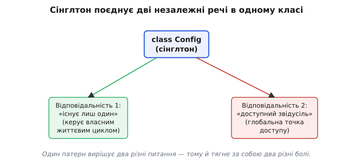
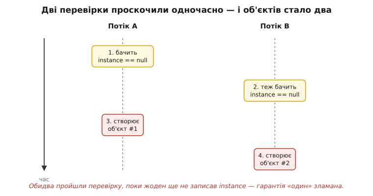

# Сінглтон

<preknowlist>
- [Що таке патерн](root:sf-apps/what-is-pattern) — патерн проєктування як названий типовий розв'язок повторюваної задачі дизайну, а не готовий код.
- [Глобальний стан](root:sf-apps/global-state) — дані, доступні звідусіль у програмі, і чому такий доступ ускладнює розуміння й тестування коду.
- [Інкапсуляція](root:sf-apps/encapsulation) — як клас ховає своє нутро за конструктором і методами й керує тим, кого впускати всередину.
- [Впровадження залежностей](root:sf-apps/dependency-injection) — коли об'єкт отримує потрібне ззовні (через конструктор), а не добуває сам; головна альтернатива сінглтону.
- [Потокова безпека](root:sf-tasks/thread-safety) — що стається, коли кілька потоків торкаються одних даних одночасно, і чому без узгодження виходить гонитва.
</preknowlist>

Уяви, що в програмі має бути рівно один об'єкт. Один пул з'єднань до бази. Один реєстр налаштувань, прочитаний зі старту. Один лічильник, який видає наскрізні номери. Два таких об'єкти — це вже не «дві копії однієї речі», а дві різні правди про одне: два пули розчепірять ліміт з'єднань удвічі, два реєстри розійдуться, два лічильники видадуть один і той самий номер двом клієнтам. Тому логіка проста: створити його один раз і більше ніколи не створювати.

Сінглтон (англ. *single* — єдиний; від латинського *singulus* — одиничний) — це патерн, який робить саме це: **гарантує, що клас має найбільше один екземпляр, і дає до нього спільну точку доступу**. Так його й записали у своїй книжці четверо авторів, яких програмісти прозвали «бандою чотирьох» ([як народився сінглтон і чому один з авторів потім хотів його викреслити](root:sf-apps/singleton/hist-singleton-gof.md)).

Звучить невинно. Насправді за цим коротким описом ховається одна з найспірніших ідей об'єктного дизайну — настільки, що частина досвідчених інженерів уважає її радше застереженням, ніж рецептом. Розберімося чесно: як сінглтон роблять, чому він так вабить, і де саме він тихо труїть архітектуру — щоб ти впізнавав і те, коли він доречний, і те, коли краще втекти.

## Дві обіцянки в одному реченні

Придивися до означення ще раз, бо в ньому склеєні **дві зовсім різні речі**, і майже вся біда сінглтона — саме з цієї склейки.

Перша обіцянка — про **кількість**: екземпляр рівно один. Це питання життєвого циклу: хто, коли і скільки разів створює об'єкт. Цілком розумна вимога — бувають ресурси, яких за природою один.

Друга обіцянка — про **доступ**: до цього одного можна дотягтися звідусіль, з будь-якого місця коду, без того, щоб хтось тобі його передав. Це вже питання видимості, і воно нічого спільного з «одним» не має. Можна мати єдиний об'єкт, який акуратно передають з рук у руки. Можна мати глобально доступний об'єкт, якого існує сотня. «Один» і «звідусіль» — незалежні.


*Один клас бере на себе і контроль над кількістю екземплярів, і роль глобальної точки доступу; кожна з цих ролей тягне свій набір проблем.*

Сінглтон бере обидві обіцянки й запихає в один клас. Клас сам стежить, щоб його не створили двічі, і сам роздає себе всім охочим через щось на кшталт `Config.instance()`. Саме тому його часто називають «об'єктноорієнтованою назвою для глобальної змінної»: доступ-звідусіль — це і є глобальна змінна, просто причепурена методом. І всі старі гріхи глобальних змінних їдуть разом із нею.

Тримай цю двоїстість у голові — до неї повернемося, коли говоритимемо, чому патерн лаяний.

## Найпростіша реалізація — і що з нею не так

Класичний сінглтон виглядає так. Клас ховає власний конструктор, тримає одне статичне поле під єдиний екземпляр і роздає його через статичний метод. Створюємо ліниво — тобто аж коли вперше попросять:

:::tabs
```ts
class Config {
  private static instance: Config | null = null;
  private settings: Map<string, string>;

  // приватний конструктор: ззовні new Config() не викличеш
  private constructor() {
    this.settings = loadFromDisk();   // дорога робота — читаємо файл
  }

  static getInstance(): Config {
    if (Config.instance === null) {   // ще нема — створюємо
      Config.instance = new Config();
    }
    return Config.instance;           // завжди той самий об'єкт
  }

  get(key: string): string | undefined {
    return this.settings.get(key);
  }
}

// будь-де в програмі:
const dbHost = Config.getInstance().get("db.host");
```
```py
class Config:
    _instance = None                  # єдиний екземпляр

    def __init__(self):
        self._settings = load_from_disk()   # дорога робота — читаємо файл

    @classmethod
    def get_instance(cls):
        if cls._instance is None:     # ще нема — створюємо
            cls._instance = cls()
        return cls._instance          # завжди той самий об'єкт

    def get(self, key):
        return self._settings.get(key)

# будь-де в програмі:
db_host = Config.get_instance().get("db.host")
```
:::

Логіка тут прозора: перший виклик `getInstance()` бачить порожнє поле, будує об'єкт, кладе в поле й повертає; кожен наступний бачить, що поле вже зайняте, і повертає те саме. Приватний конструктор замикає єдину хвіртку створення — жоден сторонній код не зробить другий екземпляр повз цей метод.

> 🔧 **Навіщо це.** Лінива ініціалізація (англ. *lazy* — лінивий) тут не окраса, а суть вибору «коли платити». `Config` читає файл із диска — це повільно. Якби ми будували його на старті програми, ми б заплатили цю ціну завжди, навіть у запуску, де налаштування взагалі не знадобляться (скажімо, `--version` просто друкує версію й виходить). Лінивий варіант відкладає ціну до першого справжнього звертання. Той самий прийом — «не роби роботу, поки її не попросили» — окремо живе як [ліниве завантаження](root:sf-data/lazy-loading) й трапляється далеко за межами сінглтона.

Виглядає завершено. Але цей код має ваду, яку не видно, поки програма однопотокова, — і яка стає діркою, щойно потоків стає більше.

## Пастка: два потоки — два «єдиних» екземпляри

Метод `getInstance()` робить перевірку й дію двома окремими кроками: спершу дивиться «поле порожнє?», потім, якщо порожнє, створює об'єкт. Між цими двома кроками є щілина в часі. І в багатопотоковій програмі два потоки можуть протиснутися в цю щілину одночасно.

Уяви два потоки, що вперше кличуть `getInstance()` майже в один момент. Потік A перевіряє поле — порожнє. Планувальник перемикає процесор на потік B ще до того, як A устиг щось записати. Потік B теж перевіряє поле — воно все ще порожнє. Тепер обидва впевнені, що екземпляра нема, і обидва йдуть його створювати. Народжується два об'єкти. Єдина обіцянка сінглтона — «один» — розлетілася на першому ж кроці.


*Перевірка й запис — окремі кроки; коли два потоки проходять перевірку до того, як хтось із них записав екземпляр, обидва створюють свій, і «єдиний» об'єкт стає подвійним.*

Це класична **гонитва даних** (англ. *race condition*): результат залежить від того, чий крок коли встиг, а такий порядок непередбачуваний. Найпідліше тут те, що баг рідкісний — щілина вузька, і більшість запусків проскакує без зіткнення. Він вилізе раз на тисячу стартів, у продакшні, під навантаженням, і не відтвориться на твоїй машині. Саме такі баги коштують найдорожче.

Перша думка — накрити весь метод замком, щоб усередину заходив лише один потік за раз. Це працює й правильно, але замок беруть **щоразу**, навіть коли об'єкт давно створено й перевіряти вже нема чого; на гарячому шляху це помітний податок. Спроба схитрувати — перевірити поле, взяти замок лише якщо порожнє, і перевірити ще раз усередині — має спокусливу назву «блокування з подвійною перевіркою» (англ. *double-checked locking*) і виглядає бездоганно на папері. Насправді без спеціальних гарантій пам'яті вона **зламана**: процесор і компілятор мають право переставити записи так, що інший потік побачить посилання на об'єкт **раніше**, ніж той об'єкт добудований, — і дістане напівготову річ. Чому саме так стається і як це лагодять правильно (`volatile`, бар'єри пам'яті, порядок записів) — окрема, надто вже колюча тема, і вона винесена в [розбір блокування з подвійною перевіркою](root:sf-apps/singleton/math-double-checked-locking.md).

Добра новина: майже завжди можна взагалі не гратися з ручними замками. Є простіші способи отримати правильний єдиний екземпляр — розгляньмо їх, бо на практиці пишуть саме їх.

## Правильні способи: віддати роботу платформі

Замість власноруч стерегти перевірку-і-запис розумніше **скористатися тим, що мова вже гарантує потокобезпечно**. Кожна платформа має свій такий механізм, і ідіоматичний сінглтон спирається саме на нього, а не на голий `if`.

**Готова ініціалізація** (англ. *eager* — завчасний). Якщо об'єкт не надто дорогий або однаково знадобиться завжди, найпростіше створити його одразу, на етапі завантаження класу чи модуля. Тоді ніяких перевірок у рантаймі нема — поле вже заповнене до першого звертання, і гонитві просто нема де виникнути:

:::tabs
```ts
class Registry {
  // створюється один раз, коли завантажується модуль
  private static readonly instance = new Registry();
  private constructor() {}
  static getInstance(): Registry { return Registry.instance; }
}
```
```java
public final class Registry {
    // JVM гарантує: статичне поле ініціалізується один раз, потокобезпечно
    private static final Registry INSTANCE = new Registry();
    private Registry() {}
    public static Registry getInstance() { return INSTANCE; }
}
```
:::

Тут потокобезпечність не наша заслуга, а платформи: і завантаження модуля, і ініціалізацію статичних полів класу середовище виконує рівно раз і під власним захистом. Ми просто не заважаємо.

**Лінивий, але без ручних замків.** Коли готова ініціалізація не годиться (об'єкт дорогий і часто не потрібен), кожна екосистема має свій чистий лінивий ідіом, у якому небезпечний `if` бере на себе не ти:

- **Python.** Модуль виконується один раз — рівно тоді, коли його вперше імпортують. Тому «сінглтон» тут — це просто об'єкт на рівні модуля; жодного класу-обгортки не треба:

  ```py
  # config.py — весь модуль виконається один раз при першому import
  class _Config:
      def __init__(self):
          self._settings = load_from_disk()
      def get(self, key):
          return self._settings.get(key)

  config = _Config()        # створюється при першому імпорті цього модуля

  # деінде:  from config import config;  config.get("db.host")
  ```

- **C++.** Локальна статична змінна функції ініціалізується під час першого проходу через її оголошення, і від стандарту C++11 — **потокобезпечно**: якщо два потоки заходять одночасно, другий чекає, поки перший добудує. Компілятор сам ставить прихований замок. Цей ідіом називають сінглтоном Меєрса — на честь Скотта Меєрса, який його розкрив:

  ```cpp
  class Logger {
  public:
      static Logger& instance() {
          static Logger inst;   // C++11: створиться рівно раз, потокобезпечно
          return inst;
      }
      Logger(const Logger&) = delete;             // не копіювати
      Logger& operator=(const Logger&) = delete;
  private:
      Logger() = default;
  };

  // будь-де:  Logger::instance().log("старт");
  ```

Ці способи об'єднує спільна думка: **не винаходь синхронізацію — стань на плечі тієї, що вже вбудована й перевірена**. Голий `if`-і-запис із першого прикладу пиши хіба в однопотоковій програмі, де гонитві нізвідки взятися; щойно є потоки — бери ідіом платформи. Робочі, повні варіанти під різні мови й типові граблі кожного зібрані в [проєкті потокобезпечного сінглтона](root:sf-apps/singleton/proj-thread-safe-singleton.md).

Тепер, коли ми вміємо зробити сінглтон правильно, час до найважчого питання: а чи варто його взагалі робити.

## Чому сінглтон лають

Повернімося до двох склеєних обіцянок. Кожна поодинці буває розумною; біда в тому, що сінглтон нав'язує **обидві разом**, і саме нав'язана друга — доступ звідусіль — приносить основну шкоду.

**Прихована залежність.** Коли метод усередині сягає `Config.getInstance()`, ця залежність **ніде не оголошена**. Дивишся на сигнатуру `placeOrder(order)` — і не здогадаєшся, що всередині вона тягнеться до глобального конфіга, до глобального логера, до глобального годинника. Залежності є, але вони невидимі — заховані в тілі. А невидима залежність — це та, про яку ти згадаєш аж коли вона зламається. За [принципом інверсії залежностей](root:sf-apps/dependency-inversion) те, що об'єктові потрібне, має приходити явно й ззовні; сінглтон робить точно навпаки — об'єкт мовчки лізе по потрібне сам.

**Отруєна тестованість.** Це найгостріший, найпрактичніший біль, і саме об нього спотикаються найчастіше. Щоб перевірити шматок логіки в тесті, залежності треба вміти підмінити: замість справжньої бази — фейкову, замість справжнього годинника — застиглий. Але сінглтон дає доступ до себе через жорстко зашитий `Config.getInstance()` — підставити натомість інший об'єкт нема куди, точки підміни просто немає. Гірше: сінглтон **несе стан між тестами**. Один тест щось у ньому наставив, метод не прибрав за собою — і наступний тест дістає забруднений об'єкт і падає або, ще підступніше, проходить лише в певному порядку запуску. Тести мусять бути незалежні; спільний живучий стан цю незалежність руйнує.

> 🔧 **Навіщо це.** Тестованість — це не окрема примха тестувальників, а той самий симптом слабкого чи міцного зчеплення, тільки поміряний руками. Якщо код важко протестувати, бо залежність зашита намертво, — це той самий ґандж, що завтра завадить і замінити реалізацію в бойовому коді, не тільки у тесті. Складність підміни в тесті — рання й чесна ознака, що архітектура зчеплена міцніше, ніж варто.

**Прихована зв'язаність через спільний стан.** Оскільки до сінглтона дотягуються звідусіль, будь-які два модулі, що ним користуються, стають **непомітно зв'язані** через нього. Змінив стан у сінглтоні в одному кутку програми — і десь в іншому кутку, який навіть не підозрює про твій код, поведінка тихо поїхала. Такі зв'язки не видно в жодній сигнатурі; вони проступають лише коли щось ламається, і слід від причини до наслідку тягнеться через увесь застосунок.

Через усе це один із самих авторів «банди чотирьох», Еріх Ґамма, згодом визнав, що радо викреслив би сінглтон із книжки: за його словами, вживання цього патерна «майже завжди — запах поганого дизайну» (детальніше — у [історії народження патерна](root:sf-apps/singleton/hist-singleton-gof.md)). Автори не дійшли згоди його прибрати, тож сінглтон лишився в каноні — і саме тому досі найчастіше цитований і найчастіше не так ужитий із двадцяти трьох патернів.

## Що робити натомість

Ключ у тому, щоб **розчепити дві склеєні обіцянки** й лишити ту, яка справді потрібна, викинувши ту, що шкодить.

Майже завжди тобі потрібне «**один**», а не «**звідусіль**». То зроби, щоб екземпляр був один, але **передавай** його явно тим, кому він потрібен, — через конструктор. Це і є [впровадження залежностей](root:sf-apps/dependency-injection): об'єкт отримує залежність ззовні, а не добуває сам глобально.

:::tabs
```ts
// НЕ так: сервіс сам лізе по глобальний конфіг
class OrderService {
  placeOrder(order: Order) {
    const cfg = Config.getInstance();          // прихована залежність
    // ...
  }
}

// А так: залежність приходить явно через конструктор
class OrderService {
  constructor(private cfg: Config) {}          // видно в сигнатурі
  placeOrder(order: Order) {
    // користуємось this.cfg — його дав той, хто складав програму
  }
}
```
```py
# НЕ так: сервіс сам лізе по глобальний конфіг
class OrderService:
    def place_order(self, order):
        cfg = Config.get_instance()            # прихована залежність
        ...

# А так: залежність приходить явно через конструктор
class OrderService:
    def __init__(self, cfg: Config):           # видно в сигнатурі
        self._cfg = cfg
    def place_order(self, order):
        ...                                    # користуємось self._cfg
```
:::

Різниця здається дрібною, та вона переставляє все на місця. Тепер залежність `OrderService` від конфіга **написана в конструкторі** — її видно з першого погляду. Хто саме дасть той конфіг і чи він один на всю програму — вирішується в **одному місці**, там, де застосунок збирають докупи (цей етап часто називають композиційним коренем). Хочеш один екземпляр — створюєш його там раз і роздаєш усім; у тесті замість нього спокійно передаєш фейковий. Ти забрав «звідусіль» і лишив «один» — саме те, що було потрібно. Коли складання стає великим, це роздавання беруть на себе спеціальні інструменти — [контейнери впровадження залежностей](root:sf-apps/dependency-injection), — але суть та сама: єдиність об'єкта — це рішення того, хто збирає програму, а не властивість, яку клас силою нав'язує сам собі.

Тому практичне правило коротке. Питай себе не «чи має бути один екземпляр» (це буває правда), а «**чи мусить цей об'єкт діставатися звідусіль**». Майже завжди відповідь — ні: доступ можна передати руками. Тоді бери єдиний-екземпляр-плюс-впровадження, а не сінглтон. Справжній сінглтон лиши для тих рідкісних випадків, де глобальна точка доступу справді виправдана й де підміна в тесті не потрібна, — і навіть там знай, на що йдеш. Сінглтон варто впізнавати радше щоб **обережно з ним поводитися**, ніж щоб тягтися до нього першим.
