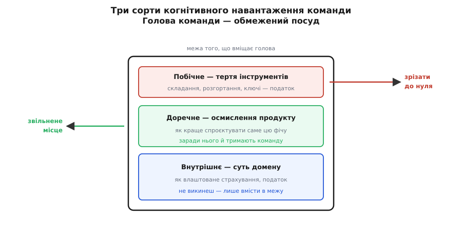
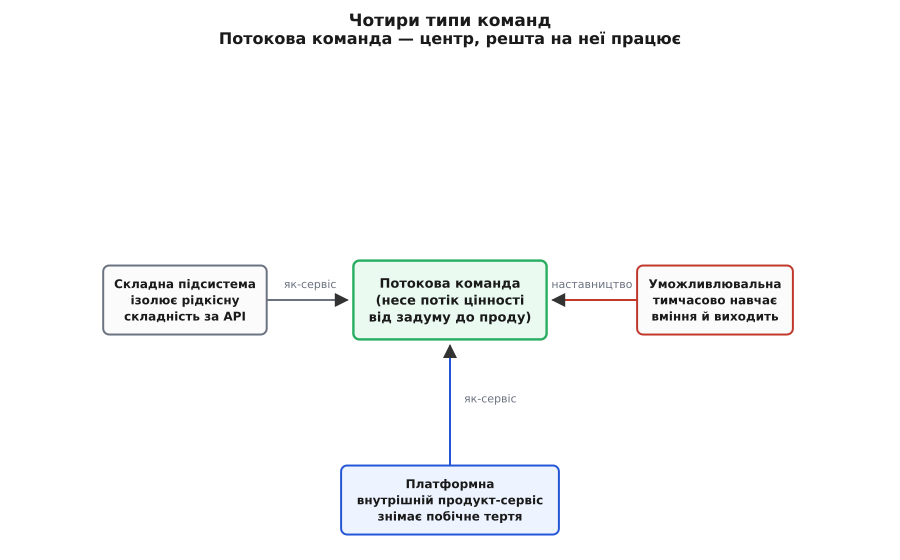
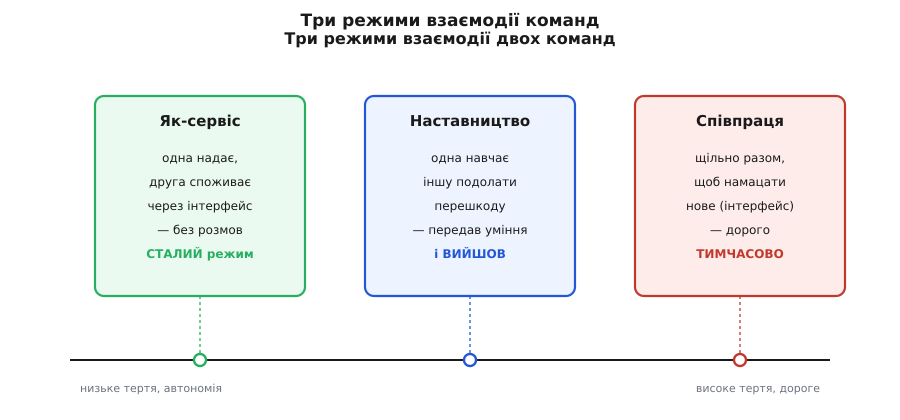

# Team topologies

<preknowlist>
- [Закон Конвея](root:sf-apps/conways-law) — система набуває структури, що дзеркалить структуру спілкування команди, яка її будує.
- [Inverse Conway maneuver](root:sf-apps/inverse-conway) — спершу креслять бажану форму системи, тоді перебудовують команди під неї, щоб потрібна архітектура народилася сама.
- [Когнітивне навантаження команди](root:sf-apps/cognitive-load-teams) — скільки всього команда здатна тримати в голові водночас, і чому це межа розміру того, що вона тягне.
- [Зчеплення і зв'язність](root:sf-apps/coupling-cohesion) — наскільки частини залежать одна від одної (зчеплення) і наскільки те, що всередині частини, належить одне одному (зв'язність).
</preknowlist>

Слово **топологія (гр. *tópos* — місце + *lógos* — учення)** прийшло з математики, де воно вивчає не відстані, а те, **що з чим сполучене**: чашка й бублик для тополога — одне й те саме, бо в обох одна дірка. «Team topologies» бере цю саму оптику й наводить її на **організацію команд**: не «скільки людей і хто головний», а **які команди існують, які між ними канали й хто з ким має право говорити**. Це погляд на людей як на **граф зв'язків**, бо саме граф зв'язків, а не штатний розпис, визначає, яку систему ця організація здатна збудувати.

Назва належить книжці Метью Скелтона й Мануеля Паїша *Team Topologies* (видавництво IT Revolution, вересень 2019). *(Усталений факт.)* Але сама книжка — не про менеджмент; вона про **архітектуру**. Її головна теза жорстка: **форму системи неможливо проєктувати окремо від форми команд**. Хто цього не бачить, малює гарні діаграми сервісів, а отримує систему, зліплену по межах відділів. Розберімо, звідки це випливає й що з цим робити.

## Чому це взагалі задача архітектора, а не HR

Почнімо з неминучості, яку легко проігнорувати. **[Закон Конвея](root:sf-apps/conways-law)** каже: **структура системи копіює структуру спілкування команд**, що її будують. Три команди, які між собою мало говорять, майже завжди зроблять систему з трьох слабко зчеплених частин по своїх межах — бо межа між командами стає межею в коді сама собою. Там, де люди легко домовляються, код зростається; там, де домовлятися важко (інша команда, інший поверх, інший часовий пояс), у коді пролягає шов.

Звідси випливає незручний висновок. Якщо ти намалював архітектуру з чистими межами між сервісами, але **команди нарізані інакше** — по технологіях (окремо «фронтенд», окремо «бекенд», окремо «база даних»), — то твоя гарна діаграма приречена. Комунікація потече не по твоїх межах, а по межах команд, і код застигне по них. Кожна фіча вимагатиме, щоб три команди сіли й узгодилися, бо жодна не володіє шматком цілком.

> 🔧 **Навіщо це.** Найчастіша причина, чому «мікросервіси не злетіли», — не технічна. Сервіси нарізали правильно, а команди лишили старими, по технологічних шарах. І кожен «незалежний» сервіс насправді вимагав узгодження трьох команд на кожну зміну — вийшов розподілений моноліт, найгірше з двох світів. Team topologies дає мову, щоб побачити цю пастку **до** того, як вона застигне в коді.

Раз межі команд стають межами системи, то **проєктування команд — це проєктування архітектури**. Не окрема задача для відділу кадрів, а той самий важіль форми, що й вибір, де провести межу між сервісами. І тут з'являється прийом, який перевертає причину й наслідок місцями.

## Зворотний хід: спершу форма системи, потім форма команд

Наївний порядок: беремо готові команди й питаємо, яку систему вони збудують. Зрілий архітектор робить навпаки. Він креслить **бажану форму системи** — які межі, які автономні шматки, — а тоді **перебудовує команди під цю форму**, щоб потрібна структура спілкування народила потрібну структуру коду сама. Це **[inverse Conway maneuver](root:sf-apps/inverse-conway)** (зворотний маневр Конвея): не боротися із законом, а поставити його собі на службу.

Логіка проста, коли її промовити. Закон Конвея діє в один бік автоматично — команди ліплять систему по своїх межах. То зроби межі команд **такими, якими хочеш бачити межі системи**, — і той самий закон, що псував тобі архітектуру, тепер її будує. Хочеш незалежні сервіси по бізнес-доменах — нарізай команди по бізнес-доменах, а не по шарах. Тоді кожна команда природно володітиме своїм сервісом цілком, бо їй **нема з ким узгоджуватися** всередині свого шматка.

Але тут одразу постає питання, на яке закон Конвея сам не відповідає: **як саме нарізати?** Скільки команд, якого розміру, і що визначає, де провести межу? Відповідь Team topologies дає через одне поняття, яке робить усю систему інженерною, а не смаковою.

## Межа розміру — не рядки коду, а голова людини

Що обмежує, скільки одна команда може тягти? Не кількість рядків і не кількість сервісів самих по собі. Обмежує **[когнітивне навантаження](root:sf-apps/cognitive-load-teams)** — скільки всього команда здатна тримати в голові водночас, щоб справді розуміти, а не просто гортати. Поняття прийшло з психології навчання: австралійський психолог Джон Свеллер сформулював теорію когнітивного навантаження ще 1988 року, показавши, що робоча пам'ять людини вузька й перевантаження її гальмує засвоєння. *(Усталений факт.)* Скелтон і Паїш переносять це з окремої голови на команду: у команди теж є стеля того, що вона реально утримує.

Навантаження буває трьох сортів, і їх варто розрізняти, бо борються з ними по-різному:

```
Внутрішнє  — складність самої задачі домену
             (як влаштоване страхування, як рахується податок)
Побічне    — тертя середовища, не суть
             (як зібрати проєкт, як задеплоїти, де які ключі)
Доречне    — корисне зусилля осмислення
             (як краще спроєктувати саме цю фічу)
```

Ключ ось у чому: **внутрішнє навантаження — це сама робота, його не викинеш**; його можна лише **вмістити в межу**, звузивши домен команди. **Побічне ж — чистий податок**, який нічого не додає, і його треба **зрізати до нуля**, звільнивши голову під доречне — те єдине зусилля, заради якого команду й тримають. Коли команда потопає в побічному (щодня воює зі складанням, розгортанням, конфігами), у неї не лишається голови на власне продукт, і вона гальмує — не через брак хисту, а через переповнену пам'ять.



*Голова команди — обмежений посуд: доки в ньому плаває побічне тертя, під доречне осмислення продукту місця немає.*

> 🔧 **Навіщо це.** Це дає інженерний критерій межі сервісу, якого доти бракувало. Питання не «чи не завеликий цей сервіс у рядках», а **«чи вміщує його одна команда в голову, ще й маючи запас на осмислення»**. Якщо команда володіє сімома сервісами й жодного не розуміє глибоко — межу проведено неправильно, скільки б метрик покриття не було зелені. Розмір того, що тягне команда, міряють головою, а не лінійкою.

Раз голова — це межа, то й типи команд випливають із неї: кожен тип існує, щоб **тримати чиєсь навантаження в межах**. Скелтон і Паїш зводять усе розмаїття команд до **чотирьох** — не довільно, а бо цих чотирьох досить, щоб покрити всі способи, якими команда буває корисна.

## Чотири типи команд

Уся класифікація тримається на одній команді — тій, що приносить цінність. Решта три існують, щоб **розвантажити** її.

**Потокова команда (stream-aligned) — типова, решта на неї працює.** «Потік» тут — це один суцільний потік цінності: продукт, ділянка користувацького шляху, бізнес-спроможність. Така команда володіє своїм потоком **від задуму до живої роботи** — сама будує, сама випускає, сама відповідає за нього в проді, **без передач іншим командам**. Це і є та автономна одиниця, під яку зводиться закон Конвея; усі інші типи виправдані лише тим, що знімають з неї зайвий тягар. У здоровій організації **більшість команд — саме потокові**, а решта — рідкі й допоміжні.

**Платформна команда (platform) — прибирає побічне тертя.** Замість щоб кожна потокова команда сама воювала з розгортанням, чергами, спостережністю, моніторингом, — платформна команда збирає це у **внутрішній продукт із самообслуговуванням**: «бери й користуйся, документація тут, чекати нас не треба». Її мета — не «керувати інфраструктурою», а **зрізати побічне навантаження** з десятків потокових команд одним спільним рішенням, поданим **як сервіс**, а не як послуга з тікетами. Про це — окрема тема, [платформна інженерія](root:sf-apps/platform-engineering), бо зробити платформу продуктом, а не звалищем скриптів, — окреме ремесло.

**Уможливлювальна команда (enabling) — тимчасово підтягує вміння.** Це вузькі фахівці (тестування, безпека, архітектура), чия робота — **не робити за потокову команду**, а **навчити її** й піти. Прийшли, допомогли команді опанувати новий підхід чи розплутати технічний борг, лишили її самодостатньою — і рушили далі. Ознака здорової уможливлювальної команди — вона **робить себе непотрібною** для конкретної команди; якщо вона осідає надовго, вона перетворилася на вузьке місце, через яке все тече.

**Команда складної підсистеми (complicated-subsystem) — ізолює рідкісну складність.** Іноді якийсь шматок вимагає **глибокої спеціальної експертизи**, якої нема сенсу очікувати від кожної потокової команди: обробка відео, обчислювальна фінансова математика, розпізнавання. Такий шматок віддають окремій команді **не за бізнес-межею, а за межею рідкісного знання** — щоб складність жила в одному місці за чітким інтерфейсом, а потокові команди користувалися ним, не занурюючись усередину. Це виняток, а не правило: більшість підсистем **не** заслуговують окремої команди, бо не аж такі складні.



*Топологія тримається на потоковій команді: три інші типи існують лише для того, щоб зняти з неї навантаження й дати нести свій потік цінності самостійно.*

Розрізнити їх допомагає одне питання до кожної команди: **чиє навантаження вона знімає?** Потокова несе своє (заради цінності); платформна знімає побічне з багатьох; уможливлювальна тимчасово знімає брак уміння; команда підсистеми ізолює рідкісну складність. Команда, яка не лягає в жоден тип, — привід придивитися: часто це відділ, нарізаний по технології («команда бази даних»), який лише **додає** передач і навантаження, замість знімати.

## Три способи взаємодії — і чому їх треба називати вголос

Типи команд кажуть, **хто є хто**. Лишається друге питання: **як саме дві команди взаємодіють** у конкретний момент. І тут головна ідея контрінтуїтивна: взаємодій **теж лише три**, і кожну пару команд треба свідомо тримати рівно в одному режимі, а не в тумані «ну ми якось співпрацюємо».

**Співпраця (collaboration).** Дві команди щільно працюють разом якийсь **обмежений час**, щоб намацати щось нове — інтерфейс, технологію, спосіб. Це потужно для відкриття, але **дорого**: висока пропускна здатність спілкування, розмиті межі відповідальності, зростає когнітивне навантаження обох. Тому співпраця — **тимчасовий режим**: намацали — розходяться. Постійна співпраця двох команд означає, що межу між ними проведено неправильно.

**Як-сервіс (X-as-a-Service).** Одна команда **надає**, друга **споживає** — через чіткий інтерфейс, без щоденних розмов. Споживач не знає й не хоче знати нутрощів; він читає документацію й користується. Це режим **низького тертя й максимальної автономії**: саме так платформна команда віддає свою платформу. Ціна — щоб працювало без розмов, інтерфейс мусить бути справді добрим і стабільним, інакше споживач раз у раз повертається «спитати».

**Наставництво (facilitation).** Одна команда **допомагає й навчає** іншу подолати перешкоду — типовий режим уможливлювальної команди. Мета — не зробити роботу, а **передати вміння** й вийти.



*Три режими на осі тертя: співпраця дорога й тимчасова, як-сервіс дешевий і сталий, наставництво передає вміння й завершується — і кожна пара має бути свідомо в одному з них.*

> 🔧 **Навіщо це.** Найбільша прихована вартість в організації — **невизначений режим взаємодії**. Дві команди «наче співпрацюють, наче одна для одної сервіс» — і в цьому тумані ніхто не знає, чи можна покластися на інтерфейс, чи треба щоразу писати в чат. Назвати режим явно («ми надаємо вам це **як сервіс**, ось інтерфейс, розмов не треба») — це архітектурне рішення про **пропускну здатність спілкування**, точнісінько як рішення про зв'язок між сервісами в коді.

І тут «топологія» перестає бути метафорою. Мапа команд і режимів між ними — це **буквально граф**: вузли-команди, ребра-режими. А кожне ребро **співпраці** — це висока пропускна здатність спілкування, яку, за законом Конвея, система **скопіює в код** як тісне зчеплення. Тому мапу взаємодій читають так само, як [граф зчеплення в коді](root:sf-apps/coupling-cohesion): багато постійних ребер співпраці — це майбутній розподілений моноліт. Здорова мапа — переважно ребра **як-сервіс** (низьке тертя) і рідкі, тимчасові сплески співпраці там, де намацують нове.

## Це не оргструктура, а команда як API

Легко сплутати все це зі звичайною схемою відділів. Різниця в акценті. Оргструктура каже, **хто кому підпорядкований**; топологія каже, **хто з ким і як говорить**, — а на код впливає саме друге. Дві організації з однаковою ієрархією, але різними каналами спілкування збудують різні системи.

Практичний наслідок — думати про команду як про **API**. У команди-як-API є свій «інтерфейс»: що вона надає (сервіси, дані), як до неї звертатися (тікет, чат, самообслуговування), які обіцянки щодо швидкості й стабільності вона тримає. Добре описаний командний інтерфейс дає сусідам користуватися командою **без щоденних розмов** — рівно як добрий програмний інтерфейс дає користуватися модулем, не знаючи його нутрощів. І пастка та сама, що з [інкапсуляцією в коді](root:sf-apps/coupling-cohesion): якщо інтерфейс команди дірявий (щоб щось отримати, треба знати «правильну людину»), сусіди лізуть у нутрощі, зчеплення злітає — і жодна автономія неможлива.

Ось як цю думку видно навіть у коді. Уяви внутрішню платформу, яку платформна команда віддає **як сервіс**. Її командний інтерфейс — це буквально програмний інтерфейс, за яким потокова команда не бачить нутрощів:

:::tabs
```cpp
// Командний API платформи = програмний API.
// Потокова команда бачить лише це — не знає ні черг, ні реплік, ні дата-центрів.
namespace platform {
    // «Ми надаємо публікацію події як сервіс. Виклик синхронний, доставка гарантована.»
    bool publish(const std::string& topic, const std::string& payload);

    // «Підписка — теж наш сервіс. Ви даєте обробник, решта — наша справа.»
    void subscribe(const std::string& topic,
                   std::function<void(const std::string&)> handler);
}
```
```python
# Командний API платформи = програмний API.
# Потокова команда бачить лише це — не знає ні черг, ні реплік, ні дата-центрів.
from typing import Callable, Protocol


class Platform(Protocol):
    # «Ми надаємо публікацію події як сервіс. Виклик синхронний, доставка гарантована.»
    def publish(self, topic: str, payload: str) -> bool: ...

    # «Підписка — теж наш сервіс. Ви даєте обробник, решта — наша справа.»
    def subscribe(self, topic: str, handler: Callable[[str], None]) -> None: ...
```
:::

Потокова команда пише свій код проти цього інтерфейсу — і все:

:::tabs
```cpp
// Потокова команда: жодного знання про нутрощі платформи, жодних розмов із нею
platform::publish("order.paid", orderJson);   // «замовлення оплачено»
```
```python
# Потокова команда: жодного знання про нутрощі платформи, жодних розмов із нею
platform.publish("order.paid", order_json)   # «замовлення оплачено»
```
:::

Доки цей інтерфейс стабільний, платформна команда вільна міняти всередині що завгодно — брокер, кількість реплік, дата-центр — **не турбуючи жодну потокову команду**. Це той самий виграш, що дає інкапсуляція в коді, тільки піднятий на рівень людей: **стабільний інтерфейс команди розриває хвилю узгоджень**, як стабільний інтерфейс модуля розриває хвилю правок.

## Топологія теж не «готова» — вона еволюціонує

Остання, найважливіша думка: **правильної топології раз і назавжди не існує**. Те, що добре сьогодні, шкодить завтра, бо міняється й система, і люди.

Показова пара — **співпраця проти як-сервісу** в часі. На старті двом командам корисно **щільно співпрацювати**: інтерфейсу між ними ще нема, його треба намацати спільно. Але щойно інтерфейс усталився, ту саму щільну співпрацю треба **свідомо розірвати** й перевести пару в режим **як-сервіс** — інакше дороге тісне спілкування триває даремно, і система застигає в тісному зчепленні там, де вже могла б мати чисту межу. Момент цього переходу — окреме рішення архітектора, і його легко проґавити: команди за звичкою тримаються за співпрацю, бо так уже склалося.

Тому топологію команд ведуть **так само, як [еволюційну архітектуру](root:sf-apps/evolutionary-architecture)**: не як застиглий план, а як живу форму, яку свідомо міняють, коли змінилися навантаження й межі. Виріс домен понад голову команди — ділять команду й потік. Уможливлювальна команда осіла надовго — розформовують. Платформа обросла тікетами замість самообслуговування — переробляють її інтерфейс. Форма команд дихає разом із системою, бо це **одна форма, показана з двох боків**: збоку коду це архітектура, збоку людей це топологія команд, і проєктувати одне без іншого — будувати наосліп.

Головний будівельник ніколи не креслив лише стіни — він завжди креслив і **хто де стоятиме й до кого гукне**. Team topologies повертає цю очевидність у розробку: **межі системи й межі команд — це той самий креслення, і архітектор відповідає за обидві половини разом.**
