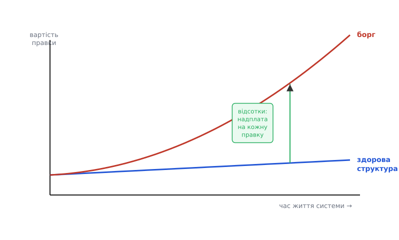
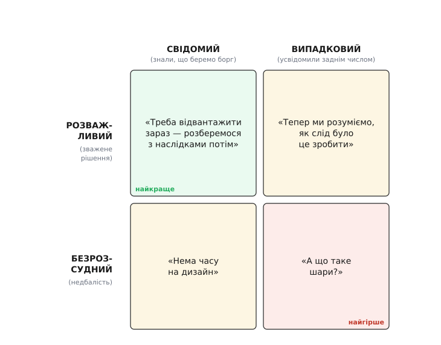
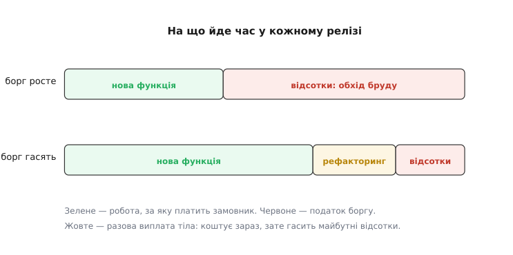

# Технічний борг і вартість зміни

<preknowlist>
- [Якісні атрибути («-ilities»)](topic:sf-apps/quality-attributes) — нефункціональні властивості системи (змінюваність, продуктивність, доступність) і головна правда: покращуючи один атрибут, псуєш інший.
- [Зчеплення і зв'язність](topic:sf-apps/coupling-cohesion) — скільки елементів знають одне про одного (зчеплення) і чи зібране за змістом (зв'язність); саме це вирішує, як далеко розтечеться зміна.
- [Еволюційна архітектура як дефолт](topic:sf-apps/evolutionary-architecture) — система живе роками й весь той час її міняють; зміна — постійний фон, а не виняток.
</preknowlist>

Код пишуть один раз, а живе він роками — і майже весь той час його **міняють**. Саме тут ховається найдорожча властивість системи, якої не видно в жодному кошторисі: наскільки легко внести наступну зміну. Одна й та сама функція в одній кодовій базі коштує пів дня, а в іншій — три дні страху зачепити сусіднє. Різниця між цими двома базами — не в тому, що вони роблять сьогодні, а в тому, скільки бруду накопичилося в їхній структурі. Цей бруд має ім'я, і ім'я це — фінансове.

**Технічний борг** (англ. *technical debt*) — це метафора, яку 1992 року на конференції OOPSLA у звіті про досвід (experience report) увів **Ворд Каннінгем** (Ward Cunningham), працюючи над фінансовою системою WyCash мовою Smalltalk. Він шукав спосіб пояснити керівництву-нефінансистам, чому команда збирається переписати частину коду, що начебто працює. І взяв образ, зрозумілий будь-якому фінансисту: [як народилася ця метафора й що Каннінгем мав на увазі насправді](topic:sf-apps/technical-debt/hist-ward-cunningham-debt.md) — окрема замітка. Його точні слова:

> «Відвантажити код уперше — це як узяти в борг. Невеликий борг пришвидшує розробку, поки його вчасно повертають переписуванням...»

> 🔧 **Навіщо це.** Слово «борг» — не образа коду, а інструмент розмови з тими, хто ухвалює рішення про час і гроші. «Треба зробити красивіше» звучить як примха програміста, і його ріжуть першим. «Ми взяли борг, і відсотки вже з'їдають два дні на кожну правку» звучить як бухгалтерія — і на це виділяють час. Метафора перекладає інженерну проблему мовою бізнесу.

## Тіло боргу й відсотки

Метафора точна там, де в неї два поняття, а не одне. Взяти борг — це **тіло** (principal): ти відвантажив код, який робить роботу, але структурою не відповідає задачі — зайва копія логіки, обхідний шлях замість чесного, вгадана назва замість правильної. Саме по собі тіло нічого не коштує, поки ти код не чіпаєш. Ціну ти платиш **відсотками** (interest) — і платиш їх щоразу, коли доводиться цей код міняти.

Мартін Фаулер дав цьому точну міру. Уяви, що структура модуля заплутана, і нова функція, яка при чистій структурі зайняла б чотири дні, через цей бруд займає шість. Ці **два дні різниці — і є відсотки на борг**. Вони не разові: наступна правка того самого місця знову набіжить зайвим часом, і ще раз, і ще. Поки тіло не погашене, кожна зустріч із цим кодом обкладена податком.

Звідси випливає найважливіше й найбільш контрінтуїтивне: **борг б'є не по сьогоденню, а по темпу завтрашніх змін.** Система з боргом працює сьогодні не повільніше за здорову — користувач різниці не бачить. Різницю бачить команда: кожен наступний реліз виходить трохи важче, трохи довше, з трохи більшим ризиком щось зламати. Борг — це податок не на роботу програми, а на її розвиток.



*Здорова структура тримає вартість зміни майже сталою роками. Борг вигинає її вгору: що більше накопичено й що довше не гашено, то дорожча кожна наступна правка. Зелений розрив між кривими — це відсотки, надплата за кожну зміну, і з часом він тільки ширшає.*

## Звідки в структурі береться відсоток

Чому саме заплутана структура робить зміну дорогою — це не магія, а проста механіка **зчеплення**. Уяви зміну як камінь, кинутий у воду. Точка падіння — той рядок, який справді треба переписати. Але від неї розходяться кола: усе, що **знало** про змінене, доводиться чіпати слідом. Змінив формат дати в одному місці — а правити довелося у звіті, експорті, інтерфейсі та лозі, бо кожен із них знав про той формат безпосередньо.

Розмір цієї хвилі й є розмір відсотка. Що більше елементів зчеплені зі зміненим, то далі розтікається правка, то більше місць треба знайти, поправити й не забути — і то вища ймовірність, що одне з них пропустиш і зламаєш. [Тактики змінюваності](topic:sf-apps/modifiability-tactics) — це якраз способи цю хвилю приборкати: зібрати знання про формат в одному місці, щоб зміна лишалася локальною. Борг — це стан, коли знання **розмазане**, і кожна правка збирає його по всій кодовій базі вручну.

Тому технічний борг — не про «негарний код» на смак. Він вимірний через ту саму вартість зміни, що й будь-який інший інженерний вибір: скільки місць треба зачепити, чи не поламається сусіднє, скільки часу забере наступна правка. І ця вартість — один із чотирьох струмків, з яких складається [повна вартість володіння системою](topic:sf-apps/cost-as-attribute): побудувати, експлуатувати, **міняти**, вийти. Струмок «міняти» найпідступніший, бо його майже ніколи не прикидають наперед — він вилазить лише тоді, коли зміна вже потрібна.

## Не всякий борг поганий

Тут ховається пастка. Якщо борг — це погано, то ідеал — узагалі його не брати: усе робити ретельно, начисто, з першого разу. Але це така сама помилка, як думати, що фінансовий борг завжди шкідливий. Іпотека дає тобі житло на десять років раніше, ніж якби ти збирав усю суму готівкою, — і ці десять років часто варті відсотків. Так само й у коді: інколи відвантажити зараз із боргом і зайняти ринок важливіше, ніж вилизувати структуру ще місяць.

Ключ — у тому, що борг береться **свідомо чи випадково** й **розважливо чи безрозсудно**. Мартін Фаулер розклав це на чотири випадки — так званий **квадрант технічного боргу**.



*Дві осі: чи знали ми, що беремо борг (свідомо / випадково), і чи зважували рішення (розважливо / безрозсудно). Зелений кут — свідомий розважливий борг («треба відвантажити зараз, повернемо потім») — здоровий і корисний. Червоний кут — випадковий безрозсудний («а що таке шари?») — найгірший: команда навіть не помічає, що набирає борг, і не вміє його повернути.*

Різниця між кутами — це різниця між іпотекою й лудоманією. **Свідомий розважливий** борг — інструмент: команда розуміє, що бере на себе, планує повернути й тримає це в полі зору. **Випадковий безрозсудний** — катастрофа: борг набігає сам, бо люди не знають, як писати інакше, і навіть не бачать, що заганяють систему в яму. Небезпечний не борг як такий, а борг **непомічений і некерований** — той, що накопичується сам і про який ніхто не веде рахунку.

> 🔧 **Навіщо це.** Квадрант рятує від двох крайнощів. Перша — «ніякого боргу ніколи», яка перетворює кожну задачу на нескінченне вилизування й зриває всі терміни. Друга — «та потім розберемося», яка тихо топить систему в бруді. Правильна позиція посередині: борг брати можна й треба, але — свідомо, з планом повернення й записом у журналі рішень, а не як випадковий побічний ефект поспіху.

## Скільки насправді коштує розмазане знання

Покажемо відсотки на дотик — там, де їх видно в рядках коду. Класичне тіло боргу — та сама величина чи правило, розсіяне копіями по всій базі. Кожна копія працює; ціну видно лише тоді, коли правило міняється.

**Умова.** Прошивка знає граничну напругу батареї 4.20 В у трьох місцях: індикатор заряду гасить лампу, захист відрубає навантаження, лог пише подію. Число вписали копією в кожне місце. Виробник батарей уточнив поріг до 4.15 В — треба поправити всюди.

```c
// БОРГ: те саме число живе трьома копіями. Хто знає, що їх рівно три?
void charge_indicator(float v) {
    if (v >= 4.20f) led_full();          // копія 1
}
void battery_protection(float v) {
    if (v >= 4.20f) cut_off_load();      // копія 2
}
void battery_log(float v) {
    if (v >= 4.20f) log_event(EVT_FULL); // копія 3
}
```

Зміна порогу — це три правки, і жодна з них не підказує про існування двох інших. Пропустив одну — і захист працює за старим числом, поки батарея тихо перезаряджається. Відсоток тут — не лише зайвий час на пошук усіх копій, а **ризик**: ймовірність, що одну копію забудеш, і система зламається неочевидно.

Тіло гаситься одним ходом — зібрати знання в одне місце, щоб було рівно одне джерело правди:

```c
// ПОГАШЕНО: поріг живе в одній константі. Зміна — рівно одна правка.
#define BATTERY_FULL_V 4.15f             // єдине джерело правди

void charge_indicator(float v) { if (v >= BATTERY_FULL_V) led_full(); }
void battery_protection(float v) { if (v >= BATTERY_FULL_V) cut_off_load(); }
void battery_log(float v) { if (v >= BATTERY_FULL_V) log_event(EVT_FULL); }
```

Тепер наступна зміна порогу — одна правка в одному рядку, без пошуку копій і без шансу забути. Зверни увагу на структуру відсотка: з трьома копіями кожна зміна коштує «знайти всі N місць» — а N ти напевно не знаєш, бо копії ніде не перелічені. Погашення прибирає не одну правку, а **всю хвилю**: скільки б разів поріг не мінявся в майбутньому, це завжди буде один рядок. Повний розбір того, як рахувати цю хвилю й на чому саме набігає час і ризик, — [окрема робота з кодом](topic:sf-apps/technical-debt/proj-debt-interest-cost.md).

Але тут-таки причаївся й зворотний бік. Якби ці три числа насправді були **різними причинами**, що збіглися значенням випадково (поріг лампи, поріг захисту й поріг лога — три окремі рішення, які сьогодні однакові), то зшити їх однією константою означало б створити **фальшивий зв'язок**: наступного разу, коли захист захоче 4.10, а лампа лишиться 4.15, доведеться боляче розчіпляти. Ось чому боротьба з боргом — це не механічне «прибрати всі копії»: це судження, [де повторення справжнє, а де випадкове](topic:sf-apps/dry-kiss-yagni). Передчасне узагальнення — теж борг, лише інший.

## Як борг гасять

Борг, як і фінансовий, не зникає сам — його **повертають** окремою роботою. І тут метафора дає точну картину того, куди йде час у кожному релізі. У кожному циклі команда або лише **платить відсотки** — обходить бруд, витрачаючи зайвий час на кожну правку, — або разово **гасить тіло**: рефакторить, приводить структуру до задачі, і майбутні відсотки з цього місця зникають.



*Верхня доріжка — борг ігнорують: відсотки (обхід бруду) з'їдають дедалі більшу частку релізу, на нову функцію лишається все менше. Нижня — тіло гасять: разова виплата на рефакторинг коштує зараз, зате майбутні відсотки падають, і на роботу для замовника лишається більше. Жовта виплата окупається, лише якщо код ще довго житиме й мінятиметься.*

Звідси випливає єдине чесне правило погашення: **гаси тіло там, куди часто повертаєшся.** Код, який ніхто більше не чіпатиме, може лишатися брудним вічно — його відсотки ніколи не набіжать, бо змін не буде; вилизувати його — марна виплата. А код у гарячій зоні, який правлять щотижня, треба тримати чистим, бо там відсотки капають безперервно. Цю інтуїцію можна порахувати: разова виплата на рефакторинг окупається лише тоді, коли зекономлені майбутні відсотки перевищать її, — [проста модель точки беззбитковості й накопичення відсотків](topic:sf-apps/technical-debt/math-debt-interest.md) показує, звідки береться поріг і чому холодний код гасити не варто. Рішення «переписати начисто чи латати далі» — окремий важкий вибір між [переписуванням і рефакторингом](topic:sf-apps/rewrite-vs-refactor), і майже завжди рефакторинг малими кроками виграє в переписування з нуля.

І остання, найтихіша частина картини. Борг, за яким не ведуть рахунку, накопичується сам і непомітно — доки система з роками не перетворюється на болото, де кожна зміна дорога, а причини ніхто вже не пам'ятає. Це називають [ерозією архітектури](topic:sf-apps/architecture-erosion): повільним розходженням між тим, як система задумана, і тим, чим вона стала під тиском сотень поспішних правок. Ліки — не героїчне «перепишемо все», а звичка: помічати борг у момент, коли його береш, називати його вголос, записувати рішення й повертати тіло малими виплатами там, де воно капає найгустіше.

## Що лишається в руках

Технічний борг — це не лайка на адресу коду, а точна метафора вартості майбутньої зміни. Три речі варто винести назавжди.

Перше: **у боргу є тіло й відсотки.** Тіло — код, який структурою не відповідає задачі; коштує він не сам по собі, а відсотками — зайвим часом і ризиком на **кожну** правку цього місця. Тому борг б'є не по сьогоднішній роботі системи, а по темпу її завтрашнього розвитку.

Друге: **не всякий борг поганий.** Свідомий розважливий борг — інструмент, як іпотека: відвантажити зараз, повернути потім, тримаючи рахунок. Смертельний — борг випадковий і некерований, той, що набігає сам і про який ніхто не знає. Різниця не в наявності боргу, а в тому, помічають його чи ні.

Третє: **борг гасять окремою роботою й вибірково.** Тіло повертають рефакторингом там, куди часто повертаєшся й де відсотки капають; холодний код можна лишити брудним. А головна дисципліна — вести рахунок: називати борг у момент, коли береш, щоб він не перетворився на непомітну ерозію, яка одного дня зробить кожну зміну нестерпно дорогою.
