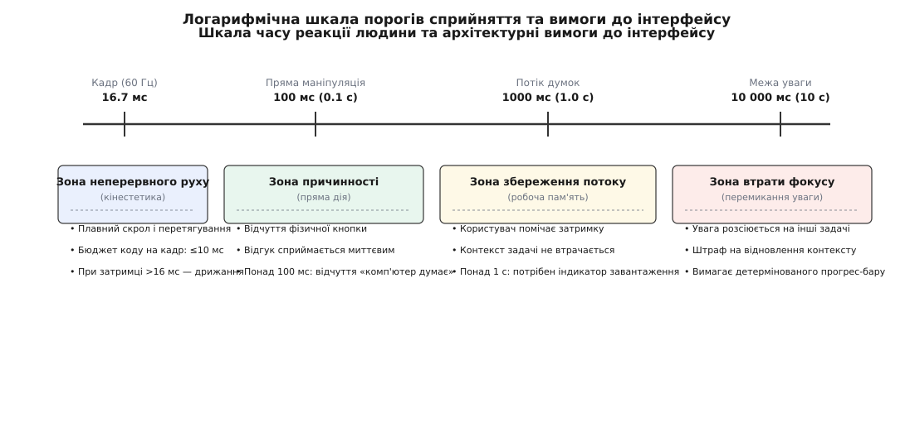
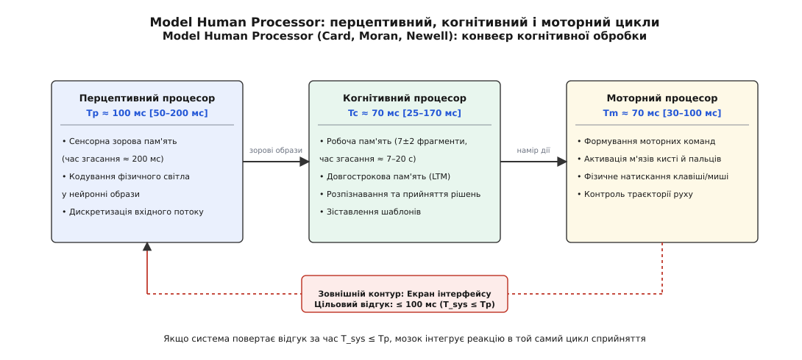
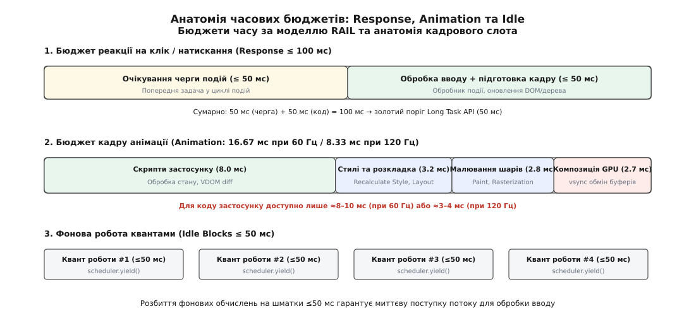
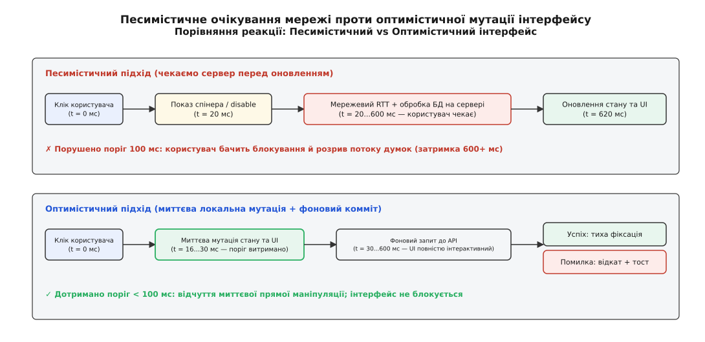

# Пороги часу відгуку інтерфейсу: 0.1 с, 1 с, 10 с

<preknowlist>
- [Цикл подій](topic:sf-tasks/event-loop) — потік інтерфейсу по черзі дістає повідомлення з черги й віддає їх обробникам; довгий обробник зупиняє весь цикл.
- [Розвантаження потоку інтерфейсу](topic:sf-apps/ui-thread-offloading) — чому важкі обчислення та операції вводу-виводу виносять у фонові потоки.
- [Перцентилі та квантилі](topic:math-probability/percentiles-quantiles) — чому якість інтерфейсу оцінюють за хвостом розподілу (95-й і 99-й перцентилі), а не за середнім часом.
</preknowlist>

Користувач натискає кнопку в інтерфейсі — наприклад, перемикає вкладку у браузері або додає товар до кошика. Якщо нова вкладка з'являється на екрані за сорок мілісекунд, людина відчуває прямий фізичний зв'язок: палець торкнувся клавіші, і картинка миттєво змінилася, немов під дією механічного важеля. Якщо та сама операція триває триста мілісекунд, виникає відчуття затримки («комп'ютер обробляє запит»). Якщо відгук затримується на півтори секунди, безперервний потік думок розривається: користувач зупиняється і чекає. А якщо екран завмирає на дванадцять секунд, людина відводить погляд від монітора, перемикається на робочий чат або бере в руки смартфон.

Усі чотири стани — це не примхи користувача і не суб'єктивні враження від естетики дизайну. Це жорсткі константи біології людського мозку: пропускна здатність зорової кори, тривалість циклу прийняття рішень та швидкість згасання інформації в робочій пам'яті. Частота процесорів зросла у мільйони разів, а мережеві канали перейшли від кілобітів до гігабітів, проте нейрофізіологічні константи людини залишаються незмінними.

Без розуміння цих часових меж інженер не здатний ухвалити базові архітектурні рішення: де стан клієнта зобов'язаний мутувати синхронно до відповіді сервера, де достатньо локального спінера, де обов'язковий кількісний прогрес-бар з таймером, а які операції взагалі неприпустимо виконувати синхронно на потоці інтерфейсу.


*Чотири діапазони взаємодії: що довша затримка, то вищий рівень когнітивного навантаження виникає в користувача і то кардинальніших змін потребує архітектура клієнта.*

## Біологічна основа: конвеєр сприйняття людини

Щоб зрозуміти, звідки беруться конкретні часові числа, необхідно поглянути на будову інформаційного конвеєра людини. У 1983 році дослідники Xerox PARC Стюарт Кард (*Stuart Card*), Томас Моран (*Thomas Moran*) та Аллен Ньюелл (*Allen Newell*) опублікували фундаментальну модель обробки інформації людиною — **Model Human Processor (MHP)**.

Людина взаємодіє з комп'ютером не як неперервна аналогова система, а як послідовність дискретних циклів обробки стимулів, розділених на три процесори з власними буферами пам'яті:

```
Сенсорні рецептори (око/вухо) 
  → Перцептивний процесор (T_p ≈ 100 мс) 
    → Когнітивний процесор (T_c ≈ 70 мс) 
      → Моторний процесор (T_m ≈ 70 мс) 
        → Рух пальця
```

1. **Перцептивний процесор (*perceptual processor*, від лат. *perceptio* — сприйняття).** Зорова система накопичує фотони на сітківці та передає знімок у сенсорну пам'ять (*Visual Image Store*). Час одного перцептивного кванта становить номінально `T_p ≈ 100 мс` (у діапазоні від 50 мс у зосередженому стані до 200 мс при слабкому освітленні). Усі зміни на екрані, що відбулися всередині одного 100-мілісекундного інтервалу, мозок склеює в єдиний статичний образ або неперервний рух.
2. **Когнітивний процесор (*cognitive processor*, від лат. *cognitio* — пізнання).** Отримує закодовані перцептивні образи, звертається до довгострокової пам'яті (*Long-Term Memory*) та маніпулює даними в робочій пам'яті (*Working Memory*). Номінальний цикл прийняття одного елементарного рішення становить `T_c ≈ 70 мс` (діапазон 25–170 мс).
3. **Моторний процесор (*motor processor*, від лат. *motor* — той, що рухає).** Формує нервові імпульси для скорочення м'язів кисті та пальців. Тривалість генерації та виконання елементарного моторного акту (наприклад, натискання клавіші) складає `T_m ≈ 70 мс` (діапазон 30–100 мс).

Повний математичний апарат розрахунку часу реакції, комбінації циклів та експоненційного розпаду пам'яті детально виведено у [математичній моделі конвеєра Human Processor](topic:sf-apps/ui-response-time-limits/math-mhp-cycle.md).


*Конвеєр MHP: затримка системи T_sys додається безпосередньо до перцептивного циклу. Якщо T_sys ≤ 100 мс, мозок інтегрує реакцію інтерфейсу в той самий цикл сприйняття.*

З цієї структури випливає ключовий закон: час реакції комп'ютера `T_sys` є зовнішньою ланкою у замкненій петлі зворотного зв'язку. Якщо `T_sys` вкладається у фізіологічні рамки відповідного процесора, інтерфейс відчувається природним продовженням тіла; якщо перевищує їх — система змушує мозок штучно чекати та витрачати енергію на синхронізацію.

## Три класичні пороги: 0.1 с, 1 с, 10 с

Історично першим ці часові межі сформулював Роберт Міллер у 1968 році під час дослідження терміналів IBM, а в 1993 році Якоб Нільсен систематизував їх для графічних оболонок і вебу. [Історія відкриття та розвитку трьох часових меж](topic:sf-apps/ui-response-time-limits/hist-three-thresholds.md) демонструє, як інженерні спостереження над терміналами розділення часу перетворилися на промислові стандарти дизайну комп'ютерних систем.

Ці три числа утворюють тріаду, навколо якої будується вся архітектура клієнтських застосунків.

### Поріг 0.1 секунди (100 мс): Відчуття прямої маніпуляції та причинності

Поріг `100 мс` — це верхня межа, за якої користувач сприймає взаємодію з системою як **миттєву** (*instantaneous*).

Якщо між фізичною дією (кліком миші, дотиком до сенсорного скла, натисканням пробілу) та видимим оновленням пікселів минає менше 100 мс, перцептивний процесор людини реєструє причину й наслідок усередині **одного й того самого кванта сприйняття**. 

Мозок інтерпретує таку подію як безпосередню причинність (*causality*): користувач відчуває, ніби він власноруч пересунув матеріальний предмет. У психології це називають *відчуттям прямої маніпуляції* (*direct manipulation*). 

Коли затримка перевищує 100 мс:
- Мозок фіксує два окремих перцептивних кадри: «кадр дії» та «кадр результату»;
- Ілюзія фізичного контакту миттєво руйнується;
- Користувач підсвідомо відчуває, що між його рукою та об'єктом стоїть посередник — комп'ютер, який отримав команду, обробляє її і змушує людину чекати;
- Якщо відгук на натискання віртуальної кнопки на смартфоні займає 150 мс, палець уже завершив рух угору, а кнопка все ще втоплена — виникає відчуття «гумового», в'язкого інтерфейсу.

При аналізі моторного контролю затримка понад 100 мс викликає явище розфазування зворотного зв'язку. Коли людина наводить курсор на дрібну кнопку або тягне повзунок гучності, мозок постійно коригує положення руки за замкненим циклом. Якщо візуальний відгук відстає від руху більш ніж на один перцептивний цикл, моторний процесор надсилає коригувальний імпульс на основі застарілої картинки. Це призводить до промахів повз ціль (*overshoot*) і змушує користувача робити серію додаткових коливальних рухів для точного наведення.

Для будь-яких елементів прямого вводу (перемикання чекбоксів, розгортання випадних списків, введення тексту в поле форми, реакція кнопки на натискання) клієнтський застосунок зобов'язаний надати локальний візуальний відгук менш ніж за 100 мс.

### Поріг 1.0 секунда (1000 мс): Збереження безперервного потоку думок

Поріг `1.0 с` — це ліміт часу, протягом якого людина зберігає **безперервний потік думок** (*stream of thought* або *flow state*).

Коли користувач виконує складну послідовність дій (наприклад, читає статтю, переходить за внутрішнім посиланням, вибирає фільтр у таблиці та шукає потрібний рядок), його увага зосереджена на предметній задачі, а не на інструменті.

Роберт Міллер у роботі 1968 року описав цей поріг через концепцію «психологічного закриття» (*psychological closure*). Людина структурує велике завдання на ланцюжок дрібних ментальних кроків (транзакцій). Кожен крок вимагає виконання дії та отримання підтвердження від системи, після чого мозок закриває поточний гештальт і переходить до наступного кроку.

При затримці від 0.1 до 1.0 с:
- Користувач виразно помічає паузу: стає зрозуміло, що комп'ютер виконує роботу (звертається до диска чи мережі);
- Проте контекст поточної операції повністю зберігається в активній робочій пам'яті (за експоненційною моделлю розпаду понад 86% асоціацій залишаються активними);
- Ментальний план дій не руйнується: користувач точно пам'ятає, навіщо він натиснув на кнопку, і вже готовий зробити наступний крок (наприклад, прочитати заголовок відкритої сторінки);
- Людині не потрібен складний індикатор прогресу — достатньо мінімальної зміни стану (наприклад, зміна форми курсора на годинник або мікро-спінер усередині кнопки).

Якщо ж операція займає 1.2–2.5 секунди без жодного зворотного зв'язку, користувач починає сумніватися, чи зареєструвала система клік. Виникає типова помилка: людина натискає кнопку вдруге, відправляючи дублюючий запит, або смикає інтерфейс, руйнуючи власний темп мислення.

### Поріг 10.0 секунд: Межа утримання фокусу уваги

Поріг `10.0 с` — це абсолютна межа здатності людини **пасивно утримувати увагу** на одному діалоговому вікні без зовнішньої стимуляції.

Робоча короткострокова пам'ять людини має обмежений час життя: за відсутності постійного підкріплення або повторення слід пам'яті про поточну дію згасає експоненційно з постійною часу `tau ≈ 7 с` (експерименти Петерсона й Петерсон). До десятої секунди пасивного очікування понад 75% активних асоціацій розсіюються.

Коли затримка перевищує 10 секунд:
- Мозок сприймає паузу як переривання комунікації;
- Увага автоматично перемикається на інші джерела інформації: сусідню вкладку браузера, месенджер, телефон, розмову з колегою;
- Коли через 15–30 секунд комп'ютер нарешті завершує обчислення та малює результат, користувач стикається з високим когнітивним штрафом перемикання контексту (*task switching cost*). Дослідження показують, що повернення до перерваної задачі забирає від 5 до 25 секунд додаткового часу, оскільки людині потрібно заново прочитати екран і згадати початкову мету.

Для будь-яких операцій, що тривають понад 10 секунд (експорт великого звіту, стиснення відео, збірка проєкту, завантаження важкого архіву), архітектура інтерфейсу зобов'язана надати:
1. **Детермінований прогрес-бар (*determinate progress bar*):** точну шкалу з відсотками або динамічною оцінкою залишкового часу («залишилося 45 секунд»);
2. **Можливість скасування (*Cancel/Abort*):** чітку кнопку відміни операції, яка негайно обриває фоновий потік чи мережевий сокет і повертає застосунок у стабільний стан;
3. **Фонове виконання з асинхронним сповіщенням:** здатність відпустити користувача працювати в інших розділах застосунку та надіслати системний push або тост-сповіщення після завершення.

## Кадровий бюджет плавності проти порогу реакції

Поруч із порогом реакції (100 мс) існує значно жорсткіший поріг — **кадровий бюджет плавності**, який регулює не просто реакцію на дискретний клік, а неперервний кінестетичний рух.

Коли користувач прокручує довгий список (*scroll*), перетягує картку (*drag-and-drop*) або масштабує карту пальцями (*pinch-to-zoom*), мозок вмикає сенсомоторну екстраполяцію: око очікує, що положення зображення буде суворо синхронне з координатою пальця на кожному міліметрі руху.

Якщо при перетягуванні об'єкта екран оновлюється із затримкою 100 мс, виникає катастрофічний просторовий розрив: палець зміщується на 3–5 сантиметрів уперед, а об'єкт на екрані стоїть на місці, після чого стрибає ривком. Тут поріг 100 мс не працює: потрібна неперервна каденція кадрів.

```
Частота дисплея   Час на 1 кадр   Оверхед рушія   Бюджет коду застосунку
──────────────────────────────────────────────────────────────────────────
60 Гц             16.67 мс        ≈ 6.67 мс       ≤ 10.0 мс
120 Гц (ProMotion) 8.33 мс        ≈ 4.33 мс       ≤  4.0 мс
144 Гц (Gaming)    6.94 мс        ≈ 3.94 мс       ≤  3.0 мс
```

Весь час кадру не належить розробнику. Браузер або графічна підсистема ОС витрачає фіксований час на службові фази:
1. **Recalculate Style:** зіставлення CSS-правил або селекторів тем із деревом елементів;
2. **Layout / Reflow:** розрахунок координат і розмірів прямокутників у пікселях;
3. **Paint:** генерація команд малювання (векторних інструкцій) для оновлених шарів;
4. **Compositing & VSync:** завантаження текстур у відеопам'ять GPU та очікування тактового імпульсу дисплея.


*Розподіл бюджету взаємодії: щоб вкластися у поріг 100 мс на реакцію, довжина будь-якої фонової задачі в черзі подій не має перевищувати 50 мс.*

Для коду застосунку при 60 Гц залишається лише **10 мілісекунд**, а при 120 Гц — лише **4 мілісекунди**. Якщо обробник прокрутки або мутація дерева станів перевищує цей ліміт, дисплей не встигає отримати новий кадр, пропускає такт і відображає старий вміст, викликаючи дрижання (*jank*).

## Сучасні моделі та стандарти: RAIL, INP, LoAF

Щоб перетворити психофізичні константи на вимірювані інженерні критерії, сучасні платформи спираються на формальні моделі продуктивності.

### Модель RAIL

Запропонована інженерами Google модель **RAIL** ділить життєвий цикл застосунку на чотири фази:

- **Response (Відгук):** обробка вводу користувача за `<= 100 мс`. Щоб гарантувати цей час навіть тоді, коли ввід надійшов у момент виконання іншої задачі, максимальний розмір будь-якого фонового блоку роботи обмежується **50 мілісекундами**. Тоді в найгіршому випадку (клік стався на 1-й мілісекунді чужої 50-мс задачі) потік звільниться через 49 мс, і в обробника залишиться ще 51 мс на оновлення інтерфейсу до настання 100-мс порогу.
- **Animation (Анімація):** видача кадру за `<= 16.67 мс` (орієнтир для коду застосунку — `<= 10 мс`).
- **Idle (Простій):** виконання важкої фонової роботи (аналітика, передзавантаження, індексація) виключно квантами по `<= 50 мс`, з регулярною поступкою потоку через `scheduler.yield()` або `requestIdleCallback()`.
- **Load (Завантаження):** первинна доставка інтерактивного контенту менш ніж за `1000–2500 мс`.

### Стандарт Interaction to Next Paint (INP)

З 12 березня 2024 року метрика **Interaction to Next Paint (INP)** стала ключовим показником чуйності веб-застосунків у наборі Core Web Vitals, замінивши застарілий показник First Input Delay (FID).

INP вимірює повну затримку взаємодії: від моменту, коли користувач натиснув клавішу або торкнувся екрана, через очікування в черзі подій та виконання обробників JavaScript, аж до моменту, коли браузер **фізично намалював наступний оновлений кадр на екрані**:

```
INP = Час очікування у черзі (Input Delay) 
    + Час виконання обробника (Processing Time) 
    + Час рендерингу кадру (Presentation Delay)
```

Градація оцінки INP за 75-м перцентилем усіх сесій:
- **≤ 200 мс:** добре (*Good*) — інтерфейс відчувається чуйним і відповідає порогу прямої дії;
- **200–500 мс:** потребує покращення (*Needs Improvement*) — помітне гальмування, користувач відчуває в'язкість;
- **> 500 мс:** погано (*Poor*) — грубе порушення порогу збереження потоку думок.

Для глибокого аналізу затримок сучасні браузери надають **Long Animation Frames API (LoAF)**. На відміну від старого Long Tasks API, який бачив лише скрипти довше 50 мс, LoAF надає повний часовий профіль анімаційного кадру: час виконання скриптів, тривалість розрахунку стилів (`styleAndLayoutStart`), час малювання шарів та затримку очікування черги.

> 🔧 **Навіщо це.** Показник INP на 75-му перцентилі захищає архітектуру від фальшивого оптимізму. Інтерфейс може показувати чудовий середній час відгуку в 40 мс у лабораторних тестах на потужному комп'ютері розробника. Проте в реального користувача на бюджетному смартфоні під час фонового складання сміття чи парсингу великого JSON час реакції стрибає до 600 мс. Вимірювання перцентилів виявляє саме ці хвости затримок, які руйнують користувацький досвід.

## Диспетчеризація та пріоритети в операційних системах

Різні платформи реалізують концепцію кадрових бюджетів через власні диспетчери черг задач із градацією пріоритетів.

### 1. Web Platform (Chromium Task Scheduling)

У сучасному веб-стеку планувальник завдань (`Prioritized Task Scheduling API`) оперує трьома рівнями пріоритетів:
- `user-blocking`: найвищий пріоритет (обробка кліку, оновлення форми) — повинен виконатися за `< 50–100 мс`;
- `user-visible`: рендеринг вмісту, що знаходиться у полі зору користувача, анімація переходів;
- `background`: фонові розрахунки, надсилання телеметрії, завантаження невидимих блоків — виконується квантами в моменти простою (`requestIdleCallback`).

### 2. Apple Platforms (GCD Quality of Service)

В екосистемі macOS та iOS механізм Grand Central Dispatch розбиває потоки на класи якості обслуговування (*Quality of Service, QoS*):
- `QoS.userInteractive`: пряма анімація, обробка подій дотику — прив'язаний до головного потоку із суворим кадровим бюджетом;
- `QoS.userInitiated`: завантаження документа за запитом користувача (поріг до 1.0 с);
- `QoS.utility`: періодична синхронізація, розбір кешу (поріг від кількох секунд до хвилин);
- `QoS.background`: створення резервних копій, індексація Spotlight.

### 3. Android Platform (Choreographer & WorkManager)

В Android підсистема `Choreographer` координує таймінги анімацій та вводу з сигналами VSync дисплея. Якщо потік інтерфейсу не встигає повернути керування до наступного імпульсу VSync, система реєструє пропущений кадр (*skipped frame*) у системному лозі. Тривалі фонові задачі ізолюються у `WorkManager` або `Coroutines Dispatchers.IO`, гарантуючи, що головний потік ніколи не стикається з блокуючим вводом-виводом.

## Архітектурні стратегії адаптації до часових порогів

Коли бізнес-операція (збереження замовлення на сервері, пошук по великій базі даних або розбір файлу) об'єктивно потребує від 300 мс до 15 секунд, інженер не може скасувати фізику мережі чи закони природи. Проте архітектура клієнта може реорганізувати потік станів так, щоб інтерфейс бездоганно вкладався у психологічні пороги.

### 1. Оптимістичний UI (Optimistic UI)

Найпотужніший патерн адаптації до порогу 100 мс при наявності мережевих затримок RTT.

Замість песимістичного очікування («клік → показ спінера → очікування відповіді сервера 600 мс → оновлення екрана») застосунок розділяє мутацію на дві фази:
1. **Синхронна локальна зміна (<16–30 мс):** стан інтерфейсу миттєво оновлюється так, ніби сервер уже відповів успіхом. Чекбокс перемикається, лайк загоряється, повідомлення з'являється у стрічці чату. Користувач отримує відчуття миттєвої прямої маніпуляції.
2. **Фоновий асинхронний комміт:** запит летить на сервер у фоновому режимі. При успіху зміни непомітно фіксуються в канонічній базі; при збої мережі чи відмові сервера система виконує автоматичний відкат (*rollback*) та показує делікатне повідомлення про помилку.

Повноцінна реалізація сховища з чергою незавершених мутацій, механізмом перебазування (*rebase*) та збереженням у локальну базу даних представлена у [проєкті оптимістичного оновлення клієнта](topic:sf-apps/ui-response-time-limits/proj-optimistic-flow.md).


*Песимістичний vs Оптимістичний UI: оптимістичний підхід усуває відчуття затримки мережі, конвертуючи RTT у невидиму фонову операцію.*

### 2. Скелетони (Skeleton Screens) проти порожніх спінерів

Коли сторінка або екран завантажується вперше і попередніх даних немає, постає вибір: показати білий екран із круглим індикатором, що обертається (*spinner*), або відобразити сірий контур майбутніх блоків — скелетон (*skeleton screen*).

Численні когнітивні дослідження (зокрема експерименти LinkedIn та Google) показали, що за абсолютно однакового фізичного часу завантаження (наприклад, 1.8 с) сторінка зі скелетоном суб'єктивно сприймається користувачами на **20–30% швидшою**:

```
Порожній екран зі спінером:
[ Користувач чекає ] ──── (фокус на факті очікування) ────> [ Раптова поява контенту ]

Скелетон (каркас розкладки):
[ Користувач розпізнає структуру ] ── (когнітивне наповнення) ──> [ Заповнення текстом ]
```

Причини криються у роботі зорової кори:
- **Перцептивне наповнення (*perceptual completion*):** побачивши контури карток, аватарів і рядків, когнітивний процесор миттєво передбачає структуру сторінки та готується до сприйняття інформації;
- **Фіксація розкладки:** скелетон резервує точні геометричні розміри блоків, запобігаючи стрибкам контенту (*Cumulative Layout Shift, CLS*), які збивають фокус погляду при завантаженні зображень;
- **Перемикання уваги:** обертання спінера змушує людину фіксуватися на самому факті очікування, тоді як скелетон створює враження, що процес завантаження вже перебуває на фінальній стадії.

### 3. Спекулятивне передзавантаження (Speculative Prefetching)

Щоб компенсувати мережевий RTT (100–300 мс) під час переходу між сторінками, застосунок використовує різницю між когнітивним рішенням людини та її моторною дією.

Коли користувач наводить курсор миші на посилання або кнопку, подія `mouseenter` / `pointerover` спрацьовує за **100–300 мс до моменту фізичного кліку** (`pointerdown`/`click`):

```
t = 0 мс:   pointerover на кнопці товару   → Клієнт негайно починає fetch('/api/product/42')
t = 220 мс: фізичний клік користувача      → Дані вже летять мережею 220 мс
t = 260 мс: відповідь сервера прийшла      → Нова сторінка відкривається за 40 мс після кліку!
```

Використовуючи природну фізіологічну затримку між наведенням руки та завершенням кліку, клієнт встигає повністю або частково отримати дані з мережі, зменшуючи видиму для користувача паузу нижче порогу 100 мс.

### 4. Квантування важкої роботи (Time Slicing)

Якщо потік інтерфейсу повинен виконати важке обчислення (сортування 50 000 об'єктів або фільтрацію таблиці), виконання його в одному монолітному циклі заблокує потік на 200–400 мс, порушивши як кадровий бюджет (16 мс), так і поріг реакції (100 мс).

Архітектурне рішення полягає у кооперативному квантуванні часу:
- Задача розбивається на ітераційні порції тривалістю не більше 10–16 мс;
- Після кожної порції код викликає поступку потоку (`await scheduler.yield()` або `setTimeout(..., 0)`);
- Диспетчер браузера/ОС отримує можливість вибрати з черги накопичені кліки миші, відрендерити анімації та повернутися до обчислень.

### 5. Перцептивне маскування затримок (Perceived Performance)

Якщо фізичне очікування неможливо скоротити нижче 200–400 мс (наприклад, перехід між складними екранами із завантаженням важких модулів), застосовують патерни перцептивного маскування:

- **Анімовані переходи (Transition Animations):** Плавна 200-мілісекундна анімація зсуву екрана або розгортання картки сприймається оком як естетичний дизайн. У цей час під капотом відбувається отримання даних або рендеринг складного дерева DOM. Замість «мертвого очікування» користувач бачить осмислений рух.
- **Розмиті прев'ю (BlurHash / LQIP):** Замість порожнього сірого прямокутника на місці фотографії малюється мікро-прев'ю розміром 10×10 пікселів із застосуванням CSS-розмиття (`filter: blur(20px)`). Мозок миттєво зчитує кольорову гаму зображення, сприймаючи контент як «майже завантажений».
- **Дебаунс і тротлінг:** Проріджування потоку частих подій вводу. При введенні тексту в поле пошуку затримка відправки запиту на 150–250 мс (*debounce*) запобігає спаму сервера та захищає інтерфейс від смикання результатів під час швидкого друку.

### 6. Градація індикаторів зворотного зв'язку за часом

Вибір візуального зворотного зв'язку не повинен бути випадковим. Він жорстко прив'язується до очікуваного діапазону тривалості операції:

```
Час операції       Візуальний індикатор                   Стан взаємодії
──────────────────────────────────────────────────────────────────────────────────────────
< 0.1 с (100 мс)   Лише активний стан кнопки (:active)    Пряма маніпуляція, без спінерів
0.1 с – 1.0 с      Мікро-індикатор усередині кнопки       Неблокуючий, без перекриття екрана
1.0 с – 10.0 с     Скелетон або прогрес-бар сторінки      Явний зворотний зв'язок, фокус
> 10.0 с           Детермінований відсотковий прогрес     Таймер залишку, кнопка скасування,
                   з оцінкою часу та кнопкою Cancel       можливість згорнути у фон
```

Будь-який індикатор завантаження, показаний на операції швидше за 100 мс, є дефектом: раптовий спалах спінера на 40 мілісекунд сприймається зоровою корою як неприємне мерехтіння (*visual flash*), яке лише відволікає увагу. Якщо операція триває від 100 до 300 мс, показ спінера часто навмисно затримують через таймер (*debounced spinner* на 200–300 мс), щоб не дратувати око при швидких відповідях мережі.

## Синтез: час як архітектурний контракт

Час відгуку інтерфейсу — це не другорядний показник, який оптимізують наприкінці розробки, а фундаментальний контракт між психофізіологією людини та архітектурою клієнтського застосунку:

1. **Поріг 0.1 с** вимагає, щоб будь-який ввід користувача мав негайну синхронну локальну реакцію, ізольовану від затримок бекенду (через оптимістичні оновлення та локальні сховища).
2. **Поріг 1.0 с** задає межу допустимого очікування мережевої відповіді зі збереженням робочого контексту в пам'яті людини.
3. **Поріг 10.0 с** вимагає обов'язкового винесення тривалих задач у фонові черги з кількісним інформуванням про прогрес та захистом від блокування уваги.
4. **Кадровий бюджет 16.67 мс / 8.33 мс** обмежує обсяг синхронних обчислень на один такт дисплея десятьма або чотирма мілісекундами, змушуючи розробника квантувати задачі та виносити розрахунки у фонові потоки.

Дотримання цих чотирьох меж перетворює клієнтський застосунок із повільного набору форм на чуйний, плавний та надійний інструмент, який працює у повній гармонії з біологією людського сприйняття.
