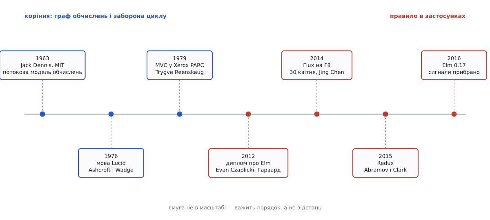
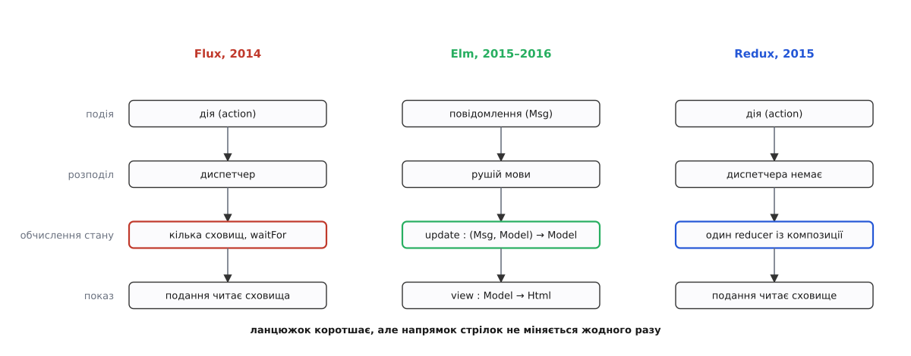

# 📜 Лічильник, диплом і реквізит до доповіді: звідки взялася заборона писати звідусіль

Правило «дані течуть в один бік» не вивели з теорії — його виштовхнули три дуже різні події: багаторічна скарга на лічильник непрочитаних повідомлень у Facebook, студентський диплом про мову для інтерфейсів і бібліотека, яку автор писав як реквізит до конференційного демо. Ця вставка розбирає, що саме кожен із них додав, які тези тоді ж оспорили — і чому корінь ідеї насправді на півстоліття старший за все перелічене.

## Баг, який лікували щоразу заново

Історія починається зі скарги, яку легко переказати й неможливо відтворити. У Facebook значок повідомлень показував, що є нові, — людина відкривала список, а там порожньо. Значок гаснув, за якийсь час з'являвся знову, і все повторювалось. Команда знаходила винне місце, виправляла, лічильник поводився чемно кілька тижнів — а тоді та сама скарга приходила з іншого куточка сайту. *(Статус: переказ доповіді Facebook на F8 2014; вторинні джерела того ж року передають його однаково, точних номерів тікетів у публічному доступі немає.)*

Ключове тут — не сам баг, а те, що з ним було не так як зі звичайним багом. Звичайний баг має місце проживання: рядок, функція, модуль. Цей його не мав. Кількість непрочитаних повідомлень була фактом, який знали й міняли багато місць одразу: обробник вхідного повідомлення з сервера, код відкриття списку, код позначки «прочитано», окремий віджет чату, окремий значок у шапці. Кожне з них мало право записати нове значення, і кожен запис міг розбудити інше місце, яке теж мало це право. Виправити один шлях означало виправити один шлях — а не схему, у якій таких шляхів десятки.

Саме така діагностика й стала змістом доповіді: винен не код, винен **напрямок**. Дані ходили в обидва боки, зміна могла повернутися до себе через ланцюжок сповіщень, і жоден локальний огляд коду цього не показував.

## 30 квітня 2014: F8, схема Flux і теза, яку оспорили того ж тижня

Facebook провів конференцію F8 **30 квітня 2014 року** в Сан-Франциско — уперше майже за три роки, з 2011-го. *(Усталений факт.)* Доповідь називалась «Hacker Way: Rethinking Web App Development at Facebook»; виступали **Tom Occhino**, **Jing Chen** і **Pete Hunt**, запис виклали на початку травня. *(Усталений факт.)*

Схему потоку даних, яку там показали й назвали **Flux**, подавала Jing Chen, інженерка Facebook; у пізніших публікаціях і в документації самої бібліотеки її називають автором цієї архітектури. *(Статус: усталено у вторинних джерелах і документації проєкту; формального «патенту на ідею» тут, звісно, немає.)* Схема була навмисно простою: подія перетворюється на **дію** (action), дія йде в єдиний **диспетчер** (dispatcher), диспетчер віддає її **сховищам** (stores), і лише сховище має право змінити свій шматок стану; подання читає сховища й нічого в них не пише. Стрілки в цій схемі йдуть по колу, але ніде не завертають назад.

Одна деталь Flux заслуговує окремої згадки, бо в ній видно справжню задачу. Диспетчер мав операцію `waitFor`: сховище могло сказати «спершу обнови ось те, я від нього залежу». Це руками виписаний **порядок обходу залежностей** — те саме, що в графі перерахунку робить упорядкування за висотою вузла. Flux не знайшов нового способу уникнути неузгоджених проміжних станів; він просто зробив місце, де цей порядок можна задати явно, а не сподіватися на випадковий порядок сповіщень.

Разом зі схемою прозвучала теза, що пішла гуляти світом: **«MVC не масштабується»**. Її сформулював Tom Occhino, а Jing Chen обґрунтовувала на прикладі: для маленького застосунку [модель–подання–контролер](topic:sf-apps/mvc) чудова, але коли моделей і подань стають сотні й вони посилаються одне на одного, складність вибухає. *(Статус: усталено, що теза прозвучала саме так; сама теза — формулювання компанії про власний код, а не доведене твердження.)*

Оспорювати почали одразу. Найсильніше заперечення було не про масштаб, а про предмет: схема MVC, яку намалювали на слайді як «до», з оригінальним MVC збігалася погано, а на слайді «після» багато хто впізнав рівно те саме MVC, лише з новими іменами. *(Статус: оспорюване; закиди зафіксовані в оглядах травня 2014 і в тодішніх обговореннях.)* Заперечення небезпідставне: у [початкових нотатках Трюгве Реенскауга 1979 року](topic:sf-apps/mvc/hist-mvc-birth.md) подання читає модель і не володіє нею, а взаємне писання моделей одна в одну там не описане взагалі.

Відповідь надійшла від самої Jing Chen і вона важливіша за суперечку про назви: мішенню Flux є не MVC, а **двобічний потік даних, у якому одна зміна може завернути назад і потягти за собою каскад**. *(Статус: усталено, уточнення авторки зафіксоване в тодішній публікації.)* Тобто справжня теза звучить вужче й перевіряється легше: погано масштабується не трилітерна абревіатура, а свобода писати з багатьох місць — байдуже, у якій архітектурі вона живе.

## Elm: диплом 2012 року, у якому ще немає «архітектури Elm»

Другу лінію заведено плутати з першою, тому варто розділити дві дати.

**30 березня 2012 року** Evan Czaplicki подає в Гарварді дипломну роботу «Elm: Concurrent FRP for Functional GUIs». *(Усталений факт: дата стоїть на титульній сторінці самої роботи.)* Робота присвячена [функціональному реактивному програмуванню](topic:sf-apps/functional-reactive-programming) — підходу, у якому програма описується як набір значень, що змінюються в часі, і залежностей між ними, а не як послідовність команд. Дві головні заявлені новинки диплома — чисто функціональна компонівка графіки й підтримка одночасності в такому обчисленні.

Чого в тій роботі **немає** — так це трійці «модель — оновлення — подання». Ланцюжок, який згодом стали називати архітектурою Elm, у 2012-му ще не сформульовано; мова тоді трималася на **сигналах** — значеннях, що самі змінюються в часі.

Назва й опис з'явилися пізніше й — за свідченням самого автора — не як винахід. Репозиторій `evancz/elm-architecture-tutorial` створено **11 січня 2015 року**. *(Усталений факт: дата створення репозиторію.)* Його пояснення каже, що цей уклад **проступив сам**: різні програмісти на Elm незалежно приходили до одного й того самого крою коду, і залишалося цей крій описати. *(Статус: власне свідчення автора; перевірити «самозародження» ззовні неможливо, але жодного конкурентного претендента на авторство немає.)*

Третя дата в цій лінії — **10 травня 2016 року**, випуск Elm 0.17 і стаття «A Farewell to FRP». *(Усталений факт.)* Тоді з мови прибрали сигнали як поняття, а замість них ввели команди й підписки: ефект більше не виконується всередині обчислення стану, він описується значенням, яке рушій мови виконує сам. *(Усталений факт.)*

Тут і криється справжній внесок Elm у нашу тему, і він не «ми були перші». Внесок у тому, що мова прибрала **альтернативу**. У Flux однонапрямленість — домовленість: сховище може виставити метод-присвоєння, і схема тихо зламається. В Elm немає ні змінних, ні присвоєння, ні способу викликати ефект посеред обчислення — цикл у графі оновлень не те щоб не рекомендується, його **нема де записати**. Різниця та сама, що між правилом техніки безпеки й огорожею.

*Три ранні точки — про моделі обчислення й про поділ ролей; чотири пізні — про те, як заборона циклу стала повсякденним правилом прикладного програмування. Смуга не в масштабі: важить порядок, а не відстань.*

## Redux: бібліотека, що народилася як реквізит до демонстрації

Третя лінія починається не з архітектурної потреби, а з обіцянки на конференції.

Dan Abramov подав на ReactEurope 2015 доповідь про **гаряче перезавантаження** — підміну коду в застосунку, що вже працює, без перезапуску й без утрати стану — **з перемоткою часу**. За його власним переказом, тему він запропонував, не маючи уявлення, як ту перемотку реалізувати. *(Статус: власне свідчення автора в інтерв'ю; жодних суперечливих версій.)*

Далі логіка сама веде в один бік, і варто пройти нею крок за кроком. Щоб відмотати застосунок на три дії назад, треба вміти **відтворити** його стан. Відтворити стан можна лише тоді, коли він однозначно визначається початковим значенням і послідовністю дій, — тобто коли функція переходу [чиста](topic:sf-apps/pure-functions-side-effects) і нічого не питає в зовнішнього світу. Перша спроба — «гарячий завантажувач для Flux» — розбилася саме тут: сховища Flux виконували побічні ефекти всередині себе, і прокрутити їх наново було неможливо.

Розв'язок Abramov знайшов у вже описаній на той час архітектурі Elm: сигнатура `(дія, стан) → стан` давала рівно те, чого бракувало. Другу половину додав **Andrew Clark**, автор Flummox — однієї з тодішніх реалізацій Flux. Його ідея: якщо кілька функцій-переходів уміють складатися в одну кореневу, то диспетчер стає непотрібним — його роботу виконує сама композиція. *(Усталений факт: обидва названі авторами Redux, внесок Clark описано в документації проєкту й у інтерв'ю Abramov.)*

Дати цієї лінії щільні: репозиторій Redux створено **29 травня 2015 року**, першим випуском називають **2 червня 2015**, доповідь «Live React: Hot Reloading with Time Travel» прозвучала на ReactEurope у Парижі на початку липня 2015-го (запис виклали 5 липня). *(Усталений факт: дата створення репозиторію; дата випуску подається довідковими джерелами, дата доповіді — за публікацією запису.)*

Позичене Redux ніколи не приховував. Розділ документації «Prior Art» прямо каже, що бібліотека розвиває ідеї Flux і бере підказки в Elm, а «оновлювачі» Elm виконують ту саму роль, що редюсери в Redux. *(Усталений факт: текст офіційної документації.)*

*Від покоління до покоління з ланцюжка зникають ланки — спершу окремі сховища, потім диспетчер. Напрямок стрілок при цьому не змінюється жодного разу: усе, що прибирали, було не потоком, а обслугою потоку.*

> 🔧 **Навіщо це.** Порядок причин у цій історії протилежний до того, як її переказують. Не «архітектуру придумали, а перемотка виявилася приємним наслідком», а навпаки: **вимогою була перемотка**, чистота переходу — ціною, яку довелося за неї заплатити, а архітектура — тим, що лишилося, коли ціну сплатили. Той самий хід у більшому масштабі — коли журнал подій стає головним сховищем, а стан лише його згорткою — давно відомий як [event sourcing](topic:sf-apps/event-sourcing), і саме тому обидві схеми дають однакову побічну вигоду: історію, яку можна програти наново.

## Коріння: 1963, 1976 і схема, якій цикл заборонено фізикою

Тепер найважливіше застереження до всієї попередньої розповіді. Жодна з трьох подій не винайшла ідеї «граф обчислень без циклів». Її винайшли значно раніше й з іншого приводу.

**Потокова модель обчислень.** 1963 року **Jack Dennis** заснував у MIT групу Computation Structures Group і керував нею понад два десятиліття. *(Усталений факт за некрологом MIT CSAIL; сам Dennis помер 14 березня 2026 року у віці 94 років.)* Задача, яку група розв'язувала, з інтерфейсами не мала нічого спільного: як виконувати програму паралельно, не маючи лічильника команд. Відповідь — [потокова архітектура](topic:hw-arch/dataflow-architecture): програма є **графом**, вершини — операції, ребра — передавання значень, і операція спрацьовує тієї миті, коли на її входах з'явилися всі потрібні дані. Порядок виконання ніхто не задає — його задає сам граф. Найвідоміша рання праця цієї лінії — «A Preliminary Architecture for a Basic Data-Flow Processor» Dennis і David Misunas, 1975. *(Усталений факт.)*

Зверніть увагу, що звідси випливає без жодного додаткового припущення: у такому графі цикл без спеціального оброблення означає операцію, яка чекає на власний результат. Не «поганий стиль» — просто неможливість почати.

**Мова Lucid.** 1976 року з'явилася мова **Lucid** — **Edward Ashcroft** і **William Wadge**. *(Усталений факт; ключові публікації: стаття в SIAM Journal on Computing 1976 і «Lucid, a nonprocedural language with iteration» у Communications of the ACM за липень 1977.)* Змінна в Lucid — не комірка, яку присвоюють, а **нескінченний потік значень у часі**; програма є системою рівнянь, і кожне рівняння описує вузол мережі та зв'язки, якими крізь неї течуть дані.

Тут потрібна чесна поправка, бо її часто пропускають. Lucid **задумували не як потокову мову**: початковою метою була мова з одноразовим присвоєнням, у якій легко доводити властивості програм. Потокове тлумачення прийшло згодом і стало настільки визначальним, що книжка 1985 року вже так і називається — «Lucid, the Dataflow Programming Language». *(Статус: усталено, задокументовано в описах історії самої мови.)* Тобто зв'язок «немає присвоєння → виходить потік» тут не спроєктували, а виявили — і це той самий зв'язок, який через сорок років перевідкриють в Elm.

**Синхронна цифрова схема.** А тут вимога взагалі не має статусу поради. Комбінаційна логіка мусить бути ациклічною: замкнене кільце вентилів без регістра не має визначеного стану, і синтезатор його не збирає. Зворотний зв'язок у схемах, звісно, є — без нього немає ні лічильника, ні пам'яті, — але замикається він **тільки через регістр**, тобто по такту. Такт визначає єдину мить, коли новому дозволено стати старим; дія в застосунку грає ту саму роль. І [коротка неправдива голка на виході вентиля](topic:hw-digital/glitch-combinational), коли сигнал розходиться гілками різної довжини й сходиться назад, — це буквально та сама неузгоджена мить, від якої тікають упорядкованим обходом графа в програмі; навіть слово для неї взяли схемотехнічне.

## Що з усього цього справді було новим

Підсумок цієї історії неприємний для маркетингу й корисний для роботи.

Нового в **самій схемі** не було нічого. Граф без циклів, обхід у порядку залежностей, стан як згортка послідовності подій, обчислення без присвоєння — усе це існувало щонайпізніше з 1970-х і бралося з різних, не пов'язаних між собою причин: паралельне виконання, доказовість програм, синтез схем.

Новим було три речі. Перша — **масштаб заборони**: правило застосували не до підсистеми й не до одного графа перерахунку, а до всього застосунку, включно з мережею й таймерами. Друга — **готовність платити церемонією**: описувати кожну подію окремим значенням-наміром дорожче, ніж написати присвоєння, і до 2014-го цю ціну масово вважали невиправданою. Третя, і, схоже, вирішальна — **інструмент як аргумент**: перемотка історії на екрані переконала більше людей, ніж будь-яке міркування про графи, бо показала вигоду, якої в схемі з розкиданими записами не буває взагалі.

І окремо про те, що лишилося оспореним. Теза «MVC не масштабується» так і не стала фактом — вона й досі формулювання компанії про власний код. Те, що справді підтверджується щоденною практикою, звучить вужче й скромніше: погано масштабується **право писати з багатьох місць**. Ідея [реактивних потоків](topic:sf-apps/reactive-programming), потокові машини MIT, рівняння Lucid, регістр у синхронній схемі та лічильник непрочитаних повідомлень у Facebook відповідають на це право однаково — звужують його до однієї названої точки.
