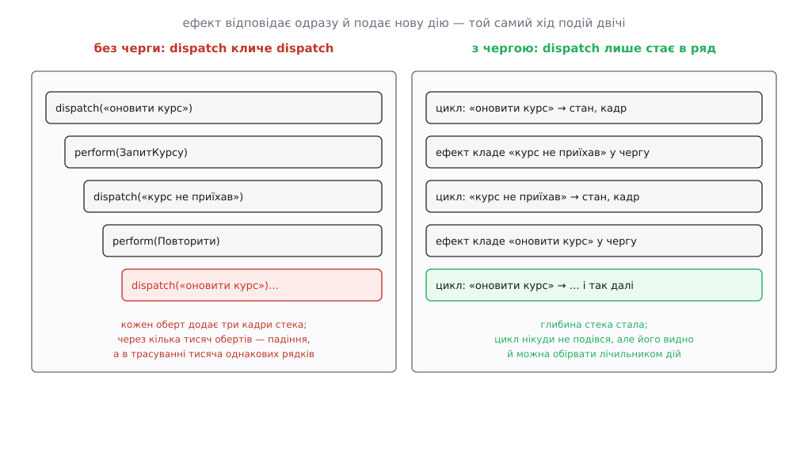
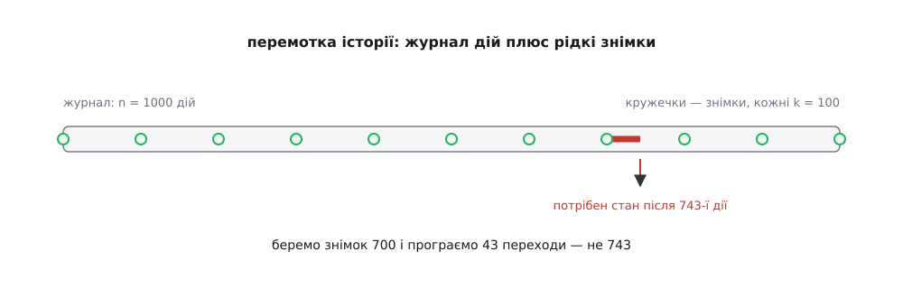

# ⚙️ Крихітний однонапрямлений двигун: сто рядків C++, у яких немає магії

Увесь механізм однонапрямленого потоку — стан, дія, чистий перехід, черга дій і ефекти — вміщається приблизно в сотню рядків, і написати їх власноруч варто рівно для того, щоб у жодному каркасі більше нічого не доводилося приймати на віру. Заразом на видноті опиняється найтонша деталь, яку каркаси ховають і яку майже кожен пише неправильно з першого разу: **черга**.

Мова тут C++, бо вона нічого не дарує. Немає збирача сміття, який зробив би копіювання стану непомітним; немає динамічної типізації, яка дозволила б «дії» бути будь-чим. Кожна ціна тут вимірна, і саме тому на цьому матеріалі видно, де двигун коштує дорого, а де — нічого.

## Що будуємо

Шість частин, кожна з яких — звичайний код без жодної бібліотеки:

1. **`State`** — усе, що програма пам'ятає між подіями, в одній структурі.
2. **`Action`** — замкнений набір описів того, **що сталося**.
3. **`update`** — чиста функція `(стан, дія) → новий стан + перелік ефектів`.
4. **`view`** — чиста функція `стан → картинка`.
5. **`Store`** — цикл, що бере дії з черги по одній і має єдине право записати новий стан.
6. **`Io`** — тонка оболонка, яка виконує ефекти й повертає результат новою дією.

Начинка — вікно обміну валют: людина набирає суму, курс приїжджає з мережі, стан переживає перезапуск. Начинка тут другорядна; цікавий сам двигун.

## Стан і дії — звичайні значення

```cpp
#include <cstdio>
#include <deque>
#include <memory>
#include <string>
#include <variant>
#include <vector>

// ── Стан: усе, що застосунок пам'ятає між подіями ────────────────────────
enum class Field { Usd, Eur };

struct State {
    Field       entered = Field::Usd;  // яке поле набрала людина
    long long   amount  = 0;           // набране число в сотих (центах)
    long long   rate    = 92;          // курс у сотих: 0.92 євро за долар
    bool        pending = false;       // запит курсу вже в дорозі
    std::string note;                  // рядок для людини
};

// ── Дії: описи того, що сталося. Самі нічого не роблять ──────────────────
struct Typed      { Field field; long long amount; };
struct RateAsked  { };
struct RateCame   { long long rate; };
struct RateFailed { std::string why; };

using Action = std::variant<Typed, RateAsked, RateCame, RateFailed>;

// ── Ефекти: описи того, що має зробити оболонка ──────────────────────────
struct FetchRate { };
struct Persist   { };
struct Retry     { int after_ms; };

using Effect = std::variant<FetchRate, Persist, Retry>;
```

Дві дрібниці тут важать більше, ніж здається.

**Гроші — цілі числа в сотих.** Не `double`. Курс теж ціле: `92` замість `0.92`. Це не педантизм, а вимога до перемотки історії, яка з'явиться нижче: журнал дій має відтворювати стан **біт у біт**, а плавуча кома цього не обіцяє між різними машинами й режимами округлення.

**`Action` — це `std::variant`, а не базовий клас із нащадками.** Різниця в одному слові: набір **замкнений**. Компілятор знає всі можливі дії, і коли ти розбираєш дію через `std::visit`, забута гілка — не мовчазна поведінка за умовчанням, а помилка компіляції. Список дій — це, по суті, повний перелік того, що взагалі може статися з програмою; тримати цей перелік замкненим і видимим на одному екрані дає більше, ніж будь-яка гнучкість. Обидва інструменти прийшли зі стандартом C++17 ([`variant` і `visit`: одне з кількох](topic:sys-plang-cpp/variant-and-visit) — тип-сума, що зберігає рівно одну з кількох альтернатив, і функція, яка викликає потрібну гілку залежно від того, яка альтернатива зараз жива).

І головне: `RateAsked` не означає «сходи в мережу». Він означає «людина натиснула кнопку оновлення курсу». Дія розповідає про минуле, а не наказує майбутнє — саме тому її можна записати в журнал і програти вдруге.

## Перехід — єдина функція, що народжує стан

```cpp
// Набір лямбд як один викликаний об'єкт — типовий супутник std::visit
template <class... Fs> struct overload : Fs... { using Fs::operator()...; };
template <class... Fs> overload(Fs...) -> overload<Fs...>;

struct Step {
    State               state;    // нова версія стану
    std::vector<Effect> effects;  // що просимо зробити оболонку
};

Step update(const State& s, const Action& a) {
    Step step{ s, {} };      // копія старого стану — її й правимо
    State& n = step.state;

    std::visit(overload{
        [&](const Typed& t) {
            n.entered = t.field;
            n.amount  = t.amount;
            n.note.clear();
            step.effects.push_back(Persist{});
        },
        [&](const RateAsked&) {
            if (n.pending) return;            // запит уже в дорозі, другий не потрібен
            n.pending = true;
            n.note    = "оновлюю курс…";
            step.effects.push_back(FetchRate{});
        },
        [&](const RateCame& r) {
            n.pending = false;
            n.rate    = r.rate;
            n.note.clear();
            step.effects.push_back(Persist{});
        },
        [&](const RateFailed& f) {
            n.pending = false;
            n.note    = "курс не приїхав: " + f.why;
            step.effects.push_back(Retry{ 3000 });
        },
    }, a);

    return step;
}
```

Функція чиста, хоч усередині й видно присвоєння. [Чистота](topic:sf-apps/pure-functions-side-effects) — це властивість щодо **зовнішнього світу**: результат залежить лише від аргументів, і поза функцією нічого не змінюється. Правка локальної копії `step.state` цьому не суперечить: копія народилася тут-таки й нікому, крім викликача, не належить. Плутати чистоту з відсутністю присвоєнь — поширена помилка, яка змушує писати нечитабельний код без жодного зиску.

Другий гвіздок: `update` не ходить у мережу, а **описує** похід. `FetchRate{}` — це порожня структура, шматок даних. Хто його виконає й коли — не її справа. Той самий поділ, що і в [функціональному ядрі з імперативною оболонкою](topic:sf-apps/functional-core-imperative-shell): усі рішення ухвалює чиста частина, усі дотики до світу робить тонка зовнішня. Без цього поділу перемотка історії, до якої ми дійдемо, була б неможлива: програючи журнал удруге, ефекти треба **викинути**, а викинути можна лише те, що є окремим значенням.

## Подання — теж функція

```cpp
struct Screen { long long usd, eur; std::string note; };

static long long to_eur(long long cents, long long rate) {   // × rate/100
    return (cents * rate + 50) / 100;
}
static long long to_usd(long long cents, long long rate) {   // ÷ rate/100
    return (cents * 100 + rate / 2) / rate;
}

Screen view(const State& s) {
    if (s.entered == Field::Usd)
        return { s.amount, to_eur(s.amount, s.rate), s.note };
    return { to_usd(s.amount, s.rate), s.amount, s.note };
}
```

У стані лежить **одне** число й позначка, у якому полі його набрали. Друге поле обчислюється щоразу наново й ніде не зберігається — тому розійтися їм ніде. Наберіть `1234.56` доларів: `to_eur(123456, 92) = (11357952 + 50) / 100 = 113580`, тобто `1135.80`. Набране число при цьому лишається рівно таким, як його набрали, скільки б разів картинку не перемальовували.

Округлення тут явне й одне на всю програму — `+ 50` перед діленням на сто дає округлення до найближчого цента. Обидві функції припускають невід'ємні суми; для від'ємних цілочислове ділення в C++ відтинає до нуля, і формулу довелося б писати інакше.

## Наївний двигун і три місця, де він рветься

Найкоротший спосіб склеїти все докупи виглядає так — і саме його пишуть першим:

```cpp
class NaiveStore {                        // ← так робити не треба
public:
    void dispatch(const Action& a) {
        Step step = update(state_, a);
        state_ = std::move(step.state);
        io_.paint(view(state_));
        for (const Effect& e : step.effects) perform(e);   // ← perform кличе dispatch
    }
private:
    void perform(const Effect& e);
    State state_;
    Io&   io_;
};
```

Поки ефекти відповідають десь у майбутньому — усе працює. Ламається воно тієї миті, коли ефект відповідає **одразу**: кеш влучив, заглушка в тесті повертає готове, сервер відповів помилкою ще до виходу з функції. Тоді `perform` кличе `dispatch`, і другий `dispatch` починається, поки перший ще не скінчився. Це та сама [реентерабельність](topic:sf-tasks/reentrancy) — повторний вхід у функцію, що вже виконується, — тільки без жодних потоків і переривань, самим лише синхронним зворотним викликом.

Ось що з цього виходить.

**Перше: стек росте необмежено.** Візьміть найзвичайнісіньку пару «не вдалося → спробувати ще раз». `RateFailed` просить ефект `Retry`, оболонка через паузу подає `RateAsked`, той просить `FetchRate`, сервер знову лежить — і `RateFailed` приходить знову. Кожен оберт додає три кадри стека й **жодного не знімає**, бо зовнішній `dispatch` досі стоїть у циклі по ефектах і чекає повернення. Через кілька тисяч обертів програма падає з переповненням стека, а в трасуванні — тисяча однакових рядків, з якої не видно ні першої дії, ні того, хто закрутив колесо.

**Друге: ефекти виконуються не в тому світі, для якого їх вирішили.** `step.effects` обчислено для версії стану `s₁`. Якщо перший ефект списку подає дію, стан стає `s₂` — а решта списку ще не виконана. `Persist{}`, який мав зберегти `s₁`, збереже `s₂`; аналітика запише не ту подію; запит піде з полями, яких перехід не бачив. Помилка при цьому не там, де її видно: у момент розбору всі значення вже узгоджені.

**Третє, суто C++: посилання на стан переживає підміну.** Якщо оболонці зручно було передати `const State&` на `state_`, то після вкладеного `dispatch` це посилання дивиться вже на інший вміст — а посилання чи ітератор **всередину** його векторів і рядків після присвоєння просто висять. Тут наївна схема перестає бути питанням чистоти дизайну й стає невизначеною поведінкою.



*Один і той самий хід подій. Ліворуч кожна нова дія починається всередині попередньої — і стек росте, доки не скінчиться. Праворуч дія лише стає в ряд, а розбирає її той самий цикл, що вже крутиться.*

Зверніть увагу, чого черга **не** робить: вона не прибирає кільце «дія → ефект → дія». Кільце лишається, і в прикладі з повторами воно й далі крутиться без кінця. Але тепер це рівний цикл із плоским стеком — його видно в лічильнику дій, його можна обірвати, про нього можна написати перевірку. Різниця між помилкою, яку видно, і помилкою, яка валить процес, — це вся різниця.

## Черга: перетворити вкладення на послідовність

Виправлення коротке. Дія не обробляється на місці — вона стає в чергу, і рівно один цикл розбирає її:

:::tabs
```cpp
class Store {
public:
    Store(State initial, Io& io) : state_(std::move(initial)), io_(io) {}

    void dispatch(Action a) {
        queue_.push_back(std::move(a));
        if (running_) return;          // цикл уже крутиться — він забере й цю дію
        running_ = true;

        while (!queue_.empty()) {
            Action cur = std::move(queue_.front());
            queue_.pop_front();

            log_.push_back(cur);                 // журнал: що прийшло і в якому порядку
            Step step = update(state_, cur);     // єдине місце, де народжується стан
            state_ = std::move(step.state);
            io_.paint(view(state_));             // рівно один кадр на завершену версію

            for (const Effect& e : step.effects) // dispatch звідси лише стає в чергу
                perform(e);
        }

        running_ = false;
    }

    const State&               state() const { return state_; }
    const std::vector<Action>& log()   const { return log_; }

private:
    void perform(const Effect& e) {
        std::visit(overload{
            [&](const FetchRate&) { io_.fetch_rate(*this); },
            [&](const Persist&)   { io_.persist(state_); },
            [&](const Retry& r)   { io_.retry_after(r.after_ms, *this); },
        }, e);
    }

    State               state_;
    std::deque<Action>  queue_;
    std::vector<Action> log_;
    bool                running_ = false;
    Io&                 io_;
};
```
```ts
class Store {
  private queue: Action[] = [];
  private log: Action[] = [];
  private running = false;

  constructor(private state: State, private io: Io) {}

  dispatch(a: Action): void {
    this.queue.push(a);
    if (this.running) return;          // цикл уже крутиться — він забере й цю дію
    this.running = true;

    while (this.queue.length > 0) {
      const cur = this.queue.shift()!;

      this.log.push(cur);                    // журнал: що прийшло і в якому порядку
      const step = update(this.state, cur);  // єдине місце, де народжується стан
      this.state = step.state;
      this.io.paint(view(this.state));       // рівно один кадр на завершену версію

      for (const e of step.effects)          // dispatch звідси лише стає в чергу
        this.perform(e);
    }

    this.running = false;
  }

  private perform(e: Effect): void {
    switch (e.kind) {
      case "запит-курсу": this.io.fetchRate(this);              break;
      case "зберегти":    this.io.persist(this.state);          break;
      case "повторити":   this.io.retryAfter(e.afterMs, this);  break;
    }
  }
}
```
:::

Уся пам'ять двигуна — три поля: стан, черга й прапорець «цикл уже крутиться». Пройдімося тим, що кожен рядок купує.

**`if (running_) return;`** — це не оптимізація й не сторож проти рекурсії. Це домовленість про те, **хто саме** обробить дію: не той, хто її подав, а той, хто вже крутить цикл. Той, хто подав дію, у будь-якому разі повертається з `dispatch` одразу, і код після виклику ніколи не виконується «після того, як усе сталося». Це варто знати наперед, бо звичка писати `store.dispatch(X); assert(store.state().foo)` працює лише на верхньому рівні, а всередині ефекту — вже ні.

**`update(state_, cur)`** тепер безпечно бере посилання на член. Поки `update` рахується, покликати `dispatch` нема кому: чиста функція нікого не кличе. Уся оболонка живе **після** присвоєння — а значить, немає миті, коли `state_` міняється під ногами в того, хто його читає.

**`io_.paint(view(state_))` стоїть у циклі, а не після нього.** Кожна завершена версія стану дістає рівно один кадр, у своєму порядку. Проміжних кадрів не буває взагалі: нова структура з'являється вже цілою, а стара не мінялася.

**Малювання йде перед ефектами.** Спершу людина бачить «оновлюю курс…», і аж потім летить запит. Порядок безкоштовний і майже завжди правильний — картинка не має чекати на мережу.

Є й ощадливіший варіант: якщо дій за один прогін багато й малювати кожну задорого, кадр можна злити в один — підняти прапорець `dirty` у циклі й намалювати після нього. Тоді деякі версії стану не побачить ніхто, і це чесний компроміс: обіцянка не в тому, що кожна версія дістане кадр, а в тому, що жоден кадр не покаже суміші. Але порядок двох останніх рядків тоді стає принциповим — `running_ = false;` **перед** малюванням. Інакше дія, подана з подання, ляже в чергу, яку вже ніхто не розбирає, і застрягне там до наступного натискання.

## Оболонка: ефект — це опис, а не дія

```cpp
class Store;                       // оболонка вміє подавати дії назад

struct Io {
    virtual ~Io() = default;
    virtual void paint(const Screen&)        = 0;
    virtual void persist(const State&)       = 0;
    virtual void fetch_rate(Store&)          = 0;  // згодом → RateCame або RateFailed
    virtual void retry_after(int ms, Store&) = 0;  // згодом → RateAsked
};
```

У зібраному файлі цей блок стоїть **перед** `Store` — звідси й попереднє оголошення `class Store;`: оболонці досить знати, що такий тип існує, бо вона тримає лише посилання.

Уся межа зі світом — чотири рядки. За ними: справжня оболонка робить запит і колись подає результат дією; заглушка в тесті подає його негайно. Другий випадок і є тим найгіршим, який ми щойно навчилися переживати:

```cpp
struct FakeIo : Io {
    void paint(const Screen& sc) override {
        std::printf("USD %lld.%02lld | EUR %lld.%02lld | %s\n",
                    sc.usd / 100, sc.usd % 100,
                    sc.eur / 100, sc.eur % 100, sc.note.c_str());
    }
    void persist(const State&) override { }
    void fetch_rate(Store& st) override { st.dispatch(RateCame{ 94 }); }   // ← відповідь одразу
    void retry_after(int, Store& st) override { st.dispatch(RateAsked{}); }
};

int main() {
    FakeIo io;
    Store  store(State{}, io);

    store.dispatch(Typed{ Field::Usd, 123456 });   // набрано 1234.56
    store.dispatch(RateAsked{});                   // натиснуто «оновити курс»

    std::printf("дій у журналі: %zu\n", store.log().size());
}
```

Вивід:

```text
USD 1234.56 | EUR 1135.80 |
USD 1234.56 | EUR 1135.80 | оновлюю курс…
USD 1234.56 | EUR 1160.49 |
дій у журналі: 3
```

Три кадри на два натискання — бо дій було три: третя, `RateCame{94}`, прийшла з оболонки й стала в чергу, поки цикл ще крутився. Стек при цьому не поглибшав ні на кадр.

А тепер замініть у `fetch_rate` один рядок на `st.dispatch(RateFailed{"сервер мовчить"})` — і дістанете саме той повторний цикл із рисунка: `RateFailed → Retry → RateAsked → FetchRate → RateFailed`. З чергою це нескінченний, але рівний цикл, який видно в лічильнику. Без черги — падіння за секунду.

## Журнал і перемотка

Чистий перехід дає властивість, за яку все це й затівалося: пара «початковий стан + послідовність дій» **однозначно** визначає кінцевий стан. Отже, стан у будь-якій точці історії не треба зберігати — його можна обчислити:

```cpp
State replay(const State& initial, const std::vector<Action>& log, std::size_t upto) {
    State s = initial;
    for (std::size_t i = 0; i < upto && i < log.size(); ++i)
        s = update(s, log[i]).state;      // ефекти свідомо викидаємо
    return s;
}
```

Уся перемотка — шість рядків. Повзунок «на три дії назад» — це `replay(initial, log, log.size() - 3)`; уперед — те саме з більшим `upto`. Ніяких зворотних операцій, ніякого стека скасувань із двома реалізаціями на кожну команду: назад ідеться тим самим кодом, що й уперед.

Коментар про ефекти — найважливіший рядок функції. Програючи журнал удруге, замовлення надсилати не можна; ефекти для того й повертаються значеннями, щоб їх можна було просто не виконати. Той самий хід у більшому масштабі, коли журнал подій стає основним сховищем системи, називають [event sourcing](topic:sf-apps/event-sourcing); у межах одного вікна він дає звичне [скасування й повтор дії](topic:sf-apps/undo-redo-command-stack) — тільки без окремої «зворотної команди» на кожну дію.

Дві умови, без яких це не працює:

- **`update` не має права заглядати в годинник, генератор випадкових чисел чи глобальну змінну.** Усе таке заходить полем дії: не `now()` всередині переходу, а `RateCame{ rate, at }`. Інакше друге програвання дасть інший стан — і всі гарантії скасовуються.
- **`Action` має бути значенням, яке можна скопіювати й записати.** Ніяких вказівників на живі об'єкти всередині дії: збережений журнал переживе ті об'єкти.

Ціна перемотки — лінійна: щоб опинитися після `k`-ї дії, треба зробити `k` переходів. Уперед це безкоштовно (черговий крок — один перехід), а от стрибок назад коштує повного прогону з початку. Ліки звичні — рідкі знімки стану:



*Знімки міняють пам'ять на довжину стрибка: чим вони частіші, тим коротший добіг, але тим більше копій стану лежить одночасно.*

```
n дій у журналі, знімок кожні k дій

    пам'ять   = (n / k) · |State|
    стрибок   ≤ k переходів

    найменше max(k, n/k) — при k = √n
    n = 1000  →  k ≈ 32:  32 знімки, до 32 переходів на стрибок
```

На практиці `k` беруть більше за `√n` — на рисунку сто, — бо знімок стану коштує пам'яті помітно більше, ніж дія коштує часу: тридцять два переходи людина не помітить, а тридцять дві копії великого стану помітить одразу.

## Складність і пастки

**Копіювання стану коштує стільки, скільки він важить.** `Step step{ s, {} };` копіює стан цілком: кожна дія — `O(|State|)`. Поки стан — це п'ять полів, це ніщо. Щойно в ньому оселиться вектор на сто тисяч угод, кожне натискання клавіші копіюватиме сто тисяч угод. Ліки — не відмовлятися від копії, а зробити її дешевою: великі шматки тримати за спільним вказівником на **незмінне** значення.

```cpp
struct Deal       { long long amount; long long rate; };
struct DealClosed { Deal deal; };                  // ще одна дія

struct State {
    Field     entered = Field::Usd;
    long long amount  = 0, rate = 92;
    std::shared_ptr<const std::vector<Deal>> deals  // великий шматок
        = std::make_shared<const std::vector<Deal>>();
};

// гілка переходу, що додає угоду: клонуємо лише список, і лише тут
[&](const DealClosed& d) {
    auto next = std::make_shared<std::vector<Deal>>(*n.deals);
    next->push_back(d.deal);
    n.deals = std::move(next);
}
```

```
без спільного використання
    будь-яка дія:               O(|State|)

зі спільним вказівником на список
    дія, що не чіпає список:    O(1) + атомарний ++лічильник
    дія, що додає угоду:        O(|список|) — і лише вона
```

Копія стану тепер копіює вказівник, а не вміст: ціна дії пропорційна **зміненій** частині, а не всьому стану. Це той самий [copy-on-write](topic:sf-algorithms/copy-on-write-structures), тільки взятий не як оптимізація бібліотеки, а як крій стану; сплачується він атомарним [підрахунком посилань](topic:sf-lang/reference-counting), який на гарячому шляху теж не безкоштовний. Наступний щабель — персистентні дерева, де навіть змінена частина коштує `O(log n)`, бо клонується лише шлях від кореня, а решта гілок спільна.

Зворотний бік спільного використання — пам'ять. Поки старі версії стану живі (у знімках чи в купці кадрів перемотки), живі й усі списки, на які вони вказують. Журнал дій цієї проблеми не має — дії дрібні, — а от знімки тримають усе.

**Черга росте, коли перехід годує сам себе.** Дія, що безумовно породжує наступну, дає цикл, який не має де зупинитися. Двигун цього не вилікує — він лише зробить це видимим. Тому один рядок захисту вартий свого місця: лічильник дій за прогін, і на, скажімо, десяти тисячах — запис останніх двадцяти дій у журнал помилок та обрив. Це перетворює зависання на повідомлення з іменами дій, які його спричинили. Другий різновид росту — швидке джерело: рух миші чи літери в полі. Тут допомагає злиття однакових дій у хвості черги, але за нього платить журнал: злита послідовність уже не відтворює того, що людина насправді робила.

**Спокуса подати дію з переходу.** Виглядає невинно: «мені тут треба ще одну дію». Насправді це повернення рівно того кільця, від якого весь двигун і будувався: перехід перестає бути функцією й починає керувати часом. Захист тут структурний, а не дисциплінарний: у підписі `update(const State&, const Action&) → Step` немає куди подати — `Store` до функції не заходить, і жодна лямбда всередині його не бачить. Якщо колись у підписі з'явиться `Store&`, це вже не рефакторинг, а зміна архітектури, і видно її з першого рядка.

**Дія, що прикидається присвоєнням.** Найчастіше виродження виглядає так:

```cpp
struct SetPending { bool value; };        // ← не дія, а присвоєння манівцем
struct SetState   { State next; };        // ← і взагалі капітуляція
```

Формально потік лишається однонапрямленим: усе йде через `update`. Насправді перехід стає одним рядком `n.pending = a.value;`, і всі правила переїжджають до тих, хто дію подає. Журнал перестає щось розповідати: рядок «встановлено `pending = true`» не каже ні хто, ні чому, а програвши його вдруге, ти відтвориш наслідок, а не причину. Дія має називати **намір** — `RateAsked`, `RateFailed`, — і тоді все, що з наміру випливає, живе в одному місці.

**Один потік.** Написаний тут `Store` не має жодного захисту: два потоки, що кличуть `dispatch`, зіпсують `queue_` і `running_`. Черга, утім, робить лікування простим — на відміну від наївної версії, де довелося б захищати весь ланцюг викликів. Досить прикрити м'ютексом дві операції з чергою, а сам цикл лишити на одному потоці: інші лише кладуть дії в ряд. Стан при цьому й далі має рівно одного письменника — тепер уже в буквальному, а не лише архітектурному сенсі.

**Дрібниця про `std::move`.** У циклі дія витягається з черги переміщенням, а `state_ = std::move(step.state)` не копіює стан удруге. На дрібному стані це шум, на великому — половина ціни кадру; [семантика переміщення](topic:sys-plang-cpp/move-semantics) тут не прикраса, а те, що робить схему «нова версія замість правки на місці» практичною.

І остання властивість, яка випливає з усього попереднього, хоч про неї ніхто окремо не домовлявся: двигун не знає нічого про інтерфейс. Ні `State`, ні `update`, ні `view`, ні `Store` не залежать ні від віконної бібліотеки, ні від мережі — увесь дотик до світу зібрано в чотирьох віртуальних функціях `Io`. Тому та сама сотня рядків однаково крутить і справжнє вікно, і тест, і консольну заглушку з `main` вище: міняється лише реалізація `Io`. А поведінка при цьому лишається тією самою рядок у рядок — бо визначає її журнал дій, а не оточення, у якому двигун запустили.
