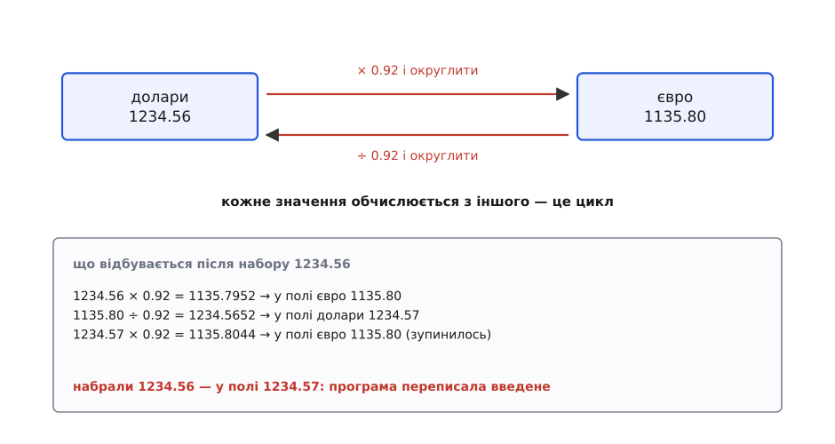
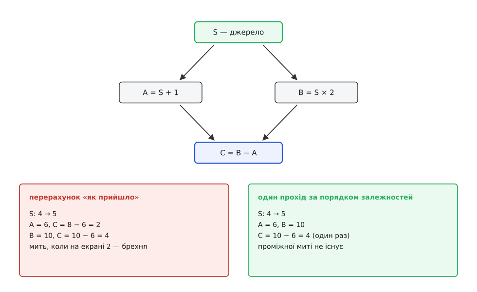
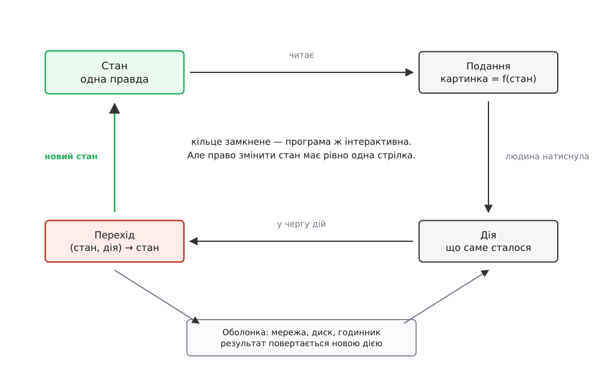

# Однонапрямлений потік даних

<preknowlist>
- [Спостерігач](topic:sf-apps/observer) — об'єкт сповіщає підписників про свою зміну, не знаючи, хто вони; на цьому механізмі тримається будь-яке автоматичне оновлення екрана.
- [Чисті функції і побічні ефекти](topic:sf-apps/pure-functions-side-effects) — функція залежить лише від аргументів і нічого не міняє навколо себе; саме такою тут буде функція, що обчислює новий стан.
- [Незмінність як прийом дизайну](topic:sf-apps/immutability) — нове значення замість правки на місці; звідси береться змога тримати кілька версій стану поруч і порівнювати їх.
- [Зчеплення і зв'язність](topic:sf-apps/coupling-cohesion) — скільки частини системи знають одна про одну; напрямок потоку даних — це передусім рішення, хто кому має право писати.
</preknowlist>

## Чотири рядки, які переписують введене

Вікно обміну валют: два поля, «долари» і «євро», курс 0.92 євро за долар. Правило зрозуміле без пояснень — щойно людина міняє одне поле, друге показує перераховану суму.

Найприродніший спосіб це записати — зв'язати кожне поле зі своїм числом в обидва боки, а на кожне число повісити перерахунок сусіда. Змінилось число доларів — перерахувати євро; змінилось число євро — перерахувати долари. Такий двобічний зв'язок поля зі значенням настільки звичний, що майже кожен інтерфейсний інструмент дає його готовим під назвою [прив'язка даних](topic:sf-apps/data-binding). Разом виходить чотири рядки, і вони працюють: набираєш у лівому полі — праве оновлюється, набираєш у правому — оновлюється ліве.

Тепер наберімо в полі доларів `1234.56`. Гроші показують до копійки, тому кожен переказ округлюється до двох знаків. Множимо: `1234.56 × 0.92 = 1135.7952`, у полі євро з'являється `1135.80`. Але поле євро щойно змінилось — а на нього повішено перерахунок доларів. Ділимо назад: `1135.80 ÷ 0.92 = 1234.5652…`, округлюємо — `1234.57`. І в полі доларів опиняється число, якого людина не набирала.



*Значення живлять одне одного, і кожен переказ округлює. Набране `1234.56` після одного оберту повертається як `1234.57` — програма переписала введене, хоча такого рядка ніхто не писав.*

Тут коло зупинилось на другому оберті — просто тому, що `1234.57 × 0.92 = 1135.8044` знову округлюється до `1135.80`, і третій оберт нічого не міняє. Це щастя, а не гарантія. Досить домовитись, що кожен переказ округлює **вгору** (магазин рахує на свою користь), і те саме коло з тих самих чотирьох рядків уже не зупиняється ніколи: при курсі 0.8 послідовність `11 → 9 → 12 → 10 → 13 → 11 → 14 →…` росте без кінця, поки вікно не завмре.

Один і той самий код, різниця лише в правилі округлення — і в одному випадку тихо псуються дані, а в іншому програма зависає. Означає це просте: у коді сидить механізм, поведінку якого ніхто не аналізував.

## Цикл у графі оновлень

Щоб побачити механізм, намалюймо граф. Вузли — значення, які можуть змінюватися. Стрілка `A → B` означає «зміна `A` тягне перерахунок `B`». Перша прив'язка дає стрілку «долари → євро», друга — «євро → долари». Разом виходить **цикл**: із будь-якого вузла, йдучи за стрілками, повертаєшся в нього ж.

Цикл у такому графі — це не помилка в рядку коду, це властивість схеми. І з неї одразу випливають три речі.

**Перше: зупинка не гарантована.** Оберт за обертом система шукає таку пару чисел, яка після перерахунку дає саму себе — нерухому точку. Коли перерахунок точний, будь-яка пара нерухома одразу. Але округлення — то вже інша функція, і в неї нерухомої точки може не бути зовсім; тоді значення ходять по колу або тікають у нескінченність. Ніхто цього не проєктував: ітеративний пошук нерухомої точки народився сам собою з двох невинних прив'язок.

**Друге: результат залежить від того, звідки почали.** Набери `1234.56` в долари — отримаєш пару `(1234.57, 1135.80)`. Набери `1135.80` в євро — отримаєш `(1234.57, 1135.80)` теж, але вже без спотворення введеного. Одна й та сама пара чисел, різна історія — різні наслідки для людини. У циклічній схемі «правильної відповіді» немає, є відповідь, залежна від маршруту.

**Третє, найпідступніше: немає миті, коли стан узгоджений.** Поки оберт триває, одні значення вже нові, інші ще старі. Усе, що дивиться на систему збоку — екран, журнал, запит на сервер, — може влучити саме в цю мить і побачити суміш. Помилка при цьому не в тому вузлі, де її видно.

> 🔧 **Навіщо це.** Практична мірка проста: візьми будь-яке значення на екрані й спробуй відповісти, звідки воно взялося. У циклічній схемі чесна відповідь — «залежить від того, хто торкався його останнім і в якому порядку», а щоб її дати, треба перебрати всіх, хто має право писати. Саме тому такі баги майже не відтворюються з опису користувача: людина розповідає, **що** побачила, а причина ховається в **порядку** подій, якого вона не бачила й переказати не може.

## Латка-прапорець і чому вона не тримає

Перший рефлекс — поставити сторожа. Заводимо прапорець «я вже всередині оновлення» і на вході в перерахунок мовчки виходимо, якщо він піднятий:

```ts
let updating = false;

function onUsdChanged(usd: number) {
  if (updating) return;
  updating = true;
  eurField.value = round2(usd * rate);
  updating = false;
}
```

Цикл справді розривається — і разом із ним зникає видима проблема. Але подивімося, що ми насправді додали.

Прапорець — це **стан про стан**: змінна, чиє єдине призначення — приховати наслідки схеми, яку ми не виправили. Він живе поза обома значеннями й видимий обом, тобто це маленький [глобальний стан](topic:sf-apps/global-state) з усіма його властивостями. Поки полів два, він читається. Коли їх п'ять і кожне залежить від двох інших, кожен шлях запису мусить знати, чи не перебуває він усередині чужого оберту, — а таких шляхів уже не п'ять, а десятки. Один прапорець перетворюється на набір прапорців, і питання «чому це поле не оновилось» стає таким самим важким, як раніше було «чому воно оновилось двічі».

Гірше, що прапорець мовчки робить результат залежним від того, хто встиг першим. Другий перерахунок не відкладено — його **викинуто**. Якщо він мав донести справжню зміну (курс приїхав із сервера саме в цю мілісекунду), вона просто загубиться, і на екрані лишиться число, порахуване за старим курсом.

Є й другий різновид сторожа, ще непомітніший: «не пиши, якщо значення не змінилось». Він теж розриває коло — власне, саме він зупинив наш обмінник на другому оберті. Але ціна тут інша: замість зависання дістаємо тихе спотворення. Коло крутиться доти, доки значення не збіжаться, і зупиняється на першій же парі, що збіглася, — хай навіть у ній набране людиною число вже інше.

Обидві латки лікують симптом. Причина — цикл у графі — лишається на місці.

## Ромб: неузгоджена мить без жодного циклу

Припустімо, всі цикли з програми вигнано: залежності йдуть строго згори вниз, повернень немає. Одна біда все одно лишається — і зустрічається вона щодня.

Хай є джерело `S`, два похідні від нього значення `A = S + 1` і `B = S × 2` та третє, що споживає обидва: `C = B − A`. Циклу тут немає, граф ациклічний. Але коли `S` міняється з `4` на `5`, оновлення йде двома різними шляхами — і той, хто чекає на кінці, побачить не одну зміну, а дві.



*Той самий ромб залежностей із двома різними порядками перерахунку. Ліворуч кожна стрілка спрацьовує сама по собі, і між двома перерахунками `C` існує мить, коли на екрані `2` — значення, яке не відповідає жодному стану джерела. Праворуч усе, що залежить від `S`, перераховано один раз і в правильному порядку.*

Мить із неправильним `C` називають **глітчем** (англ. *glitch* — збій, коротка хиба). Слово прийшло з цифрової схемотехніки, і не випадково: у комбінаційній схемі, де сигнал розходиться двома гілками різної довжини й сходиться у вентилі, на виході так само вискакує коротка неправдива голка — [глітчі в комбінаційних схемах](topic:hw-digital/glitch-combinational) виникають рівно з тієї ж причини, що й тут. Різна довжина шляху до спільного споживача.

У програмі глітч рідко лишається косметичним. Якщо `C` — це не число на екрані, а умова «показати кнопку», кнопка блимне. Якщо це умова «надіслати запит» — запит піде з неправильними даними, і жоден журнал потім не пояснить чому: у момент розбору всі значення вже узгоджені.

Ліки видно з тієї ж картинки. Не треба поширювати зміну по кожній стрілці окремо, щойно вона стала відома. Треба на одну зміну джерела зробити **один прохід**, у якому кожен вузол перераховується після всіх, від кого залежить, — тобто в [топологічному порядку](topic:sf-algorithms/topological-sort). Тоді `C` обчислюється рівно раз і завжди з узгодженої пари. Заразом зникає й прихована ціна наївного поширення: у ланцюжку з кількох ромбів кількість зайвих перерахунків росте не додаванням, а множенням — [чому наївне поширення коштує 2ⁿ, а впорядкований прохід лінійний](topic:sf-apps/unidirectional-data-flow/math-glitch-propagation.md).

Отже, до схеми оновлень є дві вимоги. Граф має бути **ациклічним** — інакше немає ні гарантії зупинки, ні однозначної відповіді. І зміна має розходитись **одним проходом у порядку залежностей** — інакше з'являються миті, коли показане не відповідає нічому.

## Правило: писати в стан має право одне місце

Вимоги сформульовано, лишається їх забезпечити. Можна щоразу перевіряти конкретну схему на цикли й на порядок обходу — і в кожній новій підсистемі перевіряти знову. А можна влаштувати програму так, щоб цикл **не було де записати**.

Для цього потрібні три домовленості.

**Стан — одна структура даних.** Усе, що застосунок пам'ятає між подіями, лежить в одному значенні, а не розсіяне по полях віджетів, кешах і локальних змінних. Це не про один глобальний об'єкт на всю програму, а про те, що в кожного факту є **одне** місце проживання.

**Подання — чиста функція стану.** Картинка обчислюється зі стану: `картинка = f(стан)`. Подання нічим не володіє й нічого не пише — воно читає. Двох джерел правди про те, що показано, не існує: показано те, що випливає зі стану.

**Ввід не пише в стан.** Натискання, набір тексту, відповідь сервера не міняють нічого напряму. Кожна така подія перетворюється на **дію** (англ. *action*) — звичайне значення, яке описує, **що сталося**: «набрано текст у полі доларів», «натиснуто обміняти», «курс оновлено». Дія нічого не робить, вона розповідає.

І тоді єдиний, хто змінює стан, — **перехід**: чиста функція `(стан, дія) → новий стан`. Один вхід, один вихід, жодних сповіщень нікому.



*Кільце нікуди не зникло — інтерактивна програма без нього неможлива. Змінилося одне: право записати новий стан має рівно одна стрілка, і всі шляхи ведуть до неї.*

Ось обмінник, переписаний за цим правилом:

```ts
type State = { usd: number; eur: number; rate: number };

type Action =
  | { kind: "набрано-долари"; text: string }
  | { kind: "набрано-євро";   text: string }
  | { kind: "курс-оновлено";  rate: number };

function update(s: State, a: Action): State {
  switch (a.kind) {
    case "набрано-долари": {
      const usd = parseMoney(a.text) ?? s.usd;
      return { ...s, usd, eur: round2(usd * s.rate) };
    }
    case "набрано-євро": {
      const eur = parseMoney(a.text) ?? s.eur;
      return { ...s, eur, usd: round2(eur / s.rate) };
    }
    case "курс-оновлено":
      return { ...s, rate: a.rate, eur: round2(s.usd * a.rate) };
  }
}
```

Дивитися тут треба не на `switch`, а на те, чого в цьому коді немає. Немає перерахунку у відповідь на перерахунок: обидва числа народжуються **в одному місці, за один крок, з одного джерела**. Немає сповіщень — функція нікого не будить, вона повертає значення. А отже, немає й стрілки назад: із `update` не веде жоден шлях, який знову привів би в `update`. Циклу нема куди взятися, і прапорець-сторож стає непотрібним не тому, що ми домовились його не писати, а тому, що охороняти нічого.

Заразом зникає й ромб. Усе похідне обчислюється всередині одного переходу, у порядку, який задає сам код: спершу `usd`, потім `eur` із нього. Зовні видно лише готовий новий стан — проміжних станів просто не існує, бо стара структура не мінялася, а нова з'явилася вже цілою.

Правило це не вигадали з чистого аркуша: воно виросло з конкретного болю великих інтерфейсів і з набагато старшої традиції потокових обчислень — [як лічильник непрочитаних повідомлень у Facebook породив Flux, а Elm і Redux довели ідею до кінця](topic:sf-apps/unidirectional-data-flow/hist-flux-elm-redux.md).

## Похідне не зберігають

У переписаному обміннику лишився шов, і його варто добити. У стані живуть **обидва** числа, `usd` і `eur`, — хоча друге повністю визначається першим і курсом. Два поля для одного факту означають, що вони можуть розійтися: досить забути перерахунок у котромусь переході — і стан почне брехати сам собі.

Правильний крій — тримати в стані тільки те, що не виводиться:

```ts
type State = { entered: "usd" | "eur"; amount: number; rate: number };

const view = (s: State) => ({
  usd: s.entered === "usd" ? s.amount : round2(s.amount / s.rate),
  eur: s.entered === "eur" ? s.amount : round2(s.amount * s.rate),
});
```

Тепер набране число зберігається рівно таке, як його набрали, а друге поле — обчислюване подання, яке живе лише до наступного перемальовування. Розсинхронитися нема чому: розбіжність можлива тільки між двома копіями, а копія тут одна. Це і є **єдине джерело правди** — вимога, ширша за інтерфейс: [у кожного факту одне місце проживання, решта — похідне](topic:sf-apps/single-source-of-truth).

Ця вимога має і зворотний бік, про який часто забувають. Кеш похідного значення — річ законна й іноді необхідна (перерахунок буває дорогий). Але кеш мусить бути **явно позначений як кеш**: його можна викинути будь-якої миті й відновити з правди. Щойно щось починає читати кеш як істину — джерел правди знову двоє.

## Що це купує

Однонапрямлений потік коштує зусиль. Ось що дістається натомість — і за яким саме механізмом.

**Питання «звідки це значення» стає скінченним.** У схемі, де писати може будь-хто, відповідь вимагає перебрати всіх, хто має доступ до змінної. Тут стан міняє одна функція, тож достатньо знайти в ній гілки, що торкаються потрібного поля. Це різниця між пошуком по всьому проєкту і пошуком в одному файлі.

**Стан відтворюється точно.** Оскільки перехід чистий, пара «початковий стан + послідовність дій» однозначно визначає кінцевий стан. Ту саму послідовність можна записати, переслати й прокрутити наново — і дістати рівно ту саму картинку. Звіт про помилку перестає бути переказом («здається, я щось натиснув») і стає даними. Ця ж властивість дає покрокове відмотування назад: щоб опинитись у стані «три дії тому», досить програти журнал не до кінця. Той самий хід у більшому масштабі — коли журнал подій стає основним сховищем системи, а поточний стан лише його згорткою, — називають [event sourcing](topic:sf-apps/event-sourcing); на рівні одного вікна він же дає звичне [скасування й повтор дії](topic:sf-apps/undo-redo-command-stack).

**Один рендер на версію стану.** Оскільки подання читає готовий стан, а не підписується на кожне поле окремо, перемальовування природно робиться раз на завершений перехід. Глітчі зникають не через дисципліну програміста, а тому, що спостерігати проміжок ніде.

**Правила перевіряються без інтерфейсу.** Перехід — звичайна функція над звичайними значеннями: подав стан і дію, порівняв результат. Ні екрана, ні мокапів, ні очікування анімацій.

**Інваріантам є де жити.** Коли всі записи проходять крізь одні двері, там-таки можна перевіряти [інваріанти](topic:sf-apps/invariants) — умови, які мають виконуватися завжди («сума не від'ємна», «вибраний елемент існує в списку»). У схемі з багатьма письменниками таку перевірку довелося б дублювати в кожному з них — і одного забути.

> 🔧 **Навіщо це.** Найдорожча стаття витрат у роботі з живою системою — не написання коду, а розбирання скарг, які не відтворюються. Однонапрямлений потік б'є саме сюди: якщо клієнт разом зі скаргою присилає журнал дій, ти прокручуєш його в себе й бачиш ту саму помилку — не «схожу», а ту саму. Тому в застосунках із таким крієм відлагодження часто виглядає як перемотування плівки: смикаєш повзунок по історії дій і дивишся, на якому кроці стан став неправильним. Без чистого переходу така перемотка неможлива в принципі — прокрутити наново можна лише те, що не залежить від нічого зовнішнього.

## Куди подіти зовнішній світ

Чистий перехід не вміє ходити в мережу, читати годинник чи писати на диск — інакше він не був би чистим, а разом із чистотою пропала б і відтворюваність. Але застосунок без мережі й диска нікому не потрібен, тож питання не «чи робити ефекти», а «де саме».

Відповідь: перехід не **виконує** ефект, він його **описує**. Функція повертає новий стан і, за потреби, перелік того, що треба зробити зовні. Виконує це тонка зовнішня оболонка, а результат приносить назад — теж дією. Це той самий поділ, що і в [функціональному ядрі з імперативною оболонкою](topic:sf-apps/functional-core-imperative-shell), просто застосований до циклу подій інтерфейсу.

Найкраще видно на оптимістичному оновленні. Людина натиснула «замовити»:

1. дія `замовлення-надіслано` → перехід ставить у стан позначку «надсилається» і повертає опис ефекту «зробити запит»;
2. оболонка робить запит;
3. відповідь приходить дією `замовлення-підтверджено` або `замовлення-відхилено` → перехід або знімає позначку, або **відкочує** зміну й показує помилку.

Відкат тут — не окремий механізм зі збереженням копій, а звичайний перехід, такий самий, як усі інші. Саме тому [оптимістичне оновлення інтерфейсу](topic:sf-apps/optimistic-ui-update) в однонапрямленій схемі пишеться просто, а в схемі з розкиданими записами перетворюється на полювання за тим, хто ще встиг щось змінити, поки летіла відповідь.

Лишається одна тонкість, без якої вся конструкція розсипається. Якщо дозволити подавати дію **всередині** переходу, цикл повернеться тим самим шляхом, яким ми його вигнали. Тому дії ставлять у чергу й обробляють по одній: поки один перехід рахується, наступна дія чекає. Черга — це не деталь реалізації, а частина правила; як вона виглядає в коді разом з усім рушієм, показано в [маленькому однонапрямленому двигуні на C++](topic:sf-apps/unidirectional-data-flow/proj-tiny-store.md).

## Ціна й пастки

Платять за це правило в кількох місцях, і ціна там цілком відчутна.

**Церемонія на порожньому місці.** Екран із трьома полями, які нікого не обходять поза цим екраном, не потребує ні дій, ні переходів — двобічна прив'язка впорається краще й коротше. Однонапрямлений потік окупається там, де той самий факт бачать кілька місць, де є асинхронні джерела або де важлива відтворюваність. Ставити його всюди «бо правильно» — рівно той випадок, від якого застерігає [YAGNI](topic:sf-apps/dry-kiss-yagni).

**Дія, що прикидається присвоєнням.** Найпоширеніше виродження — дія `ВСТАНОВИТИ_ПОЛЕ(ім'я, значення)`. Формально потік однонапрямлений: усе йде через перехід. Насправді перехід перетворився на присвоєння з зайвим кроком, журнал дій нічого не розповідає («встановлено поле `status`» — ким і чому?), а правила знову розповзлися по викликачах, бо саме вони вирішують, що куди класти. Дія має називати **намір** — «підтверджено замовлення», «скасовано вибір», — і тоді все, що з цього наміру випливає, обчислюється в одному місці.

**Затримка на кожне натискання.** Прогнати повне кільце на кожну введену літеру буває задорого: людина відчуває підгальмовування вже на десятих частках секунди, і [пороги часу відгуку](topic:sf-apps/ui-response-time-limits) тут не прощають. Звичайний вихід — тримати текст, що набирається, у локальному стані самого поля, а в спільний стан віддавати вже готове значення. Межа проходить не по «зручності», а по питанню, кому цей факт потрібен: позиція курсора й напівнабране слово нікого поза полем не обходять, а введена сума обходить.

**Ціна повного перемальовування.** Якщо картинка — функція стану, то формально на кожну зміну треба намалювати її всю. Наївно це недопустимо дорого, тому реальні рушії будують дешевий опис бажаної картинки й порівнюють його з попереднім, змінюючи лише різницю — [віртуальне дерево подання і звіряння](topic:sf-apps/virtual-dom). Без цього прийому правило «подання = f(стан)» лишалося б красивим, але непридатним.

**Спокуса зсипати все в один стан.** Однонапрямленість не вимагає, щоб увесь стан застосунку лежав в одній купі. Спільним має бути те, що спільне: те, що переживає перезавантаження вікна, те, що бачать кілька екранів, те, від чого залежать правила. Решта живе локально — і чим менша спільна частина, тим менше в системі того самого [глобального стану](topic:sf-apps/global-state), від якого ми тікали.

І окремо про двобічну прив'язку, щоб не лишати враження, ніби вона погана сама собою. Вона безпечна, поки зв'язок **листковий**: одне поле — одне значення, у якого немає інших письменників і немає правила, що обчислює його назад. Небезпека з'являється рівно тоді, коли в значення заводиться другий письменник або шлях запису може повернутися в себе — тобто коли в графі виникає цикл. Обмінник із початку зламався не через прив'язку, а через те, що двох прив'язок вистачило, щоб замкнути коло.

## Той самий крій поза інтерфейсом

Однонапрямлений потік звикли пов'язувати з інтерфейсами, але сама вимога — «граф ациклічний, зміна розходиться одним проходом» — про інтерфейси нічого не знає.

У синхронній цифровій схемі вона взагалі має статус закону. Комбінаційна логіка мусить бути ациклічною: замкнене кільце з вентилів без регістра — не «поганий стиль», а нездійсненна для синтезатора конструкція, бо в неї немає визначеного стану. Зворотний зв'язок при цьому нікуди не подівся — без нього не було б ні лічильника, ні пам'яті, — але замикається він **тільки через регістр**, тобто по такту. Такт грає рівно ту роль, яку в програмі грає дія: він визначає єдину мить, коли новому дозволено стати старим.

Складання проєкту влаштоване так само: цілі утворюють ациклічний граф, і система збирання обходить його в топологічному порядку — цикл у залежностях вона просто відмовляється складати. Конвеєр в Unix — це та сама ідея в найпростішому вигляді: дані йдуть в один бік, і жоден етап не пише назад тому, хто його годує.

На рівні розподіленої системи те саме правило звучить як розділення запису й читання: команди йдуть одним шляхом і міняють правду, читальні моделі будуються з неї і нічого не міняють — [CQRS](topic:sf-apps/cqrs) і є однонапрямленим потоком, піднятим на масштаб сервісів. А [реактивні потоки](topic:sf-apps/reactive-programming) роблять граф залежностей явним об'єктом програми — і мусять розв'язувати ті самі дві задачі: не пустити цикл і обійти вузли в правильному порядку.

## Де дозволено замикати кільце

Правило легко переказати неправильно: «дані течуть в один бік, зворотного зв'язку нема». Зворотний зв'язок є завжди — інтерактивна програма з нього й складається: показане на екрані міняє те, що зробить людина, а зроблене міняє показане. Кільце є, і воно потрібне.

Вибір ніколи не стоїть між кільцем і його відсутністю. Вибір стоїть у тому, **де кільцю дозволено замикатися**: у довільній точці, будь-яким записом, звідки завгодно — чи через одні названі двері, крізь які проходить кожна зміна. Схема замикає його по такту. Однонапрямлений застосунок — через дію. Усе інше — відтворюваність, перемотка історії, тести без екрана, відсутність глітчів — не окремі переваги, а наслідки цього одного рішення.
