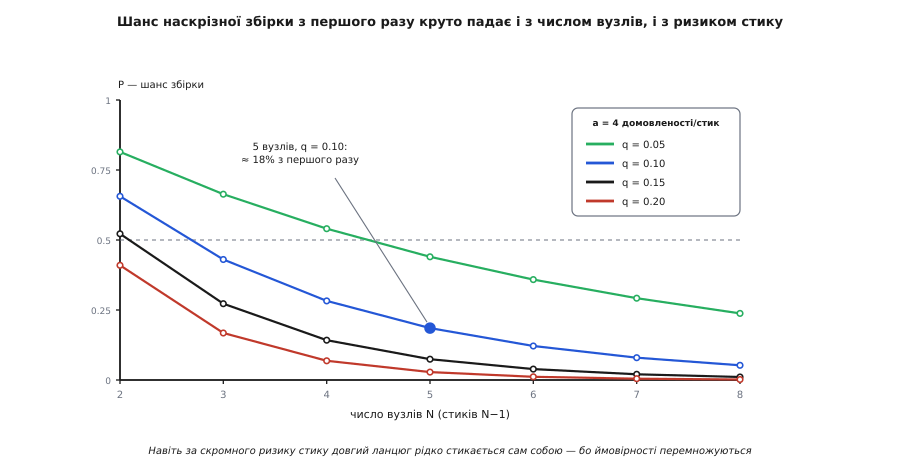

# 🧮 Економіка кістяка: чому стики множаться, а пізнє коштує в рази

<preknowlist>
- [Ризик-мислення](root:sf-apps/risk-thinking) — ризик як добуток «ймовірність біди × її ціна» (експозиція E = P·C); тут ми підставляємо під цей добуток конкретні числа.
- [Рішення під невизначеністю](root:sf-apps/deciding-under-uncertainty) — як діяти, коли фактів бракує, і скільки варто заплатити, щоб їх здобути; кістяк виходить окремим випадком цієї логіки.
</preknowlist>

Прозова тема кладе на стіл три твердження й лишає їх без чисел. Що ризик архітектури живе **на стиках**, і навіть скромний ланцюг майже напевно не стикнеться з першого разу. Що зустріти цей ризик пізно коштує не на відсотки, а **в рази**. Що кістяк — це вигідна **покупка інформації**. Кожне — обіцянка про арифметику; а доки арифметику не пораховано, вони лишаються гаслами, якими однаково легко вимахувати й нехтувати. Порахуймо їх від першопричини — так, щоб наприкінці «будуй найтоншу нитку першою» перестало бути смаком і стало висновком, видно звідки взятим.

Машина складається з чотирьох шестерень, і кожну проженемо окремо. Перша — **комбінаторика стиків**: звідки береться крива шансу й чому вона падає геометрично. Друга — те, що перша мовчки припускає: **незалежність** домовленостей, і що стається, коли її послабити. Третя — **вартість пізнього**: чому вона росте компаундно, а не лінійно, і наскільки чесний знаменитий множник «100×». Четверта зводить усе докупи: кістяк як **зняття експозиції** E = P·C і правило, **куди** класти глибину.

## Стик як добуток імовірностей

Почнімо з найдрібнішої цеглинки й будуймо вгору, нічого не приймаючи на віру. Одна домовленість на стику — endianness, одиниці, семантика порожньої відповіді — це подія з двома наслідками: сторони або зрозуміли її однаково (стик чистий), або ні (розбіжність). Позначмо ймовірність розбіжності на **одну** домовленість через `q`. Тоді шанс, що ця домовленість чиста, — `1 − q`. Це звичайна проба Бернуллі: один кидок монети, зміщеної на `q`.

Стик — не одна домовленість, а **пучок** із `a` штук (формат, порядок байтів, одиниці, семантика помилок, версія…), і стик чистий, лише якщо чисті **всі** вони одночасно. Ось перша й головна точка, де входить незалежність: **якщо** розбіжності на різних домовленостях незалежні, ймовірність спільної події — добуток:

```
один стик чистий = (1 − q) · (1 − q) · … · (1 − q)   [a множників]
                 = (1 − q)^a
```

Тепер ланцюг. Прямий ланцюг із `N` головних вузлів має `N − 1` стиків, і нитка проходить наскрізь, лише якщо чистий **кожен** стик. Знову перемножуємо — по всіх стиках:

```
весь ланцюг чистий:  P = [(1 − q)^a]^(N−1) = (1 − q)^(a·(N−1))
```

Позначмо `m = a·(N−1)` — це просто **загальна кількість домовленостей** уздовж усієї нитки. Формула стає прозорою: `P = (1 − q)^m`. І тут — уся суть фрази «ризик множиться». Кожен доданий вузол додає `a` нових домовленостей, тобто піднімає **показник** `m` на сталу величину `a`. А коли показник росте лінійно, сам степінь падає **геометрично**. Не «трохи гірше з кожним вузлом» — а множення на `(1 − q)^a` щоразу.

### Скільки саме коштує кожен вузол

Груба формула ховає, наскільки круто це падає. Витягнімо крутість на світло, узявши логарифм:

```
ln P = m · ln(1 − q) ≈ −m · q          (для малих q, бо ln(1−q) ≈ −q)
     ⇒  P ≈ e^(−a·(N−1)·q)
```

Показник `a·(N−1)·q` — це **сподівана кількість розбіжностей** уздовж нитки (кількість домовленостей, помножена на шанс кожної схибити). Позначмо її `λ = m·q`. Тоді шанс, що ланцюг чистий, — це шанс, що розбіжностей **нуль**, а число рідкісних незалежних невдач розподілене приблизно за Пуассоном:

```
λ = m · q = a·(N−1)·q         сподівана кількість розбіжностей на ланцюг
P(жодної) ≈ e^(−λ)
```

Це дає інтуїцію, якої гола формула не давала. Візьмімо той самий приклад — `a = 4`, `q = 0.1` — і порахуймо не лише `P`, а й `λ`:

**Умова: п'ять вузлів, чотири домовленості на стик, 10% ризику на домовленість. Скільки розбіжностей чекати й з яким шансом їх нуль?**

```
m = a·(N−1) = 4 · 4 = 16          домовленостей уздовж нитки
λ = m · q   = 16 · 0.1 = 1.6      сподівана кількість розбіжностей

P(жодної) = (1 − 0.1)¹⁶ = 0.9¹⁶ ≈ 0.185       точно
          ≈ e^(−1.6)             ≈ 0.202       наближення
```

Прочитаймо це по-людськи. У «скромному» п'ятивузловому ланцюзі **в середньому півтори-дві** домовленості розійдуться — не «може, якась», а очікувано понад одна. І шанс, що не розійдеться жодна, — близько 18 зі 100. Не тому, що інженери погані, а тому що `1.6` очікуваних невдач майже гарантовано дають бодай одну.

Ще різкіше видно, якщо спитати: на якому вузлі шанс наскрізної збірки падає нижче за підкидання монети? Прирівняймо `P = 0.5`:

```
(1 − q)^(a·(N−1)) = 0.5
a·(N−1)·ln(1/(1−q)) = ln 2
N − 1 = ln 2 / (a · ln(1/(1−q)))

при a = 4, q = 0.1:   N − 1 = 0.693 / (4 · 0.105) = 0.693 / 0.421 ≈ 1.65
                      N ≈ 2.6
```

Тобто вже **між другим і третім** вузлом шанс зібратися з першого разу провалюється за 50%. Не на десятому — на третьому. Ось строгий сенс того, чому «зберемо наприкінці» — програш за побудовою: до останнього стику ти доходиш із шансом успіху в одноцифрових відсотках.



*Шанс наскрізної збірки падає одразу за двома осями. Уздовж — довжина ланцюга N: кожен вузол домножує шанс на (1−q)^a. Упоперек — ризик однієї домовленості q: підняти його з 10% до 15% при шести вузлах означає обвалити шанс успіху втричі. Пунктир на 0.5 показує, як рано крива пробиває «підкидання монети».*

### Симулятор, що відтворює криву

Формулу легко перевірити грубою силою — розіграти тисячі уявних збірок і порахувати, у якій частці проходить нитка. Це і є найпряміша перевірка того, що ми нічого не наплутали в комбінаториці: якщо симуляція збігається з `(1 − q)^m`, формула жива.

```python
import random

def build_succeeds(groups: int, q: float) -> bool:
    """Одна наскрізна збірка проходить, лише якщо ЖОДНЕ з `groups`
    незалежних рішень не розійшлося. Кожне розходиться з шансом q."""
    return all(random.random() >= q for _ in range(groups))

def p_first_time(N: int, a: int = 4, q: float = 0.10, trials: int = 200_000) -> float:
    """Частка симульованих ланцюгів із N вузлів, що стикнулися з першого разу.
    Домовленостей уздовж нитки: m = a·(N−1) — стільки незалежних жеребів."""
    m = a * (N - 1)
    hits = sum(build_succeeds(m, q) for _ in range(trials))
    return hits / trials

for N in range(2, 9):
    est = p_first_time(N)
    exact = (1 - 0.10) ** (4 * (N - 1))
    print(f"N={N}:  Монте-Карло {est:.3f}   формула {exact:.3f}")

# N=2:  Монте-Карло 0.656   формула 0.656
# N=3:  Монте-Карло 0.430   формула 0.430
# N=4:  Монте-Карло 0.283   формула 0.282
# N=5:  Монте-Карло 0.185   формула 0.185      ← той самий ≈18%
# N=6:  Монте-Карло 0.122   формула 0.122
# N=7:  Монте-Карло 0.080   формула 0.080
# N=8:  Монте-Карло 0.052   формула 0.052
```

Симуляція лягає на формулу до третього знака — і це не марна вправа. По-перше, вона підтверджує, що вся крива — прямий наслідок одного припущення (незалежні жереби). По-друге, до цього симулятора зручно **додавати** те, чого формула не вміє: різні `q` на різних стиках, кореляції, повторні спроби. Саме туди ми зараз і підемо, бо найцікавіше починається там, де припущення про незалежність тріщить.

> 🔧 **Навіщо це.** Число `λ = m·q` — найкорисніше, що варто тримати в голові. Порахуй грубо, скільки на твоєму ланцюзі домовленостей (вузли × домовленостей на стик) і який чесний шанс схибити кожній — і ти дістанеш сподівану кількість розбіжностей. Якщо вона більша за одиницю, наскрізна збірка «якось сама» — самообман; треба або кістяк, що зустріне їх рано, або менше незалежних домовленостей. Обидва важелі — попереду.

## Коли домовленості не незалежні

Уся крива вище стоїть на одному слові — **незалежні**. Ми припустили, що розбіжність на endianness нічого не каже про шанс розбіжності на одиницях. Насправді домовленості часто пов'язані, і варто зрозуміти, у який бік це змінює відповідь, бо тут ховається практичний важіль.

Почнімо з двох домовленостей (чи двох стиків) і подивімося, що робить кореляція. Хай кожна чиста з імовірністю `p = 1 − q`. Якщо ввести коефіцієнт кореляції `ρ` між подіями «перша чиста» і «друга чиста», ймовірність, що чисті **обидві**, точно дорівнює:

```
P(обидві чисті) = p² + ρ · p · (1 − p)
```

Розберімо крайні випадки, бо в них уся суть. При `ρ = 0` (незалежність) виходить рівно `p²` — наш добуток. При `ρ = 1` (повна додатна кореляція — це фактично **одне** рішення, а не два) вираз дає `p² + p(1−p) = p`: один жереб замість двох, шанс піднявся з `p²` до `p`. А проміжні `ρ > 0` дають щось **між** `p²` і `p` — тобто **вище** за незалежний добуток. Висновок різкий і корисний:

```
незалежність (ρ = 0):        P = p²          ← найнижчий шанс
додатна кореляція (0<ρ<1):   p² < P < p      ← завжди вище
одне спільне рішення (ρ=1):  P = p           ← найвищий шанс
```

Додатна кореляція **завжди піднімає** шанс спільного успіху над добутком. Незалежність — не «нейтральна» середина, а **песимістичний край**: припускаючи незалежність, ми рахуємо найгірший з-поміж додатно корельованих сценаріїв. І це не абстракція — це прямо каже, як зменшити ризик інтеграції архітектурою.

### Спільні домовленості: менше жеребів, вищий шанс

Звідки в реальній системі береться додатна кореляція? З того, що домовленості не незалежні **за походженням**. Endianness ланцюга зазвичай визначає не кожен стик окремо, а одне рішення на всю систему («усе на дроті — big-endian»). Формат кадру описано однією схемою, яку всі сторони імпортують. Кодек серіалізації — одна бібліотека на всіх. Коли так, `a·(N−1)` домовленостей — це не `a·(N−1)` **незалежних** жеребів, а жменька спільних рішень, кожне з яких застосоване на багатьох стиках одразу.

Змоделюймо це чесно. Хай `m = a·(N−1)` домовленостей групуються в `c` **незалежних рішень**, кожне з яких або праве на всіх своїх стиках, або хибне на всіх. Тоді розіграшів не `m`, а лише `c`, і шанс чистого ланцюга:

```
P = (1 − q)^c ,   де c ≤ m

крайні межі:
  c = m           усе незалежно            → P = (1 − q)^m      (найнижче)
  c = a            кожен ТИП вирішено раз   → P = (1 − q)^a
  c = 1            одна спільна схема       → P = 1 − q          (найвище)
```

**Умова: п'ять вузлів, чотири типи домовленостей. Порівняй два світи — усе незалежно проти «кожен тип вирішено раз на всю систему».**

```
незалежно:      c = a·(N−1) = 16   →   P = 0.9¹⁶ ≈ 0.185
спільні типи:   c = a       =  4   →   P = 0.9⁴  ≈ 0.656
```

Той самий ланцюг, той самий ризик на домовленість — а шанс наскрізної збірки стрибнув з 18% до 66%, **утричі з гаком**, лише тому, що ми звели чотири незалежні рішення на кожному стику до чотирьох спільних на всю систему. Ось математичне підґрунтя старої інженерної мудрості: **один канонічний формат, одна схема, один кодек** — не питання чистоти, а прямий множник надійності інтеграції.


*Незалежність домовленостей — песимістичне припущення. Справжній шанс лежить у вилці між (1−q)^m (усе вирішується окремо на кожному стику) і (1−q) (усе зведено до одного спільного рішення). Що менше НЕЗАЛЕЖНИХ рішень тягне ланцюг, то вищий шанс, що він стикнеться сам собою — тому спільна схема на всю систему математично безпечніша за домовленості «на місці».*

Симулятор розширюється на це без нових ідей — просто зменшуємо число незалежних жеребів (`build_succeeds` уже вміє все потрібне):

```python
def p_clean(groups: int, q: float = 0.10, trials: int = 200_000) -> float:
    """Частка збірок, що пройшли, коли ланцюг тягне `groups` НЕЗАЛЕЖНИХ рішень."""
    return sum(build_succeeds(groups, q) for _ in range(trials)) / trials

# незалежний ланцюг: кожна з 16 домовленостей — свій жереб
print(p_clean(16))   # ≈ 0.185
# спільні конвенції: 4 типи, вирішені раз на всю систему → 4 жереби
print(p_clean(4))    # ≈ 0.656
```

Чесності ради — кореляція буває й **від'ємною**, і тоді знак перевертається. Якщо виправлення однієї домовленості ламає іншу (посунули порядок полів — поїхало вирівнювання), події «стик чистий» антикорелюють, `ρ < 0`, і `P(обидва) = p² + ρ·p(1−p)` падає **нижче** за добуток. Такі стики — найпідступніші: незалежна модель їх недооцінює. Але в типовій системі переважає додатна кореляція спільних конвенцій, тож незалежний добуток `(1 − q)^m` — розумна **нижня** оцінка шансу, і будувати план на неї безпечно.

## Скільки коштує пізно: компаунд проти лінійного

Комбінаторика довела, що інтеграція **майже напевно** десь схибить. Кістяк цього не скасовує — стики доведеться зшивати так чи так. Він робить інше: переносить **момент зустрічі** зі збоєм на початок. Щоб побачити, чому це вигідно, треба порахувати не ймовірність, а **вартість** — і показати, що вона залежить від часу виявлення різко.

Візьмімо одну хибну домовленість, прийняту в день перший, — скажімо, порядок байтів. Скільки коштує її виправити, якщо збій виявлено в момент `t`? Вартість переробки — це, грубо, **обсяг залежного коду**, який уже написано на цю хибну домовленість, помножений на ціну правки одиниці. Парсери, серіалізатори, тести, збережені дані, код, що читає ті дані, код, що читає **той** код, — усе, що припустило контракт правильним, доведеться торкнути.

Ключове питання — **як росте цей залежний обсяг** із часом. Тут два різні світи, і різниця між ними — уся драма.

**Лінійний світ.** Якби залежний код накопичувався рівно — стільки-то рядків щотижня, незалежно від уже написаного, — обсяг ріс би прямою:

```
dD/dt = r · D₀   (стала швидкість)   ⇒   D(t) = D₀·(1 + r·t)
відношення пізно/рано:  D(T)/D(0) = 1 + r·T          росте ЛІНІЙНО
```

**Компаундний світ.** Але код так не росте. Новий код лягає **на** вже написаний і сам припускає ту саму домовленість; далі на нього лягає ще код. Швидкість приросту пропорційна **вже наявному** обсягу — а це визначення експоненційного росту:

```
dD/dt = g · D(t)   (швидкість ∝ наявному)   ⇒   D(t) = D₀·e^(g·t)
```

Вартість переробки виявленого в момент `t` тоді `R(t) = c · D₀·e^(g·t)`, а відношення «знайшли пізно / знайшли рано» — чистий експонент, у якому `D₀` і `c` скорочуються:

```
R(T) / R(0) = e^(g·T)          росте ЕКСПОНЕНЦІЙНО
```

**Умова: проєкт 20 тижнів; залежний код на хибній домовленості множиться на ~15% за тиждень (g = 0.15). У скільки разів дорожче виправити на релізі, ніж у день перший?**

```
лінійно (той самий тижневий приріст, скажімо r = 0.15):
    R(T)/R(0) = 1 + 0.15·20 = 1 + 3 = 4×          помітно, але терпимо

компаундно (g = 0.15):
    R(T)/R(0) = e^(0.15·20) = e³ ≈ 20×            той самий дефект — у 20 разів дорожче
```

Різниця між «4×» і «20×» — це не різні числа, а різні **закони**. Лінійне накопичення карає за зволікання пропорційно; компаундне — множить. І оскільки залежний код у реальності справді лежить на коді, реальність ближча до другого. Саме тому виграє не той, хто **зменшує ймовірність** збою (вона майже певна), а хто **зсуває момент виявлення** до нуля: при `t ≈ 0` множник `e^(g·t) ≈ 1`, і переробка майже безкоштовна. Це рівно те, що робить кістяк.

### Наскільки чесний множник «100×»

Навколо цих чисел наросло чимало легенд, і чесний розбір доказовості тут обов'язковий — бо аргумент кістяка не мусить спиратися на міф.

**Що усталено.** Те, що вартість виправлення дефекту зростає з фазою, показав Баррі Бойм у «Software Engineering Economics» (1981) на даних водоспадних проєктів TRW та IBM — класична крива вартості виправлення. Механізм — більше залежного коду наросло → дорожча правка — прямо випливає з арифметики вище й сумніву не викликає. *(Статус: усталено — і емпірично для тих даних, і механістично.)*

**Звідки взялося «100×».** Конкретну цифру популяризували Бойм і Віктор Базілі у «Software Defect Reduction Top 10 List» (IEEE Computer, січень 2001): «знайти й виправити програмну ваду після постачання часто у 100 разів дорожче, ніж під час вимог і проєктування». Але там же — застереження, яке цитують рідше: для **малих некритичних** проєктів множник радше `5:1`, ніж `100:1`. У моїй формулі «100×» виходить лише за `g·T = ln 100 ≈ 4.6` — тобто за помітно більшого добутку темпу на тривалість, ніж дає скромний приклад вище. *(Статус: цифра сильно залежить від проєкту, а не закон.)*

**Критика доказової бази.** Лоран Боссаві в «The Leprechauns of Software Engineering» (розділ «The Cost of Defects: An Illustrated History») простежив першоджерела цієї кривої й показав, що більшість цитувань посилаються одне на одне, а не на первинні виміри, а «докази, що обґрунтовують криву Бойма… просто не дотягують до жодного розумного стандарту». Він же зауважує: різкі «100×» — це рідкісні випадки, які сам Бойм звав «architecture-breakers», а не типова ситуація. *(Статус: конкретний множник — хистка екстраполяція.)*

**Сучасні дані.** Найбільша перевірка — Тім Мензіс, Вільям Ніколс, Форрест Шалл і Лукас Лейман, «Are Delayed Issues Harder to Resolve?» (Empirical Software Engineering, 2016): **171 проєкт** зі світу за 2006–2014 (база SEI TSP). Сталого «пізніше — то дорожче» ефекту вони **не знайшли**; на їхню думку, він «може бути історичним реліктом, що трапляється лише подекуди, у певних видах проєктів». *(Статус: у сучасних даних універсального ефекту не підтверджено.)*

Тримаймо різницю чітко. **Напрямок** кривої — пізно дорожче, і нерідко в рази — усталений і механістично неминучий, поки залежний код накопичується. **Конкретна цифра** множника — оцінка, що сильно залежить від проєкту, а не константа природи. Кістяку більшого й не треба: щоб виправдати ранню наскрізну нитку, вистачає скромного `5–20×`, а не міфічного сотенного. Аргумент, побудований на `e^(g·T)` з чесним `g`, стоїть твердо; аргумент, що вимагає рівно «100×», — ні.

## Кістяк як покупка інформації

Тепер зведімо ймовірність і вартість в одне число й покажемо, що кістяк — не «добра практика», а звичайне рішення під ризиком. Ризик міряють **експозицією** — добутком імовірності біди на її ціну; цю рамку для програмних проєктів усталив той-таки Бойм у «Software Risk Management» (IEEE Software, 1991):

> 🔧 **Навіщо це.** [Ризик-експозиція](root:sf-apps/risk-thinking) `E = P·C` — це те, що перетворює тривогу на бюджет. `P` — шанс, що зв'язка частин не стикнеться, як гадали (ми щойно навчилися його рахувати: для незнайомого ланцюга він високий). `C` — ціна, якщо це виявиться пізно (ми щойно навчилися і її: `C = C₀·e^(g·T)`, велика). Добуток — це очікувана втрата, що **тихо визріває** у проєкті, поки на неї ніхто не дивиться.

Кістяк атакує цей добуток так: він переносить виявлення на день перший, коли `t ≈ 0` і `e^(g·t) ≈ 1`. Складімо два світи — з кістяком і без — підставивши вартість пізнього з попереднього розділу:

**Умова: береш нову, незнайому зв'язку частин. P = 0.5, що архітектура не стикнеться, як гадали. Виправити ЗАРАЗ коштувало б C₀ = 10 людино-днів, а множник пізнього e^(g·T) = 20. Кістяк — тонка нитка ціною k = 5 людино-днів.**

```
ціна пізнього виправлення:   C_пізно = C₀·e^(g·T) = 10 · 20 = 200 людино-днів

БЕЗ кістяка (стик спливе аж на релізі):
   E_до = P · C_пізно = 0.5 · 200 = 100 людино-днів очікуваної втрати

З кістяком (виявляємо в день перший):
   якщо стик хибний (шанс P) — правимо ЗАРАЗ за C₀, не за C_пізно
   E_після = P · C₀ = 0.5 · 10 = 5 людино-днів

цінність кістяка = E_до − E_після − k
                 = 100 − 5 − 5 = 90 людино-днів
                   знятої очікуваної втрати за дослід у 5 днів
```

Ось справжня природа прийому: кістяк **купує інформацію**. Ти платиш маленьке `k`, щоб велике `P·C_пізно` сколапсувало — або нитка пройшла, і `P` упало майже до нуля, або не пройшла, але ти правиш зараз, коли `C` ще крихітне. Це та сама логіка [дії під невизначеністю](root:sf-apps/deciding-under-uncertainty): найдешевший спосіб здобути дорогий факт — поставити дешевий дослід, що перетворює здогад на факт.

Згорнімо це в одну формулу цінності й дістаньмо **поріг**, за яким кістяк перестає окуповуватися. Підставивши `C_пізно = C₀·e^(g·T)`:

```
цінність(k) = P·C₀·e^(g·T) − P·C₀ − k
            = P·C₀·(e^(g·T) − 1) − k

кістяк вигідний, поки  k < P·C₀·(e^(g·T) − 1)

у наших числах:  поріг = 0.5·10·(20 − 1) = 0.5·10·19 = 95 людино-днів
                 будь-яка нитка дешевша за 95 днів — вигідна; наша (5) — з великим запасом
```

Формула чесно показує й **межі** прийому. Цінність тане до нуля, коли зникає бодай один множник. Якщо `P` мале (зв'язка вторована, ти збирав таке десятки разів) — кістяк купує майже нуль інформації. Якщо `e^(g·T) ≈ 1` (проєкт короткий або залежний код майже не множиться) — пізнє виявлення не набагато дорожче за раннє, і поспішати нема куди. Кістяк заслуговує на себе рівно там, де **всі три** великі: незнайомий стик (високе `P`), довгий проєкт із компаундним кодом (велике `e^(g·T)`), і дешева нитка (мале `k`). Це не універсальний обряд, а прицільна покупка — і формула каже, коли її варто робити.

## Куди класти глибину: формалізація осі Аджича

Лишається найтонше рішення — **куди** на ланцюзі вкладати зусилля. Ґойко Аджич кинув гострий закид: часто не варто мучитися, щоб кістяк одразу пройшов крізь справжній бекенд; веди нитку крізь усі вузли, але **найтоншими** роби ті, що дешеві й певні, а глибину клади на той стик, який справді лякає, підперши решту дешевими заглушками-милицями. Це звучить як смак — а насправді це рівно те, що видає наша формула цінності, якщо застосувати її **до кожного стику окремо**.

У тебе не один стик, а кілька кандидатів, і скінченний бюджет на зняття ризику. Кожен стик `i` має свою трійку — свій шанс схибити `Pᵢ`, свою ціну пізнього `Cᵢ` і свою ціну провести крізь нього справжню нитку `kᵢ`. Очікувана втрата, яку знімає нитка крізь стик `i`, — це його експозиція `Eᵢ = Pᵢ·Cᵢ`, а **ефективність зняття ризику** — знята втрата на одиницю зусилля:

```
ΔEᵢ/Δkᵢ = (Pᵢ · Cᵢ) / kᵢ          знятий ризик на людино-день, укладений у цей стик
```

Тепер правило Аджича стає арифметичним: **сортуй стики за `ΔE/Δk` спадно й вкладай глибину згори, доки вистачає бюджету**. Це та сама жадібна логіка, що й вибір тактик під бюджет за віддачею, — лише замість «вигода на долар» тут «знятий ризик на людино-день».


*Вісь Аджича як число. Смуга кожного стику — знятий ризик на одиницю зусилля (P·C)/k. Знайомий стик має низьке P — гасити його майже нічого не дає, тож туди веди найтоншу нитку або підпирай милицею. Страшний стик несе найбільше очікуваної втрати на вкладений день — саме туди клади справжню глибину. Бюджет на зняття ризику розподіляй згори цього ряду.*

Порахуймо на живому наборі, чому це різко впорядковує роботу:

**Умова: п'ять стиків-кандидатів. Куди перший день зусиль знімає найбільше ризику?**

```
стик                      Pᵢ    Cᵢ    kᵢ   Eᵢ=Pᵢ·Cᵢ   ΔE/Δk = Eᵢ/kᵢ
новий радіопротокол       0.6   120    5      72          14.4     ← глибину сюди
межа двох команд          0.5    80    4      40          10.0
чуже платіжне API         0.4    90    4      36           9.0
своя база (вторована)     0.1    50    3       5           1.7     ← тонка нитка
UI-рендер (знайомий)      0.05   20    2       1           0.5     ← милиця
```

Читається одразу. Новий радіопротокол — високе `P` (ти його ще не тримав) і високе `C` (на нього ляже багато) — знімає **14.4** дня ризику на кожен вкладений; туди й іде справжня нитка. А знайома база чи UI мають `P` близьке до нуля: гасити там майже нема чого, і кожен день, укладений у їхню «справжність», купує копійки. Їх — заглушкою-милицею, свідомо гіршою, ніж майбутня реалізація, зате дешевою вже сьогодні. Найгірша можлива витрата — бездоганно провести нитку крізь `UI-рендер` і `базу`, обійшовши `радіопротокол`: заплатити повну ціну прийому й **не купити нічого**, бо перевірив те, що й так знав.

Симулятор і тут дає перевірити чуйку: якщо задати різні `qᵢ` на різних стиках, майже всі провали наскрізної збірки припадуть на стик із найбільшим `q` — і саме він домінує в сумі очікуваних розбіжностей `λ = Σ mᵢ·qᵢ`. Куди тягне `λ`, туди й глибину.

> 🔧 **Навіщо це.** Перед тим як вести кістяк, витрать п'ять хвилин на цю таблицю з грубими числами. Не «який вузол найскладніший» (складність твоя команда доробить), а «(P·C)/k якого стику найбільше». Майже завжди відповідь — не найцікавіший вузол, а найменш обговорений стик між двома сторонами, кожна з яких упевнена, що правильна саме вона. Туди клади справжню нитку; решту — на милиці.

## Що з цього лишається

Чотири шестерні склалися в один рахунок. **Комбінаторика**: шанс наскрізної збірки `P = (1 − q)^(a·(N−1))` падає геометрично з довжиною ланцюга, бо ймовірності перемножуються, а сподівана кількість розбіжностей `λ = a·(N−1)·q` перевалює за одиницю вже на третьому вузлі — «зберемо наприкінці» програє за побудовою. **Незалежність** тут — песимістичний край: додатна кореляція спільних конвенцій завжди піднімає шанс над добутком, тож одна схема й один кодек на всю систему — прямий множник надійності, а `(1 − q)^m` — безпечна нижня оцінка. **Вартість** пізнього росте компаундно, `R(T)/R(0) = e^(g·T)`, бо залежний код лежить на коді; напрямок «пізно — дорожче в рази» усталений, конкретне «100×» — ні, і кістяку досить скромного множника. **Експозиція** `E = P·C` робить кістяк покупкою інформації цінністю `P·C₀·(e^(g·T) − 1) − k`, вигідною рівно там, де стик незнайомий, проєкт довгий, а нитка дешева. І глибину клади за `ΔE/Δk` — туди, де знятий ризик на вкладений день найбільший.

Тоді те одне речення перестає бути гаслом. Найтонша нитка, проведена крізь усю систему першою, — це не стиль, а найдешевший відомий спосіб перетворити добуток `P·C` з найбільшим показником і найтемнішим `P` на ранній, дешевий, недвозначний факт, поки навколо ще порожньо й `e^(g·t)` тримається біля одиниці.
