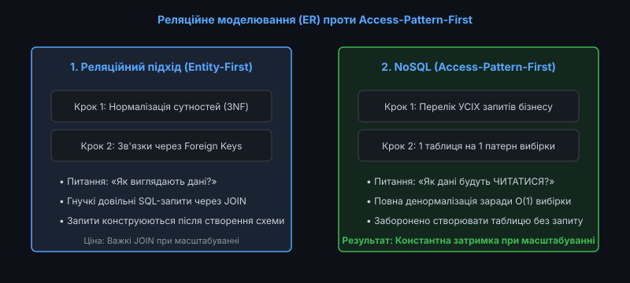
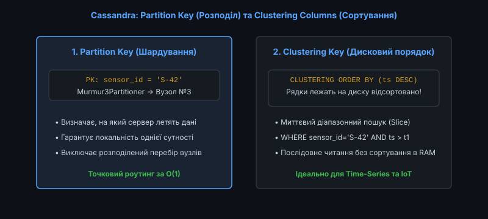
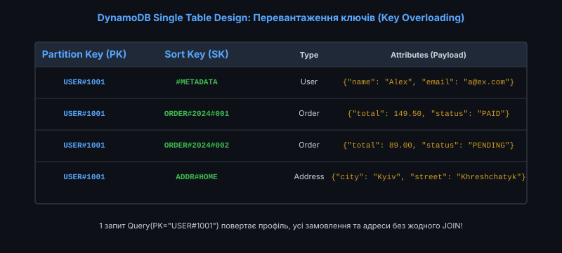

# 📜 Моделювання даних під шаблони доступу (Access-Pattern-First)

<preknowlist>
- [Реляційна модель даних](root:sf-data/relational-model)
- [Індекси баз даних: B-Tree та Hash](root:sf-data/database-indexes)
- [Планувальник та оптимізатор запитів](root:sf-data/query-planner)
- [Транзакції та властивості ACID](root:sf-data/transactions-acid)
- [Ландшафт NoSQL: Key-Value, Document, Column-Family та Graph](root:sf-data/nosql-landscape)
</preknowlist>

У класичному реляційному проєктуванні процес побудови бази даних завжди починається зі створення концептуальної діаграми сутностей (Entity-Relationship, ER) та послідовної нормалізації таблиць до третьої нормальної форми (3NF). Реляційний підхід виходить із припущення, що структура даних є первинною, а будь-які необхідні запити можна буде сформулювати пізніше за допомогою декларативної мови SQL та операцій `JOIN`.

Проте у розподілених нереляційних сховищах (Amazon DynamoDB, Apache Cassandra, ScyllaDB), де дані горизонтально шардуються між сотнями вузлів, операції `JOIN` є фізично неможливими або надзвичайно дорогими.

У таких системах діє принципово інша парадигма — **моделювання під шаблони доступу (Access-Pattern-First)**: схема даних створюється не на основі структури сутностей, а виключно на основі повного списку прикладних запитів, які система повинна обслуговувати.


*Зміна підходу: нормалізована схема під довільні SQL проти денормалізованих структур під фіксовані бізнес-вибірки*

---

### Чому реляційна нормалізація не працює у масштабованому NoSQL

Нормалізація даних у реляційних СУБД мала на меті усунення дублювання інформації та захист від аномалій модифікації. Проте в умовах горизонтального масштабування нормалізована схема стикається з трьома критичними бар'єрами:

#### 1. Мережевий декартовий вибух при розподілених JOIN
Якщо таблиці `Users`, `Orders` та `OrderItems` розміщені на різних серверах кластера, реляційне об'єднання змушує рушій пересилати мільйони рядків через локальну мережу дата-центру (Cross-Node Data Shuffling). Затримка виконання запиту зростає від кількох мікросекунд до сотень мілісекунд.

#### 2. Проблема множинних Round-Trip Time (RTT)
Спроба виконати вибірку даних послідовними окремими запитами до різних NoSQL-таблиць на рівні коду додатка призводить до проблеми N+1, багаторазово перевантажуючи пул підключень та збільшуючи час відповіді кінцевому користувачу.

#### 3. Непередбачуваність часу виконання
У реляційній базі час виконання складного `JOIN` залежить від розміру таблиць, точності статистики планувальника та наявності блокувань. У NoSQL бізнес вимагає фіксованого SLA: будь-який запит повинен виконуватися за час `O(1)` незалежно від того, чи містить база тисячу рядків, чи десять мільярдів.

#### 4. Несумісність із моделлю безроздільного володіння (Shared-Nothing Architecture)
Сучасні хмарні бази даних проєктуються за архітектурою Shared-Nothing, де кожен вузол володіє власним процесором, оперативною пам'яттю та NVMe-накопичувачем. Будь-яка спроба виконати транзакцію або `JOIN` між вузлами вимагає важких протоколів двофазної фіксації (2PC) та синхронного блокування розподілених ресурсів.

#### 5. Неможливість ефективного кешування на рівні вузла
Коли зв'язані сутності розкидані по різних фізичних серверах, буферний пул оперативної пам'яті (Page Cache) кожного сервера фрагментується, що різко знижує відсоток попадання в кеш (Cache Hit Ratio).

Єдиним способом забезпечити стабільний SLA є попередня денормалізація та фізичне розміщення всіх необхідних даних поруч на одному дисковому накопичувачі або вузлі кластера.

Історію переходу інженерів від нормалізації до сучасних практик викладено у вставці [Еволюція патерну Single Table Design: від нормалізації до перевантаження ключів](root:sf-data/access-pattern-first/hist-single-table-design.md).

---

### Анатомія моделювання Wide-Column (Apache Cassandra та ScyllaDB)

У ширококолонкових СУБД концепція таблиці кардинально відрізняється від реляційної. Кожна таблиця створюється під один конкретний бізнес-запит, а її первинний ключ (Primary Key) складається з двох функціональних частин:


*Фізичний поділ ключів: Partition Key визначає вузол кластера, Clustering Columns визначають дисковий порядок рядків*

#### 1. Partition Key (Ключ партиціонування)
* **Призначення**: Визначає, на який конкретний сервер кластера потрапить запис.
* **Механізм роутингу**: Хеш-функція (наприклад, `Murmur3Partitioner`) обчислює 64-бітне або 128-бітне значення токена від Partition Key і спрямовує запит до відповідного сегмента кільця хешування.
* **Правило**: Усі рядки з однаковим Partition Key гарантовано зберігаються на одному фізичному вузлі.

#### 2. Clustering Columns (Стовпці кластеризації)
* **Призначення**: Визначають фізичний порядок сортування рядків усередині партиції на диску у файлі SSTable.
* **Правило**: Дозволяють виконувати швидкі діапазонні вибірки (Range Queries) за допомогою операторів `>`, `<`, `BETWEEN` без сортування даних в оперативній пам'яті.

#### Заборона на неіндексовані операції
У Cassandra заборонено виконувати запити з фільтрами `WHERE` за стовпцями, які не входять до складу первинного ключа. Використання параметра `ALLOW FILTERING` примусово запускає повне сканування всіх дисків усього кластера (Full Table Scan), що є критичним антипатерном у продакшені.

#### Розділення великих партицій (Bucket Sharding)
Якщо одна сутність генерує мільйони записів (наприклад, логування активності пристрою), розмір партиції перевищує рекомендований ліміт 100 МБ. У такому разі застосовують складений Partition Key із часовим бакетом: `PRIMARY KEY ((sensor_id, date_bucket), timestamp)`.

---

### Патерн Single Table Design у DynamoDB

Патерн **Single Table Design** (проєктування єдиної таблиці) є кульмінацією філософії Access-Pattern-First. Замість створення окремих таблиць для користувачів, замовлень, платежів та товарів, усі доменні сутності мікросервісу зберігаються в **одній фізичній таблиці**.


*Збереження поліморфних сутностей в одній таблиці через перевантаження атрибутів PK та SK*

#### Ключові концепції Single Table Design:

1. **Перевантаження ключів (Key Overloading)**:
   Таблиця має лише два універсальні рядкові стовпці: `PK` (Partition Key) та `SK` (Sort Key). У ці поля записуються спеціально сформовані композитні рядки з префіксами:
   * Користувач: `PK = "USER#1001"`, `SK = "#METADATA"`
   * Замовлення користувача: `PK = "USER#1001"`, `SK = "ORDER#2024-05-12#9981"`
   * Адреса користувача: `PK = "USER#1001"`, `SK = "ADDR#HOME"`

2. **Колекції елементів (Item Collections)**:
   Оскільки всі записи профілю, замовлень та адрес користувача мають однаковий `PK = "USER#1001"`, вони фізично зберігаються поруч. Завдяки цьому виклик:
   ```json
   Query(KeyConditionExpression: "PK = :pk", ExpressionAttributeValues: {":pk": "USER#1001"})
   ```
   повертає профіль користувача, список його замовлень та адреси за **один мережевий виклик (1 RTT)** без жодного `JOIN`.

3. **Глобальні вторинні індекси (Global Secondary Indexes, GSI)**:
   Для підтримки альтернативних шаблонів доступу створюються універсальні індекси `GSI1PK` та `GSI1SK`. Наприклад, для пошуку замовлення за його номером `ORDER#9981` без знання ID користувача індекс налаштовується як:
   * `GSI1PK = "ORDER#9981"`, `GSI1SK = "USER#1001"`

4. **Локальні вторинні індекси (Local Secondary Indexes, LSI)**:
   Створюються в момент створення таблиці та ділять спільний Partition Key з базовою таблицею, дозволяючи альтернативне сортування всередині однієї колекції елементів.

Повний довідник зі складання композитних ключів для різних типів зв'язків наведено у вставці [Довідник патернів моделювання NoSQL: DynamoDB та Cassandra](root:sf-data/access-pattern-first/api-dynamodb-modeling-cheatsheet.md).

---

### Математика кардинальності та ризик гарячих партицій

При виборі ключа партиціонування критично важливо забезпечити високу ентропію значень. Якщо ключ має низьку кардинальність (наприклад, `country_code` або `status`), виникає явище **гарячої партиції (Hot Partition)**: весь трафік спрямовується на один фізичний сервер кластера, що спричиняє тротлінг (Throttling) та відмову в обслуговуванні.

Для усунення цієї проблеми застосовують техніку **соління ключів (Key Salting)** — додавання випадкового суфікса від `0` до `S - 1`, що розбиває гарячий потік на незалежні підпотоки.

Детальний математичний апарат розрахунку ентропії Шеннона та балансування навантаження викладено у вставці [Математичний аналіз ентропії ключів партиціонування та гарячих партицій](root:sf-data/access-pattern-first/math-partition-cardinality.md).

---

### Реалізація роутера композитних ключів на C та C++

Для закріплення розуміння логіки Single Table Design розглянемо базову реалізацію маршрутизатора запитів та парсера композитних ключів мовами C та C++:

:::tabs
@tab C
```c
#include <stdio.h>
#include <string.h>
#include <stdbool.h>

typedef struct {
    char pk[64];
    char sk[64];
    char payload[128];
} table_record_t;

void build_user_pk(char *out_buf, size_t max_len, int user_id) {
    snprintf(out_buf, max_len, "USER#%d", user_id);
}

void build_order_sk(char *out_buf, size_t max_len, const char *date, int order_id) {
    snprintf(out_buf, max_len, "ORDER#%s#%04d", date, order_id);
}

bool matches_prefix(const char *sk, const char *prefix) {
    return strncmp(sk, prefix, strlen(prefix)) == 0;
}
```
@tab C++
```cpp
#include <iostream>
#include <string>
#include <sstream>
#include <vector>

class KeyBuilder {
public:
    static std::string make_user_pk(int user_id) {
        return "USER#" + std::to_string(user_id);
    }

    static std::string make_order_sk(const std::string& date, int order_id) {
        std::ostringstream ss;
        ss << "ORDER#" << date << "#" << order_id;
        return ss.str();
    }

    static bool begins_with(const std::string& key, const std::string& prefix) {
        return key.rfind(prefix, 0) == 0;
    }
};
```
:::

Повну робочу реалізацію рушія з підтримкою поліморфного збереження та емуляції GSI наведено у практичному проєкті [Розробка роутера запитів Single Table Design на C та C++](root:sf-data/access-pattern-first/proj-single-table-router.md).

---

### Ціна та обмеження парадигми Access-Pattern-First

Підхід Access-Pattern-First забезпечує безпрецедентну швидкість та масштабованість, проте вимагає від архітектора розуміння компромісів:

#### 1. Негнучкість до непередбачених запитів (Unplanned Ad-hoc Queries)
Якщо бізнес або аналітики вимагають новий несподіваний звіт (наприклад, знайти всі замовлення з певною сумою за минулий рік), який не був закладений у структуру `PK/SK` або `GSI`, виконати його в NoSQL без повного сканування всієї таблиці неможливо.

#### 2. Зростання складності коду додатка
Оскільки база даних не забезпечує реляційної цілісності та зовнішніх ключів, уся відповідальність за підтримання консистентності, оновлення копій даних та валідацію полів повністю перекладається на код додатку.

#### 3. Висока вартість модифікації схеми (Refactoring Cost)
Зміна моделі доступу або формату ключів у наявній Single Table таблиці з мільярдами рядків вимагає написання складних фонових міграційних скриптів або використання конвеєрів Change Data Capture (CDC) для переписування всієї таблиці в новий формат.

#### 4. Обмеження на обсяг однієї Item Collection
У DynamoDB розмір колекції елементів з однаковим Partition Key за наявності Local Secondary Indexes (LSI) обмежений лімітом 10 ГБ. У разі перевищення цього ліміту база повертає помилку `ItemCollectionSizeLimitExceededException`.

#### 5. Накладні витрати на подвійний запис у GSI
Кожна модифікація запису в основній таблиці вимагає асинхронного поширення змін у всі вторинні індекси, що подвоює споживання одиниць запису (WCU) та створює додаткове навантаження на реплікаційний рушій.

#### 6. Відсутність каскадного видалення на рівні сховища
Видалення користувача вимагає явного сканування та видалення всіх дочірніх замовлень через пакетні операції `BatchWriteItem`, оскільки механізм `ON DELETE CASCADE` у нереляційних СУБД відсутній.

---

### Порівняльний аналіз підходів до моделювання

| Критерій | Реляційне моделювання (ER) | Моделювання під запити (Access-Pattern-First) |
| :--- | :--- | :--- |
| **Точка старту** | Сутності та зв'язки домену | Повний список бізнес-запитів користувача |
| **Ступінь нормалізації** | Сувора 3NF / BCNF | Повна або часткова денормалізація |
| **Підтримка ad-hoc SQL** | Повна, необмежена через `JOIN` | Відсутня (вимагає створення нових GSI) |
| **Масштабованість на запис** | Вертикальна (Scale-Up) | Горизонтальна (Scale-Out) без обмежень |
| **Прогнозованість затримки** | Залежить від розміру вибірки та блокувань | Фіксована константна затримка (менше 10 мс) |
| **Цілісність даних** | Гарантується Foreign Keys та CHECK | Реалізується у прикладному коді додатку |

---

### Підсумкові правила проєктування NoSQL схем

1. **Спочатку запити, потім таблиці**: Складіть вичерпний перелік усіх сценаріїв читання та фільтрів інтерфейсу користувача до створення хоча б однієї таблиці чи індексу.
2. **Один запит — один round-trip**: Проєктуйте колекції елементів (Item Collections) так, щоб усі дані екрана або бізнес-операції вичитувалися за один виклик `Query`.
3. **Забезпечуйте високу кардинальність Partition Key**: Використовуйте як ключ партиціонування унікальні ідентифікатори (`user_id`, `device_id`), а не перелічувані статуси чи категорії.
4. **Використовуйте Sparse Indexes для черг**: Створюйте GSI виключно для активних записів, щоб уникнути роздування індексу неактивними історичними даними.
5. **Розділяйте OLTP та аналітику (OLAP)**: Не намагайтеся будувати складні аналітичні звіти поверх Single Table Design; реплікуйте зміни через потоки CDC у спеціалізовані сховища даних (ClickHouse, BigQuery).
6. **Захищайтеся від неконтрольованого зростання списків (Unbounded Collections)**: Розбивайте великі колекції зв'язаних даних (наприклад, тисячі коментарів) на часові сторінки або бакети за допомогою складеного Partition Key.
7. **Уникайте перевантаження гарячих ключів метаданих**: Не записуйте лічильники або глобальні конфігурації під одним загальним `PK = "CONFIG"`, якщо частота звернень перевищує 1000 RPS.
8. **Документуйте матрицю шаблонів доступу**: Завжди зберігайте в кодовій базі таблицю відповідності «Екран UI -> Параметри Query(PK, SK) -> Проєкція полів», оскільки без такої документації реверс-інжиніринг Single Table Design стає неможливим.
