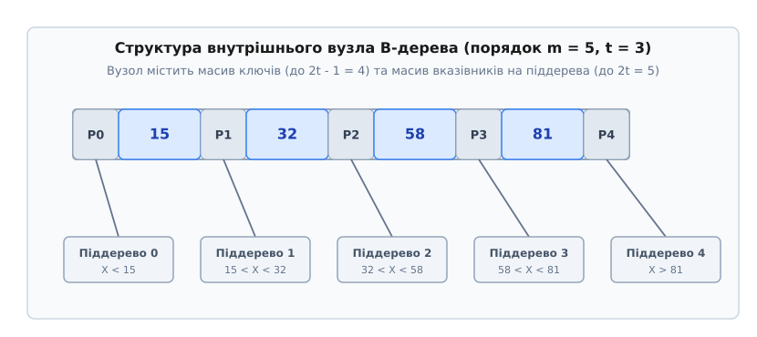
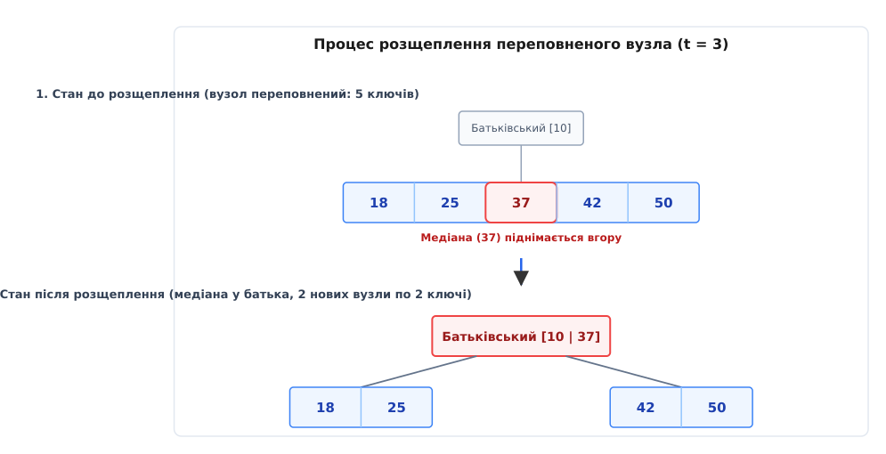
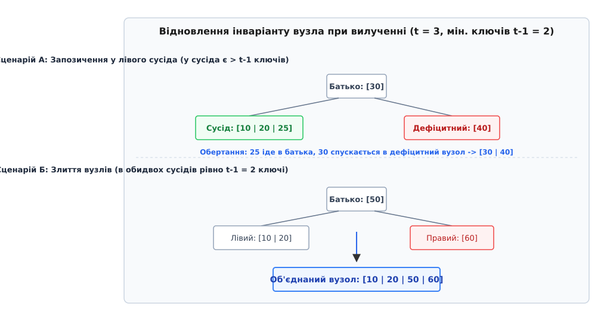

# B-дерево

<preknowlist>
- [Бінарне дерево пошуку](root:sf-algorithms/binary-search-tree) — впорядкована деревна структура з розгалуженням на два піддерева.
- [Двійковий пошук](root:sf-algorithms/binary-search) — алгоритм знаходження елемента у відсортованому масиві з логарифмічною складністю.
- [LSM-дерево](root:sf-data/lsm-tree) — дискова структура даних, оптимізована для високошвидкісного послідовного запису.
- [Асимптотична складність](root:computability/asymptotic-complexity) — оцінка зростання часу виконання та пам'яті через O-нотацію.
- [Амортизаційний аналіз](root:computability/amortized-analysis) — середня вартість послідовності операцій у найгіршому випадку.
</preknowlist>

Коли обсяг впорядкованих даних перевищує розмір оперативної пам'яті (RAM) і переноситься на дискові накопичувачі (SSD або HDD), класичні збалансовані двійкові дерева пошуку зазнають катастрофічного падіння продуктивності. Процесор здатний зчитати комірку RAM за 50 наносекунд, але фізичне читання блоку з твердотільного накопичувача NVMe займає 20 мікросекунд, а з механічного диска — 10 мілісекунд (у 200 000 разів повільніше). Контролер дискового накопичувача завжди читає дані не поодинокими байтами, а суцільними фіксованими блоками — сторінками розміром 4096 або 8192 байти. Ззвичайне двійкове дерево для 1 мільярда записів має висоту близько 30 рівнів: оскільки кожен 32-байтовий вузол розташований у довільному місці диска, пошук одного елемента вимагає 30 послідовних дискових читань, з яких 99% зчитаних байтів марнуються. **B-дерево** (англ. *B-tree*) розв'язує цю проблему за рахунок адаптації структури дерева під фізичну гранулярність дискової сторінки: кожен вузол розширюється до розміру блоку і містить сотні ключів та вказівників, скорочуючи висоту дерева для мільярда записів з 30 лише до 3–4 рівнів.

Детальний розвиток інженерної думки та передумови створення цієї структури висвітлено у вставці [📜 Історія виникнення B-дерева](root:sf-data/b-tree/hist-b-tree.md).

## Фізична першопричина: Ієрархія пам'яті та дискові блоки

Розуміння ефективності B-дерева спирається на фізичні інваріанти роботи сучасного апаратного забезпечення. Комп'ютерна пам'ять побудована у вигляді ієрархії, де швидкість доступу обернено пропорційна місткості:

```
+-------------------------------------------------------------------+
| Р регістри CPU     (0.5 нс)  - байти                              |
|  L1 / L2 / L3 Кеш  (1 - 15 нс) - кеш-лінії 64B                    |
|   Оперативна RAM   (50 - 100 нс) - байти / RAM-сторінки 4KB         |
|    NVMe SSD        (20 - 50 мкс) - блочний I/O (4KB / 8KB / 64KB) |
|     HDD диск       (5 - 10 мс)   - фізичний сектор / дисковий трек|
+-------------------------------------------------------------------+
```

Коли програма запитує байт із дискового файлу, операційна система та контролер диска виконують операцію блочного вводу-виводу (Block I/O). Завжди зчитується мінімум одна дискова сторінка (зазвичай `PAGE_SIZE = 4096` байтів). 

Якщо структура даних побудована на двійкових вузлах (наприклад, АВЛ-дерево або червоно-чорне дерево), кожен вузол складається з ключа, значення та двох вказівників на ліве і праве піддерево (загалом близько 32 байтів). Розміщення таких вузлів у купі є фрагментованим. У результаті:
- Зчитавши сторінку 4096 байтів, процесор використовує лише 32 байти. Корисне використання дискової смуги пропускання становить `32 / 4096 ≈ 0.78%`.
- Кожен крок спуску по двійковому дереву вимагає звернення за новою адресою, спричиняючи нове фізичне читання з диска.
- Загальна кількість дискових читань дорівнює висоті дерева: `h_binary ≈ log₂ N`. Для `N = 10⁹` записів `log₂ (10⁹) ≈ 30` читань.

B-дерево кардинально змінює цей підхід. Замість розгалуження на 2 піддерева вузол B-дерева свідомо роздувається до розміру строго однієї дискової сторінки (4096 байтів). Усередині вузла розміщується впорядкований масив з `k` ключів та `k + 1` дочірніх вказівників.

Для сторінки 4 КБ та 64-бітних ключів параметр розгалуження `m` (англ. *branching factor*) досягає 250–500. Кількість дискових читань скорочується до:
`h_BTree ≈ log_m N`.

Для 1 мільярда записів при `m = 500`:
`h_BTree = log₅₀₀ (10⁹) ≈ 3.3`.

Таким чином, замість 30 фізичних звернень до диска B-дерево виконує лише 3 або 4 читання. Оскільки корінь та верхні рівні дерева постійно знаходяться у кеші оперативної пам'яті (Buffer Pool), реальний пошук запису вимагає лише 1 або 2 фізичних I/O операцій.

## Анатомія вузла та суворі інваріанти B-дерева

Формально **B-дерево порядку `m`** (або мінімального ступеня `t ≥ 2`, де `m = 2t`) — це багатовіткове збалансоване дерево пошуку, яке задовольняє такі математичні інваріанти:

1. **Упорядкованість усередині вузла**: Кожен вузол `x` містить `x.n` ключів, збережених у зростаючому порядку:
   `x.key[1] ≤ x.key[2] ≤ ... ≤ x.key[x.n]`.
2. **Розгалуження та піддерева**: Внутрішній (нелистовий) вузол містить `x.n + 1` вказівників на дочірні вузли `x.c[1], x.c[2], ..., x.c[x.n + 1]`. Листові вузли не мають дітей (`x.c[i] = NULL`).
3. **Межі діапазонів**: Ключі у дочірніх піддеревах строго обмежені ключами батьківського вузла. Якщо `k_i` є довільним ключем у піддереві `x.c[i]`, то виконується нерівність:
   `k_1 ≤ x.key[1] ≤ k_2 ≤ x.key[2] ... ≤ x.key[x.n] ≤ k_{x.n + 1}`.
4. **Обмеження заповнення вузлів**:
   - Кожен вузол, крім кореня, містить щонайменше `t - 1` ключів (і має щонайменше `t` дітей). Це гарантує, що вузол заповнений принаймні наполовину.
   - Кожен вузол містить щонайбільше `2t - 1` ключів (і має щонайбільше `2t` дітей). Вузол, який містить строго `2t - 1` ключів, називається **повним** (англ. *full node*).
5. **Ідеальний баланс за висотою**: Усі листки знаходяться на **абсолютно однаковій глибині**, яка дорівнює висоті дерева `h`.


*Анатомія внутрішнього вузла B-дерева порядку m = 5 (t = 3): 4 ключі розділяють діапазони 5 дочірніх піддерев*

Наведені інваріанти гарантують, що B-дерево ніколи не вироджується у лінійний список. Нижнє обмеження у `t - 1` ключів запобігає появі напівпорожніх вузлів, забезпечуючи високу щільність збереження даних.

Строгий математичний доказ меж висоти та коефіцієнта заповнення наведено у вставці [🧮 Математичний аналіз висоти та заповнення B-дерева](root:sf-data/b-tree/math-b-tree-bounds.md).

## Операція пошуку (Search)

Пошук ключа `k` у B-дереві є узагальненням пошуку у двійковому дереві. Алгоритм починає з кореневого вузла і виконує такі кроки:

1. У поточному вузлі `x` виконується пошук першого ключа `x.key[i]`, який є більшим або рівним за `k`. Оскільки ключі у вузлі впорядковані, пошук можна виконувати лінійно (для малих `t`) або бінарним пошуком (для великих `t`).
2. Якщо `i ≤ x.n` і `k == x.key[i]`, ключ знайдено. Пошук успішно завершується, повертаючи вузол `x` та індекс `i`.
3. Якщо `x` є листком (`x.is_leaf == true`) і ключ не знайдено у крок 2, елемент `k` відсутній у B-дереві.
4. Якщо `x` є внутрішнім вузлом, алгоритм виконує дискове читання дочірньої сторінки `x.c[i]` і рекурсивно продовжує пошук у цьому піддереві.

```
Алгоритм B-Tree-Search(x, k):
i = 1
while i <= x.n and k > x.key[i]:
    i = i + 1
if i <= x.n and k == x.key[i]:
    return (x, i)
if x.is_leaf:
    return NIL
else:
    Disk-Read(x.c[i])
    return B-Tree-Search(x.c[i], k)
```

Складність пошуку складається з двох компонентів:
- **Дискові I/O**: `O(h) = O(log_t N)` прочитаних сторінок.
- **Процесорний час CPU**: `O(t · log_t N)` при лінійному пошуку всередині вузла або `O(log₂ t · log_t N) = O(log₂ N)` при бінарному пошуку.

## Операція вставки (Insertion) та розщеплення вузлів (Node Split)

На відміну від двійкових дерев, де елемент додається створенням нового листка знизу, B-дерево завжди вставляє новий ключ у **наявний листовий вузол**. 

Якщо листовий вузол не є повним (містить менше `2t - 1` ключів), новий ключ просто вставляється у відповідне місце масиву із збереженням порядку відсортованості.

Проблема виникає тоді, коли листок вже є повним (містить `2t - 1` ключів). Спроба вставити `2t`-й ключ порушила б інваріант максимальної місткості. У цьому випадку виконується фундаментальна операція **розщеплення вузла** (англ. *node split*).

### Механізм розщеплення вузла (Split-Child)

Нехай вузол `y` є повним (`2t - 1` ключів) і є `i`-ю дитиною вузла `x`. Операція розщеплення виконує такі дії:

1. Створюється новий вузол `z`, який знаходиться на тому самому рівні, що й `y`.
2. Останні `t - 1` ключів вузла `y` (з індексами від `t + 1` до `2t - 1`) переміщуються у новий вузол `z`.
3. Якщо `y` не є листком, останні `t` дочірніх вказівників `y` також переміщуються у `z`.
4. Кількість ключів у `y` зменшується до `t - 1`.
5. Середній (медіанний) ключ `y.key[t]` **піднімається вгору** у батьківський вузол `x` і вставляється на позицію `i`. Вказівник на новий вузол `z` записується як `(i + 1)`-ша дитина вузла `x`.


*Розщеплення переповненого вузла (5 ключів при t=3): медіанний ключ 37 піднімається у батьківський вузол, утворюючи два вузли по 2 ключі*

### Превентивне розщеплення зверху вниз (Preemptive Split)

Якщо батьківський вузол `x` сам виявиться повним, підйом медіанного ключа спричинить розщеплення `x`, яке може рекурсивно поширитися вгору аж до кореня (Bottom-up split). Це вимагало б зберігання шляху у пам'яті та повторного запису батьківських сторінок.

Для оптимізації роботи з диском застосовують **превентивне розщеплення зверху вниз** (англ. *top-down preemptive split*). Під час спуску від кореня до листка алгоритм перевіряє кожен зустрічний вузол. Якщо вузол є повним, він розщеплюється **негайно**, ще до того, як заглиблення продовжиться.

Завдяки цьому гарантується інваріант: коли алгоритм натрапляє на повний листок, його батьківський вузол завідомо є неповним і може прийняти медіанний ключ без каскадних розщеплень.

### Зростання дерева вгору (Root Split)

B-дерево є єдиною класичною структурою даних, яка **росте знизу вгору**. Висота дерева `h` збільшується строго в один спосіб: коли розщеплюється сам корінь.

При розщепленні кореня створюється новий порожній корінь, старий корінь стає його першим дитям, і після розщеплення новий корінь отримує 1 ключ та 2 дітей. Висота дерева зростає на 1.

Детальний приклад реалізації операцій вставки та розщеплення на мовах C та C++ наведено у вставці [⚙️ Реалізація B-дерева мовами C та C++](root:sf-data/b-tree/proj-b-tree.md).

## Операція вилучення (Deletion) та відновлення інваріантів

Вилучення ключа `k` з B-дерева є більш складною операцією, ніж вставка, оскільки воно може зменшити кількість ключів у вузлі нижче мінімальної межі `t - 1` (стан дефіциту).

Щоб гарантувати виконання всього процесу за один прохід зверху вниз без зворотного ходу, алгоритм перевіряє, щоб кожен вузол, у який ми спускаємося, мав щонайменше `t` ключів (на 1 більше ніж мінімум `t - 1`).

Розглянемо три основні сценарії вилучення:

### Сценарій 1: Ключ знаходиться у листку
Якщо ключ `k` знаходиться у листовому вузлі `x`, і `x` має щонайменше `t` ключів, ключ `k` просто видаляється з масиву `x.key`.

### Сценарій 2: Ключ знаходиться у внутрішньому вузлі

Видалення ключа безпосередньо з внутрішнього вузла порушило б розділову межу між дочірніми піддеревами і зламало б маршрутизацію пошуку. Щоб зберегти інваріант впорядкованості, видалений ключ необхідно замінити сусіднім граничним елементом із піддерев (попередником або наступником), або об'єднати суміжні піддерева, якщо в обох спостерігається дефіцит ключів. Якщо ключ `k` знаходиться у внутрішньому вузлі `x`, алгоритм аналізує заповненість дочірніх сторінок і виконує одну з трьох дій:

- **Заміна попередником**: Якщо дочірній вузол `y`, який передує `k`, має щонайменше `t` ключів, знаходять попередника `k'` (найбільший ключ у піддереві `y`). Ключ `k'` рекурсивно видаляють з `y`, а в `x` ключ `k` замінюють на `k'`.
- **Заміна наступником**: Якщо `y` має лише `t - 1` ключів, перевіряють наступний дочірній вузол `z`. Якщо `z` має щонайменше `t` ключів, знаходять наступника `k''` (найменший ключ у піддереві `z`), видаляють його і замінюють `k` на `k''`.
- **Злиття вузлів**: Якщо і `y`, і `z` мають лише по `t - 1` ключів, ключі з `z` та ключ `k` об'єднуються у вузол `y`. Вузол `z` вивільняється, а ключ `k` рекурсивно видаляється з об'єднаного вузла `y`.

### Сценарій 3: Дефіцит вузла при спуску (Запозичення та Злиття)
Якщо при спуску до дочірнього вузла `c_i` виявляється, що він має лише `t - 1` ключів, виконується одна з двох балансувальних дій:

- **Запозичення у сусіда (Rotation / Borrowing)**: Якщо один із суміжних сусідів (`c_{i-1}` або `c_{i+1}`) має `t` або більше ключів, виконується обертання ключів через батьківський вузол. Ключ із батька спускається у `c_i`, а крайній ключ сусіда піднімається у батька.
- **Злиття сусідів (Merging)**: Якщо обидва суміжні сусідні вузли мають строго по `t - 1` ключів, вузол `c_i` об'єднується з одним із сусідів та роздільним ключем із батьківського вузла у один новий вузол з `2t - 1` ключами.


*Відновлення інваріанту вузла при вилученні: Сценарій А — обертання через батьківський вузол; Сценарій Б — злиття двох вузлів по 2 ключі та батьківського ключа в один вузол з 4 ключами*

Якщо в результаті злиття корінь дерева залишається порожнім (містить 0 ключів), об'єднана дитина стає новим коренем, і висота B-дерева `h` зменшується на 1.

## Інтеграція з буферним пулом та журналом WAL

У промислових СУБД структура B-дерева взаємодіє з двома ключовими підсистемами ядра бази даних:

1. **Буферний пул (Buffer Pool Manager)**: Утримує гарячі дискові сторінки в оперативній пам'яті. Кожен вузол B-дерева представлений сторінкою з лічильником закріплення `pin_count`. Модифікація вузла позначає сторінку як «брудну» (`is_dirty = true`). Алгоритми витіснення (наприклад, Clock-Sweep або LRU-K) вивантажують брудні сторінки на диск за потреби.
2. **Журнал попереднього запису (Write-Ahead Logging / WAL)**: Гарантує збоєстійкість (Durability). Кожна модифікація вузла B-дерева (вставка, розщеплення, обертання чи злиття) спочатку описується у вигляді послідовного запису WAL, який фізично скидається на диск викликом `fsync()` до того, як модифікована дискова сторінка буде записана у файл бази даних.

Двійкова структура сторінки B-дерева, масиви слотів, вирівнювання за межами 4 КБ та C/C++ інтерфейси описані у вставці [📋 Фізичний формат сторінки та інтерфейс B-дерева](root:sf-data/b-tree/api-b-tree.md).

## Конкурентність та багатопотоковий доступ (Latch Crabbing & B-link Trees)

Коли з B-деревом одночасно працюють сотні паралельних потоків виконання, виникає потреба у синхронізації доступу до вузлів без блокування всього індексу.

Для цього застосовуються дві основні техніки:

### 1. Крабове блокування (Latch Crabbing / Lock Coupling)
Під час спуску по дереву потік захоплює кратне блокування читання (Shared Latch) на батьківському вузлі, знаходить необхідну дитину, захоплює Shared Latch на дитині, і лише після цього відпускає блокування з батьківського вузла. Потік пересувається по дереву подібно до руху краба.

При вставці або вилученні потік захоплює виключне блокування (Exclusive Latch). Якщо при спуску до дочірнього вузла з'ясовується, що дитина є «безпечною» (не потребує розщеплення чи злиття), потік може негайно відпустити Exclusive Latch з усіх предків вище за рівнем.

### 2. B-link дерева Лемана-Яо (Lehman-Yao B-link Trees)
У 1981 році Філіп Леман та С. Бін Яо запропонували модифікацію B-дерева, у якій **кожен внутрішній вузол містить вказівник на свого правого сусіда** (Right-Link) та максимальний ключ сторінки (High Key).

Завдяки цьому потоки читання взагалі не захоплюють блокувань при спуску по дереву! Якщо під час читання паралельний потік модифікації розщепив дочірню сторінку, потік читання просто виявляє, що його шуканий ключ більший за `High Key` поточної сторінки, і переходить за вказівником `Right-Link` на сусідній вузол праворуч без повернення до батька.

## Первинні (Кластеризовані) та Вторинні індекси у СУБД

У реляційних базах даних B+ дерева виступають у двох основних конструктивних ролях:

1. **Кластеризований індекс (Clustered Index)**: Сама таблиця зберігається у вигляді B+ дерева, де ключем виступає первинний ключ (Primary Key), а корисним навантаженням у листках є **повний рядок таблиці** (усі колонки). У MySQL InnoDB кожна таблиця обов'язково є кластеризованим B+ деревом. Перевага: пошук за первинним ключем повертає всі дані за один прохід `O(log_t N)` без додаткових переходів.
2. **Вторинний індекс (Secondary Index)**: Окреме B+ дерево, побудоване на некорельованій колонці (наприклад, `email` або `created_at`). У листках вторинного індексу зберігається шуканий ключ та вказівник на первинний ключ (Primary Key) або фізичний ідентифікатор рядка (Row ID / RID).
   - При виконанні запиту `SELECT * FROM users WHERE email = 'user@example.com'` СУБД спочатку виконує пошук у вторинному B+ дереві, знаходить Primary Key, а потім робить другий пошук (англ. *index lookup / bookmark lookup*) у кластеризованому B+ дереві для зчитування повного рядка.

### Покриваючі індекси (Covering Index)

Якщо SQL-запит обирає лише ті колонки, які вже присутні у самому вторинному індексі (наприклад, `SELECT id, email FROM users WHERE email = '...'`), оптимізатор СУБД виконує **Index-Only Scan**. Повторне звернення до первинного B+ дерева виключається, що подвоює швидкість виконання запиту.

## Впорядкування складених ключів та переривчасте сканування (Index Skip Scan)

При створенні баз даних часто виникає потреба у створенні індексів за кількома колонками одночасно (наприклад, `CREATE INDEX idx_name ON users(last_name, first_name, birth_date)`).

У B-дереві складений ключ представляється у вигляді кортежу (tuple). Впорядкування ключів всередині вузла здійснюється за суворим **лексикографічним правилом**:

1. Спочатку порівнюється перше поле кортежу (`last_name`). Якщо значення відрізняються, результат порівняння визначає порядок у вузлі.
2. Якщо перші поля двох кортежів рівні, порівнюється друге поле (`first_name`).
3. Якщо й другі поля рівні, порівнюється третє поле (`birth_date`).

Це створює важливе інженерне правило префіксного пошуку (Leftmost Prefix Rule): B-дерево може ефективно використовувати складений індекс для запитів, які задіють лівий префікс колонок (`WHERE last_name = 'Smith'`), але не може використати класичне індексне сканування для запитів, які пропускають першу колонку (`WHERE first_name = 'John'`).

### Переривчасте сканування індексу (Index Skip Scan / Loose Index Scan)

Коли SQL-запит пропускає першу колонку складеного індексу, стандартне лексикографічне впорядкування унеможливлює прямий префіксний пошук, що змушує оптимізатор вдаватися до повного сканування таблиці. Однак якщо перша колонка містить лише кілька унікальних значень (має низьку кардинальність), СУБД може перетворити один складний запит на серію точкових звернень до дерева за кожним унікальним значенням першої колонки. Для цього сучасні СУБД (Oracle, MySQL, SQLite) застосовують оптимізацію Index Skip Scan:

- Якщо перша колонка індексу має дуже низьку кардинальність (наприклад, `gender ENUM('M', 'F')`), а запит шукає лише за другою колонкою (`WHERE age = 30`), СУБД свідомо виконує декілька швидких точкових пошуків у B+ дереві: спочатку шукає `('F', 30)`, а потім виконує бінарний стрибок через піддерево до `('M', 30)`. Це уникає повного дискового сканування таблиці.

## Дискова фрагментація та перебудова індексів (Reindex & Bulk Loading)

Тривала експлуатація СУБД з хаотичними вставками та видаленнями призводить до внутрішньої фрагментації дискових сторінок: сторінки B-дерева залишаються заповненими лише на 50–60%, а фізичне розташування сторінок на диску перестає бути послідовним.

Для боротьби з цим застосовують два інженерні підходи:

1. **Масове завантаження (Bulk Loading)**: При побудові індексу з нуля СУБД спочатку сортує всі записи у пам'яті за допомогою зовнішнього сортування (External Merge Sort), а потім будує сторінки B+ дерева строго знизу вгору послідовним заповненням на 90–95%. Це виключає операції розщеплення та забезпечує ідеальну локальність на диску.
2. **Перебудова індексу (REINDEX / OPTIMIZE TABLE)**: СУБД створює нове B+ дерево у тлі через Bulk Loading, переключає вказівник у системному каталозі, і вивільняє старі дискові сторінки у Freelist.

## Процедури збирання сміття та очищення сторінок (VACUUM & Purge)

У багатоверсійних СУБД (MVCC, таких як PostgreSQL та Oracle) вилучення або оновлення рядка не видаляє дані з дискової сторінки B-дерева негайно. Замість цього версія рядка помічається як «мертва» (Dead Tuple / Tombstone).

Якщо обсяг мертвих туплів у сторінці перевищує допустиму межу, запускається фоновий процес очищення:
- **PostgreSQL VACUUM**: Сканує сторінки B-дерева, видаляє вказівники на мертві туплі з масиву слотів, виконує дефрагментацію комірок усередині сторінки та реєструє звільнений простір у Free Space Map (FSM).
- **InnoDB Purge Thread**: Звільняє мертві записи у вторинних індексах та переміщує порожні дискові сторінки у Freelist для перевикористання новими вставками.

## Упереджувальне читання сторінок (Read-Ahead & Prefetching)

Під час виконання великих діапазонних запитів (наприклад, `SELECT COUNT(*) FROM orders WHERE date >= '2026-01-01'`) СУБД сканує зв'язаний список листків B+ дерева.

Щоб запобігти простою процесора в очікуванні повільного дискового I/O, підсистема вводу-виводу застосовує **Read-Ahead** (упереджувальне читання):
- Коли менеджер сторінок виявляє послідовний доступ до листків `Page 100 -> Page 101 -> Page 102`, він автоматично надсилає асинхронний запит системному виклику `posix_fadvise(POSIX_FADV_SEQUENTIAL)`.
- Дисковий контролер зчитує наступні сторінки `Page 103..110` у буферний пул **заздалегідь**, до того, як виконання запиту дійде до них. У результаті час очікуванні I/O скорочується практично до нуля.

## Простеження операцій у Linux sysfs та ftrace

Для інженерного аналізу роботи B-дерев на рівні ядра Linux та дискових файлових систем застосовують вбудовані підсистеми діагностики `sysfs` та `ftrace`:

- **Модуль bcache у sysfs (`/sys/fs/bcache/`)**: Модуль ядра Linux `bcache`, який реалізує SSD-кешування повільних блочних пристроїв, спирається на внутрішнє B-дерево. Через файли `/sys/fs/bcache/<uuid>/tree_depth` та `/sys/fs/bcache/<uuid>/btree_cache_size` можна у реальному часі спостерігати за глибиною B-дерева та обсягом утримуваних сторінок.
- **Аналіз трасування I/O через ftrace**: За допомогою команди `perf trace -e block:block_rq_issue` можна пересвідчитися, що при пошуку елемента у B+ дереві файлової системи Btrfs генерується строго `h` фізичних операцій читання дискових блоків.
- **Утиліта Btrfs Inspect**: Команда `btrfs inspect-internal dump-tree /dev/sda1` дозволяє роздрукувати точне розташування вузлів B-дерева метаданих файлової системи на фізичному дисковому носії.

## Сучасні оперативно-адаптивні B-дерева (CSB+-tree & NVM B-trees)

Зі зростанням обсягів оперативної пам'яті виник окремий клас СУБД, які зберігають усі дані повністю у RAM (In-Memory Databases, такі как SAP HANA, Redis, Hekaton).

Для роботи у пам'яті B-дерево було модифіковане з урахуванням архітектури кешу процесора (L1/L2/L3 Cache Lines):

1. **CSB+-дерево (Cache-Sensitive B+-Tree)**: Зберігає всі дочірні вузли одного батька у суцільному масиві пам'яті один за одним. Завдяки цьому у внутрішньому вузлі зберігається лише **один-єдиний вказівник** на перший дочірній вузол, а адреса `i`-го дитини обчислюється арифметично як `first_child_ptr + i * node_size`. Це вивільняє 50% пам'яті вузла від вказівників і дає змогу подвоїти кількість ключів у одній кеш-лінії CPU.
2. **NVM B-дерева (FAST+FAIR для Non-Volatile Memory)**: З появою енергонезалежної пам'яті (CXL, Optane) виникла потреба мінімізувати інструкції примусового скидання кешу (`clwb` та `sfence`). Алгоритми NVM B-дерев записують нові ключі у неупорядкованому вигляді на вільні позиції вузла, щоб уникнути зсуву масивів у NVM, а сортованість підтримують за допомогою додаткового 8-байтового слота покажчиків у RAM.

## Порівняльний аналіз: B-дерево проти LSM-дерева

У сучасних високонавантажених системах B-дерево часто порівнюють із **LSM-деревом** (Log-Structured Merge-tree, яке використовується в RocksDB, LevelDB, Cassandra, ScyllaDB):

| Критерій | B-дерево / B+ дерево | LSM-дерево |
| :--- | :--- | :--- |
| **Основний тип навантаження** | Точкове читання та діапазонний пошук (`SELECT`) | Високошвидкісний послідовний запис (`INSERT / UPDATE`) |
| **Підхід до модифікації** | In-place update (перезапис сторінок на місці) | Append-only (запис у лог та SSTable у пам'яті) |
| **Підсилення запису (Write Amplification)** | Високе (перезапис цілої 4KB сторінки заради 8-байтового ключа) | Низьке на початку, але зростає під час фонового ущільнення (Compaction) |
| **Підсилення читання (Read Amplification)** | Низьке (строго `O(log_t N)` прочитаних сторінок) | Високе (вимагає перевірки кількох рівнів SSTable та фільтрів Блума) |
| **Фрагментація диска** | Можлива внутрішня фрагментація напівпорожніх сторінок (до 30%) | Повна відсутність внутрішньої фрагментації, але вимога резерву диска під Compaction |

Отже, B-дерева залишаються неперевершеним вибором для OLTP систем з високою частотою випадкового читання та точкових вибірок, тоді як LSM-дерева випереджають B-дерева у системах журналювання та аналітичного запису з високою інтенсивністю запису.

## Модифікації: B+ дерева та B* дерева

За пів століття практичного застосування класичне B-дерево отримало дві критично важливі модифікації, які стали стандартом у базах даних:

### 1. B+ дерево (B+-tree)

У класичному B-дереві корисні дані (або вказівники на записи) розміщуються у всіх вузлах поруч із ключами, через що внутрішні вузли витрачають байтову місткість сторінки на корисне навантаження. Це істотно зменшує параметр розгалуження `m` та збільшує висоту дерева. Крім того, вибірка діапазонів у класичному B-дереві вимагає складного обходу піддерев вгору й вниз. Оптимізуючи щільність внутрішніх вузлів та лінійне сканування, **B+ дерево** розділяє роль вузлів за двома суворими правилами:

- Всі корисні дані зберігаються **виключно у листових вузлах**.
- Внутрішні вузли містять лише "маршрутизуючі" ключі для навігації.
- Усі листки зв'язані у односпрямований або двоспрямований список.

```
Класичне B-дерево:
[Ключ1, Дані1 | Ключ2, Дані2]  <-- Дані у внутрішніх вузлах!

B+ дерево:
Внутрішній: [Ключ1 | Ключ2]   <-- Лише навігаційні ключі!
                 │
Листок:     [K1,D1 | K2,D2] ──► [K3,D3 | K4,D4]  <-- Список листків (Range Scan)
```

Переваги B+ дерева:
1. Внутрішні вузли не витрачають пам'ять на корисне навантаження, що різко збільшує коефіцієнт розгалуження `m` та зменшує висоту дерева.
2. Діапазонні запити (`WHERE age BETWEEN 20 AND 30`) виконуються за `O(log_t N)` для знаходження першого листка і подальшим лінійним обходом списку листків зі швидкістю послідовного читання диска.

### 2. B* дерево (B*-tree)
Запропоновано Дональдом Кнутом. Вимагає, щоб кожен вузол був заповнений щонайменше на **2/3** (66.7%), а не на 1/2 (50%). При переповненні вузол не розщеплюється негайно, а перерозподіляє ключі із сусіднім вузлом. Якщо обидва сусідні вузли повні, два вузли розщеплюються на три нові вузли, заповнені на 2/3. Це зменшує витрати дискової пам'яті на 15–20%.

## Практична інженерна цінність

Фізичні властивості дискових накопичувачів роблять мінімізацію операцій вводу-виводу головною умовою високої продуктивності систем збереження. Оскільки B-дерева адаптовані до розміру дискової сторінки і гарантують мінімальну висоту пошуку, вони стали універсальним інструментом обробки даних і застосовуються всюди:

> 🔧 **Навіщо це.**
> - **СУБД**: PostgreSQL (nbtree), SQLite, MySQL InnoDB, Oracle, Microsoft SQL Server спираються на B+ дерева для первинних та вторинних індексів.
> - **Файлові системи**: ext4 (extents tree), NTFS, Btrfs, XFS, APFS, ZFS використовують B-дерева для миттєвого пошуку файлів у каталогах з мільйонами елементів.
>
> Розуміння механізмів B-дерева дозволяє розробникам правильно обирати розміри сторінок, проективати складені індекси (Composite Indexes) та оптимізувати діапазонні SQL-запити.

У підсумку, B-дерево є фундаментальним інженерним мостом між абстрактною теорією графів та фізичною реальністю дискових накопичувачів. Завдяки поєднанню високого розгалуження, балансування за висотою та узгодженості з розмірами дискових блоків B-дерева залишаються незамінним інструментом обробки великих масивів даних.
