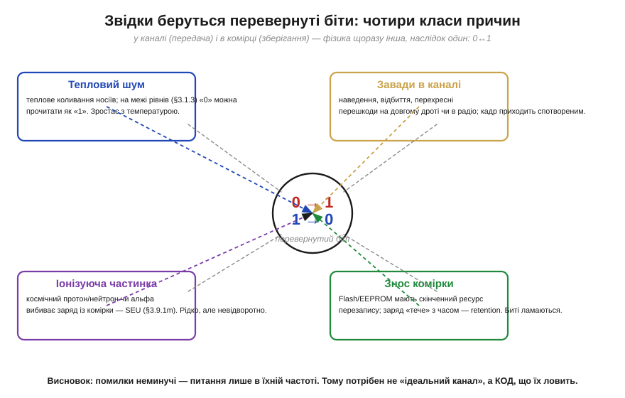
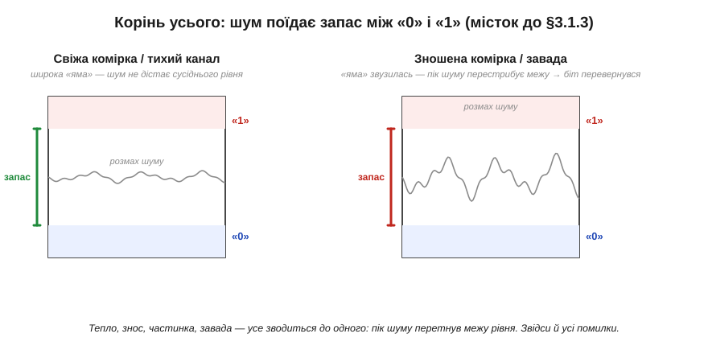

# Звідки беруться перевернуті біти

Перш ніж боротися з помилками, треба чесно зрозуміти ворога: **звідки** в цифровій системі береться перевернутий біт, **як часто** це стається й **чому** від цього неможливо просто відгородитися кращим дротом. Без цієї картини будь-який код виглядає зайвою перестраховкою. З нею стає очевидно: надлишок — не розкіш параноїка, а інженерна необхідність, така сама буденна, як запобіжник у колі живлення.

Почнімо з кореня. У цифрі «0» і «1» — це не точні напруги, а [**діапазони**, розділені забороненою зоною](topic:hw-digital/logic-levels-as-ranges), і що між ними є [**запас завадостійкості**](topic:hw-digital/noise-margin). Уся надійність цифри тримається на тому, що цей запас широкий: щоб переплутати рівні, шумові треба перестрибнути цілу прірву. Перевернутий біт — це рівно той випадок, коли прірву таки перестрибнули. А причин, чому це може статися, кілька, і фізика в кожної своя.

### Чотири класи причин

Зручно тримати в голові чотири джерела помилок — два в **каналі** (коли біт кудись передається) і два в **комірці** (коли біт просто лежить і зберігається).


*Чотири класи причин, чому біт перевертається. **Тепловий шум** — вічне коливання носіїв заряду; на межі рівнів воно здатне підштовхнути «0» до «1». **Завади в каналі** — наведення, відбиття й перехресні перешкоди на довгому дроті чи в радіо, через які кадр приходить спотвореним. **Іонізуюча частинка** (космічний протон, нейтрон чи альфа від домішок у корпусі) вибиває заряд із комірки. **Знос комірки** — скінченний ресурс перезапису Flash/EEPROM і повільне «стікання» заряду. Фізика щоразу різна, наслідок один: 0 стає 1 або навпаки.*

Перші два джерела — **аналогові за природою**. Тепловий шум присутній завжди й росте з температурою; саме він задає фундаментальну межу, нижче за яку жоден підсилювач не «почистить» сигнал. Завади в каналі — це вже зовнішній світ: що довший дріт, що вища частота, що ближче сильнострумові лінії, то більша ймовірність, що рівень на вході приймача на мить вийде за межі «свого» діапазону. Обидва ці механізми мають аналогову природу й найгостріше проявляються на [лініях передачі](topic:com-medium/transmission-lines); тут важливо лише, що **передача — ризикована**, і що довший шлях, то ризикованіша.

Другі два джерела стосуються **зберігання** — і вони підступніші, бо діють, коли система ніби «нічого не робить». Комірка пам'яті — це [крихітний заряд](root:embedded/memory-cell-physics), і цей заряд можна **вибити**: пролітаючи крізь кремній, заряджена частинка лишає за собою слід вільних носіїв, і якщо їх вистачить, вузол перемкнеться. Таку поодиноку подію називають **одиничним збоєм від частинки** (*single-event upset*, SEU). А ще заряд можна **зносити**: кожне стирання Flash трохи руйнує ізолятор комірки, і після десятків чи сотень тисяч циклів комірка перестає надійно тримати заряд — або тече так швидко, що «забуває» біт за місяці замість років (це властивість **утримання**, *retention*).

> 🧮 **Поряд — математична вставка:** *SEU/SEL: біт-фліпи від частинок* — звідки беруться ці збої фізично, що таке переріз і LET, і чому на висоті польоту літака й тим паче в космосі їх на порядки більше, ніж біля землі.

### Усе зводиться до одного: запас з'їдено

Хоч причин чотири, корінь у всіх один. Хай що сталося — нагрілася комірка, прийшла завада, вдарила частинка чи зносився ізолятор, — **наслідок** однаковий: миттєвий «розмах» аналогового значення на вузлі перетнув межу між рівнями. [Запас завадостійкості](topic:hw-digital/noise-margin), який мав цю межу боронити, виявився **з'їдений**.


*Той самий механізм за всіма причинами. Ліворуч — свіжа комірка чи тихий канал: «яма» між рівнями «0» і «1» широка, і навіть помітний шум до сусіднього рівня не дотягується. Праворуч — зношена комірка чи завада: рівні «з'їхалися», запас звузився, і тепер пік шуму перестрибує межу — біт перевертається. Усі чотири джерела роблять зрештою те саме: зменшують відстань між «0» і «1» або збільшують розмах завади.*

Це пояснює, чому з помилками не можна впоратися «в лоб» — просто зробивши канал чи комірку ідеальними. Ідеальних немає: тепловий шум невитравний, частинки летітимуть завжди, ресурс перезапису скінченний за фізикою. Можна **зменшити** ймовірність помилки — кращим екрануванням, нижчою частотою, свіжішою пам'яттю, — але не звести її в нуль. А отже, питання неминуче зміщується: не «**як уникнути** помилок», а «**як жити** з тим, що вони бувають». І саме тут на сцену виходять коди.

### Поодинокі помилки й пакети — два різні вороги

Перш ніж рахувати масштаб, варто розгледіти ще одну рису помилок, яка згодом визначить вибір коду: помилки приходять **по-різному за характером**, і ця відмінність важливіша, ніж може здатися. Один тип — **поодинокі** (*random*, незалежні) помилки: рідкі, розкидані випадково, кожна сама по собі. Так поводиться тепловий шум і поодинокі частинки — біт тут, біт там, без зв'язку між ними. Інший тип — **пакетні** (*burst*) помилки: коли одна подія псує **багато сусідніх бітів за раз**. Так діє завмирання радіосигналу, що на мить «гасить» цілий шматок кадру; так діє подряпина на диску, що стирає суцільну смугу доріжки; так діє короткий сплеск завади на дроті.

Ця різниця — не академічна тонкість, а ключ до всього подальшого. Код, чудовий проти поодиноких помилок, може виявитися безпорадним проти пакета тієї самої «сумарної» сили, і навпаки. Простий приклад інтуїції: уявімо код, що вміє виправити будь-який **один** перевернутий біт у блоці. Проти поодиноких помилок він майже бездоганний — адже два збої в одному короткому блоці малоймовірні. Та хай прийде пакет, що перекине п'ять сусідніх бітів, — і цей код захлинеться, бо п'ять у блоці він не подужає. Тому, проєктуючи захист, інженер питає не лише «скільки помилок», а й «**якої форми**»: розсипом чи згустком. Саме цей поділ визначає, де доречний бітовий код, а де потрібен [символьний код, що рахує цілими блоками-символами](topic:com-modulation/reed-solomon) й тому стійкий до пакетів.

### Рідкісне × масове = постійне

Лишається відчути **масштаб** — бо саме він робить рідкісну подію проблемою, яку не можна ігнорувати. Інтуїція підказує: «одна помилка на мільйон бітів — та це ж практично ніколи». Інтуїція помиляється, бо забуває, як **багато** бітів проходить через систему.


*Чому рідкісне стає постійним. Ймовірність помилки на біт (*bit error rate*, BER) справді мала, але бітів — мільярди. У тихій серверній RAM збій трапляється кілька разів на рік на десятки гігабайтів; на довгому UART-шлейфі з BER 10⁻⁶ і потоком 1 Мбіт/с — це вже близько одного битого біта щосекунди; у радіоканалі на межі чутливості (BER 10⁻³) кадр на 256 байтів несе в середньому пару помилок; а зношена NAND може віддавати сотні битих бітів зі сторінки. Сама собою «одна на мільйон» — дрібниця; помножена на потік — це постійний потік помилок.*

Щоб ця думка перестала бути абстрактною, корисно один раз порахувати її руками. Хай маємо канал зі швидкістю 1 Мбіт/с і помірно поганою якістю — *bit error rate* 10⁻⁶ (один битий біт на мільйон). Здається, бездоганно. Та за секунду каналом проходить мільйон бітів, тож у середньому **щосекунди** один із них перевертається.

**Приклад (порахуймо потік помилок).** Оцінімо, скільки помилок дає той самий канал на різних обсягах.

```
канал: 1 Мбіт/с,  BER = 10⁻⁶  (одна помилка на мільйон бітів)

за 1 секунду:    10⁶ бітів × 10⁻⁶ = 1 битий біт   (щосекунди!)
за 1 годину:     3600 × 1        ≈ 3600 битих бітів
за добу:                          ≈ 86 400 битих бітів

кадр 256 байтів = 2048 бітів:
  ймовірність хоча б однієї помилки ≈ 2048 × 10⁻⁶ ≈ 0.2%
  → приблизно кожен 500-й кадр приходить битим
```
«Одна на мільйон» звучить як «ніколи», а на ділі це битий кадр щопівтисячі — у безперервному потоці помилки сиплються постійно.

Ось чому надійність даних — не екзотика для космічних апаратів, а щоденна інженерія. Сервер, що працює роками; накопичувач, який мусить віддати ваш файл біт-у-біт через п'ять років; дрон, що тримає радіолінк крізь завмирання, — усі вони щомиті стикаються з перевернутими бітами й **мусять** з ними якось давати раду. Хтось — перепитуючи зіпсований кадр, хтось — мовчки виправляючи збій у пам'яті, але **ніхто** не може просто вдавати, що помилок не буває.

> 🔧 **Навіщо це.** Три думки, які варто винести ще до будь-яких кодів. Перша: **помилки неминучі** — це не ознака поганого заліза, а фізика; навіть бездоганна система має ненульову BER. Друга: **передача й зношене зберігання — найризикованіші місця**; саме там (довгі дроти, радіо, стара Flash, пам'ять у радіації) код потрібен найбільше, тоді як у тихому регістрі поруч із ядром можна часто обійтися й без нього. Третя, найпрактичніша: проєктуючи систему, закладайте [**бюджет помилок**](topic:math-probability/error-budget) — оцініть BER каналу чи комірки, помножте на потік даних, і ви побачите, чи можна знехтувати помилками, чи треба ставити захист. Ця оцінка — перший крок будь-якого надійного дизайну й основа для [вибору засобу надійності під конкретну задачу](root:embedded/data-reliability).

> 📜 **Поряд — історія:** *4096 зайвих голосів* — як на виборах у Бельгії 2003 року кандидат раптом отримав рівно 4096 (тобто 2¹²) зайвих голосів, і як розслідування зійшлося на єдиному перевернутому біті в пам'яті лічильної машини. Космічну частинку як причину тут називають **правдоподібною, але не доведеною**: точну фізику збою встановити вже не вдалося, і в тексті її варто подавати саме так.

---

Підсумок: біти перевертаються, і це **фізика, а не дефект**. Чотири джерела — тепловий шум і завади (у каналі), іонізуючі частинки й знос комірок (у пам'яті) — діють по-різному, та зводяться до одного: пік аналогового значення перетинає межу рівнів, з'ївши [запас завадостійкості](topic:hw-digital/noise-margin). Уникнути цього повністю не можна — лише зменшити ймовірність; тому інженерія переходить від «уникати» до «жити з помилками». А оскільки рідкісна подія, помножена на мільярди бітів, стає постійним потоком, захист потрібен у будь-якій серйозній системі. Найдешевший його різновид — лише **помітити**, що щось зіпсовано: найпростіший такий детектор будується з [одного-єдиного зайвого біта](topic:com-modulation/parity-bit).

---
