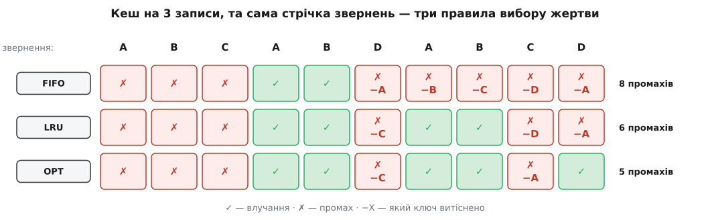

# Політики витіснення кешу: LRU, LFU, CLOCK

<preknowlist>
- [Кеш](root:hw-arch/cache) — мала швидка пам'ять із копіями гарячих даних; влучання, промах, локальність звернень.
- [Хеш-таблиця](root:sf-algorithms/hash-table) — пошук значення за ключем у середньому за сталий час.
- [Зв'язаний список](root:sf-algorithms/linked-list) — вузли з покажчиками; маючи вузол на руках, його вилучають за сталий час.
- [Асимптотична складність](root:computability/asymptotic-complexity) — що означає O(1) чи O(log n) і чому це вирішує, чи витримає структура мільйон операцій за секунду.
- [Амортизований аналіз](root:computability/amortized-analysis) — як рахувати вартість операції, коли зрідка вона дорога, а зазвичай майже безкоштовна.
</preknowlist>

Перед базою даних стоїть кеш на 64 ГБ. Приходить запит на ключ, якого в кеші немає: сервіс іде в базу, чекає свої вісім мілісекунд, дістає значення — і хоче покласти його в кеш, щоб наступного разу було швидко. Та вільного місця немає: усі 64 ГБ зайняті. Щоб покласти новий запис, доведеться викинути якийсь старий.

Питання «чи викидати» навіть не постає. Воно зникло б лише тоді, якби всі дані, які реально просять, помістилися в кеш, — а так буває хіба в іграшкових системах: гаряча множина ключів майже завжди більша за пам'ять, яку ви можете собі дозволити, бо швидка пам'ять коштує дорого, а даних щороку більшає. Тож у повному кеші **кожна вставка — це заміна**, і єдине справжнє питання: **кого викинути**. Цей вибір називають витісненням (англ. *eviction*, від лат. *evincere* — «виганяти, виселяти»), а правило, за яким його роблять, — політикою витіснення.

Здається дрібницею всередині структури даних. Погляньмо, скільки вона коштує назовні:

```
запитів на кеш                  = 200 000 / с
влучань 99 %  → промахів у базу = 200 000 · 0.01 = 2 000 / с
влучань 97 %  → промахів у базу = 200 000 · 0.03 = 6 000 / с
```

Частка влучань упала на два процентні пункти — навантаження на базу зросло **втричі**. Це і є справжня арифметика кешу: він працює як важіль, і політика витіснення сидить рівно на довгому плечі цього важеля. Помилка у виборі жертви не показує себе одразу — вона показує себе за півгодини, коли викинутий ключ попросять знову, і хтось знову піде в базу.

## Ідеальна політика вимагає майбутнього

Щоб зрозуміти, наскільки добре чи погано працює будь-яке правило, спершу треба знати, з чим його порівнювати. Тож поставмо питання нахабно: а який вибір жертви взагалі **найкращий**?

Відповідь напрошується сама, щойно сформулювати мету. Ми хочемо, щоб надалі було якнайменше промахів. Промах трапиться тоді, коли попросять ключ, якого в кеші немає. Отже, викидати треба той ключ, який попросять **найпізніше** з усіх, що зараз лежать у кеші, — а якщо якийсь не попросять узагалі, то саме його. Це правило описав угорський інженер Ласло Беладі (László Bélády), який працював в IBM, у праці 1966 року в *IBM Systems Journal*; його звуть іменем автора, а ще MIN або OPT (від англ. *optimal* — «оптимальний»).

Воно справді оптимальне — жодна інша політика не дасть менше промахів на тій самій стрічці звернень; доведення цього факту, поняття конкурентного відношення та межі, нижче якої не може опуститися жодне онлайнове правило, зібрані окремо: [математика заміщення сторінок](root:sf-data/cache-eviction-policies/math-competitive-paging.md).

І воно нездійсненне. Щоб застосувати правило Беладі, треба знати майбутнє — які ключі й коли попросять. Кеш працює **онлайн**: він мусить ухвалити рішення в ту саму мить, коли прийшов новий запис, не маючи жодного натяку на те, що буде далі.

Але нездійсненне правило дає дві цілком практичні речі. По-перше, **стелю**: записавши справжню стрічку звернень із продакшену, її можна програти офлайн і порахувати, скільки промахів дало б ідеальне правило. Якщо ваша політика дає 6 % промахів, а ідеал на тій самій стрічці — 5.4 %, то за політику вже нема чого боротися, треба докуповувати пам'ять. По-друге, **компас**: усі реальні політики — це різні способи **вгадати** те, що правило Беладі знає напевно, тобто час наступного звернення до ключа.

Наскільки великий буває розрив між здогадом і фактом, видно вже на десятьох зверненнях.


*Кеш уміщає три записи. **FIFO** викидає того, хто пролежав найдовше від вставки, — і на шостому кроці вибиває A, до якого звернуться вже за крок. **LRU** викидає того, кого найдовше не питали, і тримається набагато краще. **OPT** знає майбутнє: на дев'ятому кроці він викидає A, бо до A більше ніколи не звернуться, — і завдяки цьому останнє звернення до D стає влучанням, якого не мають ні FIFO, ні LRU.*

Придивімося до дев'ятого кроку, бо він показує різницю між «розумним» і «оптимальним» точніше за будь-яке означення. У кеші лежать A, B, D; приходить C, треба когось вибити. LRU дивиться в минуле й бачить: D брали давніше за всіх — виганяє D. OPT дивиться в майбутнє й бачить: A не попросять більше ніколи, а D попросять уже наступним кроком — виганяє A. Обидва міркують бездоганно; просто одному доступний факт, а другому лише здогад.

FIFO ж (англ. *first in, first out* — «перший прийшов, перший вийшов») спирається взагалі не на звернення, а на вік запису в кеші, тобто на те, що з майбутнім не пов'язане ніяк. Через це FIFO має славнозвісну ваду: зі збільшенням кеша кількість промахів може **зрости**. Це не парадокс і не помилка вимірювання — Беладі разом із Робертом Нельсоном і Джеральдом Шедлером (Robert A. Nelson, Gerald S. Shedler) у 1969 році опублікували в *Communications of the ACM* приклад, де більший кеш дає більше промахів; конкретну стрічку й розбір винесено в ту саму [математичну вставку](root:sf-data/cache-eviction-policies/math-competitive-paging.md). LRU такої аномалії не має, і причина цього — теж математика, а не удача.

## З минулого видно рівно дві речі

Отже, майбутнє недоступне, лишається минуле. Що саме з нього можна витягти про кожен ключ, який зараз лежить у кеші?

Список виявляється коротким. **Коли до ключа зверталися востаннє** — назвімо це свіжістю. І **скільки разів до нього зверталися** — це частота. Є ще похідні від них величини (коли ключ вставили, як розподілені звернення в часі, який інтервал між двома останніми), але вони — комбінації тих самих двох спостережень. Уся різноманітність політик виростає з того, як саме перетворити ці два числа на одне рішення.

Чому свіжість узагалі щось передбачає? Через часову локальність: реальні програми звертаються до даних не рівномірно, а купчасто — до чого щойно торкнулися, найпевніше торкнуться ще раз. Користувач, який відкрив свій профіль, за секунду відкриє його стрічку, потім сповіщення, і всі три запити чіпатимуть той самий набір ключів.

Чому щось передбачає частота? Через перекіс популярності: у реальному трафіку мала частка об'єктів забирає більшість звернень — десяток вірусних дописів проти мільйона звичайних, кілька категорій товарів проти всього каталогу. Такий перекіс описують [законом Зіпфа](root:math-probability/zipf-law) — популярність об'єкта падає приблизно як одиниця, поділена на його ранг у списку популярності, тож найпопулярніший ключ просять удвічі частіше за другий і вдесятеро частіше за десятий. Саме тому кеш на 1 % даних може ловити 80 % запитів, і саме тому лічильник звернень — цінна річ: він відрізняє мешканця вершини списку від випадкового перехожого.

Обидва сигнали чесні, обидва неповні. Найкраще це видно, коли розкласти ключі на чотири випадки.


*Коли обидва сигнали кажуть те саме (щойно питали й питали багато — тримати; давно не питали й майже не питали — викидати), політика не має значення. Уся різниця в двох червоних клітинках. Ключ із багатьма зверненнями, до якого зараз пауза, LRU викине, а LFU збереже. Ключ, який щойно вперше прочитали під час наскрізного проходу даними, LRU збереже, а LFU викине. Хто має рацію — залежить від того, що це за ключ насправді, а сам сигнал цього не каже.*

Зверніть увагу на прикру симетрію: у кожній червоній клітинці одна політика виграє, а друга програє, і жодна з них не має способу дізнатися, у якій клітинці вона зараз опинилася. Саме з цих двох клітинок ростуть усі відомі провали кешів на проді — тож варто розібрати кожну політику разом із її власною клітинкою.

## LRU: ставка на свіжість

Правило просте: коли треба звільнити місце, викинути той запис, до якого **найдовше не зверталися**. Ім'я в нього незграбне, зате точне — LRU (англ. *least recently used* — «найдовше не вживаний»).

Чому це добрий вибір за замовчуванням? Бо він прямо втілює часову локальність: якщо про ключ ніхто не згадував десять хвилин, поки решту чіпали щосекунди, то це найкращий доступний доказ, що ключ вийшов із гарячої множини. LRU не потребує ані налаштувань, ані знання про предметну ділянку, і на переважній більшості реального трафіку тримається на пристойній відстані від ідеалу.

Механіка — пара структур, що працюють разом. Хеш-таблиця дає доступ до запису за ключем; усі записи, крім того, зв'язані у двобічний список у порядку свіжості: щойно вжитий на голові, найдавніший на хвості. Влучання — це вилучити вузол із його місця та причепити на голову; витіснення — зняти вузол із хвоста. Обидві дії коштують O(1), бо вузол уже на руках із хеш-таблиці, і його не треба шукати обходом. Робочий код обох структур із розбором вартості кожної операції — у [реалізації LRU й CLOCK](root:sf-data/cache-eviction-policies/proj-lru-clock.md).

І тут ховається неприємність, яка визначає долю LRU у великих системах. Погляньте ще раз на слово «влучання»: це **читання** з погляду користувача — і **запис** із погляду структури даних. Кожне читання переставляє вузол, тобто змінює щонайменше чотири покажчики в спільній структурі. Отже, читання доводиться впорядковувати між потоками: або брати замок, або городити хитрішу схему, бо дві одночасні перестановки в тому самому списку залишають по собі порвані покажчики — це той самий клас біди, що й будь-яка [гонка за спільними даними](root:sf-tasks/atomicity-races). На одному потоці це не помітно. На шістнадцятьох ядрах, що б'ють у кеш мільйон разів за секунду, це перетворюється на єдину точку, крізь яку тече весь трафік читань — і кеш, доданий заради швидкості, сам стає вузьким місцем.

Друга неприємність — не в ціні, а в самій ідеї. LRU **не має пам'яті про частоту**: одне-єдине звернення підіймає ключ на голову списку так само, як тисячне. Наслідок відомий кожному, хто адміністрував базу з кешем: нічний звіт або обхід каталогу проходить по мільйону рядків, кожен з яких потрібен рівно раз, — і кожен із цих рядків по черзі стає найсвіжішим записом, витісняючи гарячий набір, який збирався годинами. Такий наскрізний прохід (англ. *scan*) вимиває кеш повністю; вранці трафік приходить на холодний кеш, промахи злітають, база отримує потрійне навантаження — і все це без жодної зміни в коді застосунку.

> 🔧 **Навіщо це.** Вимитий скануванням кеш видно в метриках раніше, ніж у скаргах. Дивіться не на середню частку влучань за добу, а на її графік у часі: провал, що починається рівно тоді, коли стартує нічний звіт чи вивантаження, — це підпис наскрізного проходу. Другий свідок — вік витіснених записів: якщо кеш почав викидати записи, що прожили секунди, замість тих, що прожили години, значить, крізь нього ллється потік одноразових ключів. Обидві метрики варто мати ще до першого інциденту, бо під час інциденту їх ніколи ніхто не встигає додати.

Варто знати й теоретичну межу LRU. У 1985 році Деніел Слітор і Роберт Тарджан (Daniel Sleator, Robert Tarjan) показали: на кеші з k записів LRU у найгіршому разі дає в k разів більше промахів, ніж ідеальне правило, — і жодна детермінована онлайнова політика не може бути кращою за цю межу. Це не вирок LRU, а вирок самій ідеї детермінованого вгадування: суперник, який знає ваше правило, завжди зможе побудувати стрічку, де воно провалиться. Реальний трафік — не суперник, тому на практиці LRU працює добре; але саме звідси випливає, що «найкращої політики взагалі» не існує, є лише політика, краща для конкретного трафіку.

## LFU: ставка на частоту

Другий сигнал дає інше правило: рахувати звернення до кожного ключа й викидати того, кого просили **найрідше**. Це LFU (англ. *least frequently used* — «найрідше вживаний»).

Воно лікує рівно ту хворобу, від якої вмирає LRU. Мільйон одноразових ключів наскрізного проходу мають лічильник 1, а гарячий ключ — лічильник 40 000; жоден скан не викине гарячий набір, бо новачкам нічим його перебити. Кеш стає стійким до проходів даними без жодних додаткових хитрощів.

Але за цю стійкість LFU платить двома власними вадами, і обидві смертельні, якщо їх не лікувати.

**Скам'янілість.** Лічильник накопичується вічно, а популярність — ні. Допис, який тиждень тому зібрав мільйон переглядів, сьогодні не цікавий нікому, проте його лічильник назавжди більший за лічильник ключа, який став гарячим годину тому. Мертва зірка займає місце в кеші, і чим довше живе система, тим більше в ній таких мертвих зірок: кеш поступово перетворюється на музей учорашньої популярності.

**Новачок не може прорватися.** Ключ, який щойно почав ставати популярним, має лічильник 1 — тобто він перший кандидат на виліт. Його викидають, він приходить знову, знову з лічильником 1, знову вилітає. Кеш нездатний **навчитися** новому гарячому ключу саме тоді, коли це найпотрібніше, — на початку сплеску.

Обидві вади лікують одним прийомом: **лічильники мають старіти**. Або періодично ділити всі лічильники навпіл, або зменшувати лічильник ключа пропорційно часу, що минув від останнього звернення. Тоді число в лічильнику означає вже не «скільки разів узагалі», а «наскільки часто останнім часом» — тобто частоту з обмеженим горизонтом пам'яті. Довжина цього горизонту стає окремим налаштуванням із власним компромісом: коротка пам'ять робить кеш нервовим і схожим на LRU, довга — знову веде до музею.

Є й ціна самого підрахунку. Щоб швидко знаходити мінімум лічильника, потрібна [черга з пріоритетом](root:sf-algorithms/priority-queue-adt) — а це O(log n) на кожне звернення замість O(1). Обійти це можна, тримаючи ключі з однаковим значенням лічильника в спільних списках: тоді інкремент — це перечеплення вузла в сусідній список, а пошук жертви — погляд у найнижчий непорожній список, обидві дії за сталий час. Але структура виходить помітно складнішою за пару «хеш плюс список», і кожне читання знову виявляється записом — з тією самою бідою на багатьох ядрах.

І пам'ять: лічильник на кожен ключ треба десь тримати. Практика тут винахідлива. Redis, наприклад, зберігає частоту у **восьми бітах** — і не як точне число, а як лічильник Морріса: інкремент відбувається лише з певною ймовірністю, і що більше значення, то менша ця ймовірність. Вісім бітів у такому вигляді покривають діапазон приблизно до мільйона звернень; точність на верхніх значеннях груба, але для порівняння двох ключів достатньо й порядку величини. Раз на хвилину лічильник ще й згасає, щоб мертві зірки не жили вічно.

## Чому точний порядок буває не по кишені

Обидва правила, LRU і LFU, мовчки припускають одне: що кеш може **бачити кожне звернення й на кожне реагувати**. У маленькому прикладі це припущення непомітне, бо здається безкоштовним. У справжній системі воно коштує грошей — і подекуди взагалі невиконанне.

Причин три, і вони різні за природою.

**Ціна на кожному влучанні.** Перестановка вузла коштує кількох записів у спільну структуру під замком. Поки кеш обслуговує тисячу запитів за секунду, це шум; коли він обслуговує мільйон із десятків потоків, замок стає єдиною чергою, крізь яку тече все. Парадоксальний підсумок: кеш може працювати **повільніше** за пам'ять, яку він прикриває, бо доступ до пам'яті паралельний, а доступ до замка — ні.

**Неможливість спостерігати.** У кеші сторінок операційної системи звернення до сторінки робить процесор, а не ядро: програма просто читає з адреси. Ядро про це не дізнається — воно фізично не має куди вставити свій код. Єдине, що лишається, — біт звернення, який залізо самотужки виставляє в записі таблиці сторінок; ця таблиця й перетворення адрес крізь неї — механізм, на якому стоїть [віртуальна пам'ять](root:hw-arch/virtual-memory). Точний порядок звернень тут не «дорогий», а **недоступний**: щоб його мати, довелося б переривати кожне читання пам'яті.

**Пам'ять на службові дані.** Двобічний список вимагає двох покажчиків на запис — 16 байтів на 64-бітній машині:

```
точний LRU   : 2 покажчики × 8 байтів = 16 байтів на запис
годинник     : 1 біт                  ≈ 0.125 байта на запис
Redis        : 24-бітний лічильник часу в заголовку об'єкта = 3 байти

100 млн записів × (16 − 3) байтів ≈ 1.3 ГБ службових даних
```

Для кеша з мільйонів дрібних записів це не дрібниця, а гігабайти, забрані в самих даних, — тобто менший кеш і більше промахів через саме прагнення до точності.

Висновок з усіх трьох причин той самий: **робота має піти зі шляху читання**. Звернення мусить коштувати якнайдешевше, а всю розумову працю треба відкласти на мить витіснення, яка трапляється рідше.

## CLOCK: наближення за один біт

Ось як це виглядає, доведене до межі. У кожного запису є **один біт звернення**. Влучання не переставляє нічого — воно просто пише в цей біт одиницю. Записи стоять по колу, і по колу ходить стрілка. Коли треба когось витіснити, стрілка починає крокувати: побачила біт 0 — це жертва, стоп; побачила біт 1 — скинула його в 0 і пішла далі. За цей звичай давати помилуваному ще одну спробу правило звуть другим шансом, а за кільце зі стрілкою — CLOCK (англ. *clock* — «годинник»).

Придумали його не для вебових кешів. Кільце зі стрілкою описав Фернандо Корбато (Fernando J. Corbató) з MIT у звіті 1968 року про сторінкування в системі Multics — тобто рівно там, де ядро не бачить звернень і має лише апаратний біт. Уся ця родина правил народилася в 1960-х довкола однієї задачі — розкласти програму між швидкою й повільною пам'яттю — і через сорок років переїхала у вебові кеші майже без змін: [звідки взялися LRU, CLOCK і сама задача витіснення](root:sf-data/cache-eviction-policies/hist-paging-origins.md).


*Уся вартість влучання — один запис біта: не потрібні ні замок, ні перебудова списку, ні навіть узгодження між потоками, бо два потоки, що записують одиницю в той самий біт, не можуть зіпсувати одне одному результат. Уся робота відкладена на витіснення, а стрілка при обході роздає другий шанс кожному, кого чіпали від її минулого проходу.*

Скільки коштує саме витіснення? Кожен крок стрілки або знаходить жертву, або скидає один біт у нуль. А біт у одиницю могло поставити тільки влучання. Отже, за весь час роботи кількість «холостих» кроків стрілки не перевищує кількості влучань — тобто на одне витіснення в середньому припадає стала кількість кроків, хоча окреме витіснення може обійти майже все коло. Це класичний випадок для [амортизованого аналізу](root:computability/amortized-analysis): дорога операція трапляється рідко й оплачена дешевими.

Що при цьому втрачається? Точність порядку. Біт розрізняє лише дві градації: «чіпали від минулого проходу стрілки» і «не чіпали». Усередині кожної групи порядку немає — CLOCK може викинути ключ, до якого зверталися десять секунд тому, лишивши той, до якого зверталися хвилину тому, якщо стрілка проходила повз них у невдалий момент. Це наближення LRU, а не LRU. На реальному трафіку різниця в частці промахів зазвичай виявляється в межах кількох десятих відсотка — а виграш у здатності триматися під навантаженням буває кратним.

Ідея настільки вдала, що навколо неї виросла родина. Замість одного біта беруть невеликий лічильник — стрілка не скидає його в нуль, а зменшує на одиницю; тоді ключ, до якого зверталися часто, переживає кілька проходів, і правило непомітно змішує свіжість із частотою. Саме такий підхід — «стрілка з лічильниками використання» — працює в буферному менеджері PostgreSQL, і потрапив він туди повчальним шляхом: у версії 8.0 буфери вів ARC, у 8.0.1 його терміново замінили на інше правило через патент IBM, а у 8.1 з'явилася теперішня стрілка, яка заразом розв'язала й проблему конкурентного доступу. Ядро Linux теж не веде точного LRU для сторінок: воно тримає два списки, активний і неактивний, і переміщує сторінки між ними за бітами звернення — та сама відкладена, наближена оцінка.

> 🔧 **Навіщо це.** Фраза «наш кеш веде точний LRU» у гарячому багатопотоковому шляху — привід поставити питання, а не похвалити. Точний порядок означає запис у спільну структуру на кожному читанні, тобто замок, крізь який тече весь трафік. Якщо ви бачите, що зі зростанням числа потоків пропускна здатність кеша перестає рости (а то й падає), а профіль показує час у замку кеша — міняйте не розмір кеша, а спосіб обліку свіжості: біт звернення або випадкова вибірка знімають цю стелю, коштуючи часток відсотка влучань.

## Випадкова вибірка: те саме наближення з іншого боку

Є ще дешевший спосіб не тримати точного порядку — не тримати його взагалі. Коли треба когось витіснити, візьміть **кілька випадкових ключів** і викиньте найгіршого серед них за вашим критерієм. Ніяких списків, ніяких кілець: у кожного ключа лише мітка часу останнього звернення, яку влучання оновлює одним записом.

Наскільки грубим виходить такий вибір? Рахується просто. Нехай ми хочемо, щоб жертва потрапила в найстаріші 10 % ключів:

```
вибірка з 5 ключів : P(жодного зі старих 10 %) = 0.9⁵  = 0.590
                     P(жертва зі старих 10 %)  = 1 − 0.590 = 0.410
вибірка з 10 ключів: P(жертва зі старих 10 %)  = 1 − 0.9¹⁰ = 0.651
```

Тобто п'ять випадкових проб дають шанс 41 % влучити в найстаріший десяток відсотків — не блискуче, але й далеко не сліпий вибір, а коштує це п'ять звернень до пам'яті замість службової структури на весь кеш. Саме так працює Redis: за замовчуванням він пробує п'ять ключів (`maxmemory-samples 5`), а від версії 3.0 ще й тримає пул найкращих кандидатів, знайдених минулими разами, — це помітно наближає результат до справжнього LRU без жодних покажчиків. У заголовку кожного об'єкта під облік свіжості відведено 24 біти замість двох покажчиків, і на кеші з десятків мільйонів ключів ця економія прямо перетворюється на додаткові збережені дані.

Тут же видно, як політика витіснення сплітається з іншими рішеннями про кеш. Redis дозволяє вибирати не лише правило (свіжість чи частота), а й **множину кандидатів**: викидати будь-який ключ чи тільки ті, яким виставили строк життя. Строк життя — це вже не витіснення, а протухання: воно прибирає запис тому, що той **застарів як відповідь**, тоді як витіснення прибирає живий і правильний запис лише тому, що бракує місця. Ці дві причини часто плутають, а вони незалежні: запис може бути свіжим і бути витісненим, може бути непотрібним і лежати, доки не мине строк. Ідея запису, що живе рівно доти, доки його оновлюють, розібрана окремо — [м'який стан](root:sf-distributed/soft-state); а те, чому саме прибирання застарілих відповідей є найважчою частиною кешування, — у темі [ціна другого джерела правди](root:sf-data/cache-invalidation-intro).

## Суміші: іспитовий строк, привиди, впуск

Жоден серйозний кеш сьогодні не живе на одному сигналі. Коли відомо, що саме ламається в кожному правилі, ліки стають майже очевидними — і всі вони так чи інакше поєднують свіжість із частотою.

**Іспитовий строк.** Новий ключ не пускають одразу в основну частину кеша: спершу він лежить в окремій невеликій зоні, і лише **друге** звернення переводить його до «дорослих». Мільйон одноразових ключів наскрізного проходу проходить крізь цю зону, не зачепивши гарячого набору, — стійкість до сканів з'являється майже задарма. Так побудовані класичні правила 2Q і LRU-K, і так само влаштований memcached: його список поділено на сегменти HOT, WARM і COLD, фоновий потік перекладає між ними записи, і потрапити з HOT у WARM може лише той, кого зачепили вдруге. Практична вигода подвійна: сегменти мають окремі замки, тож розсипається і та єдина черга, що душила точний LRU.

**Привиди.** ARC (англ. *adaptive replacement cache* — «кеш із пристосовною заміною»), який Німрод Мегіддо й Дхармендра Модха (Nimrod Megiddo, Dharmendra Modha) представили в IBM 2003 року, тримає два списки — свіжих і частих — і додає до них пам'ять про **вже витіснені** ключі, самі лише ключі без значень. Якщо промахи раз у раз падають на ключі, витіснені зі списку свіжості, кеш сам собі збільшує частку під свіжість; якщо на витіснені зі списку частоти — навпаки. Політика перестає бути константою й починає підлаштовуватися під трафік, що змінюється протягом доби. Історія ARC заразом повчальна з іншого боку: IBM отримала на нього патент, і саме через це відкриті проєкти шукали обхідних шляхів — ZFS ARC узяв, PostgreSQL мусив відмовитися, а замість нього з'явилися вільні від патенту родичі на основі стрілки.

**Впуск.** Найглибший поворот думки стався тоді, коли питання перевернули. Досі ми питали «кого викинути», мовчки припускаючи, що новачка треба впустити. А чи треба? Якщо ключ прочитали з бази один-єдиний раз, то, впустивши його, ми **гарантовано** викидаємо когось заслуженого — і з великою ймовірністю програємо в обміні. Політика впуску (від лат. *admissio* — «допуск») влаштовує на вході двобій: оцінити частоту кандидата й частоту тієї жертви, яку збирався викинути кеш, і впустити новачка лише тоді, коли він виграє.


*Ключове тут — слова «довшу історію, ніж уміщає кеш». Оцінювач не зберігає ключів, лише приблизні лічильники, тож пам'ятати він може на порядок більше об'єктів, ніж сам кеш. Саме завдяки цьому новачок порівнюється не з нулем, а зі своєю справжньою популярністю за останній період.*

Так працює TinyLFU, який запропонували Гіл Айнцігер, Рой Фрідман і Бен Мейнс (Gil Einziger, Roy Friedman, Ben Manes) у працях 2015–2017 років. Частоти в ньому оцінює [ймовірнісний скетч частот](root:sf-algorithms/count-min-sketch) — кілька рядків маленьких лічильників, адресованих різними хеш-функціями, де оцінкою вважають найменший з них; на ключ виходять одиниці бітів замість повноцінного лічильника. Щоб оцінки старіли, усі лічильники періодично діляться навпіл, а щоб не витрачати місця на ключі, які трапилися рівно раз, перед скетчем ставлять маленький [фільтр Блума](root:sf-algorithms/bloom-filter) як прохідну. Практична версія W-TinyLFU (з англ. *window* — «вікно») додає перед впуском ще й невелику зону чистого LRU, щоб не губити коротких сплесків популярності; саме вона стоїть у бібліотеці Caffeine, звідки розійшлася по застосунках на JVM.

**Повернення до FIFO.** Найсвіжіший поворот полягає в тому, що правильна відповідь може виявитися ще простішою. У 2023 році на SOSP команда Джунченга Яна (Juncheng Yang) показала на кількох тисячах реальних стрічок з продакшену: більшість об'єктів у вебових кешах — це ключі, до яких звернулися рівно один раз, і якщо відфільтрувати їх маленькою чергою FIFO, то з самих лише черг FIFO виходить політика з меншою часткою промахів, ніж у складних сучасних правил, і водночас у кілька разів вища пропускна здатність на багатьох потоках — саме тому, що FIFO нічого не переставляє на влучанні. Наступного року та сама лінія досліджень дала SIEVE — по суті кільце зі стрілкою, у якому нових мешканців вставляють на початок, а стрілка ходить у своєму темпі й просіює тих, кого не чіпали. Урок той самий, що й у CLOCK, лише сказаний уголос: на великому масштабі вартість обліку часто важить більше, ніж витонченість самого правила.

## Як обирати політику, не вгадуючи

Усе назване — здогади про майбутнє, а здогад перевіряють вимірюванням, не смаком. Порядок дій, який дає відповідь швидше за будь-яку дискусію, такий.

**Програйте свою стрічку.** Запишіть у продакшені послідовність ключів (саму послідовність, без значень — це кілька байтів на запит) і проженіть її офлайн крізь кілька політик і кілька розмірів кеша. Ви отримаєте не думку, а криву: скільки промахів дає кожне правило на **вашому** трафіку. Тут же перевірте стелю Беладі на тій самій стрічці — вона скаже, чи лишився взагалі запас для розумнішої політики.

**Дивіться, де ви на кривій.** Залежність промахів від розміру кеша майже завжди має коліно: доти, доки кеш менший за гарячу множину, кожен доданий гігабайт різко зменшує промахи; після коліна крива стає пологою. Політика важить найбільше саме до коліна, коли доводиться жорстко обирати. Якщо ж ви вже за коліном, дешевше докупити пам'яті, ніж міняти алгоритм.

**Не вірте частці влучань, коли об'єкти різні.** Кеш, що роздає і 2-кілобайтний JSON, і 10-мегабайтне відео, легко покаже чудові 95 % влучань і при цьому вбиває канал, бо промахи припадають саме на важке. Тоді міряють частку влучань **у байтах**, а політику роблять чутливою до розміру й вартості промаху: викинути один великий об'єкт, який дешево дістати, вигідніше, ніж двадцять дрібних, кожен з яких коштує похід у далекий регіон. У роздачі статики це стандартна практика — про неї в темі [мережі роздачі](root:sf-distributed/cdn).

**Пам'ятайте, що вузлів багато.** У [розподіленому кеші](root:sf-distributed/distributed-cache) кожен вузол витісняє **самостійно**, зі своєї власної пам'яті, і жодної глобальної політики не існує. Звідси дві типові несподіванки. Перша: гарячий ключ живе на одному вузлі, і йому дістається весь трафік цього ключа, тоді як решта вузлів нудьгує (лікується дизайном ключів — [гарячі ключі](root:sf-distributed/cache-key-design)). Друга: додавання вузла перерозподіляє ключі, і частина кеша миттєво стає холодною, навіть якщо жодного витіснення не сталося; мінімізують це [консистентним хешуванням](root:sf-algorithms/consistent-hashing), яке рухає лише малу частку ключів.

**Стежте за зворотним зв'язком.** Витіснення — один із класичних двигунів лавини. Промахи зросли — навантаження на базу зросло — відповіді стали повільнішими — клієнти почали повторювати запити — у кеш полізло ще більше нових записів — витіснення прискорилося — промахів стало ще більше. Система застрягає в поганому стані й не виходить із нього навіть тоді, коли початкова причина зникла; цей клас відмов розібрано в темі [метастабільні відмови](root:sf-distributed/metastable-failures), а найгостріший його випадок — коли по одному щойно витісненому гарячому ключу одночасно б'ють тисячі запитів — у темі [гримуча отара](root:sf-distributed/cache-stampede).

> 🔧 **Навіщо це.** Три метрики кеша, які варто виводити на панель від першого дня: частка влучань, кількість витіснень за секунду й **вік запису в мить витіснення**. Третя найцінніша й найрідше присутня. Якщо кеш регулярно викидає записи віком у секунди, це не привід міняти політику — це доказ, що пам'яті менше за [робочу множину](root:sf-os/working-set), тобто за той набір ключів, який трафік реально чіпає у вікні часу; жодне правило вибору жертви цього не виправить. Політику варто чіпати тоді, коли вік витіснених розумний, а промахи все одно високі.

## Чому це насправді одне питання

Витіснення виглядає як технічна деталь структури даних, а насправді є висловленим припущенням про ваш трафік. LRU каже: «те, що чіпали недавно, чіпатимуть знову». LFU каже: «популярність стійка». CLOCK додає: «точність цих здогадів не варта тієї ціни, яку за неї беруть на кожному читанні». Політика впуску йде далі й ставить питання ребром: пам'ять кеша — це ресурс, за який ключі **змагаються**, і рішення про переможця можна ухвалювати на вході, а не лише на виході.

З цього боку видно, що «кого викинути» і «кого впустити» — не два питання, а одне: **що заслуговує на місце**. Кеш, який відповідає на нього лише в мить переповнення, приймає всіх і мусить постійно виправлятися; кеш, який відповідає на вході, платить дешевше й помиляється рідше.

І остання річ, яку легко пропустити: будь-яка відповідь на це питання — гіпотеза про трафік, а трафік змінюється. Нова функція в застосунку, новий звіт, зміна поведінки клієнтів — і припущення, під яке підбирали політику, тихо перестає бути правдою. Тому політику витіснення не «налаштовують раз», а тримають під наглядом разом із метриками, які показують, коли гіпотеза перестала працювати.
