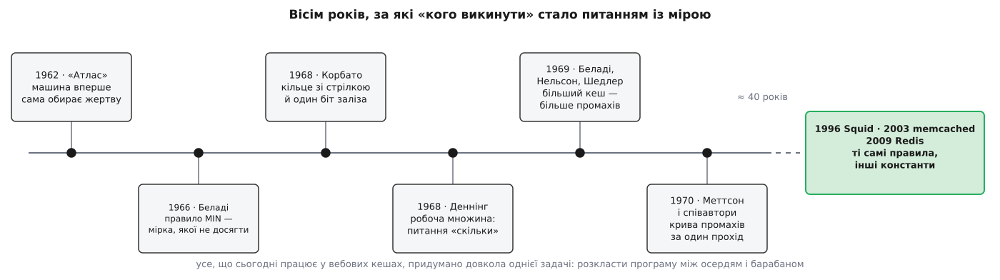
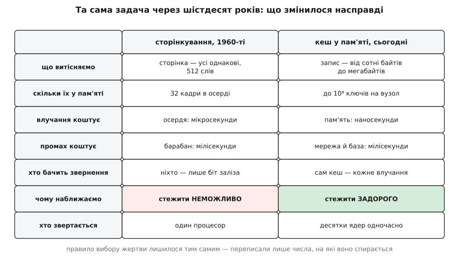

# 📜 Кого викинути: як питання народилося біля магнітного барабана

Ані LRU, ані кільце зі стрілкою, ані сама думка порівнювати політику з недосяжним ідеалом не мають жодного стосунку до вебу: усе це придумали між 1962 і 1970 роками інженери, що розкладали програму між магнітним осердям і барабаном. За ці вісім років задача «кого викинути» пройшла шлях від чергового здогаду до питання, на яке є міра, — і ця вставка про те, як саме вона його пройшла: хто дав мірку, яка аномалія зруйнувала найочевидніше припущення галузі, чому кільце зі стрілкою народилося саме в MIT і що з тих правил змінив масштаб, коли сорок років потому вони приїхали в memcached і Redis.


*Щільність цих років вражає навіть за мірками 1960-х: мірка, аномалія, наближення й теорія з'явилися майже одночасно й в одному колі людей, які розв'язували одну інженерну задачу. Розрив праворуч — сорок років, за які правила не змінилися, зате переписалися всі числа, на які вони спираються.*

## Питання, якого не існувало, поки вибирала людина

Доки програміст розкладав програму по швидкій пам'яті вручну — розрізав її на шматки й сам писав код, що в потрібну мить викидає один шматок і затягує наступний, — питання «кого викинути» не було задачею. Воно було рішенням людини, яка знає свою програму: коли ти сам написав цикл, ти знаєш, що після нього знадобиться, а що вже ні.

Задача з'явилася тієї миті, коли вибір передали машині. Це сталося 1962 року на британському «Атласі», який вперше показав програмі один суцільний простір адрес і сам перекачував сторінки між осердям і барабаном; історія цього кроку — у темі [віртуальна пам'ять](root:hw-arch/virtual-memory) та у вставці про [«Атлас» і Деннінга](root:hw-arch/virtual-memory/hist-atlas.md). Разом із зручністю прийшла нова біда: машина програми не знає, а викидати мусить.

Команда «Атласа» відповіла винахідливо — так званою навчальною програмою, яка припускала, що звернення до пам'яті циклічні, стежила за періодичністю й намагалася вгадати, коли кожну сторінку попросять наступного разу. Далі кожен виробник придумував своє. І тут галузь застрягла у становищі, у якому нічого не можна довести. Ви кажете, що ваше правило добре; я кажу, що моє краще; обидва маємо заміри на власних програмах. Немає способу з'ясувати, хто має рацію, — і, що гірше, немає способу дізнатися **головного**: чи взагалі лишився запас. Може, найкраще правило дало б удвічі менше збоїв, а може, ми вже за півкроку від межі й воюємо за десяті частки відсотка. Без цієї відповіді будь-яка розмова про політики — змагання смаків.

## Ласло Беладі: мірка замість чергової здогадки

Розв'язав це угорець Ласло Беладі (László Bélády). Народився 1928 року в Будапешті, скінчив Будапештський технічний університет за фахом механіка й авіаційного інженера, після придушення угорської революції 1956 року виїхав із країни, працював у Кельні та Парижі й 1961 року дістався США, де вступив до IBM і пропрацював у дослідному центрі Томаса Вотсона до 1981-го.

1966 року в *IBM Systems Journal* вийшла його праця «A Study of Replacement Algorithms for a Virtual-Storage Computer». Її головний хід виглядає майже як шахрайство. Замість вигадувати ще один хитріший передбачувач Беладі описав правило, яке **виконати неможливо**: викидати ту сторінку, до якої звернуться найпізніше з усіх наявних. Правило потребує знання майбутнього, тож у жодній машині працювати не може. Його назвали MIN.

Чому це не жарт, а найпрактичніша річ у всій історії? Бо стрічку звернень, записану на справжній програмі, можна програти **офлайн**, коли майбутнє вже відоме, — і тоді MIN стає не алгоритмом, а лінійкою. Уперше з'явилося число, з яким можна порівнювати: не «моє правило проти твого», а «моє правило проти неперевершуваного». І, що важливіше, розпалася суміш двох різних питань, які доти плуталися в одне. Багато збоїв — це тому, що правило дурне, чи тому, що пам'яті просто мало? Лінійка відповідає одразу: якщо MIN на тій самій стрічці дає майже стільки ж, скільки ваше правило, то правило ні до чого, треба більше осердя.

> Статус: усталено. Праця Беладі — *IBM Systems Journal*, том 5, № 2, 1966, с. 78–101; саме там уведено MIN (його ж звуть OPT або правилом Беладі). Біографія — за офіційними життєписами: угорець за походженням і громадянством до еміграції, з 1961 року в США й в IBM; помер 2021 року. Пізніше, працюючи вже над зовсім іншою темою, він разом із Мейром Леманом (Meir Lehman) сформулював закони еволюції програмного забезпечення — це той рідкісний випадок, коли одна людина лишила слід у двох незв'язаних галузях.

## 1969: більший кеш дає більше промахів

Далі трапилося те, що робить цю історію повчальною. Маючи в руках симулятор, яким проганяли стрічки звернень, Беладі разом із Робертом Нельсоном і Джеральдом Шедлером (Robert A. Nelson, Gerald S. Shedler) наштовхнувся на результат, який тоді виглядав як помилка вимірювання.

Уся галузь мовчки спиралася на припущення настільки очевидне, що його ніхто не записував: **більше пам'яті — менше збоїв**. На ньому будували все. Замовник питав, чи допоможе вдвічі більше осердя, — відповідь була самозрозуміла. Заміряли на машині з наявною пам'яттю, а висновок переносили на майбутню, більшу.

І ось на певній стрічці звернень правило FIFO — викидати того, хто пролежав найдовше від вставки, — дало на **чотирьох** кадрах пам'яті більше збоїв, ніж на **трьох**. Не на частку відсотка, а помітно. Стаття вийшла 1969 року в *Communications of the ACM* під назвою «An anomaly in space-time characteristics of certain programs running in a paging machine», і явище відтоді звуть аномалією Беладі.

Практичний наслідок був різкий і неприємний. Замір на одному розмірі пам'яті більше не давав права на висновок про інший розмір — принаймні доти, доки ви не знаєте, що ваше правило від цієї хвороби вільне. А з цього одразу випливало нове питання, вже теоретичне: **які правила від неї вільні й чому**.

> 🔧 **Навіщо це.** Питання шістдесятирічної давнини лишилося робочим. Коли ви заміряли частку промахів на кеші певного розміру й збираєтеся сказати «додамо вдвічі більше пам'яті — стане вдвічі краще», ця екстраполяція законна лише для правил, у яких доведено монотонність: LRU і MIN такі, а FIFO, кільце зі стрілкою й випадкова вибірка — ні. Для них єдиний чесний шлях — проганяти стрічку окремо на кожному розмірі, який ви розглядаєте. Найдорожчі помилки в плануванні місткості беруться саме звідси: хтось поміряв на одному розмірі, поділив і замовив залізо.

## 1970: стекові алгоритми й крива промахів за один прохід

Відповідь дала група з IBM — Меттсон, Гечеї, Слац і Трайгер (R. L. Mattson, J. Gecsei, D. R. Slutz, I. L. Traiger) — у праці «Evaluation techniques for storage hierarchies», *IBM Systems Journal*, том 9, № 2, 1970, с. 78–117.

Вони виділили клас правил, який назвали **стековими**. Означення просте до прозорості: правило стекове, якщо на будь-якій стрічці звернень вміст кеша на k записів завжди є підмножиною вмісту кеша на k+1 записів. Тобто більший кеш тримає все, що тримає менший, плюс дещо. Звідси аномалія неможлива механічно: якщо в меншому кеші звернення влучило, то шуканий ключ був і в більшому, отже, там теж влучило. LRU цю властивість має, FIFO — ні, і саме тому аномалія жила у FIFO.

Але з цієї властивості випав подарунок, який виявився цінніший за саме доведення. Якщо кеші всіх розмірів вкладені один в одного, то замість «у кеші чи ні» можна записувати одне число на кожне звернення — **глибину**, на якій ключ лежав у стеку свіжості. І тоді один прохід стрічкою дає відповідь одразу для всіх розмірів кеша: промах при місткості k — це рівно ті звернення, чия глибина більша за k.

**Стрічка A B C A B D A B C D, глибина в стеку свіжості на кожному зверненні (∞ — ключ бачимо вперше):**

```
стрічка :  A  B  C  A  B  D  A  B  C  D
глибина :  ∞  ∞  ∞  3  3  ∞  3  3  4  4

промахів = скільки глибин більші за місткість k:
k = 1 → 10      k = 3 → 6       k = 5 → 4
k = 2 → 10      k = 4 → 4
```

Уся крива — з одного проходу, без жодної повторної симуляції. Сьогодні цю криву звуть кривою частки промахів, і будують її рівно для того, щоб побачити коліно: доти, доки кеш менший за гарячу множину, кожен доданий гігабайт різко зменшує промахи, а після коліна крива стає пологою й купувати пам'ять уже безглуздо. Порада «запишіть стрічку в продакшені й проженіть її офлайн» — це прямий нащадок статті 1970 року, і навіть її обчислювальна вартість досі та сама: точна глибина коштує дорого, тож у сучасних вимірювачах стрічку зазвичай проріджують і рахують оцінку.

> Статус: усталено. Обидві праці перевірені за бібліографічними записами: аномалія — *CACM*, том 12, № 6, 1969, с. 349–353; стекові алгоритми — *IBM Systems Journal*, том 9, № 2, 1970, с. 78–117. Порядок подій саме такий: спершу знайдено аномалію, за рік — пояснено, які правила від неї застраховані.

## Кільце зі стрілкою: правило, продиктоване сліпотою

Поки в IBM міряли, у MIT будували. Там ішла робота над Multics — системою [розподілу часу](root:sf-devices/time-sharing-history), де в одній пам'яті водночас живуть програми багатьох користувачів. Керував нею Фернандо Корбато (Fernando J. Corbató, 1926–2019), американський інженер, до того автор CTSS, а згодом лауреат премії Тюрінга 1990 року.

Його звіт про експеримент зі сторінкуванням у Multics — саме експеримент, з вимірюваннями, а не теорія — містить опис кільця зі стрілкою: сторінки стоять по колу, стрілка ходить по ньому й шукає жертву, а помилуваному дає ще одну спробу. Це те, що сьогодні звуть CLOCK.

Найцікавіше тут — **чому** воно народилося в ядрі операційної системи, а не в дослідному центрі, де рахували стрічки. Ядро не бачить звернень до пам'яті. Коли програма читає з адреси, читає процесор; ядру нема куди вставити свій код, бо звернення до пам'яті — це не системний виклик, а одна машинна інструкція. Щоб вести точний порядок свіжості, довелося б переривати кожне читання — тобто зробити машину повільнішою в тисячі разів. Єдине, що лишається, — біт, який апаратура сама виставляє в записі таблиці сторінок, коли до сторінки звернулися. Один біт на сторінку, дві градації: чіпали від минулого проходу стрілки чи не чіпали.

Отже, кільце зі стрілкою не є компромісом, на який пішли задля простоти. Це єдине, що взагалі можна побудувати на тій інформації, яка доступна. Приблизність тут не вибір, а вихідні дані — і саме тому CLOCK з'явився там, де апаратура вимірює за вас, а не там, де ви самі рахуєте звернення.

> Статус: усталено з однією обережністю щодо дати. Праця Корбато «A Paging Experiment with the Multics System» друком вийшла 1969 року розділом у збірнику на пошану Філіпа Морса («In Honor of P. M. Morse», MIT Press, с. 217–228); сам звіт для проєкту MAC датують 1968-м, і саме на 1968 рік посилається більшість пізніших робіт. Розбіжність у джерелах стосується року документа, а не авторства чи змісту.

## Суперечка, яку сьогодні згадують рідше: скільки, а не кого

Того ж 1968 року Пітер Деннінг (Peter J. Denning) опублікував у *CACM* модель робочої множини — набору сторінок, до яких програма зверталася за останнє вікно часу. Про неї докладно в темі [робоча множина](root:sf-os/working-set); тут важить лише одне: вона поставила під сумнів саму постановку питання.

Бо Деннінг фактично сказав ось що. Ви сперечаєтеся, **кого** викинути, а справжня змінна — **скільки** пам'яті дістається кожній програмі. Якщо кожна тримає свою робочу множину цілою, збої трапляються рідко й правило вибору жертви майже нічого не вирішує. Якщо ж сума робочих множин переросла пам'ять, то жодне правило не рятує: будь-яка викинута сторінка потрібна негайно.

Із цього виріс поділ, який тоді був гострою суперечкою, а сьогодні лежить в основі кожного ядра: витісняти **глобально**, вибираючи жертву з усієї пам'яті, чи **локально**, у межах кожної програми окремо. Глобальне витіснення краще ділить пам'ять між нерівномірними споживачами, зате дозволяє одній програмі з'їсти чужу робочу множину; локальне захищає сусідів ціною гіршого використання. Той самий вибір ви робите й сьогодні, коли вирішуєте, чи ставити спільний кеш на всі види даних, чи різати його на окремі зони з власними квотами.

## Сорок років, після яких змінилися лише константи

Далі в історії — довга пауза. Правила лежали в підручниках з операційних систем, аж поки не з'явився новий споживач: вебові кеші. Squid, кешувальний проксі, вийшов 1996 року з проєкту Harvest — його зробив Дуейн Весселз (Duane Wessels). Memcached написав 2003 року Бред Фіцпатрик (Brad Fitzpatrick) для LiveJournal. Redis почав 2009 року Сальваторе Санфіліппо (Salvatore Sanfilippo). І всі вони взяли ті самі LRU, наближення LRU й лічильники частоти зі старінням, з тими самими іменами.

Що ж змінилося насправді?


*Найважливіший рядок — передостанній. Правило те саме, дані для нього ті самі, а причина, з якої від точності відмовляються, за шістдесят років змінилася на протилежну.*

**Одиниця стала нерівною.** Сторінки були однакові за означенням, тому «одна сторінка» правила за одиницю обліку. Запис у кеші може важити сто байтів, а може десять мегабайтів, і викинути один великий часто вигідніше, ніж двадцять дрібних. Звідси беруться речі, яких у 1966-му бути не могло: частка влучань у байтах, класи розмірів, політики, чутливі до вартості промаху.

**Одиниць стало на сім порядків більше.** В осерді «Атласа» вміщалося 32 кадри — службові дані на кадр ніхто не рахував, бо їх було нікчемно мало. У кеші на сотню мільйонів записів два покажчики списку свіжості перетворюються на гігабайти, забрані в самих даних. Саме тому Redis тримає лічильник частоти у восьми бітах, а свіжість — у двадцяти чотирьох, і саме тому взагалі виникла думка не тримати порядку, а брати кілька випадкових ключів і викидати найгіршого з них.

**Важіль подовшав.** Звернення до осердя коштувало мікросекунди, до барабана — мілісекунди: різниця в тисячі разів. Сьогодні влучання коштує наносекунди, а промах — усе ті самі мілісекунди походу в базу: різниця вже в десятки тисяч разів. Тобто ціна помилки зросла, а бюджет часу на кожне влучання, у межах якого можна вести облік, навпаки, стиснувся. Правило мусить бути водночас розумнішим і дешевшим.

**З'явилася конкуренція за структуру.** У 1968 році процесор був один, і те, що влучання переставляє вузол у спільному списку, нікого не турбувало. На десятках ядер цей самий список під замком стає єдиною чергою, крізь яку тече весь трафік читань. Через це кільце зі стрілкою повернулося у вебові кеші — але вже з іншої причини, ніж воно з'явилося в Multics.

Ось у цій зміні причини й полягає найтонше в усій історії. У 1968 році ядро наближало LRU, бо стежити за зверненнями було **неможливо**: апаратура давала один біт і більше нічого. Кеш у пам'яті процесу бачить кожне влучання чудово — і все одно наближає, бо реагувати на кожне **задорого**. Одна й та сама відповідь — один біт, уся робота відкладена на витіснення — приходить двічі, з протилежних причин: спершу від нестачі інформації, потім від нестачі часу на неї.

І одна річ, якої в тих роках не було зовсім. У сторінкуванні впускати сторінку обов'язково: якщо програма спіткнулася об її відсутність, вона стоїть і чекає саме на неї, іншого виходу немає. Тому питання «а чи впускати новачка взагалі» шістдесят років навіть не поставало — його не було з чого поставити. Воно з'явилося лише тоді, коли кеш перестав бути єдиним шляхом до даних і став необов'язковою зупинкою: значення можна взяти з бази й **не класти** в кеш, залишивши місце тому, хто його заслужив. Це та частина сьогоднішньої задачі, якої в спадку 1960-х просто немає.
