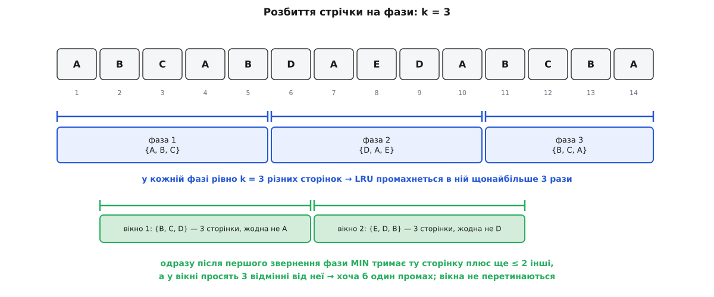
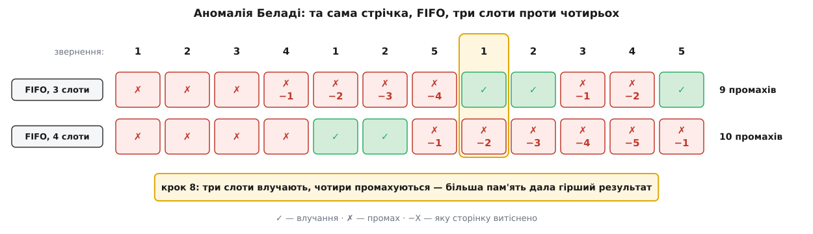

# 🧮 Математика заміщення: чому MIN оптимальний, LRU відстає рівно в k разів, а FIFO ламається від зайвої пам'яті

Чотири твердження про витіснення переказують як фольклор, доки їх не доведеш: правило Беладі справді дає найменше можливих промахів; LRU у найгіршому разі відстає від нього рівно в k разів; нижче за k не опуститься жодне детерміноване онлайнове правило; а FIFO вміє дати **більше** промахів на **більшому** кеші. Тут — самі викладки: обмінний аргумент, розбиття стрічки на фази, побудова суперника й конкретна стрічка з підрахунком до останнього промаху.

## Модель: що саме рахуємо

Сторінки (записи, ключі — байдуже) беруться зі скінченного універсуму U. **Стрічка звернень** σ = σ₁σ₂…σₙ — послідовність елементів U. Кеш уміщає рівно k сторінок. Правило A, обробляючи σₜ, або має цю сторінку (**влучання**, коштує 0), або не має (**промах**, коштує 1) — тоді сторінку треба завантажити, а якщо кеш повний, спершу когось витіснити.

Вартість A(σ) — це кількість промахів, і більше нічого. Отже, мовчазне припущення моделі: усі сторінки однакові за розміром і однаково дорого дістаються ззовні. Це не завжди правда в житті, зате робить задачу чистою: єдине, чим правило може відрізнитися від іншого, — вибір жертви.

Дві домовленості про клас правил.

**Заміщення на вимогу** (англ. *demand paging*): кеш змінюється лише в мить промаху — рівно одна сторінка входить, і рівно одна (якщо місця немає) виходить. Правилу не вільно ані підтягувати сторінки наперед, ані звільняти місце заздалегідь.

Ця домовленість нічого не коштує, і це варто показати одразу, бо далі знадобиться. Нехай правило B тягне сторінки коли заманеться. Побудуємо з нього B′, що працює на вимогу: коли B завантажує сторінку p, якої зараз ніхто не просить, B′ лише запам'ятовує намір і нічого не робить; коли p справді попросять — а якщо не попросять, то й поготів — B′ виконає це завантаження тоді. Кожне завантаження B′ походить зі свого завантаження в B, а деякі з них узагалі не знадобляться, тож B′(σ) ≤ B(σ). Тому доводити можна для правил на вимогу, а користуватися висновком — для всіх.

**Онлайн і офлайн.** Онлайнове правило ухвалює рішення на кроці t, знаючи лише σ₁…σₜ. Офлайнове бачить усю стрічку наперед. MIN — офлайнове; усе, що працює в живій системі, — онлайнове.

## Правило Беладі оптимальне: доведення обміном

**MIN** на кожному промаху витісняє ту сторінку з кеша, до якої звернуться найпізніше; якщо до якоїсь не звернуться взагалі — саме її. Нічиї розв'язуємо наперед фіксованим правилом (скажімо, за меншим номером сторінки), щоб MIN був однозначним.

> **Твердження.** Для будь-якої стрічки σ і будь-якого правила A — навіть офлайнового, хай яким хитрим воно буде, — виконано MIN(σ) ≤ A(σ).

Доводимо [обмінним аргументом](topic:sf-algorithms/greedy-algorithms) — тим самим прийомом, яким доводять жадібні алгоритми: беремо чужий розв'язок і крок за кроком підтягуємо його до свого, щоразу не погіршуючи вартості.

Позначмо через Aᵢ правило, яке на перших i промахах чинить точно як MIN, а від i+1-го — як A. Тоді A₀ = A, а A_n = MIN (промахів не більше за довжину стрічки). Досить довести, що Aᵢ(σ) ≤ Aᵢ₋₁(σ) для кожного i, — ланцюжок нерівностей дасть MIN(σ) ≤ A(σ).

Нехай B = Aᵢ₋₁. До i-го промаху B і MIN чинили однаково, тож мають однакові кеші й однакову вартість; отже, промахуються вони на тих самих зверненнях. На i-му промаху B витісняє сторінку p, а MIN витіснив би q. Якщо p = q, то Aᵢ = Aᵢ₋₁ і доводити нема чого. Хай p ≠ q. Будуємо B′ = Aᵢ: на цьому промаху воно витісняє q, а далі повторює ходи B, поки не зітре єдину розбіжність між ними.

Одразу після i-го промаху:

```
кеш B   = S ∪ {q},   |S| = k − 1
кеш B′  = S ∪ {p}
вартість B′ = вартість B
```

Тепер B′ повторює ходи B, тримаючи інваріант: кеші різняться щонайбільше однією сторінкою (у B лежить q, у B′ — p), а вартість B′ не більша. Розберімо чергове звернення r.

**r ∉ {p, q}.** Обидва або влучають, або промахуються — однаково, бо решта кеша в них спільна. Якщо промах і B витісняє x ≠ q, то B′ витісняє те саме x: розбіжність лишається рівно та сама. Якщо ж B витісняє саме q, то B′ витісняє p — і кеші стають однаковими, після чого B′ просто копіює B до кінця стрічки.

**r = q.** Цього випадку не буде — і саме тут працює вибір MIN. Із двох сторінок p і q першою попросять p: адже q обрано як ту, чиє наступне звернення найдальше серед усіх, що лежали в кеші, а p там лежав. Якщо q не попросять узагалі — тим паче.

**r = p.** B промахується, B′ влучає. B витісняє якесь x і завантажує p.

- Якщо x = q, то кеш B стає S′ ∪ {p} — точно кеш B′. Кеші зрівнялися, при цьому B заплатив 1, а B′ — 0.
- Якщо x ≠ q, то B′ теж витісняє x і завантажує q. Кеші знову однакові, обидва заплатили по 1.

Обидві гілки стирають розбіжність, і жодна не робить B′ дорожчим. Отже, B′(σ) ≤ B(σ) для будь-якого продовження стрічки. ∎

Друга гілка — це та сама неохайність, заради якої вище доводили лему про заміщення на вимогу: B′ завантажує q, хоч ніхто його не просив. За лемою такий розклад перетворюється на розклад на вимогу без жодного зайвого промаху, тож висновок стоїть.

Практичний наслідок один, зате важливий: MIN(σ) — це не «ще одна політика в списку», а **нижня межа для всіх**. Прогнати записану стрічку крізь MIN означає дізнатися, скільки промахів на ній не прибрати ніяк, — і тільки після цього має сенс питати, чи варта ваша політика заміни.

## Конкурентне відношення: що саме означає «наскільки гірше»

Онлайнове правило не має шансів дорівняти MIN, бо не бачить майбутнього. Питання не «чи гірше», а «наскільки гірше в найгіршому разі», і його треба вміти записати числом.

> **Означення.** Правило A є **c-конкурентним**, якщо існує стала α, яка не залежить від σ, така що для кожної стрічки σ виконано A(σ) ≤ c · MIN(σ) + α. Найменше таке c звуть **конкурентним відношенням** правила A.

```
A(σ) ≤ c · MIN(σ) + α        для всіх σ
```

Три деталі цього означення варті окремого слова, бо кожна з них закриває свою лазівку.

**Навіщо додана стала α.** Вона ковтає скінченні витрати розігріву, які не ростуть із довжиною стрічки. Без неї означення чіплялося б до коротких стрічок: подайте кеш із холодного старту й одну-єдину сторінку — обидва правила промахнуться, відношення 1; подайте k+1 різних сторінок — і будь-яке правило дасть саме стільки промахів, скільки й MIN. Стала α робить означення твердженням про довгу поведінку, а не про перші кілька кроків.

**Навіщо найгірший випадок.** Тому що детерміноване правило публічне: його код можна прочитати, прокрутити подумки й скласти стрічку, яка б'є саме в його слабину. Означення не питає, наскільки така стрічка ймовірна на практиці, — воно питає, чи вона взагалі існує.

**Навіщо ділити на MIN(σ), а не називати абсолютне число.** Бо абсолютне число нічого не каже про правило. На стрічці з мільйона різних сторінок будь-яка політика дасть мільйон промахів, і винен тут не вибір жертви, а сама стрічка. Ділення на MIN(σ) прибирає з рахунку все, що від політики не залежить.

Форма «A ≤ c·MIN + стала» — це рівно та форма, у якій записують [амортизовану вартість](topic:computability/amortized-analysis): дорогі кроки дозволені, аби сумарний рахунок тримався межі. Не випадково праця, що ввела це поняття, називається «Amortized efficiency of list update and paging rules» (Daniel Sleator, Robert Tarjan, *Communications of the ACM* 28(2), 1985) — конкурентний аналіз народився саме як амортизований облік проти найгіршого входу.

## LRU k-конкурентний: розбиття на фази

> **Теорема** (Слітор і Тарджан, 1985). LRU(σ) ≤ k · MIN(σ) + k.

Уся сила доведення — у тому, як порізати стрічку. **Фаза 1** — найдовший префікс σ, у якому не більше k різних сторінок. **Фаза 2** — найдовший блок, що починається одразу після фази 1, з тією самою умовою. І так далі до кінця стрічки. За побудовою кожна фаза, крім, можливо, останньої, містить **рівно** k різних сторінок, а перше звернення наступної фази просить сторінку, якої в цій фазі не було, — інакше фаза тривала б далі.


*Розбиття для k = 3. Синім — фази: у кожній рівно три різні сторінки, тож LRU промахнеться в ній щонайбільше тричі. Зеленим — зсунуті вікна для нижньої оцінки MIN: вікно починається одразу після першого звернення фази й закінчується першим зверненням наступної, містить три сторінки, відмінні від тієї, з якої фаза почалася, і не перетинається із сусіднім вікном.*

**Крок 1: LRU промахується у фазі щонайбільше k разів.**

У фазі не більше k різних сторінок, тож досить показати, що на одній сторінці LRU промахується у фазі не більше одного разу. Припустімо протилежне: LRU промахнувся на p двічі в межах однієї фази. Між цими двома промахами p побував у кеші й був витіснений. LRU витісняє найдовше не вживану сторінку — отже, у мить витіснення знайшлося щонайменше k інших сторінок, до яких зверталися пізніше, ніж востаннє зверталися до p. Усі ці звернення лежать між двома подіями, що самі лежать усередині фази, — тобто всередині фази. Разом із p це k+1 різних сторінок у фазі, а їх там не більше k. Суперечність.

**Крок 2: MIN промахується щонайменше раз на фазу.**

Нехай фаза i починається зверненням до сторінки pᵢ. Розгляньмо **вікно** Wᵢ: від наступного звернення після початку фази i — до першого звернення фази i+1 включно.

Що в цьому вікні є? Решта k−1 різних сторінок фази i (усі вони йдуть після її першого звернення) плюс сторінка, з якої починається фаза i+1, яка від них усіх відмінна. Разом — щонайменше k різних сторінок, і жодна з них не pᵢ.

Одразу після першого звернення фази i кеш MIN містить pᵢ і не більше ніж k−1 інших сторінок. У вікні просять k сторінок, відмінних від pᵢ, — усі вони туди не помістилися б. Отже, хоча б одна дасть промах.

Вікна не перетинаються: Wᵢ закінчується першим зверненням фази i+1, а W_{i+1} починається з наступного за ним. Тому промахи, які ми нарахували в різних вікнах, — різні промахи, і MIN(σ) ≥ m − 1, де m — кількість фаз.

**Складання.**

```
LRU(σ) ≤ k · m
       = k · (m − 1) + k
       ≤ k · MIN(σ) + k
```

Отже, LRU k-конкурентний зі сталою α = k. ∎

## Нижче за k не опуститься жодне детерміноване правило

Природне питання: а може, є розумніше правило з меншим відношенням? Ні — і це доводиться конструкцією, у якій суперник просто читає ваш код.

> **Теорема.** Для будь-якого детермінованого онлайнового правила A і будь-якого c < k знайдеться стрічка σ, на якій нерівність A(σ) ≤ c·MIN(σ) + α не виконується за жодної сталої α.

Візьмімо універсум рівно з **k+1** сторінок. Кеш уміщає k, тож у будь-яку мить рівно однієї сторінки в ньому бракує. Правило детерміноване, тобто його стан однозначно визначений історією, — суперник може прорахувати наперед, чого саме в кеші немає, і попросити саме це.

```
A(σ) = n          (промах на кожному з n звернень)
```

Тепер MIN на тій самій стрічці. Покажімо, що між двома його промахами не менше ніж k звернень.

Нехай MIN промахнувся на кроці t. Він завантажує σₜ і витісняє сторінку q — ту, чиє наступне звернення найдальше серед сторінок, що були в кеші. Після цього в кеші лежить k сторінок, і до кожної з них звернуться раніше, ніж до q. Наступний промах трапиться не раніше, ніж попросять q: усе інше з універсуму, крім q, у кеші є. Отже, на кроках від t+1 до t′−1 просять лише сторінки з кеша, і серед них обов'язково бувають усі k−1 сторінок, відмінних від σₜ, — бо до кожної з них черга доходить раніше, ніж до q. Це щонайменше k−1 різних кроків строго між t і t′:

```
t′ − t − 1 ≥ k − 1   ⟹   t′ ≥ t + k
MIN(σ) ≤ n / k + 1
```

Складаємо:

```
A(σ) − c · MIN(σ) ≥ n − c · (n/k + 1) = n · (1 − c/k) − c
```

При c < k множник (1 − c/k) додатний, тож права частина росте разом із n без межі. Жодна стала α цього не наздожене. ∎

Разом із верхньою межею це дає точний результат: **k — водночас стеля й підлога**. LRU не просто «непоганий» — він оптимальний серед детермінованих онлайнових правил у сенсі найгіршого випадку.

Тільки не варто читати цю оптимальність як похвалу. Тією самою межею володіє й FIFO: воно теж k-конкурентне, хоча на реальних стрічках помітно гірше за LRU. Конкурентне відношення міряє стійкість до найгіршого, а не якість на типовому, і в цій мірі два правила виявляються нерозрізненними. Досить глянути на стрічку суперника, щоб зрозуміти, чому: у ній кожне звернення падає рівно на ту сторінку, яку щойно витіснили, тобто локальності немає взагалі. Саме на таких стрічках і встановлюється межа k — а живий трафік від них максимально далекий.

## Монета проти суперника: як k стає ln k

Суперник виграв тому, що знав кожен наступний хід наперед. Проти правила, яке кидає монету, ця перевага зникає: стрічку доводиться складати до того, як монети впадуть. Такого суперника звуть **нечутливим** — він знає код правила й розподіл його рішень, але не бачить результатів жеребкування ([типи суперників і решта каркаса конкурентного аналізу](topic:computability/online-competitive-analysis)).

**MARKER** (Amos Fiat, Richard Karp, Michael Luby, Lyle McGeoch, Daniel Sleator, Neal Young, *Journal of Algorithms* 12(4):685–699, 1991) влаштований так:

- кожна сторінка в кеші має позначку, спочатку всі непозначені;
- звернення до сторінки ставить їй позначку;
- на промаху витісняється **випадкова рівноймовірна непозначена** сторінка;
- коли позначено всі k, позначки скидають і починається нова фаза.

Порахуймо очікувану вартість фази. Назвімо **новими** ті m сторінок фази, яких на її початку в кеші не було, і **старими** — решту k−m, що там були. На кожній новій MARKER промахується напевно: це m промахів, і саме стільки витіснень відбудеться у фазі.

Стара сторінка дає промах лише тоді, коли її встигли витіснити раніше в цій самій фазі. Коли до i-ї за чергою старої сторінки нарешті звертаються, непозначених у кеші лишається не більше k−i+1, а витіснень до цього моменту сталося не більше m, і кожне влучало навмання в непозначені. Тож імовірність, що ця конкретна сторінка вже вилетіла, не перевищує m/(k−i+1). Сумуємо по всіх старих сторінках:

```
E[промахів на старих] ≤ m·(1/k + 1/(k−1) + … + 1/(m+1))
                      = m·(H_k − H_m)

E[промахів у фазі]    ≤ m + m·(H_k − H_m) = m·(1 + H_k − H_m) ≤ m·H_k
```

бо H_m ≥ 1 при m ≥ 1. Тут H_k — **гармонічне число**:

```
H_k = 1 + 1/2 + 1/3 + … + 1/k ≈ ln k + 0.5772
```

Те саме H_k, що керує [задачею про збирача купонів](topic:math-probability/coupon-collector), і з тієї самої причини: ми раз за разом навмання тягнемо з множини, яка щоразу меншає на одиницю, а ймовірності невдач складаються в 1/k + 1/(k−1) + … Далі відомий підрахунок показує, що MIN у середньому по двох сусідніх фазах промахується не менше ніж m/2, — і разом це дає межу 2·H_k.

Нижня межа для рандомізованих правил проти нечутливого суперника, доведена в тій самій праці, дорівнює H_k. Тобто MARKER відстає від найкращого можливого рандомізованого правила не більш ніж удвічі, а від детермінованої межі відривається на порядок:

```
k = 1000:   детерміноване відношення  = 1000
            H_k  ≈ 7.49
            2·H_k ≈ 14.97
```

Тисяча проти п'ятнадцяти — і вся різниця в одному кинутому жеребі. Причина ж проста: детерміноване правило суперник моделює точно, а рандомізоване — лише в середньому.

## Аномалія Беладі: більший кеш — більше промахів

Тепер конкретна стрічка, обіцяна на початку. Клас таких прикладів описали Ласло Беладі, Роберт Нельсон і Джеральд Шедлер (László Bélády, Robert Nelson, Gerald Shedler) у *Communications of the ACM* 12(6), 1969; наведена стрічка — канонічна ілюстрація з дванадцяти звернень до п'яти сторінок:

```
σ = 1 2 3 4 1 2 5 1 2 3 4 5
```


*Кожна клітинка — один крок: галочка це влучання, хрестик із позначкою «−X» це промах із витісненням сторінки X. Три слоти дають 9 промахів, чотири — 10. Розходження починається на восьмому кроці.*

Розберімо восьмий крок, бо в ньому вся суть. **На трьох слотах** сторінка 1 була витіснена рано, на четвертому кроці, і повернулася на п'ятому — тобто **її вік у черзі скинувся**, і на восьмий крок вона ще молода. **На чотирьох слотах** сторінка 1 спокійно пролежала до сьомого кроку, нікуди не витіснялася — і саме тому на восьмий крок вона виявилася найстарішою в черзі та вилетіла першою.

Тобто більший кеш зберіг сторінку довше — і рівно через це вона встигла постаріти й вилетіти в найгірший момент. Механізм видно чітко: FIFO міряє вік від **вставки**, а моменти вставок залежать від k. Змінюючи розмір кеша, ви змінюєте не тільки те, **скільки** сторінок поміщається, а й те, **в якому порядку** вони стоять у черзі, — а це вже зовсім інша структура, а не «та сама, тільки більша».

## Чому LRU так не вміє: властивість включення

Позначмо C_k(t) — вміст кеша LRU розміру k після t звернень.

> **Твердження (включення).** Для кожного t і кожного k виконано C_k(t) ⊆ C_{k+1}(t).

Доведення тримається на одному спостереженні, після якого все стає очевидним.

**Лема.** C_k(t) — це рівно ті k сторінок серед σ₁…σₜ, останні звернення до яких найсвіжіші (а якщо різних сторінок трапилося менше за k, то всі вони).

Індукція за t. При t = 0 кеш порожній — правда. Хай правда після t−1. На кроці t просять σₜ, і воно стає найсвіжішим. Якщо σₜ уже був у кеші, склад кеша не змінився, а порядок свіжості змінився тільки для σₜ — і k найсвіжіших лишилися k найсвіжішими. Якщо не був, LRU витісняє найдовше не вживану сторінку, тобто k-ту за свіжістю, і вставляє σₜ як першу — знову рівно k найсвіжіших. ∎

Далі рахувати нема чого: «k найсвіжіших» і «k+1 найсвіжіших» вибираються з одного й того самого впорядкування за свіжістю, тож перша множина є підмножиною другої автоматично.

**Наслідок (монотонність).** Якщо кеш розміру k влучає на кроці t, то σₜ ∈ C_k(t−1) ⊆ C_{k+1}(t−1) — тобто кеш розміру k+1 теж влучає. Отже, промахи при k+1 утворюють підмножину промахів при k:

```
промахів(k + 1) ≤ промахів(k)     для кожного k
```

Аномалії немає — і не «зазвичай», а **ніколи**, на жодній стрічці.

Правила з такою властивістю Меттсон і співавтори (R. L. Mattson, J. Gecsei, D. R. Slutz, I. L. Traiger) в *IBM Systems Journal* 9(2), 1970 назвали **стековими**. LRU стековий, LFU зі сталим правилом розв'язання нічиїх стековий, MIN стековий. FIFO — ні, і приклад вище показує, де саме ламається включення: після сьомого кроку кеш на три слоти містить {1, 2, 5}, а кеш на чотири — {2, 3, 4, 5}. Сторінка 1 є в меншому й відсутня в більшому. А вже наступне звернення просить якраз сторінку 1 — і порушене включення тієї ж миті обертається на аномалію.

## Дивіденд включення: уся крива промахів за один прохід

Із леми про «k найсвіжіших» випливає річ, заради якої властивість включення варта окремої уваги на практиці.

Означмо **стекову відстань** d(t) звернення σₜ: скільки різних сторінок трапилося від попереднього звернення до σₜ і по σₜ включно. Інакше кажучи — на якій позиції за свіжістю стояла σₜ перед цим кроком. Якщо це перше звернення до сторінки, кладемо d(t) = ∞.

За лемою кеш розміру k містить рівно k найсвіжіших сторінок, тому:

```
кеш розміру k влучає на кроці t   ⟺   d(t) ≤ k
промахів(k) = |{ t : d(t) > k }|
```

Один прохід стрічкою, що рахує відстані, дає гістограму — а з гістограми крива промахів читається **для всіх розмірів кеша одразу**, без окремої симуляції на кожне k. Порахуймо на тій самій стрічці, що дала аномалію:

```
t    σₜ   стек свіжості перед кроком   d(t)
1    1    —                            ∞
2    2    1                            ∞
3    3    2 1                          ∞
4    4    3 2 1                        ∞
5    1    4 3 2 1                      4
6    2    1 4 3 2                      4
7    5    2 1 4 3                      ∞
8    1    5 2 1 4 3                    3
9    2    1 5 2 4 3                    3
10   3    2 1 5 4 3                    5
11   4    3 2 1 5 4                    5
12   5    4 3 2 1 5                    5
```

Гістограма відстаней: ∞ трапилося 5 разів, 3 — двічі, 4 — двічі, 5 — тричі. Тепер крива:

```
k = 1 : |{d > 1}| = 12
k = 2 : |{d > 2}| = 12
k = 3 : |{d > 3}| = 5 + 2 + 3 = 10
k = 4 : |{d > 4}| = 5 + 3     = 8
k = 5 : |{d > 5}| = 5
k ≥ 5 : 5
```

```
k        : 1    2    3    4    5    6 …
промахів : 12   12   10   8    5    5
```

Крива не зростає — як і має бути в стекового правила. Числа для k = 3 і k = 4 можна перевірити руками, програвши LRU по кроках: вийде рівно 10 і 8. Порівняйте це з FIFO на тій самій стрічці — 9 промахів на трьох слотах і 10 на чотирьох: крива підстрибнула вгору, і жодна одноразова гістограма її не описує. Для FIFO кожен розмір кеша доводиться проганяти окремим прогоном.

І остання цифра, яку та сама гістограма віддає задарма: п'ять нескінченних відстаней — це **обов'язкові промахи**, промахи холодного старту. Їх не прибере жоден кеш жодного розміру за жодною політикою, тож 5 — нижня межа для будь-якого правила на цій стрічці. Саме такі числа й відокремлюють задачу «змінити політику» від задачі «докупити пам'яті»: перше рухає криву між k, друге рухає вас уздовж k, а обов'язкові промахи не рухає ніщо.
