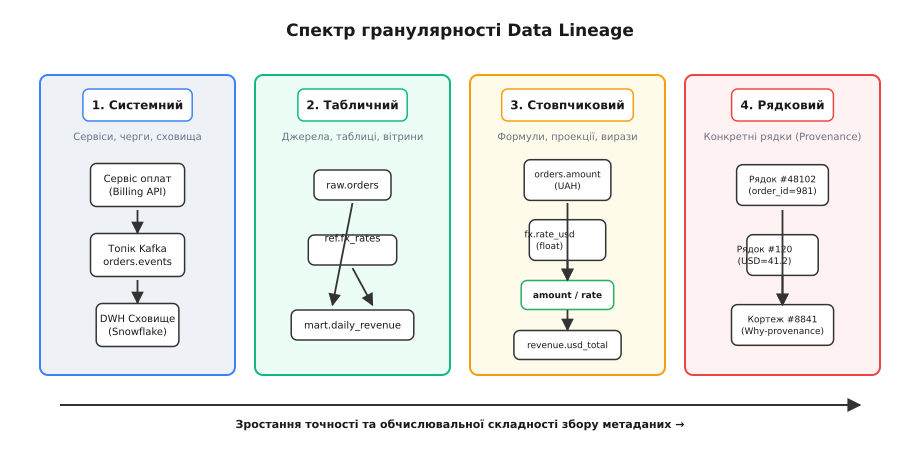
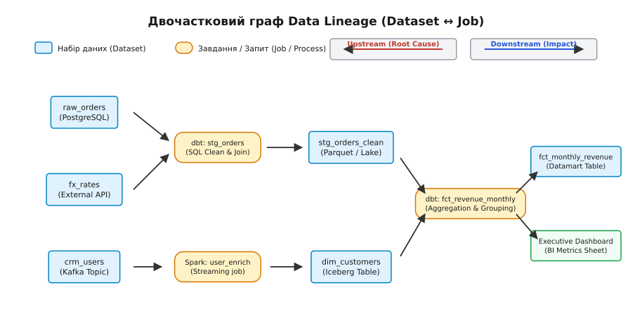
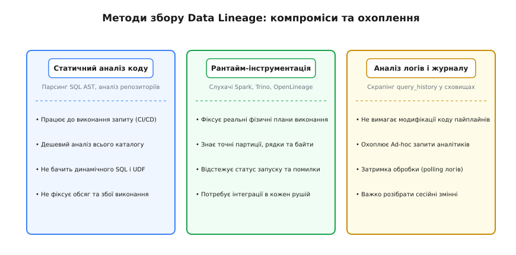
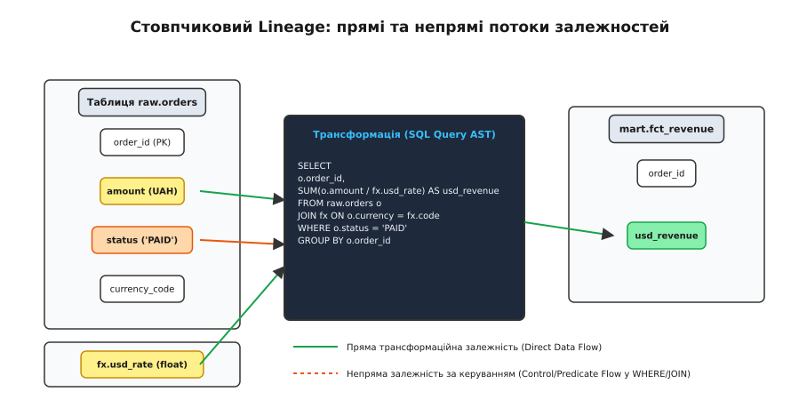

# Data Lineage: простеження походження та руху даних

<preknowlist>
- [ETL/ELT](topic:sf-data/etl-elt) — конвеєри перенесення та перетворення даних між первинними джерелами й сховищем.
- [Топологічне сортування](topic:sf-algorithms/topological-sort) — впорядкування вершин орієнтованого ациклічного графа за напрямком залежностей.
- [Реляційна модель Кодда](topic:sf-data/codd-relational-model) — базові операції реляційної алгебри (вибірка, проекція, з'єднання).
</preknowlist>

У понеділок о 09:00 на фінансовому дашборді ради директорів міжнародного маркетплейсу ключова метрика валової маржі раптово обвалюється з +24.5% до -18.2%. Керівництво компанії негайно зупиняє рекламні кампанії з бюджетом у сотні тисяч доларів, припускаючи критичний збій в алгоритмах ціноутворення або масове шахрайство. Проте перевірка транзакційної бази даних PostgreSQL показує, що всі замовлення оформлюються за коректними цінами, а виписки з платіжних шлюзів сходяться до останнього цента. 

Між первинною таблицею замовлень і підсумковим звітом у системі бізнес-аналітики лежить складний ланцюг із двадцяти семи послідовних обчислювальних конвеєрів: потік подій у Kafka, дев'ять пакетних завдань обробки на Apache Spark, три шари трансформацій dbt у хмарному сховищі Snowflake та щоденне підтягування курсів валют через зовнішній API. Чергова зміна інженерів даних витрачає тридцять шість годин на ручний пошук у тисячах рядків SQL-коду, DAG-конфігурацій Airflow та логів виконання, щоб з'ясувати: сторонній провайдер валютних курсів змінив структуру JSON-відповіді, через що один із проміжних скриптів без повідомлення про помилку підставив нульовий дільник у формулу перерахунку валют.

Ця ситуація демонструє головну вразливість сучасних розподілених систем аналітики: за відсутності автоматизованого механізму фіксації зв'язків між джерелами, перетвореннями та споживачами будь-яка аномалія перетворює діагностику на тривале й дороге розслідування.

---

### Деструктивність реляційних перетворень та амнезія даних

Чому конвеєри обробки даних взагалі втрачають інформацію про своє походження? Причина криється у фундаментальній природі реляційних операцій. 

Коли оператор SQL або обчислювальний рушій виконує проекцію `SELECT customer_id, SUM(amount)`, усунення дублікатів чи з'єднання таблиць `JOIN`, результуючий набір даних зберігає виключно кінцеві числові значення. У вихідній таблиці не залишається жодного сліду того, які саме вхідні рядки, у яких фізичних файлах, якою версією коду і в який момент часу брали участь у формуванні цього результату. 

Реляційна алгебра у класичній семантиці Едгара Кодда є деструктивною щодо контексту виконання: вона повертає математичний результат операції над множинами, але повністю стирає історію його отримання. Що більше шарів трансформацій проходить запис (сирі дані Bronze → очищені дані Silver → вітрини Gold), то глибшою стає ця інформаційна амнезія.

**Data Lineage** (походження або родовід даних; термін походить від старофранцузького *lignage* та латинського *linea* — лінія, нитка родоводу) — це детермінований орієнтований граф метаданих (англ. *metadata*, від грецького *meta* — після, за межами, та латинського *datum* — дане), що фіксує повний життєвий шлях даних: від точки їхнього первинного створення чи отримання ззовні, через усі проміжні перетворення, фільтри, агрегації та збереження, до кінцевого використання в аналітичних звітах, машинних моделях чи зовнішніх API.

> 🔧 **Навіщо це.**
> Data Lineage перетворює сховище даних із непрозорої «чорної скриньки» на детерміновану інженерну систему. Він дозволяє миттєво локалізувати першопричину викривлення метрик (Root Cause Analysis), оцінити зону ураження перед зміною схеми таблиці (Impact Analysis), забезпечити юридичну відповідність регуляторним нормам аудиту (GDPR, BCBS 239) та автоматично очищати застарілі обчислювальні конвеєри, результати яких більше ніхто не читає.

---

### Спектр гранулярності Data Lineage

У практичній інженерії метаданих глибина простеження визначається рівнем деталізації. Вибір гранулярності є компромісом між обчислювальними накладними витратами на збір метаданих та точністю аналізу.


*Чотири рівні гранулярності Data Lineage: від макрозв'язків між сервісами до математичного простеження походження окремого кортежу.*

1. **Системний / конвеєрний рівень (Macro-level Lineage):**
   Фіксує взаємодію між автономними сервісами, чергами повідомлень та сховищами даних. Наприклад: «Сервіс оплат надсилає події у топік Kafka `orders.events`, звідки коннектор Debezium записує їх у базу PostgreSQL». Цей рівень відповідає на запитання архітектурної топології, але не розрізняє внутрішні таблиці чи поля.
2. **Рівень наборів даних та таблиць (Dataset-level / Table-level Lineage):**
   Відображає спрямовані зв'язки між фізичними таблицями, колекціями або файлами. Наприклад: «Таблиця `stg_orders` формується на основі таблиці `raw_orders` та довідника `ref_fx_rates`». Це базовий рівень, який підтримують більшість оркестраторів та каталогів даних.
3. **Стовпчиковий рівень (Column-level / Attribute-level Lineage):**
   Мікрорівень простеження, який будує граф залежностей між окремими атрибутами та полями. Він показує, що стовпець `usd_amount` у таблиці щоденного доходу обчислюється як математичний добуток стовпця `amount` із таблиці замовлень та поля `usd_rate` із довідника валютних курсів. Стовпчиковий лінідж критично необхідний для точного аналізу впливу змін у схемах.
4. **Рядковий рівень (Row-level Provenance):**
   Нанорівень, який зіставляє кожен конкретний рядок (кортеж) у результуючій вітрині з точним набором первинних рядків у вхідних таблицях (Why/How-provenance). Через колосальні накладні витрати на збереження матриць походження цей рівень застосовується переважно у вузьких аудиторських системах, криптографічних реєстрах та наукових обчисленнях.

---

### Графова модель: Двочастковий DAG

Формально Data Lineage моделюється як **орієнтований ациклічний граф** (англ. *Directed Acyclic Graph* — DAG). Проте спроба побудувати граф, де вузлами є лише набори даних (`Table A → Table B`), призводить до втрати контексту: ми бачимо, що таблиця `B` залежить від `A`, але не знаємо, який саме код, з якими параметрами та версією виконав це перетворення.

Тому канонічною моделлю походження даних є **двочастковий граф** (англ. *Bipartite Graph*), що складається з двох взаємовиключних класів вершин:

1. **Вузли стану (Datasets / Data at Rest):** множина вершин `V_D`, що представляє стан даних у спокої (таблиці, файли, топіки Kafka, змінні).
2. **Вузли процесів (Jobs / Runs / Data in Motion):** множина вершин `V_J`, що представляє трансформаційну логіку у русі (SQL-запити, dbt-моделі, Spark-завдання, скрипти).

```
G = (V_D ∪ V_J, E_in ∪ E_out)
```

де ребра `E_in ⊆ V_D × V_J` позначають читання даних процесом (Input Dependency), а ребра `E_out ⊆ V_J × V_D` позначають запис або модифікацію даних процесом (Output Generation). 

У цій моделі прямі ребра між двома наборами даних `V_D × V_D` або двома процесами `V_J × V_J` заборонені: дані не можуть породити інші дані без виконання коду, а код не може передати результат іншому коду без проміжного збереження стану.


*Двочасткова графова модель Data Lineage: трансформаційні вузли пов'язують набори даних, дозволяючи аналізувати першопричини (Upstream) та наслідки змін (Downstream).*

Математичний апарат цієї моделі спирається на теорію напівкілець походження даних, де кожна реляційна операція зіставляється з алгебраїчною операцією додавання чи множення анотацій, що детально розібрано у вставці [Алгебра походження даних: напівкільця Provenance Semirings](topic:sf-data/data-lineage/math-provenance-semirings.md).

---

### Напрямки аналізу графа: Upstream та Downstream

Наявність актуального двочасткового графа дозволяє розв'язувати дві фундаментальні задачі експлуатації систем обробки даних:

```
Upstream Trace (Root Cause)           Цільовий вузол            Downstream Trace (Impact)
  [Сирі джерела] ◄────── [Проміжні шари] ◄────── [Таблиця X] ──────► [Вітрини] ──────► [BI-дашборди / ML]
```

#### 1. Пошук першопричин (Upstream Trace / Backwards Lineage)
Коли користувач або система моніторингу виявляє аномалію чи пошкодження даних у вихідному звіті, алгоритм пошуку в ширину (BFS) або глибину (DFS) обходить граф **проти напрямку ребер** від пошкодженого вузла. Обхід піднімається через усі проміжні таблиці й завдання до первинних джерел введення інформації. Це дозволяє за лічені секунди побудувати дерево предків (англ. *Ancestry Tree*) і з'ясувати:
* Яке саме вхідне джерело надало некоректні дані;
* Який крок трансформації вніс помилку в розрахунок;
* Чи не відбулося збою під час виконання одного з проміжних завдань.

#### 2. Оцінка зони ураження (Downstream Impact Analysis / Forward Lineage)
Коли інженер планує внести зміни в схему бази даних (наприклад, видалити стовпець, змінити тип даних із `FLOAT` на `DECIMAL` або модифікувати логіку фільтрації замовлень), алгоритм обходить граф **за напрямком ребер** від цільового вузла. У результаті формується повний список залежних нащадків:
* Усі наступні таблиці та вітрини, які перестануть оновлюватися або розрахуються некоректно;
* Усі аналітичні звіти та дашборди, які зламаються у кінцевих користувачів;
* Усі сервіси машинного навчання, чиї вхідні ознаки (Features) зазнають дрейфу.

Інтеграція Downstream-аналізу в конвеєри безперервної інтеграції (CI/CD) дозволяє автоматично блокувати злиття Pull Request, якщо зміна в схемі призводить до неконтрольованого ламання залежних систем.

---

### Методи видобування Lineage: порівняння трьох підходів

Збір метаданих про походження даних у реальних інфраструктурах реалізується трьома основними архітектурними підходами, кожен із яких має власні переваги та обмеження.


*Порівняння архітектурних способів захоплення метаданих про походження даних та їхнє практичне покриття.*

#### 1. Статичний аналіз коду (Static SQL / Code AST Parsing)
Парсер аналізує текст SQL-запитів, конфігураційні файли dbt або вихідний код трансформацій до моменту їхнього виконання. Він будує синтаксичне дерево (AST), резольвить табличні вирази (CTE), псевдоніми та будує граф залежностей стовпців.

* **Переваги:** працює без підключення до працюючої бази даних, може виконуватися на етапі компіляції чи перевірки у Git-репозиторії (CI/CD), має нульові накладні витрати на виконання запитів.
* **Обмеження:** не бачить динамічно згенерованого SQL (`EXECUTE IMMEDIATE`), не може проаналізувати логіку всередині користувацьких скомпільованих функцій (UDF) на Python чи C++, не фіксує фактичні обсяги записаних даних та збої виконання.

Детальний алгоритм побудови синтаксичного дерева, резолюції CTE та практичний код парсера наведено у вставці [Побудова графа стовпчикового lineage через розбір SQL AST](topic:sf-data/data-lineage/proj-column-lineage-extractor.md).

#### 2. Рантайм-інструментація (Runtime Query Execution Instrumentation)
Спеціальні перехоплювачі (англ. *Listeners / Plugins*), інтегровані безпосередньо в ядра обчислювальних рушіїв (Apache Spark `QueryExecutionListener`, Trino `EventListener`, Apache Flink `JobListener`), зчитують оптимізований фізичний план виконання безпосередньо перед його виконанням і фіксують реальні вхідні та вихідні ресурси.

* **Переваги:** фіксує абсолютну правду про виконання: точні фізичні шляхи до файлів на S3, партиції, реальну кількість прочитаних і записаних рядків, витрачений час процесора та статус завершення (успіх/помилка).
* **Обмеження:** вимагає встановлення та підтримки плагінів у кожному окремому рушії кластера; якщо аналітик запускає запит через сторонній клієнт без встановленого плагіна, операція не потрапляє в граф.

#### 3. Аналіз журналів аудиту (Query Log Mining)
Асинхронний сервіс періодично вичитує системні журнали виконаних запитів зі сховища даних (наприклад, `snowflake.account_usage.query_history` у Snowflake, `INFORMATION_SCHEMA.JOBS_BY_PROJECT` у BigQuery або журнал `pg_stat_statements` у PostgreSQL) і парсить їхні плани виконання.

* **Переваги:** повністю неінвазивний метод, який не потребує модифікації коду конвеєрів та плагінів; автоматично покриває 100% запитів, включно з ad-hoc аналітикою вручну.
* **Обмеження:** часова затримка отримання метаданих (від кількох хвилин до годин через буферизацію системних логів), складність аналізу тимчасових таблиць сесії та високе навантаження на парсер при обробці мільйонів рядків журналів.

---

### Анатомія стовпчикового Lineage: прямі та непрямі залежності

Під час побудови стовпчикового лініджу критично розрізняти два типи інформаційних потоків між полями:


*Анатомія стовпчикового лініджу: прямі трансформаційні зв'язки проти непрямих предикатних фільтрів.*

#### 1. Прямий потік даних (Direct Data Flow / Transformation Dependency)
Вхідне поле безпосередньо передає своє значення або бере участь у математичному чи строковому виразі, що формує вихідне значення стовпця. Наприклад:

```sql
SELECT 
    order_id,
    amount * 1.20 AS amount_with_tax
FROM orders;
```

Тут `amount` є прямим предком `amount_with_tax` (тип зв'язку: пряма трансформація).

#### 2. Непрямий потік керування (Indirect / Control / Predicate Dependency)
Вхідне поле не передає своє значення у вихідну комірку, але його значення визначає, **чи потрапить рядок у фінальний результат узагалі** або **яку саме гілку логіки буде обрано**. Непрямі залежності виникають у секціях:
* `WHERE` (фільтрація): `WHERE status = 'PAID'`;
* `JOIN ... ON` (умова зв'язування): `ON orders.user_id = users.id`;
* `GROUP BY` (групування): `GROUP BY country_code`;
* `CASE WHEN` (умовні предикати): `CASE WHEN is_premium THEN discount ELSE 0 END`.

Якщо ми змінимо значення стовпця `status` у первинній таблиці з `'PAID'` на `'CANCELLED'`, сам стовпець `amount_with_tax` не змінить формулу свого розрахунку, але відповідний рядок повністю зникне з підсумкового фінансового звіту. Сучасні стандарти безпеки та аудиту вимагають фіксувати обидва типи зв'язків: прямі — для математичної перевірки формул, непрямі — для аудиту доступу та оцінки витоків конфіденційної інформації.

---

### Data Lineage проти Розподіленого трасування (Distributed Tracing)

Часто виникає плутанина між простеженням походження даних та розподіленим трасуванням мікросервісів (OpenTelemetry, Jaeger, Zipkin). Хоча обидві дисципліни оперують графами викликів (DAG), вони розв'язують фундаментально різні інженерні задачі й працюють у несумісних часових масштабах:

| Критерій порівняння | Розподілене трасування (Distributed Tracing) | Простеження походження даних (Data Lineage) |
| :--- | :--- | :--- |
| **Предмет спостереження** | Потік керування (Control Flow): HTTP/gRPC виклики, виклики функцій та тривалість виконання методів. | Потік мутації стану (Data Flow): походження, рух, збереження та перетворення інформації. |
| **Часовий масштаб (TTL)** | Мілісекунди та секунди (час життя окремого HTTP-запиту). Дані трасування зазвичай зберігаються 7–14 днів. | Години, місяці, роки (дані накопичуються у сховищі десятиліттями, переживаючи версії коду). |
| **Одиниця фіксації** | Спан (Span): часовий інтервал виконання процедури у конкретному потоці процесу. | Вузол графа (Dataset / Run / Column): стан даних у сховищі та зв'язок походження. |
| **Межа взаємодії** | Синхронні виклики та черги повідомлень у пам'яті / на сокетах. | Пакетні транзакції, файли у сховищах (Parquet, Iceberg, Delta Lake), змішані потоки. |
| **Кінцева мета** | Оптимізація затримок (Latency Profiling) та пошук відмов у реальному часі. | Верифікація коректності бізнес-метрик, аудит, регуляторна відповідність та якість даних. |

Розподілене трасування відповідає на запитання: *«Чому запит API виконувався 450 мілісекунд?»*. Data Lineage відповідає на запитання: *«Звідки взялося число 450 у фінансовому звіті за минулий рік?»*.

---

### Проблема напівструктурованих даних та динамічних схем

Сучасні озера даних масово зберігають напівструктуровані документи: формати JSON, Avro, Protobuf, типи `JSONB` у PostgreSQL та `VARIANT` у Snowflake. У таких системах стовпчики не фіксуються заздалегідь у DDL, а видобуваються динамічно на етапі запиту (англ. *schema-on-read*):

```sql
SELECT
    raw_payload:customer.id::INT AS customer_id,
    raw_payload:events[0].amount::NUMERIC AS initial_deposit
FROM raw_stream_events;
```

Для підтримки напівструктурованих даних класичний стовпчиковий лінідж розширюється концепцією **шляхів до полів (JSON Path Lineage)**. Граф фіксує залежність не просто від загального стовпця `raw_payload`, а від конкретного внутрішнього шляху `raw_payload -> customer -> id`. Якщо вихідний мікросервіс перейменує внутрішній атрибут з `customer.id` на `customer.account_id`, система автоматично ідентифікує всі зламані видобування задовго до того, як звіт поверне порожні значення `NULL`.

---

### Автоматизація ідемпотентного перерахунку історії (Lineage-Driven Backfills)

Коли в первинних даних виявляється помилка за минулі періоди (наприклад, невраховані повернення товарів за січень), інженери стикаються із задачею каскадного перерахунку історії (англ. *Backfill*). 

Без наявності графа походження інженери змушені вручну згадувати й перезапускати всі DAG в Airflow. Це часто призводить до того, що частину проміжних вітрин пропускають, а інші перераховують у неправильному порядку, порушуючи узгодженість даних.

Data Lineage автоматизує цей процес за допомогою алгоритму **топологічного відновлення**:
1. Граф визначає точну підмножину всіх залежних нащадків пошкодженої таблиці за січень.
2. Алгоритм [топологічного сортування](topic:sf-algorithms/topological-sort) вибудовує строго лінеаризовану послідовність перезапуску завдань `Job_1 → Job_2 → ... → Job_k`.
3. Оркестратор ідемпотентно виконує перерахунок лише тих партицій, на які реально вплинула зміна, заощаджуючи тисячі доларів обчислювальних ресурсів хмарного кластера.

---

### Індустріальна стандартизація: OpenLineage

Історично системи керування метаданими розвивалися від пропрієтарних закритих ETL-пакетів 2000-х років (Informatica, IBM InfoSphere) до внутрішніх рішень технологічних гігантів (Netflix Metacat, Lyft Amundsen, Uber Databook), детальний огляд еволюції яких наведено у вставці [Від реляційного Provenance до OpenLineage: історія простеження даних](topic:sf-data/data-lineage/hist-provenance-to-openlineage.md).

Сьогодні загальноприйнятим стандартом обміну даними про походження став відкритий протокол **OpenLineage** (під егідою Linux Foundation AI & Data). 

OpenLineage визначає стандартизовану JSON-схему для подій життєвого циклу запусків завдань (`RunEvent`) зі станами `START`, `RUNNING`, `COMPLETE`, `FAIL` та `ABORT`. Головною перевагою протоколу є механізм **фасетів (Facets)** — типізованих блоків метаданих, що розширюють базові сутності без порушення зворотної сумісності:

* **Стовпчиковий лінідж:** фасет `ColumnLineageDatasetFacet` описує повну карту зв'язків `input_field → output_field` із типами трансформацій.
* **Схема даних:** фасет `SchemaDatasetFacet` фіксує імена та типи полів на момент виконання завдання.
* **Метрики якості:** фасет `DataQualityMetricsInputDatasetFacet` передає статистичні показники (відсоток порожніх значень, кількість рядків).

Повна специфікація протоколу, формати повідомлень та правила взаємодії через HTTP REST і топіки Kafka описані у вставці [Специфікація OpenLineage: модель подій, запусків та фасетів](topic:sf-data/data-lineage/api-openlineage-spec.md).

---

### Часовий вимір та еволюція схем (Temporal Lineage)

Граф Data Lineage не є статичною картиною. В реальних виробничих системах обробки даних постійно відбуваються зміни: додаються нові стовпці у таблиці, змінюються формули в dbt-моделях, періодично падають і перезапускаються Spark-завдання.

Тому промисловий Lineage є **тривимірним графом у просторі-часі**:

```
DAG(t) — стан графа походження в момент часу t
```

Кожен вузол та ребро мають власний інтервал валідності `[t_start, t_end)`. Це дозволяє аналітику виконувати запити «мандрівки в часі» (Time Travel Lineage):
* «Який вигляд мав ланцюг обчислення валової маржі 12 травня 2025 року до релізу оновлення білінгового сервісу?»
* «Яка саме версія SQL-моделі dbt виконувалася під час формування річного аудиторського звіту минулого кварталу?»

Збереження хронологічної версійності гарантує відтворюваність результатів та дозволяє розслідувати ретроспективні інциденти навіть після того, як вихідний код конвеєрів було неодноразово змінено.

---

### Регуляторні вимоги, безпека та штучний інтелект

Data Lineage перестав бути суто внутрішнім інструментом інженерів даних і перетворився на обов'язковий законодавчий та безпековий стандарт.

#### 1. GDPR: Право на забуття (Right to be Forgotten)
Стаття 17 Загального регламенту захисту даних ЄС (GDPR) зобов'язує компанії на вимогу користувача видалити всі його персональні дані (PII). Якщо профіль користувача зберігався в основній базі, але за роки роботи був скопійований у 40 різних аналітичних таблиць, вітрин, резервних копій та кешів, ручне видалення є неможливим. За допомогою графа Downstream Lineage автоматизована система знаходить повне дерево поширення персональних даних конкретного `user_id` і запускає каскадне видалення у всіх похідних сховищах.

#### 2. Фінансовий стандарт BCBS 239
Базельський комітет із банківського нагляду в стандарті BCBS 239 («Принципи ефективної агрегації даних про ризики та звітності») вимагає від системно важливих банків повної простежуваності кожного показника фінансового ризику. Банк зобов'язаний довести аудитору походження будь-якого числа у звіті до первинної транзакції без ручних маніпуляцій.

#### 3. AI Governance та регулювання штучного інтелекту (EU AI Act)
Під час навчання сучасних моделей машинного навчання та великих мовних моделей (LLM) виникає потреба підтвердити чистоту навчальної вибірки (англ. *Training Data Provenance*). Data Lineage фіксує, які саме версії наборів даних використовувалися для навчання конкретної ревізії моделі, гарантуючи відсутність у вибірці токсичного контенту, захищених авторським правом матеріалів або персональних даних без згоди власників.

---

### Ціна впровадження, компроміси та накладні витрати

Побудова та підтримка загальнокорпоративної системи Data Lineage вимагає зваженого інженерного підходу через наявність суттєвих накладних витрат:

1. **Вибух обсягу метаданих (Metadata Storage Explosion):**
   Граф стовпчикового лініджу на великих масштабах зростає експоненційно. Якщо сховище містить 50 000 таблиць, у кожній із яких у середньому 100 стовпців, а щодня виконується 2 000 000 запитів, щоденний обсяг нових ребер походження досягає десятків мільйонів. Для збереження такого графа потрібні спеціалізовані графові (Neo4j, AWS Neptune) або реляційні розподілені бази даних з агресивними політиками очищення застарілих екземплярів запусків.
2. **Накладні витрати на виконання конвеєрів (Execution Latency Overhead):**
   Рантайм-інструментація в Spark або Trino додає від 1% до 5% додаткового часу до тривалості виконання кожного завдання через необхідність серіалізації планів виконання та їхнього відправлення по мережі до бекенда метаданих. При падінні колектора метаданих клієнтські бібліотеки повинні працювати в асинхронному неблокуючому режимі (Fail-Open), щоб збій у системі моніторингу не зупиняв основні бізнес-обчислення.
3. **Хибні спрацьовування та неоднозначність парсингу:**
   Статичний аналіз складних SQL-скриптів із динамічними умовами може породжувати надлишкові ребра залежностей (False Positives), показуючи зв'язки, які ніколи не спрацьовують у реальному рантаймі. Це вимагає регулярної валідації графа через зіставлення статичних прогнозів із реальними логами виконання.

---

### Підсумок: перехід до культури Data Reliability Engineering

Data Lineage трансформує підхід до роботи з даними від хаотичного реактивного гасіння пожеж («чому зламався дашборд?») до системної інженерії надійності даних (англ. *Data Reliability Engineering*). 

Подібно до того, як розподілене трасування стало обов'язковим фундаментом спостережуваності мікросервісних архітектур, простеження походження даних є базовим фундаментом будь-якої сучасної платформи аналітики. Поєднання графового моделювання, стовпчикового аналізу та відкритих протоколів телеметрії повертає системі прозорість, гарантуючи, що за кожною цифрою на моніторі стоїть повністю перевірений і відновлюваний ланцюг обчислень.
