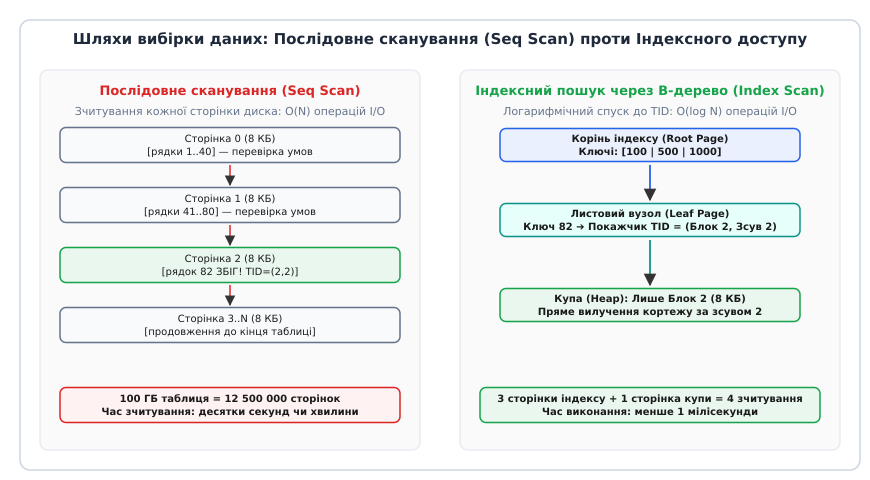
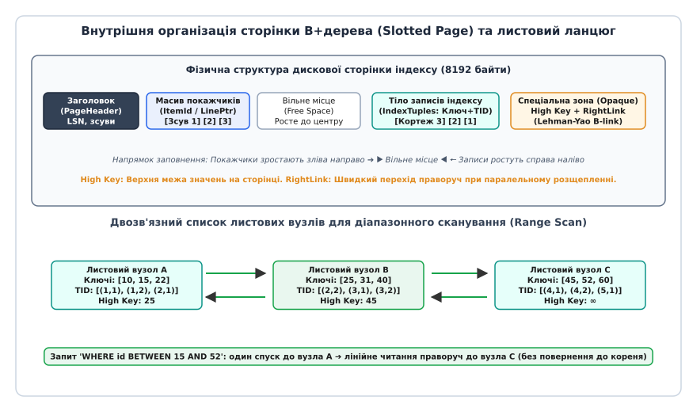
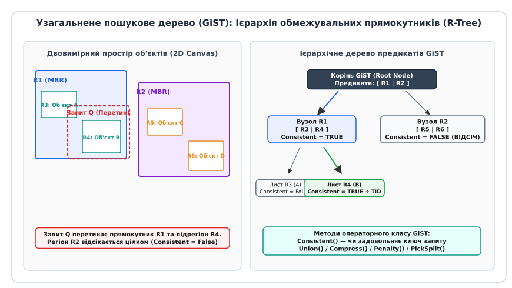
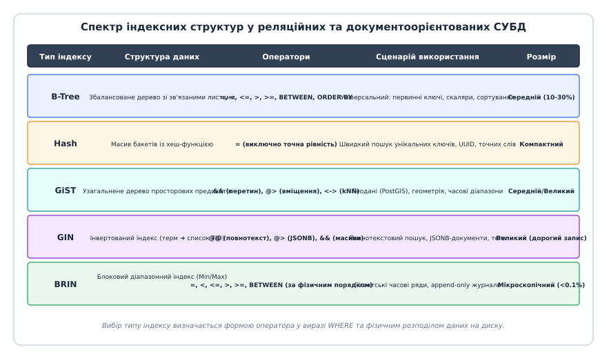

# Індекси баз даних: від B-дерев до Hash та GiST

<preknowlist>
- [Реляційна модель і нормалізація як рішення](root:sf-data/relational-model) — таблиці, кортежі, стовпці та предикати фільтрації WHERE.
- [Асимптотична складність](root:computability/asymptotic-complexity) — часова складність алгоритмів O(1), O(log n), O(n).
</preknowlist>

Таблиця замовлень інтернет-магазину на 50 000 000 рядків займає на твердотільному накопичувачі 120 ГБ, розподілених між 15 000 000 дискових сторінок розміром по 8 КБ кожна. Запит `SELECT * FROM orders WHERE customer_id = 918231` без додаткових допоміжних структур змушує дисковий рушій ініціювати повне послідовне сканування (Sequential Scan / Seq Scan): зчитати всі 15 мільйонів сторінок з диска в оперативну пам'ять, щоб перевірити предикат для кожного окремого кортежу. При лінійній швидкості зчитування накопичувача NVMe 1.5 ГБ/с операція триває 80 секунд, витісняючи з буферного пулу СУБД усі гарячі дані інших користувачів. Якщо на сервер одночасно надходить сотня таких запитів за секунду, дискова підсистема моментально зазнає повного колапсу черги I/O.

Щоб знайти один шуканий рядок за частки мілісекунди без перебору всієї таблиці, база даних використовує **індекс** (від латинського *index* — вказівник, покажчик, список) — вторинну структуру даних, яка підтримує впорядковане відображення значень одного або кількох стовпців на фізичні адреси записів у файлі таблиці.


*Послідовне сканування зчитує всі сторінки таблиці поспіль, тоді як індексний пошук обчислює прямі покажчики на кортежі й зчитує лише потрібні сторінки.*

## Фізична організація таблиці: чому купі потрібен дороговказ

Реляційна таблиця на дисковому рівні зазвичай зберігається у вигляді неструктурованого масиву блоків, який в архітектурі СУБД називають **купою** (heap file). Купа складається зі сторінок фіксованого розміру (типово 8192 байти в PostgreSQL або 16384 байти в MySQL InnoDB).

Кожна сторінка купи організована за схемою щілинної сторінки (slotted page):
1. **Заголовок сторінки:** фіксує координати вільного простору, прапорці транзакційного стану та номер у журналі випереджального запису (LSN).
2. **Масив лінійних покажчиків (Line Pointers / ItemId):** розташований на початку сторінки й росте зліва направо. Кожен покажчик містить бітовий зсув кортежу від початку сторінки та його довжину.
3. **Тіло кортежів (Tuples):** фактичні рядки даних, які записуються від кінця сторінки назустріч масиву покажчиків.

Фізична адреса будь-якого рядка в базі даних однозначно визначається парою чисел — **ідентифікатором кортежу** (Tuple Identifier, TID, або RowID / CTID):
```
TID = (Номер_дискового_блоку, Порядковий_номер_покажчика_на_сторінці)
```
Наприклад, значення `(Block 42, Offset 3)` означає: «завантажити дисковий блок номер 42 і звернутися до 3-го елемента масиву лінійних покажчиків цього блоку».

Оскільки рядки потрапляють у купу в довільному порядку (залежно від моменту виконання транзакції `INSERT` або наявності вільного місця після `DELETE`), значення колонок усередині купи абсолютно не впорядковані. Єдиний спосіб знайти потрібне значення безпосередньо в купі — виконати повний перебір складності `O(N)` дискових блоків. Індекс вирішує цю проблему, створюючи окремий впорядкований файл, елементи якого вказують на конкретні значення TID у купі.

## Чому бінарні дерева не підходять для дискових накопичувачів

В оперативній пам'яті класичним інструментом для швидкого пошуку є двійкові дерева пошуку — AVL-дерева або червоно-чорні дерева (Red-Black Trees). Вони забезпечують логарифмічний час пошуку `O(log_2 N)` завдяки підтримці балансу висоти.

Проте перенесення двійкового дерева на дисковий накопичувач стикається з фізичним обмеженням пристроїв введення-виведення:
1. **Розмір дискового сектора:** дисковий контролер та операційна система оперують блоками даних фіксованого розміру (4 КБ, 8 КБ, 16 КБ). Неможливо зчитати з накопичувача окремий байт чи структуру розміром 32 байти — завжди зчитується повна сторінка.
2. **Низький коефіцієнт розгалуження (Fan-out):** у двійковому дереві кожен вузол має лише два дочірні покажчики (`Fan-out = 2`).
3. **Надмірна глибина дерева:** для таблиці на `N = 100 000 000` рядків висота двійкового збалансованого дерева становить:
```
h = ⌈log_2(100 000 000)⌉ ≈ 27 рівнів
```

Якщо кожен вузол двійкового дерева розташований в окремому дисковому блоці, пошук одного значення вимагає 27 послідовних операцій введення-виведення. На механічному диску HDD із середнім часом позиціювання головки 8 мс виконання одного запиту триватиме `27 · 8 = 216` мілісекунд. Навіть на швидкодійному NVMe SSD із затримкою доступу 50 мікросекунд 27 послідовних звернень заберуть 1.35 мілісекунди процесорного очікування, що неприпустимо для високонавантажених серверів.

Вихід полягає у збільшенні коефіцієнта розгалуження так, щоб кожен вузол дерева за розміром ідеально відповідав одній дисковій сторінці і містив сотні або тисячі ключів-розділювачів.

Детальний математичний аналіз геометричних параметрів сторінки, розрахунок місткості вузлів та точної висоти індексу наведено у вставці [математичне виведення висоти та коефіцієнта розгалуження](root:sf-data/database-indexes/math-btree-fanout.md).

## Архітектура B+дерева: золотий стандарт зберігання

Щоб подолати обмеження двійкових дерев, у 1970-х роках було створено збалансовані багатошляхові дерева. Докладніше про передумови цього відкриття та історичний контекст проєктування в лабораторіях корпорації Boeing розповідає вставка про [історію винаходу B-дерева Рудольфом Байєром](root:sf-data/database-indexes/hist-btree-birth.md).

Сучасні системи керування базами даних використовують модифікацію — **B+дерево** (B+Tree). На відміну від класичного B-дерева, де дані кортежів або покажчики TID могли зберігатися на будь-якому рівні, у B+дереві введено жорсткий функціональний поділ вузлів:

1. **Внутрішні вузли (Internal Nodes):** зберігають виключно ключі-маршрутизатори та адреси сторінок наступного рівня. Вони не містять покажчиків на саму купу таблиці. Завдяки компактності записів внутрішній вузол розміром 8 КБ вміщує від 200 до 500 ключів-розділювачів (`Fan-out = 200..500`).
2. **Листові вузли (Leaf Nodes):** розташовані на найнижчому рівні дерева і містять повний набір індексованих ключів разом із відповідними покажчиками TID на купу.
3. **Листовий ланцюг (Leaf Chaining):** усі листові вузли з'єднані між собою горизонтальними покажчиками у двозв'язний список.


*Структура дискової сторінки містить заголовок, масив зсувів, вільний простір і записи з High Key, а листові вузли з'єднані у двозв'язний список.*

Завдяки високому коефіцієнту розгалуження висота B+дерева для 100 000 000 рядків складає лише 3–4 рівні. Оскільки коренева сторінка та внутрішні вузли перших двох рівнів постійно утримуються в оперативній пам'яті (у буферному пулі), точковий пошук за ключем вимагає лише **одного фізичного читання з диска** для листової сторінки індексу та **одного читання** для сторінки купи.

### Кластеризований індекс проти купового зберігання
За способом зв'язку індексу з реальними даними реляційні СУБД поділяються на дві фундаментальні школи:
- **Купова архітектура (PostgreSQL, SQLite):** таблиця є неупорядкованою купою блоків, а всі створені індекси (включно з первинним ключем) є вторинними й зберігають покажчик TID на конкретну сторінку купи.
- **Кластеризований індекс (MySQL InnoDB, MS SQL Server, Oracle IOT):** таблиця **і є самим індексом**. Первинний ключ організований як B+дерево, у листових вузлах якого замість покажчиків TID зберігаються **повні дані рядка**. Вторинні індекси в InnoDB замість фізичних адрес TID зберігають значення первинного ключа. Пошук за вторинним індексом у такій схемі вимагає подвійного спуску (двох пошуків у деревах): спершу за вторинним індексом до значення первинного ключа, а потім за первинним B+деревом до фактичного рядка даних.

### Діапазонне сканування (Range Scan)
Головна перевага B+дерева над іншими структурами полягає в ефективності обробки діапазонних запитів, таких як `WHERE age BETWEEN 25 AND 40` або `ORDER BY created_at LIMIT 50`.

Виконання діапазонного запиту відбувається у два етапи:
1. Алгоритм спускається від кореня до листового рівня за час `O(log_B N)`, щоб знайти першу листову сторінку, яка містить мінімальне значення діапазону (`age = 25`).
2. Далі виконавець запиту більше **не повертається до кореня** і не витрачає ресурси на повторні спуски. Він просто ітерується праворуч за горизонтальними покажчиками листового ланцюга (`leaf->next`), послідовно вичитуючи TID підряд, доки не зустріне ключ, що перевищує верхню межу діапазону (`age > 40`).

Повний вихідний код реалізації вузлів, алгоритмів спуску, вставки та діапазонного проходження мовами C та C++ містить вставка [робочу реалізацію B+дерева з розщепленням сторінок](root:sf-data/database-indexes/proj-bplus-tree.md).

## Конкурентність і паралелізм: B-link дерева Лемана-Яо

У багатокористувацькій СУБД сотні паралельних потоків одночасно читають і модифікують індекс. Головна проблема класичного B-дерева виникає під час **розщеплення сторінки** (page split), коли переповнений листовий вузол ділиться навпіл, а медіанний ключ просувається у батьківський вузол.

Якщо батьківський вузол також переповнений, розщеплення каскадно піднімається вгору аж до кореня. У наївній реалізації для безпечного розщеплення довелося б заблокувати ексклюзивним замком (Exclusive Lock) увесь шлях від кореня до листа, що повністю заблокувало б усі паралельні операції читання у всій таблиці.

Щоб забезпечити максимальний паралелізм без блокування читачів, сучасні СУБД (зокрема рушій `nbtree` у PostgreSQL) використовують архітектуру **B-link tree**, розроблену Філіпом Леманом і С. Бін Яо:

1. **High Key (Верхній ключ):** кожен вузол зберігає у службовій зоні максимальне значення ключа, яке фізично може перебувати на цій сторінці.
2. **RightLink (Покажчик праворуч):** кожен вузол (як листовий, так і внутрішній) має прямий покажчик на сусідню праву сторінку того самого рівня.

Коли потік запису розщеплює сторінку `A`, він створює нову сторінку `B`, переносить туди праву половину ключів і зв'язує їх покажчиком `A->rightlink = B`, фіксуючи новий `High Key` на сторінці `A`. Ця операція вимагає блокування **лише самої сторінки `A`**. Вставка розділювача в батьківський вузол відкладається і виконується окремим кроком.

Якщо паралельний читач спустився на сторінку `A` за старим покажчиком батька саме в момент розщеплення, він зчитує `High Key` сторінки `A`. Побачивши, що шуканий ключ `key > High_Key`, читач розуміє, що сторінка щойно розщепилася, і без жодних блокувань просто переходить за покажчиком `RightLink` на сторінку `B`. Алгоритм Лемана-Яо дозволяє потокам читання виконувати пошук без захоплення блокувань на батьківських рівнях дерева.

## Хеш-індекси: постійний час доступу та втрата порядку

**Хеш-індекс** (від англійського *hash* — кришити, рубати, змішувати) оптимізований для однієї конкретної операції: пошуку за точною рівністю (`WHERE id = 'a80b4c...'`).

### Внутрішня будова хеш-індексу
1. **Хеш-функція (Hash Function):** перетворює вхідний ключ довільного типу і довжини у 32- або 64-бітне беззнакове ціле число з рівномірним псевдовипадковим розподілом бітів.
2. **Масив бакетів (Bucket Array):** індекс складається з фіксованого або динамічно зростаючого набору відер (бакетів), кожне з яких займає одну або кілька дискових сторінок. Номер бакета визначається операцією бітової маски або залишку від ділення:
```
Номер_бакета = Hash(Ключ) & Bucket_Mask
```
3. **Сторінки переповнення (Overflow Pages):** якщо внаслідок колізій хеш-функції або великої кількості однакових значень у бакеті закінчується вільне місце, виділяється додаткова сторінка, яка приєднується до основного бакета у вигляді однозв'язного списку.

### Переваги та обмеження хеш-індексів
Теоретична складність точкового пошуку в хеш-індексі становить `O(1)`: обчислюється хеш, обчислюється номер бакета, і сторінка зчитується з диска за одне звернення.

Проте за цю швидкість доводиться платити повною втратою впорядкованості:
- **Неможливість діапазонного пошуку:** оператори `<`, `>`, `<=`, `>=`, `BETWEEN` принципово не підтримуються. Хеш-функція псевдовипадково розкидає сусідні числа (наприклад, 100 і 101) у зовсім різні бакети.
- **Неможливість сортування:** хеш-індекс не може бути використаний оптимізатором для задоволення конструкцій `ORDER BY` або операцій злиття `Merge Join`.
- **Проблема колізій та ланцюжків переповнення:** якщо хеш-функція розподіляє ключі нерівномірно, окремі бакети обростають довгими ланцюжками сторінок переповнення, що деградує час пошуку з `O(1)` до лінійного `O(K)`.

Хеш-індекси доцільно використовувати тільки для випадкових, унікальних і довгих рядкових ключів (наприклад, хешів SHA-256 або UUID), де розмір ключа у B-дереві був би занадто великим, а діапазонні вибірки ніколи не виконуються.

## GiST: Узагальнене пошукове дерево для складних даних

Коли об'єктом індексації стають геометричні фігури, географічні координати (GIS), IP-діапазони або часові інтервали, традиційні скалярні індекси виявляються безсилими. Для площини чи тривимірного простору не існує природного лінійного порядку «менше / більше», який зберіг би просторову локальність точок.

У 1995 році Джозеф Геллерштейн (Joseph M. Hellerstein), Джеффрі Креттек (Jeffrey F. Naughton) та Аві Пфеффер (Avi Pfeffer) розробили концепцію **GiST (Generalized Search Tree)** — узагальненого пошукового дерева.

GiST — це розширюваний шаблон багатошляхового дерева (подібного до R-дерева Антоніна Гуттмана), в якому ключами внутрішніх вузлів виступають довільні **обмежувальні предикати** (Bounding Predicates), а не скалярні розділювачі.


*Ієрархія обмежувальних прямокутників дозволяє відсікати нерелевантні просторові гілки без повного перебору координат.*

### Принцип роботи на прикладі геопросторових даних (R-Tree on GiST)
1. Кожен геометричний об'єкт у листовому вузлі описується своїм **мінімальним обмежувальним прямокутником** (Minimum Bounding Box / MBR) — парою координат `(x_min, y_min, x_max, y_max)`.
2. Внутрішній вузол зберігає прямокутники, які повністю охоплюють усі прямокутники його дочірніх вузлів.
3. Коли надходить запит на перетин `WHERE coordinates && Box_Query`, алгоритм починає спуск від кореня:
   - Для кожного дочірнього прямокутника викликається метод `Consistent()`.
   - Якщо прямокутник запиту перетинається з прямокутником піддерева, пошук спускається в цю гілку.
   - Якщо перетину немає, **усе піддерево відсікається**, економлячи тисячі дискових читань.

На відміну від B-дерева, де пошуковий шлях завжди є єдиним (оскільки діапазони ключів суворо розмежовані), у GiST прямокутники сусідніх вузлів можуть частково перекриватися. Тому пошук у GiST за потреби може одночасно перевіряти кілька альтернативних гілок дерева.

Детальний опис C-інтерфейсу, контрактів методів `consistent`, `union`, `compress`, `penalty`, `picksplit` та реєстрації операторних класів наведено у вставці [інтерфейс і сигнатури методів GiST](root:sf-data/database-indexes/api-gist-methods.md).

## Спеціалізовані індекси: GIN та BRIN

Окрім класичних деревних та хеш-структур, сучасні реляційні бази даних пропонують вузькоспеціалізовані індексні методи для нестандартних типів навантажень.

### GIN (Generalized Inverted Index) — Інвертований індекс
Призначений для індексації складених документів, що містять множини елементів: повнотекстових документів (`tsvector`), масивів (`integer[]`, `text[]`) та напівструктурованих документів JSONB.

У класичному B-дереві один рядок таблиці створює рівно один запис в індексі. У GIN рядок розбивається на атомарні складові (терми, елементи масиву, пари ключ-значення JSONB):
1. **Словник елементів (Entry Tree):** впорядковане B-дерево всіх унікальних лексем або ключів, що зустрічаються в таблиці.
2. **Списки розміщення (Posting Lists / Posting Trees):** для кожного унікального терма зберігається впорядкований список TID усіх рядків таблиці, де цей терм присутній.

Під час виконання запиту `WHERE tags @> ARRAY['database', 'performance']` рушій GIN знаходить за словником списки TID для слова `database` та слова `performance`, після чого виконує їхнє швидке перетин за алгоритмом бітового злиття (Bitwise AND).

*Ціна використання GIN:* Операції оновлення (`INSERT`, `UPDATE`) у GIN є надзвичайно важкими, оскільки додавання одного рядка з масивом із 50 елементів вимагає оновлення 50 різних гілок індексу. Для амортизації запису GIN використовує спеціальний буфер відкладеної вставки (`fastupdate`).

### BRIN (Block Range Index) — Блоковий діапазонний індекс
Розроблений для гігантських аналітичних таблиць (сотні гігабайтів або терабайти даних часових рядів, журналів подій, фінансових транзакцій), де записи додаються переважно в кінець (`append-only`) і фізично впорядковані за датою або монотонним ID.

BRIN не індексує кожен окремий кортеж. Він розбиває купу таблиці на великі діапазони блоків (за замовчуванням один діапазон = 128 дискових сторінок, тобто 1 МБ даних) і зберігає всього два значення на весь діапазон:
```
Діапазон блоків [0..127]:   Min = '2026-01-01 00:00', Max = '2026-01-03 23:59'
Діапазон блоків [128..255]: Min = '2026-01-04 00:00', Max = '2026-01-07 12:30'
```

Під час виконання запиту `WHERE created_at >= '2026-01-05'` BRIN перевіряє метадані: перший діапазон [0..127] відкидається цілком (його максимум менший за дату запиту), а сканування починається одразу з блоку 128.

*Головна перевага BRIN:* Феноменальна компактність. Для таблиці обсягом 500 ГБ стандартне B-дерево займає близько 50 ГБ, тоді як індекс BRIN займає всього **кілька сотень кілобайтів** і повністю живе в L1/L2 кеші процесора.


*Характеристики основних типів індексів визначають вибір структури під тип запиту та фізичний розподіл даних.*

## Складені індекси, префіксне правило та покриття

Індекс може бути побудований над кількома стовпцями одночасно:
```sql
CREATE INDEX idx_users_country_city_age ON users (country, city, age);
```

### Лексикографічний порядок та правило найлівішого префікса (Leftmost Prefix Rule)
У складеному індексі записи впорядковуються за першою колонкою; якщо перші колонки збігаються — за другою; якщо другі збігаються — за третьою:
```
('UA', 'Kyiv', 25)
('UA', 'Kyiv', 30)
('UA', 'Lviv', 22)
('US', 'Boston', 28)
```

З цього випливає фундаментальне обмеження складеного індексу:
- Запит `WHERE country = 'UA' AND city = 'Kyiv'` **ідеально використовує індекс** (бінарний пошук за префіксом `country` + `city`).
- Запит `WHERE country = 'UA'` **використовує індекс** (пошук за першим префіксом).
- Запит `WHERE city = 'Kyiv'` або `WHERE age = 30` **НЕ може використовувати дерево для прямого спуску**, оскільки міста не утворюють єдиного неперервного діапазону (Київ зустрічається всередині кожного блоку окремої країни).

*Правило вибору порядку стовпців:* Стовпці з найвищою **селективністю** (від латинського *selectio* — вибір; частка рядків, що відсікаються фільтром) та поля точної рівності (`=`) завжди виносяться в ліву частину визначення індексу, а діапазонні поля (`<`, `>`, `BETWEEN`) — у крайню праву.

### Часткові та функціональні індекси
СУБД дозволяють істотно зменшити розмір індексу та накладні витрати на запис за допомогою спеціальних предикатів:
- **Частковий індекс (Partial Index):** містить вираз `WHERE` і зберігає покажчики лише для рядків, що задовольняють фільтр:
```sql
-- Індексуються лише активні замовлення (5% таблиці)
CREATE INDEX idx_active_orders ON orders (customer_id) WHERE status = 'PROCESSING';
```
Якщо 95% таблиці складають архівні виконані замовлення, частковий індекс займає на 95% менше місця і не оновлюється під час модифікації архівних даних.
- **Функціональний індекс (Expression Index):** індексує результат обчислення детермінованої функції над колонкою:
```sql
CREATE INDEX idx_users_lower_email ON users (lower(email));
```
Такий індекс дозволяє виконувати пошук без чутливості до регістру `WHERE lower(email) = 'alex@example.com'` без повного сканування таблиці.

### Покривні індекси та сканування лише за індексом (Index-Only Scan)
Звичайний індексний пошук (Index Scan) складається з двох фаз:
1. Знаходження відповідних TID в індексному дереві.
2. Фізичне читання сторінок купи для вилучення решти полів рядка.

Якщо запит вимагає лише ті колонки, які **вже присутні в самому індексі**, дисковому рушію взагалі не потрібно звертатися до купи таблиці:
```sql
-- Запит задовольняється виключно з листових сторінок індексу
SELECT city, age FROM users WHERE country = 'UA' AND city = 'Kyiv';
```
Такий план виконання називається **Index-Only Scan** і забезпечує найвищу можливу продуктивність читання.

Для оптимізації таких запитів у SQL введено конструкцію `INCLUDE`:
```sql
CREATE INDEX idx_orders_customer_id ON orders (customer_id) INCLUDE (total_amount, status);
```
Стовпці з блоку `INCLUDE` зберігаються виключно в листових вузлах індексу поруч із TID, але **не беруть участі у формуванні ключів-маршрутизаторів** у внутрішніх вузлах дерева. Це дозволяє створювати покривні індекси без роздування проміжних рівнів B-дерева.

> 🔧 **Навіщо це.**
> У системах із високим навантаженням на читання (наприклад, перевірка сесії користувача за токеном або отримання балансу рахунку) створення покривного індексу `CREATE INDEX idx_sessions_token ON sessions (token) INCLUDE (user_id, expires_at)` повністю усуває звернення до дискової купи таблиці. Кількість операцій I/O на кожен запит скорочується вдвічі, що дозволяє сервісу витримувати пікові навантаження без масштабування дискових масивів.

## Накладні витрати індексування та оптимізація HOT

Індекси не є безкоштовною оптимізацією. Кожен створений індекс накладає прямі обчислювальні та просторові штрафи на роботу СУБД:

1. **Штраф на операції запису (Write Amplification):** кожна операція `INSERT` повинна вставити запис у саму купу та у **кожен** індекс, створений над таблицею. Якщо таблиця має 8 індексів, один рядок породжує щонайменше 9 окремих дискових записів.
2. **Роздуття та фрагментація індексу (Index Bloat):** операції `DELETE` та `UPDATE` у версійних рушіях (MVCC) створюють мертві версії рядків. Видалення ключа з B-дерева не повертає сторінку операційній системі автоматично. При нерівномірному навантаженні індексні сторінки залишаються напівпорожніми, займаючи зайвий простір у буферному кеші. Для лікування фрагментації потрібне періодичне фонове виконання команд `REINDEX CONCURRENTLY`.

### Оптимізація HOT (Heap-Only Tuples)
Щоб усунути необхідність оновлення всіх індексів таблиці при кожному `UPDATE`, СУБД PostgreSQL використовує оптимізацію **HOT (Heap-Only Tuples)**:

Якщо виконуваний `UPDATE` не змінює жодного стовпця, що входить до складу хоча б одного індексу, і на поточній сторінці купи є достатньо вільного місця:
1. Нова версія кортежу записується на ту саму дискову сторінку купи.
2. Старий лінійний покажчик на сторінці перетворюється на перехідний покажчик на новий рядок (HOT chain).
3. **Жоден індекс таблиці не модифікується взагалі.** Усі індекси продовжують вказувати на старий TID, а перехід до актуальної версії рядка відбувається локально всередині вже завантаженої сторінки купи.

Оптимізація HOT знижує обсяг записів у журнал WAL у 3–5 разів і запобігає роздуванню індексних дерев під час інтенсивних фонових оновлень статусів та лічильників.

## Систематика вибору індексної структури

Вибір індексної архітектури завжди диктується двома факторами: формою операторів у пошукових запитах (`WHERE`, `ORDER BY`) та характером фізичного розподілу даних:

- **B+дерево:** універсальний вибір за замовчуванням. Ідеально підходить для первинних ключів, числових і рядкових скалярів, фільтрації діапазонів, сортування та префіксного пошуку.
- **Hash:** вузький сценарій точного збігу (`=`) для довгих випадкових ключів (UUID, хеші) за повної відсутності діапазонних вибірок.
- **GiST:** нескалярні дані, просторова геометрія (PostGIS), перетин і вміщення полігонів, часові інтервали, пошук найближчих сусідів (kNN).
- **GIN:** колекції, масиви, повнотекстові лексеми та слабоструктуровані документи JSONB.
- **BRIN:** терабайтні часові ряди та журнали з природним фізичним порядком додавання даних, де критично зберегти мінімальний розмір індексу на диску.
