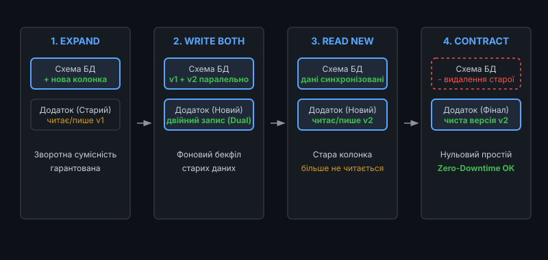
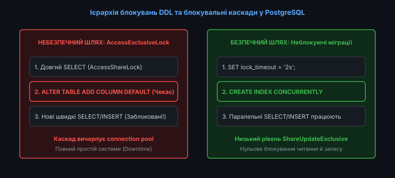
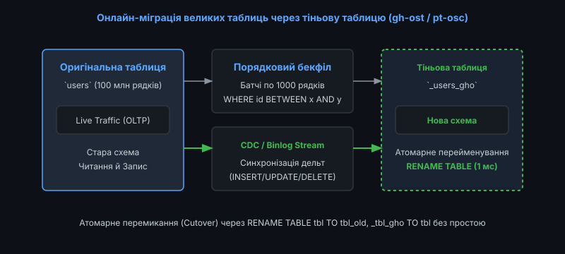
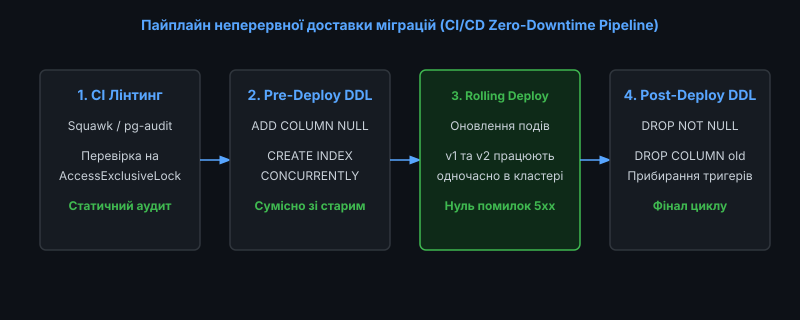

# 📜 Міграції схеми баз даних та нульовий час простою (Zero-Downtime)

<preknowlist>
- [Реляційна модель даних](root:sf-data/relational-model)
- [Індекси баз даних: B-Tree та Hash](root:sf-data/database-indexes)
- [Транзакції та властивості ACID](root:sf-data/transactions-acid)
- [Рівні ізоляції транзакцій](root:sf-data/isolation-levels)
- [Журнал попереднього запису (WAL) та протокол ARIES](root:sf-data/write-ahead-log)
</preknowlist>

У сучасній безперервній розробці програмного забезпечення (Continuous Delivery) додатки розгортаються десятки разів на день без зупинки користувацького сервісу. Проте оновлення схеми реляційної бази даних залишається найризикованішим етапом релізу. Якщо нова версія коду може бути миттєво відкочена або розгорнута паралельно через Canary або Blue-Green механізми, то зміна фізичної структури таблиці із сотнями мільйонів рядків зачіпає єдиний спільний стан усього кластера.

Наївне виконання команд зміни структури даних (Data Definition Language, DDL) призводить до небезпечних блокувань пам'яті, вичерпання пулу підключень, тривалих простоїв сервісу (Downtime) та пошкодження даних.

Забезпечення нульового часу простою при еволюції схеми вимагає глибокого розуміння внутрішніх блокувань СУБД, використання патерну розширення й звуження (Expand/Contract), застосування тіньових таблиць та суворої дисципліни версіонування.


*Чотири фази патерну Expand/Contract: гарантія повної сумісності схеми зі старими та новими версіями додатку*

---

### Ієрархія блокувань DDL та проблема блокувального каскаду

Головна причина збоїв під час міграцій — це не час роботи самого дискового накопичувача, а механізм черги блокувань СУБД.

У PostgreSQL та MySQL кожна операція над таблицею вимагає відповідного рівня блокування (Табличного замка). Наприклад, звичайний запит читання `SELECT` захоплює замок `AccessShareLock`, а операція оновлення `UPDATE` або `INSERT` захоплює `RowExclusiveLock`. Ці замки чудово співіснують між собою, дозволяючи тисячам клієнтів одночасно читати та модифікувати рядки.

Проте команди DDL (наприклад, `ALTER TABLE`, `DROP TABLE`, `TRUNCATE`) вимагають найвищого, монопольного рівня блокування — **`AccessExclusiveLock`**.


*Блокувальний каскад: довгий запит читання блокує ALTER TABLE, що зупиняє всі наступні короткі транзакції*

#### Механізм виникнення катастрофи (Lock Contention & Starvation)

1. **Довгий фоновий читач**: Користувач або аналітичний звіт запускає важкий запит `SELECT`, який працює 15 секунд і утримує замок `AccessShareLock`.
2. **Надходження команди міграції**: Автоматичний мігратор виконує `ALTER TABLE orders ADD COLUMN status text;`. Операція вимагає `AccessExclusiveLock`. Оскільки замок несумісний з `AccessShareLock`, команда `ALTER TABLE` стає в чергу очікування.
3. **Head-of-Line Blocking**: Планувальник ядра бази даних бачить ексклюзивний запит у черзі. Щоб захистити команду DDL від вічного голодування, планувальник починає блокувати **всі нові вхідні запити** до цієї таблиці (навіть найпростіші швидкі `SELECT` на 1 мілісекунду).
4. **Вичерпання пулу підключень (Connection Pool Starvation)**: За лічені секунди сотні нових веб-запитів блокуються в очікуванні таблиці. Пул з'єднань додатку переповнюється, сервери перестають приймати трафік, і вся система падає з помилкою HTTP 500.

Математичний аналіз і розрахунок часу накопичення черги детально викладено у вставці [Математична формалізація черги блокувань DDL та каскадного блокування](root:sf-data/database-migrations/math-lock-queue.md).

---

### Транзакційний DDL у PostgreSQL проти неявного COMMIT у MySQL

Важливою архітектурною відмінністю між сучасними реляційними СУБД є підтримка транзакційного DDL (Transactional DDL).

У **PostgreSQL** практично всі команди зміни структури (`CREATE TABLE`, `ALTER TABLE`, `ADD COLUMN`, `DROP CONSTRAINT`) зберігають зміни у системних каталогах `pg_class`, `pg_attribute` та `pg_constraint` як звичайні рядки версій MVCC. Це означає, що DDL-команда, запущена всередині блоку `BEGIN ... COMMIT`, може бути повністю відкочена командою `ROLLBACK` у разі виникнення помилки, не залишаючи базу даних у розламаному стані.

На противагу цьому, у **MySQL (InnoDB)** виконання будь-якої інструкції DDL викликає **неявну фіксацію поточної транзакції (Implicit Commit)**. Якщо скрипт міграції містить 5 команд `ALTER TABLE`, і четверта завершується помилкою через дублювання ключів, перші три команди залишаються застосованими назавжди. Ручний відкат такої напівзастосованої схеми вимагає створення зворотних виправлень та значно ускладнює аварійне відновлення.

---

### Патерн розширення та звуження (Expand/Contract Phase)

Будь-яка нетривіальна зміна схеми (перейменування колонки, зміна типу даних з `INT` на `BIGINT`, розбиття таблиці) не може бути виконана за один крок у системі без зупинки роботи.

Для безпечної трансформації застосовується патерн **Expand/Contract (Parallel Run)**, що розбиває процес на чотири незалежні релізи:

#### Фаза 1: Розширення схеми (Expand)
* У базу даних додається нова колонка або нова таблиця.
* Нова колонка обов'язково дозволяє значення `NULL` або має безпечне дефолтне значення.
* Старий працюючий код додатку (Версія v1) повністю ігнорує нове поле та продовжує стабільно функціонувати.

#### Фаза 2: Подвійний запис та фоновий бекфіл (Dual Write & Backfill)
* Розгортається нова версія коду (Версія v2), яка підтримує читання старої колонки, але записує зміни **одночасно в обидва поля** (Dual Writing).
* Окремий фоновий воркер порціями (батчами по 1000–5000 рядків) копіює історичні дані зі старого поля в нове:
  ```sql
  UPDATE users 
  SET new_phone = old_phone 
  WHERE id BETWEEN 10000 AND 15000 AND new_phone IS NULL;
  ```
* Паузи між батчами запобігають сплескам генерації журналу WAL та відставанню реплік.

#### Фаза 3: Перемикання читання на нову структуру (Read New)
* Додаток перемикається на читання виключно з нового поля.
* Старе поле більше не використовується бізнес-логікою, але може тимчасово заповнюватися для збереження можливості швидкого відкату.

#### Фаза 4: Звуження схеми (Contract)
* Після стабілізації релізу та перевірки метрик старе поле видаляється або позначається як неактивне.
* Схема стає чистою, без надлишкових дублюючих структур.

Історію розвитку міграційних методологій від ручних патчів до автоматизованих пайплайнів наведено у вставці [Еволюція міграцій баз даних: від ручних патчів до онлайн-DDL](root:sf-data/database-migrations/hist-evolution-migrations.md).

---

### Онлайн-міграції великих таблиць: підхід тіньових таблиць (Shadow Tables)

Коли обсяг таблиці перевищує сотні гігабайтів, навіть операції, що підтримуються механізмом Online DDL, створюють надмірне дискове навантаження. Для таких випадків компанії використовують інструменти класу **`gh-ost`** (GitHub Online Schema Transformations) або **`pt-online-schema-change`**.


*Принцип роботи інструментів онлайн-міграції через тіньову таблицю та потік реплікації*

#### Алгоритм роботи інструменту gh-ost:
1. **Створення тіньової таблиці**: Створюється копія структури цільової таблиці з новою модифікованою схемою (наприклад, `_users_gho`).
2. **Підключення до потоку реплікації (Binlog Stream)**: Інструмент підключається до СУБД як звичайна репліка та вичитує всі операції `INSERT`, `UPDATE`, `DELETE`, що відбуваються над оригінальною таблицею, транслюючи їх у тіньову таблицю в реальному часі.
3. **Порядкове копіювання історичних даних (Chunked Backfill)**: Фоновий процес копіює дані діапазонами первинного ключа (`WHERE id BETWEEN a AND b`).
4. **Динамічне регулювання навантаження (Throttling)**: Якщо затримка реплікації на репліках зростає понад порогове значення (наприклад, 1 секунда) або навантаження CPU сягає 80%, процес копіювання автоматично призупиняється.
5. **Атомарне перемикання (Atomic Cutover)**: Виконується миттєве блокування та атомарне перейменування таблиць двома командами `RENAME TABLE users TO _users_old, _users_gho TO users`, що займає менше 1 мілісекунди.

---

### Робота з переглядами (Views) та матеріалізованими в'ю під час міграцій

Особливою складністю при зміні структури колонок є наявність залежних реляційних об'єктів — звичайних та матеріалізованих переглядів (Views, Materialized Views), збережених процедур та тригерів.

У PostgreSQL спроба видалити або змінити тип колонки, яка використовується у перегляді `user_profiles_view`, буде миттєво відхилена помилкою:

```text
ERROR: cannot alter type of a column used by a view or rule
DETAIL: rule _RETURN on view user_profiles_view depends on column "phone"
```

Для вирішення цієї проблеми автоматизовані мігратори виконують **каскадну регенерацію переглядів**:
1. Зчитування DDL-визначень усіх залежних переглядів із системного каталогу `pg_views`.
2. Видалення переглядів (`DROP VIEW`).
3. Застосування DDL-модифікації над базовою таблицею.
4. Повторне створення переглядів із новою схемою.

Ця послідовність повинна обов'язково виконуватися всередині єдиної транзакції PostgreSQL, щоб жоден користувацький запит не побачив проміжного стану, в якому перегляд тимчасово відсутній.

---

### Стратегії секціонування таблиць та ротації даних

Для надвеликих часових рядів (Time-Series Data, фінансові транзакції, системні аудит-логи) класичні DDL-міграції часто замінюються партиціонуванням (Declarative Partitioning). Замість виконання важких інструкцій `DELETE FROM logs WHERE created_at < NOW() - INTERVAL '90 days'`, що генерують гігабайти WAL-журналу та фрагментують табличні сторінки, система створює помісячні або поденні секції.

Видалення застарілих даних зводиться до миттєвої команди `DROP TABLE logs_2025_01;`, яка звільняє дисковий простір на рівні файлової системи за лічені мілісекунди без жодного впливу на продуктивність активних транзакцій.

Крім того, приєднання нової порожньої секції через команду `ATTACH PARTITION` з попередньо валідованим обмеженням діапазону виконується без блокування основної таблиці, забезпечуючи неперервність запису терабайтів телеметрії щосекунди.

---

### Реалізація перевірки сумісності схеми на рівні коду

Для захисту від випадкового розгортання несумісних версій додатку інфраструктура повинна перевіряти стан схеми перед запуском. Нижче наведено базовий приклад перевірки метаданих схеми:

:::tabs
@tab C
```c
#include <stdio.h>
#include <stdbool.h>
#include <string.h>

typedef struct {
    char column_name[32];
    char data_type[16];
    bool is_nullable;
} column_schema_t;

bool validate_schema_compatibility(column_schema_t *current_schema, size_t count, const char *required_col) {
    for (size_t i = 0; i < count; ++i) {
        if (strcmp(current_schema[i].column_name, required_col) == 0) {
            printf("Колонка %s знайдена в схемі бази даних.\n", required_col);
            return true;
        }
    }
    fprintf(stderr, "Помилка несумісності: колонка %s відсутня!\n", required_col);
    return false;
}
```
@tab C++
```cpp
#include <iostream>
#include <vector>
#include <string>
#include <algorithm>

struct ColumnSchema {
    std::string name;
    std::string type;
    bool is_nullable;
};

bool validate_schema_compatibility(const std::vector<ColumnSchema>& schema, const std::string& required_col) {
    auto it = std::find_if(schema.begin(), schema.end(), [&](const ColumnSchema& col) {
        return col.name == required_col;
    });
    if (it != schema.end()) {
        std::cout << "Колонка " << required_col << " знайдена в схемі.\n";
        return true;
    }
    std::cerr << "Помилка несумісності: колонка " << required_col << " відсутня!\n";
    return false;
}
```
:::

Практична розробка власного повноцінного рушія міграцій доступна у проєкті [Розробка міні-рушія міграцій схеми бази даних](root:sf-data/database-migrations/proj-mini-migration-runner.md).

---

### Автоматизація в пайплайнах CI/CD

Для забезпечення високої надійності релізів міграції вбудовуються у загальний конвеєр доставки коду.


*Автоматизований пайплайн: статичний лінтинг, Pre-deployment DDL, поступове оновлення серверів та фінальне очищення*

Повний перелік рівнів блокувань, небезпечних операцій та правил налаштування захисних тайм-аутів наведено у вставці [Довідник безпечних DDL операцій та чекліст Zero-Downtime](root:sf-data/database-migrations/api-zero-downtime-checklist.md).

---

### Специфіка роботи з реплікацією та розподіленими транзакціями

Особливу увагу слід приділяти затримці реплікації (Replication Lag). Коли важка DDL-команда застосовується на ведучому сервері (Primary), вона записується у журнал WAL і потім послідовно відтворюється на всіх репліках (Standby).

Якщо на репліці в цей момент виконується довгий аналітичний звіт, відтворення DDL на Standby заблокується або призведе до скасування запиту з помилкою `canceling statement due to conflict with recovery`.

Для усунення цього конфлікту інженери використовують виділені параметри реплікації:
* `max_standby_streaming_delay`: Максимальний час, протягом якого репліка відкладає застосування WAL-записів DDL на користь активних запитів читання.
* `hot_standby_feedback`: Інформує Primary вузол про активні транзакції на Standby для запобігання передчасному очищенню рядків вакуумом.

---

### Підсумкові інженерні правила міграцій Zero-Downtime

1. **Завжди обмежуйте `lock_timeout`**: Будь-який скрипт міграції у виробничому середовищі повинен починатися з команди `SET lock_timeout = '2s';`. Це унеможливлює зависання бази даних у блокувальному каскаді.
2. **Створюйте індекси тільки неблокуючим способом**: Завжди використовуйте `CREATE INDEX CONCURRENTLY` у PostgreSQL або `ALGORITHM=INPLACE, LOCK=NONE` у MySQL InnoDB.
3. **Заборона одномоментного перейменування та видалення**: Будь-яке перейменування поля або зміна типу даних повинна проходити через фази Expand/Contract із паралельним подвійним записом.
4. **Контроль розміру батчів при оновленні**: Масивні операції `UPDATE` та `DELETE` повинні розбиватися на невеликі чанки по 1000–5000 рядків із затримками для запобігання переповненню пулу буферів і журналу WAL.
5. **Автоматичний статичний аналіз**: Інтегруйте інструменти лінтингу SQL (наприклад, Squawk) у конвеєр CI/CD для автоматичного виявлення небезпечних монопольних операцій до потрапляння коду на сервери.
6. **Розділення релізів коду та міграцій**: Ніколи не запускайте несумісні зміни коду та DDL в одному кроці розгортання; Pre-deployment міграція завжди передує релізу коду, а Post-deployment очищення слідує за ним.
