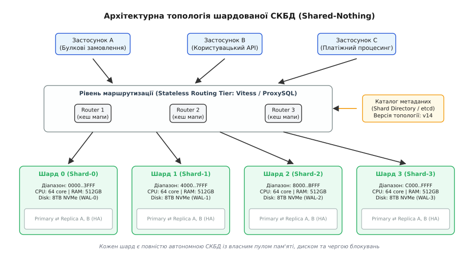
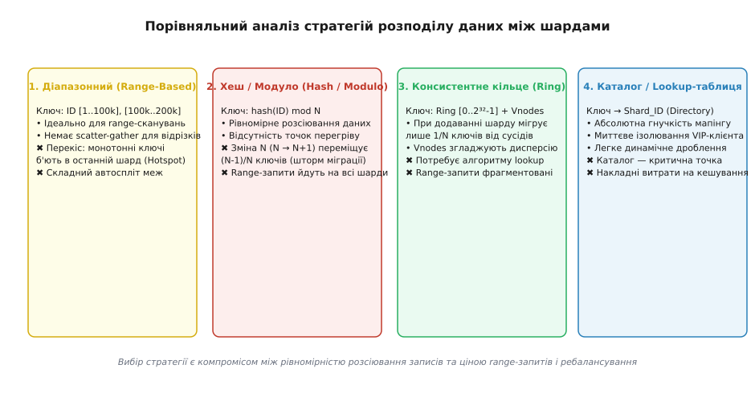
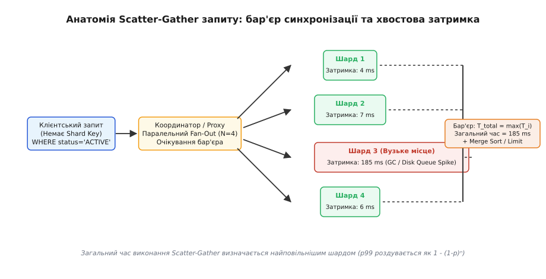
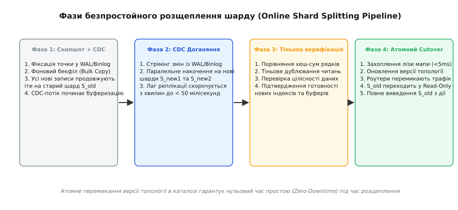

# Шардинг баз даних: архітектура горизонтального масштабування, маршрутизація, розщеплення та експлуатація Shared-Nothing систем

<preknowlist>
- [Лідер-фоловер / мультилідер / leaderless](topic:sf-distributed/replication-leader-follower) — фізична організація реплікації та розподіл ролей між вузлами.
- [Реплікаційний лаг і сесійні гарантії](topic:sf-distributed/replication-lag) — затримка синхронізації копій даних та аномалії читання після запису.
- [Консистентне хешування](topic:sf-algorithms/consistent-hashing) — алгоритм відображення ключів на кільце серверів із мінімізацією міграцій.
- [Метрики](topic:sf-release/metrics-monitoring) — спостереження за утилізацією CPU, пам'яті, IOPS та перцентилями затримок.
- [SLI/SLO/SLA і бюджет помилок](topic:sf-release/slo-sli-sla) — кількісні межі допустимої затримки та відсотка збоїв під навантаженням.
- [Планування потужностей і headroom](topic:sf-release/capacity-planning) — розрахунок запасу ресурсів до точки нелінійного зростання черг.
- [Бекапи і DR](topic:sf-release/disaster-recovery) — стратегії створення резервних копій та цільові показники RTO/RPO.
</preknowlist>

Центральна реляційна база даних платіжного маркетплейсу працює на виділеному сервері з 128 процесорними ядрами, 1 терабайтом оперативної пам'яті та дисковим масивом NVMe продуктивністю 150 000 IOPS. Протягом звичайного дня система стабільно фіксує 8 500 фінансових транзакцій на секунду. Проте під час масштабного розпродажу потік операцій запису (`INSERT` та `UPDATE`) зростає до 24 000 на секунду. Коефіцієнт влучання в буферний пул (Buffer Pool Hit Ratio) падає з 99.4% до 71%, оскільки активний робочий набір даних (Working Set) перевищує обсяг оперативної пам'яті. Потоки СКБД починають масово блокуватися на сторінках кореневих вузлів індексів B-дерева, єдиний журнал випереджального запису (WAL / Redo Log) перетворюється на вузьке місце послідовної серіалізації, а черга введення-виведення на дисках вибухає до сотень мілісекунд. Сервер переходить у стан глибокого насичення ресурсів, генеруючи каскадні таймаути клієнтських застосунків.

Ця аварія демонструє фізичну межу вертикального масштабування (Scale-Up): навіть найпотужніший сервер має фіксовану пропускну здатність шини пам'яті, контролерів вводу-виводу та одного журналу транзакцій. Додавання реплік для читання (Read Replicas) не рятує ситуацію, оскільки репліки лише розподіляють навантаження `SELECT`, але зобов'язані повторювати 100% усіх операцій запису, дублюючи навантаження на диск і страждаючи від неконтрольованого реплікаційного лагу. Коли потік записів перевищує пропускну здатність одного дискового контролера або обсяг таблиць унеможливлює регламентне обслуговування й відновлення з бекапу в межах RTO, єдиним інженерним виходом стає шардинг (англ. *Database Sharding*, від *shard* — уламок, черепок) — архітектурний поділ єдиного логічного набору даних на множину повністю незалежних фізичних баз даних (Shared-Nothing Architecture), кожна з яких обслуговує власну підмножину записів на окремому обладнанні.

> 🔧 **Навіщо це.** Інженер, який намагається вирішити проблему вичерпання диска чи процесора бази даних нескінченною купівлею дорожчих серверів або наївним розмноженням Read-реплік, неминуче зіткнеться з повною зупинкою сервісу під час чергового піку записів. Хто володіє дисципліною шардингу, вміє проектувати архітектуру Shared-Nothing: правильно обирає ключ шардингу для уникнення гарячих точок, будує безієрархічний проксі-шар маршрутизації, реалізує безпечні алгоритми віялового опитування (Scatter-Gather) та здійснює безпростойне онлайн-розщеплення перевантажених шардів без втрати транзакційної цілісності.

## Фізичні межі одного вузла: чому вертикальне масштабування вичерпується

Щоб зрозуміти неминучість переходу до шардингу, необхідно розібрати внутрішні бар'єри сучасних реляційних СКБД (MySQL InnoDB, PostgreSQL), які виникають при роботі на єдиному фізичному сервері.

```
┌─────────────────────────────────────────────────────────────┐
│                 ЄДИНИЙ СЕРВЕР СКБД (Scale-Up)               │
│                                                             │
│  ┌───────────────────────┐       ┌───────────────────────┐  │
│  │   Buffer Pool (RAM)   │       │   Lock Manager (CPU)  │  │
│  │  Working Set > RAM    │       │  Конкуренція за леджі │  │
│  │   Hit Ratio Collapse  │       │  на B-tree сторінках  │  │
│  └───────────┬───────────┘       └───────────┬───────────┘  │
│              │                               │              │
│              ▼                               ▼              │
│  ┌───────────────────────────────────────────────────────┐  │
│  │          Єдиний WAL / Redo Log (Дискове горло)        │  │
│  │        Послідовний `fsync()` блокує всі транзакції    │  │
│  └───────────────────────────┬───────────────────────────┘  │
└──────────────────────────────┼──────────────────────────────┘
                               ▼
            Вичерпання пропускної здатності диска
```

### 1. Деградація буферного пулу (Buffer Pool Thrashing)
Продуктивність бази даних тримається на збереженні активних індексів та гарячих сторінок даних в оперативній пам'яті. Коли розмір бази зростає до десятків терабайтів, а робочий набір перестає вміщуватися в пам'ять, алгоритм витіснення (LRU / Clock sweep) починає безперервно скидати брудні сторінки на диск і вичитувати нові. Кожен SQL-запит замість взяття даних із RAM за наносекунди змушений чекати фізичного читання з диска за мілісекунди. Затримка обробки транзакцій підскакує на три порядки.

### 2. Вузьке місце журналу транзакцій (WAL / Redo Log Bottleneck)
Для забезпечення властивості надійності ACID (Durability) будь-яка транзакція перед фіксацією (`COMMIT`) зобов'язана записати свій стан у журнал випереджального запису через системний виклик `fsync()`. Хоча NVMe-накопичувачі виконують випадковий запис дуже швидко, послідовне скидання одного журналу накладає жорстку межу: блокування м'ютексів буфера журналу в ядрі СКБД та ліміт операцій скидання обмежують максимальний темп вставок стелею у 20 000–40 000 транзакцій на секунду для одного сервера.

### 3. Конкуренція за леджі на сторінках B-дерева (B-Tree Latch Contention)
При інтенсивному паралельному записі сотні потоків операційної системи намагаються модифікувати суміжні рядки в одній таблиці. Це викликає жорстку конкуренцію за короткочасні блокування оперативної пам'яті (леджі — *latches*) на кореневих та проміжних сторінках індексів B-Tree. Замість корисної роботи процесорні ядра витрачають до 60–80% часу на спінлоки (Spinlocks) в очікуванні звільнення сторінки в пам'яті.

### 4. Криза регламентних вікон та Disaster Recovery
База даних обсягом 40 терабайтів на одному сервері перетворюється на операційний кошмар:
- Створення логічного дампу (`pg_dump` / `mysqldump`) триває десятки годин і створює колосальне паразитарне навантаження на диск;
- Операції фонового очищення та дефрагментації (`VACUUM FULL`, `OPTIMIZE TABLE`) блокують роботу або не встигають за темпом утворення мертвих рядків;
- Відновлення сервера з резервної копії після апаратної відмови вимагає завантаження та накочення журналів протягом багатьох діб, що повністю руйнує бізнес-показник цільового часу відновлення (RTO).

## Архітектурна анатомія шардованої системи (Shared-Nothing)

Шардинг розв'язує проблему масштабування за рахунок переходу до парадигми **Shared-Nothing**: кластер формується з множини фізично ізольованих вузлів (шардів), кожен з яких має власний виділений процесор, оперативну пам'ять, дисковий масив та екземпляр СКБД. Шарди не поділяють між собою спільну пам'ять або дискові сховища SAN/NAS.


*Архітектура Shared-Nothing: клієнтські запити маршрутизуються через безієрархічний проксі-шар до повністю автономних вузлів зберігання із власними ресурсами пам'яті й дисків.*

Шардована інфраструктура складається з трьох обов'язкових функціональних шарів:

### 1. Рівень маршрутизації (Router / Proxy Tier)
Безієрархічний рівень проксі-серверів (наприклад, Vitess VTGate, ProxySQL, Citus Coordinator або вбудовані Smart-клієнти в коді застосунку). Маршрутизатор приймає запит клієнта, розбирає синтаксичне дерево SQL (AST), витягує значення ключа шардингу і за внутрішньою мапою визначає, на який конкретний фізичний шард або групу шардів необхідно надіслати запит. Маршрутизатори є stateless-компонентами і масштабуються горизонтально додаванням нових інстансів за балансувальником навантаження L4/L7.

### 2. Каталог метаданих і топології (Shard Directory / Metadata Catalog)
Високонадійне сховище консенсусу (etcd, ZooKeeper, Consul або спеціалізована мета-база), яке зберігає глобальну мапу розподілу ключів між шардами, адреси поточних Primary-вузлів, версію топології кластера та стан процесів міграції. Будь-які зміни в топології фіксуються в каталозі монотонно зростаючим лічильником генерацій (Fencing Token / Generation) і розсилаються на маршрутизатори через механізм підписок (Watch API).

### 3. Фізичні шарди (Autonomous Shard Clusters)
Кожен логічний шард являє собою повноцінний високонадійний кластер СКБД, що складається з одного Primary-вузла (який приймає операції запису для свого діапазону) та кількох локальних реплік (Replica), об'єднаних синхронною або напівсинхронною реплікацією для забезпечення високої доступності (HA).

## Стратегії шардингу: аналіз механізмів розподілу даних

Фундаментом архітектури шардингу є вибір **ключа шардингу (Shard Key / Partition Key)** та математичної стратегії проекції цього ключа на фізичні сервери. Помилка у виборі стратегії призводить до нерівномірного розподілу даних або неможливості виконання бізнес-запитів без повного сканування всіх машин.


*Порівняння стратегій шардингу: баланс між локальністю діапазонних вибірок, рівномірністю навантаження та вартістю подальшого ребалансування.*

### 1. Діапазонний шардинг (Range-Based Sharding)
Дані розбиваються на неперетинні безперервні відрізки значень ключа: Шард 1 утримує `ID [1 .. 100 000]`, Шард 2 — `ID [100 001 .. 200 000]`, або за часовими інтервалами (січень, лютий, березень).

```
Діапазон 1:  [00000000 .. 3FFFFFFF]  ──►  Шард 0
Діапазон 2:  [40000000 .. 7FFFFFFF]  ──►  Шард 1
Діапазон 3:  [80000000 .. BFFFFFFF]  ──►  Шард 2
Діапазон 4:  [C0000000 .. FFFFFFFF]  ──►  Шард 3
```

- **Перевага:** ідеально підходить для діапазонних вибірок (`SELECT WHERE id BETWEEN 500 AND 1200`). Запит іде строго на один цільовий шард без віялового опитування.
- **Головна небезпека (Monotonic Key Hotspot):** якщо ключем шардингу обрано автоінкрементний ID (`AUTO_INCREMENT`) або позначку часу (`created_at`), **100% усіх операцій запису спрямовуються виключно в останній шард**. Попередні шарди перетворюються на холодний архів, а останній сервер кластера захлинається від навантаження.

### 2. Хеш-шардинг / Модуло (Hash / Modulo Sharding)
Ключ пропускається через хеш-функцію, а номер цільового шарду обчислюється взяттям залишку від ділення на кількість фізичних вузлів `N`:

```
Shard_ID = hash(Key) mod N
```

- **Перевага:** гарантує ідеально рівномірне статистичне розсіювання записів по всіх серверах кластера, повністю ліквідуючи проблему послідовного перегріву.
- **Головна небезпека (The Resharding Storm):** якщо кількість шардів змінюється з `N` на `N+1`, залишок від ділення змінюється для `(N - 1) / N` частини всіх записів. Додавання одного нового сервера до кластера з 9 машин змушує **перемістити 90% усіх даних по мережі**, що призводить до багатогодинного перевантаження інфраструктури. Крім того, будь-який діапазонний запит вимагає віялового сканування всіх машин.

### 3. Консистентне кільцеве хешування (Consistent Hashing Ring)
Простір хеш-значень замикається в кільце `[0 .. 2³² - 1]`. Фізичні сервери та ключі записів відображаються на точки цього кільця. Ключ закріплюється за першим вузлом, який зустрічається на кільці за годинниковою стрілкою.

Для запобігання статистичної нерівномірності кожен фізичний сервер представлений на кільці у вигляді `V` віртуальних вузлів (vnodes), рівномірно розподілених по колу.

- **Перевага:** при додаванні або видаленні одного фізичного шарду переміщується лише `1 / N` частина ключів, і виключно між сусідніми вузлами.
- **Математичний розрахунок:** точний вивід дисперсії навантаження залежно від кількості віртуальних вузлів та формулу затримки розібрано у [математиці шардингу та віртуальних вузлах](topic:sf-data/database-sharding/math-sharding-skew-and-fanout.md).

### 4. Каталожний шардинг / Таблиця відповідності (Directory-Based / Lookup Sharding)
Маршрутизація здійснюється через явну таблицю відображення: `Entity_ID → Shard_ID`. Спеціалізований сервіс зберігає точне місцезнаходження кожного користувача чи організації.

- **Перевага:** максимальна гнучкість. Дозволяє миттєво перенести одного великого корпоративного клієнта (VIP-тенанта) на окремий виділений фізичний шард або об'єднати дрібних клієнтів в один пул без зміни логіки ключів.
- **Головна небезпека:** таблиця відповідності стає єдиною критичною точкою відмови і вимагає багаторівневого агресивного кешування на маршрутизаторах, що ускладнює інвалідацію кешу при зміні топології.

## Експлуатаційні виклики та «темний бік» шардингу

Шардинг вирішує проблему ємності та пропускної здатності запису, але руйнує простоту монолітної СКБД. Інженерна експлуатація шардованого кластера вимагає подолання чотирьох фундаментальних проблем розподілених систем.

### 1. Scatter-Gather запити та роздування хвостової затримки
Якщо SQL-запит не містить ключа шардингу у блоці `WHERE` (наприклад, `SELECT * FROM orders WHERE status = 'PENDING'`), маршрутизатор зобов'язаний виконати паралельне опитування (Fan-Out) усіх `N` шардів кластера, після чого зібрати, об'єднати, відсортувати та обмежити (`LIMIT / OFFSET`) результат у власній оперативній пам'яті.


*Вплив паралельного опитування шардів на підсумкову затримку: бар'єр синхронізації на координаторі змушує клієнта чекати найповільніший вузол кластера.*

Оскільки координатор не може повернути фінальну відповідь клієнту, доки не отримає дані від кожного опитаного вузла, підсумковий час виконання визначається найповільнішим сервером:

```
T_total = max(T₁, T₂, ..., T_N)
```

Якщо для одного сервера ймовірність виникнення затримки (GC-пауза, збійний I/O) становить 1% (`p = 0.01`), то в кластері зі 100 шардів імовірність того, що хоча б один вузол уповільнить весь клієнтський запит, становить `1 - (1 - 0.01)¹⁰⁰ ≈ 63.4%`. Таким чином, 99-й перцентиль затримки (p99) деградує у багато разів.

### 2. Розподілені крос-шардові транзакції (Two-Phase Commit vs Sagas)
Коли бізнес-операція вимагає атомарної модифікації даних на двох різних шардах (наприклад, списання грошей з рахунку користувача на Шарді 1 та зарахування на рахунок одержувача на Шарді 4), класичні транзакції бази даних перестають працювати локально.

Використання протоколу двофазної фіксації (2PC / XA Transactions) накладає колосальні накладні витрати:
- Координатор надсилає команду `PREPARE` усім учасникам;
- Шарди захоплюють блокування рядків у пам'яті та записують стан готовності у WAL;
- Координатор чекає відповіді від усіх шардів по мережі і надсилає команду `COMMIT`.

Будь-яка мережева затримка або падіння координатора між фазами призводить до того, що рядки на фізичних шардах залишаються заблокованими на невизначений термін, зупиняючи паралельні транзакції інших користувачів. З цієї причини високопродуктивні шардовані системи відмовляються від XA на користь **патерну Сага (Saga Pattern)**, розподіленого транзакційного вихідного логу (**Transactional Outbox**) та моделі кінцевої узгодженості (Eventual Consistency).

### 3. Генерація глобально унікальних ідентифікаторів (Global ID Generation)
У шардованій базі даних використання вбудованих автоінкрементів (`AUTO_INCREMENT` або `BIGSERIAL`) призводить до неминучого дублювання первинних ключів: Шард 1 згенерує запис із `ID = 42`, і Шард 2 одночасно згенерує запис із `ID = 42`.

Для вирішення проблеми застосовують чотири інженерні підходи:
- **Twitter Snowflake / Sonyflake:** 64-бітний цілочисельний ідентифікатор, що формується з позначки часу (41 біт), ідентифікатора фізичного вузла/шарду (10 біт) та локального лічильника послідовності (12 біт). Гарантує унікальність і монотонне сортування за часом без звернення до централізованого координатора;
- **UUIDv7:** сучасний 128-бітний стандартизований ідентифікатор, який поєднує мілісекундну часову мітку Unix у старших бітах та криптографічну псевдовипадковість у молодших, що забезпечує збереження локальності вставок у B-деревах;
- **Схема виділених діапазонів (Ticket Server / Hi-Lo):** центральний сервіс виділяє кожному маршрутизатору пачки ідентифікаторів фіксованого розміру (наприклад, по 10 000 номерів), які роутер роздає локально з пам'яті.

### 4. Гарячі шарди та перекіс тенантів (Celebrity / Tenant Skew)
Якщо в системі електронної комерції ключем шардингу обрано `merchant_id`, а 95% покупців здійснюють замовлення у трьох гігантських торговельних мереж, ці три організації створять колосальний перекіс (Skew). Шарди, на які припадають їхні хеші, будуть перевантажені на 100%, тоді як решта серверів кластера простоюватимуть.

Методи лікування перекосу:
- **Складений ключ шардингу (Compound Shard Key):** наприклад, `(merchant_id, hash(order_id) mod 8)`, що дозволяє розрізати замовлення навіть одного гігантського мерчанта на 8 незалежних шардів;
- **Соління ключів (Key Salting):** додавання до ключа випадкового префікса `salt_0..salt_K` під час запису та віялове читання всіх солоних копій;
- **Ізоляція в окремий шард (Dedicated Shard Tiering):** перенесення аномально великих тенантів на індивідуальні виділені сервери за допомогою каталогу відповідності.

## Мультиплексування з'єднань та оптимізація розподілених запитів

У високонавантажених шардованих середовищах виникає явище **шторму підключень (Connection Explosion)**: коли 1 000 подів мікросервісів відкривають по 20 з'єднань до кожного з 64 шардів, кожен фізичний сервер MySQL/PostgreSQL стикається з необхідністю утримувати понад 20 000 паралельних TCP-сесій.

Операційна система Linux витрачає гігабайти пам'яті на буфери сокетів (`tcp_rmem`, `tcp_wmem`) та стеки потоків СКБД (по 8–10 МБ на бекенд-процес PostgreSQL), а планувальник CFS захлинається від перемикання контексту. 

Для захисту баз даних проксі-шар (Vitess VTTablet / ProxySQL) виконує **транзакційне мультиплексування (Transaction Multiplexing)**: тисячі клієнтських підключень транслюються у компактний постійний пул із 50–100 фізичних з'єднань до бази даних. З'єднання утримується клієнтом лише на час виконання активної транзакції і миттєво повертається в пул після виклику `COMMIT`.

### Стратегії виконання міжшардових JOIN

Виконання реляційних об'єднань (`JOIN`) між таблицями у шардованому середовищі спирається на три оптимізаційні патерни:

1. **Колокаційний шардинг (Co-located Sharding / Entity Groups):** пов'язані сутності проектуються на один і той самий ключ шардингу. Наприклад, таблиці `users` та `orders` мають ключ `user_id`. Усі замовлення конкретного користувача гарантовано зберігаються на тому самому фізичному вузлі, що й сам користувач. Завдяки цьому запит `SELECT * FROM users JOIN orders USING (user_id)` виконується локально в межах одного шарду з повною швидкістю індексного сканування;
2. **Таблиці-довідники (Broadcast / Reference Tables):** невеликі статичні таблиці з низькою частотою змін (довідники країн, валют, категорій товарів) реплікуються повністю на 100% усіх фізичних шардів. Це дозволяє виконувати `JOIN` локально на будь-якому вузлі без звернення до сусідів по мережі;
3. **Розподілений хеш-джойн на роутері (Distributed Coordinator Join):** якщо таблиці шардовані за різними ключами, маршрутизатор вичитує проміжні набори даних з обох шардів, завантажує меншу таблицю в локальну хеш-таблицю в пам'яті (Build Phase) і сканує другий потік (Probe Phase).

## Міграція схем даних у шардованому кластері (Schema Migrations at Scale)

Виконання DDL-операцій (`ALTER TABLE`, додавання індексів або колонок) на монолітній базі можна виконати однією командою. У шардованому кластері з 200 фізичних інстансів пряме виконання `ALTER TABLE` призведе до катастрофічного простою через блокування таблиць та неминучого розходження схем (Schema Drift), коли на одних шардах індекс уже створився, а на інших завис через довгу транзакцію.

Для безпечної еволюції схем застосовують інструменти безблокувальної міграції (Online DDL) — такі як `gh-ost` або `pt-online-schema-change`, інтегровані в оркестратор шардингу:

1. На кожному шарді паралельно створюється порожня тіньова таблиця (Ghost Table) з новою структурою схеми;
2. Спеціальний демон вичитує рядки з оригінальної таблиці пачками (`chunk_size = 1000`) і копіює їх у тіньову таблицю, регулюючи швидкість за сигналами затримки реплікації (Throttling by Replication Lag);
3. Паралельні зміни від користувачів відслідковуються через бінарний журнал (Binlog) і дзеркалюються в тіньову таблицю;
4. Після завершення копіювання координатор синхронізує точку відсікання і виконує атомарну підміну імен таблиць (`RENAME TABLE original TO old, ghost TO original`) одночасно на всіх шардах.

## Конвеєр безпростойного онлайн-розщеплення шардів (Live Resharding Lifecycle)

У процесі експлуатації шардованої системи настає момент, коли один із фізичних шардів (наприклад, `Shard-3`) вичерпує виділений дисковий простір (наприклад, досягає 85% ємності NVMe) або перевищує допустимий поріг завантаження процесора. Зупинка сервісу для ручного експорту й імпорту даних є неприпустимою.

Розподілені системи реалізують **чотирифазний конвеєр онлайн-розщеплення (Zero-Downtime Shard Splitting)**, який дозволяє розділити `Shard-3` на два нових дочірніх шарди (`Shard-3a` та `Shard-3b`) під повним виробничим навантаженням.


*Чотирифазний конвеєр онлайн-розщеплення: бекфіл даних, реплікація потоку CDC-змін, верифікація та субмілісекундне перемикання маршрутизації.*

### Фаза 1: Фіксація консистентного снапшота та фоновий бекфіл (Snapshot Backfill)
1. Координатор кластера фіксує поточну позицію в журналі реплікації батьківського шарду (WAL LSN / MySQL Binlog GTID);
2. Запускається процес фонового потокового копіювання історичних даних (Bulk Copy) на два нових підготовлених сервери `Shard-3a` та `Shard-3b` відповідно до нового ключа розрізу (Split Key);
3. Усі поточні операції запису від клієнтів продовжують безперешкодно надходити виключно на батьківський `Shard-3`.

### Фаза 2: Накочення потоку змін CDC (Change Data Capture Catch-Up)
1. Після завершення копіювання снапшота активується коннектор захоплення змін (CDC), який вичитує журнал реплікації батьківського шарду починаючи з зафіксованої у фазі 1 точки;
2. Потік подій (`INSERT`, `UPDATE`, `DELETE`) у реальному часі фільтрується за ключем розщеплення і паралельно застосовується до `Shard-3a` та `Shard-3b`;
3. Процес триває доти, доки відставання реплікації (CDC Lag) між батьківським і дочірніми шардами не скоротиться до кількох мілісекунд.

### Фаза 3: Тіньова верифікація даних (Shadow Verification)
1. Спеціальний демон верифікації виконує потокове обчислення контрольних сум (Merkle Tree / Row Checksums) між батьківським шардом та новими базами;
2. Маршрутизатори починають дублювати частину операцій читання на нові шарди у фоновому режимі без повернення результату клієнту, прогріваючи буферні пули (Buffer Pool Warmup) нових серверів.

### Фаза 4: Атомарне перемикання маршрутизації (Sub-millisecond Cutover)
1. Координатор переводить батьківський `Shard-3` у режим тільки для читання (`READ_ONLY`) на 3–5 мілісекунд;
2. Дочірні шарди застосовують останні мікросекундні залишки CDC-потоку до повного нульового лагу;
3. Координатор оновлює версію топології в каталозі консенсусу (`generation = generation + 1`);
4. Маршрутизатори миттєво перемикають трафік запису на `Shard-3a` та `Shard-3b`, а старий `Shard-3` виводиться з експлуатації та безпечно видаляється після завершення періоду утримання.

Технічний опис протоколів координатора та специфікацію API керування станами шардів наведено у [специфікації інтерфейсу координатора шардингу](topic:sf-data/database-sharding/api-shard-coordinator-spec.md). Практичну реалізацію маршрутизатора запитів із підтримкою консистентного кільця та пулу паралельних потоків представлено у [проєкті розробки Shard Router](topic:sf-data/database-sharding/proj-shard-router.md).

## Резервне копіювання, аварійне відновлення та часова узгодженість

Найбільш підступною пасткою шардингу є організація резервного копіювання (Backup & Disaster Recovery).

У монолітній базі даних створення резервної копії спирається на єдиний журнал транзакцій, що гарантує стан відновлення на конкретний момент часу (Point-in-Time Recovery, PITR).

У шардованій системі кожен фізичний вузол має **власний незалежний годинник і власний ізольований WAL**. Якщо резервне копіювання запускається на кожному шарді окремо через стандартний cron (наприклад, о 02:00 на Шарді 1 та о 02:01 на Шарді 2), отриманий набір бекапів страждає від **розподіленої часової неузгодженості (Distributed Temporal Inconsistency)**.

```
Шард 1 (Баланс клієнта A):  [Списано $1000 о 02:00:30] ──► Бекап знято о 02:01:00 (Баланс: $0)
Шард 2 (Баланс клієнта B):  [Зараховано $1000 о 02:00:30] ──► Бекап знято о 02:00:15 (Баланс: $0)

Результат відновлення з бекапу: $1000 безслідно зникли з системи!
```

Щоб забезпечити коректність відновлення, застосовують дві інженерні моделі:
1. **Глобальні координатори моментальних знімків (Global Snapshot Coordinators):** використання гібридних логічних годинників (HLC — Hybrid Logical Clocks) або централізованих генераторів позначок транзакцій (Timestamp Oracle / TSO), що дозволяє фіксувати глобальний номер транзакції (Global SCN) на всіх шардах одночасно перед зняттям снапшота;
2. **Незмінне сховище журналу подій (Event Log as Source of Truth):** фіксація всіх вхідних мутацій у розподіленому незмінному журналі (Apache Kafka / AWS Kinesis) із фіксацією глобальних зміщень (Offsets), що дозволяє відновити будь-який шард повторним програванням подій із точного глобального зміщення.

Детальний аналіз історичного шляху від перших клієнтських шардинг-скриптів LiveJournal до сучасних NewSQL систем наведено в [історії виходу баз даних за межі одного сервера](topic:sf-data/database-sharding/hist-sharding-origins.md).

## Експлуатаційна телеметрія та діагностика

Експлуатація шардованої інфраструктури вимагає спостереження за специфічними метриками ядра операційної системи, мережевих буферів та підсистем СКБД.

### Ключові метрики здоров'я шардованого кластера

| Метрика | Джерело / Інструмент | Порогове значення | Інженерна інтерпретація та дія |
| :--- | :--- | :--- | :--- |
| **Shard Storage Skew** | Prometheus / `node_filesystem_free_bytes` | Дисперсія > 15% | Нерівномірний розподіл байтів між шардами. Ознака невдалого ключа шардингу або наявності гігантських тенантів. Потрібен ребаланс. |
| **Scatter-Gather Fan-Out Ratio** | Проксі / `router_scatter_gather_requests_total` | > 5% від усіх запитів | Занадто багато запитів не містять ключа шардингу. Ризик колапсу p99 затримок під час пікового трафіку. |
| **CDC Replication Lag** | Коннектор / `cdc_replication_lag_seconds` | > 0.5 секунди | Дочірні шарди не встигають за темпом запису батьківського вузла. Перемикання топології заблоковано. |
| **Router Topology Generation Drift** | Маршрутизатор / `router_topology_version` | Різниця версій > 0 | Розсинхронізація мапи шардингу між проксі-серверами. Ризик надсилання запитів на виведені з дії шарди. |
| **Buffer Pool Wait Free** | MySQL / `Innodb_buffer_pool_wait_free` | > 0 | Нестача вільної пам'яті в буферному пулі шарда під нові сторінки. Потрібно ініціювати розщеплення. |
| **TCP Listen Drops** | Linux / `/proc/net/netstat` (`ListenDrops`) | > 0 | Переповнення черги `somaxconn` сокетів СКБД через завислі з'єднання від маршрутизаторів. |

## Антипатерни проектування ключів шардингу та чеклист архітектора

Невдало обраний ключ шардингу є найбільш руйнівною архітектурною помилкою, оскільки зміна ключа на живій системі вимагає повної перебудови всієї бази даних.

### Поширені антипатерни:
1. **Ключ із низькою кардинальністю (Low Cardinality Shard Key):** вибір поля з малою кількістю унікальних значень (наприклад, `country_code` або `gender`). Навіть якщо кластер має 64 шарди, дані розподіляться лише між 2–3 найпопулярнішими країнами, а решта серверів простоюватимуть;
2. **Мутабельний ключ шардингу (Volatile Shard Key):** використання поля, яке може змінюватися в ході життєвого циклу запису (наприклад, `status` замовлення або `current_city` користувача). Оновлення такого поля змушує СКБД видалити рядок з одного фізичного шарду та вставити в інший, що вимагає важкої розподіленої крос-шардової транзакції;
3. **Крос-доменне розмиття ключів (Cross-Domain Key Fragmentation):** коли пов'язані таблиці шардуються за різними сутностями (наприклад, `users` за `user_id`, а `payments` за `payment_id`), що унеможливлює локальні об'єднання та вимагає постійних Scatter-Gather сканувань для базових операцій.

### Чеклист архітектора: чи дійсно вам потрібен шардинг?
Перед впровадженням шардингу інженер зобов'язаний переконатися, що вичерпано простіші та дешевші інструменти оптимізації:
- Чи оптимізовано індекси та виправлено повільні запити (`EXPLAIN ANALYZE`), які сканують зайві сторінки?
- Чи винесено статичні та рідко змінювані дані у розподілений кеш (Redis / Memcached)?
- Чи налаштовано партиціонування великих таблиць у межах одного екземпляра СКБД (PostgreSQL Table Partitioning)?
- Чи відокремлено важку аналітичну звітність (OLAP) від транзакційного потоку (OLTP) за допомогою реплікації в ClickHouse / Snowflake?
- Чи вичерпано ліміти вертикального масштабування (128–256 CPU, 1–2 ТБ RAM на сучасному сервері)?

Шардинг — це остаточний інструмент масштабування баз даних, який обмінює складність операційного контуру та відмову від простих реляційних абстракцій на необмежену ємність та лінійне зростання пропускної здатності системи.
