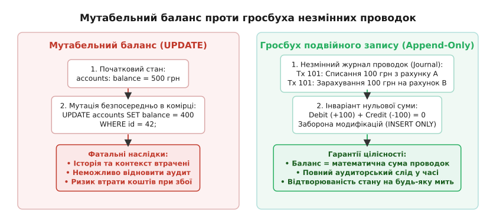
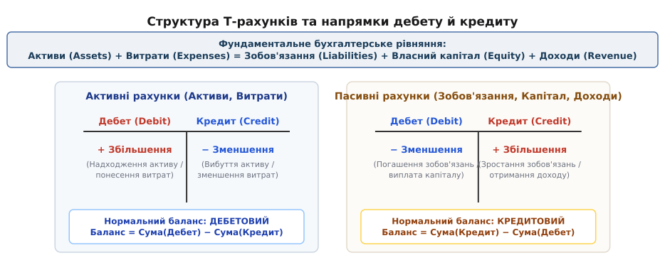
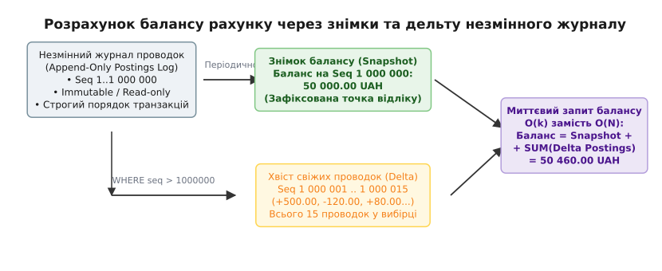

# Гросбух подвійного запису (Double-Entry Ledger) у фінансових системах

<preknowlist>
- [Транзакції та ACID](root:sf-data/transactions-acid) — неподільність операцій, збереження цілісності та журнал попереднього запису (WAL).
- [Рівні ізоляції та аномалії](root:sf-data/isolation-levels) — захист від брудного читання, втрачених оновлень та аномалій паралельного доступу.
- [Цілі типи в C/C++](root:sf-lang/integer-types-c) — фіксована точність і ризики переповнення при роботі з цілочисельними сумами.
</preknowlist>

Коли покупець в інтернет-магазині купує товар за 500 гривень, інженер-початківець часто реалізує переказ коштів єдиним SQL-запитом: `UPDATE accounts SET balance = balance - 500 WHERE user_id = 42`. Через секунду платіжний шлюз надсилає повторний вебхук через тимчасовий таймаут мережі, фоновий обробник кешбеку паралельно виконує `UPDATE accounts SET balance = balance + 25`, а клієнт одночасно вимагає повернення коштів через службу підтримки. Якщо в цей момент на сервері стається збій або гонка потоків, залишок на балансі змінюється на довільне непередбачуване число, наприклад 425 гривень замість 525 гривень. Коли наприкінці місяця фінансовий аудитор запитує, куди саме зникли кошти і яка операція сформувала поточну суму, база даних не може дати жодної відповіді: попередній стан комірки `balance` безповоротно затерто, а контекст операцій втрачено назавжди.

Ця фундаментальна вада мутабельного зберігання стану призводить до банкрутства платіжних систем та втрати довіри користувачів. Єдиним інженерним і математичним захистом від таких катастроф є перехід від мутації окремих числових значень до гросбуха подвійного запису — незмінного розподіленого журналу господарських операцій, де баланс ніколи не перезаписується, а виводиться як результат суворого ланцюжка збалансованих проводок.

## Пастка мутабельного балансу

Традиційний підхід до проектування баз даних зазвичай орієнтований на стан об'єкта (*State-based Persistence*). У реляційній таблиці створюється рядок користувача, і кожна нова дія змінює значення атрибутів цього рядка. Для профілю користувача або налаштувань інтерфейсу такий підхід цілком виправданий. Проте для обліку вартості та грошей пряма мутація містить три критичні загрози:

1. **Втрата походження та аудиторського сліду (*Provenance Loss*)**:
   Якщо комірка містить число `42000`, жоден запит до бази даних не зможе довести, чи є це число результатом чесної серії покупок і поповнень, чи наслідком програмної помилки, помилки округлення або несанкціонованого ручного втручання адміністратора бази даних.
2. **Аномалії втрачених оновлень та блокування (*Lost Updates and Contention*)**:
   Якщо тисячі паралельних мікросервісів намагаються виконати `UPDATE balance` на гарячому рахунку (наприклад, на системному рахунку комісій компанії), база даних змушена серіалізувати ці операції через ексклюзивні блокування рядків (*Row-Level Locks*). Це створює пляшкове горло продуктивності, провокує взаємні блокування (*Deadlocks*) і затримки запитів.
3. **Неможливість відтворення стану на момент часу (*Point-in-Time Reconstruction*)**:
   Неможливо дізнатися, яким був точний баланс рахунку минулого вівторка о 14:35:10, щоб сформувати податковий звіт або перевірити правомірність списання коштів до настання певної зовнішньої події.


*Порівняння мутабельного оновлення залишку з журналом незмінних проводок подвійного запису.*

У фінансовій інженерії грошовий баланс є не первинним атрибутом, а **математичним інтегралом за часом** від усіх подій, що відбулися з рахунком.

## Етимологія та сутність подвійного запису

Слово «гросбух» походить від німецького *Großbuch* (утвореного з *groß* — «великий» та *Buch* — «книга»), що історично означало головну бухгалтерську книгу підприємства, куди зводилися всі підсумкові фінансові записи. В англомовній термінології використовується термін *ledger* (від середньоанглійського *leggen* — «класти, закладати непорушно»), тобто книга обліку, яка постійно лежала на одному місці на столі купця для фіксації фактів без права вилучення сторінок.

Ключовими поняттями обліку є терміни «дебет» та «кредит»:
- **Дебет (*Debit*)** походить від латинського *debet* (форма дієслова *debere* — «він винен, мати борг»).
- **Кредит (*Credit*)** походить від латинського *credit* (форма дієслова *credere* — «він вірить, довіряє, позичає»).

Подвійний запис спирається на непорушний закон збереження вартості: **жодна грошова одиниця не може з'явитися з нізвідки і не може зникнути в нікуди**. Будь-яка господарська операція є переміщенням економічної цінності між двома або більше рахунками.

Кожна фінансова транзакція розкладається щонайменше на дві складові — **проводки (*Postings* або *Legs*)**. Сума всіх дебетових проводок у транзакції повинна строго дорівнювати сумі всіх кредитових проводок. Якщо виразити списання та зарахування через підписані числа, головний інваріант транзакції формулюється як рівність нулю суми всіх її складових:

```
∑ Δaᵢ = 0
```

Детально про те, як середньовічні купці Генуї та Венеції розробили цю систему і як праця францисканського ченця Луки Пачолі 1494 року стала основою світового бізнесу, описано в [історії подвійного запису](root:sf-data/double-entry-ledger/hist-double-entry.md).

## П'ять класів рахунків та структура балансу

Щоб система відображала не лише сухий рух готівки, а й цілісний економічний стан компанії, усі облікові рахунки поділяються на п'ять фундаментальних категорій:

1. **Активи (*Assets*)**:
   Усе, чим володіє організація і що має економічну цінність (кошти на банківських рахунках, готівка в касі, придбане серверне обладнання, дебіторська заборгованість клієнтів).
2. **Витрати (*Expenses*)**:
   Економічні затрати та ресурси, спожиті під час поточної операційної діяльності (оплата хмарної інфраструктури, заробітна плата, банківські комісії за еквайринг, оренда офісу).
3. **Зобов'язання (*Liabilities*)**:
   Фінансові борги організації перед зовнішніми сторонами (залишки коштів користувачів на віртуальних гаманцях, кредиторська заборгованість перед постачальниками, невиплачені податки).
4. **Власний капітал (*Equity*)**:
   Чиста вартість бізнесу, що належить його засновникам або акціонерам (статутний капітал, додатковий капітал, нерозподілений прибуток минулих років).
5. **Доходи (*Revenue*)**:
   Надходження від основної діяльності підприємства (комісії за обробку платежів, продаж передплат, надання ліцензій на програмне забезпечення).


*Розподіл дебетових і кредитових операцій між активними та пасивними рахунками.*

### Фундаментальне бухгалтерське рівняння

Зв'язок між п'ятьма класами рахунків описується розширеним балансовим рівнянням:

```
Активи + Витрати = Зобов'язання + Власний капітал + Доходи
```

Це рівняння ділить систему на дві протилежні сторони:
- **Активна сторона (ліва)**: Активи та Витрати. Для цих рахунків нормальним є **дебетовий баланс**. Дебетова проводка збільшує їхній залишок, а кредитова — зменшує.
- **Пасивна сторона (права)**: Зобов'язання, Власний капітал та Доходи. Для цих рахунків нормальним є **кредитовий баланс**. Кредитова проводка збільшує їхній залишок, а дебетова — зменшує.

> 💡 **Чому банк надсилає SMS про «кредитування» вашої картки, коли на неї надходять гроші?**
> З вашої особистої точки зору гроші на картці є вашим активом. Проте банк веде облік зі своєї позиції. Для банку ваші гроші на депозиті чи картці — це його **зобов'язання (*Liability*)** перед вами (банк винен вам ці гроші). Тому коли ви кладете готівку в банкомат, банк збільшує своє зобов'язання перед вами, роблячи запис у **Кредит** вашого клієнтського рахунку.

Математичне обґрунтування збереження інваріантів у багатовимірному просторі рахунків та теорема консервативності грошових потоків виведені у [математичних інваріантах бухгалтерського обліку](root:sf-data/double-entry-ledger/math-ledger-invariants.md).

## Практичні сценарії проводок у реальних бізнес-моделях

Щоб побачити, як подвійний запис моделює складні бізнес-події, розглянемо три типові сценарії роботи платіжного маркетплейсу.

### Сценарій 1: Поповнення балансу користувачем

Клієнт переказує 1000 гривень зі своєї банківської картки на внутрішній рахунок у додатку. Банківський еквайр бере комісію 15 гривень (1.5%), тому на розрахунковий рахунок компанії надходить 985 гривень. Проводка виглядає так:

```
Дебет:  Активи: Банківський рахунок компанії (UAH)      +985.00 грн
Дебет:  Витрати: Комісії еквайрингу банку              +15.00 грн
Кредит: Зобов'язання: Баланс користувача #42           -1000.00 грн
-------------------------------------------------------------------
Сума:   (+985) + (+15) + (-1000) = 0 грн
```

Усі три складові зафіксовані в одній транзакції. Компанія точно знає, скільки грошей фізично надійшло в банк, яку суму втрачено на банківській комісії і скільки коштів вона зобов'язана виплатити або надати у вигляді послуг клієнту.

### Сценарій 2: Купівля товару на маркетплейсі з комісією платформи

Клієнт купує в продавця цифровий курс за 1000 гривень. Комісія платформи становить 10% (100 грн), а чистий дохід продавця — 900 гривень.

```
Дебет:  Зобов'язання: Баланс користувача #42           +1000.00 грн
Кредит: Зобов'язання: Баланс продавця #88              -900.00 грн
Кредит: Доходи: Комісійні доходи платформи             -100.00 грн
-------------------------------------------------------------------
Сума:   (+1000) + (-900) + (-100) = 0 грн
```

Зобов'язання перед покупцем зменшилися на 1000 грн (дебет пасивного рахунку), зобов'язання перед продавцем збільшилися на 900 грн (кредит пасивного рахунку), а маркетплейс зафіксував 100 грн власного доходу (кредит рахунку доходів).

### Сценарій 3: Виведення коштів торговцем на банківський рахунок

Продавець виводить свій заробіток у розмірі 900 гривень на особистий банківський рахунок. Банк утримує фіксовану комісію за міжбанківський платіж 5 гривень.

```
Дебет:  Зобов'язання: Баланс продавця #88              +900.00 грн
Кредит: Активи: Банківський рахунок компанії (UAH)      -895.00 грн
Кредит: Витрати: Комісії за виплати банків              -5.00 грн
-------------------------------------------------------------------
Сума:   (+900) + (-895) + (-5) = 0 грн
```

Зобов'язання платформи перед продавцем повністю погашено, реальний банківський залишок компанії зменшився на фактично виплачену суму, а супутні витрати списані на відповідну статтю.

## Двофазні транзакції: блокування коштів (Hold) та списання (Capture)

У багатьох фінансових процесах платіж не відбувається миттєво. Наприклад, під час виклику таксі або бронювання готелю кошти спершу блокуються на рахунку клієнта (*Authorization / Hold*), а остаточне списання (*Capture / Settlement*) здійснюється лише після завершення поїздки або проживання. Якщо поїздку скасовано, кошти розблоковуються (*Void / Release*).

У гросбусі подвійного запису такий процес моделюється не зміною статусного прапорця, а рухом між спеціальними субрахунками доступного та заблокованого залишку:

1. **Фаза 1: Блокування коштів (Hold 300 грн)**:
   ```
   Дебет:  Зобов'язання: Користувач #42 (Доступний залишок)    +300.00 грн
   Кредит: Зобов'язання: Користувач #42 (Заблоковано під поїздку) -300.00 грн
   ```
   Загальний баланс зобов'язань перед користувачем не змінився (300 - 300 = 0), проте доступні для нових витрат кошти зменшилися на 300 грн.

2. **Фаза 2А: Успішне списання (Capture 250 грн і розблокування залишку 50 грн)**:
   ```
   Дебет:  Зобов'язання: Користувач #42 (Заблоковано)          +300.00 грн
   Кредит: Зобов'язання: Водій #12 (Баланс виплати)            -225.00 грн
   Кредит: Доходи: Комісія сервісу таксі                       -25.00 грн
   Кредит: Зобов'язання: Користувач #42 (Доступний залишок)    -50.00 грн
   ```
   Усі заблоковані кошти повністю списані з рахунку холду: 225 грн нараховано водію, 25 грн зараховано як дохід платформи, а 50 грн повернуто на доступний баланс пасажира.

3. **Фаза 2Б: Скасування замовлення (Void Hold 300 грн)**:
   ```
   Дебет:  Зобов'язання: Користувач #42 (Заблоковано)          +300.00 грн
   Кредит: Зобов'язання: Користувач #42 (Доступний залишок)    -300.00 грн
   ```
   Усі заблоковані кошти повертаються на доступний баланс користувача без жодних змін у фінансових результатах компанії.

## Мультивалютні операції та рахунки курсового клірингу

Коли фінансова платформа підтримує роботу з декількома валютами (наприклад, гривня, долар США та євро), виникає архітектурна проблема: складання сум у різних валютах не має сенсу і порушує інваріант нульової суми.

Для збереження математичної строгості гросбух дотримується правила: **кожна проводка здійснюється строго в одній валюті, а інваріант нульової суми виконується окремо для кожного валютного підпростору**.

Конвертація валюти (наприклад, купівля 100 USD за 4150 UAH) реалізується через введення спеціального системного транзитного рахунку — **рахунку курсового клірингу (*FX Clearing Account*)**. Транзакція складається з двох ізольованих моновалютних плечей:

```
Плече 1 (Валюта UAH):
  Дебет:  Зобов'язання: Клієнт (Рахунок UAH)                  +4150.00 грн
  Кредит: Активи: Рахунок клірингу валютообміну (UAH)         -4150.00 грн
  Сума в UAH: (+4150) + (-4150) = 0 грн

Плече 2 (Валюта USD):
  Дебет:  Активи: Рахунок клірингу валютообміну (USD)         +100.00 USD
  Кредит: Зобов'язання: Клієнт (Рахунок USD)                  -100.00 USD
  Сума в USD: (+100) + (-100) = 0 USD
```

Завдяки цьому інваріант нульової суми дотримується в кожній окремій валюті, а курсовий прибуток або збиток платформи автоматично накопичується на рахунках курсового клірингу і періодично списується на рахунок доходів чи витрат.

## Незмінність (Immutability) та обробка помилок

Фундаментальне правило промислового гросбуха полягає в тому, що журнал проводок є структурою **виключно для додавання (*Append-Only Log*)**.

Команди `UPDATE` та `DELETE` для таблиці проводок забороняються на рівні схеми бази даних (через відсутність прав у користувача сервісу та спеціальні запобіжні тригери). Якщо фінансова транзакція була зафіксована в базі даних, вона стає постійною частиною історії і не підлягає видаленню чи виправленню заднім числом.

### Механізм сторнування (Storno / Reversal)

Якщо оператор помилився і замість 100 гривень провів списання 1000 гривень, система не має права видалити цей запис. Помилка виправляється створенням нової, компенсуючої транзакції — **сторнування (*Reversal Transaction*)**.

Сторнувальна транзакція містить дзеркальні проводки, які повністю повторюють оригінальну транзакцію, але мають інвертовані суми або поміняні місцями рахунки Дебету та Кредиту:

```
Початкова помилкова транзакція #101:
  Дебет:  Рахунок користувача   -1000.00 грн
  Кредит: Рахунок торговця      +1000.00 грн

Сторнувальна транзакція #102 (Reversal of #101):
  Дебет:  Рахунок торговця      -1000.00 грн
  Кредит: Рахунок користувача   +1000.00 грн

Коригувальна правильна транзакція #103:
  Дебет:  Рахунок користувача   -100.00 грн
  Кредит: Рахунок торговця      +100.00 грн
```

Завдяки цьому підходу будь-який сторонній аудитор або контролер може повністю відновити кожен крок: факт помилки, момент її виявлення, особу, яка ініціювала виправлення, та результуючий фінансовий стан. Це напряму перегукується з архітектурним патерном подійного сорсингу (*Event Sourcing*), де стан системи є послідовністю фактів минулого, які неможливо змінити.

## Грошова арифметика: небезпека чисел із плаваючою комою

Найпоширенішою інженерною помилкою при роботі з фінансовими даними є використання типів `float` або `double` (стандарт IEEE 754).

Стандарт IEEE 754 представляє дробові числа у двійковій системі числення через мантису та порядок. Оскільки число `0.1` у двійковій системі є нескінченним періодичним дробом ($0.0001100110011..._2$), воно не може бути представлене у двійковій пам'яті комп'ютера абсолютно точно.

```
0.1 + 0.2 = 0.300000000000000044408920985006...
```

Якщо система виконує мільйони мікротранзакцій на день, двійкові похибки округлення накопичуються. Наприкінці дня сума дебетів і кредитів перестає сходитися на соті частки цента («penny rounding discrepancy»). Це порушує інваріант нульової суми і призводить до блокування операцій.

Детально апаратні обмеження та механізми виникнення двійкових похибок розглянуто в темах про [плаваючу кому](root:hw-arch/floating-point) та [цілі типи в C/C++](root:sf-lang/integer-types-c).

### Правило цілих мікроодиниць

У професійних фінансових рушіях грошові суми зберігаються виключно в **цілих мінімальних неподільних одиницях валюти**:
- Гривні — у копійках (ціле число `100` представляє `1.00 грн`).
- Долари США — у центах (`100` = `$1.00`).
- Криптовалюта Bitcoin — у сатоші (`100 000 000` сатоші = `1 BTC`).
- Дробові комісії або процентні ставки — у десятитисячних частках (бейсіс-поінтах, *Basis Points, bps*) або мікроодиницях (мікродоларах, $10^{-6}$).

У реляційних базах даних для цього застосовують 64-бітний цілий тип `BIGINT` або тип із фіксованою комою `NUMERIC(precision, scale)` (наприклад, `NUMERIC(20, 4)`).

## Ідемпотентність і мережеві збої

У розподілених системах мережа є ненадійною за своєю природою. Коли мобільний додаток клієнта надсилає команду на переказ коштів, можлива ситуація, коли сервер успішно зафіксував транзакцію в базі даних, але HTTP-відповідь `200 OK` втратилася через обрив Wi-Fi чи стільникового зв'язку.

Клієнтський додаток бачить помилку тайм-ауту мережі та автоматично повторює той самий HTTP-запит. Без спеціального захисту сервер сприйме цей запит як новий переказ і спише гроші вдруге.

Для запобігання подвійним списанням використовується **ключ ідемпотентності (*Idempotency Key*)** — унікальний ідентифікатор (зазвичай UUID версії 4), який генерується на стороні клієнта перед першою відправкою запиту.

```sql
CREATE TABLE transactions (
    id              BIGSERIAL PRIMARY KEY,
    idempotency_key VARCHAR(128) NOT NULL UNIQUE,
    description     TEXT NOT NULL,
    posted_at       TIMESTAMPTZ NOT NULL DEFAULT NOW()
);
```

Коли сервер отримує запит:
1. Він відкриває транзакцію в СУБД на рівні ізоляції `READ COMMITTED` або вище.
2. Виконує перевірку наявності `idempotency_key` в таблиці `transactions`.
3. Якщо такий ключ уже існує, сервер не виконує проводки вдруге, а повертає збережений результат попередньої успішної обробки.
4. Якщо ключ новий, сервер записує заголовок транзакції, вставляє збалансовані проводки в таблицю `postings` та фіксує зміни через `COMMIT`.

Детальна DDL-схема таблиць бази даних із тригерами захисту цілісності та специфікація REST API наведені у [реляційній схемі та контракті API гросбуха](root:sf-data/double-entry-ledger/api-ledger-schema.md).

## Продуктивність: знімки (Snapshots) та матеріалізація

У системі, де баланс є сумою всіх історичних проводок, запит поточного залишку виглядає так:

```sql
SELECT SUM(amount) FROM postings WHERE account_id = 42;
```

Якщо рахунок існує три роки і через нього пройшло 500 000 транзакцій, виконання цього запиту вимагає повного індексного сканування 500 000 рядків. Складність обчислення становить `O(N)` від кількості всіх операцій за історію рахунку. При навантаженні в тисячі запитів на секунду це призведе до перевантаження процесора та дискової підсистеми сервера СУБД.

### Патерн Snapshot + Delta

Для досягнення константної складності `O(1)` при читанні балансу застосовується архітектурний патерн **періодичних матеріалізованих знімків (*Balance Snapshots*)**.


*Прискорення вибірки поточного залишку через поєднання базового знімка та дельти проводок.*

Механізм працює таким чином:
1. Кожна проводка в журналі отримує строго монотонний порядковий номер черги (`sequence_num`).
2. Фоновий процес або тригер періодично (наприклад, кожні 1000 проводок або раз на добу) обчислює точний баланс рахунку та записує його в таблицю `balance_snapshots`:
   ```sql
   INSERT INTO balance_snapshots (account_id, sequence_num, balance)
   VALUES (42, 1000000, 5000000);
   ```
3. Коли додатку потрібно дізнатися поточний баланс, він виконує швидкий запит: бере останній збережений знімок і додає до нього суму лише тих проводок, які з'явилися після номера `sequence_num` цього знімка:
   ```sql
   WITH latest_snapshot AS (
       SELECT sequence_num, balance
       FROM balance_snapshots
       WHERE account_id = 42
       ORDER BY sequence_num DESC
       LIMIT 1
   )
   SELECT 
       COALESCE(s.balance, 0) + COALESCE(SUM(p.amount), 0) AS current_balance
   FROM latest_snapshot s
   LEFT JOIN postings p ON p.account_id = 42 AND p.sequence_num > s.sequence_num;
   ```

Складність запиту скорочується з `O(N)` до `O(k)`, де `k` — невелика кількість свіжих проводок (зазвичай менше 100 рядків), що забезпечує мілісекундний час відповіді незалежно від віку облікового запису.

### Шардування гарячих рахунків

У великих платіжних системах існують агреговані рахунки компанії, через які проходять майже всі транзакції (наприклад, рахунок нарахування комісій за еквайринг). Якщо кожна транзакція вставляє рядок у журнал і намагається оновити єдиний матеріалізований рядок агрегатора, виникає жорстка конкуренція за блокування.

Для вирішення цієї проблеми застосовують **шардування рахунків (*Account Sharding*)**: один логічний рахунок доходів розбивається на `M` незалежних фізичних рахунків (`FEE_REVENUE_0`, `FEE_REVENUE_1`, ..., `FEE_REVENUE_M-1`). При проведенні платежу система випадковим чином обирає один із шардових рахунків для зарахування комісії. Навантаження запису розподіляється між різними рядками та сторінками бази даних, а загальний дохід компанії обчислюється як сума залишків на всіх шардах.

## Автоматична звірка із зовнішнім світом (Reconciliation)

Жодна фінансова система не існує у вакуумі. Навіть якщо внутрішній гросбух володіє абсолютною математичною консистентністю, кошти фізично рухаються через зовнішні банківські мережі, карткові платіжні системи (Visa, Mastercard, Простір) та платіжні шлюзи (Stripe, Adyen).

Зовнішні системи мають власні графіки клірингу, стягують непередбачені комісії за чарджбеки (*Chargebacks*) або затримують розрахунки через вихідні дні.

Для синхронізації внутрішнього стану із зовнішнім запроваджується обов'язковий фоновий процес — **звірка (*Reconciliation*)**:
1. **Імпорт виписки (*Bank Statement Ingestion*)**: сервіс щодня завантажує офіційний реєстр операцій від банку або платіжного провайдера (файли у форматах CAMT.053, MT940 або CSV).
2. **Матчинг (*Transaction Matching*)**: кожна зовнішня транзакція зіставляється з відповідною внутрішньою проводкою гросбуха за унікальним референсом шлюзу, сумою та часовим вікном.
3. **Виявлення та врегулювання розбіжностей (*Discrepancy Handling*)**: якщо виявлено операцію, якої немає у внутрішньому гросбусі (наприклад, банківське списання за обслуговування рахунку або штраф за оскарження платежу), система автоматично генерує коригувальну проводку або створює інцидент для фінансового контролера.

Повна програмна реалізація рушія гросбуха на мовах C та C++ з підтримкою інваріантів нульової суми, знімків та ідемпотентності представлена в [проекті міні-гросбуха](root:sf-data/double-entry-ledger/proj-mini-ledger.md).

> 🔧 **Навіщо це в реальній розробці**
> Будь-який програмний продукт, що оперує реальними грошима користувачів, бонусними балами, внутрішньоігровою валютою, складськими залишками або білінгом хмарних ресурсів, рано чи пізно стикається з розбіжностями залишків за умови використання звичайних мутабельних таблиць. Впровадження гросбуха подвійного запису на ранніх етапах проектування гарантує непорушну математичну цілісність, спрощує проходження фінансового аудиту за стандартами SOC 2 та PCI-DSS і захищає бізнес від втрати коштів через гонки потоків та мережеві збої.

Гросбух подвійного запису перетворює управління фінансовим станом із ризикованого маніпулювання комірками пам'яті на строгу, замкнену математичну систему. Поєднуючи незмінний журнал проводок, ідемпотентність та механізм знімків, сучасні інженерні системи досягають як абсолютної аудиторської прозорості, так і високої продуктивності обробки транзакцій.
