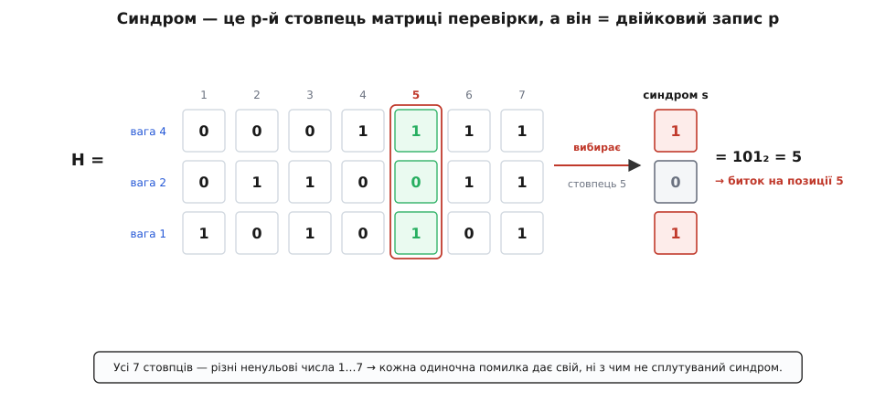
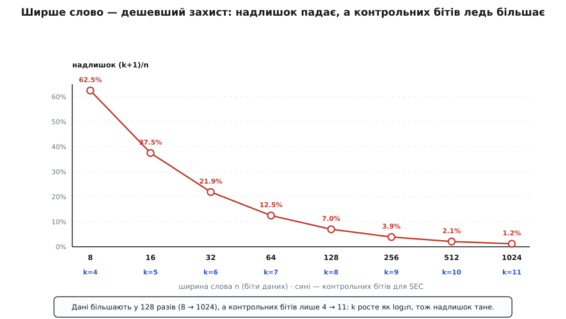

# 🧮 Синдром і розмір коду: доведення та рахунок

<preknowlist>
- [Біт парності](topic:com-modulation/parity-bit) — контрольний біт як XOR (сума за модулем 2) групи бітів; ключове тут — що XOR **лінійний**: XOR об'єднання двох наборів дорівнює XOR одного ⊕ XOR другого.
- [Позиційні системи](topic:math-number-theory/positional-systems) — кожне ціле число має **єдиний** запис у двійці, а його розряди мають ваги 1, 2, 4, 8, … Синдром ми читатимемо саме як таке число.
- [Відстань Геммінга](topic:com-modulation/hamming-distance) — відстань між словами й правило «код із мінімальною відстанню d виправляє ⌊(d−1)/2⌋ помилок». Геометрію відстані беремо звідти готовою; тут — сам рахунок розміру й доведення, що декодер не бреше.
</preknowlist>

Про самозцілювальне слово звичайно розповідають дві речі, які приймають на віру: що синдром «магічно» показує на битий біт і що контрольних бітів треба «десь сім на шістдесят чотири». Обидві не магія і не приблизно — обидві доводяться на пальцях, самою лічбою, без жодної геометрії. Ця вставка робить рівно два доведення. Перше: чому число, складене зі зламаних контролів, **тотожне** номеру перекинутої позиції — не схоже на нього, не корелює з ним, а дорівнює йому точно. Друге: скільки контрольних бітів **мусить** бути, звідки береться нерівність 2ᵏ ≥ n + k + 1 і чому частка надлишку тане, коли слово ширшає. Усе, що знадобиться, — одна властивість XOR і одне спостереження про двійкові числа.

## Домовимося про позначення

Хай слово має **m = n + k** позицій: n бітів даних і k контрольних. Пронумеруймо позиції **з одиниці**: 1, 2, 3, …, m (нуль зайнятий іншим — побачимо, чим). Контрольні біти стоять на позиціях-степенях двійки — 1, 2, 4, …, 2ᵏ⁻¹, — а дані заповнюють усі інші позиції. Кожній позиції з номером i відповідає її двійковий запис; позначимо **bⱼ(i)** j-й розряд цього запису (0 або 1). Тоді контроль номер j стежить за **групою**

```
Gⱼ = { i : bⱼ(i) = 1 }   — усі позиції, у номері яких стоїть розряд j
```

Скажімо, G₀ (контроль ваги 1) — це позиції з одиницею в молодшому розряді: 1, 3, 5, 7, … G₁ (вага 2) — позиції 2, 3, 6, 7, … І так далі. Уся конструкція тримається на одному рівнянні, яке ми накладаємо при записі: у кожній групі має бути **парна** кількість одиниць, тобто їхній XOR — нуль.

```
для кожного j:   ⊕(усі біти на позиціях із Gⱼ) = 0
```

Контрольний біт для того й існує, щоб це рівняння справджувалося: його доставляють таким, щоб догнати парність групи до нуля.

## Чому контрольні біти саме на степенях двійки

Перш ніж доводити головне, варто зрозуміти, чому позиції під контроль обрано так дивно — степені двійки, а не, скажімо, перші k позицій поспіль. Причина суто механічна й гарна. Число 2ʲ у двійці — це одна-єдина одиниця в розряді j і нулі всюди інде. Отже позиція 2ʲ належить **рівно одній** групі — своїй, Gⱼ, — і не потрапляє в жодну чужу. А це означає, що при записі кожне з k рівнянь парності містить **свій** контрольний біт і жодного іншого. Рівняння не переплітаються: кожен контрольний біт визначається незалежно, простим XOR-ом даних своєї групи —

```
cⱼ = ⊕(біти ДАНИХ на позиціях із Gⱼ)
```

— і жодної системи розв'язувати не треба. Поклади контрольні біти абикуди — і рівняння зчепилися б у систему, де кожен невідомий сидить у кількох рядках; довелося б розв'язувати її щоразу. Степені двійки роблять матрицю задачі трикутною до тривіальності: кожен контроль латає рівно одну діру. Це перша дивіденда від того, що номери позицій самі є двійковими числами, — і не остання.

## Частина 1: синдром = номер битка (доведення)

Тепер головне. Уся сила доведення — в одному факті про XOR, і його варто вимовити окремо, бо на ньому все й тримається. **Парність лінійна.** Парність набору бітів — це їхній XOR, а XOR — додавання за модулем 2; сума ж розкладається на доданки. Тому парність двох накладених наборів дорівнює XOR їхніх окремих парностей:

```
парність(a ⊕ b) = парність(a) ⊕ парність(b)
```

Ось чому це вирішує все. Прочитане слово — це записане кодове слово c, на яке лягла помилка e: один перекинутий біт означає вектор e з єдиною одиницею на позиції p, нулями скрізь інде, і читач бачить **r = c ⊕ e**. Коли декодер перераховує парність групи Gⱼ над прочитаним r, лінійність розчіплює її на дві частини — внесок кодового слова й внесок помилки:

```
sⱼ = парність r на Gⱼ
   = (парність c на Gⱼ)  ⊕  (парність e на Gⱼ)
```

Перший доданок — нуль **за побудовою**: кодове слово ми для того й склали, щоб парність кожної групи була нульова. Лишається чистий внесок помилки. А він до смішного простий: e має одну-єдину одиницю, на позиції p, тож XOR e по групі Gⱼ дорівнює одиниці, якщо p потрапляє в цю групу, і нулю, якщо ні. Але «p потрапляє в Gⱼ» — це за означенням саме те, що bⱼ(p) = 1. Тобто

```
sⱼ = парність e на Gⱼ = bⱼ(p)
```

Кожен розряд синдрому дорівнює відповідному розрядові двійкового номера p. Складімо їх назад у число за вагами розрядів — і дістанемо:

```
s = Σⱼ sⱼ·2ʲ = Σⱼ bⱼ(p)·2ʲ = p
```

Оце й усе доведення. Синдром не «вказує» на биток і не «корелює» з ним — він **дорівнює** його номеру, розряд у розряд, бо кожен зламаний контроль засвітив рівно один двійковий розряд числа p. Синдром просто вимовляє p по цифрах. Причина не в удачі й не в хитрому кодуванні даних (дані взагалі не брали участі — вони випали з рівняння разом з усім кодовим словом), а в тому, що позиції навмисне занумеровано так, щоб «сигнатура» позиції — набір контролів, які вона ламає, — збігалася з двійковим записом її номера. Різні позиції мають різні номери, різні номери мають різні двійкові записи, тож і сигнатури різні: жодні два битки не сплутати.

І тут же видно, чим зайнятий нуль. Синдром 0 означав би биток на «позиції 0», якої немає, — саме тому нумерацію ведуть з одиниці, а не з нуля. Нульовий синдром зарезервовано під єдине повідомлення «жоден контроль не зламано» — слово ціле. Якби позиції рахували з нуля, найлегша й найважливіша відповідь декодера злилася б із реальним битком, і код втратив би здатність сказати «усе гаразд».

### Той самий доказ мовою матриці

Той, хто вже бачив [лінійні блокові коди](topic:com-modulation/generator-and-parity-check-matrices), упізнає тут знайому машинерію, і вона варта того, щоб її назвати, бо саме вона показує межу прийому. Складімо всі k рівнянь парності у **матрицю перевірки** H: рядок — це один контроль, стовпець — одна позиція, а на перетині стоїть 1, якщо позиція входить у групу цього контролю. За нашою нумерацією стовпець номер i виходить не абищо, а **двійковий запис числа i**. Синдром тоді — просто добуток матриці на прочитаний вектор за модулем 2, і завдяки лінійності кодове слово знову зникає, лишаючи

```
s = H·e   (за модулем 2)
```

Помилка e з єдиною одиницею на позиції p **вибирає** з H рівно p-й стовпець — а той стовпець і є двійковий запис p. Те саме твердження, інша оптика.


*Синдром як вибраний стовпець. Кожен стовпець матриці перевірки — двійковий запис номера своєї позиції (згори вниз — ваги 4, 2, 1). Одиночна помилка на позиції 5 множить матрицю на вектор з одиницею лише в 5-му рядку, і добуток витягає рівно 5-й стовпець — число 101 = 5. Оскільки всі стовпці різні й жоден не нульовий, кожна одиночна помилка дає свій, ні з чим не сплутуваний синдром — саме це й означає «код виправляє одну помилку».*

Матрична форма дарує загальний критерій, ширший за наш конкретний код: **код виправляє будь-яку одиночну помилку тоді й лише тоді, коли всі стовпці H ненульові й попарно різні.** Ненульові — щоб биток узагалі дав ненульовий синдром (інакше помилка була б невидима); різні — щоб два різні битки не дали однакового синдрому (інакше їх не розрізнити). Конструкція Геммінга бере найдешевший спосіб виконати обидві умови одразу: пронумерувати стовпці числами 1, 2, 3, …, m — вони автоматично всі різні й усі ненульові. Ось звідки й береться питання розміру: скільки взагалі є різних ненульових k-розрядних стовпців?

## Частина 2: скільки контрольних бітів

Питання «скільки треба контрольних бітів» перетворюється на чисту лічбу, щойно згадати, що синдром — це k-бітове число. Різних значень у нього рівно **2ᵏ**. І кожне значення мусить називати окрему ситуацію, яку декодер зобов'язаний розрізнити. Ситуацій же рівно стільки:

```
«слово ціле»                        — 1 ситуація  (синдром 0)
«биток на позиції i», i = 1 … m     — m ситуацій   (по одному ненульовому синдрому)
```

Щоб кожній ситуації дісталося власне значення синдрому, значень має бути не менше, ніж ситуацій:

```
2ᵏ ≥ m + 1 = (n + k) + 1 = n + k + 1
```

Оце й уся нерівність — знаменита межа на розмір коду. Її можна вивести й геометрично, як [межу упаковки куль](topic:com-modulation/perfect-codes/math-sphere-packing-bound.md): кулі радіуса 1 навколо кодових слів не повинні налазити одна на одну й мусять уміститися в простір з 2ᵐ слів, звідки 2ⁿ·(1 + m) ≤ 2ᵐ — та сама нерівність після скорочення на 2ⁿ. Дві дороги — лічба синдромів і пакування куль — сходяться в одну точку, бо це одне й те саме твердження, вимовлене двічі: синдром саме й нумерує кулю, у якій опинилося прочитане слово.

Порахуймо для типового слова. Дані — n = 64 біти:

```
треба:  2ᵏ ≥ 64 + k + 1 = 65 + k
k = 6:  2⁶ = 64,   а треба ≥ 71   →  замало
k = 7:  2⁷ = 128,  а треба ≥ 72   →  вистачає з запасом
```

Отже для виправлення однієї помилки над 64 бітами даних потрібно **k = 7** контрольних бітів. Додатковий біт загальної парності, що піднімає код до «виправити один, виявити два», доводить це число до **8** — звідси й знайомі 72 біти на шині проти 64 корисних. Той запас у сьомому рядку (128 значень синдрому, а зайнято лише 72) не марнується даремно: він означає, що код **укорочено**. Сім бітів можуть іменувати аж 127 позицій, а ми беремо тільки 71; повний код Геммінга на 127 позицій (з них 120 даних) використав би синдром без залишку. Такий код, де рівність 2ᵏ = n + k + 1 виконується точно й жодне значення синдрому не пропадає, називають [досконалим](topic:com-modulation/perfect-codes) — кулі виправлення заповнюють простір без шпарин. Коди Геммінга досконалі рівно тоді, коли m = 2ᵏ − 1; на 64 бітах ми свідомо беремо укорочений варіант, бо слова кратні степеням двійки зручніші за 120.

Порахувавши так для кількох ширин, дістаємо всю картину надлишку:

```
n (даних)   k для SEC   k+1 (SECDED)   надлишок (k+1)/n
    8           4            5              62.5 %
   16           5            6              37.5 %
   32           6            7              21.9 %
   64           7            8              12.5 %
  128           8            9               7.0 %
  256           9           10               3.9 %
  512          10           11               2.1 %
 1024          11           12               1.2 %
```

Кожне подвоєння даних додає рівно **один** контрольний біт — і саме ця закономірність варта окремого пояснення.


*Ціна захисту з ростом слова. По горизонталі — ширина слова, що подвоюється; по вертикалі — частка надлишку (k+1)/n для SECDED. Крива падає стрімко, тоді майже лягає на нуль: із 62.5 % на восьми бітах надлишок сходить до 12.5 % на шістдесяти чотирьох і до 1.2 % на тисячі. Причина — під кожною точкою: контрольних бітів k росте лише 4 → 11, поки даних більшає у 128 разів. Жменька бітів іменує експоненційно багато позицій, тож на широкому слові захист майже безплатний.*

## Частина 3: чому надлишок падає логарифмічно

Придивімося до нерівності 2ᵏ ≥ n + k + 1 ще раз, тепер уже не щоб її розв'язати, а щоб побачити її **форму**. Ліва частина росте експоненційно з k, права — лінійно. Тому потрібне k наздоганяє n страшенно повільно: воно приблизно дорівнює [двійковому логарифму](topic:math-information/binary-logarithm) від n.

```
2ᵏ ≳ n   ⇒   k ≳ log₂ n
```

(точніше k = ⌈log₂(n + k + 1)⌉, але поправка на сам k мала й нічого по суті не змінює). Причина за цим — та сама, що робить двійковий пошук швидким: **кожен контрольний біт подвоює число позицій, які синдром здатен назвати.** k бітів іменують 2ᵏ адрес; щоб покрити n позицій, треба лише log₂ n бітів, а не n. Тому частка надлишку

```
k / n  ≈  log₂ n / n  →  0
```

тане, коли слово ширшає: чисельник росте як логарифм, знаменник — лінійно, а логарифм програє лінійній функції на будь-якій дистанції. Подвоїли дані — знаменник подвоївся, а чисельник підріс на одиницю; відношення майже наполовину впало. Ось чому коди в пам'яті стережуть **широкі** слова, а не окремі байти: 8 контрольних бітів на 64 даних (≈12.5 %) незрівнянно вигідніші за 5 на 8 (62.5 %), хоч і той, і той код рятує від однакової одиничної помилки.

За цією арифметикою стоїть межа, глибша за будь-який конкретний код. Локалізувати один биток серед m позицій — це відповісти, котра з m+1 ситуацій сталася (жодної помилки чи биток на одній із m позицій). Відповідь на питання з N рівноможливими наслідками несе щонайменше log₂ N бітів — це сама [ентропія Шеннона](topic:math-information/shannon-entropy) рівномірного вибору, підлога, нижче якої не опуститися жодною хитрістю. Отже будь-який код, що виправляє одну помилку, мусить нести бодай ⌈log₂(m+1)⌉ контрольних бітів; Геммінг не просто вкладається в цю межу, а на досконалих довжинах **сідає на неї впритул**. Надлишок ECC — це, з точністю до заокруглення, логарифм простору пошуку, а логарифм росте повільно за самою природою.

Була б це вся правда — слова робили б якнайширшими, щоб надлишок сходив нанівець. Але на широке слово чигає розплата, і вона теж рахується. Код виправляє **одну** помилку; дві битки в тому самому слові його перемагають. А ймовірність спіймати другий биток росте з шириною квадратично: якщо кожен біт перекидається незалежно з малою ймовірністю ε за інтервал між читаннями, то

```
P(≥2 битків у m-бітовому слові) ≈ C(m,2)·ε² = m(m−1)/2 · ε² ≈ (m²/2)·ε²
```

Подвоїли слово — і ризик подвійної помилки, невиправної для SEC, вискочив **учетверо**, тоді як надлишок за це подвоєння впав лише десь наполовину. Ось де ламається спокуса нескінченно широких слів: виграш у надлишку логарифмічний, а програш у надійності квадратичний, і за якоюсь шириною другий переважує перший. Тому реальні слова пам'яті не ростуть безмежно, а зупиняються там, де надлишок уже прийнятний, а подвійні збої ще рідкісні, — на 64 (→72) бітах для оперативної пам'яті за нинішніх ε. Точку рівноваги обирають не з естетики круглого числа, а з добутку «ймовірність збою × ширина», зваженого проти квадратично зростаючого ризику пари.

## Підсумок

Обидва твердження, що зазвичай беруть на віру, виявилися однією й тією ж математикою, побаченою з двох боків. Синдром дорівнює номеру битка, бо відображення «помилка → синдром» лінійне (s = H·e за модулем 2): кодове слово випадає з рівняння, а одиночна помилка вибирає стовпець матриці, який навмисне зроблено двійковим записом своєї позиції. Контрольних бітів треба стільки, скільки розрядів у цьому стовпці, — а їх рівно log₂ від числа ситуацій, які синдром зобов'язаний розрізнити, звідки й нерівність 2ᵏ ≥ n + k + 1. І частка надлишку падає з шириною саме тому, що логарифм росте повільніше за лінію: жменька контрольних бітів іменує експоненційно багато позицій. Уся ощадність ECC — це ощадність двійкового числа, яке кількома розрядами адресує весь простір: те саме, що робить двійковий запис коротким, робить коротким і синдром.
