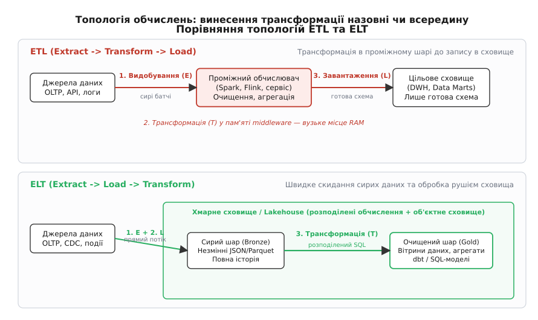
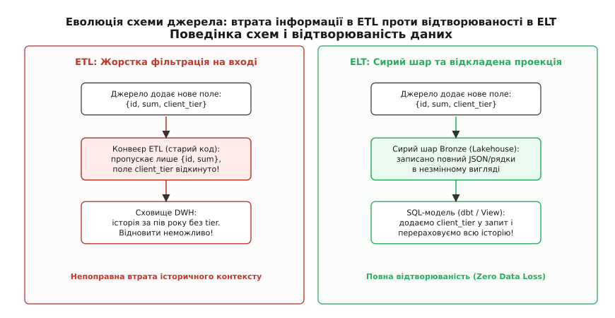
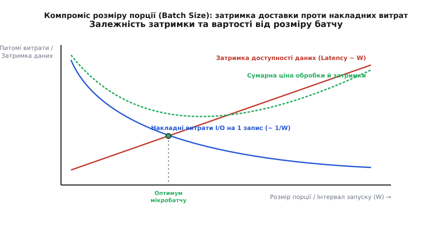
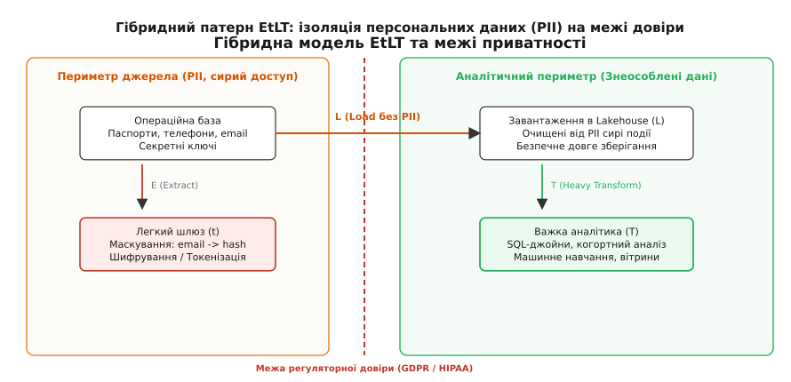

# Архітектури конвеєрів даних: ETL проти ELT

<preknowlist>
- [Реляційна модель і нормалізація](topic:sf-data/relational-model) — організація транзакційних таблиць без аномалій оновлення.
- [Стовпцеве зберігання](topic:sf-data/columnar-storage) — організація фізичного зберігання за колонками для швидкого сканування агрегатів.
- [Schema-on-write vs schema-on-read](topic:sf-data/schema-on-read-write) — фіксація структури перед збереженням проти динамічної інтерпретації під час запиту.
- [CDC (Change Data Capture)](topic:sf-data/change-data-capture) — видобування журналу змін без блокування джерельної бази.
- [Data-контракти](topic:sf-data/data-contracts) — узгоджені гарантії схеми між сервісом-продюсером і платформою даних.
- [Lineage даних](topic:sf-data/data-lineage) — відстеження походження, шляху та перетворень кожного обчисленого показника.
- [Ідемпотентний перерахунок історії](topic:sf-data/idempotent-reprocessing) — гарантія однакового результату при повторних запусках конвеєра.
</preknowlist>

Коли інтернет-магазин із мільйоном щоденних замовлень запускає складний аналітичний звіт щодо квартального виторгу безпосередньо над робочою транзакційною базою PostgreSQL, база починає сканувати десятки гігабайтів дискових сторінок таблиць `orders` та `order_items`. Запит захоплює спільні блокування рядків, витісняє гарячі сторінки з буферного пулу оперативної пам'яті та перевантажує контролер дискового накопичувача. Час обробки звичайного додавання товару в кошик підскакує з 25 мілісекунд до 14 секунд, черга з'єднань переповнюється, і покупці отримують системну помилку збою оплати.

Ця аварія показує фундаментальне фізичне протиріччя між двома типами комп'ютерного навантаження: операційним обслуговуванням окремих транзакцій (OLTP) та масштабним аналізом масивів інформації (OLAP). Щоб бізнес міг аналізувати показники без ризику зупинити операційну діяльність, дані необхідно безперервно копіювати з виробничих систем у виділене аналітичне сховище за допомогою конвеєра даних (від латинського *convehere* — звозити разом).

Головне архітектурне питання проєктування такого конвеєра полягає в тому, де саме і в який момент виконувати видозміну, очищення та агрегацію інформації: на проміжному обчислювальному вузлі перед записом у сховище (патерн **ETL**) чи безпосередньо всередині цільового аналітичного рушія після збереження сирих файлів (патерн **ELT**).

## Фізичні причини розділення: OLTP проти OLAP

Операційні бази даних спроєктовані для мінімізації затримки запису окремого рядка та забезпечення транзакційних гарантій ACID. Вони використовують рядковий макет зберігання (*row-oriented layout*), де всі атрибути одного користувача чи замовлення лежать у сусідніх байтах на диску. Цей макет ідеальний для швидкої вибірки одного рядка за первинним ключем через B-дерево.

Аналітичні запити мають протилежний профіль: вони майже ніколи не читають один рядок повністю, а сканують сотні мільйонів рядків, вибираючи лише 2–3 колонки (наприклад, суму замовлення, категорію товару та дату) для підрахунку середнього, суми чи медіани. Якщо виконувати такий запит над рядковою базою, процесор змушений зчитувати з диска в пам'ять усі 100% байтів таблиці, включаючи довгі текстові адреси доставки та коментарі, щоб відкинути 95% непотрібних даних.

Аналітичні сховища вирішують цю проблему через стовпцеве зберігання (*columnar storage*), де кожна колонка зберігається в окремому файловому блоці з високим коефіцієнтом стиснення та статистичними мітками мінімуму й максимуму (*zone maps*). Для перенесення даних між цими несумісними світами необхідна послідовність трьох базових операцій:
1. **Видобування (Extract, від лат. *extrahere* — витягати):** читання нових або змінених записів із джерел (баз даних, черг повідомлень Kafka, REST API або файлових логів).
2. **Трансформація (Transform, від лат. *transformatio* — видозміна):** очищення помилкових значень, дедуплікація, перетворення типів, маскування персональних даних, збагачення за довідниками, розрахунок похідних колонок та зведення в бізнес-показники.
3. **Завантаження (Load):** фізичний запис результуючих структур у цільове аналітичне сховище даних.

Розбіжність між підходами полягає у зміні послідовності другої та третьої фаз, що докорінно змінює розподіл обчислювальних ресурсів, надійність та вартість інфраструктури.

## Парадигма ETL: обробка в польоті

Історично першим виник підхід ETL. У цій архітектурі між операційними джерелами та цільовим сховищем встановлюється виділений обчислювальний шар — ETL-сервер або розподілений кластер (наприклад, Apache Spark, Apache Flink або комерційні рушії рівня Informatica чи IBM DataStage). Детальніше про зародження цієї моделі у працях Білла Інмона та Ральфа Кімбалла розповідає [історичний розвиток від класичних сховищ до сучасного лейкхаусу](topic:sf-data/etl-elt/hist-batch-to-lakehouse.md).

```
Схема потоку даних в ETL:
[ Джерела ] ──(сирий потік)──> [ ETL Middleware ] ──(очищена схема)──> [ Сховище DWH ]
                                (RAM: очищення,
                                 джойни, агрегати)
```

### Механізм виконання ETL

1. Проміжний воркер зчитує чергову порцію (батч) сирих записів із джерела або підписується на потік подій.
2. Дані десеріалізуються в об'єкти оперативної пам'яті воркера.
3. Конвеєр виконує валідацію: відкидає некоректні рядки (наприклад, замовлення з від'ємною сумою), конвертує часові пояси у формат UTC, маскує конфіденційні дані.
4. Якщо потрібні дані з інших таблиць, воркер підтягує довідники в локальну пам'ять і виконує операцію з'єднання (*In-Memory Hash Join*).
5. Результат формується у вигляді готових кортежів суворої фінальної схеми (*schema-on-write*) і записується в аналітичне сховище за допомогою транзакційного `INSERT` або пакетного завантаження.

### Архітектурні інваріанти та обмеження ETL

Головна властивість класичного ETL — **сирі дані ніколи не потрапляють у сховище**. Сховище містить лише кінцевий, перетворений і відфільтрований результат.

Це породжує низку фізичних та інженерних обмежень:

- **Вузьке місце оперативної пам'яті (RAM Bottleneck):** Обчислювальна потужність обмежена ресурсами проміжного сервера. Якщо під час з'єднання двох великих таблиць обсяг хеш-таблиці перевищує доступну пам'ять воркера, рушій вимушений скидати проміжні дані на локальний диск (*spill to disk*). Швидкість операції миттєво падає на один-два порядки через затримки дискового введення-виведення.
- **Незворотна втрата історичного контексту:** Якщо під час первинного проєктування конвеєра аналітики вирішили, що поле `user_agent` або `raw_payload_json` не потрібне для бізнесу, воно відкидається на стадії трансформації. Якщо через пів року маркетинг вимагатиме проаналізувати частку мобільних операційних систем за минулий період, ці дані неможливо відновити — їх фізично не існує в сховищі, а в джерелах логи за минулі місяці вже видалені або заархівовані.
- **Тісне зчеплення з кодом конвеєра:** Будь-яка зміна бізнес-правила розрахунку метрики (наприклад, нова формула визначення активного користувача) вимагає модифікації коду конвеєра (Java, Scala, Python), проходження циклу релізу та розгортання оновленого сервісу обробки.

## Парадигма ELT: розділення зберігання й обчислень

На початку 2010-х років відбулася революція хмарної інфраструктури: з'явилися дешеві масштабовані об'єктні сховища (Amazon S3, Google Cloud Storage) та хмарні стовпцеві бази даних із розділенням обчислень та дисків (*Separation of Storage and Compute* — Google BigQuery, Snowflake, ClickHouse, Amazon Redshift).

Зберігання одного гігабайта сирих даних в об'єктному сховищі стало коштувати лічені центи на місяць, а хмарні рушії отримали здатність за лічені секунди виділяти сотні паралельних процесорних ядер для виконання одного SQL-запиту. Це зробило проміжну фільтрацію заради економії дискового простору економічно безглуздою і породило парадигму ELT.

```
Схема потоку даних в ELT:
[ Джерела ] ──(прямий скид)──> [ Шар Bronze (Raw) ] ──(SQL dbt)──> [ Шар Gold (Marts) ]
                               \____________________________________________________/
                                    Хмарне сховище / Lakehouse (масовий паралелізм)
```

### Механізм виконання ELT

1. **Видобування та завантаження (E + L):** Легкий коннектор (наприклад, Airbyte, Fivetran або власний сервіс екстракції) зчитує з джерела журнал змін (CDC) або пакет подій і без жодних модифікацій записує сирий потік безпосередньо у сховище або озеро даних. Цей шар прийому називають сирим або «бронзовим» (*Bronze Layer*). Дані зберігаються у вигляді незмінних файлів JSON, CSV або нестисненого Parquet.
2. **Відкладена трансформація (T):** Після того як сирі байти зафіксовані в сховищі, оркестратор (Apache Airflow, Dagster) запускає декларативні SQL-трансформації. Розподілений рушій сховища паралельно на десятках вузлів зчитує сирі дані, парсить структури, фільтрує, з'єднує таблиці та матеріалізує очищені сутності в «срібний» (*Silver Layer*) і кінцеві вітрини в «золотий» (*Gold Layer*) шари.

У цій моделі трансформація описується не імперативним кодом на Spark чи Java, а декларативним SQL, організованим за допомогою інструментів моделювання даних (наприклад, **dbt** — *data build tool*).


*Фізична топологія обробки: винесення важкої трансформації у проміжний шар (ETL) або перенесення її всередину розподіленого рушія сховища (ELT).*

## Медальйонна архітектура озера даних (Medallion Architecture)

У сучасних сховищах та лейкхаусах парадигма ELT реалізується у вигляді трирівневої медальйонної архітектури (*Medallion Architecture*):

```
Пошарова структура Lakehouse:
[ Джерела ] ──> [ Bronze (Raw) ] ──(Очищення/Дедуплікація)──> [ Silver (Conformed) ] ──(Агрегація)──> [ Gold (Marts) ]
```

1. **Бронзовий шар (Bronze / Raw):**
   Незмінний архів сирих даних у початковому форматі постачальника. Таблиці Bronze містять повні серіалізовані корисні навантаження (часто як стовпець типу `VARIANT` або `JSONB`), метадані видобування (мітка часу надходження, ім'я вихідного файлу, версія коннектора) та партиціонуються за датою прийому.
2. **Срібний шар (Silver / Conformed Entities):**
   Очищені, валідовані та структуровані бізнес-сутності. На цьому етапі розгортаються складні структури JSON, приводяться типи даних, видаляються технічні дублікати та підставляються сурогатні ключі вимірів. Таблиці Silver зберігають деталізацію на рівні окремих транзакцій і служать джерелом правди для розробників та дата-саєнтистів.
3. **Золотий шар (Gold / Business Marts):**
   Високоагреговані предметні вітрини даних, оптимізовані під конкретні аналітичні запити, BI-дашборди та звіти керівництва. Таблиці Gold мають денормалізовану схему типу «зірка» або формуються як матеріалізовані представлення з попередньо розрахованими денними, місячними та когортними метриками.

## Глибоке порівняння архітектурних характеристик

Вибір між двома парадигмами базується на порівнянні фундаментальних інженерних характеристик системи.

### 1. Топологія обчислень та локалізація даних

У класичному ETL обчислювальні ядра фізично відокремлені від дисків сховища. Дані передаються мережею двічі: від джерела до ETL-сервера, а потім від ETL-сервера до сховища. Якщо обсяг вибірки становить терабайти, мережева картка та оперативна пам'ять проміжного вузла стають критичним вузьким місцем.

В ELT перша передача мережею записує сирий потік прямо в масштабоване сховище. Уся наступна важка обробка (сортування, об'єднання великих таблиць, віконні функції) відбувається всередині кластера сховища, де рушій оптимізує локальність даних, використовує векторні інструкції процесора (SIMD) та паралельно розподіляє обчислення за ключами партицій (*data shuffle*).

### 2. Еволюція схеми та відтворюваність історії (Historical Replayability)

У реальних системах операційні сервіси постійно розвиваються: розробники бекенду додають нові поля, перейменовують атрибути або змінюють формат серіалізації.

- **Поведінка ETL:** Якщо в джерелі з'явилося нове поле, старий код ETL-конвеєра не знає про нього і просто відкидає новий стовпець під час валідації схеми. Щоб почати зберігати нове поле, потрібно змінити код конвеєра, мігрувати таблицю сховища та розгорнути реліз. Усі історичні значення за період до оновлення конвеєра втрачені назавжди.
- **Поведінка ELT:** Нові поля автоматично зберігаються в сирому шарі Bronze у складі незмінного JSON-документа чи стовпця екстракції. Коли аналітики вирішують використати новий атрибут, інженер даних лише додає один рядок у декларативний SQL-запит моделі dbt і запускає повний історичний перерахунок (*backfill*). Оскільки вся сира історія з моменту запуску системи збережена у Bronze, нове поле заповнюється ретроспективно за всі минулі роки з нульовою втратою контексту.


*Поведінка при зміні схеми: ETL відкидає невідомі поля й назавжди втрачає контекст, тоді як ELT зберігає повний сирий зліпок у шарі Bronze і дозволяє відтворити історію.*

Математичне обґрунтування накладних витрат обчислень, дискового скидання та затримок детально наведено у статті про [математичний розрахунок затримки конвеєра та накладних витрат на обчислення](topic:sf-data/etl-elt/math-pipeline-latency-and-cost.md).

### 3. Компроміс розміру порції (Batch Sizing) та наскрізна затримка

Конвеєри даних рідко обробляють кожен запис індивідуально через високу фіксовану ціну транзакції запису в аналітичні сховища (запис метаданих партицій, фіксація транзакційного лога, стиснення блоку). Записи групуються в часові вікна або порції (*batches*).


*Компроміс між розміром порції (Batch Window) і затримкою доступності даних: пошук оптимуму між накладними витратами на транзакцію та очікуванням у буфері.*

Зі збільшенням часового вікна накопичення `W` наскрізна затримка доступності інформації для бізнесу зростає лінійно, але питомі витрати процесора та дисків на кожен збережений рядок падають за законом `1/W` завдяки амортизації фіксованих накладних витрат створення файлів.

### 4. Обробка повільно змінюваних вимірів (SCD Type 1 / Type 2)

У вимірному моделюванні атрибути сутностей змінюються з часом (наприклад, клієнт змінює адресу проживання або категорію лояльності):
- **SCD Type 1 (Перезапис):** Старе значення замінюється новим. Історія втрачається.
- **SCD Type 2 (Збереження історії версій):** Створюється новий рядок з полями `valid_from`, `valid_to` та прапорцем `is_current`.

У традиційному ETL підтримка SCD2 вимагала складних імперативних циклів у коді воркера: читання поточної версії з бази, порівняння полів, генерація сурогатного ключа та виконання двох операцій (`UPDATE` старого рядка і `INSERT` нового). В ELT вся логіка SCD2 зводиться до декларативного знімка (*snapshot*) у dbt, де рушій сховища виконує оптимізований атомарний `MERGE` на рівні всього набору даних.

## Коли ETL залишається незамінним: безпека та низька затримка

Попри переваги ELT у гнучкості та швидкості розробки аналітики, існують дві критичні області, де пряме збереження сирих даних неприпустиме або фізично неможливе:

### 1. Межі приватності та регуляторний комплаєнс (GDPR, HIPAA, PCI-DSS)

Якщо сирий потік подій містить чутливі персональні дані користувачів (номери паспортів, дані банківських карток, паролі або медичні діагнози), пряме завантаження таких даних у відкритий аналітичний шар Bronze створює критичні юридичні та безпекові ризики:
- Доступ до сирого озера даних зазвичай має ширше коло інженерів та аналітиків, ніж до операційної бази.
- Право на забуття (стаття 17 GDPR) вимагає повного фізичного видалення даних користувача на вимогу. Якщо персональні дані записані в незмінні стиснені Parquet-файли озера даних, видалення одного користувача вимагає повного переписування терабайтних історичних партицій.

У таких сценаріях обов'язково застосовується попередня фільтрація або гібридний патерн **EtLT**.

### Гібридний патерн EtLT (Extract -> light-transform -> Load -> heavy-Transform)

На межі безпекового контуру встановлюється легкий шлюз попередньої обробки (`t`). Він виконує строго обмежений набір операцій:
- Видалення або криптографічне хешування (токенізацію зі сіллю) персональних ідентифікаторів (email, номер телефону, IP-адреса).
- Видалення заборонених полів (номерів CVV, паролів).

Після цього знеособлений потік завантажується в аналітичне сховище (`L`), де вся подальша бізнес-аналітика (джойни, когортний аналіз, формування метрик) виконується за класичною моделлю ELT (`T`).


*Ізоляція персональних даних на межі довіри в архітектурі EtLT: маскування PII на шлюзі до виходу в аналітичний контур.*

### 2. Потокова обробка реального часу з субсекундною затримкою

Коли системі потрібна реакція на подію за десятки мілісекунд (наприклад, виявлення шахрайських транзакцій у реальному часі чи розрахунок динамічного ціноутворення в момент запиту), чекати завантаження батчу в аналітичне сховище та запуску важкого SQL-запиту неможливо.

У цьому випадку потік обробляється за моделлю Streaming ETL за допомогою таких рушіїв, як Apache Flink або Kafka Streams, де перетворення та ковзні вікна обчислюються в оперативній пам'яті вузлів безпосередньо в момент проходження події.

## Зворотний ETL (Reverse ETL): замикання аналітичного контуру

Традиційні конвеєри рухають дані в одному напрямку: з операційних баз в аналітичне сховище. Проте кінцева цінність даних полягає не лише у створенні пасивних графіків для керівництва, а й у зворотному впливі на операційні процеси.

```
Повний життєвий цикл даних:
[ Джерела ] ──( ELT )──> [ Сховище DWH ] ──( Reverse ETL )──> [ CRM, Реклама, Додатки ]
```

**Зворотний ETL (Reverse ETL)** — це архітектурний процес видобування агрегованих, збагачених та перевірених моделей із золотого шару сховища та їх синхронізації назад в операційні бізнес-інструменти:
- Перенесення розрахованого в DWH скорингу ймовірності відтоку клієнтів у картку клієнта в CRM-системі Salesforce чи HubSpot.
- Синхронізація сегментів аудиторій із рекламними кабінетами Google Ads та Meta Ads.
- Оновлення персоніфікованих рекомендацій товарів у базі даних мобільного додатка (Redis, DynamoDB).

Reverse ETL перетворює аналітичне сховище з пасивного архіву звітів на активне ядро операційної автоматизації компанії (*Operational Analytics*).

## Контроль якості та спостережуваність даних (Data Observability)

Будь-який конвеєр даних з часом стикається з аномаліями у джерелах: появою від'ємних цін, порожніх первинних ключів або дубльованих транзакцій. Без автоматизованого контролю якості ці аномалії непомітно проникають у вітрини Gold і спотворюють бізнес-звітність.

В архітектурі ELT контроль якості реалізується через патерн **Write-Audit-Publish (WAP)**:
1. **Write (Запис):** Трансформація формує результат у тимчасову таблицю або ізольовану партицію.
2. **Audit (Аудит):** Автоматичний тестовий набір (тести унікальності, непорожнечі, діапазонів значень та референтної цілісності за допомогою dbt-expectations або Great Expectations) перевіряє сформовану таблицю.
3. **Publish (Публікація):** Лише у разі проходження 100% критичних тестів таблиця атомарно підміняє робочу вітрину (`ALTER TABLE SWAP WITH` або оновлення посилання в маніфесті Iceberg). Якщо тест виявив аномалію, транзакція відкочується, а черговий інженер отримує сповіщення.

## Інженерні контракти та практична реалізація

Для побудови надійного виробничого конвеєра програмний код повинен спиратися на чітке визначення інтерфейсів та обробку помилок. Повний приклад реалізації обох підходів дивіться у [робочій реалізації конвеєра в режимах ETL та ELT на C++ і Python](topic:sf-data/etl-elt/proj-pipeline-execution-engine.md).

Структура маніфестів запусків, політики партиціонування та реєстрація метаданих походження даних детально описані у [специфікації маніфесту та інтерфейсі стадій конвеєра](topic:sf-data/etl-elt/api-pipeline-contract-and-manifest.md).

> 🔧 **Навіщо це.**
> Архітектурна помилка у виборі між ETL та ELT коштує компаніям місяців змарнованої праці інженерів. Побудова чистого ETL для загальної аналітики перетворює команду інженерів даних на «фабрику скриптів», де кожен новий запит від маркетологів вимагає переписування Spark-пайплайнів. Навпаки, сліпе впровадження ELT без шлюзу маскування EtLT призводить до штрафів регуляторів за витік персональних даних.
>
> Золоте правило сучасної архітектури: **ELT усередині аналітичного периметра для максимальної швидкості ітерацій, EtLT на зовнішніх межах для захисту приватності, і Streaming ETL у вузьких контурах, де бізнесу потрібна субсекундна реакція.**

## Зведена матриця вибору архітектури

| Критерій | Класичний ETL | Сучасний ELT | Гібридний EtLT |
| :--- | :--- | :--- | :--- |
| **Місце трансформації** | Виділений проміжний кластер | Розподілений рушій сховища | Легкий шлюз на межі + сховище |
| **Збереження сирих даних** | Відсутнє (лише зведена схема) | Повне (шар Bronze/Raw) | Повне після деперсоналізації |
| **Еволюція схем джерел** | Ламає конвеєр або губить поля | Автоматична фіксація в JSON/Parquet | Автоматична для нечутливих полів |
| **Відтворюваність історії** | Неможлива (історія відкинута) | Повна (перерахунок через SQL dbt) | Повна на знеособлених даних |
| **Затримка доступності** | Від мілісекунд (потік) до годин | Від хвилин (мікробатч) до годин | Від хвилин до годин |
| **Основні інструменти** | Spark, Flink, Kafka Streams | Snowflake, BigQuery, ClickHouse, dbt | Шлюз токенізації + dbt/DuckDB |
| **Вимоги до команди** | Програмісти системної обробки (Scala/Python) | Аналітичні інженери (SQL, моделювання) | Інженери безпеки + аналітики даних |
| **Головний ризик** | Переповнення пам'яті (OOM), втрата даних | Витік PII, неконтрольовані витрати на SQL | Складність підтримки двох контурів |

## Висновок

Еволюція конвеєрів даних від монолітного ETL до хмарного ELT та гібридного EtLT відображає зміну базових законів вартості обчислювальних систем. Коли процесори та диски були дефіцитними, інженери мусили стискати й фільтрувати кожен байт перед збереженням. Сьогодні, коли збереження сирих даних в об'єктних сховищах стало фактично безкоштовним, головною цінністю стала **гнучкість моделей та здатність бізнесу задавати нові питання до власного минулого**.

Правильно спроєктована платформа даних поєднує всі три підходи: легкий потоковий ETL захищає приватність на периметрі, масово-паралельний ELT формує версіоновані вітрини бізнес-аналітики, а Reverse ETL повертає отримані знання назад у робочі сервіси для автоматизації бізнесу.
