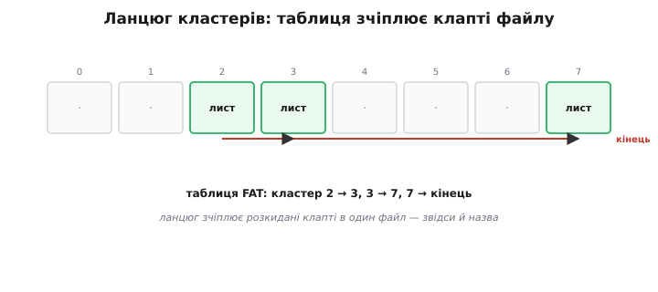
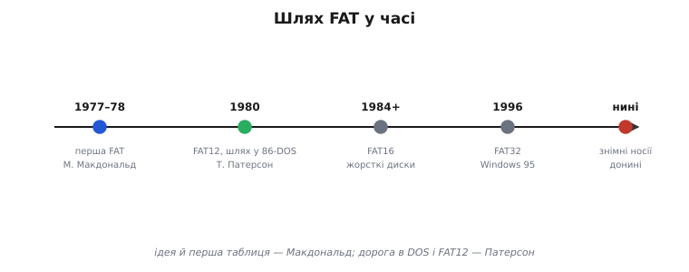
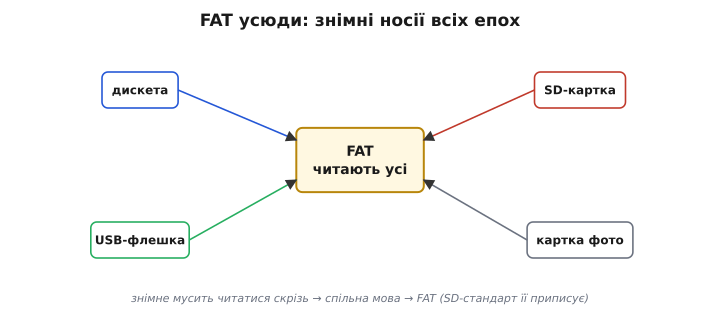

# 📜 FAT: файлова система 1977 року, що живе в кожній картці

SD-картку майже завжди форматують у FAT — стару, всюдисущу систему. Ось історія про те, як одна проста таблиця, придумана для конторського термінала півстоліття тому, пережила всіх і оселилася в кожному фотоапараті, флешці та картці.

## Загадка, з якої все почалося: де лежить файл?

Уявіть найперші дискети кінця 1970-х. Диск поділений на однакові комірки — **кластери**, — і файл, більший за один кластер, доводиться класти **клаптями** в кілька, не конче сусідніх. Виникає питання, без якого нема файлової системи: **як потім зібрати файл назад**? Як знати, що «лист.txt» — це кластери 2, 3 і 7, саме в такому порядку, а не 2, 5, 9?

Відповідь, що її знайшли тоді, була проста й елегантна: завести окрему **таблицю**, де для кожного кластера записано, який кластер **наступний** у його файлі. Кластер 2 каже «далі 3», кластер 3 — «далі 7», кластер 7 — «кінець». Виходить **ланцюг**, що зчіплює розкидані шматки в цілий файл. Ця «таблиця розміщення файлів» — *File Allocation Table* — і дала системі назву **FAT**.

*Файл лежить на диску клаптями (кластери 2, 3, 7), а таблиця для кожного кластера каже, де наступний: 2 → 3 → 7 → кінець. Ця «таблиця розміщення файлів» і дала системі назву FAT.*

## Марк Макдональд і таблиця 1977 року

За цією ідеєю стоїть конкретна людина — **Марк Макдональд** (Marc McDonald), перший штатний працівник молодої тоді Microsoft. Він спроєктував і написав першу FAT приблизно в **1977–78 роках**, відштовхуючись від обговорень із **Біллом Ґейтсом** (Bill Gates). І — деталь, що любить губитися — зробив це **не** для персонального комп'ютера (їх іще майже не було), а для скромного **термінала введення даних** на базі процесора 8080, з 8-дюймовими дискетами, під Microsoft-івський Standalone Disk BASIC.

Тобто FAT народилася не як «файлова система для майбутніх ПК», а як практичне розв'язання конкретної задачі на конкретному конторському залізі. Таблиця тоді була **8-бітна** — крихітна, на маленькі дискети. Ніхто й гадки не мав, що ця проста ідея переживе півстоліття й розійдеться світом.

## Тім Патерсон і несподіваний шлях у DOS

Далі — поворот долі. У 1979–80 роках інженер **Тім Патерсон** (Tim Paterson) із компанії Seattle Computer Products робив операційну систему для нових 16-бітних процесорів Intel 8086. Він познайомився зі структурою FAT від Microsoft — і взяв її за основу, **розширивши** таблицю до **12 біт** (так звана FAT12), щоб адресувати більше кластерів. Його система звалася QDOS, потім 86-DOS.

Назва QDOS, до речі, розшифровувалась напівжартома — *Quick and Dirty Operating System*, «швиденька абияка система»: Патерсон зліпив її за лічені тижні, щоб було під чим запускати програми на новому 8086. Microsoft купила її напрочуд дешево (за сьогоднішніми мірками — копійки), ще не знаючи напевно, що IBM прийде саме по неї. Так FAT, що колись вийшла з Microsoft до Патерсона, **повернулася додому** — уже у складі ОС, яку Microsoft перепродала IBM. Кругообіг, гідний роману.

А далі сталося відоме: Microsoft **купила** 86-DOS, доробила її й продала IBM як **MS-DOS** — операційну систему для нового IBM PC. PC вистрелив, розійшовся мільйонами, — і **FAT поїхала разом із ним** у кожен дім та офіс. Файлова система конторського термінала раптом стала файловою системою цілого світу персональних комп'ютерів. Тут варто бути чесними з авторством: **ідея й перша FAT** — Макдональда (з подачі Ґейтса), а **шлях у DOS і розширення до FAT12** — Патерсона. Як майже завжди в техніці, це не подвиг одного генія, а **естафета** кількох рук.

## Як вона росла разом із дисками: 12 → 16 → 32

Диски більшали — і таблиця мусила ширшати, бо вузька не могла адресувати багато кластерів. Так FAT12 поступилася **FAT16** (для жорстких дисків 1980-х), а та згодом — **FAT32** (Windows 95 OSR2, 1996), що впоралася вже з гігабайтними дисками. Десь по дорозі додалися й **довгі імена файлів** — раніше їх тісно обмежувала схема «8 символів імені плюс 3 на тип».

Цифри в назвах — 12, 16, 32 — це й є **ширина** запису в таблиці: скільки біт відведено під номер кластера, стільки кластерів і можна полічити. Проста арифметика, що визначала межу: побільшити число — побільшити максимальний диск.

*Шлях FAT: ідея й перша таблиця — Марк Макдональд у Microsoft (1977–78); FAT12 і дорога в 86-DOS — Тім Патерсон (1980); далі FAT16, FAT32 (1996) — і знімні носії донині.*

## Чому вона оселилася у вашій картці

Аж тут — головне для нас. Чому **знімні** носії — дискети, потім USB-флешки, а тоді SD- й фотокартки — майже всі говорять саме на FAT?

Бо знімний носій мусить читатися **скрізь**: устромив у Windows — прочиталось; переткнув у Mac чи Linux, у фотоапарат, у магнітолу — теж прочиталось. Для цього потрібна **спільна мова**, яку розуміють усі. А FAT на той час уже знали всі — проста, документована, всюдисуща. Тож вона природно стала **стандартом де-факто** для знімних носіїв. Дійшло до того, що офіційний стандарт SD-карток **прямо наказує** форматувати їх у FAT (а великі — у її нащадка exFAT). Ось чому ваша [SD-картка](topic:sf-data/flash-filesystems) майже напевно у FAT: не через якусь технічну вищість, а через **сумісність** — найкоротший шлях бути прочитаним будь-де.

*Знімні носії всіх епох — дискета, USB-флешка, SD- й фотокартка — говорять на FAT, бо її читають геть усі пристрої. SD-стандарт навіть прямо приписує формат FAT.*

## Патенти, суди й несподіване примирення

Така всюдисущість мала й юридичний бік. Microsoft роками тримала **патенти** на деякі прийоми FAT — зокрема на хитрий спосіб уживляти **довгі імена файлів**, лишаючись сумісним зі старою схемою «8+3». І ці патенти пускала в дію: гучний випадок — позов **проти TomTom** (2009), виробника навігаторів, чиї пристрої працювали на Linux із FAT. Справа скінчилася мировою: TomTom узяв ліцензію й за два роки прибрав запатентовану технологію. Для світу відкритого ПЗ FAT надовго стала символом патентного тиску.

А тоді — несподіваний поворот. У **2019 році** Microsoft **відкрила** специфікацію свого новішого exFAT і передала відповідні патенти спільноті (через Open Invention Network), а підтримку exFAT невдовзі додали прямо в ядро Linux. Те, що десятиліттями було яблуком розбрату, стало нарешті спільним надбанням. Файлова система конторського термінала пройшла повний цикл: від приватного рішення — через світовий стандарт і патентні війни — до відкритого спадку.

## Що лишилося нам у спадок

У цієї довговічності є й зворотний бік, про який корисно знати інженерові. FAT — дитя 1970-х, і вона **не вміє** багато з того, що вміють сучасні файлові системи: у ній нема журналу (того самого [захисту цілості запису](topic:sf-data/write-integrity)), тож висмикнута посеред запису картка легко **псується**; вона схильна до фрагментації. Є в неї й вічний компроміс **розміру кластера**: дрібні кластери ощадливі до місця, але роздмухують таблицю; великі — навпаки, марнують місце на дрібних файлах, бо кожен файл займає цілий кластер, хоч би яким крихітним був. Цей вибір «таблиця проти витрат» супроводжує FAT від першого дня — наочний приклад того, що в інженерії задарма не буває нічого. Її терплять не за досконалість, а за **сумісність** — за те, що її читають геть усі.

І все ж сам факт вражає: проста таблиця-ланцюг, придумана 1977 року для конторського термінала з 8-дюймовими дискетами, досі лежить у мільярдах карток пам'яті по всьому світу. Небагато інженерних рішень живуть так довго. Коли наступного разу форматуватимете [SD-картку у FAT](topic:sf-data/flash-filesystems) для свого ESP32, згадайте: ви користуєтесь однією з найдовговічніших ідей в історії обчислень — і знаєте тепер, звідки вона й чиїми руками зроблена.
